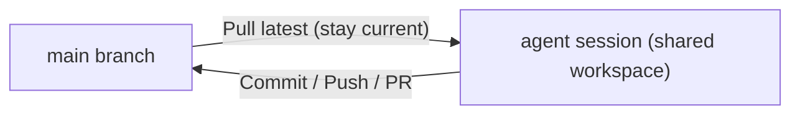

# Agent Manager Workflows

If you already use Kilo Code's single-session chat (an "Open in Tab" editor panel) and want to start running multiple agents in parallel, this page is the fastest path to productive. For the full reference of buttons and settings, see the [Agent Manager reference](/docs/automate/agent-manager).

## Single Chat vs. Agent Manager

- **Chat (editor tab)** — one agent on your current branch. Best for small, interactive tasks where you want tight feedback.
- **Agent Manager** — multiple agents running in parallel at the workspace root, each in its own tab. Best for long-running work, trying several approaches, or delegating independent areas of a larger task.
- **Multiple sessions in the same workspace** (`Cmd+T` / `Ctrl+T`) — separate conversations sharing the same directory. Useful for planner + implementer splits or read-only investigations alongside the main agent.


All Agent Manager sessions use the extension's embedded runtime and share the workspace directory. Providers, BYOK keys, custom providers, models, and extension settings are shared with the editor-tab chat.



Agent Manager sessions do **not** get per-session git worktree isolation. Every session operates on the same checkout: the same branch, the same files, and the same working directory. Read-only work is always safe; work that edits files needs coordination so two agents do not overwrite each other.


## What parallelizes well

Parallel work pays off when sessions are **independent** — neither one's output depends on the other, and they edit different files.

- **Good candidates:** independent features in separate modules, module-scoped refactors, a feature plus an unrelated bug fix, trying 2–4 approaches to the same problem where the approaches touch different files.
- **Poor candidates:** tasks editing the same files, steps with tight sequential dependencies.
- **Always safe:** read-only work (investigation, code tours, running tests, log analysis). Nothing touches the filesystem, so multiple sessions never collide.

## The default loop

Every productive Agent Manager session follows the same rhythm:

1. **Start a session** (`Cmd+T` / `Ctrl+T`) and describe the task.
2. **Let the agent run.** Switch to another session, another tab, or step away.
3. **Verify manually.** Before you trust "all tests pass", open the session's terminal (`Cmd+/` / `Ctrl+/`) and run the tests yourself.
4. **Review the changes.** Expand the turn's diff summary and click individual files for a native VS Code diff. If the work needs another pass, reply in the session.
5. **Iterate.** Re-run, re-review. Repeat until the diff is ready — not until the agent says it is done.
6. **Roll back if needed.** Use **Revert to here** on any user message to restore the workspace to an earlier point, then branch off with a new message.

The single biggest lever on this loop is **keeping each session's scope small**. A small diff tests quickly, reviews quickly, and merges quickly.

## Coordination in a shared directory

Because sessions share one checkout, treat the workspace like a team repo:

- **Assign file ownership.** Tell each session which directories or files it owns, and keep those sets disjoint.
- **Commit or push often.** If a session needs to see another session's finished work, have the first session commit and push; the second can pull and rebase. Uncommitted changes in the shared working tree are not isolated, so do not rely on the working tree to pass state between sessions.
- **Coordinate shared state.** Only one process can bind `localhost:3000`; only one cache directory should be written at a time. Read addresses and paths from the environment instead of hardcoding them.
- **Resolve conflicts with context.** If two sessions touched the same file, tell the agent what each side was trying to do: "Session A added X. Session B changed Y. Both need to survive."

## Workflows

### 1. Side quest

Something unrelated came up while you are mid-task. Start a new session for it (`Cmd+T`), let the agent work, review when it is done. Your main session is unaffected.

### 2. Build a skeleton, then split the work

For multi-part features where several pieces share a few core contracts — types, API boundaries, folder layout:

1. Build the walking skeleton in one session or a plain chat session. Update AGENTS.md with the conventions.
2. Merge it, then start one session per feature slice, each with explicit file ownership.
3. Integrate slices in dependency order as each goes green.

This mirrors how a human team works: agree the API contract first, then split backend and frontend in parallel. The contract removes the need to coordinate mid-flight.

### 3. Multiple approaches in parallel

For genuinely hard tasks where you do not know which approach will work:

1. Start 2–4 sessions, one per approach, each with a different prompt.
2. Optionally assign a different model to each session.
3. Review the diffs, pick the winner, and discard the rest (or keep the runner-up as a fallback).

Because sessions share the working directory, give each approach a distinct directory or file set, or have them only produce proposals and diffs rather than editing shared files.

### 4. A session per bug

For a day of small fixes: one session per bug (`Cmd+T`), each fix scoped to its own files, integrate each quickly so none drift. Close the session when the fix lands.

### 5. Multiple sessions on one branch

Press `Cmd+T` / `Ctrl+T` to open another session in the same workspace. Useful for:

- **Planner + implementer.** One session researches or plans; the other implements with a clean context.
- **Fresh context on a long conversation.** Start a new tab, summarize the current state, continue there. The old session stays available.
- **Read-only investigations** alongside the main agent — always safe because nothing touches the filesystem.
- **Forked exploration.** Use **Fork Session** to spawn a new session seeded with an existing conversation, then steer it differently without losing the original.

Sessions sharing a workspace can see each other's commits, so write-heavy work needs the file-ownership discipline described above.

## Running and testing

- **Session terminal** (`Cmd+/` / `Ctrl+/`) — rooted at the workspace directory, shared by all sessions. Use it for one-off tests, `git status`, reproducing a bug by hand.
- **Read-only checks** — run test suites or log analysis in one session while others work; as long as nothing writes to the shared tree, there is no collision.

### Parallel sessions need non-shared state

The moment two sessions both try to use the same external resource — a port, a cache, an emulator, a container — they collide. Only one process can bind to `localhost:3000`; only one simulator can be "the simulator".

Two fixes, in order of preference:

1. **Change the app to read the address from the environment** with a free-port fallback. This solves the problem everywhere — Agent Manager, CI, tests, teammates — not just here.
2. **Assign a unique value per session** in the command that starts the resource, derived from the session or a dedicated variable.

The same applies to caches (avoid pointing `CARGO_TARGET_DIR` at a shared path), emulators (create a named simulator per session), and containers (use unique container names or `COMPOSE_PROJECT_NAME`).

If your app or framework supports `PORT=0`, that can be even simpler for local-only work because the OS chooses a free port. The tradeoff is that the URL changes each run.

## Reviewing changes

Layer review in before asking a teammate:

- **Turn diff summaries** — each turn that modified files lists the changed files with addition/deletion counts. Click a file to open a native VS Code diff.
- **`/review`** — slash command, AI review of staged, unstaged, and untracked changes when run without arguments. Good as a last pass before committing.
- **`/review uncommitted [guidance]`** — explicitly review uncommitted changes, optionally focusing the review with guidance.
- **`/review branch [base] [guidance]`** — review the whole branch vs. its detected or specified base, with optional guidance.
- **`/review <commit-hash>` or `/review <PR URL or number>`** — review a specific commit or pull request.
- **`kilo review` in CI** — automated PR review. See [Code Reviews](/docs/automate/code-reviews/overview) for the setup.
- **Human review** — commit and push from a session terminal, then open a PR the normal way.

A typical sequence: self-review the diff summaries → `/review` → commit → push → CI review → teammate review.

## Rolling back work

The Agent Manager integrates the checkpoint system directly into each conversation:

1. **Revert to here** — hover over a user message and click the revert button to restore the workspace to the state just before that message was sent. The session records the rollback and hides later messages.
2. **Revert Banner** — shows how many messages were reverted and which files changed. Use **Redo** to step forward, or **Redo All** to restore the latest state.
3. **Branch off** — send a new message while reverted to make the rollback permanent and continue from the restored point.

This is snapshot-based and non-destructive until you send a new message, so you can compare different states of your code freely. See [Checkpoints](/docs/code-with-ai/features/checkpoints) for details.

Because all sessions share the working directory, rolling back one session restores files for every session — coordinate rollbacks so you do not undo another agent's committed work.

## Integrating finished work

Over a session's life you will integrate in two directions: from the session back to your main branch (integrating the work), and from the main branch into the session's view (staying current).

### Session → main branch

Two ways, pick based on how much collaboration the change needs:

- **Commit and push directly** — from the session terminal: `git add` the session's files, commit, then `git push` (optionally followed by `gh pr create --fill`). Fastest path for solo work.
- **Open a PR** — commit, push the branch, and open a PR from the terminal or the GitHub UI.

### Main branch → session

When the main branch moves ahead, ask the agent from the session:

> Merge the latest `origin/main` into this branch and resolve any conflicts. Do not use `git stash`.

Save this as a reusable slash command if you do it often.


**Do not use `git stash` to park uncommitted work when coordinating sessions.** Stashes live in the shared `.git` directory that every session's checkout points at, so a stash made by one session can be popped by another — crossing uncommitted changes between agents. Use a WIP commit or a temporary branch instead.


### When several sessions finish at once

Integrate the most foundational one first. Then, in each remaining session, ask the agent to pull the updated branch in (same prompt as above) before committing and pushing its own work.

## Hygiene

- Integrate within a day or two. Past that, pull the main branch into the session rather than letting it drift.
- Periodically clean up dependencies, build output, containers, volumes, simulators, and databases created by parallel sessions. All sessions share the workspace, so these resources accumulate in one place.
- Do not run more than four or five agents at once. The practical limit is review and integration cost, not memory.

## Common mistakes

- **Too many agents.** Coordination overhead exceeds the throughput gain above four or five.
- **Overlapping file edits in parallel sessions.** Sessions share the filesystem — two agents editing the same file will clobber each other. Assign disjoint file ownership.
- **Skipping manual verification.** Trust the agent, but confirm with the session terminal.
- **Stale shared context.** Update AGENTS.md before a swarm, not mid-flight.
- **Hardcoded shared state.** Fixed ports, fixed container names, "the simulator" — refactor to take values from the environment.
- **`git stash` across sessions.** Stashes cross between sessions.

## Cheatsheet

| Situation | Where |
|---|---|
| Small, interactive task | Chat (editor tab) |
| Long task, want to do something else meanwhile | New Agent Manager session (`Cmd+T`) |
| Two or three approaches, pick the winner | Parallel sessions, one per approach |
| Separate conversation on the same branch | New tab (`Cmd+T`) |
| Long conversation, want a fresh context | New tab, summarize |
| Run the app to verify | Session terminal (`Cmd+/`) |
| One-off git or shell commands | Terminal (`Cmd+/`) |
| Roll back an agent's changes | Revert to here on the user message |
| Team review | Commit + push + PR |

## Related

- [Agent Manager reference](/docs/automate/agent-manager)
- [Checkpoints](/docs/code-with-ai/features/checkpoints)
- [Code Reviews](/docs/automate/code-reviews/overview)
- [Shell integration](/docs/automate/extending/shell-integration)
