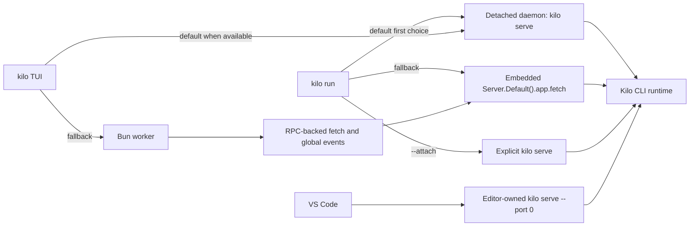
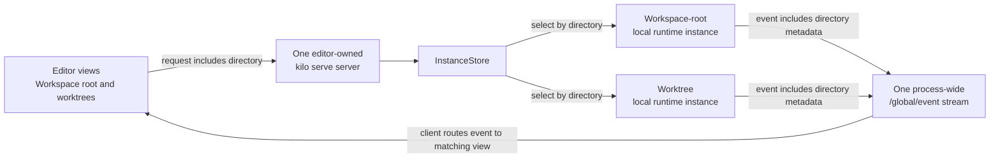
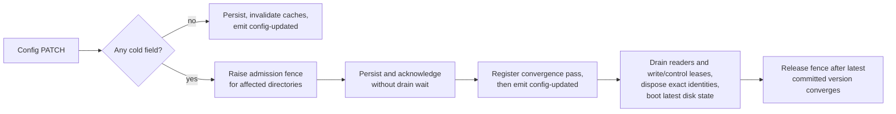

# CLI Runtime Architecture

The CLI (`packages/opencode/`) is Kilo Code's local agent engine. It owns agent execution, tools, sessions, provider integration, configuration, local persistence, directory routing, and HTTP surfaces used by editor clients.


This page describes repository-defined local runtime behavior. It is not an endpoint catalog or a statement about cloud deployment configuration.


## Concepts

These terms describe local execution. They are separate from hosted Cloud Agent sessions described in [Cloud Platform](/docs/contributing/architecture/cloud-platform).

| Term | Meaning |
|---|---|
| Kilo CLI runtime | Local agent engine in `packages/opencode/` |
| `kilo serve` server | Local HTTP and SSE process used by editor clients; selected browser-oriented paths also use WebSocket |
| Local daemon | Detached reusable `kilo serve` server managed by `kilo daemon` commands |
| Directory context | Normalized local filesystem directory used to select local runtime state |
| Local runtime instance | Directory-keyed runtime context inside one Kilo CLI process |
| Local routing workspace | Optional routing context that can resolve to a local directory or remote target |
| Worktree directory | Alternate git worktree path used as directory context for isolated concurrent work |
| Process-shared state | Runtime service state shared by every directory context in one Kilo CLI process |
| Modes | Configurable agent presets for tools, prompts, restrictions, and behavior |
| MCP | Protocol for extending agent tools |

One `kilo serve` process can host several local runtime instances. Directory-keyed state stays isolated. Process-shared service state does not.

## Command entry points

| Entry point | Command or caller | Runtime model |
|---|---|---|
| Interactive TUI | `kilo` | Attaches to local daemon when available; otherwise starts Bun worker and sends SDK-shaped requests over RPC |
| Headless run | `kilo run` | Uses daemon attach when available, then embedded server fetch fallback |
| Attached run | `kilo run --attach <url>` | Targets explicit running `kilo serve` server |
| Explicit API server | `kilo serve` | Starts HTTP + SSE server for external local clients |
| Local daemon | `kilo daemon start` | Starts detached `kilo serve` child for reuse |
| Editor-spawned server | VS Code client | Starts bundled `kilo serve --port 0` child owned by editor client, not local daemon manager |



TUI fallback is not direct call from UI thread to embedded fetch. UI thread starts `worker.ts`; worker RPC method constructs request, calls `Server.Default().app.fetch()`, and forwards global events back to UI thread.

## One server with multiple directory contexts

Each running editor host starts one editor-owned `kilo serve` server. That server can handle coding sessions for workspace root and additional worktree directories at same time. It does not start separate server process for each directory.



| Step | What happens | Why it matters |
|---|---|---|
| Send request | Editor client includes directory with local API request | CLI can distinguish workspace root from other directory contexts |
| Select state | `InstanceStore` normalizes directory and selects directory-keyed local runtime instance | Sessions for alternate directories keep isolated runtime state |
| Return events | Server publishes event with directory metadata through shared `/global/event` SSE stream | Editor client routes event to matching directory and session view |

This distinction matters for directory-scoped workspace requests. Directory-keyed state stays isolated. Process-wide event stream and server-owned service state remain shared; snapshot slow-track guard is one example. Authentication, provider routing, SSE, and snapshots appear in later sections.

## Authentication boundaries

Three credential boundaries coexist. Keep them separate when tracing request path or changing authentication code.

| Boundary | Protects | Owner |
|---|---|---|
| Local `kilo serve` access | HTTP, SSE, and selected WebSocket access to local server | Kilo CLI server and spawning local client |
| Outbound provider authentication | Model provider, Kilo Gateway, catalog, and indexing access | Kilo CLI provider router and auth stores |
| Remote MCP OAuth | Browser authorization and credentials for remote MCP server | Kilo CLI MCP runtime |

### Local `kilo serve` access

Server Basic Auth is optional. It becomes required when `KILO_SERVER_PASSWORD` is non-empty. Default username is `kilo`; `KILO_SERVER_USERNAME` can override it.

| Path or mode | Authentication behavior |
|---|---|
| Normal HTTP and SSE | Basic `Authorization` header when server password is configured |
| Browser WebSocket | `auth_token` query parameter accepts base64 `username:password` because browser WebSocket constructors cannot set arbitrary headers |
| Public UI assets | Selected manifest and icon GET paths bypass Basic Auth so browser metadata can load |
| PTY ticket issue | Authenticated `POST /pty/{ptyID}/connect-token` requires expected ticket header and allowed origin |
| PTY ticket connect | `GET /pty/{ptyID}/connect?ticket=...` bypasses Basic middleware, then consumes single-use, scope-bound ticket in PTY handler |
| PTY shell child | Removes `KILO_SERVER_PASSWORD` and `KILO_SERVER_USERNAME` from spawned user-shell environment |

PTY connect supports two browser-oriented modes: loopback query credential mode (`auth_token`) used by the VS Code Agent Manager path, and short-lived ticket mode exposed by server API.

### Outbound provider authentication

Provider auth records use `api`, `oauth`, or `wellknown` variants in `${Global.Path.data}/auth.json`, written with mode `0600`. `KILO_AUTH_CONTENT` can supply process-local auth JSON. Separate v2 multi-account auth store also exists for account-oriented flows.

| Path | Behavior |
|---|---|
| Direct providers | Use provider-specific keys, OAuth records, environment values, and configured endpoints |
| Static catalog | Preset catalog removed in P4.4-G2 per LOCK-006 — `packages/opencode/src/kilocode/provider/models-api.json` (3 MB), `packages/core/src/models-dev.ts` (disk cache `models.json` / `models-<hash>.json`, `GET ${source}/api.json` fallback, 5-min TTL, 60-min background refresh, `kilo models --refresh`), `packages/core/src/kilocode/models-refresh.ts`, `packages/core/src/plugin/models-dev.ts`, `packages/opencode/src/provider/models.ts`, `packages/opencode/src/kilocode/provider/models-refresh.ts` / `models-snapshot-shape.ts`, `script/kilocode/refresh-models.ts` / `models-snapshot.ts`, build embedding `KILO_MODELS_DEV` / `MODELS_SNAPSHOT_RELATIVE` / `refresh:models` script and `KILO_MODELS_URL` / `KILO_MODELS_PATH` / `KILO_DISABLE_MODELS_FETCH` controls deleted; no preset catalog, snapshot, or models.dev network/disk/background-refresh runtime remains |
| Generic adapters | `BUNDLED_PROVIDERS` generic SDK loaders (`@ai-sdk/*`, `@openrouter/ai-sdk-provider`, etc.) retained per LOCK-006 |
| Custom providers | `provider.<id>` records with accepted AI SDK package, name, models, `baseURL`; lifecycle via `custom-provider-save` / `custom-provider-delete` / `provider-auth-lifecycle` — explicit config-defined models do not require a catalog |
| Custom endpoints | Provider config can override endpoint and credential options |

Preset catalog and models.dev fallback are fully removed in P4.4-G2 (LOCK-006 permanent removal — `models-api.json`, `models-dev.ts`, `provider/models.ts`, snapshot/build helpers, `KILO_MODELS_DEV` / `MODELS_SNAPSHOT_RELATIVE`, `ModelsDev` service/layer, and catalog-injection call sites). Generic `BUNDLED_PROVIDERS` adapters, `KILO_MODEL_SCHEMA_EXTENSIONS` / `patchConfigModel` helpers, and custom-provider save/delete/auth paths are retained; old CLI/TUI/server/generated-SDK surfaces remain until P4.5 per LOCK-009.

### Remote MCP OAuth

Remote MCP OAuth belongs to CLI runtime. Static headers remain supported. For OAuth servers, CLI handles browser authorization and stores credentials in protected local state; editor clients invoke CLI-owned flow instead of storing MCP credentials themselves.

## Directory routing and local runtime instances

Instance routes select directory context in this order:

1. `directory` query parameter.
2. `x-kilo-directory` request header.
3. Server process cwd.

Local routing workspace selection is separate. Session workspace, `workspace` query parameter, and `KILO_WORKSPACE_ID` can select workspace context. Configured `KILO_WORKSPACE_ID` keeps requests local to current workspace runtime. Other selected workspaces resolve through workspace-routing adapter to local directory or remote target.

| Request plan | Behavior |
|---|---|
| Local | Provides resolved directory and optional workspace ID to request handlers |
| Remote | Proxies HTTP or WebSocket request to adapter target |
| Missing workspace | Returns workspace-not-found response |
| Workspace-routing local | Keeps selected local routes on local server instead of proxying |

Remote HTTP proxy responses can include sync fence metadata. Router waits for matching sync progress before returning. `InstanceStore` normalizes directory keys, deduplicates concurrent boots with deferred entry, and disposes directory state through registered cleanup hooks.

## Core subsystems

| Subsystem | Purpose |
|---|---|
| Agent runtime | Orchestrates messages, model calls, permissions, questions, and multi-step execution |
| Tool registry | Loads built-in, Kilo-specific, and MCP tools |
| LSP client | Provides diagnostics and language intelligence |
| Config service | Merges global, project, organization, managed, and runtime inputs |
| Instance store | Caches normalized directory-scoped runtime contexts |
| SQLite and storage services | Persist structured records and remaining JSON-owned data |
| Snapshot service | Tracks git-backed file baselines for diffs and revert flows |
| Provider router | Resolves direct providers, Kilo Gateway, custom endpoints, and credentials |
| HTTP server | Publishes REST, WebSocket, and SSE surfaces |

## Daemon lifecycle

`kilo daemon start|status|stop|restart` manage a detached local `kilo serve` child, with bare `kilo daemon` equivalent to `kilo daemon start`.

| Area | Behavior |
|---|---|
| State file | `${Global.Path.state}/daemon.json`, written with mode `0600` |
| Log file | `${Global.Path.log}/daemon.log`, created with mode `0600` |
| Port allocation | For `--port 0`, scans `4097..4116` and chooses available port |
| Child process | Detached `kilo serve --hostname <host> --port <port>` process |
| Foreground mode | `--foreground` / `-f` keeps the invoking command attached; SIGINT, SIGTERM, or SIGHUP stops only the daemon identity it started or reused |
| Health | Probes authenticated `/global/config` with 2 second timeout |
| Reuse | Reuses daemon only when process is alive, config probe succeeds, and installed version matches |
| Cleanup | Terminates stale process when present, clears stale state, then starts replacement |
| Opt-out | `KILO_NO_DAEMON` disables automatic attach by clients; explicit daemon commands still manage daemon |

Daemon credentials differ from editor-spawned server credentials. Current daemon source stores username `kilo`, password `kilo`, and base64 Basic token in `daemon.json`. File permissions protect this local credential record. Editor clients generate random passwords per spawned server.

## Persistence

SQLite is default structured store.

| Area | Behavior |
|---|---|
| Default database | `${Global.Path.data}/kilo.db` |
| Override | `KILO_DB`; relative paths resolve under data directory; `:memory:` is accepted |
| Runtime pragmas | WAL journal, normal sync, 5 second busy timeout, foreign keys, passive checkpoint, bounded cache |
| Fresh DB auto-vacuum | Newly created canonical DBs use `PRAGMA auto_vacuum = INCREMENTAL`; existing legacy DBs keep their current mode |
| Schema changes | Drizzle migrations load from bundled journal in compiled binary or migration directories in development |
| Main tables | Projects, sessions, messages, parts, todos, permissions, session messages, session operations (Failure/Outcome), workspaces, sync events, accounts, and account state |
| Operation table | `session_operation` (session-scoped `session_id REFERENCES session(id) ON DELETE CASCADE`, `CHECK` for `op_kind`/`outcome`, indexes on `session_id`/kind/time; stores the full already-redacted `select(record,"persist")` nine-field FailureRecord with identity/session/kind/outcome/time/revision inspectable; not a file artifact, not a new DB/store, not a retry ledger) |
| Retention tables | `session_changefeed` (bounded payload-free deltas: global monotonic `seq`, `session_id`, `revision`, `kind`, `time`, no FK to `session`, `UNIQUE(session_id, revision, kind)`, 50,000 rows / 64 MiB logical caps), `session_changefeed_state` (singleton `latest_seq` / retained counts), and `retention_obligation` (durable artifact-cleanup obligations) |
| Legacy migration | On first database creation, CLI runs one-time JSON-to-SQLite migration for projects, sessions, messages, parts, todos, permissions, and shares |

Some JSON-backed storage remains. Session diffs still use storage path `session_diff`, and configuration, auth, and selected local state files retain their own owners. Snapshot storage is separate from SQLite and JSON storage.

### Operation/Outcome record (R11)

Canonical persistence for the bounded R11 foundation. Production provider wiring now uses this record at the repository-owned request/stream execution boundary; prompt, tool, permission, task, recovery, and disposition wiring remain outside this contract.

| Aspect | Behavior |
|---|---|
| Location | One canonical DB aggregate `session_operation` owned by the existing canonical DB, session-family cascade (`ON DELETE CASCADE`). Not a file artifact, not a new database/store, not a retry ledger, not changefeed history. Diagnostic and panel projections remain derived; no separate stores. Consumes R12 `normalize`, nine-field `FailureRecord`, `FIELD_TIERS`, redaction, cancellation provenance, and envelope version `1.0` unchanged. |
| Identity | SessionProcessor owns provider operation identity and uses stable constructors with admitted IDs: `prompt` → `prompt:<messageId>`; `provider` → `provider:<assistantMessageId>:<attempt>` with nonnegative integer `attempt`; `tool` → `tool:<assistantMessageId>:<callId>`; `permission` → `permission:<requestId>` under `permission`; `task` → `task:<childSessionId>(:<parentCallId>)?` with `parentCallId` only if needed for uniqueness. IDs are colon-free and validated; `parseOpId` checks kind prefix, segment counts, and integer attempt; cross-kind/cross-identity mismatches are rejected. |
| Shape | Validates R12-compatible `FailureRecord` (opId/opKind/outcome/code/message/time/cancel/detail/stack, closed `opKind`/`outcome`/`cancel.source` sets, `opId` prefix matches `opKind`, no extra fields). Persists `select(record,"persist")` — the full already-redacted record — with `op_kind`, `outcome`, `code`, `message`, `time`, `cancel` (source), `detail`, `stack`, and `revision` inspectable. |
| Write | `SessionOperation.put(db, sessionID, record)` is the sole operation writer and runs in one `BEGIN IMMEDIATE` transaction. One outer provider attempt has one admission and one in-flight/terminal outcome; inner transport or AI SDK retries do not create duplicate operations. If `opId` absent, inserts at `revision = new session revision` and advances `SessionRevision` with one payload-free `changed` feed row. If `opId` present, allows only idempotent replay (all persist fields equal) without revision/feed, or single forward transition `in-flight` → terminal (`succeeded`/`failed`/`ambiguous`/`superseded`/`abandoned`) which updates the row at the new revision and emits one payload-free `changed` feed row. Rejects cross-kind, cross-session identity, terminal→`in-flight` regression, terminal→terminal non-identical, and `in-flight`→`in-flight` non-identical conflicts without advancing revision or emitting a feed row. Existing `changed | deleted` changefeed kinds and caps remain unchanged. |
| Lifecycle and admission | Processor-owned provider records cover the in-flight and terminal lifecycle. Repository-owned HTTP and WebSocket transport boundaries admit the request immediately before concrete execution; the native route uses prepared `Transport.frames`, while the AI SDK path uses the repository-owned fetch adapter. Preflight, request-body validation, setup failure, and deleted-session early return occur before admission and produce no operation, revision, or feed mutation. |
| Scope | This landed wiring is limited to provider operation records. Recovery/disposition policy, retry-policy redesign, other operation kinds, public/generated surfaces, schema changes, and changefeed redesign are excluded. |
| Read | Deterministic `get(opId)` and `list(sessionID)` ordered by `op_id` ASC, round-tripping the stored persist projection with `revision` reflecting the transaction's new session revision. |
| Retention | No separate policy. Existing 8/6 GiB complete-family budget, seven-day/active/leased protections, and session cascade own these rows; family deletion cascade hard-deletes operations and retains the normal `deleted` tombstone. |

### Durable control operation — `session/cancelQueued` (G3-B0)

Backend-only, AppLayer-owned durable control. The single authority is `SessionOperation` + `SessionRevision` + `ConfigConvergence` + `InstanceStore`/`ControlLease`; no extension-local durable store and no second AppLayer.

| Aspect | Behavior |
|---|---|
| Owner | `CancelQueuedDispatch` Effect service wired once in `AppLayer` (`effect/app-runtime.ts`). HTTP `DELETE /session/:sessionID/queue/:messageID` is a thin adapter that synthesizes a server-owned `requestId`/`opId`/`idempotencyKey` (`legacy:<session>:<message>`) and delegates to the shared service, preserving the legacy `boolean` OpenAPI and SDK. Typed envelope (`v:1` result with `succeeded`/`failed`/`ambiguous`, scrubbed `normalize`/`cap`, `revision?: {session, config}` optional, never fabricated) is backend-internal; no `Unknown` weakening and no hand-edited SDK. |
| Identity | Canonical `cancelQueued:<sessionID>:<messageID>` opId validated by `SessionOperation` (`cancelQueued` kind, strict parser) bound to the target message; canonical directory from `SessionTable.directory`; `(sessionID, hash(idempotencyKey))` unique key (`sha256`, `UNIQUE(session_id, idempotency_hash) WHERE NOT NULL`). `parentSessionId` must be `null`. Multiple queued messages per session have distinct opIds; idempotencyKey remains the replay key. |
| Stale guards | Exact idempotency replay/conflict lookup occurs before freshness guards, so a terminal/in-flight record with same facts replays even when its original revision is now stale. Stale checks apply only to new reservation: `context.sessionRevision` compared to authoritative `SessionTable.revision` (revalidated transactionally inside `BEGIN IMMEDIATE` **after** idempotency lookup and **before** insert; only absent `(sessionID,hash)` undergoes stale validation; stale returns typed `failed` with no reservation or side effect) and `configVersion` compared to `ConfigConvergence.getBootedVersion(canonicalDir)` (re-read immediately before transaction and again before side effect; if config changed unfavorably after reservation, leave `in-flight` ambiguous and perform no side effect). Directory mismatch is `scope_mismatch`. `session.not_found` and `validation.failed` are typed. `revision` is optional and never fabricated (`0,0` or arithmetic). |
| Durable state machine | Reserve `in-flight` (`cancelQueued` op) in one `BEGIN IMMEDIATE` transaction before any queue side effect. Same facts replay the stored terminal without advancing revision or re-executing; differing facts with same key is typed `conflict`. Existing `in-flight` returns `ambiguous` and never re-executes. After reservation: `pending` true → `cancelOne` → `removeMessage` (EventV2 `MessageRemoved` projector advances one revision) → terminal `succeeded {cancelled:true}` (total 3 revisions); `running`/not-pending → terminal `succeeded {cancelled:false}` (total 2). Terminal replay never calls `cancelOne`/`removeMessage` or advances revision. |
| Revision / feed | Uses canonical `SessionRevision.advanceTx` (payload-free `changed` feed). Preserves `MessageRemoved` projector as the sole delete/revision path. |
| Drain-control | HTTP middleware snapshot-first lane remains valid. Shared dispatch invoked from an already-provided `InstanceRef` never reacquires a lease. Non-HTTP callers without an `InstanceRef` acquire via `acquireDrainControl` (`snapshot` + `ControlLease.acquire`, `409` during fence without snapshot, otherwise normal `gate.acquire`+`InstanceStore.load` plus `ControlLease.acquire` held through dispatch then released). Running slot is never interrupted. |
| Failure handling | All observable failures are typed through `SessionOperation.normalize`/`scrub`/`cap` and projected as `failed`/`ambiguous` with `retryable` and best-effort optional `revision` (never fabricated `0,0` or `+1/+2`); only `InstanceUnavailableDuringConfigRebuild` maps to `409`, other store/gate/DB defects map to typed `internal`; recovery projection is defect-safe. Provider operation paths and tests are preserved. |
| HTTP adapter | Legacy `DELETE /session/:sessionID/queue/:messageID` retains `boolean` success (`Schema.Boolean`) and returns `boolean` only on `succeeded` (`cancelled:true/false` for pending/running). Typed `stale`/`conflict`/`ambiguous`/fence (`409`), `scope_mismatch`/`validation.failed` (`400`), `session.not_found` (`404`), and `internal` (`500`) map to declared HTTP errors, not `false`; unexpected dispatch defects map directly to `500` without fabricated revision. |

G3 remains **Active** and the SDK bridge remains authoritative. No transport cutover, retry scheduler, or broader gate closure is in scope for B0.

### Private `session/cancelQueued` carrier over `kilo serve` fd3/fd4 (G3-B1) — parity-only, same AppLayer

B1 adds one private transport narrowly for `session/cancelQueued` over the existing `kilo serve` process extra fds, terminating at the same `AppRuntime` dispatch. Generated SDK HTTP remains the authoritative path; the private path is terminal-replay parity observation only. No new TCP listener, no Unix socket, no second runtime, and no SDK regeneration.

| Aspect | Behavior |
|---|---|
| Carrier | `ServerManager` spawns `bin/kilo serve --port 0` with 5 stdio entries (`stdio[3]` private writer, `stdio[4]` private reader). `kilo serve` (`cli/cmd/serve.ts`) after `Server.listen` dynamically imports `kilocode/server/fd-carrier.ts` and calls `tryStartFdCarrier()`; failure warns and keeps `null`. `shutdown` disposes the carrier before `InstanceRuntime.disposeAllInstances` and `server.stop`. Both fds must pass `fstatSync` and env must have `KILO_PARENT_PID` or `KILO_CLIENT=vscode` — otherwise fail-closed and SDK keeps working (Bun FIFO quirk requires both fds, not just fd3). `stdout` port discovery (`kilo server listening on http://127.0.0.1:<port>`) remains unpolluted. |
| Protocol | JSON-RPC 2.0 length-framed (`private-worker/peer.ts` + `frame.ts`) over fd3/fd4. `initialize` with `protocol:{name:"kilo-private",major:1,minor:0}` + `capabilities:["session/cancelQueued"]` must match `validateProtocolVersion` and `buildInitializeResult()` (`protocolVersion "1.0"`). Minor is ignored, major 2 is `InvalidParams` fail-closed, second init is `InvalidRequest Already initialized`, pre-init domain call is `InvalidRequest Not initialized`, unknown method is `MethodNotFound`, malformed `Content-Length` is `ParseError` and closes poison. EOF pending is `InternalError`. Supports pipelined frames and UTF-8 split. |
| Ownership | Single authority remains `CancelQueuedDispatch` in `AppLayer`. `fd-carrier.ts` routes `session/cancelQueued` after `isInitialized()` via `AppRuntime.runPromise(Effect.gen { yield* CancelQueuedDispatchService; yield* svc.dispatch(params) })` using the same envelope (`v:1`, `normalize`/`scrub`/`cap`, optional `revision`). No `Promise` facade, no new DB, no new authority. |
| Lifecycle | `ServerManager` owns the two private streams and `epoch`/`pid`; `releasePrivateStreams` destroys both on exit/dispose with exact-PID kill (decoy pid never killed). `KiloConnectionService` owns `ServePrivatePeer` and clears `privatePeer`/`privateAvailable`/`privateEpoch`/`privatePid` on dispose/reset/exit; `initPrivatePeer` is void-fired after connection, epoch-coherent, handles null streams/unavailable/timeout/mismatch/capability-missing as fail-closed. Restart proves new `epoch`/`pid`/`port` with 5 stdio and re-negotiation; unavailable peer keeps SDK HTTP working. |
| Parity-only | Extension `KiloProvider.handleCancelQueued` is SDK-first: it always calls `client.session.cancelQueued` with `legacy:session:message` durable key and `cancelQueued:session:message` opId. `response.status` (100–599 integer, string numeric accepted) is authoritative for terminal gate (`400/404/409/500` terminal, otherwise non-terminal such as `429`). Only when terminal and `isPrivateAvailable()` does it call `privateCancelQueued` with a fresh `requestId` (same `idempotencyKey`) and 3 s timeout (timeout → `ambiguous transportUnknown true`). `compareParity` observes `transport-unknown`, `cancelled-mismatch`, `failure-class-mismatch` against `response.status` class mapping (`400`→`validation.failed/scope_mismatch`, `404`→`session.not_found`, `409`→`stale/conflict/InstanceUnavailableDuringConfigRebuild`, `500`→`internal`), logs `[Kilo PrivateParity] divergence` or `parity match`, and never influences the user-visible SDK boolean or second queue transition. Duplicate `idempotencyKey` replays the durable terminal without new revision. |
| Cross-platform residual | Darwin has real `ServerManager`→`kilo serve`→fd3/fd4→same `AppLayer` production proof (`server-manager-integration.test.ts` rebuilt `bin/kilo` mtime/size, exact cleanup). Linux and Windows have no overstated production proof; both remain fail-closed and SDK-authoritative. Windows Node parent→compiled Bun extra-fd is residual unless actual Windows evidence exists. |
| Non-goals | Deferred: `fork`/`update`/`command`/`prompt`/`provider`/`config`/private-query families, retry scheduler, crash recovery, durable retry accounting, five-boundary convergence closure, observation worker replacement, Unix socket, second TCP listener, G2 cleanup. `queued=true` production via private carrier is not claimed — that branch is covered by B0 deterministic `CancelQueuedDispatch` tests. G3 remains Active and Gates B/C/D/E/F do not close overall. |

### Durable title-only — `session/update` (G3-B2)

B2 is a title-only durable lane for `PATCH /session/:sessionID`. Legacy `metadata`/`permission`/`time.archived` PATCH remains compatible non-durable. Generated SDK `PATCH` remains authoritative; private fd3/fd4 is terminal-replay parity only. No new TCP listener, no Unix socket, no second runtime, no SDK hand-edit.

| Aspect | Behavior |
|---|---|
| Identity | Canonical per-operation `sessionUpdate:<sessionID>:<token>` (`token` is `crypto.randomUUID()` per semantic rename, non-empty, no `:`). Base `sessionUpdate:<sessionID>` remains allowed for legacy compat. `parseOpId` allows 1-2 segments for `sessionUpdate` and binds `parts[0]` to `context.sessionId`. Same `idempotencyKey` (`sessionUpdate:<sessionID>:<token>` identical to `opId`) is shared by SDK and private for one operation; distinct renames get distinct tokens → distinct `op_id` primary keys, no PK rollback. `isSessionUpdateConflict` checks `opId` + `directory` + `parentSessionId` + `configVersion` + `sessionRevision` + `title`. |
| Storage | `session_operation` (`op_id TEXT PRIMARY KEY`, `op_kind CHECK` includes `sessionUpdate`, `title TEXT`, `result_snapshot TEXT` JSON of serialized `SessionTable` row converted/validated as `Session.Info`, `revision INTEGER`, `UNIQUE(session_id, idempotency_hash)`) plus `directory`, `parent_session_id`, `config_version`, `session_revision`, `request_id`. Migration `20260830000000_add_session_update_snapshot` adds `result_snapshot`. |
| Commit | `insertSessionUpdateSucceededTx` + `EventV2.recordProjectedTx` in one `BEGIN IMMEDIATE`: `UPDATE session SET title, time_updated, revision=revision+1` → `SELECT` updated row → `JSON.stringify(row)` as `result_snapshot` → `INSERT session_operation revision=nextRev` → `Changefeed.appendTx(changed)` → `EventV2.recordProjectedTx(tx, SessionV1.Event.Updated, {sessionID, info}, {location})` (location from persisted `SessionTable.workspace_id` including explicit absence + `ProjectTable.worktree` for `project.directory`, `directory` is canon session dir; centralized encode via `syncRegistry`, allocate `EventSequence latest+1` as independent monotonic `seq` (never `revision`), run `beforeCommit` guards but skip projectors, enforce `EventTable` uniqueness) → inserts `EventSequence` + `EventTable` (`session.updated.1`). Commit 后 `EventV2.notifyCommitted` via `wakeAggregate` + `syncHandlers` + `listeners` + `EventV2Bridge` (explicit `event.location` wholly authoritative when present — no per-field ambient `WorkspaceRef` fill; absent location falls back to ambient `InstanceRef`/`WorkspaceRef`). Isolated via outermost `Effect.catch` + `Effect.catchDefect` with `sessionUpdate` logger — defect/failure still returns `succeeded`. Exactly one revision/one `changed`/one operation/one `EventSequence`/one `EventTable` atomically; `seq>0` monotonic and independent; same-key replay allocates/notify nothing; `beforeCommit` die rolls back all five surfaces with zero notification; `aggregateEvents` woken after commit. |
| Replay | Fast-path `getSessionUpdateByIdempotencyHash` before tx and in-tx `getSessionUpdateByIdempotencyHashTx` (`isSessionUpdateConflict` on `opId`/`directory`/`parentSessionId`/`configVersion`/`sessionRevision`/`title`). If `succeeded`, validate serialized `SessionTable` row in `result_snapshot` structurally against canonical `Session.Info` (decode/validator — not just object/`fromRow`) and return validated `Session.Info` with `makeRevision(existing.revision, currentConfigVer)` — not mutable current `Session` row; present-but-invalid `result_snapshot` fails closed `internal` without fallback to mutable `Session`, absent legacy snapshot is `internal` for private and public legacy fallback only where documented. `opId` PK collision (`get`/`getTx` by `op_id`) → typed `conflict` before any `title`/`revision`/`feed` mutation, no `SQLITE_CONSTRAINT_PRIMARYKEY` as `internal`. Same-key replay advances no revision/feed. Conflict → `failed conflict`, stale → `failed stale`; `SessionRevision.get`/`ConfigConvergence.getBootedVersion` read failures fail closed `internal` via existing `ConfigConvergence` boundary with a single continuous `GenerationGate` reader lease (statically verified, no release/reacquire gap; barrier active → `409 InstanceUnavailableDuringConfigRebuild` verified via active-barrier test) before mutation. |
| HTTP binding | `PATCH /session/:sessionID` (`UpdatePayload` `idempotencyKey`/`requestId`/`opId`/`context` optional, `context` `configVersion`/`sessionRevision` are `Int` finite safe integers, `additionalProperties: false` enforced via `updateRaw` raw JSON `allowedRoot`/`allowedCtx` check before `Schema.decode`). `requireSession` first. `isDurable` when any durables present (no durable fields → legacy non-durable). Durable requires the complete tuple `title` + `idempotencyKey` + `requestId` + `opId` + explicit `context` (`directory` + `sessionId` required, `parentSessionId` optional in public contract but normalized to `null` after `context` presence is validated, `configVersion`/`sessionRevision` optional freshness guards) — omitted `context` or partial tuple → `400`; `context.sessionId` must equal URL `sessionID` else `400`; `context.directory` is used verbatim with no fallback to current session directory. No reachable fallback synthesis for `requestId`/`opId`/`idempotencyKey`/`directory`/`parentSessionId` without explicit `context` — missing tuple is rejected as `validation.failed`. `dispatch` maps `session.not_found→404`, `validation.failed/scope_mismatch→400`, `stale/conflict→409`, `internal→500`. Non-durable `title`/`metadata`/`permission`/`time.archived` path unchanged and creates no `session_operation`. Legacy callers omitting durable identity remain non-durable; B2 `renameSession`/`renameSessionWithResult` via `buildSessionUpdateIdentity` opt in explicitly. |
| Private validation | `serve-private-peer.ts` `validateSessionUpdateRequest` mirrors backend: `isAbsolute` directory, `SessionID` via `typeof value === "string" && value.startsWith("ses")` (accepts colon/space schema-valid forms), `parentSessionId` **required and must be `null`** (omitted or non-null → `validation.failed`), `configVersion`/`sessionRevision` safe `Int` (`isSafeInteger` ≥0), `payload.title` via `validateTitleStrict` (trim/200/control), strict `unexpected field` at root/context/payload, `opId` `parseSessionUpdateOpId` binding `parts[0]===sessionId` (allows `sessionUpdate:<id>` or `sessionUpdate:<id>:<token>`, token non-empty no `:`). `validateSessionUpdateResult` enforces `v`/`requestId`/`opId`/`op`/`idempotencyKey` identity, `status`/`accepted`/`outcome` coherence, `succeeded` data has `title` or `session.title`. |
| Private read-only | `fd-carrier.ts` `session/update` routes to `SessionUpdateDispatch.dispatchPrivate` **only** (replay-only, never `INSERT`; missing `dispatchPrivate` → `MethodNotFound` fail-closed without mutation, no fallback to `dispatch`). It validates, checks `session.not_found`/`scope_mismatch` without mutating, **same-key `getSessionUpdateByIdempotencyHash` lookup/conflict precedes stale/config checks** and returns exact persisted terminal facts (invalid snapshot → `internal`); if not found → `failed internal no committed record` (no revision/feed), if succeeded → persisted snapshot (absent legacy snapshot also `internal` for private). `KiloProvider.buildSessionUpdateIdentity` generates one `token` shared by `opId` (`sessionUpdate:<id>:<token>`) and `idempotencyKey` (`sessionUpdate:<id>:<token>`); `handleRenameSession` SDK-first with `response.status` terminal gate (`400/404/409/500` via `response.status` first) and 3 s private timeout (`ambiguous transportUnknown`), `compareUpdateParity` logs only **redacted** (`transport-unknown`, `title-mismatch` without raw titles, `failure-class-mismatch` via `response.status` class) — never raw titles. After SDK `500`, private still called but read-only cannot become fallback executor. |
| HTTP concurrency | Concurrent distinct durable `PATCH` via `Server.listen` serializes via `BEGIN IMMEDIATE`; distinct `opId`+`idempotencyKey` create distinct `session_operation` rows with correct `title`+`revision`+`changefeed` accounting; same-key replay remains idempotent without new revision. Verified by `session-update-b2.test.ts` `concurrent distinct durable PATCH via HTTP` (Promise.all distinct tokens). |
| Migration forward | `20260826000000_add_session_update_operation` adds `sessionUpdate` kind + `title`, `20260830000000_add_session_update_snapshot` adds `result_snapshot`; CHECK rebuild preserves existing `provider`/`cancelQueued` rows with `detail`/`stack`, allows new `sessionUpdate`, and rerun is idempotent; fresh install already contains both. Verified by `packages/core/test/migration-session-update-forward.test.ts` (2 pass). |
| Retention classification | `session_update` rows live in `session_operation` under existing 8/6 GiB complete-family budget, seven-day/active/leased protections, and session cascade (`ON DELETE CASCADE`); `result_snapshot` retained/deleted with its operation row; no separate `session_update` retention policy; no live retention trimming/high-watermark/pressure-diagnostics proof is claimed for B2 — classification only (live store operation per P4-G8 remains deferred). |
| Scenario matrix | Darwin production `ServerManager`→`kilo serve`→fd3/fd4→same `AppLayer` via `packages/kilo-vscode/src/services/cli-backend/server-manager-b2-integration.test.ts` (Darwin-only `skipIf`, 5-stdio, `kilo-private/1` + `session/update`, same-key replay same revision/no duplicate, restart epoch, fail-closed unavailable) — PASS verified 2026-08-30 Darwin (`bun test src/services/cli-backend/server-manager-b2-integration.test.ts` 1 pass 89 expects); Unit/in-process durable lane via `session-update-b2.test.ts` + `migration-session-update-forward.test.ts` + peer/provider unit tests — PASS (see evidence); Linux/Windows production fd3/fd4 not proven (fail-closed only); Live crash recovery / durable retry accounting not proven; Real mid-flight epoch `transportUnknown` not proven beyond unit (unit `epoch drift → ambiguous` only, no live mid-flight production); Live retention trimming not proven — all remain explicit residuals. |
| Cross-platform residual | Same as B1: Darwin unit/in-process + Darwin production verified PASS (`server-manager-b2-integration.test.ts` 1 pass 89 expects verified 2026-08-30 Darwin, `skipIf` Darwin-only) for fd3/fd4; Linux/Windows not overstated, both fail-closed. No claim of live retention trimming, real mid-flight epoch ambiguous (unit `epoch drift → ambiguous` only, no live mid-flight production), or Linux/Windows support; all cross-platform/live crash/live retention remain explicit residuals per LOCK-003. |

G3 remains **Active** and SDK authoritative. No cutover, no Gates C/D/E/F/P4.4 closure, no Linux/Windows production proof. B2 is Gate C/D preparation, not closure, per Phase LOCK-003 (G3-B2 preparation; repository-wide LOCK-003 per migration-tracker §2 distinct and unchanged; B2 invariants are `LOCK-B2-001..008` mapping to Phase LOCK-001..003).

### Private `session/fork` carrier over `kilo serve` fd3/fd4 (G3-B3) — parity-only, same AppLayer

B3 adds one private transport narrowly for `session/fork` over the existing `kilo serve` process extra fds, terminating at the same `AppRuntime` `SessionForkDispatch`. Generated SDK HTTP remains the authoritative path; the private path is terminal-replay parity observation only. No new TCP listener, no Unix socket, no second runtime, and no SDK regeneration.

| Aspect | Behavior |
|---|---|
| Identity | Canonical per-operation `fork:<sessionID>:<token>` (`token` is `crypto.randomUUID()` per semantic fork, non-empty, no `:`). `isSessionForkConflict` checks `opId` + `directory` + `parentSessionId` + `configVersion` + `sessionRevision` + `messageId`. Same `idempotencyKey` (`fork:<sessionID>:<token>` identical to `opId`) is shared by SDK and private for one operation; distinct forks get distinct tokens → distinct `op_id` primary keys. |
| Storage | `session_operation` (`op_id TEXT PRIMARY KEY`, `op_kind CHECK` includes `fork`, `result_snapshot TEXT` JSON of serialized forked `SessionTable` row, `revision INTEGER`, `UNIQUE(session_id, idempotency_hash)`) plus `directory`, `parent_session_id`, `config_version`, `session_revision`, `request_id`, `message_id`, `title` carrying forked session ID (no separate `forked_session_id` column; implementation stores child ID in `title` field). Migration `20260902000000_add_fork_operation` adds `fork` kind and snapshot columns. |
| Commit | `SessionForkDispatch.dispatch` with strict ownership claim: source `SessionTable` exists → `InstanceStore.load` target resolution → `GenerationGate` barrier check (single continuous lease) → freshness `sessionRevision`/`configVersion` → generate `SessionID.descending()` (test seam `ForkSeam.nextId` when set) → **establish ownership before any FS write** (fail closed): `SessionTable.id` for target must be absent and `EventSequenceTable`/`EventTable` aggregate must be absent (strict IDs, `conflict` before effects) and `SandboxStore.read`/`fs.stat(storageFile(baseKey + session_diff))` for target must be absent — probe errors other than `ENOENT` fail closed `internal` (never treated as absent), `EEXIST` on claim maps to `conflict`; if occupied `conflict` `fork target already exists` (preserves unrelated pre-existing artifact, no blanket `remove`) → **exclusive filesystem claim outside transaction** with ownership tracking: `cumulativeSessionDiff` → `fs.writeFile(..., {flag:"wx"})` exclusive for `session_diff_base` + `session_diff` (if `base` non-empty; `EEXIST` → `conflict`, other → `internal`; partial failure cleans only owned via direct `fs.rm` of owned path; seam `failFirstDiffWrite`/`failSecondDiffWrite` deterministic) and `SandboxStore.writeExclusive` for sandbox (exclusive `wx`, `EEXIST` → `conflict`; `failSandboxWrite` seam cleans owned diff); marks `ownedBase`/`ownedDiff`/`ownedSandbox` → **`BEGIN IMMEDIATE` contains only DB**: `INSERT session` (`getForkedTitle`, filtered `MessageTable`/`PartTable` clone via `cloneMessageDataForFork`/`clonePartDataForFork`) → `EventV2.recordProjectedTx` `SessionV1.Event.Created` with explicit `Location` → `INSERT session_operation` with `result_snapshot` → commit then `KiloSession.register` best-effort + `EventV2.notifyCommitted`. If the DB transaction fails after FS writes (`failTxAfterFs` seam), compensation removes **only owned artifacts** (`baseKey`, `session_diff` via owned `fs.rm`, `SandboxStore.remove` + `SandboxPolicy.evict` + `KiloSession.clearPlatformOverride` for target ID) — never unrelated pre-existing files; success/replay remain coherent; **post-crash/interruption between FS write and DB commit may leave orphaned artifacts — no automatic recovery subsystem claims cross-resource crash atomicity** (explicit unclaimed residual). Same-key replay returns validated persisted `Session.Info` with `makeRevision(existing.revision, currentConfig)` without new session. |
| Replay | Fast-path `getSessionForkByIdempotencyHash` before tx and in-tx `getSessionForkByIdempotencyHashTx` (`isSessionForkConflict`). If `succeeded`, validate `result_snapshot` as `Session.Info` and return persisted session with `makeRevision(existing.revision, currentConfig)` — not mutable current `Session` row; invalid snapshot fails closed `internal` without fallback. `opId` PK collision → `conflict` before any mutation. Same-key replay advances no revision. |
| HTTP binding | `POST /session/:sessionID/fork` (`ForkPayload` `idempotencyKey`/`requestId`/`opId`/`context` required, `context` `directory` absolute + `sessionId` bound to URL `sessionID`, `parentSessionId` must be null, `payload.messageId` optional MessageID, `additionalProperties: false`). `dispatch` maps `session.not_found→404`, `validation.failed/scope_mismatch→400`, `stale/conflict→409`, `internal→500`. |
| Private validation | `serve-private-peer.ts` `validateForkRequest` mirrors backend exactly: `isAbsolute` directory, `SessionID` via backend authoritative `typeof value === "string" && value.startsWith("ses")` (accepts colon/space schema-valid forms), `parentSessionId` must be null, `configVersion`/`sessionRevision` safe ints, `payload.messageId` optional MessageID with backend-compatible `typeof value === "string" && value.startsWith("msg")` (accepts colon/space forms), strict `unexpected field` checks, `opId` via session-bound fork parsing (`parseForkOpIdForSession` backend / prefix-bound `fork:<sessionId>(:<token>)?` check in peer) accepting schema-valid colon-containing SessionIDs, token non-empty and colon-free; generic `parseOpId` remains unchanged. `validateForkResult` enforces `v/requestId/opId/op/idempotencyKey` identity, `status/accepted/outcome` coherence, `succeeded` data has `session`. |
| Private read-only | `fd-carrier.ts` `session/fork` routes to `SessionForkDispatch.dispatchPrivate` **only** (replay-only, never `INSERT`; missing `dispatchPrivate` → `MethodNotFound` fail-closed without mutation, no fallback to `dispatch`). It validates, checks `session.not_found`/`scope_mismatch` without mutating, then same-key `getSessionForkByIdempotencyHash` lookup/conflict precedes stale/config checks and returns exact persisted terminal facts (invalid snapshot → `internal`); if not found → `failed internal no committed record` (no insert, no revision), if succeeded → persisted `session` with validated `Session.Info`. `KiloProvider` builds one `token` shared by `opId`/`idempotencyKey`; SDK-first with 3 s private timeout synthesizing `ambiguous transportUnknown true` (`[Kilo Fork] transport-unknown parity`), `compareForkParity` logs only `[Kilo Fork] parity divergence` or `[Kilo Fork] transport-unknown parity` (no parity-match log). |
| Carrier | Same `kilo serve` extra-fd `5-stdio` (`stdio[3]` writer, `stdio[4]` reader) as B1/B2, `epoch` per spawn, `FD_CAPABILITIES = ["session/cancelQueued","session/update","session/fork"]`. `ServerManager` discovers port via `stdout`, `KiloConnectionService` owns `ServePrivatePeer` lifecycle (epoch coherence, `transportUnknown` on drift). Private observer timeout explicitly cancels the pending at `JsonRpcPeer` boundary (`tryCancelPending`) or epoch-invalidates the private peer; thereafter private parity remains disabled (fail-closed) until the next full backend connection/server reset (no automatic retry/reconnect, no detached work); timed-out pending cannot accumulate and SDK result stays authoritative. |
| Parity-only | Extension `KiloProvider` fork dispatch is SDK-first with `response.status` terminal gate (`400/404/409/500` terminal), then private same tuple with 3 s bounded timeout; `compareForkParity` observes `transport-unknown`, `session-mismatch`, `failure-class-mismatch` against `response.status` class mapping and logs only `[Kilo Fork] parity divergence` (with details) or `[Kilo Fork] transport-unknown parity` (no parity-match log), never influences authoritative result. Duplicate `idempotencyKey` replays durable terminal without new session. |
| Retention classification | `session/fork` rows live in `session_operation` under existing 8/6 GiB complete-family budget, seven-day/active/leased protections, and session cascade (`ON DELETE CASCADE`); `result_snapshot` retained/deleted with its operation row; no separate `session/fork` retention policy; no live retention trimming/high-watermark/pressure-diagnostics proof is claimed for B3 — classification only (live store operation per P4-G8 remains deferred). |
| Scenario matrix | Darwin production `ServerManager`→`kilo serve`→fd3/fd4→same `AppLayer` via `packages/kilo-vscode/src/services/cli-backend/server-manager-b3-integration.test.ts` (Darwin-only `skipIf`, 5-stdio, `kilo-private/1` + `session/fork`, same-key replay same revision with second revision explicitly required + no duplicate, restart epoch/capability, fail-closed unavailable with disposed-stream fail-closed not live duplicate) — PASS verified 2026-09-02 Darwin (`bun test src/services/cli-backend/server-manager-b3-integration.test.ts` 1 pass 108 expects); Unit/in-process durable lane via `session-fork-b3.test.ts` (9 pass 46 expects) + `fd-carrier.test.ts` (15 pass 48 expects) + `session-fork-http-mapping`/`concurrency`/`regression`/`additional` (22 pass 284 expects) + `kilo-vscode` fork unit (7 pass 21 expects) + `migration-fork-forward` (3 pass 90 expects) + B2 regression (1 pass 89 expects) — PASS; Linux/Windows production fd3/fd4 not proven (fail-closed only); Live crash recovery / durable retry accounting not proven; Real mid-flight epoch `transportUnknown` not proven beyond unit (unit `transportUnknown` only, no live mid-flight production); Live retention trimming not proven — all remain explicit residuals. |
| Cross-platform residual | Same as B1/B2: Darwin unit/in-process + Darwin production verified PASS (`server-manager-b3-integration.test.ts` 1 pass 108 expects verified 2026-09-02 Darwin, `skipIf` Darwin-only) for fd3/fd4; Linux/Windows not overstated, both fail-closed. No claim of live retention trimming, real mid-flight epoch ambiguous (unit `transportUnknown` only, no live mid-flight production), or Linux/Windows support; all cross-platform/live crash/live retention remain explicit residuals. |

G3 remains **Active** and SDK authoritative. No cutover, no Gates C/D/E/F/P4.4 closure, no Linux/Windows production proof. B3 is Gate C/D preparation, not closure, per Phase invariants.

### Durable `session/create` — `POST /session` (G3-B4) + systemic lifecycle/fork hardening

B4 adds a durable lane for `POST /session` (create) plus systemic hardening for private-peer/fork/server lifecycle. SDK `POST /session` remains authoritative; private `session/create` over the same `kilo serve` extra-fd `5-stdio` is terminal-replay parity only. No new TCP listener, no Unix socket, no second runtime, no SDK hand-edit. Fork lifecycle and peer/server hardening are shared across `cancelQueued`/`update`/`fork`/`create`.

| Aspect | Behavior |
|---|---|
| Identity | Canonical `create:<token>` (`token` is `crypto.randomUUID()`-derived non-empty, no `:`, validated by `SessionOperation.parseOpId` `create` requires exactly 1 segment). `hashIdempotencyKey` (`sha256`) of `idempotencyKey` (`create:<token>` identical to `opId` for one operation) is the shared replay key; `isSessionCreateConflict` checks `opId` + `directory` + `parentSessionId` + `configVersion` + `title` + `parentID`. Distinct creates have distinct tokens → distinct `op_id` primary keys. |
| Storage | `session_operation` (`op_id TEXT PRIMARY KEY`, `op_kind CHECK` includes `create`, `result_snapshot TEXT` JSON of serialized created `SessionTable` row validated as `Session.Info`, `revision INTEGER` is created session `revision=0`, `UNIQUE(session_id, idempotency_hash)` plus `directory`, `parent_session_id`, `config_version`, `title`, `message_id` carrying `parentID`). Migration `20260903000000_add_create_operation` adds `create` kind. |
| Commit | `SessionCreateDispatch.dispatch` in one `BEGIN IMMEDIATE`: validate `context.directory` absolute via `canonicalDirectory`, `parentSessionId` must be `null` for create, `title` trim/200/control, `parentID` `SessionID` brand, `agent`/`model`/`metadata`/`permission`/`platform`/`workspaceID` passthrough, `sandboxInheritanceToken` explicit `validation.failed` (no silent ignore; durable token support requires product decision), strict `unexpected field` + `opId` `parseOpId` binding → freshness `configVersion` via single continuous `GenerationGate` lease (barrier active → `409 InstanceUnavailableDuringConfigRebuild` before effects) → generate `SessionID.descending()` → `INSERT session` (default title `New session - <ISO>` when absent, `revision 0`, `ProjectTable` upsert `onConflictDoNothing`, `canonicalRoot` for `path`/`project`) → `SELECT` inserted row → `JSON.stringify(row)` as `result_snapshot` → `INSERT session_operation` → `EventV2.recordProjectedTx` `SessionV1.Event.Created` with explicit `Location` (canon dir + project worktree + workspace_id) → `EventSequence` + `EventTable`; commit then best-effort `KiloSession.register` + `SandboxPolicy.inherit` (failure retains session so snapshot stays valid and SDK/private cannot diverge, warning only). Exactly one created session + one operation + one `Event` atomically; `EventV2.notifyCommitted` via `wakeAggregate` after commit (outermost `catch`+`catchDefect` still returns `succeeded`). Same-key replay returns validated persisted `Session.Info` with `makeRevision(existing.revision, currentConfig)` without new insert. |
| Replay | Fast-path `getSessionCreateByIdempotencyHash` before tx and in-tx `getSessionCreateByIdempotencyHashTx` (`isSessionCreateConflict`). If `succeeded`, validate `result_snapshot` as `Session.Info` (`Session.fromRow` + `Session.Info` schema) and return persisted session with `makeRevision(persistedRev, currentConfig)` — not mutable current row; invalid snapshot fails closed `internal` without fallback. `opId` PK collision (`get`/`getTx` by `op_id`) → typed `conflict` before any mutation. Same-key replay advances no revision. `sandboxInheritanceToken` any presence is `validation.failed` without DB mutation. |
| HTTP binding | `POST /session` durable when `opId`+`idempotencyKey`+`requestId`+`context.directory` present (`additionalProperties: false` via raw `allowedRoot`/`allowedCtx` check before `Schema.decode`). Effective directory is `InstanceStore` canonical: `x-kilo-directory` header → `workspace` query/header → `cwd` routing, then `canonicalDirectory` comparison — body `context.directory` must equal effective directory verbatim else `400 scope_mismatch` with zero insert. `parentSessionId` must be `null` (non-null → `400 validation.failed`). `configVersion` safe-int optional with GenerationGate barrier check. `dispatch` maps `validation.failed/scope_mismatch→400`, `stale/conflict→409`, `internal→500`. Non-durable `POST /session` without durable fields remains compatible non-durable and creates no `session_operation`. Workshop: `POST /session/:id/fork` retains its own `fork:<id>:<token>` strict binding — B4 does not change its semantics. |
| Private validation | `serve-private-peer.ts` `validateCreateRequest` mirrors backend exactly: `isAbsolute` directory, `parentSessionId` must be `null`, `configVersion` safe-int, `title` trim/200/control, strict `unexpected field` at root/context/payload, `opId` via `SessionOperation.parseOpId` `create` single segment, `sandboxInheritanceToken` explicit reject. `validateCreateResult` enforces `v/requestId/opId/op/idempotencyKey` identity, `status/accepted/outcome` coherence, `succeeded` data has `session`. |
| Private read-only | `fd-carrier.ts` `session/create` routes to `SessionCreateDispatch.dispatchPrivate` **only** (replay-only, never `INSERT`; missing `dispatchPrivate` → `MethodNotFound` fail-closed without mutation, no fallback to `dispatch`). It validates, checks `scope_mismatch` without mutating, then same-key `getSessionCreateByIdempotencyHash` lookup/conflict precedes stale/config checks and returns exact persisted terminal facts (invalid snapshot → `internal`); if not found → `failed internal no committed create record` (no insert, no revision, no `Event`), if succeeded → persisted `session` with validated `Session.Info`. `KiloProvider` builds one `token` shared by `opId`/`idempotencyKey`; SDK-first with 3 s private timeout synthesizing `ambiguous transportUnknown true`, `compareCreateParity` logs only. |
| Carrier | Same `kilo serve` extra-fd `5-stdio` (`stdio[3]` writer, `stdio[4]` reader) as B1-B3, `epoch` per spawn, `FD_CAPABILITIES = ["session/cancelQueued","session/update","session/fork","session/create"]`. `ServerManager` discovers port via `stdout`, `KiloConnectionService` owns `ServePrivatePeer` lifecycle (epoch coherence, `transportUnknown` on drift). Private observer timeout explicitly cancels the pending at `JsonRpcPeer` boundary (`tryCancelPending`) or epoch-invalidates the private peer; thereafter private parity remains disabled (fail-closed) until the next full backend connection/server reset (no automatic retry/reconnect, no detached work); timed-out pending cannot accumulate and SDK result stays authoritative. |
| Parity-only | Extension `KiloProvider` create dispatch is SDK-first with `response.status` terminal gate (`400`/`404`/`409`/`500` terminal, otherwise non-terminal), then private same tuple with 3 s bounded timeout; `compareCreateParity` observes `transport-unknown`, `session equality (id/directory/title)` and `failure-class-mismatch` against `response.status` class mapping and logs only `[Kilo Create] parity divergence` (with details) or `[Kilo Create] transport-unknown parity` (silent on match), never influences authoritative result. Duplicate `idempotencyKey` replays durable terminal without new session. |
| Timeout and epoch (LOCK-002) | Private observer timeout is exactly 3000 ms per `KiloProvider` `withTimeout(..., 3000)`. The timeout path cancels the exact pending by `id` via `peer.tryCancelPending(id)` or via `privateCreateWithHandle` owned handle `tryCancelPending`; `peekNextJsonRpcId` confirms next id > cancelled id; unrelated pending remains. On exact `false` (already absent) or stale-epoch handle, the peer is disposed/invalidated (`invalidateOnObserverTimeout`) which disables `isAvailable()` until the next full `KiloConnectionService.connect`/`ServerManager` replacement creates a new peer/epoch (no auto-reconnect). Epoch drift between call and return (connection `privateEpoch` vs `epochAtCall`) synthesizes `ambiguous transportUnknown true` even if late peer response arrives — replacement peer reusing numeric id does not affect old-handle cleanup (owned handle isolation). |
| Lifecycle hardening (systemic) | `JsonRpcPeer.requestWithId` atomic id allocation + `tryCancelPending` exact removal with `peekNextJsonRpcId`/`getPendingIds` inspectable; writer sync throw and async `emit "error"` both transition to `closed` and `rejectAllPending` with `pending.size===0` after close (no leak). `ServePrivatePeer.initialize` serialized — concurrent second shares in-flight promise, stale completion after `dispose()` rejected; late `initialize` after `dispose()` stays unavailable; failed initialize invalidates transport (same-instance second stays false, new instance reusing same streams stays false; only fresh streams succeed); stale same-epoch `onClosed` cannot disable current peer. `ServerManager.getServer` startup timeout kills exact `startingProc.pid` via SIGTERM→SIGKILL fallback (30 s prod) and clears `startupPromise`; dispose during startup kills exact child and prevents `install`; dead after port not cached. `KiloConnectionService` dispose invalidates pending `connect()` continuation (rejects, no `client`/`sseClient` resurrect). All verified PASS by `lifecycle-hardening.test.ts` + `session-create-private.test.ts` + `serve-private-peer-timeout.test.ts` + `peer-writer-timeout.test.ts` (see B4 evidence). |
| Fork ownership hardening (systemic) | `SessionForkDispatch` filesystem side effects are outside DB transaction with ownership flags `ownedBase`/`ownedDiff`/`ownedSandbox` set only after exclusive `wx` (`flag:"wx"`) success; `EEXIST` → `conflict`, other FS error → `internal`; probe errors other than `ENOENT` fail closed `internal` (never treated as absent). Target occupancy preflight includes `SessionTable.id` + `EventSequenceTable`/`EventTable` aggregate + `SandboxStore.read` + `fs.stat(storageFile(baseKey + session_diff))` before any FS write — existing aggregate maps to same typed `fork target already exists` `conflict`, with no FS/DB mutation and original aggregate preserved (verified by `session-fork-event-preflight.test.ts` 2 pass 40 expects with full no-mutation assertions for both orphaned aggregate and sequence-only cases). Partial failure cleans only owned via direct `fs.rm` of owned path — flags cleared only after **all required cleanup for that owned artifact succeeds** (`okStorage && okFs` or `okRemove && okEvict`), retained on cleanup failure with `Effect.logWarning` `{target, cause}` without masking original fork failure — deterministic `failCleanupFs`/`failCleanupStorage` injection proves original error preserved, warning `{target, cause}`, flag retained as file remains (verified by `session-fork-ownership.test.ts` 10 pass 87 expects); `failFirstDiffWrite`/`failSecondDiffWrite`/`failSandboxWrite`/`failTxAfterFs` seams prove attempt-owned compensation only, preserving unrelated pre-existing artifact (no blanket `remove`), with legacy `Session.fork` additionally removing the `EventSequence`/`EventTable` `session.created` aggregate scoped to the forked `SessionID` on late failure (preserving unrelated aggregates). DB `BEGIN IMMEDIATE` contains only `INSERT session` + `EventV2` + `INSERT session_operation`. If transaction fails after FS writes, compensation removes only owned. Post-crash FS `wx` then DB commit interruption may leave orphaned FS files; no automatic recovery subsystem claims cross-resource crash atomicity — orphan residual explicit/unclaimed (existing family cascade owns DB rows only). Verified by `session-fork-ownership.test.ts` 10 pass 87 expects + `session-fork-persistence.test.ts` 8 pass 56 expects + `session-fork-event-preflight.test.ts` 2 pass 40 expects. |
| Retention classification | `session/create` rows live in `session_operation` under existing 8/6 GiB complete-family budget, seven-day/active/leased protections, and session cascade (`ON DELETE CASCADE`); `result_snapshot` retained/deleted with its operation row; no separate `session/create` retention policy; no live retention trimming/high-watermark/pressure-diagnostics proof is claimed for B4 — classification only (live store operation per P4-G8 remains deferred). |
| Scenario matrix | Darwin verified PASS `ServerManager`→`kilo serve`→fd3/fd4→same `AppLayer` via `packages/kilo-vscode/src/services/cli-backend/server-manager-b4-integration.test.ts` (darwin+linux `skipIf`, 5-stdio, `kilo-private/1` + `session/create`, same-key replay same revision/no duplicate with second revision explicitly required, restart epoch/capability, fail-closed unavailable with invalidated-peer not resurrect) — PASS verified 2026-09-02 Darwin (`bun test src/services/cli-backend/server-manager-b4-integration.test.ts` 1 pass 79 expects); Linux enabled/pending CI (`b4-production` Linux job, no runtime PASS claimed); Windows excluded/unproven (fail-closed only); Unit/in-process durable lane via `session-create-b4.test.ts` (17 pass 106 expects) + fork ownership 10 pass 87 expects + fork event-preflight 2 pass 40 expects + fork persistence 8 pass 56 expects + peer/server hardening (10 pass 56 expects + 3 pass 32 expects + 3 pass 31 expects + 4 pass 21 expects) — PASS; Live crash recovery / durable retry accounting not proven; Real mid-flight epoch `transportUnknown` not proven beyond 3 s exact timeout unit (unit `transportUnknown` only, no live mid-flight production); Live retention trimming not proven — all remain explicit residuals. |
| Cross-platform residual | Same as B1-B3 for verified evidence: Darwin unit/in-process + Darwin production verified PASS (`server-manager-b4-integration.test.ts` 1 pass 79 expects verified 2026-09-02 Darwin) for fd3/fd4; Linux enabled/pending CI (darwin+linux `skipIf` + `b4-production` Linux job, no runtime PASS claimed, fail-closed until CI proves otherwise); Windows excluded/unproven (fail-closed). No claim of live retention trimming, real mid-flight epoch ambiguous beyond 3 s (unit `transportUnknown` only, no live mid-flight production), or Windows support; all cross-platform/live crash/live retention remain explicit residuals per LOCK-003. |

G3 remains **Active** and SDK authoritative. No cutover, no Gates B/C/D/P4.4 closure, no Linux verified runtime proof (enabled/pending CI), no Windows proof. B4 is Gate C/D preparation, not closure, per Phase invariants.

### Private `session/status` carrier over `kilo serve` fd3/fd4 (G3-B5) — parity-only, same AppLayer

B5 adds one private transport narrowly for `session/status` over the existing `kilo serve` process extra fds, terminating at the same `AppRuntime` read-only `SessionStatus` map. Generated SDK `client.session.status` HTTP remains the authoritative path; the private path is warn-only parity observation. No new TCP listener, no Unix socket, no second runtime, no SDK regeneration, no `SessionOperation`/DB/EventV2/retention/cache authority, no permission (R18) change.

| Aspect | Behavior |
|---|---|
| Carrier | Same `kilo serve` extra-fd `5-stdio` (`stdio[3]` writer, `stdio[4]` reader) as B1-B4, `epoch` per spawn, `FD_CAPABILITIES` adds `"session/status"` (`["session/cancelQueued","session/update","session/fork","session/create","session/status"]`). `ServerManager` discovers port via `stdout`, `KiloConnectionService` owns `ServePrivatePeer` lifecycle. |
| Protocol and validation | JSON-RPC 2.0 length-framed over fd3/fd4, `v:1` envelope (`requestId`/`opId`/`op:"session/status"`/`idempotencyKey`/`context.directory`/`payload:{}`). `validateStatusRequest` requires `idempotencyKey===opId`, absolute `context.directory` only, empty `payload`, strict `unexpected field` at root/context; `revision`/`configVersion`/`sessionRevision`/`sessionId` cargo fails closed `validation.failed` without new authority. `validateStatusResult` enforces `v`/`requestId`/`opId`/`op`/`idempotencyKey` identity, `status`/`accepted`/`outcome` coherence, `succeeded` data has `statuses` map with complete `SessionStatus` semantic fields only (`idle`/`busy` type-only; `retry` `attempt`/`message`/`next`/`action` with nested action fields and optional `link`; `offline` `que_*` `requestID`/`message`), strict allowlists reject `revision`/`transportUnknown` on `succeeded`/`failed` and unknown root/outcome/failure fields. |
| Read-only snapshot | `fd-carrier.ts` `session/status` validates, resolves `canonicalDirectory`, acquires `acquireDrainControl` snapshot lane (`InstanceUnavailableDuringConfigRebuild` maps to fenced failure, other defects to `internal`), then lists the same-directory `SessionStatus.Service` map under the acquired `InstanceRef` and releases it. Never `INSERT`, never revision/feed/EventV2 mutation, never cross-directory read; `idle` entries are omitted from the map by `SessionStatus` semantics. |
| SDK-first diagnostic parity | Extension `seedSessionStatuses` applies the SDK `client.session.status` result first (map seed + posts + `reconcile` semantics unchanged), then runs one read-only private `session/status` observation only when SDK data exists and the peer is available. `compareStatusParity` observes `transport-unknown`, `status-map-mismatch` (key/type/field drift with first differing field), and `failure-class-mismatch` against SDK HTTP `response.status`, logging `[Kilo Status] parity divergence`/`transport-unknown parity`/`validation divergence` only; the private result never modifies the map, posts, or reconcile. SDK HTTP status remains authority; private result is diagnostic-only. |
| Nonblocking observer and fail-closed | Seed never blocks on the observer: SDK map/posts apply first, the observer runs detached with `catch` containment, sync throw and async rejection stay warn-only with no unhandled rejection. Bounded timeout (default 3000 ms) cancels the exact pending by `id` via owned `privateStatusWithHandle` cancel/`tryCancelPending`; cancel miss/throw epoch-invalidates the peer until the next full backend connection/server reset. Closed/disposed/epoch-drift transport synthesizes `ambiguous transportUnknown true`. One-shot deferred observation covers the first-seed vs negotiation race (same epoch + canonical directory dedupe, stale epoch skipped); definitive negotiation failure releases deferred observers without notifying. No automatic retry/reconnect, no polling/timers beyond the bounded timeout, no detached work. |
| Cross-platform residual | No Linux/Windows/live Extension Host PASS is claimed; all remain fail-closed and SDK-authoritative unless actual platform evidence exists. |
| Non-goals | No `SessionOperation`/DB/EventV2/retention/cache authority, no cutover/G3 closure, no Gates B/C/D/P4.4 closure, no new protocol design, no permission semantics change. B5 is additive carrier evidence, not P4.4-G3/Gate closure. |

G3 remains **Active** and SDK authoritative. No cutover, no Gates B/C/D/P4.4 closure, no Linux/Windows/live Extension Host production proof. B5 is Gate C/D preparation, not closure, per Phase invariants.

### Private `session/get` carrier over `kilo serve` fd3/fd4 (G3-B6) — parity-only, same AppLayer

B6 adds one private transport narrowly for `session/get` over the existing `kilo serve` process extra fds, terminating at the same `AppRuntime` read-only snapshot. Generated SDK `client.session.get()` remains the sole authority; the private path is detached diagnostics-only. No new TCP listener, no Unix socket, no second runtime, no SDK regeneration, no mutation dispatch, `SessionOperation`, DB/EventV2/retention/cache authority.

| Aspect | Behavior |
|---|---|
| Carrier | Same `kilo serve` extra-fd `5-stdio` (`stdio[3]` writer, `stdio[4]` reader) as B1-B5, `epoch` per spawn, `FD_CAPABILITIES` adds `"session/get"`. `ServerManager` discovers port via `stdout`, `KiloConnectionService` owns `ServePrivatePeer` lifecycle. |
| Strict binding | JSON-RPC 2.0 length-framed `v:1` envelope (`requestId`/`opId`/`op:"session/get"`/`idempotencyKey`/`context.directory`+`sessionId`/empty `payload`). `opId` is `get:<sessionId>:<token>` (non-empty colon-free token) with `idempotencyKey===opId` and `parts[0]` bound to `context.sessionId`; absolute `context.directory` only, strict `unexpected field` rejection. Success returns `Session.Info`; `session.not_found`/`scope_mismatch`/`validation.failed`/`InstanceUnavailableDuringConfigRebuild` (fenced 409)/`internal` are typed failures; malformed wire normalizes to explicit `invalid` and bypasses the comparator fail-closed. |
| Read-only snapshot | `fd-carrier.ts` `session/get` validates, resolves `canonicalDirectory`, acquires the same-directory drain-control/AppLayer `Session.Info` snapshot lane, then reads under the acquired `InstanceRef` and releases it. Never `INSERT`, never revision/feed/EventV2 mutation, never cross-directory read. |
| SDK-first diagnostic parity | Extension applies the SDK `client.session.get()` result first and runs one detached read-only private observation only on terminal SDK results. `compareGetParity` observes `transport-unknown`, safe-field drift (`id`/canonical `directory`/`title` only), and `failure-class-mismatch` against SDK HTTP `response.status` (`400`→`validation.failed`/`scope_mismatch`, `404`→`session.not_found`, `409`→`stale`/`conflict`/`InstanceUnavailableDuringConfigRebuild`, `500`→`internal`), logging `[Kilo Get] parity divergence`/`transport-unknown parity`/`validation divergence` only; the private result never modifies SDK data, posts, or reconcile. |
| Lifecycle and timeout | Observer never blocks the SDK path and runs detached with `catch` containment. Bounded 3000 ms timeout cancels the exact pending by `id` (`handle.cancel`/`tryCancelPending`); cancel miss/throw epoch-invalidates the peer until the next full backend connection/server reset. Closed/disposed/epoch-drift transport synthesizes `ambiguous transportUnknown true`. One-shot deferred observation covers the first-seed vs negotiation race (same epoch + canonical directory dedupe, stale epoch skipped); definitive negotiation failure releases deferred observers without notifying. No automatic retry/reconnect, no polling/timers beyond the bounded timeout, no additional detached work beyond bounded one-shot observer. |
| Non-goals | No mutation dispatch, `SessionOperation`, DB/EventV2/retention/cache authority, no cutover/G3 closure, no Gates B/C/D/P4.4 closure, no `session/messages` in B6 scope (B7 documents `session/messages` separately), no new protocol design. B6 is additive carrier evidence, not P4.4-G3/Gate closure. |

G3 remains **Active** and SDK authoritative. No cutover, no Gates B/C/D/P4.4 closure, no `session/messages` claim in B6 scope (see B7). B6 evidence is Darwin-local only; no Linux B6 CI/runtime PASS, no Windows/live Extension Host production proof. B6 is Active, not Complete.

### Private `session/messages` carrier over `kilo serve` fd3/fd4 (G3-B7) — diagnostics-only, same AppLayer

B7 adds one private transport narrowly for `session/messages` over the existing `kilo serve` process extra fds, terminating at the same `AppRuntime` read-only message page. Generated SDK `client.session.messages` HTTP remains the sole authority; the private path is detached warn-only parity observation with no mutation, reconcile, recovery, replay, or events. No new TCP listener, no Unix socket, no second runtime, no SDK regeneration, no `SessionOperation`/DB/EventV2/retention/cache authority.

| Aspect | Behavior |
|---|---|
| Carrier | Same `kilo serve` extra-fd `5-stdio` (`stdio[3]` writer, `stdio[4]` reader) as B1-B6, `epoch` per spawn, `FD_CAPABILITIES` adds `"session/messages"`. `ServerManager` discovers port via `stdout`, `KiloConnectionService` owns `ServePrivatePeer` lifecycle. |
| Strict binding | JSON-RPC 2.0 length-framed `v:1` envelope (`requestId`/`opId`/`op:"session/messages"`/`idempotencyKey`/`context.directory`+`sessionId`/`payload.limit?`+`before?`). `opId` is `messages:<sessionId>:<token>` (non-empty colon-free token) with `idempotencyKey===opId` and `parts[0]` bound to `context.sessionId`; absolute `context.directory` only, strict `unexpected field` rejection; `before` requires `limit`, `limit:0` preserves full-read semantics, invalid `before` cursor fails closed `validation.failed`. Success returns `{messages, nextCursor?}`; typed failures are `session.not_found`/`scope_mismatch`/`validation.failed`/`InstanceUnavailableDuringConfigRebuild` (fenced 409)/`internal`; malformed wire normalizes to explicit `invalid` and bypasses the comparator fail-closed. |
| Read-only page | `fd-carrier.ts` `session/messages` validates, resolves `canonicalDirectory`, acquires the same-directory drain-control/`InstanceRef` snapshot lane, then reads under the acquired `InstanceRef` and releases it. Full payload (`limit` absent or `0`) reads the in-memory list; paged queries bind exact `directory`/`sessionId`/`limit`/`before` via `MessageV2.page`. Never `INSERT`, never revision/feed/EventV2 mutation, never cross-directory read. Full payload exists only in memory; it is never persisted by this path. |
| SDK-first diagnostic parity | Extension applies the SDK `client.session.messages` result first and runs one detached read-only private observation only on terminal SDK results. `compareMessagesParity` observes `transport-unknown`, `status-mismatch`, `failure-class-mismatch` against SDK HTTP `response.status` (`400`→`validation.failed`/`scope_mismatch`, `404`→`session.not_found`, `409`→`stale`/`conflict`/`InstanceUnavailableDuringConfigRebuild`, `500`→`internal`), plus warn-only `observation-divergence` (`count-mismatch`/`order-mismatch`/`cursor-mismatch`/`sdk-shape`) carrying safe counts/cursor-presence booleans only. Exact-query identity compares ordered timeline keys in memory; without a shared revision/stale-cursor protocol, concurrent streaming shifts in content/order/page/cursor are observation divergence only, never parity failure. The private result never modifies SDK data, reconciliation, recovery, replay, events, or UI state. |
| Lifecycle and timeout | Observer never blocks the SDK path and runs detached with `catch` containment. Bounded 3000 ms timeout cancels the exact pending by `id` (`handle.cancel`/`tryCancelPending`); cancel miss/throw epoch-invalidates the peer until the next full backend connection/server reset. Closed/disposed/epoch-drift transport synthesizes `ambiguous transportUnknown true`. One-shot deferred observation covers the first-seed vs negotiation race (same epoch + canonical directory + exact `sessionId`/`limit`/`before` query dedupe, stale epoch skipped); definitive negotiation failure releases deferred observers without notifying. No automatic retry/reconnect, no polling/timers beyond the bounded timeout, no additional detached work beyond bounded one-shot observer. |
| Safe diagnostics | Logs carry warn-only parity signals (`[Kilo Messages] parity divergence`/`transport-unknown parity`/`validation divergence`) with safe truncated metadata (counts, cursor-presence booleans, status/failure classes, `op:"session/messages"`). Logs contain no message/part content, IDs, cursor values, `opId`/`requestId`, or serialized payload. |
| Non-goals | No mutation, reconcile, recovery, replay, or events; no `SessionOperation`/DB/EventV2/retention/cache authority; no shared revision/stale-cursor protocol; no cutover/G3 closure; no Gates B/C/D/P4.4 closure; no public transport/API change; no new protocol design. B7 is additive carrier evidence, not P4.4-G3/Gate closure. |

G3 remains **Active** and SDK authoritative. No cutover, no Gates B/C/D/P4.4 closure, no P4.4-G3 closure. B7 evidence is Darwin-local production composition only; no Linux/Windows/live Extension Host production proof. B7 is Active, not Complete.

### Private `session/children` carrier over `kilo serve` fd3/fd4 (G3-B8) — diagnostics-only, same AppLayer

B8 adds one private transport narrowly for `session/children` over the existing `kilo serve` process extra fds, terminating at the same `AppRuntime` read-only child list. Generated SDK `client.session.children` remains the sole authority; the private path is detached warn-only parity observation attached to the existing fixture `backendSnapshot` children read. No new TCP listener, no Unix socket, no second runtime, no SDK regeneration, no `SessionOperation`/DB/EventV2/retention/cache authority.

| Aspect | Behavior |
|---|---|
| Carrier | Same `kilo serve` extra-fd `5-stdio` (`stdio[3]` writer, `stdio[4]` reader) as B1-B7, `epoch` per spawn, `FD_CAPABILITIES` adds `"session/children"`. `ServerManager` discovers port via `stdout`, `KiloConnectionService` owns `ServePrivatePeer` lifecycle. |
| Strict parent binding | JSON-RPC 2.0 length-framed `v:1` envelope (`requestId`/`opId`/`op:"session/children"`/`idempotencyKey`/`context.directory`+`parentSessionId`/empty `payload`). `opId` is `children:<parentSessionId>:<token>` (non-empty colon-free token) with `idempotencyKey===opId` and prefix bound to `context.parentSessionId`; absolute `context.directory` only, strict `unexpected field` rejection; `parentSessionId` is `SessionID`. Success returns `{children: Session.Info[]}`; typed failures are `session.not_found`/`scope_mismatch`/`validation.failed`/`InstanceUnavailableDuringConfigRebuild` (fenced 409)/`internal`; malformed wire normalizes to explicit `invalid` and bypasses the comparator fail-closed. |
| Read-only unordered list | `fd-carrier.ts` `session/children` validates, resolves `canonicalDirectory`, acquires the parent-directory drain-control/`InstanceRef` snapshot lane, reads the parent via `Session.Service.get` (missing maps to `session.not_found`), verifies the stored parent directory equals the request directory else `scope_mismatch`, then reads `Session.Service.children(parentID)` with every child validated as `Session.Info` whose `parentID` equals the requested parent and whose directory parses canonically. Parent directory is the strict scope; child entries keep their own canonical directories and can differ from the parent directory (unordered parent-project child relation). Never `INSERT`, never revision/feed/EventV2 mutation, never cross-parent-directory read. Full list exists only in memory; no ordering/revision/cursor contract. |
| SDK-first detached observation | Extension applies the SDK `client.session.children` result first (existing fixture children read stays authoritative) and runs one detached read-only private observation only on terminal SDK results. `compareChildrenParity` observes `transport-unknown`, `status-mismatch`, `failure-class-mismatch` against SDK HTTP `response.status` (`400`→`validation.failed`/`scope_mismatch`, `404`→`session.not_found`, `409`→`stale`/`conflict`/`InstanceUnavailableDuringConfigRebuild`, `500`→`internal`), plus warn-only `observation-divergence` (`count-mismatch`/`membership-mismatch`/`field-mismatch`/`sdk-shape` over stable `id`/`parentID`/canonical `directory`/`title`, full payload compared only in memory) carrying safe counts/booleans only. Concurrent create/fork/list shifts are observation divergence only, never parity failure. The private result never modifies SDK data, reconciliation, sync, recovery, replay, events, or UI state. No mutation/sync/recovery. |
| Lifecycle and timeout | Observer never blocks the SDK path and runs detached with `catch` containment. Bounded 3000 ms timeout cancels the exact pending by `id` (`handle.cancel`/`tryCancelPending`); cancel miss/throw epoch-invalidates the peer until the next full backend connection/server reset. Closed/disposed/epoch-drift transport synthesizes `ambiguous transportUnknown true`. One-shot deferred observation covers the first-seed vs negotiation race (same epoch + canonical directory + `parentSessionId` dedupe, stale epoch skipped); definitive negotiation failure releases deferred observers without notifying. No automatic retry/reconnect, no polling/timers beyond the bounded timeout, no additional detached work beyond bounded one-shot observer. |
| Safe diagnostics | Logs carry warn-only parity signals (`[Kilo Children] parity divergence`/`transport-unknown parity`/`validation divergence`) with safe truncated metadata (counts, membership-presence booleans, status/failure classes, `op:"session/children"`). Logs contain no parent/child IDs, directories, titles, `opId`/`requestId`, backend codes, or serialized payload. |
| Non-goals | No mutation, sync, recovery, replay, or events; no `SessionOperation`/DB/EventV2/retention/cache authority; no ordering/revision/cursor contract; no cutover/G3 closure; no Gates B/C/D/P4.4 closure; no public transport/API change; no new protocol design. B8 is additive carrier evidence, not P4.4-G3/Gate closure. |

G3 remains **Active** and SDK authoritative. No cutover, no Gates B/C/D/P4.4 closure, no P4.4-G3 closure. B8 evidence is Darwin-local nonempty production composition only; no Linux/Windows/live Extension Host production proof. B8 is Active, not Complete.

### Private `remote/status` carrier over `kilo serve` fd3/fd4 (Gate C/D runtime batch 1) — diagnostics-only, process-global

The first single-operation Gate C/D runtime batch carries `remote/status` over the existing `kilo serve` process extra fds, terminating at the process-global `KiloSessions.remoteStatus()` snapshot (the same closure the `GET /remote/status` handler reads). Generated SDK `client.remote.status` remains the sole authority; the private path is detached warn-only parity observation with no enable/disable, no event-stream parity, no mutation, pagination, or config ownership. No new TCP listener, no Unix socket, no second runtime, no second remote state store, no SDK regeneration.

| Aspect | Behavior |
|---|---|
| Carrier | Same `kilo serve` extra-fd `5-stdio` (`stdio[3]` writer, `stdio[4]` reader) as B1-B8, `epoch` per spawn, `FD_CAPABILITIES` adds `"remote/status"`. `ServerManager` discovers port via `stdout`, `KiloConnectionService` owns `ServePrivatePeer` lifecycle. |
| Strict binding | JSON-RPC 2.0 length-framed `v:1` envelope (`requestId`/`opId`/`op:"remote/status"`/`idempotencyKey`/`context.directory`+`workspace?`/empty `payload`). `opId` is `remote-status:<token>` (non-empty colon-free token) with `idempotencyKey===opId`; absolute `context.directory` only, optional non-empty `workspace`, strict `unexpected field` rejection. Success returns `{status: {enabled, connected}}`; typed failures are `validation.failed`/`internal` with redacted `{code, message, retryable}` only; malformed wire normalizes to explicit `invalid` and bypasses the comparator fail-closed. |
| Process-global snapshot | `fd-carrier.ts` `remote/status` validates, resolves `canonicalDirectory` for routing identity only, then returns the synchronous `KiloSessions.remoteStatus()` `{enabled, connected}` snapshot with no `InstanceRef`/drain-control lane and no directory payload binding. Cross-directory equality of the two booleans is expected and is not a scope isolation claim. Never enable/disable, never event emission, never cross-store read. |
| SDK-first detached observation | Extension applies the SDK `client.remote.status()` result first (`RemoteStatusService.refresh()` stays authoritative for state, status bar, and listeners) and runs one detached read-only private observation only on terminal SDK results. `compareRemoteStatusParity` observes `transport-unknown`, `status-mismatch`, and warn-only `remote-status-enabled-mismatch`/`remote-status-connected-mismatch` carrying `processGlobal`/`globalExcluded` markers and no boolean values, directories, or ids. Divergence never mutates remote state, enable/disable, events, or UI. |
| Lifecycle and timeout | Observer never blocks the SDK path and runs detached with `catch` containment. Bounded 3000 ms timeout cancels the exact pending by `id` (`handle.cancel`/`tryCancelPending`); cancel miss/throw epoch-invalidates the peer until the next full backend connection/server reset. Closed/disposed/epoch-drift transport synthesizes `ambiguous transportUnknown true`. One-shot deferred observation covers the refresh vs negotiation race (same epoch + canonical directory + workspace digest dedupe, stale epoch skipped); definitive negotiation failure releases deferred observers without notifying. No automatic retry/reconnect, no polling/timers beyond the bounded timeout, no additional detached work beyond bounded one-shot observer. |
| Safe diagnostics | Logs carry warn-only parity signals (`[Kilo Remote] parity divergence`/`transport-unknown parity`/`validation divergence`) with safe fixed categories (`op:"remote/status"`, booleans about shape, status classes). Logs contain no boolean values, directories, workspaces, `opId`/`requestId`, backend codes, or serialized payload. |
| Non-goals | No `remote.enable`/`remote.disable`, no `RemoteStatusChanged` event-stream parity, no mutation/pagination/config ownership, no user-visible authority/fallback, no cutover/G3 closure; no Gates B/C/D/P4.4 closure; no public transport/API change; no new protocol design. This batch is additive carrier evidence, not P4.4-G3/Gate closure. |

G3 remains **Active** and SDK authoritative. Gate B remains open; Gates C/D remain unchanged/open. Evidence is Darwin-local production composition only (rebuilt `bin/kilo` via `ServerManager`); no Linux/Windows/live Extension Host production proof. This batch is Active, not Complete.

### Private `find/files` carrier over `kilo serve` fd3/fd4 (FindFiles) — diagnostics-only, same AppLayer

`find/files` adds one private transport narrowly for `find/files` over the existing `kilo serve` process extra fds, terminating at the natural production source `FileSystem.Service.find` with explicit `type` and bounded `limit` through the existing drain-control + `InstanceRef` lane. Generated SDK `client.find.files` remains the sole authority and sole user-visible surface; the private path is detached warn-only parity observation attached to the existing `handleFileSearch` consumer (`file` + `directory` promises, limit 50). No new TCP listener, no Unix socket, no second runtime, no SDK regeneration, no new lifecycle lane, fence, transport, or timeout mechanism; the established bounded observer timeout is reused. The §4.4 `find/files` row remains deferred with no Gate B coverage.

| Aspect | Behavior |
|---|---|
| Carrier | Same `kilo serve` extra-fd `5-stdio` (`stdio[3]` writer, `stdio[4]` reader) as prior batches, `epoch` per spawn, `FD_CAPABILITIES` adds `"find/files"`. `ServerManager` discovers port via `stdout`, `KiloConnectionService` owns `ServePrivatePeer` lifecycle. |
| Strict binding | JSON-RPC 2.0 length-framed `v:1` envelope (`requestId`/`opId`/`op:"find/files"`/`idempotencyKey`/`context.directory`+`workspace?`/`payload.query`+`type`+`limit?`). `opId` is `find-files:<token>` (non-empty colon-free token) with `idempotencyKey===opId`; absolute `context.directory` only, optional non-empty `workspace`, strict `unexpected field` rejection. Success returns `{files: {path, type}[]}`; typed failures are `scope_mismatch`/`validation.failed`/`InstanceUnavailableDuringConfigRebuild` (fenced 409)/`internal`; malformed wire normalizes to explicit `invalid` and bypasses the comparator fail-closed. |
| Read-only bounded search | `fd-carrier.ts` `find/files` validates, resolves `canonicalDirectory`, acquires the same-directory drain-control/`InstanceRef` snapshot lane, then reads via `FileSystem.Service.find` with explicit `type` and bounded `limit` through its location scope. Success projects only relative POSIX `{path, type}` entries: invalid or sensitive names are dropped silently without logging, rejection, refetch, or fill; output caps at 50. Never `INSERT`, never revision/feed/EventV2 mutation, never cross-directory read. Full payload exists only in memory. |
| SDK-first detached observation | Extension applies the SDK `client.find.files` results first (`handleFileSearch` merge/post/error semantics unchanged) and runs one detached read-only dual-type private observation (`file` + `directory`, limit 50) only on terminal SDK results. `compareFindFilesTypeParity` observes per-type membership with gaps as unknown carrying safe counts/booleans only. Transport cancel never aborts the underlying FileSystem/ripgrep scan or the server drain lease. The private result never modifies SDK data, reconciliation, recovery, replay, events, or UI state. |
| Lifecycle and timeout | Observer never blocks the SDK path and runs detached with `catch` containment. Bounded 3000 ms timeout cancels the exact pending by `id` (`handle.cancel`/`tryCancelPending`); cancel miss/throw epoch-invalidates the peer until the next full backend connection/server reset. Closed/disposed/epoch-drift transport synthesizes `ambiguous transportUnknown true`. One-shot deferred observation covers the search vs negotiation race (same epoch + canonical directory + opaque digest dedupe, stale epoch skipped); definitive negotiation failure releases deferred observers without notifying. No automatic retry/reconnect, no polling/timers beyond the bounded timeout, no additional detached work beyond bounded one-shot observer. |
| Safe diagnostics | Logs carry warn-only parity signals (`[Kilo FindFiles] parity divergence`/`transport-unknown parity`/`validation divergence`) with safe truncated metadata (counts, status/failure classes, `op:"find/files"`). Logs contain no paths, directories, queries, `opId`/`requestId`, backend codes, or serialized payload. |
| Non-goals | No mutation, sync, recovery, replay, or events; no source abort; no freshness/ordering/ignore-convergence/`.kilocodeignore`/cross-directory semantics; no cutover/G3 closure; no Gates B/C/D/P4.4 closure; no public transport/API change; no new protocol design. FindFiles is additive carrier evidence, not P4.4-G3/Gate closure. |

G3 remains **Active** and SDK authoritative. No cutover, no Gates B/C/D/P4.4 closure, no P4.4-G3 closure. FindFiles evidence is unit/carrier/peer/connection/parity/wiring only (11 pass 162 expects contract, 12 pass 316 expects carrier, 10 pass 64 expects peer plus 20 pass 105 expects connection, 19 pass 85 expects parity plus 3 pass 16 expects wiring); no Linux/Windows/live Extension Host production proof. FindFiles is Active, not Complete.

### Automatic retention (S2)

Invisible private-runtime maintenance under internal byte-budget watermarks. Not a UI, config, or manual cleanup surface.

| Aspect | Behavior |
|---|---|
| Budget | High 8 GiB, low 6 GiB (25% hysteresis, resource bound, not a performance SLA). Values change only via recorded architecture decision |
| Scope | Physical bytes of active DB main file + WAL + registered session-family artifacts (`session_diff`, `session_diff_base`, `session_share`). Offline archives, logs/cache, and project-owned `snapshot` storage are excluded |
| Family | Root + descendants + owned messages/parts + registered family artifacts. Deletion is complete-family only, never partial transcript truncation |
| Eligibility | Protected when max activity across root+descendants is within 7 days, or any member is busy/in-flight (`SessionStatus`/`SessionRunState`) or holds a maintenance/read lease. Protections are revalidated in the same `BEGIN IMMEDIATE` transaction as deletion |
| Ordering | Eligible roots ordered by activity ascending, then root ID |
| Deletion | One `BEGIN IMMEDIATE` transaction per family: final `revision = current + 1`, payload-free `deleted` tombstone in `session_changefeed` (no FK), `retention_obligation` insert, then cascade hard-delete of the family. File cleanup is durable and idempotent via the obligation; crash after commit replays obligations at boot/off-hot-path |
| Registry | Closed artifact registry: `session_diff`, `session_diff_base`, `session_share` are family-owned file artifacts; `snapshot` is project-owned and never family-pruned; `session-export.db` is legacy cutover material. New artifact writes require a registry entry and unregistered writes fail closed |
| Reclamation | After pruning, `PRAGMA wal_checkpoint(TRUNCATE)` and bounded `PRAGMA incremental_vacuum(100)` run off the hot path when idle. WAL-inclusive before/after accounting |
| Maintenance | Coalesced after boot and canonical commits, runs only when idle and above high. If no eligible family or floor prevents reaching low, it stops safely and emits pressure diagnostics |
| Diagnostics | Per-run structured diagnostics (trigger, before/after bytes, selected/deleted/skipped counts with reasons, rows/artifact bytes reclaimed, checkpoint/vacuum result, failures) logged via `Effect.logInfo`. Not a UI surface |

### Bounded changefeed/outbox (S4)

Derived, bounded, payload-free, never reconstruction authority. Canonical aggregate storage (SQLite `session`/`message`/`part`/`todo`/`share` plus registered artifacts) is sole truth; changefeed is derived maintenance for reconnect deltas and is truncatable after authoritative hydration.

| Aspect | Behavior |
|---|---|
| Feed rows | Payload-free `session_changefeed` rows: global monotonic `seq` (AUTOINCREMENT), `session_id`, `revision`, `kind` (`changed`/`deleted`), runtime-owned `time`. No FK to `session`; `UNIQUE(session_id, revision, kind)` |
| Revision coupling | Every successful semantic `SessionRevision.advance` emits exactly one `changed` entry at the new revision in the same `BEGIN IMMEDIATE` transaction. Deletion emits `deleted` at `final revision = current + 1` for each family member before hard delete in the same transaction |
| Idempotency | Feed identity is `(session_id, revision, kind)`. Duplicate append returns/reuses the existing entry and must not create a sequence gap |
| Ordering | Global `seq` is monotonic across all sessions. `readAfter(cursor)` returns ordered `seq`-asc deltas only if contiguous |
| Caps | Production hard caps are both 50,000 retained rows and 64 MiB retained logical metadata bytes. Exceeding either evicts the oldest prefix, including unacknowledged rows, in the same transaction. Caps are enforced on every append |
| Byte accounting | Deterministic logical persisted metadata size per row: UTF-8 byte lengths of `session_id` and `kind`, plus 8 bytes each for persisted integer fields `seq`, `revision`, and `time` (24-byte integer allowance). Whole-DB/WAL physical size is not used for the feed cap |
| Singleton state | Persisted singleton `session_changefeed_state` (`latest_seq`, `retained_rows`, `retained_bytes`) tracks latest cursor and retained counts after truncation. `latest_seq` survives full truncation; retained counts reflect only the current prefix. Migration backfills existing tombstones idempotently |
| Read API | Wire-agnostic storage read. `readAfter(cursor)` returns `{type:"deltas", cursor:latest, entries}` when `cursor` is contiguous (`cursor === latest` is valid empty; `cursor === 0` on empty feed is valid; `cursor+1 === minSeq` is contiguous). Any invalid, evicted, or truncated gap returns `{type:"rehydrate", cursor:latest}` with current cursor and forces full rehydration |
| Ack truncation | Authoritative snapshot consumer may `ack(cursor)` to truncate. Truncates only `seq <= cursor`, updates counts atomically, and keeps `latest_seq`. `cursor > latest` is rejected with `CursorAheadError` and does not corrupt state |
| Reconstruction | Feed truncation or hard-cap eviction must never affect canonical reconstruction. Reconstruction reads only the canonical aggregates; the feed is never consulted |
| Wire | S4 is storage-side only. HTTP/SSE/private stdio wire and R9 handshake remain P4.2b |

## Snapshot state boundary

Snapshot baselines use separate git directory per project worktree:

```text
${Global.Path.data}/snapshot/<project-id>/<worktree-hash>
```

Snapshot implementation state is directory-keyed through `InstanceState`. One `Snapshot.Service` also owns process-shared slow-snapshot guard state outside directory cache. This distinction matters when multiple root-local VS Code sessions share one `kilo serve` process.

Snapshots are project-owned file artifacts (`snapshot`, owner `project`, retention `project` — not session-family pruned; `Artifact.familyKinds` excludes it). Cleanup is project-scoped live-ref aware and fail-safe:

| Aspect | Behavior |
|---|---|
| Live set | Project-scoped `Session.revert.snapshot` plus snapshot-bearing `Part` rows (`snapshot`/`patch`/`step-start`/`step-finish`) via `live-collector` |
| Prune | Aged refs `refs/kilo/snapshots/<timestamp>/<hash>` with timestamp < now−7 days and hash not in the live set are deleted; aged live refs and recent refs are retained |
| Unavailable data | If Database is unavailable or `fetchLiveHashes` fails, `resolveLiveForPrune` returns `null` and `shouldPrune` skips pruning before `git gc --prune=7.days` |
| Family retention | Family byte-budget pruning never deletes `snapshot`; it is collected only by project reachability |

Slow initial tracking has guarded behavior:

| Condition | Behavior |
|---|---|
| Fast track | Returns snapshot hash normally |
| Slow interactive track | After default 10 seconds, can prompt to keep waiting or disable snapshots for project |
| Managed Agent Manager turn | Sends `snapshotInitialization: "wait"`; waits without inline question so concurrent started sessions retain baselines |
| Visible long track | Adds temporary progress part after short delay, updates spinner, and removes part when done |
| Disable choice | Writes `"snapshot": false` to project config without disposing active turn |
| Dismissed or untargeted timeout | Interrupts or skips track and suppresses repeat prompt for active service scope |

## SDK contract

CLI server contract flows through generated and handwritten layers. This describes the current pipeline; the SDK and generated-client boundary is an implementation choice that may be refactored or removed, so compatibility with generated clients is present state, not a future invariant:

1. Effect `HttpApi` groups under `packages/opencode/src/server/routes/instance/httpapi/` define routes.
2. `packages/opencode/src/server/routes/instance/httpapi/public.ts` normalizes public OpenAPI to legacy-compatible request and response shapes.
3. Kilo-specific API groups and handlers live under `packages/opencode/src/kilocode/server/httpapi/` and enter shared API through narrow injection seams.
4. `packages/sdk/js/script/build.ts` generates TypeScript v2 client from CLI OpenAPI.
5. `packages/sdk/js/src/v2/client.ts` adds `createKiloClient()` wrapper for directory and workspace routing, Electron and Node fetch compatibility, and clearer empty-response errors.
6. Root `./script/generate.ts` runs SDK generation, emits tracked OpenAPI artifact, updates CLI docs, and formats outputs.

Regenerate checked-in JavaScript SDK output after server endpoint changes. Do not hand-edit generated client files.

## Config precedence

Canonical-only as of P4.3. The retained effective config is the deterministic merge of exactly two authored JSONC scopes plus retained legal inputs. No other source, alias, ancestor scan, dual-read, or migration/import reader participates in retained effective config or mutations.

| Order | Source | File / assets | Semantics |
|---|---|---|---|
| 1 | Global canonical | `${Global.Path.config}/kilo.jsonc` plus `${Global.Path.config}/{agent,agents,command,commands,skill,skills,rules}` typed assets directly under the global root | Trusted scope; `SecretStorage` opaque credential refs and runtime defaults are also retained legal inputs; no `${Global.Path.config}/.kilo/` subdirectory exists in retained paths. `rules` is a normative canonical registered asset class (R10/`ASSET_DIRECTORIES`) but its opencode effective consumption is deferred — see gap note below |
| 2 | Workspace / worktree canonical | `canonicalRoot(directory, worktree)/.kilo/kilo.jsonc` and `canonicalRoot/.kilo/{agent,agents,command,commands,skill,skills,rules}` typed assets | Untrusted scope; `canonicalRoot(directory, worktree)` is worktree when present and not "/" else directory; `{file:}` reads confined to canonicalRoot. `rules` registered as canonical class; not yet materialized by this opencode path (deferred) |

CanonicalRoot / worktree: `canonicalRoot(directory, worktree)` (`packages/opencode/src/project/instance-context.ts`) is the single project root for every directory-keyed operation. All config/asset discovery, target resolution, locks, and scans use this root, so workspace-root and child-directory callers serialize through the same file and the same discovery lock. Non-git instances report worktree "/" and fall back to directory. No ancestor walk, no `.kilocode` discovery, no `opencode.json[c]` reader, and no `kilo.json` alias exists in retained paths.

Discovery locks and atomic persistence: every authored-scope mutation serializes through a shared cross-process `EffectFlock` discovery lock held **before** target resolution and persists via `KilocodeAtomicWrite.write` (temp-file + rename, missing dirs created on ENOENT, temp cleaned on failure/interrupt).

| Domain | Lock key | Behavior |
|---|---|---|
| Global | `config:discover:global:<hash(Global.Path.config)>` | Acquired before global target resolution; commit via atomic writer; `prepare` validates in memory without writing/invalidating |
| Project | `config:discover:project:<hash(canonicalRoot)>` | Acquired before project target resolution; commit via atomic writer; combined global+project transactions acquire global-then-project with reverse-order compensating rollback |

The locked key is always the written path; `prepare`/`prepareGlobal` validate in memory, `commit`/`commitGlobal` persist atomically under the lock, and combined coordinator `KilocodeConfigOverlay` + `config-transaction` uses the same keys. Loader paths perform no writes — `$schema` injection and missing-file seeding are in-memory only; no `fs.writeFileString` or `writeWithDirs` occurs outside lock + atomic writer, avoiding load/update races and partial JSONC exposure.

Rules contract gap (P4.3 deferred — LOCK-006): `rules` is a normative canonical typed-asset class in the extension registry/spec (R10, `packages/kilo-vscode/src/config/types.ts:169` `ASSET_DIRECTORIES` includes `rules`) — the locations above are the registered canonical definitions and are preserved. However, the current opencode effective snapshot/materialization (`packages/opencode/src/config/config.ts` / `overlay.ts`) does not yet load `rules` assets into its effective `Config.Info`; no `rules` loader or composition operator participates in this path. This is a recorded contract gap, explicitly deferred beyond P4.3; no new rules loader/runtime was created in P4.3. Evidence: `specs/vscode-orchestrator/evidence/p4.3-rules-contract-gap.md`.

Historical sources (retired at the P4.3 atomic legacy-reader cutover — no retained reader, no dual-read, no migration tool):

| Retired source | Former location / behavior |
|---|---|
| Legacy Kilo migrations (`loadLegacyConfigs`) | Automatic migration readers that copied legacy values into canonical files |
| Organization modes and Active Kilo Cloud organization config | Signed-in org modes merged as agent config |
| Auth-record `.well-known/opencode` remote config | Well-known remote config fetched from auth records |
| Explicit `KILO_CONFIG` / `KILO_CONFIG_DIR` / `KILO_CONFIG_CONTENT` | Explicit file/dir/content env overrides |
| Ancestor `.kilo`/`.kilocode` discovery and `opencode.json[c]` | Ancestor scanning and `opencode.json[c]` readers |
| `kilo.json` filename | Legacy global filename (canonical is `kilo.jsonc` JSONC only) |
| Managed config directory and macOS managed preferences | Enterprise managed sources |

The pre-cutover manual reconciliation of the P0 15-source inventory to 13 removal classes vs 4 retained legal classes (`specs/vscode-orchestrator/evidence/p4.3-pre-cutover-reconciliation-checklist.md`, operator `jorkeyliu` 2026-08-24, clean-reset decision) is the sole bridge; the residual `.opencode` synthetic notification (`kilo.local.opencode-config-detected` via `KilocodeConfig.detectOpencodeConfig`, never effective config) was itself deleted in a bounded P4.4 removal (2026-08-28 — `packages/opencode/src/kilocode/config/config.ts` no longer contains `detectOpencodeConfig`/`opencodeConfigNotification`/`OPENCODE_NOTIFICATION_ID`/`CONFIG_DOCS_URL`, `packages/opencode/src/kilocode/server/httpapi/handlers/kilo-gateway.ts` no longer synthesizes it; cloud `fetchKilocodeNotifications` remains). The legacy source-inventory reader that reported the retired source classes and its config-console reporting endpoint were physically removed in P4.4; no diagnostic source-listing surface remains and none of the rows it listed are treated as retained sources. This bounded removal does not close P4.4, P4.5, P5, or unrelated source/storage rows.

P4.3 / P4.4 / P4.5 boundary (canonical-only cutover):

| Phase | Scope |
|---|---|
| P4.3 complete | Atomic legacy-reader cutover/deletion — canonical loader/mutations own the retained sources above; shared discovery locks and atomic writes preserved; no legacy alias/import/dual-read in retained paths |
| P4.4 open | Per-row inactive/removal evidence for the 13 removal classes and transport narrowing |
| P4.5 open | Deletion of old CLI/TUI/Console surfaces (deferred; `packages/opencode/src/cli`, `src/kilocode/tui`, and TUI handlers untouched in P4.3) |

How a config change applies at runtime is a separate concern from merge order: every field is classified hot or cold at introduction (`packages/opencode/src/kilocode/config/hot-keys.ts`), and saves converge as described in [Config update lifecycle](#config-update-lifecycle).

Runtime loading is separate from editor-facing JSON Schema publication. A cloud-served schema currently improves validation and completion for `kilo.jsonc`; it does not load, apply, or override effective runtime config, and it is a non-authoritative external surface. When adding or changing a config key, follow [CLI Config Schema](/docs/contributing/architecture/config-schema); the key completes within this repository regardless of the overlay.

### Internal E2E provider seam (exact-run test only)

| Aspect | Behavior |
|---|---|
| What it is | Lowest-priority synthetic global fragment (`e2e-local/e2e-model`, `@ai-sdk/openai-compatible`, `http://127.0.0.1:*/v1`, fixed `e2e-fixture-key`) injected inside `Config.loadInstanceState` before `Global.Path.config` merge, so project canonical metadata merges over it — not a config scope, not a file, not a flag, not a schema field, not an endpoint mapping, not a public API |
| Gate | `KILO_E2E_FIXTURE === "1"` exact (two package-local equivalent `isE2EFixtureEnabled()` predicates — CLI `packages/opencode/src/kilocode/config/e2e-provider.ts` and extension `packages/kilo-vscode/src/util/e2e-fixture.ts` — behaviorally identical, not a cross-package import), `KILO_E2E_SCRATCH` absolute normalized `kilo-e2e-*` basename never `/tmp` alone, no `..` segments, run-owned marker `scratch/e2e-marker.json` (`{v:1, fixtureId}`) created by harness before VS Code launch, survives restarts, `lstatSync` rejects symlinks, `realpath` relative check stays inside scratch, bounded `fs.readFileSync` <2 KiB, `fixtureId` equals `KILO_E2E_FIXTURE_ID`, `KILO_E2E_PROVIDER_BASE_URL` loopback `http(s)://127.0.0.1 | localhost:*/v1` exact — any missing gate is fail-closed null; residual TOCTOU between `lstat` and `read` is documented acceptable risk (no portable `O_NOFOLLOW` in Bun) |
| Why marker | Proves `scratch` belongs to the current harness run, not any absolute path; arbitrary `/tmp` or `opencode-test-*` dirs are rejected |
| Lifecycle | Created by `script/e2e-probe.ts` before first `kilo serve` spawn, read by `ServerManager.validatedE2EProviderEnv()` and `getE2EProviderFragment()`, cleaned by scratch owner only, no global `rm` |
| Evidence | Darwin Extension Host real-restart `rr-gc-proof.json` (`kilo-gc-proof/2` v2 Agent Manager-only, Complete 2026-09-01 `/tmp/kilo-rr-20260901-181450-8a3f7c9e` `cd26b5f06e1e3a3cf…` `00609a194480f…` `89820/51036/1→90959/51147/2` + lifecycle `b2dc500277bb0128e…` `8b456c1811823b…` both `validated:true`; historical `kilo-gc-proof/1` valid) redacted and required; `rr-title-request` transient excluded; Gates C/D/P4.4/G3 remain Active |

## Config update lifecycle

Every config save is classified hot or cold. Schema shape lives in `Config.Info` in `packages/opencode/src/config/config.ts`; runtime hot classification lives in `packages/opencode/src/kilocode/config/hot-keys.ts`, and a field absent from the hot-key set is cold. Hot saves converge without a runtime rebuild; cold saves converge through a background pass that swaps the runtime for affected directories. Merge order for the sources is in [Config precedence](#config-precedence). The editor-facing schema surface is separate and non-authoritative — see [CLI Config Schema](/docs/contributing/architecture/config-schema).

| Component | Responsibility |
|---|---|
| `ConfigConvergence` | Coordinator that raises the admission fence before a cold mutation persists, assigns a monotonic sequence to each committed cold obligation, and runs serialized convergence passes |
| `GenerationGate` | Writer-preferring admission gate; convergence fences block new reader admission per directory or globally, never writers |
| `ControlLease` | Identity-keyed lifetime leases for drain-control and write-intent handlers; an identity is sealed and drained before it is disposed |
| Config snapshot | Generation-scoped `Config.Info` capture; every `Config.get` inside a generation returns the config it started with |
| `InstanceStore` | Directory-keyed runtime cache; disposal is identity-safe so an explicit reload survives convergence |



| Aspect | Hot save | Cold save |
|---|---|---|
| Runtime rebuild | None | Background convergence pass |
| Admission fence | Never | Raised before persistence for affected directories |
| Acknowledge | Immediately after persistence and cache invalidation | Immediately after the backend transaction and synchronous side effects |
| Generation drain wait | None | None — saves never await an active generation |
| `config-updated` | Emitted immediately | Emitted only after rebuild registration owns the fence |

Cold flow details:

- **Admission lanes.** A fence blocks new readers only. Hot config writes, write-intent operations, and drain-control operations keep working during a convergence cycle. In-flight generations hold reader leases and keep their startup config snapshot; new generations and readers wait until the fence releases, then bind to the post-convergence runtime.
- **Scope.** A project cold change fences and rebuilds only its directory; a global cold change covers every loaded directory. A cycle strengthens to global, never weakens.
- **Coalescing and latest state.** Obligations committed before a pass's turn coalesce into one drain→dispose→boot burst. A mutation racing the pass stays pending and forces another pass, so the fence releases only after the latest committed version converges. The newest pre-fence identity wins; `InstanceStore.dispose` is identity-safe, so an explicit reload between saves survives.
- **Reload and load during a fence.** Loads admitted under an active fence register with the fence; the coordinator converges confirmed directories before the fence can drop, so no runtime cached during convergence survives it.
- **Failure and shutdown.** A failed save aborts its obligation: the fence ref releases and no rebuild is registered, so a failed save never leaves the fence up. Owned rebuild handoff is accepted or rejected atomically with tracker registration; a rejected handoff aborts its write ticket without creating tracker work. Shutdown rejects new work, interrupts and joins owned passes before dependent `InstanceStore` teardown, and releases fences without rebooting.

Testing expectations: tests must cover saving during active streaming, not only idle PATCH. Drive a real handler with a held LLM stream and assert the save acknowledges before the stream releases, that hot saves never wait on a cold fence, that a cold burst coalesces into the intended disposal count, and that the final runtime serves the latest persisted config. Sequence races with Deferreds and admission side effects, not sleeps; await rebuild quiescence through the rebuild tracker.

## Global and instance SSE

| Stream | Scope | Payload |
|---|---|---|
| `/event` | One local runtime instance bus | Direct event payloads until instance disposal |
| `/global/event` | Process-wide multiplexed bus | Wrapper with payload and available directory, project, and workspace metadata |

Both streams send initial `server.connected` event and heartbeat every 10 seconds. VS Code consumes `/global/event` so one server connection can route events for multiple directories.

## Source map

Paths below are relative to [`Kilo-Org/kilocode`](https://github.com/Kilo-Org/kilocode).

| Concern | Source paths |
|---|---|
| CLI entry points | `packages/opencode/src/cli/cmd/` |
| Daemon | `packages/opencode/src/kilocode/daemon/` |
| HTTP server | `packages/opencode/src/server/` |
| Directory and workspace routing | `packages/opencode/src/server/routes/instance/httpapi/middleware/workspace-routing.ts` |
| SQLite | `packages/opencode/src/storage/db.ts``packages/core/src/database/``packages/core/src/session/sql.ts``packages/core/src/session/revision.ts``packages/core/src/retention/` |
| Operation/Outcome (R11) | `packages/core/src/session/operation.ts``packages/core/src/database/migration/20260824000000_add_operation_record.ts` |
| Durable `session/cancelQueued` (G3-B0) | `packages/core/src/database/migration/20260825000000_add_cancel_queued_metadata.ts``packages/core/src/session/operation.ts` (cancelQueued meta) `packages/opencode/src/kilocode/session/cancel-queued-dispatch.ts``packages/opencode/src/kilocode/server/drain-control-acquire.ts``packages/opencode/src/server/routes/instance/httpapi/handlers/session.ts` (adapter) |
| Private `session/cancelQueued` carrier (G3-B1) | `packages/opencode/src/kilocode/server/fd-carrier.ts``packages/opencode/src/kilocode/server/fd-carrier-protocol.ts``packages/opencode/src/cli/cmd/serve.ts` (carrier start) `packages/kilo-vscode/src/services/cli-backend/server-manager.ts``packages/kilo-vscode/src/services/cli-backend/serve-private-peer.ts``packages/kilo-vscode/src/services/cli-backend/connection-service.ts``packages/kilo-vscode/src/KiloProvider.ts` (`handleCancelQueued`) |
| Durable title-only `session/update` (G3-B2) | `packages/core/src/session/operation.ts` (`sessionUpdate` tokenized opId, `result_snapshot`) `packages/core/src/session/sql.ts` (`result_snapshot`) `packages/core/src/database/migration/20260826000000_add_session_update_operation.ts``packages/core/src/database/migration/20260830000000_add_session_update_snapshot.ts``packages/opencode/src/kilocode/session/session-update-dispatch.ts` (`dispatch` + `dispatchPrivate`) `packages/opencode/src/kilocode/server/fd-carrier.ts` (`session/update` → `dispatchPrivate`) `packages/opencode/src/server/routes/instance/httpapi/groups/session.ts` (`UpdatePayload` context `parentSessionId` nullable) `packages/opencode/src/server/routes/instance/httpapi/handlers/session.ts` (binding + tokenized fallback) `packages/kilo-vscode/src/services/cli-backend/serve-private-peer.ts` (strict validation parity) `packages/kilo-vscode/src/kilo-provider/rename-session.ts` (`buildSessionUpdateIdentity` shared token) `packages/kilo-vscode/src/services/cli-backend/connection-service.ts` (`privateSessionUpdate`) `packages/kilo-vscode/src/KiloProvider.ts` (`handleRenameSession` SDK-first + `compareUpdateParity`) B2 evidence: `packages/core/test/migration-session-update-forward.test.ts``packages/opencode/test/kilocode/session/session-update-b2.test.ts` (incl. HTTP concurrency) `packages/kilo-vscode/src/services/cli-backend/server-manager-b2-integration.test.ts` (Darwin verified PASS 1 pass 89 expects verified 2026-08-30) |
| Private `session/fork` carrier (G3-B3) | `packages/core/src/session/operation.ts` (`fork:<id>:<token>` opId, `result_snapshot`) `packages/core/src/session/sql.ts` (`result_snapshot`) `packages/core/src/database/migration/20260902000000_add_fork_operation.ts``packages/opencode/src/kilocode/session/session-fork-dispatch.ts` (`dispatch` + `dispatchPrivate`) `packages/opencode/src/kilocode/server/fd-carrier.ts` (`session/fork` → `dispatchPrivate`) `packages/opencode/src/server/routes/instance/httpapi/groups/session.ts` (`ForkPayload`) `packages/opencode/src/server/routes/instance/httpapi/handlers/session.ts` (binding) `packages/kilo-vscode/src/services/cli-backend/serve-private-peer.ts` (strict validation parity, `canonicalForkOpId`, `compareForkParity`) `packages/kilo-vscode/src/kilo-provider/fork-session.ts` `packages/kilo-vscode/src/services/cli-backend/connection-service.ts` (`privateFork`) `packages/kilo-vscode/src/KiloProvider.ts` B3 evidence: `packages/core/test/migration-fork-forward.test.ts` (3 pass 90 expects) `packages/opencode/test/kilocode/session/session-fork-b3.test.ts` (9 pass 46 expects) + `server/fd-carrier.test.ts` (15 pass 48 expects) + `session-fork-http-mapping`/`concurrency`/`regression`/`additional` (22 pass 284 expects) `packages/kilo-vscode/src/services/cli-backend/server-manager-b3-integration.test.ts` (Darwin verified PASS 1 pass 108 expects verified 2026-09-02, `kilo-private/1` + `session/fork`, second revision required, disposed-stream fail-closed) |
| Durable `session/create` + systemic lifecycle/fork hardening (G3-B4) | `packages/core/src/session/operation.ts` (`create:<token>` strict, `result_snapshot`) `packages/core/src/session/sql.ts` (`result_snapshot`) `packages/core/src/database/migration/20260903000000_add_create_operation.ts``packages/opencode/src/kilocode/session/session-create-dispatch.ts` (`dispatch` + `dispatchPrivate`, strict `validateRequest`, `canonicalDirectory` binding `scope_mismatch`, `sandboxInheritanceToken` explicit reject) `packages/opencode/src/kilocode/session/session-fork-dispatch.ts` (owned artifacts `ownedBase`/`ownedDiff`/`ownedSandbox`, `EEXIST`→`conflict`, `ENOENT` fail-closed, crash orphan explicit/unclaimed) `packages/opencode/src/kilocode/server/fd-carrier.ts` (`session/create` → `dispatchPrivate`) `packages/opencode/src/server/routes/instance/httpapi/groups/session.ts` (`Session.CreateInput`) `packages/opencode/src/server/routes/instance/httpapi/handlers/session.ts` (durable route binding, effective directory) `packages/opencode/src/session/session.ts` (`POST /session` route) `packages/kilo-vscode/src/services/cli-backend/serve-private-peer.ts` (`validateCreateRequest`/`validateCreateResult`, `canonicalCreateOpId`, `compareCreateParity`, exact `tryCancelPending` + `peekNextJsonRpcId` + stale-epoch invalidation) `packages/kilo-vscode/src/private-worker/peer.ts` + `packages/opencode/src/private-worker/peer.ts` (`requestWithId`, `tryCancelPending`, writer throw/close → `closed`) `packages/kilo-vscode/src/services/cli-backend/server-manager.ts` (startup timeout + dispose-during-startup exact-PID SIGTERM/SIGKILL, dead-not-cached) `packages/kilo-vscode/src/services/cli-backend/connection-service.ts` (dispose invalidates pending connect) `packages/kilo-vscode/src/KiloProvider.ts` (`handleCreate` SDK-first 3 s + `compareCreateParity`) B4 evidence: `packages/opencode/test/kilocode/session/session-create-b4.test.ts` (17 pass 106 expects) `packages/kilo-vscode/src/services/cli-backend/server-manager-b4-integration.test.ts` (Darwin verified PASS 1 pass 79 expects; Linux enabled/pending CI) `packages/kilo-vscode/src/services/cli-backend/lifecycle-hardening.test.ts` (10 pass 56 expects) `packages/kilo-vscode/tests/unit/session-create-private.test.ts` (3 pass 32 expects) `packages/kilo-vscode/src/services/cli-backend/serve-private-peer-timeout.test.ts` (3 pass 31 expects) `packages/opencode/test/kilocode/session/session-fork-ownership.test.ts` (10 pass 87 expects) `packages/opencode/test/kilocode/session/session-fork-event-preflight.test.ts` (2 pass 40 expects) `packages/opencode/test/kilocode/session/session-fork-persistence.test.ts` (8 pass 56 expects) `packages/opencode/test/private-worker/peer-writer-timeout.test.ts` (4 pass 21 expects) |
| Private `session/status` carrier (G3-B5) | `packages/opencode/src/kilocode/server/fd-carrier.ts` (`session/status` read-only same-directory `SessionStatus` map via `acquireDrainControl` snapshot lane) `packages/opencode/src/kilocode/server/fd-carrier-protocol.ts` (`FD_CAPABILITIES` adds `session/status`) `packages/kilo-vscode/src/services/cli-backend/serve-private-peer.ts` (`validateStatusRequest`/`validateStatusResult`, `buildStatusOpId`, `compareStatusParity`, `privateStatusWithHandle`) `packages/kilo-vscode/src/services/cli-backend/connection-service.ts` (`privateStatus`, deferred observers, epoch coherence) `packages/kilo-vscode/src/session-status.ts` (`seedSessionStatuses` SDK-first + nonblocking observer) `packages/kilo-vscode/src/KiloProvider.ts` (`seedSessionStatusMap` SDK-first) B5 evidence: `packages/opencode/test/kilocode/server/fd-carrier-status.test.ts``packages/kilo-vscode/tests/unit/session-status-private-parity.test.ts` |
| Private `session/get` carrier (G3-B6) | `packages/opencode/src/kilocode/server/fd-carrier.ts` (`session/get` read-only same-directory `Session.Info` snapshot via drain-control lane) `packages/opencode/src/kilocode/server/fd-carrier-protocol.ts` (`FD_CAPABILITIES` adds `session/get`) `packages/opencode/src/cli/cmd/serve.ts` (carrier start) `packages/kilo-vscode/src/services/cli-backend/server-manager.ts` (5-stdio + epoch) `packages/kilo-vscode/src/services/cli-backend/serve-private-get.ts` (`canonicalGetOpId` `get:<sessionId>:<token>`, `validateGetRequest`/`validateGetResult`, `normalizePrivateGetWire`, `compareGetParity` safe `id`/canonical `directory`/`title`) `packages/kilo-vscode/src/services/cli-backend/serve-private-peer.ts` (`privateGet`/`privateGetWithHandle`/`privateGetOutcomeWithHandle`) `packages/kilo-vscode/src/services/cli-backend/connection-service.ts` (`privateGet`, deferred observers, epoch coherence) `packages/kilo-vscode/src/kilo-provider/session-get-parity.ts` (`buildSessionGetIdentity`, `observeSessionGetParityDetached` SDK-first nonblocking, 3000 ms exact-cancel/epoch/deferred) `packages/kilo-vscode/src/KiloProvider.ts` (`getSessionInfo` SDK-first) B6 evidence: `packages/opencode/test/kilocode/server/fd-carrier-get.test.ts``packages/kilo-vscode/src/services/cli-backend/serve-private-peer-b6.test.ts``packages/kilo-vscode/src/services/cli-backend/server-manager-b6-integration.test.ts` (Darwin-local production composition) `packages/kilo-vscode/src/kilo-provider-session-get-wiring.test.ts` |
| Private `session/messages` carrier (G3-B7) | `packages/opencode/src/kilocode/server/fd-carrier.ts` (`session/messages` read-only same-directory page via drain-control lane; full vs `MessageV2.page`, `before` requires `limit`) `packages/opencode/src/kilocode/server/fd-carrier-protocol.ts` (`FD_CAPABILITIES` adds `session/messages`) `packages/kilo-vscode/src/services/cli-backend/serve-private-messages.ts` (`canonicalMessagesOpId` `messages:<sessionId>:<token>`, `validateMessagesRequest`/`validateMessagesResult`, `normalizePrivateMessagesWire`, `compareMessagesParity` safe counts/cursor-presence only) `packages/kilo-vscode/src/services/cli-backend/serve-private-peer.ts` (`privateMessages`/`privateMessagesWithHandle`/`privateMessagesOutcomeWithHandle`) `packages/kilo-vscode/src/services/cli-backend/connection-service.ts` (`privateMessages`, deferred observers, epoch coherence) `packages/kilo-vscode/src/kilo-provider/session-messages-parity.ts` (`buildSessionMessagesIdentity`, `observeSessionMessagesParityDetached` SDK-first nonblocking, 3000 ms exact-cancel/epoch/deferred) B7 evidence: `packages/opencode/test/kilocode/server/fd-carrier-messages.test.ts``packages/kilo-vscode/src/services/cli-backend/serve-private-peer-b7.test.ts``packages/kilo-vscode/src/services/cli-backend/server-manager-b7-integration.test.ts` (Darwin-local production composition) `packages/kilo-vscode/src/kilo-provider-session-messages-wiring.test.ts` |
| Private `session/children` carrier (G3-B8) | `packages/opencode/src/kilocode/server/fd-carrier.ts` (`session/children` read-only parent-directory-bound `Session.Info[]` via drain-control lane; parent `Session.Service.get` + `Session.Service.children`, strict `children:<parentSessionId>:<token>` binding, unordered parent-project relation with child directories allowed to differ) `packages/opencode/src/kilocode/server/fd-carrier-protocol.ts` (`FD_CAPABILITIES` adds `session/children`) `packages/kilo-vscode/src/services/cli-backend/serve-private-children.ts` (`canonicalChildrenOpId` `children:<parentSessionId>:<token>`, `validateChildrenRequest`/`validateChildrenResult`, `normalizePrivateChildrenWire`, `compareChildrenParity` unordered keyed-by-id stable `id`/`parentID`/canonical `directory`/`title`) `packages/kilo-vscode/src/services/cli-backend/serve-private-peer.ts` (`privateChildren`/`privateChildrenWithHandle`/`privateChildrenOutcomeWithHandle`) `packages/kilo-vscode/src/services/cli-backend/connection-service.ts` (`privateChildren`, deferred observers, epoch coherence) `packages/kilo-vscode/src/kilo-provider/session-children-parity.ts` (`buildSessionChildrenIdentity`, `observeSessionChildrenParityDetached` SDK-first nonblocking, 3000 ms exact-cancel/epoch/deferred) `packages/kilo-vscode/src/agent-manager/AgentManagerProvider.ts` (fixture `backendSnapshot` children read stays authoritative, detached observation only) B8 evidence: `packages/opencode/test/kilocode/server/fd-carrier-children.test.ts``packages/kilo-vscode/src/services/cli-backend/serve-private-peer-b8.test.ts``packages/kilo-vscode/src/services/cli-backend/server-manager-b8-integration.test.ts` (Darwin-local nonempty production composition) |
| Private `remote/status` carrier (Gate C/D batch 1) | `packages/opencode/src/kilocode/server/fd-carrier.ts` (`remote/status` read-only process-global `KiloSessions.remoteStatus()` snapshot; routing-only directory/workspace, no `InstanceRef` lane, no payload directory binding) `packages/opencode/src/kilocode/server/fd-carrier-protocol.ts` (`FD_CAPABILITIES` adds `remote/status`) `packages/kilo-vscode/src/services/cli-backend/serve-private-remote-status.ts` (`canonicalRemoteStatusOpId` `remote-status:<token>`, `validateRemoteStatusRequest`/`validateRemoteStatusResult`, `normalizePrivateRemoteStatusWire`, `compareRemoteStatusParity` process-global booleans only) `packages/kilo-vscode/src/services/cli-backend/serve-private-peer.ts` (`privateRemoteStatus`/`privateRemoteStatusWithHandle`/`privateRemoteStatusOutcomeWithHandle`) `packages/kilo-vscode/src/services/cli-backend/connection-service.ts` (`privateRemoteStatus`, deferred observers, epoch coherence) `packages/kilo-vscode/src/kilo-provider/remote-status-parity.ts` (`buildRemoteStatusIdentity`, `observeRemoteStatusParityDetached` SDK-first nonblocking, 3000 ms exact-cancel/epoch/deferred) `packages/kilo-vscode/src/services/RemoteStatusService.ts` (`refresh()` stays authoritative, detached observation only) Batch evidence: `packages/opencode/test/kilocode/server/fd-carrier-remote-status.test.ts``packages/kilo-vscode/src/services/cli-backend/serve-private-peer-remote-status.test.ts``packages/kilo-vscode/src/services/cli-backend/server-manager-remote-status-integration.test.ts` (Darwin-local production composition) `packages/kilo-vscode/tests/unit/remote-status-parity-wiring.test.ts` |
| Private `find/files` carrier (FindFiles) | `packages/opencode/src/kilocode/server/fd-carrier.ts` (`find/files` read-only bounded `FileSystem.Service.find` with explicit `type`/limit via drain-control lane; relative POSIX `{path, type}` projection, silent drop, cap 50) `packages/opencode/src/kilocode/server/fd-carrier-protocol.ts` (`FD_CAPABILITIES` adds `find/files`) `packages/kilo-vscode/src/services/cli-backend/serve-private-find-files.ts` (`canonicalFindFilesOpId`, `validateFindFilesRequest`/`validateFindFilesResult`, `normalizePrivateFindFilesWire`, `compareFindFilesTypeParity`, `DeferredFindFiles`) `packages/kilo-vscode/src/services/cli-backend/serve-private-peer.ts` (`privateFindFiles`/`privateFindFilesOutcomeWithHandle`) `packages/kilo-vscode/src/services/cli-backend/connection-service.ts` (`privateFindFilesOutcomeWithHandle`, deferred observers, epoch coherence) `packages/kilo-vscode/src/kilo-provider/find-files-parity.ts` (`buildFindFilesIdentity`, `observeFindFilesParityFromSdkPromises` SDK-first nonblocking dual-type, 3000 ms exact-cancel/epoch/deferred) `packages/kilo-vscode/src/kilo-provider/file-search.ts` (`handleFileSearch` SDK-first, detached observation only) FindFiles evidence: `packages/opencode/test/kilocode/server/fd-carrier-find-files.test.ts` (12 pass 316 expects)`packages/kilo-vscode/src/services/cli-backend/serve-private-find-files-contract.test.ts` (11 pass 162 expects)`packages/kilo-vscode/src/services/cli-backend/serve-private-peer-find-files.test.ts` (10 pass 64 expects)`packages/kilo-vscode/src/services/cli-backend/serve-private-connection-find-files.test.ts` (20 pass 105 expects)`packages/kilo-vscode/src/kilo-provider/find-files-parity.test.ts` (19 pass 85 expects)`packages/kilo-vscode/src/kilo-provider/file-search-parity-wiring.test.ts` (3 pass 16 expects) |
| Snapshots | `packages/opencode/src/snapshot/index.ts``packages/opencode/src/kilocode/snapshot/track.ts` |
| SDK | `packages/sdk/js/``script/generate.ts` |
| Config update lifecycle and convergence | `packages/opencode/src/kilocode/server/config-convergence.ts``packages/opencode/src/kilocode/server/config-rebuild.ts``packages/opencode/src/kilocode/server/generation-gate.ts``packages/opencode/src/kilocode/server/control-lease.ts` |
| Config schema shape | `packages/opencode/src/config/config.ts` |
| Config save classification (hot/cold) | `packages/opencode/src/kilocode/config/hot-keys.ts` |
| Provider routing and lifecycle | `packages/opencode/src/kilocode/provider/provider.ts` |
| Provider auth lifecycle | `packages/opencode/src/kilocode/server/provider-auth-lifecycle.ts` |
| Custom provider lifecycle | `packages/opencode/src/kilocode/custom-provider.ts``packages/opencode/src/kilocode/server/custom-provider-save.ts``packages/opencode/src/kilocode/server/custom-provider-delete.ts` |

## Related pages

- [Architecture Overview](/docs/contributing/architecture) - local and hosted execution map
- [VS Code Extension](/docs/contributing/architecture/vscode-extension) - extension-host ownership, Agent Manager, and webview bridge
- [Development Patterns](/docs/contributing/architecture/development-patterns) - API generation, code-ownership seams, and modular-boundary rules
- [CLI Config Schema](/docs/contributing/architecture/config-schema) - editor-facing schema surface for CLI config keys
