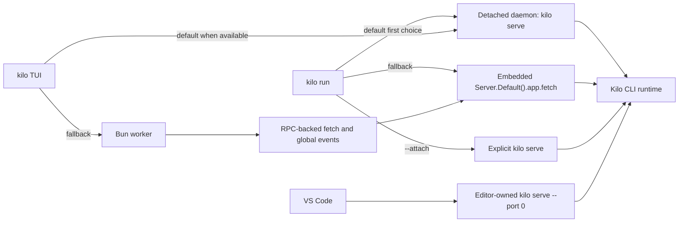
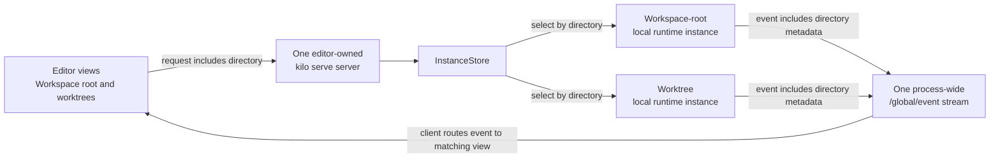
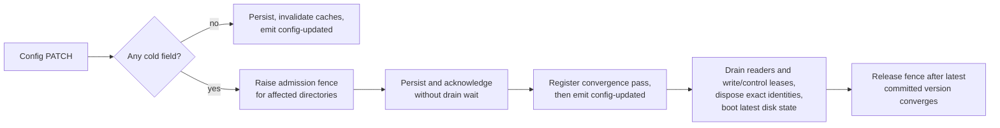

# CLI Runtime Architecture

The CLI (`packages/opencode/`) is Kilo Code's local agent engine. It owns agent execution, tools, sessions, provider integration, configuration, local persistence, directory routing, and HTTP surfaces used by editor clients.


This page describes repository-defined local runtime behavior. It is not an endpoint catalog or a statement about cloud deployment configuration.


## Concepts

These terms describe local execution. They are separate from hosted Cloud Agent sessions described in [Cloud Platform](/docs/contributing/architecture/cloud-platform).

| Term | Meaning |
|---|---|
| Kilo CLI runtime | Local agent engine in `packages/opencode/` |
| `kilo serve` server | Local HTTP and SSE process used by editor clients; selected browser-oriented paths also use WebSocket |
| Local daemon | Detached reusable `kilo serve` server managed by `kilo daemon` commands |
| Directory context | Normalized local filesystem directory used to select local runtime state |
| Local runtime instance | Directory-keyed runtime context inside one Kilo CLI process |
| Local routing workspace | Optional routing context that can resolve to a local directory or remote target |
| Worktree directory | Alternate git worktree path used as directory context for isolated concurrent work |
| Process-shared state | Runtime service state shared by every directory context in one Kilo CLI process |
| Modes | Configurable agent presets for tools, prompts, restrictions, and behavior |
| MCP | Protocol for extending agent tools |

One `kilo serve` process can host several local runtime instances. Directory-keyed state stays isolated. Process-shared service state does not.

## Command entry points

| Entry point | Command or caller | Runtime model |
|---|---|---|
| Interactive TUI | `kilo` | Attaches to local daemon when available; otherwise starts Bun worker and sends SDK-shaped requests over RPC |
| Headless run | `kilo run` | Uses daemon attach when available, then embedded server fetch fallback |
| Attached run | `kilo run --attach <url>` | Targets explicit running `kilo serve` server |
| Explicit API server | `kilo serve` | Starts HTTP + SSE server for external local clients |
| Local daemon | `kilo daemon start` | Starts detached `kilo serve` child for reuse |
| Editor-spawned server | VS Code client | Starts bundled `kilo serve --port 0` child owned by editor client, not local daemon manager |



TUI fallback is not direct call from UI thread to embedded fetch. UI thread starts `worker.ts`; worker RPC method constructs request, calls `Server.Default().app.fetch()`, and forwards global events back to UI thread.

## One server with multiple directory contexts

Each running editor host starts one editor-owned `kilo serve` server. That server can handle coding sessions for workspace root and additional worktree directories at same time. It does not start separate server process for each directory.



| Step | What happens | Why it matters |
|---|---|---|
| Send request | Editor client includes directory with local API request | CLI can distinguish workspace root from other directory contexts |
| Select state | `InstanceStore` normalizes directory and selects directory-keyed local runtime instance | Sessions for alternate directories keep isolated runtime state |
| Return events | Server publishes event with directory metadata through shared `/global/event` SSE stream | Editor client routes event to matching directory and session view |

This distinction matters for directory-scoped workspace requests. Directory-keyed state stays isolated. Process-wide event stream and server-owned service state remain shared; snapshot slow-track guard is one example. Authentication, provider routing, SSE, and snapshots appear in later sections.

## Authentication boundaries

Three credential boundaries coexist. Keep them separate when tracing request path or changing authentication code.

| Boundary | Protects | Owner |
|---|---|---|
| Local `kilo serve` access | HTTP, SSE, and selected WebSocket access to local server | Kilo CLI server and spawning local client |
| Outbound provider authentication | Model provider, Kilo Gateway, catalog, and indexing access | Kilo CLI provider router and auth stores |
| Remote MCP OAuth | Browser authorization and credentials for remote MCP server | Kilo CLI MCP runtime |

### Local `kilo serve` access

Server Basic Auth is optional. It becomes required when `KILO_SERVER_PASSWORD` is non-empty. Default username is `kilo`; `KILO_SERVER_USERNAME` can override it.

| Path or mode | Authentication behavior |
|---|---|
| Normal HTTP and SSE | Basic `Authorization` header when server password is configured |
| Browser WebSocket | `auth_token` query parameter accepts base64 `username:password` because browser WebSocket constructors cannot set arbitrary headers |
| Public UI assets | Selected manifest and icon GET paths bypass Basic Auth so browser metadata can load |
| PTY ticket issue | Authenticated `POST /pty/{ptyID}/connect-token` requires expected ticket header and allowed origin |
| PTY ticket connect | `GET /pty/{ptyID}/connect?ticket=...` bypasses Basic middleware, then consumes single-use, scope-bound ticket in PTY handler |
| PTY shell child | Removes `KILO_SERVER_PASSWORD` and `KILO_SERVER_USERNAME` from spawned user-shell environment |

PTY connect supports two browser-oriented modes: loopback query credential mode (`auth_token`) used by the VS Code Agent Manager path, and short-lived ticket mode exposed by server API.

### Outbound provider authentication

Provider auth records use `api`, `oauth`, or `wellknown` variants in `${Global.Path.data}/auth.json`, written with mode `0600`. `KILO_AUTH_CONTENT` can supply process-local auth JSON. Separate v2 multi-account auth store also exists for account-oriented flows.

| Path | Behavior |
|---|---|
| Direct providers | Use provider-specific keys, OAuth records, environment values, and configured endpoints |
| Static catalog (Core ModelsDev) | Committed `packages/opencode/src/kilocode/provider/models-api.json` (3.0 MB) is a build-time snapshot embedded as `KILO_MODELS_DEV` for `packages/core/src/models-dev.ts`; `Core.ModelsDev.Service` retains generic runtime behavior — on-disk cache at `${Global.Path.cache}/models.json` (hashed `models-<hash>.json` when `KILO_MODELS_URL` is overridden), fallback `GET ${source}/api.json` when cache and snapshot are both unavailable (cross-process `Flock`, 10 s timeout, transient retry with jittered exponential backoff), 5-minute TTL via `KILO_MODELS_PATH`/`KILO_MODELS_URL`/`KILO_DISABLE_MODELS_FETCH` controls, and scoped background refresh every 60 minutes plus explicit `kilo models --refresh` / `ModelsDev.refresh(true)`; `bun run refresh:models` refreshes only the checked-in build snapshot and is not the sole runtime refresh mechanism; only Kilo/Apertis-specific dynamic fetching (`kilo`/`apertis` injection in `provider/models.ts`, `fetchKiloModels`/`KiloModelsService`/`APERTIS_BASE_URL`/`api.apertis.ai`/`fetchApertisModels`/`KILO_API_KEY`/`APERTIS_API_KEY`/`kilocodeToken`/`HttpClient` in `provider/model-cache.ts`) was removed |
| Generic adapters | `BUNDLED_PROVIDERS` generic SDK loaders (`@ai-sdk/*`, `@openrouter/ai-sdk-provider`, etc.) |
| Custom providers | `provider.<id>` records with accepted AI SDK package, name, models, `baseURL`; lifecycle via `custom-provider-save` / `custom-provider-delete` / `provider-auth-lifecycle` |
| ModelCache (invalidation-only) | `ModelCache.Service` exposes only `clear(providerID): Effect<void>`; no Map, no `get`/`fetch`/`refresh`/`getFailure`/`failedProviders`, no five-minute cache, no failure retry; cleared last under the cold-mutation fence by custom-provider and provider-auth paths |
| Custom endpoints | Provider config can override endpoint and credential options |

Only Kilo/Apertis-specific dynamic catalog paths are removed (LOCK-006 permanent removal — `kilo`/`apertis` injection, `KiloModelsService`/`kiloModelsLayer`/`APERTIS_BASE_URL`/`api.apertis.ai`/`fetchKiloModels`/`fetchApertisModels`/`authOptions`/`KILO_API_KEY`/`APERTIS_API_KEY`/`kilocodeToken`/`HttpClient`/`FetchHttpClient` in `provider/model-cache.ts` and `provider/models.ts`, and `ModelCache`/`failedProviders` in the provider handler). The generic `Core.ModelsDev` catalog layer (`packages/core/src/models-dev.ts` with on-disk cache, fallback network fetch, 5-minute TTL, and 60-minute scoped background refresh plus explicit `kilo models --refresh` / `ModelsDev.refresh`) , the committed `models-api.json` build-time snapshot, and `KILO_MODEL_SCHEMA_EXTENSIONS` / `patchModelsDevModel` helpers remain intentionally retained and are documented as generic catalog behavior (see [Providers and Models](#) and `packages/opencode/src/kilocode/provider/models-api.json`); `bun run refresh:models` refreshes only the checked-in snapshot and is not the sole runtime refresh mechanism.

### Remote MCP OAuth

Remote MCP OAuth belongs to CLI runtime. Static headers remain supported. For OAuth servers, CLI handles browser authorization and stores credentials in protected local state; editor clients invoke CLI-owned flow instead of storing MCP credentials themselves.

## Directory routing and local runtime instances

Instance routes select directory context in this order:

1. `directory` query parameter.
2. `x-kilo-directory` request header.
3. Server process cwd.

Local routing workspace selection is separate. Session workspace, `workspace` query parameter, and `KILO_WORKSPACE_ID` can select workspace context. Configured `KILO_WORKSPACE_ID` keeps requests local to current workspace runtime. Other selected workspaces resolve through workspace-routing adapter to local directory or remote target.

| Request plan | Behavior |
|---|---|
| Local | Provides resolved directory and optional workspace ID to request handlers |
| Remote | Proxies HTTP or WebSocket request to adapter target |
| Missing workspace | Returns workspace-not-found response |
| Workspace-routing local | Keeps selected local routes on local server instead of proxying |

Remote HTTP proxy responses can include sync fence metadata. Router waits for matching sync progress before returning. `InstanceStore` normalizes directory keys, deduplicates concurrent boots with deferred entry, and disposes directory state through registered cleanup hooks.

## Core subsystems

| Subsystem | Purpose |
|---|---|
| Agent runtime | Orchestrates messages, model calls, permissions, questions, and multi-step execution |
| Tool registry | Loads built-in, Kilo-specific, and MCP tools |
| LSP client | Provides diagnostics and language intelligence |
| Config service | Merges global, project, organization, managed, and runtime inputs |
| Instance store | Caches normalized directory-scoped runtime contexts |
| SQLite and storage services | Persist structured records and remaining JSON-owned data |
| Snapshot service | Tracks git-backed file baselines for diffs and revert flows |
| Provider router | Resolves direct providers, Kilo Gateway, custom endpoints, and credentials |
| HTTP server | Publishes REST, WebSocket, and SSE surfaces |

## Daemon lifecycle

`kilo daemon start|status|stop|restart` manage a detached local `kilo serve` child, with bare `kilo daemon` equivalent to `kilo daemon start`.

| Area | Behavior |
|---|---|
| State file | `${Global.Path.state}/daemon.json`, written with mode `0600` |
| Log file | `${Global.Path.log}/daemon.log`, created with mode `0600` |
| Port allocation | For `--port 0`, scans `4097..4116` and chooses available port |
| Child process | Detached `kilo serve --hostname <host> --port <port>` process |
| Foreground mode | `--foreground` / `-f` keeps the invoking command attached; SIGINT, SIGTERM, or SIGHUP stops only the daemon identity it started or reused |
| Health | Probes authenticated `/global/health` with 2 second timeout |
| Reuse | Reuses daemon only when process is alive, health succeeds, and installed version matches |
| Cleanup | Terminates stale process when present, clears stale state, then starts replacement |
| Opt-out | `KILO_NO_DAEMON` disables automatic attach by clients; explicit daemon commands still manage daemon |

Daemon credentials differ from editor-spawned server credentials. Current daemon source stores username `kilo`, password `kilo`, and base64 Basic token in `daemon.json`. File permissions protect this local credential record. Editor clients generate random passwords per spawned server.

## Persistence

SQLite is default structured store.

| Area | Behavior |
|---|---|
| Default database | `${Global.Path.data}/kilo.db` |
| Override | `KILO_DB`; relative paths resolve under data directory; `:memory:` is accepted |
| Runtime pragmas | WAL journal, normal sync, 5 second busy timeout, foreign keys, passive checkpoint, bounded cache |
| Fresh DB auto-vacuum | Newly created canonical DBs use `PRAGMA auto_vacuum = INCREMENTAL`; existing legacy DBs keep their current mode |
| Schema changes | Drizzle migrations load from bundled journal in compiled binary or migration directories in development |
| Main tables | Projects, sessions, messages, parts, todos, permissions, session messages, session operations (Failure/Outcome), workspaces, sync events, accounts, and account state |
| Operation table | `session_operation` (session-scoped `session_id REFERENCES session(id) ON DELETE CASCADE`, `CHECK` for `op_kind`/`outcome`, indexes on `session_id`/kind/time; stores the full already-redacted `select(record,"persist")` nine-field FailureRecord with identity/session/kind/outcome/time/revision inspectable; not a file artifact, not a new DB/store, not a retry ledger) |
| Retention tables | `session_changefeed` (bounded payload-free deltas: global monotonic `seq`, `session_id`, `revision`, `kind`, `time`, no FK to `session`, `UNIQUE(session_id, revision, kind)`, 50,000 rows / 64 MiB logical caps), `session_changefeed_state` (singleton `latest_seq` / retained counts), and `retention_obligation` (durable artifact-cleanup obligations) |
| Legacy migration | On first database creation, CLI runs one-time JSON-to-SQLite migration for projects, sessions, messages, parts, todos, permissions, and shares |

Some JSON-backed storage remains. Session diffs still use storage path `session_diff`, and configuration, auth, and selected local state files retain their own owners. Snapshot storage is separate from SQLite and JSON storage.

### Operation/Outcome record (R11)

Canonical persistence for the bounded R11 foundation — additive, no production session/provider/tool/permission wiring, no retry/recovery/crash policy.

| Aspect | Behavior |
|---|---|
| Location | One canonical DB aggregate `session_operation` owned by the existing canonical DB, session-family cascade (`ON DELETE CASCADE`). Not a file artifact, not a new database/store, not a retry ledger, not changefeed history. Diagnostic and panel projections remain derived; no separate stores. Consumes R12 `normalize`, nine-field `FailureRecord`, `FIELD_TIERS`, redaction, cancellation provenance, and envelope version `1.0` unchanged. |
| Identity | Stable constructors using admitted IDs: `prompt` → `prompt:<messageId>`; `provider` → `provider:<assistantMessageId>:<attempt>` with nonnegative integer `attempt`; `tool` → `tool:<assistantMessageId>:<callId>`; `permission` → `permission:<requestId>` under `permission`; `task` → `task:<childSessionId>(:<parentCallId>)?` with `parentCallId` only if needed for uniqueness. IDs are colon-free and validated; `parseOpId` checks kind prefix, segment counts, and integer attempt; cross-kind/cross-identity mismatches are rejected. |
| Shape | Validates R12-compatible `FailureRecord` (opId/opKind/outcome/code/message/time/cancel/detail/stack, closed `opKind`/`outcome`/`cancel.source` sets, `opId` prefix matches `opKind`, no extra fields). Persists `select(record,"persist")` — the full already-redacted record — with `op_kind`, `outcome`, `code`, `message`, `time`, `cancel` (source), `detail`, `stack`, and `revision` inspectable. |
| Write | `SessionOperation.put(db, sessionID, record)` in one `BEGIN IMMEDIATE` transaction. If `opId` absent, inserts at `revision = new session revision` and advances `SessionRevision` with one `changed` feed row. If `opId` present, allows only idempotent replay (all persist fields equal) without revision/feed, or single forward transition `in-flight` → terminal (`succeeded`/`failed`/`ambiguous`/`superseded`/`abandoned`) which updates the row at the new revision and emits one `changed` feed row. Rejects cross-kind, cross-session identity, terminal→`in-flight` regression, terminal→terminal non-identical, and `in-flight`→`in-flight` non-identical conflicts without advancing revision or emitting a feed row. Existing `changed|deleted` changefeed kinds and caps remain unchanged. |
| Read | Deterministic `get(opId)` and `list(sessionID)` ordered by `op_id` ASC, round-tripping the stored persist projection with `revision` reflecting the transaction's new session revision. |
| Retention | No separate policy. Existing 8/6 GiB complete-family budget, seven-day/active/leased protections, and session cascade own these rows; family deletion cascade hard-deletes operations and retains the normal `deleted` tombstone. |

### Automatic retention (S2)

Invisible private-runtime maintenance under internal byte-budget watermarks. Not a UI, config, or manual cleanup surface.

| Aspect | Behavior |
|---|---|
| Budget | High 8 GiB, low 6 GiB (25% hysteresis, resource bound, not a performance SLA). Values change only via recorded architecture decision |
| Scope | Physical bytes of active DB main file + WAL + registered session-family artifacts (`session_diff`, `session_diff_base`, `session_share`). Offline archives, logs/cache, and project-owned `snapshot` storage are excluded |
| Family | Root + descendants + owned messages/parts + registered family artifacts. Deletion is complete-family only, never partial transcript truncation |
| Eligibility | Protected when max activity across root+descendants is within 7 days, or any member is busy/in-flight (`SessionStatus`/`SessionRunState`) or holds a maintenance/read lease. Protections are revalidated in the same `BEGIN IMMEDIATE` transaction as deletion |
| Ordering | Eligible roots ordered by activity ascending, then root ID |
| Deletion | One `BEGIN IMMEDIATE` transaction per family: final `revision = current + 1`, payload-free `deleted` tombstone in `session_changefeed` (no FK), `retention_obligation` insert, then cascade hard-delete of the family. File cleanup is durable and idempotent via the obligation; crash after commit replays obligations at boot/off-hot-path |
| Registry | Closed artifact registry: `session_diff`, `session_diff_base`, `session_share` are family-owned file artifacts; `snapshot` is project-owned and never family-pruned; `session-export.db` is legacy cutover material. New artifact writes require a registry entry and unregistered writes fail closed |
| Reclamation | After pruning, `PRAGMA wal_checkpoint(TRUNCATE)` and bounded `PRAGMA incremental_vacuum(100)` run off the hot path when idle. WAL-inclusive before/after accounting |
| Maintenance | Coalesced after boot and canonical commits, runs only when idle and above high. If no eligible family or floor prevents reaching low, it stops safely and emits pressure diagnostics |
| Diagnostics | Per-run structured diagnostics (trigger, before/after bytes, selected/deleted/skipped counts with reasons, rows/artifact bytes reclaimed, checkpoint/vacuum result, failures) logged via `Effect.logInfo`. Not a UI surface |

### Bounded changefeed/outbox (S4)

Derived, bounded, payload-free, never reconstruction authority. Canonical aggregate storage (SQLite `session`/`message`/`part`/`todo`/`share` plus registered artifacts) is sole truth; changefeed is derived maintenance for reconnect deltas and is truncatable after authoritative hydration.

| Aspect | Behavior |
|---|---|
| Feed rows | Payload-free `session_changefeed` rows: global monotonic `seq` (AUTOINCREMENT), `session_id`, `revision`, `kind` (`changed`/`deleted`), runtime-owned `time`. No FK to `session`; `UNIQUE(session_id, revision, kind)` |
| Revision coupling | Every successful semantic `SessionRevision.advance` emits exactly one `changed` entry at the new revision in the same `BEGIN IMMEDIATE` transaction. Deletion emits `deleted` at `final revision = current + 1` for each family member before hard delete in the same transaction |
| Idempotency | Feed identity is `(session_id, revision, kind)`. Duplicate append returns/reuses the existing entry and must not create a sequence gap |
| Ordering | Global `seq` is monotonic across all sessions. `readAfter(cursor)` returns ordered `seq`-asc deltas only if contiguous |
| Caps | Production hard caps are both 50,000 retained rows and 64 MiB retained logical metadata bytes. Exceeding either evicts the oldest prefix, including unacknowledged rows, in the same transaction. Caps are enforced on every append |
| Byte accounting | Deterministic logical persisted metadata size per row: UTF-8 byte lengths of `session_id` and `kind`, plus 8 bytes each for persisted integer fields `seq`, `revision`, and `time` (24-byte integer allowance). Whole-DB/WAL physical size is not used for the feed cap |
| Singleton state | Persisted singleton `session_changefeed_state` (`latest_seq`, `retained_rows`, `retained_bytes`) tracks latest cursor and retained counts after truncation. `latest_seq` survives full truncation; retained counts reflect only the current prefix. Migration backfills existing tombstones idempotently |
| Read API | Wire-agnostic storage read. `readAfter(cursor)` returns `{type:"deltas", cursor:latest, entries}` when `cursor` is contiguous (`cursor === latest` is valid empty; `cursor === 0` on empty feed is valid; `cursor+1 === minSeq` is contiguous). Any invalid, evicted, or truncated gap returns `{type:"rehydrate", cursor:latest}` with current cursor and forces full rehydration |
| Ack truncation | Authoritative snapshot consumer may `ack(cursor)` to truncate. Truncates only `seq <= cursor`, updates counts atomically, and keeps `latest_seq`. `cursor > latest` is rejected with `CursorAheadError` and does not corrupt state |
| Reconstruction | Feed truncation or hard-cap eviction must never affect canonical reconstruction. Reconstruction reads only the canonical aggregates; the feed is never consulted |
| Wire | S4 is storage-side only. HTTP/SSE/private stdio wire and R9 handshake remain P4.2b |

## Snapshot state boundary

Snapshot baselines use separate git directory per project worktree:

```text
${Global.Path.data}/snapshot/<project-id>/<worktree-hash>
```

Snapshot implementation state is directory-keyed through `InstanceState`. One `Snapshot.Service` also owns process-shared slow-snapshot guard state outside directory cache. This distinction matters when multiple root-local VS Code sessions share one `kilo serve` process.

Snapshots are project-owned file artifacts (`snapshot`, owner `project`, retention `project` — not session-family pruned; `Artifact.familyKinds` excludes it). Cleanup is project-scoped live-ref aware and fail-safe:

| Aspect | Behavior |
|---|---|
| Live set | Project-scoped `Session.revert.snapshot` plus snapshot-bearing `Part` rows (`snapshot`/`patch`/`step-start`/`step-finish`) via `live-collector` |
| Prune | Aged refs `refs/kilo/snapshots/<timestamp>/<hash>` with timestamp < now−7 days and hash not in the live set are deleted; aged live refs and recent refs are retained |
| Unavailable data | If Database is unavailable or `fetchLiveHashes` fails, `resolveLiveForPrune` returns `null` and `shouldPrune` skips pruning before `git gc --prune=7.days` |
| Family retention | Family byte-budget pruning never deletes `snapshot`; it is collected only by project reachability |

Slow initial tracking has guarded behavior:

| Condition | Behavior |
|---|---|
| Fast track | Returns snapshot hash normally |
| Slow interactive track | After default 10 seconds, can prompt to keep waiting or disable snapshots for project |
| Managed Agent Manager turn | Sends `snapshotInitialization: "wait"`; waits without inline question so concurrent started sessions retain baselines |
| Visible long track | Adds temporary progress part after short delay, updates spinner, and removes part when done |
| Disable choice | Writes `"snapshot": false` to project config without disposing active turn |
| Dismissed or untargeted timeout | Interrupts or skips track and suppresses repeat prompt for active service scope |

## SDK contract

CLI server contract flows through generated and handwritten layers. This describes the current pipeline; the SDK and generated-client boundary is an implementation choice that may be refactored or removed, so compatibility with generated clients is present state, not a future invariant:

1. Effect `HttpApi` groups under `packages/opencode/src/server/routes/instance/httpapi/` define routes.
2. `packages/opencode/src/server/routes/instance/httpapi/public.ts` normalizes public OpenAPI to legacy-compatible request and response shapes.
3. Kilo-specific API groups and handlers live under `packages/opencode/src/kilocode/server/httpapi/` and enter shared API through narrow injection seams.
4. `packages/sdk/js/script/build.ts` generates TypeScript v2 client from CLI OpenAPI.
5. `packages/sdk/js/src/v2/client.ts` adds `createKiloClient()` wrapper for directory and workspace routing, Electron and Node fetch compatibility, and clearer empty-response errors.
6. Root `./script/generate.ts` runs SDK generation, emits tracked OpenAPI artifact, updates CLI docs, and formats outputs.

Regenerate checked-in JavaScript SDK output after server endpoint changes. Do not hand-edit generated client files.

## Config precedence

Canonical-only as of P4.3. The retained effective config is the deterministic merge of exactly two authored JSONC scopes plus retained legal inputs. No other source, alias, ancestor scan, dual-read, or migration/import reader participates in retained effective config or mutations.

| Order | Source | File / assets | Semantics |
|---|---|---|---|
| 1 | Global canonical | `${Global.Path.config}/kilo.jsonc` plus `${Global.Path.config}/{agent,agents,command,commands,skill,skills,rules}` typed assets directly under the global root | Trusted scope; `SecretStorage` opaque credential refs and runtime defaults are also retained legal inputs; no `${Global.Path.config}/.kilo/` subdirectory exists in retained paths. `rules` is a normative canonical registered asset class (R10/`ASSET_DIRECTORIES`) but its opencode effective consumption is deferred — see gap note below |
| 2 | Workspace / worktree canonical | `canonicalRoot(directory, worktree)/.kilo/kilo.jsonc` and `canonicalRoot/.kilo/{agent,agents,command,commands,skill,skills,rules}` typed assets | Untrusted scope; `canonicalRoot(directory, worktree)` is worktree when present and not "/" else directory; `{file:}` reads confined to canonicalRoot. `rules` registered as canonical class; not yet materialized by this opencode path (deferred) |

CanonicalRoot / worktree: `canonicalRoot(directory, worktree)` (`packages/opencode/src/project/instance-context.ts`) is the single project root for every directory-keyed operation. All config/asset discovery, target resolution, locks, and scans use this root, so workspace-root and child-directory callers serialize through the same file and the same discovery lock. Non-git instances report worktree "/" and fall back to directory. No ancestor walk, no `.kilocode` discovery, no `opencode.json[c]` reader, and no `kilo.json` alias exists in retained paths.

Discovery locks and atomic persistence: every authored-scope mutation serializes through a shared cross-process `EffectFlock` discovery lock held **before** target resolution and persists via `KilocodeAtomicWrite.write` (temp-file + rename, missing dirs created on ENOENT, temp cleaned on failure/interrupt).

| Domain | Lock key | Behavior |
|---|---|---|
| Global | `config:discover:global:<hash(Global.Path.config)>` | Acquired before global target resolution; commit via atomic writer; `prepare` validates in memory without writing/invalidating |
| Project | `config:discover:project:<hash(canonicalRoot)>` | Acquired before project target resolution; commit via atomic writer; combined global+project transactions acquire global-then-project with reverse-order compensating rollback |

The locked key is always the written path; `prepare`/`prepareGlobal` validate in memory, `commit`/`commitGlobal` persist atomically under the lock, and combined coordinator `KilocodeConfigOverlay` + `config-transaction` uses the same keys. Loader paths perform no writes — `$schema` injection and missing-file seeding are in-memory only; no `fs.writeFileString` or `writeWithDirs` occurs outside lock + atomic writer, avoiding load/update races and partial JSONC exposure.

Rules contract gap (P4.3 deferred — LOCK-006): `rules` is a normative canonical typed-asset class in the extension registry/spec (R10, `packages/kilo-vscode/src/config/types.ts:169` `ASSET_DIRECTORIES` includes `rules`) — the locations above are the registered canonical definitions and are preserved. However, the current opencode effective snapshot/materialization (`packages/opencode/src/config/config.ts` / `overlay.ts`) does not yet load `rules` assets into its effective `Config.Info`; no `rules` loader or composition operator participates in this path. This is a recorded contract gap, explicitly deferred beyond P4.3; no new rules loader/runtime was created in P4.3. Evidence: `specs/vscode-orchestrator/evidence/p4.3-rules-contract-gap.md`.

Historical sources (retired at the P4.3 atomic legacy-reader cutover — no retained reader, no dual-read, no migration tool):

| Retired source | Former location / behavior |
|---|---|
| Legacy Kilo migrations (`loadLegacyConfigs`) | Automatic migration readers that copied legacy values into canonical files |
| Organization modes and Active Kilo Cloud organization config | Signed-in org modes merged as agent config |
| Auth-record `.well-known/opencode` remote config | Well-known remote config fetched from auth records |
| Explicit `KILO_CONFIG` / `KILO_CONFIG_DIR` / `KILO_CONFIG_CONTENT` | Explicit file/dir/content env overrides |
| Ancestor `.kilo`/`.kilocode` discovery and `opencode.json[c]` | Ancestor scanning and `opencode.json[c]` readers |
| `kilo.json` filename | Legacy global filename (canonical is `kilo.jsonc` JSONC only) |
| Managed config directory and macOS managed preferences | Enterprise managed sources |

The pre-cutover manual reconciliation of the P0 15-source inventory to 13 removal classes vs 4 retained legal classes (`specs/vscode-orchestrator/evidence/p4.3-pre-cutover-reconciliation-checklist.md`, operator `jorkeyliu` 2026-08-24, clean-reset decision) is the sole bridge; residual `.opencode` directories are detected only for the reference-only `kilo.local.opencode-config-detected` notification via `KilocodeConfig.detectOpencodeConfig` and never read as config. The legacy source-inventory reader that reported the retired source classes and its config-console reporting endpoint were physically removed in P4.4; no diagnostic source-listing surface remains and none of the rows it listed are treated as retained sources.

P4.3 / P4.4 / P4.5 boundary (canonical-only cutover):

| Phase | Scope |
|---|---|
| P4.3 complete | Atomic legacy-reader cutover/deletion — canonical loader/mutations own the retained sources above; shared discovery locks and atomic writes preserved; no legacy alias/import/dual-read in retained paths |
| P4.4 open | Per-row inactive/removal evidence for the 13 removal classes and transport narrowing |
| P4.5 open | Deletion of old CLI/TUI/Console surfaces (deferred; `packages/opencode/src/cli`, `src/kilocode/tui`, and TUI handlers untouched in P4.3) |

How a config change applies at runtime is a separate concern from merge order: every field is classified hot or cold at introduction (`packages/opencode/src/kilocode/config/hot-keys.ts`), and saves converge as described in [Config update lifecycle](#config-update-lifecycle).

Runtime loading is separate from editor-facing JSON Schema publication. A cloud-served schema currently improves validation and completion for `kilo.jsonc`; it does not load, apply, or override effective runtime config, and it is a non-authoritative external surface. When adding or changing a config key, follow [CLI Config Schema](/docs/contributing/architecture/config-schema); the key completes within this repository regardless of the overlay.

## Config update lifecycle

Every config save is classified hot or cold. Schema shape lives in `Config.Info` in `packages/opencode/src/config/config.ts`; runtime hot classification lives in `packages/opencode/src/kilocode/config/hot-keys.ts`, and a field absent from the hot-key set is cold. Hot saves converge without a runtime rebuild; cold saves converge through a background pass that swaps the runtime for affected directories. Merge order for the sources is in [Config precedence](#config-precedence). The editor-facing schema surface is separate and non-authoritative — see [CLI Config Schema](/docs/contributing/architecture/config-schema).

| Component | Responsibility |
|---|---|
| `ConfigConvergence` | Coordinator that raises the admission fence before a cold mutation persists, assigns a monotonic sequence to each committed cold obligation, and runs serialized convergence passes |
| `GenerationGate` | Writer-preferring admission gate; convergence fences block new reader admission per directory or globally, never writers |
| `ControlLease` | Identity-keyed lifetime leases for drain-control and write-intent handlers; an identity is sealed and drained before it is disposed |
| Config snapshot | Generation-scoped `Config.Info` capture; every `Config.get` inside a generation returns the config it started with |
| `InstanceStore` | Directory-keyed runtime cache; disposal is identity-safe so an explicit reload survives convergence |



| Aspect | Hot save | Cold save |
|---|---|---|
| Runtime rebuild | None | Background convergence pass |
| Admission fence | Never | Raised before persistence for affected directories |
| Acknowledge | Immediately after persistence and cache invalidation | Immediately after the backend transaction and synchronous side effects |
| Generation drain wait | None | None — saves never await an active generation |
| `config-updated` | Emitted immediately | Emitted only after rebuild registration owns the fence |

Cold flow details:

- **Admission lanes.** A fence blocks new readers only. Hot config writes, write-intent operations, and drain-control operations keep working during a convergence cycle. In-flight generations hold reader leases and keep their startup config snapshot; new generations and readers wait until the fence releases, then bind to the post-convergence runtime.
- **Scope.** A project cold change fences and rebuilds only its directory; a global cold change covers every loaded directory. A cycle strengthens to global, never weakens.
- **Coalescing and latest state.** Obligations committed before a pass's turn coalesce into one drain→dispose→boot burst. A mutation racing the pass stays pending and forces another pass, so the fence releases only after the latest committed version converges. The newest pre-fence identity wins; `InstanceStore.dispose` is identity-safe, so an explicit reload between saves survives.
- **Reload and load during a fence.** Loads admitted under an active fence register with the fence; the coordinator converges confirmed directories before the fence can drop, so no runtime cached during convergence survives it.
- **Failure and shutdown.** A failed save aborts its obligation: the fence ref releases and no rebuild is registered, so a failed save never leaves the fence up. Shutdown rejects new work, interrupts and joins owned passes, and releases fences without rebooting.

Testing expectations: tests must cover saving during active streaming, not only idle PATCH. Drive a real handler with a held LLM stream and assert the save acknowledges before the stream releases, that hot saves never wait on a cold fence, that a cold burst coalesces into the intended disposal count, and that the final runtime serves the latest persisted config. Sequence races with Deferreds and admission side effects, not sleeps; await rebuild quiescence through the rebuild tracker.

## Global and instance SSE

| Stream | Scope | Payload |
|---|---|---|
| `/event` | One local runtime instance bus | Direct event payloads until instance disposal |
| `/global/event` | Process-wide multiplexed bus | Wrapper with payload and available directory, project, and workspace metadata |

Both streams send initial `server.connected` event and heartbeat every 10 seconds. VS Code consumes `/global/event` so one server connection can route events for multiple directories.

## Source map

Paths below are relative to [`Kilo-Org/kilocode`](https://github.com/Kilo-Org/kilocode).

| Concern | Source paths |
|---|---|
| CLI entry points | `packages/opencode/src/cli/cmd/` |
| Daemon | `packages/opencode/src/kilocode/daemon/` |
| HTTP server | `packages/opencode/src/server/` |
| Directory and workspace routing | `packages/opencode/src/server/routes/instance/httpapi/middleware/workspace-routing.ts` |
| SQLite | `packages/opencode/src/storage/db.ts``packages/core/src/database/``packages/core/src/session/sql.ts``packages/core/src/session/revision.ts``packages/core/src/retention/` |
| Operation/Outcome (R11) | `packages/core/src/session/operation.ts``packages/core/src/database/migration/20260824000000_add_operation_record.ts` |
| Snapshots | `packages/opencode/src/snapshot/index.ts``packages/opencode/src/kilocode/snapshot/track.ts` |
| SDK | `packages/sdk/js/``script/generate.ts` |
| Config update lifecycle and convergence | `packages/opencode/src/kilocode/server/config-convergence.ts``packages/opencode/src/kilocode/server/config-rebuild.ts``packages/opencode/src/kilocode/server/generation-gate.ts``packages/opencode/src/kilocode/server/control-lease.ts` |
| Config schema shape | `packages/opencode/src/config/config.ts` |
| Config save classification (hot/cold) | `packages/opencode/src/kilocode/config/hot-keys.ts` |
| Provider routing and lifecycle | `packages/opencode/src/kilocode/provider/provider.ts` |
| Provider auth lifecycle | `packages/opencode/src/kilocode/server/provider-auth-lifecycle.ts` |
| Custom provider lifecycle | `packages/opencode/src/kilocode/custom-provider.ts``packages/opencode/src/kilocode/server/custom-provider-save.ts``packages/opencode/src/kilocode/server/custom-provider-delete.ts` |

## Related pages

- [Architecture Overview](/docs/contributing/architecture) - local and hosted execution map
- [VS Code Extension](/docs/contributing/architecture/vscode-extension) - extension-host ownership, Agent Manager, and webview bridge
- [Development Patterns](/docs/contributing/architecture/development-patterns) - API generation, code-ownership seams, and modular-boundary rules
- [CLI Config Schema](/docs/contributing/architecture/config-schema) - editor-facing schema surface for CLI config keys
