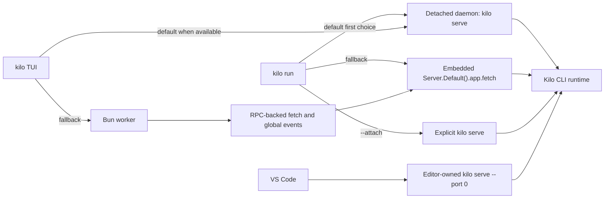
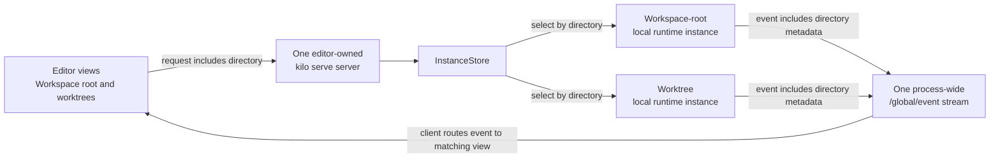
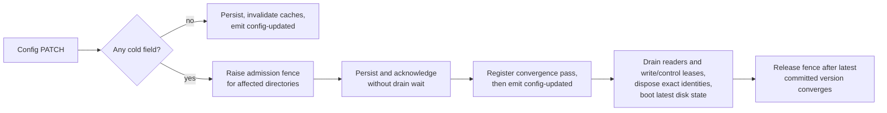

# CLI Runtime Architecture

The CLI (`packages/opencode/`) is Kilo Code's local agent engine. It owns agent execution, tools, sessions, provider integration, configuration, local persistence, directory routing, and HTTP surfaces used by editor clients.


This page describes repository-defined local runtime behavior. It is not an endpoint catalog or a statement about cloud deployment configuration.


## Concepts

These terms describe local execution. They are separate from hosted Cloud Agent sessions described in [Cloud Platform](/docs/contributing/architecture/cloud-platform).

| Term | Meaning |
|---|---|
| Kilo CLI runtime | Local agent engine in `packages/opencode/` |
| `kilo serve` server | Local HTTP and SSE process used by editor clients; selected browser-oriented paths also use WebSocket |
| Local daemon | Detached reusable `kilo serve` server managed by `kilo daemon` commands |
| Directory context | Normalized local filesystem directory used to select local runtime state |
| Local runtime instance | Directory-keyed runtime context inside one Kilo CLI process |
| Local routing workspace | Optional routing context that can resolve to a local directory or remote target |
| Worktree directory | Alternate git worktree path used as directory context for isolated concurrent work |
| Process-shared state | Runtime service state shared by every directory context in one Kilo CLI process |
| Modes | Configurable agent presets for tools, prompts, restrictions, and behavior |
| MCP | Protocol for extending agent tools |

One `kilo serve` process can host several local runtime instances. Directory-keyed state stays isolated. Process-shared service state does not.

## Command entry points

| Entry point | Command or caller | Runtime model |
|---|---|---|
| Interactive TUI | `kilo` | Attaches to local daemon when available; otherwise starts Bun worker and sends SDK-shaped requests over RPC |
| Headless run | `kilo run` | Uses daemon attach when available, then embedded server fetch fallback |
| Attached run | `kilo run --attach <url>` | Targets explicit running `kilo serve` server |
| Explicit API server | `kilo serve` | Starts HTTP + SSE server for external local clients |
| Local daemon | `kilo daemon start` | Starts detached `kilo serve` child for reuse |
| Editor-spawned server | VS Code client | Starts bundled `kilo serve --port 0` child owned by editor client, not local daemon manager |



TUI fallback is not direct call from UI thread to embedded fetch. UI thread starts `worker.ts`; worker RPC method constructs request, calls `Server.Default().app.fetch()`, and forwards global events back to UI thread.

## One server with multiple directory contexts

Each running editor host starts one editor-owned `kilo serve` server. That server can handle coding sessions for workspace root and additional worktree directories at same time. It does not start separate server process for each directory.



| Step | What happens | Why it matters |
|---|---|---|
| Send request | Editor client includes directory with local API request | CLI can distinguish workspace root from other directory contexts |
| Select state | `InstanceStore` normalizes directory and selects directory-keyed local runtime instance | Sessions for alternate directories keep isolated runtime state |
| Return events | Server publishes event with directory metadata through shared `/global/event` SSE stream | Editor client routes event to matching directory and session view |

This distinction matters for directory-scoped workspace requests. Directory-keyed state stays isolated. Process-wide event stream and server-owned service state remain shared; snapshot slow-track guard is one example. Authentication, provider routing, SSE, and snapshots appear in later sections.

## Authentication boundaries

Three credential boundaries coexist. Keep them separate when tracing request path or changing authentication code.

| Boundary | Protects | Owner |
|---|---|---|
| Local `kilo serve` access | HTTP, SSE, and selected WebSocket access to local server | Kilo CLI server and spawning local client |
| Outbound provider authentication | Model provider, Kilo Gateway, catalog, and indexing access | Kilo CLI provider router and auth stores |
| Remote MCP OAuth | Browser authorization and credentials for remote MCP server | Kilo CLI MCP runtime |

### Local `kilo serve` access

Server Basic Auth is optional. It becomes required when `KILO_SERVER_PASSWORD` is non-empty. Default username is `kilo`; `KILO_SERVER_USERNAME` can override it.

| Path or mode | Authentication behavior |
|---|---|
| Normal HTTP and SSE | Basic `Authorization` header when server password is configured |
| Browser WebSocket | `auth_token` query parameter accepts base64 `username:password` because browser WebSocket constructors cannot set arbitrary headers |
| Public UI assets | Selected manifest and icon GET paths bypass Basic Auth so browser metadata can load |
| PTY ticket issue | Authenticated `POST /pty/{ptyID}/connect-token` requires expected ticket header and allowed origin |
| PTY ticket connect | `GET /pty/{ptyID}/connect?ticket=...` bypasses Basic middleware, then consumes single-use, scope-bound ticket in PTY handler |
| PTY shell child | Removes `KILO_SERVER_PASSWORD` and `KILO_SERVER_USERNAME` from spawned user-shell environment |

PTY connect supports two browser-oriented modes: loopback query credential mode (`auth_token`) used by the VS Code Agent Manager path, and short-lived ticket mode exposed by server API.

### Outbound provider authentication

Provider auth records use `api`, `oauth`, or `wellknown` variants in `${Global.Path.data}/auth.json`, written with mode `0600`. `KILO_AUTH_CONTENT` can supply process-local auth JSON. Separate v2 multi-account auth store also exists for account-oriented flows.

| Path | Behavior |
|---|---|
| Direct providers | Use provider-specific keys, OAuth records, environment values, and configured endpoints |
| Static catalog | Preset catalog removed — `packages/opencode/src/kilocode/provider/models-api.json` (3 MB), `packages/core/src/models-dev.ts` (disk cache `models.json` / `models-<hash>.json`, `GET ${source}/api.json` fallback, 5-min TTL, 60-min background refresh, `kilo models --refresh`), `packages/core/src/kilocode/models-refresh.ts`, `packages/core/src/plugin/models-dev.ts`, `packages/opencode/src/provider/models.ts`, `packages/opencode/src/kilocode/provider/models-refresh.ts` / `models-snapshot-shape.ts`, `script/kilocode/refresh-models.ts` / `models-snapshot.ts`, build embedding `KILO_MODELS_DEV` / `MODELS_SNAPSHOT_RELATIVE` / `refresh:models` script and `KILO_MODELS_URL` / `KILO_MODELS_PATH` / `KILO_DISABLE_MODELS_FETCH` controls deleted; no preset catalog, snapshot, or models.dev network/disk/background-refresh runtime remains |
| Generic adapters | `BUNDLED_PROVIDERS` generic SDK loaders (`@ai-sdk/*`, `@openrouter/ai-sdk-provider`, etc.) retained |
| Custom providers | `provider.<id>` records with accepted AI SDK package, name, models, `baseURL`; lifecycle via `custom-provider-save` / `custom-provider-delete` / `provider-auth-lifecycle` — explicit config-defined models do not require a catalog |
| Custom endpoints | Provider config can override endpoint and credential options |
| Stored-credential model discovery | Runtime-owned narrow endpoint `POST /provider/:providerID/models` (same authenticated provider group, `WorkspaceRouting` directory scoping): exact provider ID plus exact stored `baseURL` only, both URLs strictly plain `http(s)` with no userinfo/query/fragment, credential gate mirrors the explicit-read source rules (`api`/`custom` with key, `config` with key plus empty env; `kilo` rejected), `GET <baseURL>/models` with server-side Bearer auth and 15 s timeout, redirects never followed (`manual`; any 3xx rejected), bounded byte-counted streaming body (declared length pre-reject, missing/chunked accumulate to 1 MiB then cancel) with strictly validated `{id,name}[]` (500 models, 256-char ids), redacted `BadRequest`/`Unauthorized`/`InvalidResponse`/`UpstreamError` with no secret persistence or logging; regular provider reads use the redacted catalog below, never this credential path |
| Redacted provider catalog | Authenticated `GET /provider/catalog` (`provider.catalog`, same provider group `Authorization` + `WorkspaceRouting` + `InstanceContext`): closed `ProviderCatalogResult` envelope (`all,default,connected,failed`) with `CatalogProvider` (`id,name,description?,source,env,metadata?,hasCredential,models`) and `CatalogModel` (`id,providerID,api,name,family?,capabilities,cost,limit,status,release_date,variants?,recommendedIndex?,isFree?,mayTrainOnYourPrompts?,hasUserByokAvailable?,terminalBench?,autoRouting?`); provider `key`/`options` and model `options`/`headers` are never projected, variants keep only canonical safe keys (`enable_thinking,reasoningEffort,effort,thinking,reasoning_split,chat_template_args`), `hasCredential` derives from non-empty runtime key, no secret logging; legacy explicit reveal stays on unchanged `GET /provider` (`provider.list`) for compatibility and is unreachable in production canonical mode |

Preset catalog and models.dev fallback are fully removed. Generic `BUNDLED_PROVIDERS` adapters, `KILO_MODEL_SCHEMA_EXTENSIONS` / `patchConfigModel` helpers, and custom-provider save/delete/auth paths are retained; old CLI/TUI/server/generated-SDK surfaces remain.

The full capability above is CLI-runtime scope. The VS Code product surface has a custom-only provider boundary exposing only the custom-provider subset (custom ID plus `baseURL` plus `openai/completions` / `openai/responses` / `anthropic/messages`); VS Code provider OAuth, built-in providers, and Anaconda setup are removed from the VS Code surface with no migration. See [VS Code Extension](/docs/contributing/architecture/vscode-extension#custom-only-provider-boundary) for that product-surface boundary; CLI/TUI scope is unchanged.

### Remote MCP OAuth

Remote MCP OAuth belongs to CLI runtime. Static headers remain supported. For OAuth servers, CLI handles browser authorization and stores credentials in protected local state; editor clients invoke CLI-owned flow instead of storing MCP credentials themselves.

## Directory routing and local runtime instances

Instance routes select directory context in this order:

1. `directory` query parameter.
2. `x-kilo-directory` request header.
3. Server process cwd.

Local routing workspace selection is separate. Session workspace, `workspace` query parameter, and `KILO_WORKSPACE_ID` can select workspace context. Configured `KILO_WORKSPACE_ID` keeps requests local to current workspace runtime. Other selected workspaces resolve through workspace-routing adapter to local directory or remote target.

| Request plan | Behavior |
|---|---|
| Local | Provides resolved directory and optional workspace ID to request handlers |
| Remote | Proxies HTTP or WebSocket request to adapter target |
| Missing workspace | Returns workspace-not-found response |
| Workspace-routing local | Keeps selected local routes on local server instead of proxying |

Remote HTTP proxy responses can include sync fence metadata. Router waits for matching sync progress before returning. `InstanceStore` normalizes directory keys, deduplicates concurrent boots with deferred entry, and disposes directory state through registered cleanup hooks.

## Core subsystems

| Subsystem | Purpose |
|---|---|
| Agent runtime | Orchestrates messages, model calls, permissions, questions, and multi-step execution; per-agent tool disables are an independent capability gate (not permission rules) |
| Tool registry | Loads built-in, Kilo-specific, and MCP tools; model tool lists are filtered by the agent capability set |
| LSP client | Provides diagnostics and language intelligence |
| Config service | Merges global, project, organization, managed, and runtime inputs |
| Instance store | Caches normalized directory-scoped runtime contexts |
| SQLite and storage services | Persist structured records and remaining JSON-owned data |
| Snapshot service | Tracks git-backed file baselines for diffs and revert flows; Snapshot v2 journal adds queryable durable file-mutation capture for edit/write/apply_patch plus bounded CAS for complete revert/unrevert (incomplete stays whole old Snapshot) |
| Provider router | Resolves direct providers, Kilo Gateway, custom endpoints, and credentials |
| HTTP server | Publishes REST, WebSocket, and SSE surfaces |

### Agent tool capability gate

Authored per-agent `tools: {tool: false}` is runtime capability enforcement, not allow/ask/deny rules. The explicit disabled set survives on `Agent.Info` as `disabledTools`/`enabledTools` from config decoding through merge, cache, and custom agent paths; the existing permission-deny encoding remains for compatibility/presentation only and `Permission.disabled()` stays a presentation predicate.

| Aspect | Behavior |
|---|---|
| Merge | Restrictive: base disables survive overlays unless the same authored definition explicitly re-enables the same tool; explicit wildcard enable never clears specific disables; `write`/`edit`/`patch`/`apply_patch` expand as one edit group; `"*": false` disables all except explicitly re-enabled tools |
| Enforcement | One shared `AgentCapability.assert` (`AgentToolDisabledError`, distinct from permission denied/rejected) runs before any plugin hook, sandbox, permission ask, MCP call, builtin/plugin execute, or direct task/subtask/debug side effect |
| Coverage | Normal AI SDK and native/canonical paths converge through `SessionTools.resolve`; `LLMRequestPrep.resolveTools` and debug visibility filter from the same set, so presentation derives from enforcement |
| Non-reopenable | Presets, `agent.permission` allow rules, session approvals, `permission_level` autonomous auto-approval, and allowEverything cannot re-enable a disabled tool; enabled tools and ordinary deny/ask behavior are unchanged |
| Repair | Unknown/replayed calls still route to `invalid` (unless `invalid` itself is disabled) with deterministic tool-result errors and no side effects |
| Exclusion | Direct file-attachment intake reads are system intake, not model-selected tool calls, and stay outside this rule |

Evidence: `packages/opencode/test/agent/capability.test.ts`.

### Permission evaluation (Review/Autonomous)

Production permission decisions come only from the permission evaluator (`packages/opencode/src/permission/evaluator.ts`). Across global/project/agent/session-restriction layers, deny wins first, ask/ceiling next, and allow holds only when every applicable layer allows. The file-authoritative `permission_level` (`review`/`autonomous`, hot config key) auto-approves under Autonomous: every decision that would otherwise ask or ask-ceiling — ordinary asks from any layer, `doom_loop`, question lifecycle, runtime ceiling b/c (protected files, `.env` reads), and the empty default-ask — resolves directly to allow with `autonomous`/`autonomous-ceiling` provenance and no exact approval required. Explicit deny in any layer and ceiling-a hard deny stay deny; the agent capability gate above stays outside the evaluator and cannot be reopened by the level. Main and child sessions share the one main level; child inherited denies still deny.

Evidence: `packages/opencode/test/permission/autonomous-level.test.ts`, `packages/opencode/test/permission/autonomous-service.test.ts`.

## Daemon lifecycle

`kilo daemon start|status|stop|restart` manage a detached local `kilo serve` child, with bare `kilo daemon` equivalent to `kilo daemon start`.

| Area | Behavior |
|---|---|
| State file | `${Global.Path.state}/daemon.json`, written with mode `0600` |
| Log file | `${Global.Path.log}/daemon.log`, created with mode `0600` |
| Port allocation | For `--port 0`, scans `4097..4116` and chooses available port |
| Child process | Detached `kilo serve --hostname <host> --port <port>` process |
| Foreground mode | `--foreground` / `-f` keeps the invoking command attached; SIGINT, SIGTERM, or SIGHUP stops only the daemon identity it started or reused |
| Health | Probes authenticated `/global/config` with 2 second timeout |
| Reuse | Reuses daemon only when process is alive, config probe succeeds, and installed version matches |
| Cleanup | Terminates stale process when present, clears stale state, then starts replacement |
| Opt-out | `KILO_NO_DAEMON` disables automatic attach by clients; explicit daemon commands still manage daemon |

Daemon credentials differ from editor-spawned server credentials. Current daemon source stores username `kilo`, password `kilo`, and base64 Basic token in `daemon.json`. File permissions protect this local credential record. Editor clients generate random passwords per spawned server.

## Persistence

SQLite is default structured store.

| Area | Behavior |
|---|---|
| Default database | `${Global.Path.data}/kilo.db` |
| Override | `KILO_DB`; relative paths resolve under data directory; `:memory:` is accepted |
| Runtime pragmas | WAL journal, normal sync, 5 second busy timeout, foreign keys, passive checkpoint, bounded cache |
| Fresh DB auto-vacuum | Newly created canonical DBs use `PRAGMA auto_vacuum = INCREMENTAL`; existing legacy DBs keep their current mode |
| Schema changes | Drizzle migrations load from bundled journal in compiled binary or migration directories in development |
| Main tables | Projects, sessions, messages, parts, todos, permissions, session messages, session operations (Failure/Outcome), workspaces, sync events, accounts, account state, and Snapshot v2 journal (`snapshot_blob`, `snapshot_mutation`) |
| Snapshot v2 journal | See Snapshot v2 journal details below |
| Operation table | `session_operation` (session-scoped `session_id REFERENCES session(id) ON DELETE CASCADE`, `CHECK` for `op_kind`/`outcome`, indexes on `session_id`/kind/time; stores the full already-redacted `select(record,"persist")` nine-field FailureRecord with identity/session/kind/outcome/time/revision inspectable; not a file artifact, not a new DB/store, not a retry ledger) |
| Retention tables | `session_changefeed` (bounded payload-free deltas: global monotonic `seq`, `session_id`, `revision`, `kind`, `time`, no FK to `session`, `UNIQUE(session_id, revision, kind)`, 50,000 rows / 64 MiB logical caps), `session_changefeed_state` (singleton `latest_seq` / retained counts), and `retention_obligation` (durable artifact-cleanup obligations) |
| Legacy migration | On first database creation, CLI runs one-time JSON-to-SQLite migration for projects, sessions, messages, parts, todos, permissions, and shares |

### Snapshot v2 journal

- Store: content-addressed `snapshot_blob` (sha256 PK, complete raw bytes, size).
- Facts: `snapshot_mutation` with session FK cascade and prepared/applied/failed status.
- Idempotency: session/message/call/tool/item/sub/path/op key with `sub_index`.
- Ordering: ordinary mutations use sub 0.
- Move: two facts sharing item, target add/update sub 0 first, source delete sub 1 second.
- List: stable by created/item/sub; ids metadata order matches list.
- Prepare: runs after permission ask and before any file write, so DB failure means zero writes.
- Ask preview is pre-format intent (decided contract, not a gap): permission `ask` carries the expected diff built from the agent-requested edit before any write or formatter run, for human preview and audit only. It is not an evaluator input (`buildCanonicalTargets` and `effectiveProtectedTargets` read only patterns plus `filepath` / `files[].filePath` / `movePath`, never `diff` / `patch` / `filediff` display bytes), not a CAS expected value, and not a journal/revert source.
- Completion is formatter-final disk truth: after the write, `format.file` plus an `EncodedIO.sync` re-read fixes the final bytes, and completed tool metadata plus journal `apply` rows are rebuilt from those bytes. Ask must precede every write and formatter run; running the formatter or staging a temp working copy before authorization to chase display consistency is forbidden without a new explicit product decision.
- Formatter is a single-target same-path writer (decided boundary, not a gap): in-place edits and atomic renames are both allowed, so inode/dev may change. After `format.file` the shared `FormatTarget.check` (`packages/opencode/src/tool/format-target.ts`) requires the target to still be a regular readable file before any sync/raw read/`journal.apply` (edit/write/`apply_patch` share one check; `apply_patch` move checks only the formatter target). Missing, directory/device/FIFO/socket/unknown, dangling symlink, and unreadable all fail closed with the prepared row settled failed and coverage failed, and the disk is left as-is with no speculative restore. A symlink to a regular file stays allowed. Files outside the target (sidecars/caches) never enter metadata, journal, planner, revert/unrevert, or CAS: they are never scanned, cleaned, or reified. A non-zero formatter exit keeps the current log-then-read-final-target semantics; exit-code handling is unchanged.
- Replay: only on exact before match (existence/hash/size/encoding/BOM), else typed Conflict.
- Apply: records formatter-final raw bytes with CAS rollback on DB failure.
- Rollback: add-without-before may delete; update/delete without persisted before never deletes.
- Legacy: single-row move never repairs the filesystem.
- Failure: when DB apply and mark-failed are both unavailable, the row stays prepared and queryable.
- GC: one transaction and one SQL over current references; prepared/failed facts are retained.
- Scope: queryable capture plus bounded journal CAS for complete revert/unrevert; incomplete stays whole old Snapshot with no mixing; `Session.Info.revert` schema unchanged (no SDK regen).
- Coverage: edit/write/apply_patch only; opaque tools stay on the old Snapshot path.
- Coverage planner: read-only `SnapshotCoveragePlan` (`packages/opencode/src/snapshot/coverage-plan.ts`) adjudicates a revert target against authoritative messages and the journal, sharing boundary resolution with `SessionRevert` via `SessionRevertBoundary` (`packages/opencode/src/session/revert-boundary.ts`). Verdict `complete` enters journal CAS; `incomplete` falls back to the old Snapshot path as a whole, never mixed. The planner executes no restore and makes no performance claim. Marker plans are re-planned from marker messageID/partID on unrevert and chained revert.
- Journal CAS: bounded executor (`packages/opencode/src/snapshot/journal-cas.ts`, max 2000 steps) runs only inside the caller-held `Snapshot.exclusive` and never takes the lock or calls public track/restore/revert/diff. Segments carry applyOrder plus direction (redo uses applyOrder, undo uses reverse); chained reverts combine redo-old plus undo-new in one batch. Execution facts come from one bounded `SnapshotJournal.load` batch (ordered ids, duplicates allowed; rows plus content-addressed blobs in constant/chunked `inArray` queries under the SQLite variable limit, empty input with zero queries; per-step `get`/`readBlob` roundtrips removed, legacy single-row reads retained for other callers). Strict row checks (applied, session/worktree scope, no legacy move, before/after blob/hash/size consistency) plus per-path chain continuity. Precheck simulates expected to next from actual disk without writing (first expected per path must match disk, later must match projected). Execution re-checks disk CAS per step then writes exact bytes or deletes; any mismatch or FS failure stops and compensates completed steps in reverse with their own CAS guards, never deleting or overwriting unknown data. Forward reads/writes/deletes stay interruptible; a fiber interrupt runs uninterruptible CAS-guarded minimal compensation before the exclusive releases (active step included only when current equals its just-written next, otherwise left untouched), then still propagates interruption with the marker unchanged. Typed `SnapshotJournalApplyError` carries recovered; journal rows are never mutated by undo/redo; CAS failure never calls raw restore rollback.

Some JSON-backed storage remains. Session diffs still use storage path `session_diff`, and configuration, auth, and selected local state files retain their own owners. Snapshot storage is separate from SQLite and JSON storage.

### Operation/Outcome record (R11)

Canonical persistence for the bounded R11 foundation. Production provider wiring now uses this record at the repository-owned request/stream execution boundary; prompt, tool, permission, task, recovery, and disposition wiring remain outside this contract.

| Aspect | Behavior |
|---|---|
| Location | One canonical DB aggregate `session_operation` owned by the existing canonical DB, session-family cascade (`ON DELETE CASCADE`). Not a file artifact, not a new database/store, not a retry ledger, not changefeed history. Diagnostic and panel projections remain derived; no separate stores. Consumes R12 `normalize`, nine-field `FailureRecord`, `FIELD_TIERS`, redaction, cancellation provenance, and envelope version `1.0` unchanged. |
| Identity | SessionProcessor owns provider operation identity and uses stable constructors with admitted IDs: `prompt` → `prompt:<messageId>`; `provider` → `provider:<assistantMessageId>:<attempt>` with nonnegative integer `attempt`; `tool` → `tool:<assistantMessageId>:<callId>`; `permission` → `permission:<requestId>` under `permission`; `task` → `task:<childSessionId>(:<parentCallId>)?` with `parentCallId` only if needed for uniqueness. IDs are colon-free and validated; `parseOpId` checks kind prefix, segment counts, and integer attempt; cross-kind/cross-identity mismatches are rejected. |
| Shape | Validates R12-compatible `FailureRecord` (opId/opKind/outcome/code/message/time/cancel/detail/stack, closed `opKind`/`outcome`/`cancel.source` sets, `opId` prefix matches `opKind`, no extra fields). Persists `select(record,"persist")` — the full already-redacted record — with `op_kind`, `outcome`, `code`, `message`, `time`, `cancel` (source), `detail`, `stack`, and `revision` inspectable. |
| Write | `SessionOperation.put(db, sessionID, record)` is the sole operation writer and runs in one `BEGIN IMMEDIATE` transaction. One outer provider attempt has one admission and one in-flight/terminal outcome; inner transport or AI SDK retries do not create duplicate operations. If `opId` absent, inserts at `revision = new session revision` and advances `SessionRevision` with one payload-free `changed` feed row. If `opId` present, allows only idempotent replay (all persist fields equal) without revision/feed, or single forward transition `in-flight` → terminal (`succeeded`/`failed`/`ambiguous`/`superseded`/`abandoned`) which updates the row at the new revision and emits one payload-free `changed` feed row. Rejects cross-kind, cross-session identity, terminal→`in-flight` regression, terminal→terminal non-identical, and `in-flight`→`in-flight` non-identical conflicts without advancing revision or emitting a feed row. Existing `changed | deleted` changefeed kinds and caps remain unchanged. |
| Lifecycle and admission | Processor-owned provider records cover the in-flight and terminal lifecycle. Repository-owned HTTP and WebSocket transport boundaries admit the request immediately before concrete execution; the native route uses prepared `Transport.frames`, while the AI SDK path uses the repository-owned fetch adapter. Preflight, request-body validation, setup failure, and deleted-session early return occur before admission and produce no operation, revision, or feed mutation. |
| Scope | This landed wiring is limited to provider operation records. Recovery/disposition policy, retry-policy redesign, other operation kinds, public/generated surfaces, schema changes, and changefeed redesign are excluded. |
| Read | Deterministic `get(opId)` and `list(sessionID)` ordered by `op_id` ASC, round-tripping the stored persist projection with `revision` reflecting the transaction's new session revision. |
| Retention | No separate policy. Existing 8/6 GiB complete-family budget, seven-day/active/leased protections, and session cascade own these rows; family deletion cascade hard-deletes operations and retains the normal `deleted` tombstone. |

### Durable control operation — `session/cancelQueued`

Backend-only, AppLayer-owned durable control. The single authority is `SessionOperation` + `SessionRevision` + `ConfigConvergence` + `InstanceStore`/`ControlLease`; no extension-local durable store and no second AppLayer.

| Aspect | Behavior |
|---|---|
| Owner | `CancelQueuedDispatch` Effect service wired once in `AppLayer` (`effect/app-runtime.ts`). HTTP `DELETE /session/:sessionID/queue/:messageID` is a thin adapter that synthesizes a server-owned `requestId`/`opId`/`idempotencyKey` (`legacy:<session>:<message>`) and delegates to the shared service, preserving the legacy `boolean` OpenAPI and SDK. Typed envelope (`v:1` result with `succeeded`/`failed`/`ambiguous`, scrubbed `normalize`/`cap`, `revision?: {session, config}` optional, never fabricated) is backend-internal; no `Unknown` weakening and no hand-edited SDK. |
| Identity | Canonical `cancelQueued:<sessionID>:<messageID>` opId validated by `SessionOperation` (`cancelQueued` kind, strict parser) bound to the target message; canonical directory from `SessionTable.directory`; `(sessionID, hash(idempotencyKey))` unique key (`sha256`, `UNIQUE(session_id, idempotency_hash) WHERE NOT NULL`). `parentSessionId` must be `null`. Multiple queued messages per session have distinct opIds; idempotencyKey remains the replay key. |
| Stale guards | Exact idempotency replay/conflict lookup occurs before freshness guards, so a terminal/in-flight record with same facts replays even when its original revision is now stale. Stale checks apply only to new reservation: `context.sessionRevision` compared to authoritative `SessionTable.revision` (revalidated transactionally inside `BEGIN IMMEDIATE` **after** idempotency lookup and **before** insert; only absent `(sessionID,hash)` undergoes stale validation; stale returns typed `failed` with no reservation or side effect) and `configVersion` compared to `ConfigConvergence.getBootedVersion(canonicalDir)` (re-read immediately before transaction and again before side effect; if config changed unfavorably after reservation, leave `in-flight` ambiguous and perform no side effect). Directory mismatch is `scope_mismatch`. `session.not_found` and `validation.failed` are typed. `revision` is optional and never fabricated (`0,0` or arithmetic). |
| Durable state machine | Reserve `in-flight` (`cancelQueued` op) in one `BEGIN IMMEDIATE` transaction before any queue side effect. Same facts replay the stored terminal without advancing revision or re-executing; differing facts with same key is typed `conflict`. Existing `in-flight` returns `ambiguous` and never re-executes. After reservation: `pending` true → `cancelOne` → `removeMessage` (EventV2 `MessageRemoved` projector advances one revision) → terminal `succeeded {cancelled:true}` (total 3 revisions); `running`/not-pending → terminal `succeeded {cancelled:false}` (total 2). Terminal replay never calls `cancelOne`/`removeMessage` or advances revision. |
| Revision / feed | Uses canonical `SessionRevision.advanceTx` (payload-free `changed` feed). Preserves `MessageRemoved` projector as the sole delete/revision path. |
| Drain-control | HTTP middleware snapshot-first lane remains valid. Shared dispatch invoked from an already-provided `InstanceRef` never reacquires a lease. Non-HTTP callers without an `InstanceRef` acquire via `acquireDrainControl` (`snapshot` + `ControlLease.acquire`, `409` during fence without snapshot, otherwise normal `gate.acquire`+`InstanceStore.load` plus `ControlLease.acquire` held through dispatch then released). Running slot is never interrupted. |
| Failure handling | All observable failures are typed through `SessionOperation.normalize`/`scrub`/`cap` and projected as `failed`/`ambiguous` with `retryable` and best-effort optional `revision` (never fabricated `0,0` or `+1/+2`); only `InstanceUnavailableDuringConfigRebuild` maps to `409`, other store/gate/DB defects map to typed `internal`; recovery projection is defect-safe. Provider operation paths and tests are preserved. |
| HTTP adapter | Legacy `DELETE /session/:sessionID/queue/:messageID` retains `boolean` success (`Schema.Boolean`) and returns `boolean` only on `succeeded` (`cancelled:true/false` for pending/running). Typed `stale`/`conflict`/`ambiguous`/fence (`409`), `scope_mismatch`/`validation.failed` (`400`), `session.not_found` (`404`), and `internal` (`500`) map to declared HTTP errors, not `false`; unexpected dispatch defects map directly to `500` without fabricated revision. |

### Private `session/cancelQueued` carrier over `kilo serve` fd3/fd4 — private-first authoritative, same AppLayer

B1 adds one private transport narrowly for `session/cancelQueued` over the existing `kilo serve` process extra fds, terminating at the same `AppRuntime` dispatch. The private path uses its own operation identity/protocol and commits via `dispatch` authoritatively; the generated SDK HTTP remains only as the single SDK fallback with SDK native identity (`sessionID`/`messageID` + `directory`), at most once, for validated retryable failure. No new TCP listener, no Unix socket, no second runtime, and no SDK regeneration.

| Aspect | Behavior |
|---|---|
| Carrier | `ServerManager` spawns `bin/kilo serve --port 0` with 5 stdio entries (`stdio[3]` private writer, `stdio[4]` private reader). `kilo serve` (`cli/cmd/serve.ts`) after `Server.listen` dynamically imports `kilocode/server/fd-carrier.ts` and calls `tryStartFdCarrier()`; failure warns and keeps `null`. `shutdown` disposes the carrier before `InstanceRuntime.disposeAllInstances` and `server.stop`. Both fds must pass `fstatSync` and env must have `KILO_PARENT_PID` or `KILO_CLIENT=vscode` — otherwise fail-closed and SDK keeps working (Bun FIFO quirk requires both fds, not just fd3). `stdout` port discovery (`kilo server listening on http://127.0.0.1:<port>`) remains unpolluted. |
| Protocol | JSON-RPC 2.0 length-framed (`private-worker/peer.ts` + `frame.ts`) over fd3/fd4. `initialize` with `protocol:{name:"kilo-private",major:1,minor:0}` + `capabilities:["session/cancelQueued"]` must match `validateProtocolVersion` and `buildInitializeResult()` (`protocolVersion "1.0"`). Minor is ignored, major 2 is `InvalidParams` fail-closed, second init is `InvalidRequest Already initialized`, pre-init domain call is `InvalidRequest Not initialized`, unknown method is `MethodNotFound`, malformed `Content-Length` is `ParseError` and closes poison. EOF pending is `InternalError`. Supports pipelined frames and UTF-8 split. |
| Ownership | Single authority remains `CancelQueuedDispatch` in `AppLayer`. `fd-carrier.ts` routes `session/cancelQueued` after `isInitialized()` via `AppRuntime.runPromise(Effect.gen { yield* CancelQueuedDispatchService; yield* svc.dispatch(params) })` using the same envelope (`v:1`, `normalize`/`scrub`/`cap`, optional `revision`). No `Promise` facade, no new DB, no new authority. |
| Lifecycle | `ServerManager` owns the two private streams and `epoch`/`pid`; `releasePrivateStreams` destroys both on exit/dispose with exact-PID kill (decoy pid never killed). `KiloConnectionService` owns `ServePrivatePeer` and clears `privatePeer`/`privateAvailable`/`privateEpoch`/`privatePid` on dispose/reset/exit; `initPrivatePeer` is void-fired after connection, epoch-coherent, handles null streams/unavailable/timeout/mismatch/capability-missing as fail-closed. Restart proves new `epoch`/`pid`/`port` with 5 stdio and re-negotiation; unavailable peer keeps SDK HTTP working. |
| Private-first authoritative | Extension `KiloProvider.handleCancelQueued` is private-first: it calls `privateCancelQueued` first with `legacy:session:message` durable key and `cancelQueued:session:message` opId, a fresh `requestId`, and 3 s timeout with exact cancellation/cleanup (timeout → explicit unknown-result failure with no SDK). A valid `succeeded`+`accepted` result and a validated terminal `failed` (`failure.retryable === false`) both close with zero SDK mutation; only a validated `failed` with `retryable === true` (`InstanceUnavailableDuringConfigRebuild`) takes exactly one SDK `client.session.cancelQueued` fallback with SDK native identity (`sessionID`/`messageID` + `directory`), at most once, with no private `opId`/`idempotencyKey` carried on the SDK call. Unavailable/invalid/ambiguous/transport/closed outcomes surface explicit failure and never run a second heterogeneous cancel. `compareParity` remains only as a detached diagnostic helper for backend-level replay checks. Duplicate `idempotencyKey` replays the durable terminal without new revision. |
| Cross-platform residual | Darwin has real `ServerManager`→`kilo serve`→fd3/fd4→same `AppLayer` production proof (`server-manager-integration.test.ts` rebuilt `bin/kilo` mtime/size, exact cleanup). Linux and Windows have no overstated production proof; both remain fail-closed with explicit failure and no SDK fallback. Windows Node parent→compiled Bun extra-fd is residual unless actual Windows evidence exists. |
| Non-goals | Deferred: `fork`/`update`/`command`/`provider`/`config`/private-query families, retry scheduler, crash recovery, durable retry accounting, five-boundary convergence closure, observation worker replacement, Unix socket, second TCP listener, catalog-loader cleanup. `queued=true` production runs via the private-first carrier and remains covered by B0 deterministic `CancelQueuedDispatch` tests. |

### Process-owned private peer registry + typed `provider/httpExecute` broker — same AppLayer

`PrivatePeerRegistry` is a default `AppLayer` Effect service holding at most one open peer identity for CLI-to-extension discoverability and bounded requests. It never disposes the peer and never closes streams; the fd carrier stays the sole peer/stream resource owner. The legacy CLI-side typed unary broker `ProviderExecuteBroker` has been removed; generation runs only over streaming `provider/httpExecute`. A CLI-side typed streaming broker `ProviderHttpExecuteBroker` (`packages/opencode/src/kilocode/server/provider-http-execute-broker.ts`, wired once in `AppLayer` over the same registry, no peer/stream ownership, no Promise facade) calls the reverse `provider/httpExecute` over `requestWithEvents`: the shared cross-process contract lives in `@opencode-ai/core/kilocode/provider-http-execute.ts` (`PROVIDER_HTTP_EXECUTE_METHOD`, `ProviderHttpExecuteWire` validating `{providerId,modelId,record,body,headers?}` request, `{seq:0,status,headers}` metadata, ordered `{seq,bytes}` base64 chunks, `{seq,chunks,bytes}` terminal, bounded `4 MiB` body/`64 KiB` chunk/`16 MiB` total/`8192` chunks). The trusted CLI supplies the exact admission-pinned closed `record` plus `body` plus non-sensitive `headers` (closed-record/prototype checks, body `model===modelId`, duplicate top-level `model` rejected, forbidden/sensitive headers rejected); the host uses the exact supplied pinned record and does not reread latest disk config — trusted private carrier plus closed record plus owned credential ref plus fixed `POST` route constrain the boundary. Parsing/tools stay CLI-side; host is only secret-bearing HTTP executor. CLI now has a canonical-only `RequestExecutor` adapter over that streaming broker (`packages/opencode/src/kilocode/provider/canonical-request-executor.ts` `make`/`layer`) capturing immutable `providerId`/`modelId`/`record` plus broker, validating prepared `POST` JSON/url/headers per invocation, bridging metadata-first `HttpStream` to incremental `HttpClientResponse` with `Scope`-owned exact cancellation, and mapping status/errors like `packages/llm/src/route/executor.ts`; `LLMClient` structured messages/tools/SSE are proven over it, and it is selected/wired by `LLM.run`/`SessionPrompt`/`CanonicalNative` for canonical session generation (see `RequestExecutor` adapter and generation rows). The unary `provider/execute` seam has been removed.

| Aspect | Behavior |
|---|---|
| Ownership | Registry owns only current identity plus `current`/`request`/`requestWithEvents` scope; carrier owns `Peer`/reader/writer lifecycle via `createFdCarrier` state machine plus `carrierRegistry` adapter; brokers own no peer, only the Effect service over `PrivatePeer` |
| Install/release | Single-owner exact identity: open holder blocks every install (`Conflict`, same peer included); closed holder swept so replacement installs; `release` clears only same peer, idempotent |
| Request | Generic transport primitive only; runs on current open initialized/negotiated peer, uninitialized or half-open or unnegotiated fails `Unavailable` without sending; the `provider/httpExecute` broker's `requestWithEvents` is the typed call over that primitive with capability-gated `Unsupported` |
| Readiness | `awaitCarrierReady` bounds install to 5 s; failure/timeout warns, disposes started carrier, serve continues carrier-less HTTP; only `ready` publishes carrier, port `stdout` after wait |
| Lifecycle | Close/dispose plus late install completion reconcile via `sync()` exact release/notify; install completion joined in handoff barrier drained by `awaitPeerClosedHandoffs` before shutdown; no registry epoch |
| Scope | `ProviderHttpExecuteBroker` (streaming) is the reverse broker; it owns no session prompt/command, provider record discovery, or built-in timeout — caller owns timeout via fiber/`Scope` lifecycle; session generation runs over it |

#### Shared `provider/httpExecute` HTTP streaming — trusted carrier, closed pinned record, fixed route

| Aspect | Behavior |
|---|---|
| Snapshot semantics | Host uses the exact CLI-supplied pinned `record` and `body`; it never rereads latest disk config. The boundary is constrained by trusted private fd carrier plus closed record plus owned `SecretStorage` credential ref (parsed via shared `parseOwnedCredentialRef`, must match `providerId`) plus fixed `POST` route by protocol — no caller-controlled path, no secret in CLI. |
| Security limits | CLI validates caller `headers` against forbidden/sensitive names and hop-by-hop/proxy/authorization/auth-substring; host rejects `authorization`/`x-api-key`/`cookie`/`proxy`/`signature`/`authorization`-like plus `host`/`content-length`/`connection`/`keep-alive`/`transfer-encoding`/`te`/`trailer`/`expect`/`upgrade`/`forwarded`/`via`. Endpoint must be `http`/`https` with no userinfo/query/hash; host builds fixed `POST` URL by trimming trailing slashes and appending `PATH_BY_PROTOCOL` (`openai/completions→/chat/completions`, `openai/responses→/responses`, `anthropic/messages→/messages`); `redirect:manual` never follows, never leaks secret to redirect target; response metadata `headers` are filtered (forbidden dropped, size capped, redacted if secret appears). Body is `4 MiB` bounded and must be valid JSON `model===modelId` with duplicate top-level `model` rejected. |
| Streaming sequence | One `provider/httpExecute` RPC: `metadata` `seq 0` (`status`+filtered `headers`) first via `$/event`, then ordered `bytes` base64 chunks `seq 1..` (`64 KiB` each), then terminal `{seq,chunks,bytes}` (`seq===chunks`, `bytes` sum). Limits: `8192` chunks, `16 MiB` total, `Queue.bounded(32)` on CLI side. CLI validates `metadata` `seq===0` and `status 100..599`, each `chunk` `seq` monotonic `expected` and `bytes` base64 decode `<=64 KiB`, total `<=16 MiB`. Host streams via `fetch` `POST` with injected `authorization: Bearer` (openai) or `x-api-key`+`anthropic-version` (anthropic), `content-type: application/json`, plus caller `headers`; host sanitizes `headers` and redacts secret-carrying payloads before emission. |
| Cancellation/resource ownership | CLI `ProviderHttpExecuteBroker.stream` returns `HttpStream {status, headers, stream: Stream<Uint8Array>}` scoped to caller's `Scope`: `Stream`/`Scope` owns the exact `PrivatePeer.Call`; `Queue` back-pressures host; `Scope` close, fiber interruption, protocol error, terminal mismatch, or peer close drop the `Call` once via `call.drop()` so `$/cancelRequest` reaches host `AbortSignal` which cancels `fetch` and its `ReadableStream` reader. Host `executeHttp` listens to `RequestContext.signal` (aborted by `$/cancelRequest`/peer-close/dispose/duplicate-active-id) and cancels `reader`/`fetch`/`emit` on abort; `emit` returns `false` after handler completion/close and is scoped to active incoming ownership. No detached fibers, no second peer owner. |
| CLI ownership | CLI owns prompt/body construction, `modelId` binding, and protocol/tool/`LLMEvent` parsing via `RequestExecutor` adapter + `LLMClient`; host owns only secret resolution (`CanonicalConfigService` single-owner `resolveSecret`) plus endpoint/protocol validation and the HTTP `POST` itself. Adapter is canonical-only and not yet selected/wired by `LLM.run`/`SessionPrompt`/Provider DB. |

### CLI canonical `RequestExecutor` adapter over `ProviderHttpExecuteBroker` — immutable context, scoped stream, CLI-owned protocol

`packages/opencode/src/kilocode/provider/canonical-request-executor.ts` (`make(ctx,broker)`/`layer(ctx)`) is the canonical-only `RequestExecutor.Service` adapter over the streaming broker. It is per-invocation immutable, has no global routing, and scopes the returned body stream to the caller.

| Aspect | Behavior |
|---|---|
| Factory/layer | `make({providerId,modelId,record}, broker)` captures deep-cloned + deep-frozen `record` plus ids; `layer(ctx)` freezes the same context at layer construction and captures `Broker.Service` once. No fallback, no global provider router, no `Config` read inside execution. |
| Per-invocation validation | Prepared `HttpClientRequest` only: `POST` only, `HttpBody` text/`Uint8Array` only, non-empty valid JSON, `ProviderHttpExecuteWire` validates `{providerId,modelId,record,body,headers?}` (`model===modelId`, duplicate top-level `model` rejected); URL validated against captured `record.endpoint`/`protocol` fixed `PATH_BY_PROTOCOL` (`/chat/completions`/`/responses`/`/messages`) with origin/path exact, no query/hash/userinfo; headers normalized lowercased, duplicates/multi-values forbidden via wire, `content-length`/`host` excluded, forbidden/sensitive names rejected, comma values forwarded. Caller-supplied URL is never sent to host. |
| Stream bridge | Returns `HttpClientResponse` whose `ReadableStream<Uint8Array>` is incrementally pumped from broker `HttpStream.stream`. Fresh `Scope` per request owns the broker `Stream`; detached `Fiber` pumps `Stream<Uint8Array>` into a demand-safe `ReadableStream` bridge (`buffer` + `pending` pull queue). `Scope`+`Fiber` closed exactly once on body completion, cancel, error, or `Effect` interruption/`Scope` close, dropping the exact `PrivatePeer.Call` so `$/cancelRequest` reaches the host. Never wraps `broker.stream` in `Effect.scoped` before returning. |
| Status/error mapping | `>=400` is buffered before SSE exposure and mapped via `LLMError` taxonomy matching `packages/llm/src/route/executor.ts` (`401` invalid auth, `403` insufficient-permissions, `429` RateLimit/QuotaExceeded with `retry-after`/`retry-after-ms`/date and rate-limit headers, `400/404/409/422` InvalidRequest, `>=500` ProviderInternal, else UnknownProvider; `content_filter` → ContentPolicy; body redacted/truncated at `16 KiB`). Broker `ProviderHttp*` errors mapped to `Transport`/`Authentication`/`ProviderInternal`/`InvalidRequest`/`UnknownProvider` with sanitized messages. `408` is `UnknownProvider` (no adapter-only Timeout special case). |
| Recovery | Retries only pre-exposure retryable `429`/`5xx` responses with the existing 2-retry/`Retry-After` policy; every attempt owns/closes its own broker scope; no replay after `2xx` stream exposure. |
| Chunk timeout | Configured positive `chunkTimeout` is threaded per canonical invocation to an arrival-based byte-stream watchdog that resets per broker chunk and cancels the exact call with Transport Timeout/`$/cancelRequest`; absent/nonpositive disabled. |
| CLI protocol ownership | CLI owns `LLMClient` (`Route.make` + `LLM.request` + `Message`/`Tool`) over that `RequestExecutor`; host never parses provider protocol or tools. Proven with real `LLMClient.stream` over `OpenAIChat` route (`Auth.none`, structured system/messages/tools, split-chunk SSE `Stream` → `LLMEvent` tool-call/finish, no secret header). |
| Selection | `LLM.run` resolves canonical from the active admitted snapshot (`CanonicalResolver` over `CanonicalProviderSnapshotRef`); `SessionPrompt.getModel` synthesizes the in-memory model the same way. `CanonicalNotFound`/hybrid falls through legacy; conflict/model-missing fail closed (`InvalidRequest`); missing broker fails closed (`Transport` `Unavailable`). Provider DB is never written for canonical-only records. |
| Generation | `CanonicalNative.stream` keeps CLI-owned structured system/messages/tools plus protocol parsing, builds the route with `Auth.none`, and executes per invocation through a fresh `CanonicalRequestExecutor` over `ProviderHttpExecuteBroker`. `Layer.fresh` rebuilds `LLMClient` per request so `ManagedRuntime` memoization cannot reuse the ambient fetch executor. Outer interruption drops the exact peer call so one `$/cancelRequest` reaches the host. All three protocols (`openai/completions`, `openai/responses`, `anthropic/messages`) are covered. Shared tool repair (`packages/opencode/src/session/llm/repair.ts`) runs before local dispatch and routes unknown names to runtime-only `invalid`, which stays unadvertised. |
| Deferred | Prompt submission transport, revert/unrevert, and permission presets remain outside this unit (unary `provider/execute` stepping seam removed). |

### Reverse client capability negotiation (`reverseCapabilities`)

| Field | Meaning |
|---|---|
| Request `capabilities` | Legacy server-method list, ignored for reverse semantics |
| Request `reverseCapabilities` | Optional additive offer of CLI-to-host methods the extension can receive; missing means empty |
| Result `capabilities` | CLI server-provided methods the client may call |

| Rule | Behavior |
|---|---|
| Shape | Strict bounded unique non-empty strings, max 64 entries, max 128 chars, no NUL |
| Reserved | `initialize`, `$/cancelRequest`, any `$/` prefix rejected as `InvalidParams` |
| Version | Protocol stays 1.0; old CLI ignores unknown field, old extension omits it as empty; mixed versions fail closed with no reverse call |

| Binding | Behavior |
|---|---|
| Publish | Successful `initialize` binds the normalized offer to the exact installed peer via one-time registry `negotiate` before handler success |
| Request gate | Registry `request` needs open plus initialized plus negotiated plus method-in-offer; otherwise `Unavailable` or `Unsupported` without frame or id |
| Lifecycle | Replacement and close clear the offer; stale, duplicate, or closed publication fails closed |

### Durable title-only — `session/update`

B2 is a title-only durable lane for `PATCH /session/:sessionID`. Legacy `metadata`/`permission`/`time.archived` PATCH remains compatible non-durable. Title-only rename is private-first: private fd3/fd4 commits via `dispatch` authoritatively with exactly-one SDK fallback on the identical tuple; legacy `metadata`/`permission`/`time.archived` PATCH stays SDK-only. No new TCP listener, no Unix socket, no second runtime, no SDK hand-edit.

| Aspect | Behavior |
|---|---|
| Identity | Canonical per-operation `sessionUpdate:<sessionID>:<token>` (`token` is `crypto.randomUUID()` per semantic rename, non-empty, no `:`). Base `sessionUpdate:<sessionID>` remains allowed for legacy compat. `parseOpId` allows 1-2 segments for `sessionUpdate` and binds `parts[0]` to `context.sessionId`. Same `idempotencyKey` (`sessionUpdate:<sessionID>:<token>` identical to `opId`) is shared by SDK and private for one operation; distinct renames get distinct tokens → distinct `op_id` primary keys, no PK rollback. `isSessionUpdateConflict` checks `opId` + `directory` + `parentSessionId` + `configVersion` + `sessionRevision` + `title`. |
| Storage | `session_operation` (`op_id TEXT PRIMARY KEY`, `op_kind CHECK` includes `sessionUpdate`, `title TEXT`, `result_snapshot TEXT` JSON of serialized `SessionTable` row converted/validated as `Session.Info`, `revision INTEGER`, `UNIQUE(session_id, idempotency_hash)`) plus `directory`, `parent_session_id`, `config_version`, `session_revision`, `request_id`. Migration `20260830000000_add_session_update_snapshot` adds `result_snapshot`. |
| Commit | `insertSessionUpdateSucceededTx` + `EventV2.recordProjectedTx` in one `BEGIN IMMEDIATE`: `UPDATE session SET title, time_updated, revision=revision+1` → `SELECT` updated row → `JSON.stringify(row)` as `result_snapshot` → `INSERT session_operation revision=nextRev` → `Changefeed.appendTx(changed)` → `EventV2.recordProjectedTx(tx, SessionV1.Event.Updated, {sessionID, info}, {location})` (location from persisted `SessionTable.workspace_id` including explicit absence + `ProjectTable.worktree` for `project.directory`, `directory` is canon session dir; centralized encode via `syncRegistry`, allocate `EventSequence latest+1` as independent monotonic `seq` (never `revision`), run `beforeCommit` guards but skip projectors, enforce `EventTable` uniqueness) → inserts `EventSequence` + `EventTable` (`session.updated.1`). Commit 后 `EventV2.notifyCommitted` via `wakeAggregate` + `syncHandlers` + `listeners` + `EventV2Bridge` (explicit `event.location` wholly authoritative when present — no per-field ambient `WorkspaceRef` fill; absent location falls back to ambient `InstanceRef`/`WorkspaceRef`). Isolated via outermost `Effect.catch` + `Effect.catchDefect` with `sessionUpdate` logger — defect/failure still returns `succeeded`. Exactly one revision/one `changed`/one operation/one `EventSequence`/one `EventTable` atomically; `seq>0` monotonic and independent; same-key replay allocates/notify nothing; `beforeCommit` die rolls back all five surfaces with zero notification; `aggregateEvents` woken after commit. |
| Replay | Fast-path `getSessionUpdateByIdempotencyHash` before tx and in-tx `getSessionUpdateByIdempotencyHashTx` (`isSessionUpdateConflict` on `opId`/`directory`/`parentSessionId`/`configVersion`/`sessionRevision`/`title`). If `succeeded`, validate serialized `SessionTable` row in `result_snapshot` structurally against canonical `Session.Info` (decode/validator — not just object/`fromRow`) and return validated `Session.Info` with `makeRevision(existing.revision, currentConfigVer)` — not mutable current `Session` row; present-but-invalid `result_snapshot` fails closed `internal` without fallback to mutable `Session`, absent legacy snapshot is `internal` for private and public legacy fallback only where documented. `opId` PK collision (`get`/`getTx` by `op_id`) → typed `conflict` before any `title`/`revision`/`feed` mutation, no `SQLITE_CONSTRAINT_PRIMARYKEY` as `internal`. Same-key replay advances no revision/feed. Conflict → `failed conflict`, stale → `failed stale`; `SessionRevision.get`/`ConfigConvergence.getBootedVersion` read failures fail closed `internal` via existing `ConfigConvergence` boundary with a single continuous `GenerationGate` reader lease (statically verified, no release/reacquire gap; barrier active → `409 InstanceUnavailableDuringConfigRebuild` verified via active-barrier test) before mutation. |
| HTTP binding | `PATCH /session/:sessionID` (`UpdatePayload` `idempotencyKey`/`requestId`/`opId`/`context` optional, `contextconfigVersion`/`sessionRevision` are `Int` finite safe integers, `additionalProperties: false` enforced via `updateRaw` raw JSON `allowedRoot`/`allowedCtx` check before `Schema.decode`). `requireSession` first. `isDurable` when any durables present (no durable fields → legacy non-durable). Durable requires the complete tuple `title` + `idempotencyKey` + `requestId` + `opId` + explicit `context` (`directory` + `sessionId` required, `parentSessionId` optional in public contract but normalized to `null` after `context` presence is validated, `configVersion`/`sessionRevision` optional freshness guards) — omitted `context` or partial tuple → `400`; `context.sessionId` must equal URL `sessionID` else `400`; `context.directory` is used verbatim with no fallback to current session directory. No reachable fallback synthesis for `requestId`/`opId`/`idempotencyKey`/`directory`/`parentSessionId` without explicit `context` — missing tuple is rejected as `validation.failed`. `dispatch` maps `session.not_found→404`, `validation.failed/scope_mismatch→400`, `stale/conflict→409`, `internal→500`. Non-durable `title`/`metadata`/`permission`/`time.archived` path unchanged and creates no `session_operation`. Legacy callers omitting durable identity remain non-durable; B2 `renameSession`/`renameSessionWithResult` via `buildSessionUpdateIdentity` opt in explicitly. |
| Private validation | `serve-private-peer.ts` `validateSessionUpdateRequest` mirrors backend: `isAbsolute` directory, `SessionID` via `typeof value === "string" && value.startsWith("ses")` (accepts colon/space schema-valid forms), `parentSessionId` **required and must be `null`** (omitted or non-null → `validation.failed`), `configVersion`/`sessionRevision` safe `Int` (`isSafeInteger` ≥0), `payload.title` via `validateTitleStrict` (trim/200/control), strict `unexpected field` at root/context/payload, `opId` `parseSessionUpdateOpId` binding `parts[0]===sessionId` (allows `sessionUpdate:<id>` or `sessionUpdate:<id>:<token>`, token non-empty no `:`). `validateSessionUpdateResult` enforces `v`/`requestId`/`opId`/`op`/`idempotencyKey` identity, `status`/`accepted`/`outcome` coherence, `succeeded` data has `title` or `session.title`. |
| Private-first authoritative | `fd-carrier.ts` `session/update` routes to `SessionUpdateDispatch.dispatch` **authoritatively** (missing `dispatch` → `MethodNotFound` fail-closed without mutation, no fallback to `dispatchPrivate`). Same validation/idempotency/fail-closed semantics as the SDK route. `renameSessionPrivateFirst` generates one `token` shared by `opId` (`sessionUpdate:<id>:<token>`) and `idempotencyKey` (`sessionUpdate:<id>:<token>`) + fresh `requestId` + `context`; attempts private with 3 s timeout/epoch cancellation, valid `succeeded` + `accepted` session/title returns with zero SDK mutation, else exactly one SDK `session.update` with the identical tuple. |
| HTTP concurrency | Concurrent distinct durable `PATCH` via `Server.listen` serializes via `BEGIN IMMEDIATE`; distinct `opId`+`idempotencyKey` create distinct `session_operation` rows with correct `title`+`revision`+`changefeed` accounting; same-key replay remains idempotent without new revision. Verified by `session-update-b2.test.ts` `concurrent distinct durable PATCH via HTTP` (Promise.all distinct tokens). |
| Migration forward | `20260826000000_add_session_update_operation` adds `sessionUpdate` kind + `title`, `20260830000000_add_session_update_snapshot` adds `result_snapshot`; CHECK rebuild preserves existing `provider`/`cancelQueued` rows with `detail`/`stack`, allows new `sessionUpdate`, and rerun is idempotent; fresh install already contains both. Verified by `packages/core/test/migration-session-update-forward.test.ts` (2 pass). |
| Retention classification | `session_update` rows live in `session_operation` under existing 8/6 GiB complete-family budget, seven-day/active/leased protections, and session cascade (`ON DELETE CASCADE`); `result_snapshot` retained/deleted with its operation row; no separate `session_update` retention policy; no live retention trimming/high-watermark/pressure-diagnostics proof is claimed for B2 — classification only (live store operation per P4-G8 remains deferred). |
| Scenario matrix | Darwin production `ServerManager`→`kilo serve`→fd3/fd4→same `AppLayer` via `packages/kilo-vscode/src/services/cli-backend/server-manager-b2-integration.test.ts` (Darwin-only `skipIf`, 5-stdio, `kilo-private/1` + `session/update`, same-key replay same revision/no duplicate, restart epoch, fail-closed unavailable) — PASS verified 2026-08-30 Darwin (`bun test src/services/cli-backend/server-manager-b2-integration.test.ts` 1 pass 89 expects); Unit/in-process durable lane via `session-update-b2.test.ts` + `migration-session-update-forward.test.ts` + peer/provider unit tests — PASS (see evidence); Linux/Windows production fd3/fd4 not proven (fail-closed only); Live crash recovery / durable retry accounting not proven; Real mid-flight epoch `transportUnknown` not proven beyond unit (unit `epoch drift → ambiguous` only, no live mid-flight production); Live retention trimming not proven — all remain explicit residuals. |
| Cross-platform residual | Same as B1: Darwin unit/in-process + Darwin production verified PASS (`server-manager-b2-integration.test.ts` 1 pass 89 expects verified 2026-08-30 Darwin, `skipIf` Darwin-only) for fd3/fd4; Linux/Windows not overstated, both fail-closed. No claim of live retention trimming, real mid-flight epoch ambiguous (unit `epoch drift → ambiguous` only, no live mid-flight production), or Linux/Windows support; all cross-platform/live crash/live retention remain explicit residuals. |

### Private `session/fork` carrier over `kilo serve` fd3/fd4 — private-first authoritative, same AppLayer

B3 adds one private transport narrowly for `session/fork` over the existing `kilo serve` process extra fds, terminating at the same `AppRuntime` `SessionForkDispatch`. The private path is private-first authoritative with a single same-tuple SDK fallback; the generated SDK HTTP remains only as that fallback. No new TCP listener, no Unix socket, no second runtime, and no SDK regeneration.

| Aspect | Behavior |
|---|---|
| Identity | Canonical per-operation `fork:<sessionID>:<token>` (`token` is `crypto.randomUUID()` per semantic fork, non-empty, no `:`). `isSessionForkConflict` checks `opId` + `directory` + `parentSessionId` + `configVersion` + `sessionRevision` + `messageId`. Same `idempotencyKey` (`fork:<sessionID>:<token>` identical to `opId`) is shared by SDK and private for one operation; distinct forks get distinct tokens → distinct `op_id` primary keys. |
| Storage | `session_operation` (`op_id TEXT PRIMARY KEY`, `op_kind CHECK` includes `fork`, `result_snapshot TEXT` JSON of serialized forked `SessionTable` row, `revision INTEGER`, `UNIQUE(session_id, idempotency_hash)`) plus `directory`, `parent_session_id`, `config_version`, `session_revision`, `request_id`, `message_id`, `title` carrying forked session ID (no separate `forked_session_id` column; implementation stores child ID in `title` field). Migration `20260902000000_add_fork_operation` adds `fork` kind and snapshot columns. |
| Commit | `SessionForkDispatch.dispatch` with strict ownership claim: source `SessionTable` exists → `InstanceStore.load` target resolution → `GenerationGate` barrier check (single continuous lease) → freshness `sessionRevision`/`configVersion` → generate `SessionID.descending()` (test seam `ForkSeam.nextId` when set) → **establish ownership before any FS write** (fail closed): `SessionTable.id` for target must be absent and `EventSequenceTable`/`EventTable` aggregate must be absent (strict IDs, `conflict` before effects) and `SandboxStore.read`/`fs.stat(storageFile(baseKey + session_diff))` for target must be absent — probe errors other than `ENOENT` fail closed `internal` (never treated as absent), `EEXIST` on claim maps to `conflict`; if occupied `conflict` `fork target already exists` (preserves unrelated pre-existing artifact, no blanket `remove`) → **exclusive filesystem claim outside transaction** with ownership tracking: `cumulativeSessionDiff` → `fs.writeFile(..., {flag:"wx"})` exclusive for `session_diff_base` + `session_diff` (if `base` non-empty; `EEXIST` → `conflict`, other → `internal`; partial failure cleans only owned via direct `fs.rm` of owned path; seam `failFirstDiffWrite`/`failSecondDiffWrite` deterministic) and `SandboxStore.writeExclusive` for sandbox (exclusive `wx`, `EEXIST` → `conflict`; `failSandboxWrite` seam cleans owned diff); marks `ownedBase`/`ownedDiff`/`ownedSandbox` → **`BEGIN IMMEDIATE` contains only DB**: `INSERT session` (`getForkedTitle`, filtered `MessageTable`/`PartTable` clone via `cloneMessageDataForFork`/`clonePartDataForFork`) → `EventV2.recordProjectedTx` `SessionV1.Event.Created` with explicit `Location` → `INSERT session_operation` with `result_snapshot` → payload-free `Changefeed.appendTx(changed)` at `revision 0` for child only → commit then `KiloSession.register` best-effort + `EventV2.notifyCommitted`. If the DB transaction fails after FS writes (`failTxAfterFs` seam), compensation removes **only owned artifacts** (`baseKey`, `session_diff` via owned `fs.rm`, `SandboxStore.remove` + `SandboxPolicy.evict` + `KiloSession.clearPlatformOverride` for target ID) — never unrelated pre-existing files; success/replay remain coherent; **post-crash/interruption between FS write and DB commit may leave orphaned artifacts — no automatic recovery subsystem claims cross-resource crash atomicity** (explicit unclaimed residual). Same-key replay returns validated persisted `Session.Info` with `makeRevision(existing.revision, currentConfig)` without new session and without new `changed` feed row or `seq`; force `SessionImportService` replacement emits `prior revision + 1`; feed remains derived/bounded/truncatable, never reconstruction authority. |
| Replay | Fast-path `getSessionForkByIdempotencyHash` before tx and in-tx `getSessionForkByIdempotencyHashTx` (`isSessionForkConflict`). If `succeeded`, validate `result_snapshot` as `Session.Info` and return persisted session with `makeRevision(existing.revision, currentConfig)` — not mutable current `Session` row; invalid snapshot fails closed `internal` without fallback. `opId` PK collision → `conflict` before any mutation. Same-key replay advances no revision. |
| HTTP binding | `POST /session/:sessionID/fork` (`ForkPayload` `idempotencyKey`/`requestId`/`opId`/`context` required, `context` `directory` absolute + `sessionId` bound to URL `sessionID`, `parentSessionId` must be null, `payload.messageId` optional MessageID, `additionalProperties: false`). `dispatch` maps `session.not_found→404`, `validation.failed/scope_mismatch→400`, `stale/conflict→409`, `internal→500`. |
| Private validation | `serve-private-peer.ts` `validateForkRequest` mirrors backend exactly: `isAbsolute` directory, `SessionID` via backend authoritative `typeof value === "string" && value.startsWith("ses")` (accepts colon/space schema-valid forms), `parentSessionId` must be null, `configVersion`/`sessionRevision` safe ints, `payload.messageId` optional MessageID with backend-compatible `typeof value === "string" && value.startsWith("msg")` (accepts colon/space forms), strict `unexpected field` checks, `opId` via session-bound fork parsing (`parseForkOpIdForSession` backend / prefix-bound `fork:<sessionId>(:<token>)?` check in peer) accepting schema-valid colon-containing SessionIDs, token non-empty and colon-free; generic `parseOpId` remains unchanged. `validateForkResult` enforces `v/requestId/opId/op/idempotencyKey` identity, `status/accepted/outcome` coherence, `succeeded` data has `session`. |
| Private-first authoritative | `fd-carrier.ts` `session/fork` routes to `SessionForkDispatch.dispatch` **authoritatively** (same commit/idempotency/fail-closed semantics as the SDK route; `dispatchPrivate` remains replay-only diagnostics and is not used by the carrier). The carrier wraps an authoritative `succeeded` `data` into `data.session` for the private wire shape. `forkSessionPrivateFirst` builds one `token` shared by `opId`/`idempotencyKey` (`fork:<sessionID>:<token>`) + fresh `requestId` + `context`; attempts private with 3 s timeout/epoch cancellation; valid `succeeded` + `accepted` returns the forked session with zero SDK mutation; validated `failed` with `failure.retryable === false` (e.g. `session.not_found`, `conflict`) closes terminally with zero SDK; validated `failed` with `retryable === true` plus unavailable/invalid/ambiguous/transport/closed/timeout falls back to exactly one SDK `session.fork` with the identical tuple, never retried. |
| Carrier | Same `kilo serve` extra-fd `5-stdio` (`stdio[3]` writer, `stdio[4]` reader) as B1/B2, `epoch` per spawn, `FD_CAPABILITIES = ["session/cancelQueued","session/update","session/fork"]`. `ServerManager` discovers port via `stdout`, `KiloConnectionService` owns `ServePrivatePeer` lifecycle (epoch coherence, `transportUnknown` on drift). Private-first attempt timeout (3 s) explicitly cancels the pending at `JsonRpcPeer` boundary (`tryCancelPending`) or epoch-invalidates the private peer; thereafter private remains disabled (fail-closed) until the next full backend connection/server reset (no automatic retry/reconnect, no detached work); timed-out pending cannot accumulate and the operation completes via the exactly-one same-tuple SDK fallback. |
| Parity observation | Extension fork dispatch is private-first (see Private-first authoritative); `handleForkSession`/`forkSessionPrivateFirst` do not call `observeForkParity` in production — `compareForkParity`/`observeForkParity` remain as detached diagnostic helpers only (unit/diagnostic use) and never influence the result. Duplicate `idempotencyKey` replays durable terminal without new session. |
| Retention classification | `session/fork` rows live in `session_operation` under existing 8/6 GiB complete-family budget, seven-day/active/leased protections, and session cascade (`ON DELETE CASCADE`); `result_snapshot` retained/deleted with its operation row; no separate `session/fork` retention policy; no live retention trimming/high-watermark/pressure-diagnostics proof is claimed for B3 — classification only (live store operation per P4-G8 remains deferred). |
| Scenario matrix | Old Darwin production `ServerManager`→`kilo serve`→fd3/fd4→same `AppLayer` via `packages/kilo-vscode/src/services/cli-backend/server-manager-b3-integration.test.ts` covers the SDK durable fork + private replay/idempotency scenario only (SDK-first, `dispatchPrivate` replay-only; Darwin-only `skipIf`, 5-stdio, `kilo-private/1` + `session/fork`, same-key replay same revision with second revision explicitly required + no duplicate, restart epoch/capability, fail-closed unavailable with disposed-stream fail-closed not live duplicate) — PASS verified 2026-09-02 Darwin (`bun test src/services/cli-backend/server-manager-b3-integration.test.ts` 1 pass 108 expects) and does not cover the private-first authoritative path; New authoritative carrier/provider private-first lane via `packages/opencode/test/kilocode/session/session-fork-fd-private-first.test.ts` (2 pass 11 expects, `dispatch` authoritative commit + same-tuple replay) + `packages/kilo-vscode/tests/unit/fork-session-private-first.test.ts` (16 pass 118 expects, private-first with single same-tuple SDK fallback) + `packages/kilo-vscode/tests/unit/fork-private-normalization-fallback.test.ts` (5 pass 23 expects, real `ServePrivatePeer` invalid/transport→`ambiguous` normalization into provider fallback plus terminal preservation) — PASS; Older unit/in-process durable lane via `session-fork-b3.test.ts` (9 pass 46 expects) + `fd-carrier.test.ts` (15 pass 48 expects) + `session-fork-http-mapping`/`concurrency`/`regression`/`additional` (22 pass 284 expects) + `migration-fork-forward` (3 pass 90 expects) + B2 regression (1 pass 89 expects) — PASS; Linux/Windows production fd3/fd4 not proven (fail-closed only); Live crash recovery / durable retry accounting not proven; Real mid-flight epoch `transportUnknown` not proven beyond unit (unit `transportUnknown` only, no live mid-flight production); Live retention trimming not proven — all remain explicit residuals. |
| Cross-platform residual | Same as B1/B2: Darwin unit/in-process + old Darwin SDK-durable production verified PASS (`server-manager-b3-integration.test.ts` 1 pass 108 expects verified 2026-09-02 Darwin, `skipIf` Darwin-only, replay/idempotency scope only) for fd3/fd4; the new private-first authoritative carrier/provider lane is unit/in-process only with no new Darwin/Linux/Windows production PASS claimed; Linux/Windows not overstated, both fail-closed. No claim of live retention trimming, real mid-flight epoch ambiguous (unit `transportUnknown` only, no live mid-flight production), or Linux/Windows support; all cross-platform/live crash/live retention remain explicit residuals. |

### Durable `session/create` — `POST /session` + systemic lifecycle/fork hardening

B4 adds a durable lane for `POST /session` (create) plus systemic hardening for private-peer/fork/server lifecycle. Agent Manager local `session/create` is private-first authoritative over the same `kilo serve` extra-fd `5-stdio` with a single same-tuple SDK fallback; the generated SDK `POST /session` remains only as that fallback. No new TCP listener, no Unix socket, no second runtime, no SDK hand-edit. Fork lifecycle and peer/server hardening are shared across `cancelQueued`/`update`/`fork`/`create`.

| Aspect | Behavior |
|---|---|
| Identity | Canonical `create:<token>` (`token` is `crypto.randomUUID()`-derived non-empty, no `:`, validated by `SessionOperation.parseOpId` `create` requires exactly 1 segment). `hashIdempotencyKey` (`sha256`) of `idempotencyKey` (`create:<token>` identical to `opId` for one operation) is the shared replay key; `isSessionCreateConflict` checks `opId` + `directory` + `parentSessionId` + `configVersion` + `title` + `parentID`. Distinct creates have distinct tokens → distinct `op_id` primary keys. |
| Storage | `session_operation` (`op_id TEXT PRIMARY KEY`, `op_kind CHECK` includes `create`, `result_snapshot TEXT` JSON of serialized created `SessionTable` row validated as `Session.Info`, `revision INTEGER` is created session `revision=0`, `UNIQUE(session_id, idempotency_hash)` plus `directory`, `parent_session_id`, `config_version`, `title`, `message_id` carrying `parentID`). Migration `20260903000000_add_create_operation` adds `create` kind. |
| Commit | `SessionCreateDispatch.dispatch` in one `BEGIN IMMEDIATE`: validate `context.directory` absolute via `canonicalDirectory`, `parentSessionId` must be `null` for create, `title` trim/200/control, `parentID` `SessionID` brand, `agent`/`model`/`metadata`/`permission`/`platform`/`workspaceID` passthrough, `sandboxInheritanceToken` `si-<uuid>` shape strict (immediate `sha256` hash, plaintext never persisted/logged), `SandboxInheritance.reserve/commit/release` per `opId` singleflight with `refs` (`same opId+same hash` idempotent, `same opId+different hash` `conflict`, any pre-commit `stale/fence/defect/tx rollback` `release`, `DB commit` `commit` `remaining-1`, process-in only, CLI restart clears), strict `unexpected field` + `opId` `parseOpId` binding → replay check `getSessionCreateByIdempotencyHash` (including `sandboxTokenHash/sourceId/sourceDir`) before reserve → freshness `configVersion` via single continuous `GenerationGate` lease (barrier active → `409` + `release`) → generate `SessionID.descending()` → `INSERT session` → `SELECT` row → `JSON.stringify(row)` as `result_snapshot` → `INSERT session_operation` with `sandbox_token_hash/source` (nullable, old rows `null` compatible, new `null` vs `hash` `conflict`) → payload-free `Changefeed.appendTx(changed)` at `revision 0` → `EventV2.recordProjectedTx` → `EventSequence`+`EventTable`; commit then `commit` reservation + best-effort `KiloSession.register` + `SandboxPolicy.inherit` for `parent` and `sandbox token source` (failure retains session/snapshot/changefeed/observation, warning only, replay does not re-inherit). Exactly one session+operation+Event+changed at `revision 0` atomically; `notifyCommitted` after commit. Same-key replay returns persisted `Session.Info` with `makeRevision` without insert/feed/`seq`; `dispatchPrivate` is read-only replay without reserve/commit. |
| Replay | Fast-path `getSessionCreateByIdempotencyHash` before tx and in-tx `getSessionCreateByIdempotencyHashTx` (`isSessionCreateConflict` including `sandboxTokenHash/source`). If `succeeded`, validate `result_snapshot` and return persisted session with `makeRevision` without insert/feed/`seq`; no `reserve`/`commit`/`inherit` on replay. `opId` PK collision → `conflict`. Same-key replay advances no revision and emits no new `changed`. Invalid token `validation.failed` before DB; `conflict` when `null` vs `hash` (old row compatible). |
| HTTP binding | `POST /session` durable when `opId`+`idempotencyKey`+`requestId`+`context.directory` present (`additionalProperties: false` via raw `allowedRoot`/`allowedCtx` check before `Schema.decode`). Effective directory is `InstanceStore` canonical: `x-kilo-directory` header → `workspace` query/header → `cwd` routing, then `canonicalDirectory` comparison — body `context.directory` must equal effective directory verbatim else `400 scope_mismatch` with zero insert. `parentSessionId` must be `null` (non-null → `400 validation.failed`). `configVersion` safe-int optional with GenerationGate barrier check. `dispatch` maps `validation.failed/scope_mismatch→400`, `stale/conflict→409`, `internal→500`. Non-durable `POST /session` without durable fields remains compatible non-durable and creates no `session_operation`. Workshop: `POST /session/:id/fork` retains its own `fork:<id>:<token>` strict binding — B4 does not change its semantics. |
| Private validation | `serve-private-peer.ts` `validateCreateRequest` mirrors backend exactly: `isAbsolute` directory, `parentSessionId` must be `null`, `configVersion` safe-int, `title` trim/200/control, `sandboxInheritanceToken` `si-<uuid>` shape, strict `unexpected field` at root/context/payload, `opId` via `SessionOperation.parseOpId` `create` single segment, hash never logged. `validateCreateResult` enforces identity/coherence/`succeeded` has `session`. |
| Private authoritative | `fd-carrier.ts` `session/create` routes to `SessionCreateDispatch.dispatch` **authoritatively** (same commit as above, `sandbox_token_hash` persisted not plaintext; `dispatchPrivate` read-only). Agent Manager local creates are private-first via `ServePrivatePeer.privateCreateWithHandle` (same durable tuple `create:<token>` for `opId`/`idempotencyKey` + `requestId` + `context directory/parentSessionId:null` + `payload.sandboxInheritanceToken` when present, immediate hash) with 3 s timeout/epoch; valid `succeeded` authoritative without SDK, otherwise exactly one SDK `POST /session` fallback with **same tuple + same token hash** (never retry either path). Private timeout → SDK same tuple safely hits singleflight or DB replay, exactly one session / one `remaining` deduction. |
| Carrier | Same `kilo serve` extra-fd `5-stdio` (`stdio[3]` writer, `stdio[4]` reader) as B1-B3, `epoch` per spawn, `FD_CAPABILITIES = ["session/cancelQueued","session/update","session/fork","session/create"]`. `ServerManager` discovers port via `stdout`, `KiloConnectionService` owns `ServePrivatePeer` lifecycle (epoch coherence, `transportUnknown` on drift). Private-first attempt timeout (3 s) explicitly cancels the pending at `JsonRpcPeer` boundary (`tryCancelPending`) or epoch-invalidates the private peer; thereafter private remains disabled (fail-closed) until the next full backend connection/server reset (no automatic retry/reconnect, no detached work); timed-out pending cannot accumulate and the operation completes via the exactly-one same-tuple SDK fallback. |
| Private-first with single SDK fallback | Agent Manager local create is private-first (ordinary: one durable tuple `create:<token>`/`requestId`/`directory`+`parentSessionId:null`, `privateCreateWithHandle` with 3 s timeout/epoch; valid `succeeded` authoritative without SDK; failed/ambiguous/timeout/capability absence/closed/epoch drift/invalid/throw → exactly one SDK `POST /session` with same tuple, never retry either path; sandbox token bypasses private with exactly one SDK `create` preserving sandbox behavior, durable fields only if compatible). Duplicate `idempotencyKey` replays durable terminal without new session, whether via private or SDK. |
| Timeout and epoch | Private observer timeout is exactly 3000 ms per `KiloProvider` `withTimeout(..., 3000)`. The timeout path cancels the exact pending by `id` via `peer.tryCancelPending(id)` or via `privateCreateWithHandle` owned handle `tryCancelPending`; `peekNextJsonRpcId` confirms next id > cancelled id; unrelated pending remains. On exact `false` (already absent) or stale-epoch handle, the peer is disposed/invalidated (`invalidateOnObserverTimeout`) which disables `isAvailable()` until the next full `KiloConnectionService.connect`/`ServerManager` replacement creates a new peer/epoch (no auto-reconnect). Epoch drift between call and return (connection `privateEpoch` vs `epochAtCall`) synthesizes `ambiguous transportUnknown true` even if late peer response arrives — replacement peer reusing numeric id does not affect old-handle cleanup (owned handle isolation). |
| Lifecycle hardening (systemic) | `JsonRpcPeer.requestWithId` atomic id allocation + `tryCancelPending` exact removal with `peekNextJsonRpcId`/`getPendingIds` inspectable; writer sync throw and async `emit "error"` both transition to `closed` and `rejectAllPending` with `pending.size===0` after close (no leak). `ServePrivatePeer.initialize` serialized — concurrent second shares in-flight promise, stale completion after `dispose()` rejected; late `initialize` after `dispose()` stays unavailable; failed initialize invalidates transport (same-instance second stays false, new instance reusing same streams stays false; only fresh streams succeed); stale same-epoch `onClosed` cannot disable current peer. `ServerManager.getServer` startup timeout kills exact `startingProc.pid` via SIGTERM→SIGKILL fallback (30 s prod) and clears `startupPromise`; dispose during startup kills exact child and prevents `install`; dead after port not cached. `KiloConnectionService` dispose invalidates pending `connect()` continuation (rejects, no `client`/`sseClient` resurrect). All verified PASS by `lifecycle-hardening.test.ts` + `session-create-private.test.ts` + `serve-private-peer-timeout.test.ts` + `peer-writer-timeout.test.ts` (see B4 evidence). |
| Fork ownership hardening (systemic) | `SessionForkDispatch` filesystem side effects are outside DB transaction with ownership flags `ownedBase`/`ownedDiff`/`ownedSandbox` set only after exclusive `wx` (`flag:"wx"`) success; `EEXIST` → `conflict`, other FS error → `internal`; probe errors other than `ENOENT` fail closed `internal` (never treated as absent). Target occupancy preflight includes `SessionTable.id` + `EventSequenceTable`/`EventTable` aggregate + `SandboxStore.read` + `fs.stat(storageFile(baseKey + session_diff))` before any FS write — existing aggregate maps to same typed `fork target already exists` `conflict`, with no FS/DB mutation and original aggregate preserved (verified by `session-fork-event-preflight.test.ts` 2 pass 40 expects with full no-mutation assertions for both orphaned aggregate and sequence-only cases). Partial failure cleans only owned via direct `fs.rm` of owned path — flags cleared only after **all required cleanup for that owned artifact succeeds** (`okStorage && okFs` or `okRemove && okEvict`), retained on cleanup failure with `Effect.logWarning` `{target, cause}` without masking original fork failure — deterministic `failCleanupFs`/`failCleanupStorage` injection proves original error preserved, warning `{target, cause}`, flag retained as file remains (verified by `session-fork-ownership.test.ts` 10 pass 87 expects); `failFirstDiffWrite`/`failSecondDiffWrite`/`failSandboxWrite`/`failTxAfterFs` seams prove attempt-owned compensation only, preserving unrelated pre-existing artifact (no blanket `remove`), with legacy `Session.fork` additionally removing the `EventSequence`/`EventTable` `session.created` aggregate scoped to the forked `SessionID` on late failure (preserving unrelated aggregates). DB `BEGIN IMMEDIATE` contains only `INSERT session` + `EventV2` + `INSERT session_operation`. If transaction fails after FS writes, compensation removes only owned. Post-crash FS `wx` then DB commit interruption may leave orphaned FS files; no automatic recovery subsystem claims cross-resource crash atomicity — orphan residual explicit/unclaimed (existing family cascade owns DB rows only). Verified by `session-fork-ownership.test.ts` 10 pass 87 expects + `session-fork-persistence.test.ts` 8 pass 56 expects + `session-fork-event-preflight.test.ts` 2 pass 40 expects. |
| Retention classification | `session/create` rows live in `session_operation` under existing 8/6 GiB complete-family budget, seven-day/active/leased protections, and session cascade (`ON DELETE CASCADE`); `result_snapshot` retained/deleted with its operation row; no separate `session/create` retention policy; no live retention trimming/high-watermark/pressure-diagnostics proof is claimed for B4 — classification only (live store operation per P4-G8 remains deferred). |
| Scenario matrix | Darwin verified PASS `ServerManager`→`kilo serve`→fd3/fd4→same `AppLayer` via `packages/kilo-vscode/src/services/cli-backend/server-manager-b4-integration.test.ts` (darwin+linux `skipIf`, 5-stdio, `kilo-private/1` + `session/create`, same-key replay same revision/no duplicate with second revision explicitly required, restart epoch/capability, fail-closed unavailable with invalidated-peer not resurrect) — PASS verified 2026-09-02 Darwin (`bun test src/services/cli-backend/server-manager-b4-integration.test.ts` 1 pass 79 expects); Linux enabled/pending CI (`b4-production` Linux job, no runtime PASS claimed); Windows excluded/unproven (fail-closed only); Unit/in-process durable lane via `session-create-b4.test.ts` (17 pass 106 expects) + fork ownership 10 pass 87 expects + fork event-preflight 2 pass 40 expects + fork persistence 8 pass 56 expects + peer/server hardening (10 pass 56 expects + 3 pass 32 expects + 3 pass 31 expects + 4 pass 21 expects) — PASS; Live crash recovery / durable retry accounting not proven; Real mid-flight epoch `transportUnknown` not proven beyond 3 s exact timeout unit (unit `transportUnknown` only, no live mid-flight production); Live retention trimming not proven — all remain explicit residuals. |
| Cross-platform residual | Same as B1-B3 for verified evidence: Darwin unit/in-process + Darwin production verified PASS (`server-manager-b4-integration.test.ts` 1 pass 79 expects verified 2026-09-02 Darwin) for fd3/fd4; Linux enabled/pending CI (darwin+linux `skipIf` + `b4-production` Linux job, no runtime PASS claimed, fail-closed until CI proves otherwise); Windows excluded/unproven (fail-closed). No claim of live retention trimming, real mid-flight epoch ambiguous beyond 3 s (unit `transportUnknown` only, no live mid-flight production), or Windows support; all cross-platform/live crash/live retention remain explicit residuals. |

### Durable `session/delete` — `DELETE /session/:sessionID` — private-first authoritative, same AppLayer

B5 adds a durable lane for `DELETE /session/:sessionID` (delete). The private `session/delete` path is private-first with authoritative `SessionDeleteDispatch.dispatch` commit; the durable `DELETE` HTTP with the identical tuple is exactly one fallback for known-safe cases. No new TCP listener, no Unix socket, no second runtime, and no SDK hand-edit. `dispatchPrivate` remains replay-only tombstone lookup.

| Aspect | Behavior |
|---|---|
| Identity | Canonical `delete:<sessionId>:<token>` (`token` is `crypto.randomUUID()` per delete, non-empty, no `:`). `SessionOperation.parseDeleteOpIdForSession` validates `delete` requires exactly 2 segments and binds `parts[0]` to `context.sessionId`. Same `idempotencyKey` (`delete:<sessionId>:<token>` identical to `opId`) is the shared replay key via `hashIdempotencyKey` (`sha256`) and `UNIQUE(session_id, idempotency_hash)` in the tombstone table. `isSessionDeleteConflict` checks `opId` + `directory` + `parentSessionId` + `configVersion` + `sessionRevision`. Distinct deletes get distinct tokens → distinct `op_id` primary keys. |
| Storage | Separate `session_delete_tombstone` table (`op_id TEXT PRIMARY KEY`, `session_id TEXT NOT NULL` no FK to `session`, `idempotency_hash TEXT NOT NULL`, `UNIQUE(session_id, idempotency_hash)`, `session_id` index, `outcome` `succeeded`/`failed`, no `session_operation` FK). Survives `SessionTable` family cascade so replay after the family hard-delete still finds the commit. Separate from `session_operation`; `session_operation` retains `delete` kind in its `CHECK` for forward compat but is not used for delete commits. |
| Strict validation | `validateRequest` enforces `v:1`, `op:"session/delete"`, `idempotencyKey === opId`, `context.directory` absolute via `canonicalDirectory`, `context.sessionId` is `SessionID` (`ses` prefix), `parentSessionId` must be present and `null` (omitted or non-null → `validation.failed`), `configVersion`/`sessionRevision` safe integers `>=0`, `payload` must be empty object, strict `unexpected field` at root/context/payload, plus `parseDeleteOpIdForSession` binding for both `opId` and `idempotencyKey`. `validatePrivateRequest` additionally requires explicit `parentSessionId === null` in the raw request. Failures return typed `failed validation.failed` with `accepted:false` and no mutation. |
| Drain and cleanup reuse | `SessionDeleteDispatch.dispatch` reuses the directory-scoped `acquireDrainControl` + `InstanceRef` lane: when already provided via `InstanceRef` it never reacquires a lease; callers without an `InstanceRef` acquire via `acquireDrainControl` (`snapshot` + `ControlLease.acquire`, `409` during fence without snapshot else `gate.acquire` + `InstanceStore.load` + lease held through dispatch). After dispatch the same reusable cleanup reentry is used through `Session.remove(sessionId, {tombstone})` → `SandboxPolicy.dispose` → `KiloSession.removeSession` + `clearPlatformOverride` → `BackgroundProcess.stopSession` + `InteractiveTerminal.stopSession` → `runState.cancel` → `SessionExport.onSessionClose` → `events.remove` → `Retention.deleteFamilyWithDeleteTombstoneUnprotected` (see Commit). Running slot is never interrupted. |
| Commit | `SessionDeleteDispatch.dispatch` in one logical delete path: `getSessionDeleteByIdempotencyHash` fast-path before effects (conflict → `failed conflict`, `succeeded` → idempotent `succeeded`, prior `failed` → replay `failed`) → verify `SessionTable` row exists and `canonicalDirectory(stored)` equals request `canonDir` else `scope_mismatch`/`session.not_found` → `opId` PK collision → `conflict` → single continuous `GenerationGate` lease when `configVersion` present (barrier active → `409 InstanceUnavailableDuringConfigRebuild` before effects) → freshness checks `sessionRevision < actual` and `configVersion < effectiveBefore` → `failed stale` → in-tx `getSessionDeleteByIdempotencyHashTx` re-check → `sessionSvc.remove(sessionId, {tombstone:{opId, hash, requestId, directory, parentSessionId, configVersion, sessionRevision}})` which in one `BEGIN IMMEDIATE` does `deleteFamilyWithDeleteTombstoneTx`: `WITH RECURSIVE family` resolve full descendant IDs → `Changefeed.appendTx(deleted)` per member at `revision+1` → `INSERT retention_obligation` → `INSERT session_delete_tombstone` with `succeeded` → `DELETE FROM session WHERE id IN family` (family hard-delete). Tombstone insert and family delete are atomic; `SQLITE_CONSTRAINT UNIQUE` on tombstone maps to `conflict`. Exactly one family delete + one `succeeded` tombstone + `deleted` feed rows atomically; same-key replay after commit returns `succeeded` without new delete or feed row. |
| Replay and conflict | Tombstone is the sole truth after commit (no FK, survives cascade). Fast-path and in-tx `getSessionDeleteByIdempotencyHash(Tx)` with `isSessionDeleteConflict`; `opId` PK lookup (`SessionOperation.get`) also maps to `conflict` before any mutation. Same `opId`+`directory`+`parentSessionId`+`configVersion`+`sessionRevision` + `hash` replays the stored terminal without advancing revision or re-executing delete; differing facts with same hash is `failed conflict`. `dispatchPrivate` is read-only: lookup by `(session_id, idempotency_hash)` only — no insert, no delete, no revision/feed; missing key → `failed internal no committed delete record`, never fabricates. |
| HTTP binding | `DELETE /session/:sessionID` durable when body contains `opId`+`idempotencyKey`+`requestId`+`context` (`DELETE` body is durable-only; empty body stays legacy non-durable `session.remove` with no tombstone). `remove` handler enforces `additionalProperties:false` via `allowedRoot`/`allowedCtx` on raw JSON before dispatch, requires `context.directory` non-empty and `context.sessionId === URL sessionID` else `400`, canonical `effectiveDir` (via `WorkspaceRouteContext` else `x-kilo-directory`/query) must equal `context.directory` else `400 scope_mismatch` with zero mutation. `Dispatch` maps `session.not_found→404`, `validation.failed/scope_mismatch→400`, `stale/conflict→409`, `InstanceUnavailableDuringConfigRebuild→409`, `internal→500`. On `succeeded` the durable route returns `boolean true` preserving the legacy `DELETE` wire; legacy bodyless `DELETE` remains compatible and creates no tombstone. `removeRaw` enforces same `allowedRoot`/`allowedCtx` on `DELETE` body JSON (`directory, opId, idempotencyKey, requestId, context`). |
| Private authoritative | `fd-carrier.ts` `session/delete` routes to `SessionDeleteDispatch.dispatch` **authoritatively** (same commit/idempotency/fail-closed semantics as the HTTP route; missing `dispatch` → `MethodNotFound` fail-closed without mutation, no fallback to `dispatchPrivate`). `dispatchPrivate` stays diagnostic-only and is not used by the carrier. `SessionDeleteDispatchService` is wired once in `AppLayer` via the same `drain-control`/`GenerationGate`/`ConfigConvergence`/`SessionRevision` lane as the HTTP route; no second authority. |
| Carrier | Same `kilo serve` extra-fd `5-stdio` (`stdio[3]` writer, `stdio[4]` reader) as B1-B4, `epoch` per spawn, `FD_CAPABILITIES` now `["session/cancelQueued","session/update","session/fork","session/create","session/delete"]`. `ServerManager` discovers port via `stdout`, `KiloConnectionService` owns `ServePrivatePeer` lifecycle (epoch coherence, `transportUnknown` on drift). Private-first attempt timeout (3 s) explicitly cancels the pending at `JsonRpcPeer` boundary (`tryCancelPending`) or epoch-invalidates the private peer; thereafter private remains disabled (fail-closed) until the next full backend connection/server reset (no automatic retry/reconnect, no detached work); timed-out pending cannot accumulate and the operation completes via the durable SDK fallback or terminal handling. |

### Private `session/status` carrier over `kilo serve` fd3/fd4 — private-first, same AppLayer

B5 adds one private transport narrowly for `session/status` over the existing `kilo serve` process extra fds, terminating at the same `AppRuntime` read-only `SessionStatus` map. The private fd carrier and generated SDK `client.session.status` HTTP read the same `SessionStatus.Service.list()` source; the extension shared helper runs private first with exactly one same-directory SDK fallback. No new TCP listener, no Unix socket, no second runtime, no SDK regeneration, no `SessionOperation`/DB/EventV2/retention/cache authority, no permission (R18) change.

| Aspect | Behavior |
|---|---|
| Carrier | Same `kilo serve` extra-fd `5-stdio` (`stdio[3]` writer, `stdio[4]` reader) as B1-B4, `epoch` per spawn, `FD_CAPABILITIES` adds `"session/status"` (`["session/cancelQueued","session/update","session/fork","session/create","session/status"]`). `ServerManager` discovers port via `stdout`, `KiloConnectionService` owns `ServePrivatePeer` lifecycle. |
| Protocol and validation | JSON-RPC 2.0 length-framed over fd3/fd4, `v:1` envelope (`requestId`/`opId`/`op:"session/status"`/`idempotencyKey`/`context.directory`/`payload:{}`). `validateStatusRequest` requires `idempotencyKey===opId`, absolute `context.directory` only, empty `payload`, strict `unexpected field` at root/context; `revision`/`configVersion`/`sessionRevision`/`sessionId` cargo fails closed `validation.failed` without new authority. `validateStatusResult` enforces `v`/`requestId`/`opId`/`op`/`idempotencyKey` identity, `status`/`accepted`/`outcome` coherence, `succeeded` data has `statuses` map with complete `SessionStatus` semantic fields only (`idle`/`busy` type-only; `retry` `attempt`/`message`/`next`/`action` with nested action fields and optional `link`; `offline` `que_*` `requestID`/`message`), strict allowlists reject `revision`/`transportUnknown` on `succeeded`/`failed` and unknown root/outcome/failure fields. |
| Read-only snapshot | `fd-carrier.ts` `session/status` validates, resolves `canonicalDirectory`, acquires `acquireDrainControl` snapshot lane (`InstanceUnavailableDuringConfigRebuild` maps to fenced failure, other defects to `internal`), then lists the same-directory `SessionStatus.Service` map under the acquired `InstanceRef` and releases it. Never `INSERT`, never revision/feed/EventV2 mutation, never cross-directory read; `idle` entries are omitted from the map by `SessionStatus` semantics. |
| Private-first read | Extension shared `fetchSessionStatusesPrivateFirst` runs one private attempt first (`status:<token>` + `requestId` + same-directory context, 3 s exact-cancel/epoch). Valid `succeeded`+`accepted` returns the map with zero SDK; validated terminal `failed` (`retryable === false`) closes with zero SDK; retryable fence plus unavailable/invalid/ambiguous/transport/closed/timeout takes exactly one same-directory SDK `client.session.status` fallback with no retry. SDK error/malformed returns `unavailable` for the caller to handle. `compareStatusParity` stays as pure diagnostic/test evidence only with no third request. |
| Seed caller | `seedSessionStatuses` goes through the shared helper and only a successful map executes set+post; `reconcile=true` still only resets locally non-idle but server-absent entries to idle. Failure/terminal/empty-invalid writes nothing, posts nothing, and never reconciles. SSE `session.status` remains the transition authority. |
| Fork guard caller | Sidebar `handleForkSession` reads the local map first; only on miss it calls the shared helper and takes that session type (absent defaults idle). Helper failure/terminal is conservative `busy`. The guard never writes the map, posts, reconciles, or caches; Agent Manager fork adds no guard. |
| Lifecycle and timeout | Bounded timeout (default 3000 ms) cancels the exact pending by `id` via owned `privateStatusOutcomeWithHandle` cancel/`tryCancelPending`; cancel miss/throw epoch-invalidates the peer until the next full backend connection/server reset. Closed/disposed/epoch-drift transport synthesizes `ambiguous transportUnknown true` and the same single SDK fallback. No automatic retry/reconnect, no polling/timers beyond the bounded timeout, no detached work, no deferred observation. |
| Cross-platform residual | No Linux/Windows/live Extension Host PASS is claimed; all remain fail-closed unless actual platform evidence exists. |
| Non-goals | No `SessionOperation`/DB/EventV2/retention/cache authority, no new protocol design, no permission semantics change. |

### Private `session/get` carrier over `kilo serve` fd3/fd4 — parity-only, same AppLayer

B6 adds one private transport narrowly for `session/get` over the existing `kilo serve` process extra fds, terminating at the same `AppRuntime` read-only snapshot. Generated SDK `client.session.get()` remains the sole authority; the private path is detached diagnostics-only. No new TCP listener, no Unix socket, no second runtime, no SDK regeneration, no mutation dispatch, `SessionOperation`, DB/EventV2/retention/cache authority.

| Aspect | Behavior |
|---|---|
| Carrier | Same `kilo serve` extra-fd `5-stdio` (`stdio[3]` writer, `stdio[4]` reader) as B1-B5, `epoch` per spawn, `FD_CAPABILITIES` adds `"session/get"`. `ServerManager` discovers port via `stdout`, `KiloConnectionService` owns `ServePrivatePeer` lifecycle. |
| Strict binding | JSON-RPC 2.0 length-framed `v:1` envelope (`requestId`/`opId`/`op:"session/get"`/`idempotencyKey`/`context.directory`+`sessionId`/empty `payload`). `opId` is `get:<sessionId>:<token>` (non-empty colon-free token) with `idempotencyKey===opId` and `parts[0]` bound to `context.sessionId`; absolute `context.directory` only, strict `unexpected field` rejection. Success returns `Session.Info`; `session.not_found`/`scope_mismatch`/`validation.failed`/`InstanceUnavailableDuringConfigRebuild` (fenced 409)/`internal` are typed failures; malformed wire normalizes to explicit `invalid` and bypasses the comparator fail-closed. |
| Read-only snapshot | `fd-carrier.ts` `session/get` validates, resolves `canonicalDirectory`, acquires the same-directory drain-control/AppLayer `Session.Info` snapshot lane, then reads under the acquired `InstanceRef` and releases it. Never `INSERT`, never revision/feed/EventV2 mutation, never cross-directory read. |
| SDK-first diagnostic parity | Extension applies the SDK `client.session.get()` result first and runs one detached read-only private observation only on terminal SDK results. `compareGetParity` observes `transport-unknown`, safe-field drift (`id`/canonical `directory`/`title` only), and `failure-class-mismatch` against SDK HTTP `response.status` (`400`→`validation.failed`/`scope_mismatch`, `404`→`session.not_found`, `409`→`stale`/`conflict`/`InstanceUnavailableDuringConfigRebuild`, `500`→`internal`), logging `[Kilo Get] parity divergence`/`transport-unknown parity`/`validation divergence` only; the private result never modifies SDK data, posts, or reconcile. |
| Lifecycle and timeout | Observer never blocks the SDK path and runs detached with `catch` containment. Bounded 3000 ms timeout cancels the exact pending by `id` (`handle.cancel`/`tryCancelPending`); cancel miss/throw epoch-invalidates the peer until the next full backend connection/server reset. Closed/disposed/epoch-drift transport synthesizes `ambiguous transportUnknown true`. One-shot deferred observation covers the first-seed vs negotiation race (same epoch + canonical directory dedupe, stale epoch skipped); definitive negotiation failure releases deferred observers without notifying. No automatic retry/reconnect, no polling/timers beyond the bounded timeout, no additional detached work beyond bounded one-shot observer. |
| Non-goals | No mutation dispatch, `SessionOperation`, DB/EventV2/retention/cache authority, no `session/messages` in B6 scope (B7 documents `session/messages` separately), no new protocol design. |

### Private `session/messages` carrier over `kilo serve` fd3/fd4 — diagnostics-only, same AppLayer

B7 adds one private transport narrowly for `session/messages` over the existing `kilo serve` process extra fds, terminating at the same `AppRuntime` read-only message page. For this fd-carrier parity path the generated SDK `client.session.messages` HTTP applies first and the private path is detached warn-only parity observation with no mutation, reconcile, recovery, replay, or events. Host message reads via the standalone `observation/messages` canonical-DB projection are separately private-first (see below). No new TCP listener, no Unix socket, no second runtime, no SDK regeneration, no `SessionOperation`/DB/EventV2/retention/cache authority.

| Aspect | Behavior |
|---|---|
| Carrier | Same `kilo serve` extra-fd `5-stdio` (`stdio[3]` writer, `stdio[4]` reader) as B1-B6, `epoch` per spawn, `FD_CAPABILITIES` adds `"session/messages"`. `ServerManager` discovers port via `stdout`, `KiloConnectionService` owns `ServePrivatePeer` lifecycle. |
| Strict binding | JSON-RPC 2.0 length-framed `v:1` envelope (`requestId`/`opId`/`op:"session/messages"`/`idempotencyKey`/`context.directory`+`sessionId`/`payload.limit?`+`before?`). `opId` is `messages:<sessionId>:<token>` (non-empty colon-free token) with `idempotencyKey===opId` and `parts[0]` bound to `context.sessionId`; absolute `context.directory` only, strict `unexpected field` rejection; `before` requires `limit`, `limit:0` preserves full-read semantics, invalid `before` cursor fails closed `validation.failed`. Success returns `{messages, nextCursor?}`; typed failures are `session.not_found`/`scope_mismatch`/`validation.failed`/`InstanceUnavailableDuringConfigRebuild` (fenced 409)/`internal`; malformed wire normalizes to explicit `invalid` and bypasses the comparator fail-closed. |
| Read-only page | `fd-carrier.ts` `session/messages` validates, resolves `canonicalDirectory`, acquires the same-directory drain-control/`InstanceRef` snapshot lane, then reads under the acquired `InstanceRef` and releases it. Full payload (`limit` absent or `0`) reads the in-memory list; paged queries bind exact `directory`/`sessionId`/`limit`/`before` via `MessageV2.page`. Never `INSERT`, never revision/feed/EventV2 mutation, never cross-directory read. Full payload exists only in memory; it is never persisted by this path. |
| SDK-first diagnostic parity | Extension applies the SDK `client.session.messages` result first and runs one detached read-only private observation only on terminal SDK results. `compareMessagesParity` observes `transport-unknown`, `status-mismatch`, `failure-class-mismatch` against SDK HTTP `response.status` (`400`→`validation.failed`/`scope_mismatch`, `404`→`session.not_found`, `409`→`stale`/`conflict`/`InstanceUnavailableDuringConfigRebuild`, `500`→`internal`), plus warn-only `observation-divergence` (`count-mismatch`/`order-mismatch`/`cursor-mismatch`/`sdk-shape`) carrying safe counts/cursor-presence booleans only. Exact-query identity compares ordered timeline keys in memory; without a shared revision/stale-cursor protocol, concurrent streaming shifts in content/order/page/cursor are observation divergence only, never parity failure. The private result never modifies SDK data, reconciliation, recovery, replay, events, or UI state. |
| Lifecycle and timeout | Observer never blocks the SDK path and runs detached with `catch` containment. Bounded 3000 ms timeout cancels the exact pending by `id` (`handle.cancel`/`tryCancelPending`); cancel miss/throw epoch-invalidates the peer until the next full backend connection/server reset. Closed/disposed/epoch-drift transport synthesizes `ambiguous transportUnknown true`. One-shot deferred observation covers the first-seed vs negotiation race (same epoch + canonical directory + exact `sessionId`/`limit`/`before` query dedupe, stale epoch skipped); definitive negotiation failure releases deferred observers without notifying. No automatic retry/reconnect, no polling/timers beyond the bounded timeout, no additional detached work beyond bounded one-shot observer. |
| Safe diagnostics | Logs carry warn-only parity signals (`[Kilo Messages] parity divergence`/`transport-unknown parity`/`validation divergence`) with safe truncated metadata (counts, cursor-presence booleans, status/failure classes, `op:"session/messages"`). Logs contain no message/part content, IDs, cursor values, `opId`/`requestId`, or serialized payload. |
| Non-goals | No mutation, reconcile, recovery, replay, or events; no `SessionOperation`/DB/EventV2/retention/cache authority; no shared revision/stale-cursor protocol; no public transport/API change; no new protocol design. |

### Host message reads over the standalone observation projection — private-first

Paged (`limit` 1..100) and full-history (`limit=0`) host reads go through the standalone no-lease canonical-DB `observation/messages` projection over the same `AppRuntime` data with no new transport, listener, or runtime. Private `found`/`not_found`/`scope_mismatch` are authoritative with no SDK call; other private outcomes fall back to bounded SDK `client.session.messages` (paged: one logical fallback per bounded page with existing transient retry preserved; full `limit=0`: private page iteration with `throwIfAborted` before and after each awaited page and exactly one SDK full-read with no retry). `messagesLoaded` then scheduler capture `commit` replay (monotonic occurrence token in `since`, never wall-clock; capture flushes pre-token queued state, same-session latest-wins with `commit` as the authoritative validation, real full corrective replay with snapshot-present deltas dropped and snapshot-absent delta-derived emitting only the unflushed pending queue while already flushed deltas stay in the projection, latest attempt retained across expiry/overflow, latest-only child terminal via `pruneDeletedSession`, `commit` consuming the post-token live queue to prevent duplicate delta emission, callback call-order not delivery acknowledgement) plus stale-generation checks are unchanged; lifecycle stays extension/SDK-owned with no transport or session-lifecycle cutover.

### Private `session/children` carrier over `kilo serve` fd3/fd4 — diagnostics-only, same AppLayer

B8 adds one private transport narrowly for `session/children` over the existing `kilo serve` process extra fds, terminating at the same `AppRuntime` read-only child list. Generated SDK `client.session.children` remains the sole authority; the private path is detached warn-only parity observation attached to the existing fixture `backendSnapshot` children read. No new TCP listener, no Unix socket, no second runtime, no SDK regeneration, no `SessionOperation`/DB/EventV2/retention/cache authority.

| Aspect | Behavior |
|---|---|
| Carrier | Same `kilo serve` extra-fd `5-stdio` (`stdio[3]` writer, `stdio[4]` reader) as B1-B7, `epoch` per spawn, `FD_CAPABILITIES` adds `"session/children"`. `ServerManager` discovers port via `stdout`, `KiloConnectionService` owns `ServePrivatePeer` lifecycle. |
| Strict parent binding | JSON-RPC 2.0 length-framed `v:1` envelope (`requestId`/`opId`/`op:"session/children"`/`idempotencyKey`/`context.directory`+`parentSessionId`/empty `payload`). `opId` is `children:<parentSessionId>:<token>` (non-empty colon-free token) with `idempotencyKey===opId` and prefix bound to `context.parentSessionId`; absolute `context.directory` only, strict `unexpected field` rejection; `parentSessionId` is `SessionID`. Success returns `{children: Session.Info[]}`; typed failures are `session.not_found`/`scope_mismatch`/`validation.failed`/`InstanceUnavailableDuringConfigRebuild` (fenced 409)/`internal`; malformed wire normalizes to explicit `invalid` and bypasses the comparator fail-closed. |
| Read-only unordered list | `fd-carrier.ts` `session/children` validates, resolves `canonicalDirectory`, acquires the parent-directory drain-control/`InstanceRef` snapshot lane, reads the parent via `Session.Service.get` (missing maps to `session.not_found`), verifies the stored parent directory equals the request directory else `scope_mismatch`, then reads `Session.Service.children(parentID)` with every child validated as `Session.Info` whose `parentID` equals the requested parent and whose directory parses canonically. Parent directory is the strict scope; child entries keep their own canonical directories and can differ from the parent directory (unordered parent-project child relation). Never `INSERT`, never revision/feed/EventV2 mutation, never cross-parent-directory read. Full list exists only in memory; no ordering/revision/cursor contract. |
| SDK-first detached observation | Extension applies the SDK `client.session.children` result first (existing fixture children read stays authoritative) and runs one detached read-only private observation only on terminal SDK results. `compareChildrenParity` observes `transport-unknown`, `status-mismatch`, `failure-class-mismatch` against SDK HTTP `response.status` (`400`→`validation.failed`/`scope_mismatch`, `404`→`session.not_found`, `409`→`stale`/`conflict`/`InstanceUnavailableDuringConfigRebuild`, `500`→`internal`), plus warn-only `observation-divergence` (`count-mismatch`/`membership-mismatch`/`field-mismatch`/`sdk-shape` over stable `id`/`parentID`/canonical `directory`/`title`, full payload compared only in memory) carrying safe counts/booleans only. Concurrent create/fork/list shifts are observation divergence only, never parity failure. The private result never modifies SDK data, reconciliation, sync, recovery, replay, events, or UI state. No mutation/sync/recovery. |
| Lifecycle and timeout | Observer never blocks the SDK path and runs detached with `catch` containment. Bounded 3000 ms timeout cancels the exact pending by `id` (`handle.cancel`/`tryCancelPending`); cancel miss/throw epoch-invalidates the peer until the next full backend connection/server reset. Closed/disposed/epoch-drift transport synthesizes `ambiguous transportUnknown true`. One-shot deferred observation covers the first-seed vs negotiation race (same epoch + canonical directory + `parentSessionId` dedupe, stale epoch skipped); definitive negotiation failure releases deferred observers without notifying. No automatic retry/reconnect, no polling/timers beyond the bounded timeout, no additional detached work beyond bounded one-shot observer. |
| Safe diagnostics | Logs carry warn-only parity signals (`[Kilo Children] parity divergence`/`transport-unknown parity`/`validation divergence`) with safe truncated metadata (counts, membership-presence booleans, status/failure classes, `op:"session/children"`). Logs contain no parent/child IDs, directories, titles, `opId`/`requestId`, backend codes, or serialized payload. |
| Non-goals | No mutation, sync, recovery, replay, or events; no `SessionOperation`/DB/EventV2/retention/cache authority; no ordering/revision/cursor contract; no public transport/API change; no new protocol design. |

### Session presence — `POST /session/viewed` monotonic ordering

`POST /session/viewed` records which sessions each viewer has attached and visibly rendered. The viewer map is process-local and ephemeral: `KiloViewers.update` is the sole writer, the attached union feeds `KiloSessions.setAttachedSessions`, and the visible union of active viewers drives Event Service contexts. Every snapshot carries a required monotonic `sequence` so an older in-flight full snapshot can never overwrite a newer accepted one, including newer detach/empty state.

| Aspect | Behavior |
|---|---|
| HTTP binding | `ViewedPayload` `viewer` is `{id, active, sequence}` with `sequence` a required `Int` finite safe integer (`0..Number.MAX_SAFE_INTEGER`); missing/non-integer/negative sequence fails closed as `400` via Schema decode, like other malformed `viewed` bodies. No unsequenced writers are accepted. |
| Ordering rule | Accepted sequence is stored per viewer id alongside the snapshot. A snapshot whose `sequence` is equal to or lower than the stored sequence is dropped harmlessly: no state change, no `lastSeen` refresh (no TTL extension), no attached/presence recompute. Only a strictly greater `sequence` updates state and consumers. The compare-and-store runs with no yield between check and set, so concurrent arrivals cannot interleave a regression. |
| Producer rule | Each producer owns one viewer UUID per lifetime and emits a strictly increasing sequence per snapshot, including focus/blur resends, the 60 s keepalive, the backend-reconnect resend, and the final inactive detach/empty snapshot. VS Code `KiloConnectionService` increments per emitted SDK call (coalesced dirty flushes share one emission); TUI `useSessionEffects` increments per `send()`. |
| Lifecycle | Viewer TTL stays exactly 120 s from the last accepted snapshot; stale snapshots never extend it. Multi-viewer union behavior, the 60 s keepalive, and current presence consumers are unchanged. Backend restart resets accepted sequences with the viewer map; producers resend on connect, so the first post-restart snapshot is accepted. |
| Private carrier | VS Code `session/viewed` is private-first over `kilo serve` fd3/fd4 (`session/viewed` capability) to the same process-global `KiloViewers.Service.update` owner as `POST /session/viewed`, with no `InstanceRef`, no drain-control lane, no config fence, no journal, no persistent row, and no second KiloViewers layer. Request identity is `requestId` only (`packages/opencode/src/kilocode/presence/session-viewed-private.ts`); semantic identity is `(viewer.id, sequence)`, so an ambiguous repeat is harmless and never refreshes TTL. One private attempt (3 s exact-cancel/epoch) plus at most one same-snapshot SDK `client.session.viewed` fallback per logical emission, never retried: valid private `succeeded`+`accepted` and validated terminal `failed` (`retryable === false`) close with zero SDK, while unavailable/capability-missing/invalid/ambiguous/transport/closed/timeout/retryable take exactly one SDK fallback with the identical frozen snapshot bytes. The producer allocates `sequence` once per emission and freezes the snapshot across both paths; dispose awaits one final bounded higher-sequence detach (existing 3 s exact-cancel private attempt plus at most one same-snapshot SDK fallback, fail-soft) before peer disposal, with no delivery-after-process-death claim. |
| Non-goals | No persistence, no durable operation rows, no new lifecycle owner, no generation/runtime ownership change. |

### Session-list stable pagination (`GET /experimental/session`) — committed v2 contract

`GET /experimental/session` lists sessions across projects with stable pagination. General paginated session list stays SDK-authoritative: SDK `client.experimental.session.list` is the sole authority and the private `experimental/session/list` path is detached warn-only parity observation. The only exception is the onboarding existence probe (`kilo-provider/session-existence-privatefirst.ts` `hasAnySession` for work-style init, same v2 `experimental/session/list` capability, `context {directory}` + `filter {limit:1, archived:true}`, 3 s exact-cancel/epoch): a valid private `succeeded`+`accepted` result is authoritative boolean `sessions.length > 0` with zero SDK, every other private outcome takes exactly one same-directory SDK `experimental.session.list({directory, limit:1, archived:true}, {throwOnError:true})` fallback. The directory tuple intentionally corrects the prior omitted-directory global probe so private availability cannot change onboarding. No cutover, no G3/Gate closure.

| Aspect | Behavior |
|---|---|
| Query and header grammar | `cursor` is an opaque string query parameter (`public.ts` normalizes it to `{type:"string"}`); directory/workspace route via the standard directory routing (`directory` query, `x-kilo-directory` header, or server cwd). A truncated page returns `x-next-cursor`; exhaustion omits it. `start`/`limit` remain numeric; `cursor` is never numeric. |
| Seek ordering | `KiloSession.listGlobal` orders by `updated DESC, id DESC` and continues with `(time_updated < updated) OR (time_updated = updated AND id < anchor)`, so equal-timestamp rows stay reachable. Both the HTTP handler and the private carrier fetch `limit + 1`, slice to `limit`, and emit the cursor from the last row only when truncated. |
| Cursor grammar | `{v:1,updated,id}` JSON/base64url, URL-safe `^[A-Za-z0-9_-]+$`, max 512 chars (`session/global-cursor.ts`). HTTP, private envelope, and host gate share this exact grammar. |
| Numeric rejection | Legacy numeric/timestamp-only cursors fail closed as `validation.failed` and are never interpreted as continuation. |
| Private operation version | Private session-list envelope is operation v2 (`FD_SESSION_LIST_VERSION = 2`); the global `kilo-private` major is unchanged. |
| SDK-first parity boundary | The private carrier reads the same-directory `listGlobal` page through the drain-control/`InstanceRef` lane, projects safe `{id,directory,title,updated}` summaries, and compares only shared-id projection plus cursor presence/value for the same request; order is never compared and membership gaps are `session-list-membership-unknown`. `KiloConnectionService`-owned one-shot deferred observation dedupes by epoch + canonical directory + workspace/filter, stale epochs never fire and definitive negotiation failure releases without notifying, with no retry/polling. |
| Residual contract | No omission or duplication holds only while the underlying filtered dataset is unchanged. Inter-page creates, updates, deletes, or archive changes are live-query drift: new rows may be absent from the old-cursor continuation, touched future rows may move before the cursor and leave the continuation, already-returned deleted rows may stay visible in the loaded page, and archive changes may alter membership. No snapshot or revision token is offered. |

### Private `remote/status` + `remote/enable|disable` carrier over `kilo serve` fd3/fd4 — private-first, process-global

One bounded private path carries `remote/status` (read) plus `remote/enable` and `remote/disable` (mutations) over the existing `kilo serve` process extra fds, terminating at the process-global `KiloSessions` owner (the same closure the `GET|POST /remote/*` handlers use). Reads and writes are both dual-transport with the same once-only shape: one private attempt plus at most one same-identity SDK fallback per user action, never retried. SSE `remote-status-changed` remains the subsequent transition authority. No new TCP listener, no Unix socket, no second runtime, no second remote state store, no SDK regeneration.

| Aspect | Behavior |
|---|---|
| Carrier | Same `kilo serve` extra-fd `5-stdio` (`stdio[3]` writer, `stdio[4]` reader) as B1-B8, `epoch` per spawn, `FD_CAPABILITIES` adds `"remote/status"` plus `"remote/enable"`/`"remote/disable"`. `ServerManager` discovers port via `stdout`, `KiloConnectionService` owns `ServePrivatePeer` lifecycle. |
| Strict binding | JSON-RPC 2.0 length-framed `v:1` envelope (`requestId`/`opId`/`op:"remote/status"` or `"remote/enable"`/`"remote/disable"`/`idempotencyKey`/`context.directory`+`workspace?`/empty `payload`). `opId` is `remote-status:<token>` (toggle: `remote-enable:<token>` / `remote-disable:<token>`, non-empty colon-free token) with `idempotencyKey===opId`; absolute `context.directory` only, optional non-empty `workspace`, strict `unexpected field` rejection. Success returns `{status: {enabled, connected}}`; typed failures are `validation.failed`/`internal` (enable additionally `auth.missing`/`auth.invalid` terminal plus retryable `auth.unverified`) with redacted `{code, message, retryable}` only; malformed wire normalizes to explicit `invalid` and bypasses the comparator fail-closed. |
| Process-global owner | `fd-carrier.ts` `remote/status` validates, resolves `canonicalDirectory` for routing identity only, then returns the synchronous `KiloSessions.remoteStatus(){enabled, connected}` snapshot with no `InstanceRef`/drain-control lane and no directory payload binding. `remote/enable` calls the same `KiloSessions.enableRemote()` owner as `POST /remote/enable` (error facts classified from the owner: credential terminal failures non-retryable, only the verifiable transient maps retryable; no fabricated config-rebuild retryable since there is no fence) and `remote/disable` calls the same `KiloSessions.disableRemote()` owner as `POST /remote/disable` (idempotent, returns the current status). Cross-directory equality of the two booleans is expected and is not a scope isolation claim. No new persistent state, journal, or replay. |
| Private-first dual transport | Extension `RemoteStatusService.refresh()` plus the toggle pre-read go through `fetchRemoteStatusPrivateFirst` (validated `succeeded`+`accepted` and terminal zero SDK, otherwise exactly one same-routing SDK `client.remote.status`); `setEnabled()` goes through `fetchRemoteTogglePrivateFirst` (private success adopts the returned owner status with zero SDK, terminal zero SDK and throws, otherwise exactly one same-action SDK `client.remote.enable | disable`; the owner is idempotent so ambiguous safely repeats). `compareRemoteStatusParity` stays as pure diagnostic/test evidence only and issues no third request. Divergence never creates remote state, events, or UI beyond the owning helper. |
| Lifecycle and timeout | Private attempts never block beyond the bounded 3000 ms timeout which exact-cancels the pending by `id` (`handle.cancel`/`tryCancelPending`); cancel miss/throw epoch-invalidates the peer until the next full backend connection/server reset. Closed/disposed/epoch-drift transport synthesizes `ambiguous transportUnknown true`. No automatic retry/reconnect, no polling/timers beyond the bounded timeout. |
| Safe diagnostics | Logs carry bounded failure signals with safe fixed categories (`op:"remote/status"` / `op:"remote/enable"` / `op:"remote/disable"`, terminal code/cause). Logs contain no boolean values, directories, workspaces, `opId`/`requestId`, backend codes, credentials, URLs, or serialized payload. |
| Non-goals | No `RemoteStatusChanged` event-stream parity, no mutation/pagination/config ownership beyond enable/disable, no public transport/API change; no new protocol design. |

### Private `find/files` carrier over `kilo serve` fd3/fd4 (FindFiles) — private-authority, same AppLayer

`find/files` adds one private transport narrowly for `find/files` over the existing `kilo serve` process extra fds, terminating at the natural production source `FileSystem.Service.find` with explicit `type` and bounded `limit` through the existing drain-control + `InstanceRef` lane. The private path is the sole authority per logical query for the existing `handleFileSearch` consumer (`file` + `directory`, limit 50): valid private success (including empty) returns the strict filtered result with zero SDK, validated terminal closes fail-soft with zero SDK, and retryable fence plus unavailable/missing-capability/invalid/ambiguous/transport/closed/timeout maps to explicit unavailable with zero SDK. The HTTP `GET /find/file` endpoint stays for other clients; VS Code issues no `client.find.files` on this path. No new TCP listener, no Unix socket, no second runtime, no SDK regeneration, no new lifecycle lane, fence, transport, or timeout mechanism; the established bounded timeout is reused.

| Aspect | Behavior |
|---|---|
| Carrier | Same `kilo serve` extra-fd `5-stdio` (`stdio[3]` writer, `stdio[4]` reader) as prior batches, `epoch` per spawn, `FD_CAPABILITIES` adds `"find/files"`. `ServerManager` discovers port via `stdout`, `KiloConnectionService` owns `ServePrivatePeer` lifecycle. |
| Strict binding | JSON-RPC 2.0 length-framed `v:1` envelope (`requestId`/`opId`/`op:"find/files"`/`idempotencyKey`/`context.directory`+`workspace?`/`payload.query`+`type`+`limit?`). `opId` is `find-files:<token>` (non-empty colon-free token) with `idempotencyKey===opId`; absolute `context.directory` only, optional non-empty `workspace`, strict `unexpected field` rejection. Success returns `{files: {path, type}[]}`; typed failures are `scope_mismatch`/`validation.failed`/`InstanceUnavailableDuringConfigRebuild` (fenced 409)/`internal`; malformed wire normalizes to explicit `invalid` and maps to unavailable. |
| Read-only bounded search | `fd-carrier.ts` `find/files` validates, resolves `canonicalDirectory`, acquires the same-directory drain-control/`InstanceRef` snapshot lane, then reads via `FileSystem.Service.find` with explicit `type` and bounded `limit` through its location scope. Success projects only relative POSIX `{path, type}` entries: invalid or sensitive names are dropped silently without logging, rejection, refetch, or fill; output caps at 50. Never `INSERT`, never revision/feed/EventV2 mutation, never cross-directory read. Full payload exists only in memory. |
| Private-first dual-type search | Extension runs the private read as the sole authority per type (`handleFileSearch` merge/dedup/order, open-tab/active plus local candidate behavior, and always-post `fileSearchResult` unchanged; valid empty stays authoritative empty, terminal/unavailable each map to `[]` for that type so one type may succeed while the other fails). `compareFindFilesTypeParity` stays as pure diagnostic/test evidence only. Transport cancel never aborts the underlying FileSystem/ripgrep scan or the server drain lease. One search issues at most two private attempts and zero SDK reads. |
| Lifecycle and timeout | Private-authority read never retries. Bounded 3000 ms timeout cancels the exact pending by `id` (`handle.cancel`/`tryCancelPending`); cancel miss/throw epoch-invalidates the peer until the next full backend connection/server reset. Closed/disposed/epoch-drift transport synthesizes `ambiguous transportUnknown true` and maps to unavailable. No automatic retry/reconnect, no polling/timers beyond the bounded timeout, no deferred observers, no additional detached work. |
| Safe diagnostics | Logs carry fixed categories (`op:"find/files"`, counts, booleans) only. Logs contain no paths, directories, queries, `opId`/`requestId`, backend codes, or serialized payload. |
| Non-goals | No mutation, sync, recovery, replay, or events; no source abort; no freshness/ordering/ignore-convergence/`.kilocodeignore`/cross-directory semantics; no suggestion/question/list/children/search-UI redesign; no public transport/API change; no new protocol design. FindFiles migrates one consumer with zero SDK. |

### Private `mcp/status` carrier over `kilo serve` fd3/fd4 — private-authority, same AppLayer

One bounded private path carries `mcp/status` (read-only) over the existing `kilo serve` process extra fds, terminating at the same same-directory `MCP.Service.status()` owner as `GET /mcp`. The backend read is unchanged; the extension shared helper is the sole authority with zero SDK status calls and no retry. No new TCP listener, no Unix socket, no second runtime, no SDK regeneration.

| Aspect | Behavior |
|---|---|
| Carrier | Same `kilo serve` extra-fd `5-stdio` (`stdio[3]` writer, `stdio[4]` reader), `epoch` per spawn, `FD_CAPABILITIES` includes `"mcp/status"`. `ServerManager` discovers port via `stdout`, `KiloConnectionService` owns `ServePrivatePeer` lifecycle. |
| Read-only snapshot | `fd-carrier.ts` `mcp/status` validates, resolves `canonicalDirectory`, acquires `acquireDrainControl` snapshot lane (`InstanceUnavailableDuringConfigRebuild` maps to retryable fence, other defects to non-retryable terminal), then returns the same-directory `MCP.Service.status()` map under the acquired `InstanceRef`. Never mutates, never caches, never crosses directories. |
| Private-authority contract | Valid `succeeded`+`accepted` returns the exact five-state map; validated non-retryable terminal remains terminal; unavailable, missing capability, invalid, ambiguous/epoch drift, transport/closed, timeout, and retryable fence return explicit unavailable with zero SDK and no retry. Callers fail closed without stale reuse. |
| Lifecycle and timeout | Bounded 3000 ms timeout exact-cancels the pending by `id`; cancel miss/throw epoch-invalidates the peer until the next full backend connection/server reset. Closed/disposed/epoch-drift synthesizes ambiguous with transport unknown. No retry, no polling, no deferred work. |
| Non-goals | No connect/disconnect/authenticate/add change; no cache/reconcile/journal; no public transport/API change. |

### Automatic retention (S2)

Invisible private-runtime maintenance under internal byte-budget watermarks. Not a UI, config, or manual cleanup surface.

| Aspect | Behavior |
|---|---|
| Budget | High 8 GiB, low 6 GiB (25% hysteresis, resource bound, not a performance SLA). Values change only via recorded architecture decision |
| Scope | Physical bytes of active DB main file + WAL + registered session-family artifacts (`session_diff`, `session_diff_base`, `session_share`). Offline archives, logs/cache, and project-owned `snapshot` storage are excluded |
| Family | Root + descendants + owned messages/parts + registered family artifacts. Deletion is complete-family only, never partial transcript truncation |
| Eligibility | Protected when max activity across root+descendants is within 7 days, or any member is busy/in-flight (`SessionStatus`/`SessionRunState`) or holds a maintenance/read lease. Protections are revalidated in the same `BEGIN IMMEDIATE` transaction as deletion |
| Ordering | Eligible roots ordered by activity ascending, then root ID |
| Deletion | One `BEGIN IMMEDIATE` transaction per family: final `revision = current + 1`, payload-free `deleted` tombstone in `session_changefeed` (no FK), `retention_obligation` insert, then cascade hard-delete of the family. File cleanup is durable and idempotent via the obligation; crash after commit replays obligations at boot/off-hot-path |
| Registry | Closed artifact registry: `session_diff`, `session_diff_base`, `session_share` are family-owned file artifacts; `snapshot` is project-owned and never family-pruned; `session-export.db` is legacy cutover material. New artifact writes require a registry entry and unregistered writes fail closed |
| Reclamation | After pruning, `PRAGMA wal_checkpoint(TRUNCATE)` and bounded `PRAGMA incremental_vacuum(100)` run off the hot path when idle. WAL-inclusive before/after accounting |
| Maintenance | Coalesced after boot and canonical commits, runs only when idle and above high. If no eligible family or floor prevents reaching low, it stops safely and emits pressure diagnostics |
| Diagnostics | Per-run structured diagnostics (trigger, before/after bytes, selected/deleted/skipped counts with reasons, rows/artifact bytes reclaimed, checkpoint/vacuum result, failures) logged via `Effect.logInfo`. Not a UI surface |

### Bounded changefeed/outbox (S4)

Derived, bounded, payload-free, never reconstruction authority. Canonical aggregate storage (SQLite `session`/`message`/`part`/`todo`/`share` plus registered artifacts) is sole truth; changefeed is derived maintenance for reconnect deltas and is truncatable after authoritative hydration.

| Aspect | Behavior |
|---|---|
| Feed rows | Payload-free `session_changefeed` rows: global monotonic `seq` (AUTOINCREMENT), `session_id`, `revision`, `kind` (`changed`/`deleted`), runtime-owned `time`. No FK to `session`; `UNIQUE(session_id, revision, kind)` |
| Revision coupling | An actually inserted new `Session` row atomically emits one payload-free `changed` at `revision 0` in the same `BEGIN IMMEDIATE` (fork emits for child only); same-key/replayed creation adds no feed row or `seq`; force `SessionImportService` replacement emits `prior revision + 1`; every other successful `SessionRevision.advance` emits one `changed` at the new revision in the same transaction; deletion emits `deleted` at `current + 1` per family member before hard delete; feed remains derived/bounded/truncatable, never reconstruction authority |
| Idempotency | Feed identity is `(session_id, revision, kind)`. Duplicate append returns/reuses the existing entry and must not create a sequence gap |
| Ordering | Global `seq` is monotonic across all sessions. `readAfter(cursor)` returns ordered `seq`-asc deltas only if contiguous |
| Caps | Production hard caps are both 50,000 retained rows and 64 MiB retained logical metadata bytes. Exceeding either evicts the oldest prefix, including unacknowledged rows, in the same transaction. Caps are enforced on every append |
| Byte accounting | Deterministic logical persisted metadata size per row: UTF-8 byte lengths of `session_id` and `kind`, plus 8 bytes each for persisted integer fields `seq`, `revision`, and `time` (24-byte integer allowance). Whole-DB/WAL physical size is not used for the feed cap |
| Singleton state | Persisted singleton `session_changefeed_state` (`latest_seq`, `retained_rows`, `retained_bytes`) tracks latest cursor and retained counts after truncation. `latest_seq` survives full truncation; retained counts reflect only the current prefix. Migration backfills existing tombstones idempotently |
| Read API | Wire-agnostic storage read. `readAfter(cursor)` returns `{type:"deltas", cursor:latest, entries}` when `cursor` is contiguous (`cursor === latest` is valid empty; `cursor === 0` on empty feed is valid; `cursor+1 === minSeq` is contiguous). Any invalid, evicted, or truncated gap returns `{type:"rehydrate", cursor:latest}` with current cursor and forces full rehydration |
| Ack truncation | Authoritative snapshot consumer may `ack(cursor)` to truncate. Truncates only `seq <= cursor`, updates counts atomically, and keeps `latest_seq`. `cursor > latest` is rejected with `CursorAheadError` and does not corrupt state |
| Reconstruction | Feed truncation or hard-cap eviction must never affect canonical reconstruction. Reconstruction reads only the canonical aggregates; the feed is never consulted |
| Wire | S4 is storage-side only. HTTP/SSE/private stdio wire and R9 handshake remain P4.2b |

## Snapshot state boundary

Snapshot baselines use separate git directory per project worktree:

```text
${Global.Path.data}/snapshot/<project-id>/<worktree-hash>
```

Snapshot implementation state is directory-keyed through `InstanceState`. One `Snapshot.Service` also owns process-shared slow-snapshot guard state outside directory cache. This distinction matters when multiple root-local VS Code sessions share one `kilo serve` process.

Snapshots are project-owned file artifacts (`snapshot`, owner `project`, retention `project` — not session-family pruned; `Artifact.familyKinds` excludes it). Cleanup is project-scoped live-ref aware and fail-safe:

| Aspect | Behavior |
|---|---|
| Live set | Project-scoped `Session.revert.snapshot` plus snapshot-bearing `Part` rows (`snapshot`/`patch`/`step-start`/`step-finish`) via `live-collector` |
| Prune | Aged refs `refs/kilo/snapshots/<timestamp>/<hash>` with timestamp < now−7 days and hash not in the live set are deleted; aged live refs and recent refs are retained |
| Unavailable data | If Database is unavailable or `fetchLiveHashes` fails, `resolveLiveForPrune` returns `null` and `shouldPrune` skips pruning before `git gc --prune=7.days` |
| Family retention | Family byte-budget pruning never deletes `snapshot`; it is collected only by project reachability |

Slow initial tracking has guarded behavior:

| Condition | Behavior |
|---|---|
| Fast track | Returns snapshot hash normally |
| Slow interactive track | After default 10 seconds, can prompt to keep waiting or disable snapshots for project |
| Managed Agent Manager turn | Sends `snapshotInitialization: "wait"`; waits without inline question so concurrent started sessions retain baselines |
| Visible long track | Adds temporary progress part after short delay, updates spinner, and removes part when done |
| Disable choice | Writes `"snapshot": false` to project config without disposing active turn |
| Dismissed or untargeted timeout | Interrupts or skips track and suppresses repeat prompt for active service scope |

Fail-closed restore/revert correctness base (journal CAS is transport for complete coverage; no performance claim):

| Aspect | Behavior |
|---|---|
| Typed restore | `read-tree`/`checkout-index` non-zero fails with `SnapshotRestoreError` carrying snapshot/op/exit/stderr/cwd, never log-and-succeed |
| Typed file revert | Worktree-escape paths fail with `SnapshotPathError`; tracked-file checkout failure fails with `SnapshotRevertError`; snapshot-absent delete uses fail-closed remove (ENOENT is success); batch failures aggregate all failed files into one `SnapshotRevertError` |
| Untouched surface | `track`/`patch`/`diff`/`diffFull` keep soft-fallback; `diff` stays display-derived and never gates file success |
| Marker protection | `revert`/`unrevert` set/clear the revert marker only after the related file work succeeds; rollback hash is captured before FS mutation and best-effort restored on partial old-path failure with the original error preserved; hash-less message-only reverts keep working without filesystem work; first empty complete reverts finish without a snapshot and empty unreverts clear without FS work; interrupt never updates the marker |
| Journal route | First complete revert is gated only by absent marker, tracks a raw backup inside the held exclusive, runs CAS undo, and finishes with that backup as the future incomplete fallback (not redo transport). Complete unrevert redoes the marker plan then clears. Chained complete reverts track one backup and run a single combined batch (redo old applyOrder, undo new reverse applyOrder) in one exclusive, finishing with the new backup; a present marker with undefined/failed/incomplete prev plan forces the whole old Snapshot restore plus revert path, never a redo-old skip; combined empty chains finish without a snapshot. CAS failure never calls raw restore rollback; the old path keeps rollback |
| Serialization | File rollback window (`track` rollback capture → `restore`/`revert` → optional rollback) and journal writer window (`edit`/`write`/`apply_patch` from the first `SnapshotJournal.prepare` through write/format/sync to `apply`/`fail` via shared `tool/journal-window.ts`) share one worktree-keyed cross-process `Snapshot.exclusive` (`Semaphore` + `EffectFlock(snapshot:<gitdir>)`); per-session mutex guards marker/cleanup atomicity only. Same-worktree concurrent writes and `revert`/`unrevert` serialize, different worktrees stay parallel. `edit` ask stays inside the per-file lock but outside the worktree window (per-file-outer/worktree-inner); `apply_patch` holds one window for the whole batch; LSP/config validation stays outside; explicit `journal.fail` completes before release. Writers additionally re-read disk inside the window before prepare and before write/remove via shared `tool/write-cas.ts` and fail closed on existence plus raw-byte drift (directories always mismatch, error carries the path only) with no applied fact and no disk touch, preferring pre-prepare refusal; `apply_patch` projects batch-sequential expected state so its own prefix never misreads as drift. This stays an optimistic double-check; a narrow check-to-write TOCTOU against non-cooperative writers remains. The window itself stays interruptible (format/FS/write are never uninterruptible); an interrupt after any `prepare` runs only a minimal uninterruptible `onInterrupt` finalizer that fails still-prepared rows journal-only (no metadata/events/LSP/FS) before the exclusive releases. The exclusive callback never calls public `track`/`restore`/`revert`/`diff` (outer `Semaphore` is not reentrant); writers need no raw capability. Perf gaps stay open |
| HTTP mapping | Snapshot git failures map to `InternalServerError` (500, never conflict), path validation to `BadRequest` (400), busy stays `SessionBusyError` (409); journal path maps to `BadRequest` (400) and journal conflict/notfound/db/apply map to `InternalServerError` (500) with no new 409 contract and no SDK regen |

## Active runner epoch — single owner

One persistent `Runner` per session for the lifetime of the directory `InstanceState`. `Runner` alone owns epoch identity, admission, cancellation state, start barrier, completion, and busy/idle ordering. Private `session/abort` returns only after this owner converges (cancelTree over `SessionRunState` awaited); the HTTP `POST /session/:sessionID/abort` boolean wire is unchanged.

### State model

| State | Meaning |
|---|---|
| Idle | No epoch, admissible, `busy` false, no generation |
| Starting | Epoch admitted with minted generation, worker suspended on latch then uninterruptible prelude, `busy` true, generation visible |
| Running | Prelude completed and `onBusy` projected, interruptible body, `busy` true, same generation |
| Stopping | Cancel linearized, still `busy` true, same generation, joins old `done`, no replacement until `Idle` |
| Shell | Shell fiber exclusive, `busy` true, no generation |
| ShellThenRun | One queued run descriptor behind shell, joiners share it, generation minted only at promotion |
| ShellStopping | Shell cancel linearized, `busy` true, replacement blocked until shell finalizer |
| ShellStoppingThenRun | New pending admitted after shell cancel, starts only after shell quiesces; repeated cancel fails pending back to `ShellStopping` |

`busy` is true for every non-`Idle` state. `generationID` is visible for `Starting`/`Running`/`Stopping` and undefined otherwise.

### Work input

| Shape | Behavior |
|---|---|
| Epoch descriptor | `{ prelude: (generationID) => Effect<void>, body: (generationID) => Effect<A> }`; prelude runs uninterruptibly and completes before `Running`/`busy` projection; `SessionPrompt` uses prelude for `TurnOpen` and body exit wrapper for `TurnClose` with the same lexically bound generation |
| Plain effect | Wrapped with empty prelude for compatibility |
| Factory | `(generationID) => Effect` wrapped with empty prelude; invoked once per epoch, joiners never invoke their factory |

### Admission

From `Idle`: fork the worker suspended on a latch, atomically install `Starting` with the real fiber and minted generation, then open the latch outside the state lock. Worker runs prelude uninterruptibly, signals entry, `Runner` projects `onBusy` and moves `Starting`→`Running`, then runs the body. Joiners during `Starting`/`Running`/`Stopping` share the same `done`. `ShellThenRun` stores the descriptor and mints/binds generation only at promotion.

### Cancellation

Two-level API. `requestCancel` atomically `Starting`|`Running`→`Stopping` or `Shell*`→`ShellStopping` (failing the exact canceled pending) and returns the honest `{ generationID, wasBusy, interruptRequested }` plus the targeted convergence handle. It schedules the interrupt outside the state lock in the `Runner`/`Instance` scope (open start latch, wait prelude entry if required, then interrupt) and never blocks at the request point; repeated `Stopping` calls are idempotent and admission while `Stopping` joins old `done`. `cancel` calls `requestCancel` then awaits the captured epoch/shell finalizer until body exit (`TurnClose`), `onIdle`/status projection, and `Idle` or promotion of the explicit post-cancel pending; it never awaits a later unrelated generation and never completes `done` from cancel. Same-target internal callers stay on `requestCancel` (wait carries a self-await guard).

### Finalization

Sole owner of completion and `Idle`. Body exit first publishes `TurnClose` via the `SessionPrompt`-owned wrapper, then `Runner` marks non-admissible finishing state before `onIdle`, runs `onIdle`/idle projection while still `Stopping`, then atomically moves the matching epoch to `Idle` and completes `done`. On an interrupts-only run exit with a captured `onInterrupt`, the finalizer evaluates that fallback exactly once while the matching epoch remains non-`Idle` (after `TurnClose`, before `onIdle`/`Idle`/`done`) and completes `done` with the single resulting `Exit`/value; all originator/joiners share it. Without a fallback the `RunnerCancelled` failure is retained; non-interrupt success/failure is unchanged. Natural ordering is `TurnOpen` → `busy` → `TurnClose` → fallback (only on interrupts-only cancel) → `idle` → `Idle`; never idle while generation is active. No stale callback affects another epoch. Replacement admission is permitted only after idle projection and `Idle`.

### SessionRunState — thin owner

Creation-only gate prevents duplicate `Runner` creation. Map entries are permanent during normal operation and cleared only at `InstanceState` scope disposal. No admission/cancel gate, no runner deletion, no duplicated identity checks. Delegates `ensureRunning`/`startShell`/`cancel` directly to `Runner` and keeps the ownership lease around the joined operation. Scope finalizer requests cancellation for all persistent runners. `activeGeneration`/`assertNotBusy` read `Runner` state. Status projection uses ordinary `set(busy/idle)` sequenced by `Runner`; `runLoop` iterations never project busy, so one multi-step epoch emits one `busy` transition. Processor provider requests use conditional recovery (`get` then `set(busy)` only when current status is not `busy`): the initial request inside a busy epoch does not republish `busy`, while retry/offline/direct-idle requests recover to `busy`.

### Shell preserved

`startShell` only from `Idle` behind a suspended-start barrier; `ensureRunning` while `Shell` queues one pending run with shared joiners; promotion mints once behind a latch with exact shellID+pendingID CAS (loser interrupted with no observable side effects). One bounded owner drain keyed by shell id owns all shell finalizers: stale id done, pending promotion with CAS-loss re-evaluation, single idle projection while non-Idle with conditional Idle CAS re-evaluation, or `Starting`/`Idle` done. Canceled pendings resolve one shared fallback value/error for all joiners sharing the pending `Deferred` (no per-waiter side effects) and never resurrect; newer pendings promote or are explicitly failed. Shell cancellation blocks replacement until quiesce. `BusyError` mapping and shell interrupt fallback preserved.

### Turn event with optional generation

| Aspect | Behavior |
|---|---|
| Fields | `TurnOpen` `{sessionID, generationID?: string}` and `TurnClose` `{sessionID, parentID?, reason, generationID?: string}` |
| Publish | `TurnOpen` is the `Runner` prelude; `TurnClose` wraps body exit with the same generation |
| Wire | Optional SSE/Bus field; additive, absent when no epoch |
| Not persisted | Generation is runtime-owned, never client-supplied, never stored in `SessionTable` |

### Cancellation result — convergent locally, void remotely

`SessionPrompt.cancelTree` → `SessionRunState.cancel` + `Runner.cancel` (convergent) + queue/intake/plan signals, preserving the honest snapshot and awaiting targeted convergence before returning. `CancelTreeResult` is `{ targetSessionIDs, generations({ sessionID, generationID?, wasBusy, interruptRequested }), queue({ cancelSignalledCount, waitingCount, perTarget }) , intake({ interruptRequestedCount, perTarget }), planFollowup({ abortSignalledCount, perTarget }) }` with no background collection; background cancellation still runs as a side effect. `SessionPrompt.cancel` stays a void adapter; `CancelTreeResult` remains internal. Not transported via remote sender (`Promise<void>`). HTTP `POST /session/:sessionID/abort` keeps boolean `true`. Private `session/abort` (`packages/opencode/src/kilocode/session/session-abort.ts` over fd3/fd4 `session/abort`, no durable row) awaits this same owner and returns `terminal` only after convergence, with affected generations from the owner (never the request token); `session.not_found`/`scope_mismatch` return `terminal-failure` with zero SDK.

### Wire additive

`TurnOpen`/`TurnClose` optional `generationID` over Bus/SSE; OpenAPI and v2 SDK regenerated additively. HTTP `POST /session/:sessionID/abort` keeps boolean `true`.

### Non-goals

EventV2 listener isolation change and FIFO status publication remain out of scope and are not claimed. Abort stays out of the durable `session_operation`/tombstone model.

### Prompt admission — first-writer-wins idempotency

| Aspect | Behavior |
|---|---|
| Key | Caller-supplied `(sessionID, messageID)` in `SessionPrompt.prompt` and `SessionPrompt.command`; first accepted durable user message is authoritative |
| Replay | Later reuse never overwrites parts and never duplicates side effects; command replay never repeats lookup/template/shell/plugin/intake/generation; no payload comparison is claimed |
| Concurrency | Process-local singleflight shared by prompt and command shares one result across concurrent same-ID calls; waiter interruption never interrupts the shared owner, and fork failure or interruption before child ownership fails waiters without leaking the promise or key |
| Reattach | Durable V1 user with no assistant lineage and no per-ID queue owner reattaches once through per-ID queue ownership; existing lineage or per-ID ownership suppresses duplicate generation |
| Scope | `session/command` shares the same durable tuple via private-first accept-only (see below); no cross-process shared singleflight is claimed — SDK retry with the same durable messageID converges to the same in-process first-writer/singleflight/replay |

### Private `session/prompt` and `session/command` carriers over `kilo serve` fd3/fd4 — private-first accept-only, same AppLayer

`session/prompt` and `session/command` are private-first accept-only over the same `kilo serve` fd3/fd4 into the same `AppRuntime` (`SessionPromptDispatch`, `SessionCommandDispatch`). Each private path validates then forks generation and returns `succeeded accepted:true` immediately; generation still runs in the CLI runtime under the existing `SessionPrompt`/intake/queue/`Runner` owners. The generated SDK `session.promptAsync` / `session.commandAsync` remain only as the single same-identity fallback for validated retryable failure; the FD carrier and `command_async` HTTP are dual transports over the same `SessionCommandDispatch` owner, `prompt_async` HTTP with `messageID` is the same-owner transport over `SessionPromptDispatch` while `prompt_async` without `messageID` keeps the legacy fork for compatibility, and the legacy synchronous `session.command` stays compatible. No new TCP listener, no Unix socket, no second runtime.

| Aspect | Behavior |
|---|---|
| Carrier | Same `kilo serve` extra-fd 5-stdio (`stdio[3]` writer, `stdio[4]` reader) as prior lanes, `epoch` per spawn, `FD_CAPABILITIES` adds `session/prompt` and `session/command`. `ServerManager` discovers port via `stdout`, `KiloConnectionService` owns `ServePrivatePeer` lifecycle (epoch coherence, `transportUnknown` on drift). |
| Identity | Canonical `prompt:<messageId>` for both `opId` and `idempotencyKey` plus fresh `requestId` and `context {directory, sessionId, parentSessionId:null}` for both ops; prompt `payload {messageId, parts, model?, agent?, variant?, noReply?, tools?, format?, system?, snapshotInitialization?, editorContext?}`, command `payload {messageId, command, arguments, model?, agent?, variant?, parts?, snapshotInitialization?}` where command `model` stays the public `"provider/model"` string. Missing `messageID` is generated once per logical send (`msg_<uuid>`) and shared by private plus SDK fallback. |
| Commit | `SessionPromptDispatch.dispatch` validates strict fields, checks session exists and canonical directory matches (`session.not_found`/`scope_mismatch`), reuses existing user message idempotently, then acquires drain control and forks `SessionPrompt.prompt` into the layer-owned `Scope` via `forkIn` (accept-only immediate return; scope close interrupts without detached fiber) with `InstanceRef` plus release ensuring. `SessionCommandDispatch.dispatch` does the same shape then synchronously prechecks command existence (`command.not_found` terminal) before the fence and forks `SessionPrompt.command` the same way. Inner generation still converges via existing owners; no second authority. |
| Private-first with single SDK fallback | Valid `succeeded`+`accepted` returns with zero SDK; validated terminal `failed` with `retryable === false` (`session.not_found`/`scope_mismatch`/`validation.failed`, plus `command.not_found` for command) closes with zero SDK; validated `failed` with `retryable === true` plus unavailable/invalid/ambiguous/transport/closed/timeout takes exactly one same-tuple SDK `promptAsync` / `commandAsync` fallback, never retried on either path. Ambiguous server outcomes normalize to fallback so first-writer/singleflight/replay suppresses duplicate generation. |
| Timeout and epoch | Private attempt timeout is exactly 3000 ms with exact pending cancel by `id` (`handle.cancel`/`tryCancelPending`); cancel miss/throw epoch-invalidates the peer until the next full backend connection/server reset, while stale handles clean only their captured peer. No retry scheduler. |
| Scope | Both VS Code prompt call sites (`KiloProvider.handleSendMessage` single-attempt via `sendPromptOnce` with stable `messageID` and no local status post on SDK error — the failure throws so the caller posts `sendMessageFailed` while generation status stays owned by CLI runtime `session.status`/`session.error`, Agent Manager local session start) converge on `promptSessionPrivateFirst`; `KiloProvider.handleSendCommand` single-attempt via `sendCommandOnce` converges on `commandSessionPrivateFirst`; `command/list` stays SDK-only. |

## SDK contract

CLI server contract flows through generated and handwritten layers. This describes the current pipeline; the SDK and generated-client boundary is an implementation choice that may be refactored or removed, so compatibility with generated clients is present state, not a future invariant:

1. Effect `HttpApi` groups under `packages/opencode/src/server/routes/instance/httpapi/` define routes.
2. `packages/opencode/src/server/routes/instance/httpapi/public.ts` normalizes public OpenAPI to legacy-compatible request and response shapes.
3. Kilo-specific API groups and handlers live under `packages/opencode/src/kilocode/server/httpapi/` and enter shared API through narrow injection seams.
4. `packages/sdk/js/script/build.ts` generates TypeScript v2 client from CLI OpenAPI.
5. `packages/sdk/js/src/v2/client.ts` adds `createKiloClient()` wrapper for directory and workspace routing, Electron and Node fetch compatibility, and clearer empty-response errors.
6. Root `./script/generate.ts` runs SDK generation, emits tracked OpenAPI artifact, updates CLI docs, and formats outputs.

Regenerate checked-in JavaScript SDK output after server endpoint changes. Do not hand-edit generated client files.

## Config precedence

Canonical-only. The retained effective config is the deterministic merge of exactly two authored JSONC scopes plus retained legal inputs. No other source, alias, ancestor scan, dual-read, or migration/import reader participates in retained effective config or mutations.

| Order | Source | File / assets | Semantics |
|---|---|---|---|
| 1 | Global canonical | `${Global.Path.config}/kilo.jsonc` plus `${Global.Path.config}/{agent,agents,command,commands,skill,skills,rules}` typed assets directly under the global root | Trusted scope; `SecretStorage` opaque credential refs and runtime defaults are also retained legal inputs; no `${Global.Path.config}/.kilo/` subdirectory exists in retained paths. `rules` is a registered canonical asset class but its opencode effective consumption is deferred — see gap note below |
| 2 | Workspace / worktree canonical | `canonicalRoot(directory, worktree)/.kilo/kilo.jsonc` and `canonicalRoot/.kilo/{agent,agents,command,commands,skill,skills,rules}` typed assets | Untrusted scope; `canonicalRoot(directory, worktree)` is worktree when present and not "/" else directory; `{file:}` reads confined to canonicalRoot. `rules` registered as canonical class; not yet materialized by this opencode path (deferred) |

CanonicalRoot / worktree: `canonicalRoot(directory, worktree)` (`packages/opencode/src/project/instance-context.ts`) is the single project root for every directory-keyed operation. All config/asset discovery, target resolution, locks, and scans use this root, so workspace-root and child-directory callers serialize through the same file and the same discovery lock. Non-git instances report worktree "/" and fall back to directory. No ancestor walk, no `.kilocode` discovery, no `opencode.json[c]` reader, and no `kilo.json` alias exists in retained paths.

Discovery locks and atomic persistence: every authored-scope mutation serializes through a shared cross-process `EffectFlock` discovery lock held **before** target resolution and persists via `KilocodeAtomicWrite.write` (temp-file + rename, missing dirs created on ENOENT, temp cleaned on failure/interrupt).

| Domain | Lock key | Behavior |
|---|---|---|
| Global | `config:discover:global:<hash(Global.Path.config)>` | Acquired before global target resolution; commit via atomic writer; `prepare` validates in memory without writing/invalidating |
| Project | `config:discover:project:<hash(canonicalRoot)>` | Acquired before project target resolution; commit via atomic writer; combined global+project transactions acquire global-then-project with reverse-order compensating rollback |

The locked key is always the written path; `prepare`/`prepareGlobal` validate in memory, `commit`/`commitGlobal` persist atomically under the lock, and combined coordinator `KilocodeConfigOverlay` + `config-transaction` uses the same keys. Loader paths perform no writes — `$schema` injection and missing-file seeding are in-memory only; no `fs.writeFileString` or `writeWithDirs` occurs outside lock + atomic writer, avoiding load/update races and partial JSONC exposure.

Rules contract gap: `rules` is a registered canonical typed-asset class in the extension config, but the current opencode effective snapshot/materialization (`packages/opencode/src/config/config.ts` / `overlay.ts`) does not yet load `rules` assets into its effective `Config.Info`; no `rules` loader or composition operator participates in this path. This is a recorded contract gap, explicitly deferred; no new rules loader/runtime was created for it.

Canonical custom-provider preservation seam: the extension authored contract accepts exactly `openai/completions`, `openai/responses`, and `anthropic/messages` (`packages/kilo-vscode/src/config/types.ts` via shared `PROVIDER_EXECUTE_PROTOCOLS` at `@opencode-ai/core/kilocode/provider-execute.ts`); authored `endpoint`/`protocol`/`credential` (validated as `secret:kilo.credentials.<global|project>.provider.<id>` via shared `@opencode-ai/core/kilocode/credential-ref.ts`) are preserved through CLI/core `ConfigProviderV1.Info` decoding, `ConfigV1` parse/load and global/project merge, and `GET`/`PATCH /config` and `GET`/`PATCH /global/config` (handwritten `KiloClient.config.get/update` type refinement over the frozen legacy runtime client in `@kilocode/sdk` and generated current `ProviderConfig` and global config methods in `@kilocode/sdk/v2`; root SDK supports project config only, v2 exposes global config). They remain inert: canonical-only records are excluded from legacy opencode Provider DB via V1-only `isCanonicalOnlyProviderV1` predicate (`@opencode-ai/core/kilocode/canonical-provider.ts`); internal `ConfigV2` migration/catalog are intentionally not part of this seam. Host-side `SecretStorage` exact-ref storage/resolution remains for streaming `provider/httpExecute`; the unary `provider/execute` seam (`canonical-executor.ts` + `ProviderExecuteBroker`) has been removed. CLI generation runs over streaming `provider/httpExecute`; broader runtime integration beyond generation remains open. `provider` remains cold.

### Canonical provider provenance (internal)

| Aspect | Behavior |
|---|---|
| Ownership | `Config.State` stores `canonical: CanonicalProvenance` alongside `config: Info`; built in `Config.loadInstanceState` from the same scope loads, never from effective merged config |
| Same-read capture | Global/project loads use single-pass `loadFileSinglePass`: one file read yields decoded `Info` plus exact raw provider map; raw map survives decode failure so per-provider conflicts persist while effective config falls back recoverably with warnings |
| Validation | Shared pure validator `@opencode-ai/core/kilocode/canonical-record.ts` (provider/model/variant closed shapes, plain-object prototypes for provider/models/modalities/variants, provider-kind refs, explicit `{providerId, scope}` context); VS Code `config/types.ts` and the streaming host executor (`canonical-http-executor.ts`) consume the shared validator, host keeps only granular error-code ordering + SecretStorage/HTTP |
| Duplicate suppression | Any canonical ID with definitive signal (`endpoint`/`protocol`/`credential`) present in both raw scopes is a decisive duplicate conflict regardless of validity/malformed credential/invalid endpoint/protocol/missing models/unknown keys; both entries omitted, no fallback, no Frankenstein merge, legacy/hybrid entries with explicit legacy keys are not candidates |
| Conflict classes | Credential-specific `missing-credential`, `malformed-credential` (non-string included), `scope-mismatch`, `id-mismatch`; invalid-record `invalid-endpoint`, `unknown-protocol`, `invalid-models`, `invalid-record`; messages carry IDs/scopes/paths only, never credential values or raw file plaintext |
| Prototype safety | Provider/conflict maps use null prototypes; validator enforces plain-object prototypes (Object.prototype or null, rejects arrays/class instances) uniformly at CLI and host; resolver uses `Object.hasOwn` and rejects inherited IDs (`__proto__`, `constructor`, `toString`) with typed `notFound`/`modelNotFound` |
| Parse secrecy | Malformed JSON/JSONC source text may contain plaintext secrets; raw input never appears in `JsonError.message`, `Config.warnings`, logs, or HTTP error bodies — only safe location/reason (`printParseErrorCode at line X, column Y`) is preserved via shared `ConfigParse.jsonc` boundary covering both single-pass and existing load paths |
| Atomic snapshot | `Config.Interface` requires atomic `getWithCanonical`; `withConfigSnapshot` and `withGenerationAdmission` pin `Info` + provenance from one `InstanceState` generation; `get`/`getCanonicalProvenance` honor separate refs; `CanonicalResolver.resolve` via `Config.Service` uses the same pinned source inside an admission; invalidation affects only subsequent snapshots/admissions |
| Resolver boundary | `CanonicalResolver.resolve(providerId,modelId)` (and `resolve` via `Config.Service`) returns exact closed record + opaque `credentialRef` with typed `notFound`/`conflict`/`modelNotFound`; never executes/selects; `Config.get`/HTTP `/config` never serialize provenance |
| Non-goals | No session generation/streaming wiring, no provider catalog, no CLI secret resolution, no `ConfigV2` migration |

Evidence: `packages/opencode/test/kilocode/canonical-provenance-regression.test.ts` (distinct scopes, duplicate valid+valid/valid+invalid/malformed-unknown, credential/invalid classes with safe text, resolver success/notFound/conflict/modelNotFound/inherited via `resolve` + `resolveFromSnapshot`, atomic `withConfigSnapshot` + `withGenerationAdmission` pinning, recoverable failures, parse-error token never in `JsonError`/warnings/logs/HTTP, no provenance in public JSON) + `packages/core/test/kilocode/canonical-record.test.ts` (closed keys, endpoint/protocol, credential kind/id/scope, models/nonempty, modalities/variants, prototypes).

Historical sources (retired legacy readers — no retained reader, no dual-read, no migration tool):

| Retired source | Former location / behavior |
|---|---|
| Legacy Kilo migrations (`loadLegacyConfigs`) | Automatic migration readers that copied legacy values into canonical files |
| Organization modes and Active Kilo Cloud organization config | Signed-in org modes merged as agent config |
| Auth-record `.well-known/opencode` remote config | Well-known remote config fetched from auth records |
| Explicit `KILO_CONFIG` / `KILO_CONFIG_DIR` / `KILO_CONFIG_CONTENT` | Explicit file/dir/content env overrides |
| Ancestor `.kilo`/`.kilocode` discovery and `opencode.json[c]` | Ancestor scanning and `opencode.json[c]` readers |
| `kilo.json` filename | Legacy global filename (canonical is `kilo.jsonc` JSONC only) |
| Managed config directory and macOS managed preferences | Enterprise managed sources |

The legacy source-inventory reader that reported the retired source classes and its config-console reporting endpoint were removed; no diagnostic source-listing surface remains and none of the rows it listed are treated as retained sources.

Canonical loader/mutations own the retained sources above; shared discovery locks and atomic writes preserved; no legacy alias/import/dual-read in retained paths. The old CLI/TUI/Console surfaces remain in the tree as separate concerns.

How a config change applies at runtime is a separate concern from merge order: every field is classified hot or cold at introduction (`packages/opencode/src/kilocode/config/hot-keys.ts`), and saves converge as described in [Config update lifecycle](#config-update-lifecycle).

Runtime loading is separate from editor-facing JSON Schema publication. A cloud-served schema currently improves validation and completion for `kilo.jsonc`; it does not load, apply, or override effective runtime config, and it is a non-authoritative external surface. When adding or changing a config key, follow [CLI Config Schema](/docs/contributing/architecture/config-schema); the key completes within this repository regardless of the overlay.

### Internal E2E provider seam (exact-run test only)

| Aspect | Behavior |
|---|---|
| What it is | Lowest-priority synthetic global fragment (`e2e-local/e2e-model`, `@ai-sdk/openai-compatible`, `http://127.0.0.1:*/v1`, fixed `e2e-fixture-key`) injected inside `Config.loadInstanceState` before `Global.Path.config` merge, so project canonical metadata merges over it — not a config scope, not a file, not a flag, not a schema field, not an endpoint mapping, not a public API |
| Gate | `KILO_E2E_FIXTURE === "1"` exact (two package-local equivalent `isE2EFixtureEnabled()` predicates — CLI `packages/opencode/src/kilocode/config/e2e-provider.ts` and extension `packages/kilo-vscode/src/util/e2e-fixture.ts` — behaviorally identical, not a cross-package import), `KILO_E2E_SCRATCH` absolute normalized `kilo-e2e-*` basename never `/tmp` alone, no `..` segments, run-owned marker `scratch/e2e-marker.json` (`{v:1, fixtureId}`) created by harness before VS Code launch, survives restarts, `lstatSync` rejects symlinks, `realpath` relative check stays inside scratch, bounded `fs.readFileSync` <2 KiB, `fixtureId` equals `KILO_E2E_FIXTURE_ID`, `KILO_E2E_PROVIDER_BASE_URL` loopback `http(s)://127.0.0.1 | localhost:*/v1` exact — any missing gate is fail-closed null; residual TOCTOU between `lstat` and `read` is documented acceptable risk (no portable `O_NOFOLLOW` in Bun) |
| Why marker | Proves `scratch` belongs to the current harness run, not any absolute path; arbitrary `/tmp` or `opencode-test-*` dirs are rejected |
| Lifecycle | Created by `script/e2e-probe.ts` before first `kilo serve` spawn, read by `ServerManager.validatedE2EProviderEnv()` and `getE2EProviderFragment()`, cleaned by scratch owner only, no global `rm` |
| Evidence | Fixture runs use run-owned scratch validated by the marker above; `rr-title-request` transient markers are excluded |

## Config update lifecycle

Every config save is classified hot or cold. Schema shape lives in `Config.Info` in `packages/opencode/src/config/config.ts`; runtime hot classification lives in `packages/opencode/src/kilocode/config/hot-keys.ts`, and a field absent from the hot-key set is cold. Hot saves converge without a runtime rebuild; cold saves converge through a background pass that swaps the runtime for affected directories. Merge order for the sources is in [Config precedence](#config-precedence). The editor-facing schema surface is separate and non-authoritative — see [CLI Config Schema](/docs/contributing/architecture/config-schema).

VS Code Settings does not use this CLI PATCH path. Its writes are file-authoritative through the extension `CanonicalConfigService` only; the extension-side `client.config.transaction` caller and its reconcile coordination are removed (the CLI transaction endpoint itself is unchanged).

CanonicalConfigService-controlled GUI writes use private convergence leases (`config/convergence/acquire` + `config/convergence/resolve`, `packages/opencode/src/kilocode/server/config-file-convergence.ts`). Acquire authorizes project directories (loaded identity or store-established, realpath-contained; traversal/symlink escapes rejected) and guards every resolved descriptor file from its authorized root (project directory or global config dir: each existing intermediate/leaf component must not be a symlink, the nearest existing ancestor plus any not-yet-created tail must stay inside the root; absent paths stay allowed for create/delete), raises the same `ConfigConvergence` fence before any byte changes, snapshots before bytes, and arms a service-owned TTL; a resolved-lease acquire replay returns a resolved marker (never a fresh grant) and a pending replay with a different descriptor digest is a conflict. Resolve re-reads disk and converges noop (identical), hot (all changed top-level keys hot and parse-clean: per-directory invalidation + `config-updated`, no rebuild; invalidate/emit failure falls back to cold commit, never release-then-lie-hot), or cold (commit; response returns after rebuild registration, never awaiting drain; the pass boots from latest disk and coalesces bursts). Unreadable files never converge noop/hot. Resolve shares one inflight settlement across concurrent callers, is idempotent and lease-bounded (32), and never trusts client outcome/hash. Peer close registers a service-owned grace fiber (default 750 ms) and returns immediately; the grace runs the same disk-based resolve; shutdown interrupts/joins owned fibers and releases fences without rebooting. External canonical config/asset edits request fail-safe cold convergence via a descriptor-only private hint (`config/convergence/observe`, FD-only with no SDK fallback): the watcher hint carries only request/op identity plus canonical global/project config/asset descriptors (every asset descriptor always cold), the server authorizes directories and guards every descriptor file with the same shared guards (intermediate/leaf symlinks rejected; skill descriptors resolve to both `<root>/skill/<id>/SKILL.md` and `<root>/skills/<id>/SKILL.md` candidates with no flat skill file authoritative), raises the same `ConfigConvergence` admission fence via begin, registers a cold obligation via commit, and acknowledges at the existing non-blocking commit point (the worker boots from latest disk; active generations keep old pins; new admissions wait). Missing/unreadable/malformed disk still cold-converges to normal loader diagnostics — never a false noop. Client bytes/hash/content/outcome/data fields are strictly rejected; asset ids stay the closed single-segment set. There is no hot/noop classification and no server-owned baseline; repeated same-state hints are cold by design (may rebuild). Duplicate hints coalesce through the existing `ConfigConvergence` seq/pending behavior. Residual risk: external edits may cause an extra cold rebuild; async boot failures follow existing rebuild-failure reporting and retry on the next hint/restart. Intentionally non-canonical asset paths remain outside that pre-write fence.

| Component | Responsibility |
|---|---|
| `ConfigConvergence` | Coordinator that raises the admission fence before a cold mutation persists, assigns a monotonic sequence to each committed cold obligation, and runs serialized convergence passes |
| `GenerationGate` | Writer-preferring admission gate; convergence fences block new reader admission per directory or globally, never writers |
| `ControlLease` | Identity-keyed lifetime leases for drain-control and write-intent handlers; an identity is sealed and drained before it is disposed |
| Config snapshot | Generation-scoped `Config.Info` capture; every `Config.get` inside a generation returns the config it started with |
| `InstanceStore` | Directory-keyed runtime cache; disposal is identity-safe so an explicit reload survives convergence |



| Aspect | Hot save | Cold save |
|---|---|---|
| Runtime rebuild | None | Background convergence pass |
| Admission fence | Never | Raised before persistence for affected directories |
| Acknowledge | Immediately after persistence and cache invalidation | Immediately after the backend transaction and synchronous side effects |
| Generation drain wait | None | None — saves never await an active generation |
| `config-updated` | Emitted immediately | Emitted only after rebuild registration owns the fence |

Cold flow details:

- **Admission lanes.** A fence blocks new readers only. Hot config writes, write-intent operations, and drain-control operations keep working during a convergence cycle. In-flight generations hold reader leases and keep their startup config snapshot; new generations and readers wait until the fence releases, then bind to the post-convergence runtime.
- **Scope.** A project cold change fences and rebuilds only its directory; a global cold change covers every loaded directory. A cycle strengthens to global, never weakens.
- **Coalescing and latest state.** Obligations committed before a pass's turn coalesce into one drain→dispose→boot burst. A mutation racing the pass stays pending and forces another pass, so the fence releases only after the latest committed version converges. The newest pre-fence identity wins; `InstanceStore.dispose` is identity-safe, so an explicit reload between saves survives.
- **Reload and load during a fence.** Loads admitted under an active fence register with the fence; the coordinator converges confirmed directories before the fence can drop, so no runtime cached during convergence survives it.
- **Failure and shutdown.** A failed save aborts its obligation: the fence ref releases and no rebuild is registered, so a failed save never leaves the fence up. Owned rebuild handoff is accepted or rejected atomically with tracker registration; a rejected handoff aborts its write ticket without creating tracker work. Shutdown rejects new work, interrupts and joins owned passes before dependent `InstanceStore` teardown, and releases fences without rebooting.

Testing expectations: tests must cover saving during active streaming, not only idle PATCH. Drive a real handler with a held LLM stream and assert the save acknowledges before the stream releases, that hot saves never wait on a cold fence, that a cold burst coalesces into the intended disposal count, and that the final runtime serves the latest persisted config. Sequence races with Deferreds and admission side effects, not sleeps; await rebuild quiescence through the rebuild tracker.

## Global and instance SSE

| Stream | Scope | Payload |
|---|---|---|
| `/event` | One local runtime instance bus | Direct event payloads until instance disposal |
| `/global/event` | Process-wide multiplexed bus | Wrapper with payload and available directory, project, and workspace metadata |

Both streams send initial `server.connected` event and heartbeat every 10 seconds. VS Code consumes `/global/event` so one server connection can route events for multiple directories.

## Standalone listener assembly

| Aspect | Behavior |
|---|---|
| Transport freshness | `Server.listen` builds a fresh transport graph per listener: unprovided listener routes (`createListenerRoutesUnprovided`), `HttpRouter.serve`, route/middleware graph, listener-local `WebSocketTracker`, Node `HttpServer`, `ListenerServerService`, and per-listener `ConfigProvider` snapshot |
| Canonical runtime sharing | The selected app (`AppLayer` by default, custom `opts.appLayer` for deterministic tests) is provided OUTSIDE `Layer.fresh` via `KiloListener.build`, so all default listeners share one canonical AppLayer identity through the process `memoMap` — the same identity global `AppRuntime` uses |
| Order | `Layer.fresh(transport).pipe(Layer.provide(app))` is load-bearing; embedding the app inside the fresh graph forks `SessionStatus`/`GenerationGate`/`InstanceStore`/`PtyServiceMap` per listener |
| Ownership | Stopping a listener closes only its own scope/transport (including its `WebSocketTracker`); the process owner remains responsible for final AppLayer disposal; custom-app fd/private parity stays unsupported |

## Source map

Paths below are relative to [`Kilo-Org/kilocode`](https://github.com/Kilo-Org/kilocode).

| Concern | Source paths |
|---|---|
| CLI entry points | `packages/opencode/src/cli/cmd/` |
| Daemon | `packages/opencode/src/kilocode/daemon/` |
| HTTP server | `packages/opencode/src/server/` |
| Directory and workspace routing | `packages/opencode/src/server/routes/instance/httpapi/middleware/workspace-routing.ts` |
| SQLite | `packages/opencode/src/storage/db.ts``packages/core/src/database/``packages/core/src/session/sql.ts``packages/core/src/session/revision.ts``packages/core/src/retention/` |
| Operation/Outcome (R11) | `packages/core/src/session/operation.ts``packages/core/src/database/migration/20260824000000_add_operation_record.ts` |
| Durable `session/cancelQueued` | `packages/core/src/database/migration/20260825000000_add_cancel_queued_metadata.ts``packages/core/src/session/operation.ts` (cancelQueued meta) `packages/opencode/src/kilocode/session/cancel-queued-dispatch.ts``packages/opencode/src/kilocode/server/drain-control-acquire.ts``packages/opencode/src/server/routes/instance/httpapi/handlers/session.ts` (adapter) |
| Private `session/cancelQueued` carrier | `packages/opencode/src/kilocode/server/fd-carrier.ts``packages/opencode/src/kilocode/server/fd-carrier-protocol.ts``packages/opencode/src/cli/cmd/serve.ts` (carrier start) `packages/kilo-vscode/src/services/cli-backend/server-manager.ts``packages/kilo-vscode/src/services/cli-backend/serve-private-peer.ts``packages/kilo-vscode/src/services/cli-backend/connection-service.ts``packages/kilo-vscode/src/KiloProvider.ts` (`handleCancelQueued`) |
| Process-owned private peer registry | `packages/opencode/src/kilocode/server/private-peer-registry.ts``packages/opencode/src/effect/app-runtime.ts` (default layer) `packages/opencode/src/kilocode/server/fd-carrier.ts` (`carrierRegistry`, `awaitCarrierReady`, handoff barrier) `packages/opencode/src/cli/cmd/serve.ts` (bounded readiness, handoff drain) |
| Durable title-only `session/update` | `packages/core/src/session/operation.ts` (`sessionUpdate` tokenized opId, `result_snapshot`) `packages/core/src/session/sql.ts` (`result_snapshot`) `packages/core/src/database/migration/20260826000000_add_session_update_operation.ts``packages/core/src/database/migration/20260830000000_add_session_update_snapshot.ts``packages/opencode/src/kilocode/session/session-update-dispatch.ts` (`dispatch` + `dispatchPrivate`) `packages/opencode/src/kilocode/server/fd-carrier.ts` (`session/update` → `dispatch` authoritatively) `packages/opencode/src/server/routes/instance/httpapi/groups/session.ts` (`UpdatePayload` context `parentSessionId` nullable) `packages/opencode/src/server/routes/instance/httpapi/handlers/session.ts` (binding + tokenized fallback) `packages/kilo-vscode/src/services/cli-backend/serve-private-peer.ts` (strict validation parity) `packages/kilo-vscode/src/kilo-provider/session-update.ts` (`renameSessionPrivateFirst` same-tuple private-first) `packages/kilo-vscode/src/services/cli-backend/connection-service.ts` (`privateSessionUpdate`) `packages/kilo-vscode/src/KiloProvider.ts` (`handleRenameSession` via `renameSessionPrivateFirst`) B2 evidence: `packages/core/test/migration-session-update-forward.test.ts``packages/opencode/test/kilocode/session/session-update-b2.test.ts` (incl. HTTP concurrency) `packages/kilo-vscode/src/services/cli-backend/server-manager-b2-integration.test.ts` (Darwin verified PASS 1 pass 89 expects verified 2026-08-30) |
| Private `session/fork` carrier | `packages/core/src/session/operation.ts` (`fork:<id>:<token>` opId, `result_snapshot`) `packages/core/src/session/sql.ts` (`result_snapshot`) `packages/core/src/database/migration/20260902000000_add_fork_operation.ts``packages/opencode/src/kilocode/session/session-fork-dispatch.ts` (`dispatch` + `dispatchPrivate`) `packages/opencode/src/kilocode/server/fd-carrier.ts` (`session/fork` → `dispatch` authoritatively) `packages/opencode/src/server/routes/instance/httpapi/groups/session.ts` (`ForkPayload`) `packages/opencode/src/server/routes/instance/httpapi/handlers/session.ts` (binding) `packages/kilo-vscode/src/services/cli-backend/serve-private-peer.ts` (strict validation parity, `canonicalForkOpId`, invalid/transport/closed→`ambiguous` fallback closure, `compareForkParity`) `packages/kilo-vscode/src/kilo-provider/fork-session.ts` (`forkSessionPrivateFirst` same-tuple private-first) `packages/kilo-vscode/src/services/cli-backend/connection-service.ts` (`privateFork`) `packages/kilo-vscode/src/KiloProvider.ts` + `AgentManagerProvider` (both via `forkSessionPrivateFirst`) B3 evidence — old SDK-durable + replay scope: `packages/core/test/migration-fork-forward.test.ts` (3 pass 90 expects) `packages/opencode/test/kilocode/session/session-fork-b3.test.ts` (9 pass 46 expects) + `server/fd-carrier.test.ts` (15 pass 48 expects) + `session-fork-http-mapping`/`concurrency`/`regression`/`additional` (22 pass 284 expects) `packages/kilo-vscode/src/services/cli-backend/server-manager-b3-integration.test.ts` (old SDK durable fork + private replay/idempotency scope only, Darwin verified PASS 1 pass 108 expects verified 2026-09-02, `kilo-private/1` + `session/fork`, second revision required, disposed-stream fail-closed; no private-first authoritative coverage) B3 evidence — new private-first authoritative scope: `packages/opencode/test/kilocode/session/session-fork-fd-private-first.test.ts` (2 pass 11 expects) `packages/kilo-vscode/tests/unit/fork-session-private-first.test.ts` (16 pass 118 expects) `packages/kilo-vscode/tests/unit/fork-private-normalization-fallback.test.ts` (5 pass 23 expects) |
| Durable `session/create` + systemic lifecycle/fork hardening | `packages/core/src/session/operation.ts` (`create:<token>` strict, `result_snapshot`) `packages/core/src/session/sql.ts` (`result_snapshot`) `packages/core/src/database/migration/20260903000000_add_create_operation.ts``packages/opencode/src/kilocode/session/session-create-dispatch.ts` (`dispatch` + `dispatchPrivate`, `validateRequest` `si-<uuid>` + hash + `reserve/commit/release` per-op singleflight, `sandbox_token_hash` meta, `scope_mismatch`) `packages/opencode/src/kilocode/session/session-fork-dispatch.ts` (owned artifacts `ownedBase`/`ownedDiff`/`ownedSandbox`, `EEXIST`→`conflict`, `ENOENT` fail-closed, crash orphan explicit/unclaimed) `packages/opencode/src/kilocode/server/fd-carrier.ts` (`session/create` → `dispatch`) `packages/opencode/src/server/routes/instance/httpapi/groups/session.ts` (`Session.CreateInput`) `packages/opencode/src/server/routes/instance/httpapi/handlers/session.ts` (durable route binding, effective directory) `packages/opencode/src/session/session.ts` (`POST /session` route) `packages/kilo-vscode/src/services/cli-backend/serve-private-peer.ts` (`validateCreateRequest`/`validateCreateResult`, `canonicalCreateOpId`, `compareCreateParity`, exact `tryCancelPending` + `peekNextJsonRpcId` + stale-epoch invalidation) `packages/kilo-vscode/src/private-worker/peer.ts` + `packages/opencode/src/private-worker/peer.ts` (`requestWithId`, `tryCancelPending`, writer throw/close → `closed`) `packages/kilo-vscode/src/services/cli-backend/server-manager.ts` (startup timeout + dispose-during-startup exact-PID SIGTERM/SIGKILL, dead-not-cached) `packages/kilo-vscode/src/services/cli-backend/connection-service.ts` (dispose invalidates pending connect) `packages/kilo-vscode/src/KiloProvider.ts` (`handleCreate` SDK-first 3 s + `compareCreateParity`) B4 evidence: `packages/opencode/test/kilocode/session/session-create-b4.test.ts` (17 pass 106 expects) `packages/kilo-vscode/src/services/cli-backend/server-manager-b4-integration.test.ts` (Darwin verified PASS 1 pass 79 expects; Linux enabled/pending CI) `packages/kilo-vscode/src/services/cli-backend/lifecycle-hardening.test.ts` (10 pass 56 expects) `packages/kilo-vscode/tests/unit/session-create-private.test.ts` (3 pass 32 expects) `packages/kilo-vscode/src/services/cli-backend/serve-private-peer-timeout.test.ts` (3 pass 31 expects) `packages/opencode/test/kilocode/session/session-fork-ownership.test.ts` (10 pass 87 expects) `packages/opencode/test/kilocode/session/session-fork-event-preflight.test.ts` (2 pass 40 expects) `packages/opencode/test/kilocode/session/session-fork-persistence.test.ts` (8 pass 56 expects) `packages/opencode/test/private-worker/peer-writer-timeout.test.ts` (4 pass 21 expects) |
| Private `session/status` carrier | `packages/opencode/src/kilocode/server/fd-carrier.ts` (`session/status` read-only same-directory `SessionStatus` map via `acquireDrainControl` snapshot lane) `packages/opencode/src/kilocode/server/fd-carrier-protocol.ts` (`FD_CAPABILITIES` adds `session/status`) `packages/kilo-vscode/src/services/cli-backend/serve-private-peer.ts` (`validateStatusRequest`/`validateStatusResult`, `buildStatusOpId`, `compareStatusParity` diagnostic/test only, `privateStatusOutcomeWithHandle` production) `packages/kilo-vscode/src/services/cli-backend/connection-service.ts` (`privateStatusOutcomeWithHandle` production, epoch coherence, no deferred status wiring) `packages/kilo-vscode/src/kilo-provider/session-status-privatefirst.ts` (shared private-first read, no cache/post/reconcile) `packages/kilo-vscode/src/session-status.ts` (`seedSessionStatuses` private-first seed) `packages/kilo-vscode/src/kilo-provider/fork-session.ts` (sidebar fork guard private-first) B5 evidence: `packages/opencode/test/kilocode/server/fd-carrier-status.test.ts``packages/kilo-vscode/src/kilo-provider/session-status-privatefirst.test.ts``packages/kilo-vscode/tests/unit/session-status-private-parity.test.ts` (contract/peer/comparator only) |
| Private `session/get` carrier | `packages/opencode/src/kilocode/server/fd-carrier.ts` (`session/get` read-only same-directory `Session.Info` snapshot via drain-control lane) `packages/opencode/src/kilocode/server/fd-carrier-protocol.ts` (`FD_CAPABILITIES` adds `session/get`) `packages/opencode/src/cli/cmd/serve.ts` (carrier start) `packages/kilo-vscode/src/services/cli-backend/server-manager.ts` (5-stdio + epoch) `packages/kilo-vscode/src/services/cli-backend/serve-private-get.ts` (`canonicalGetOpId` `get:<sessionId>:<token>`, `validateGetRequest`/`validateGetResult`, `normalizePrivateGetWire`, `compareGetParity` safe `id`/canonical `directory`/`title`) `packages/kilo-vscode/src/services/cli-backend/serve-private-peer.ts` (`privateGet`/`privateGetWithHandle`/`privateGetOutcomeWithHandle`) `packages/kilo-vscode/src/services/cli-backend/connection-service.ts` (`privateGet`, deferred observers, epoch coherence) `packages/kilo-vscode/src/kilo-provider/session-get-parity.ts` (`buildSessionGetIdentity`, `observeSessionGetParityDetached` SDK-first nonblocking, 3000 ms exact-cancel/epoch/deferred) `packages/kilo-vscode/src/KiloProvider.ts` (`getSessionInfo` SDK-first) B6 evidence: `packages/opencode/test/kilocode/server/fd-carrier-get.test.ts``packages/kilo-vscode/src/services/cli-backend/serve-private-peer-b6.test.ts``packages/kilo-vscode/src/services/cli-backend/server-manager-b6-integration.test.ts` (Darwin-local production composition) `packages/kilo-vscode/src/kilo-provider-session-get-wiring.test.ts` |
| Private `session/messages` carrier | `packages/opencode/src/kilocode/server/fd-carrier.ts` (`session/messages` read-only same-directory page via drain-control lane; full vs `MessageV2.page`, `before` requires `limit`) `packages/opencode/src/kilocode/server/fd-carrier-protocol.ts` (`FD_CAPABILITIES` adds `session/messages`) `packages/kilo-vscode/src/services/cli-backend/serve-private-messages.ts` (`canonicalMessagesOpId` `messages:<sessionId>:<token>`, `validateMessagesRequest`/`validateMessagesResult`, `normalizePrivateMessagesWire`, `compareMessagesParity` safe counts/cursor-presence only) `packages/kilo-vscode/src/services/cli-backend/serve-private-peer.ts` (`privateMessages`/`privateMessagesWithHandle`/`privateMessagesOutcomeWithHandle`) `packages/kilo-vscode/src/services/cli-backend/connection-service.ts` (`privateMessages`, deferred observers, epoch coherence) `packages/kilo-vscode/src/kilo-provider/session-messages-parity.ts` (`buildSessionMessagesIdentity`, `observeSessionMessagesParityDetached` SDK-first nonblocking, 3000 ms exact-cancel/epoch/deferred) B7 evidence: `packages/opencode/test/kilocode/server/fd-carrier-messages.test.ts``packages/kilo-vscode/src/services/cli-backend/serve-private-peer-b7.test.ts``packages/kilo-vscode/src/services/cli-backend/server-manager-b7-integration.test.ts` (Darwin-local production composition) `packages/kilo-vscode/src/kilo-provider-session-messages-wiring.test.ts` |
| Private `session/children` carrier | `packages/opencode/src/kilocode/server/fd-carrier.ts` (`session/children` read-only parent-directory-bound `Session.Info[]` via drain-control lane; parent `Session.Service.get` + `Session.Service.children`, strict `children:<parentSessionId>:<token>` binding, unordered parent-project relation with child directories allowed to differ) `packages/opencode/src/kilocode/server/fd-carrier-protocol.ts` (`FD_CAPABILITIES` adds `session/children`) `packages/kilo-vscode/src/services/cli-backend/serve-private-children.ts` (`canonicalChildrenOpId` `children:<parentSessionId>:<token>`, `validateChildrenRequest`/`validateChildrenResult`, `normalizePrivateChildrenWire`, `compareChildrenParity` unordered keyed-by-id stable `id`/`parentID`/canonical `directory`/`title`) `packages/kilo-vscode/src/services/cli-backend/serve-private-peer.ts` (`privateChildren`/`privateChildrenWithHandle`/`privateChildrenOutcomeWithHandle`) `packages/kilo-vscode/src/services/cli-backend/connection-service.ts` (`privateChildren`, deferred observers, epoch coherence) `packages/kilo-vscode/src/kilo-provider/session-children-parity.ts` (`buildSessionChildrenIdentity`, `observeSessionChildrenParityDetached` SDK-first nonblocking, 3000 ms exact-cancel/epoch/deferred) `packages/kilo-vscode/src/agent-manager/AgentManagerProvider.ts` (fixture `backendSnapshot` children read stays authoritative, detached observation only) B8 evidence: `packages/opencode/test/kilocode/server/fd-carrier-children.test.ts``packages/kilo-vscode/src/services/cli-backend/serve-private-peer-b8.test.ts``packages/kilo-vscode/src/services/cli-backend/server-manager-b8-integration.test.ts` (Darwin-local nonempty production composition) |
| Private `remote/status` + `remote/enable | disable` carrier | `packages/opencode/src/kilocode/server/fd-carrier.ts` (`remote/status` read plus `remote/enable | disable` mutations over the same process-global `KiloSessions` owner as the HTTP routes; routing-only directory/workspace, no `InstanceRef` lane, no payload directory binding) `packages/opencode/src/kilocode/server/fd-carrier-protocol.ts` (`FD_CAPABILITIES` adds `remote/status`, `remote/enable`, `remote/disable`) `packages/kilo-vscode/src/services/cli-backend/serve-private-remote-status.ts` (`canonicalRemoteStatusOpId` `remote-status:<token>`, `validateRemoteStatusRequest`/`validateRemoteStatusResult`, `normalizePrivateRemoteStatusWire`, `compareRemoteStatusParity` process-global booleans only) `packages/kilo-vscode/src/services/cli-backend/serve-private-remote-toggle-contract.ts` + `serve-private-remote-toggle.ts` (per-action `remote-enable | disable:<token>` binding, distinct write types, epoch/cancel ownership) `packages/kilo-vscode/src/services/cli-backend/serve-private-peer.ts` (`privateRemoteStatusOutcomeWithHandle` + `privateRemoteToggleOutcomeWithHandle`/`privateRemoteToggleWithHandle`) `packages/kilo-vscode/src/services/cli-backend/connection-service.ts` (`privateRemoteStatusOutcomeWithHandle` + `privateRemoteToggleOutcomeWithHandle`, epoch coherence) `packages/kilo-vscode/src/kilo-provider/remote-status-privatefirst.ts` (`fetchRemoteStatusPrivateFirst`) `packages/kilo-vscode/src/kilo-provider/remote-toggle-privatefirst.ts` (`fetchRemoteTogglePrivateFirst` per-action once-only, ambiguous safely repeats via the idempotent owner) `packages/kilo-vscode/src/services/RemoteStatusService.ts` (`refresh()` + toggle pre-read + `setEnabled()` private-first; SSE `remote-status-changed` stays the transition authority) Batch evidence: `packages/opencode/test/kilocode/server/fd-carrier-remote-status.test.ts``packages/opencode/test/kilocode/server/fd-carrier-remote-toggle.test.ts``packages/kilo-vscode/src/services/cli-backend/serve-private-peer-remote-toggle.test.ts``packages/kilo-vscode/src/kilo-provider/remote-toggle-privatefirst.test.ts``packages/kilo-vscode/tests/unit/remote-status-service.test.ts` |
| Private `find/files` carrier (FindFiles) | `packages/opencode/src/kilocode/server/fd-carrier.ts` (`find/files` read-only bounded `FileSystem.Service.find` with explicit `type`/limit via drain-control lane; relative POSIX `{path, type}` projection, silent drop, cap 50; private-authority per type with zero SDK) `packages/opencode/src/kilocode/server/fd-carrier-protocol.ts` (`FD_CAPABILITIES` adds `find/files`) `packages/kilo-vscode/src/services/cli-backend/serve-private-find-files.ts` (outcome handle, exact-cancel, no deferred store) `packages/kilo-vscode/src/services/cli-backend/serve-private-peer.ts` (`privateFindFiles`/`privateFindFilesOutcomeWithHandle`) `packages/kilo-vscode/src/services/cli-backend/connection-service.ts` (`privateFindFilesOutcomeWithHandle`, epoch coherence, no deferred wiring) `packages/kilo-vscode/src/kilo-provider/find-files-private.ts` (`fetchFindFilesTypePrivate` private-authority, zero SDK, no retry, `compareFindFilesTypeParity` diagnostic/test only) `packages/kilo-vscode/src/kilo-provider/file-search.ts` (`handleFileSearch` private-authority dual-type, zero SDK) FindFiles evidence: `packages/opencode/test/kilocode/server/fd-carrier-find-files.test.ts` (12 pass 316 expects)`packages/kilo-vscode/src/services/cli-backend/serve-private-find-files-contract.test.ts` (11 pass 162 expects)`packages/kilo-vscode/src/services/cli-backend/serve-private-peer-find-files.test.ts` (10 pass 64 expects)`packages/kilo-vscode/src/services/cli-backend/serve-private-connection-find-files.test.ts` (20 pass 105 expects)`packages/kilo-vscode/src/kilo-provider/find-files-private.test.ts``packages/kilo-vscode/src/kilo-provider/find-files-private-timeout.test.ts``packages/kilo-vscode/src/kilo-provider/file-search-private.test.ts``packages/kilo-vscode/src/kilo-provider/find-files-call-sites.test.ts` |
| Private `session/abort` carrier | `packages/opencode/src/kilocode/session/session-abort.ts` (validate `abort:<sessionId>:<token>` tuple + canonical directory scope, `KiloSessionPrompt.cancelTree` over `SessionRunState` awaited before `terminal`, affected generations from owner never request token, `session.not_found`/`scope_mismatch` as `terminal-failure`, no `session_operation`/revision) `packages/opencode/src/kilocode/server/fd-carrier.ts` (`session/abort` via drain-control lane) `packages/opencode/src/kilocode/server/fd-carrier-protocol.ts` (`FD_CAPABILITIES` adds `session/abort`) `packages/kilo-vscode/src/services/cli-backend/serve-private-abort-contract.ts` (request/terminal/terminal-failure/ambiguous shapes) `packages/kilo-vscode/src/services/cli-backend/serve-private-peer.ts` (`privateAbortWithHandle`, validated terminal preserved across post-response drift, invalid/transport/closed/unresolved to local `ambiguous`) `packages/kilo-vscode/src/services/cli-backend/connection-service.ts` (`privateAbortWithHandle` via `wrapEpochHandle` with `settled` predicate, only unresolved drift maps to vague) `packages/kilo-vscode/src/kilo-provider/abort.ts` (`abortSessionPrivateFirst` single-dir private-first, 3 s exact-cancel, validated `terminal` zero SDK, terminal `terminal-failure` zero SDK, only unresolved drift plus invalid/ambiguous/transport/closed/timeout takes exactly one legacy SDK `session.abort`) `packages/kilo-vscode/src/KiloProvider.ts` (`handleAbort` without fabricated `idle`/`sessionTurnClosed`) Evidence: `packages/opencode/test/kilocode/server/fd-carrier-abort.test.ts` (7 pass 45 expects, all through the real `session/abort` fd handler: idle/busy terminal after owner convergence, colliding-token honesty, not_found/scope_mismatch terminal-failure, InvalidParams envelope, no operation/tombstone/revision/changefeed writes)`packages/kilo-vscode/src/kilo-provider/abort-privatefirst.test.ts``packages/kilo-vscode/src/services/cli-backend/serve-private-abort-contract.test.ts``packages/kilo-vscode/src/services/cli-backend/serve-private-epoch.test.ts` (abort settled preservation) |
| Private `permission/save-always-rules` + `permission/reply` carrier | `packages/opencode/src/kilocode/permission/permission-private.ts` (validate `permission:<requestId>:<token>` tuple for `opId`/`idempotencyKey` + `requestId` + `context {directory,requestID}` with permission request ID binding, save payload `{approvedAlways?,deniedAlways?}` string arrays, reply payload reuses `Permission.Reply` + optional `message`, strict unknown-field reject, `op`/`context`/`opId` binding as `scope_mismatch`, exact `Permission.Service.saveAlwaysRules`/`reply` methods used by HTTP with `pending.delete` + event publish + Deferred settle before reply `terminal`, unknown/double reply as `permission.not_found` `terminal-failure`, redacted `permission.not_found`/`scope_mismatch`/`validation.failed`/`internal` failures, no durable operation/revision/tombstone) `packages/opencode/src/kilocode/server/fd-carrier.ts` (`permission/save-always-rules` + `permission/reply` via `savePermissionPrivate`/`replyPermissionPrivate` drain-control snapshot-first lane held to completion) `packages/opencode/src/kilocode/server/fd-carrier-protocol.ts` (`FD_CAPABILITIES` adds `permission/save-always-rules`, `permission/reply`, `permission/list`) `packages/kilo-vscode/src/services/cli-backend/serve-private-permission-contract.ts` (request/terminal/terminal-failure/ambiguous shapes, reply echo binding, null-byte reject) `packages/kilo-vscode/src/services/cli-backend/serve-private-peer.ts` (`privatePermissionSaveWithHandle` + `privatePermissionReplyWithHandle`, validated terminal preserved across post-response drift, invalid/transport/closed/unresolved to local `ambiguous`) `packages/kilo-vscode/src/services/cli-backend/serve-private-epoch.ts` + `serve-private-permission-connection.ts` + `connection-service.ts` (`privatePermissionSaveWithHandle`/`privatePermissionReplyWithHandle`/`privatePermissionWithHandle` via `wrapEpochHandle` with `settled` predicate, validated terminal survives drift, only unresolved drift maps to vague) `packages/kilo-vscode/src/kilo-provider/permission-privatefirst.ts` (ordered save-then-reply private-first, 3 s exact-cancel each, validated `terminal` + `terminal-failure` `permission.not_found`/`scope_mismatch`/`validation.failed`/`internal` zero SDK with save-terminal short-circuit, only retryable/unavailable/invalid/ambiguous/transport/closed/timeout takes exactly one same-tuple SDK call per step) `packages/kilo-vscode/src/kilo-provider/handlers/permission-handler.ts` (`handlePermissionResponse` ordered private-first, interfaces/messages/stale/recovery unchanged)Evidence: `packages/opencode/test/kilocode/server/fd-carrier-permission.test.ts` (save idempotent + reply settle-once + single event, double/unknown `not_found`, scope/invalid fail-closed, fence retryable then recovery)`packages/kilo-vscode/src/kilo-provider/permission-privatefirst.test.ts` (ordered zero-SDK, per-step single fallback, save short-circuit, reply stale, timeout cancel) |
| Private `permission/list` carrier | `packages/opencode/src/kilocode/server/fd-carrier.ts` (`permission/list` read-only same-directory `Permission.Service.list()` via drain-control snapshot lane, `permission-list:<token>` identity, empty payload, redacted terminal plus retryable fence, no drain-control classification) `packages/opencode/src/kilocode/server/fd-carrier-protocol.ts` (`FD_CAPABILITIES` adds `permission/list`) `packages/kilo-vscode/src/services/cli-backend/serve-private-permission-list-contract.ts` (strict `PermissionV1.Request[]` shape, response identity, no directory trust) `packages/kilo-vscode/src/services/cli-backend/serve-private-peer.ts` + `serve-private-permission-list-connection.ts` (`privatePermissionListWithHandle` via `wrapEpochHandle`) `packages/kilo-vscode/src/kilo-provider/permission-privatefirst.ts` (`listPermissionsPrivateFirst`/`readPermissionsForDir`, 3 s exact-cancel, success zero SDK, terminal unknown-dir zero SDK, fallback exactly one SDK list) `packages/kilo-vscode/src/kilo-provider/handlers/permission-handler.ts` (per-directory private-first read preserving order, first-wins, valid/prune, generation guards) |
| Private `question/reply` + `question/reject` carrier | `packages/opencode/src/kilocode/question/question-private.ts` (validate `question:<requestID>:<token>` tuple for `opId`/`idempotencyKey` + `requestId` + `context {directory,requestID}` with null-byte reject, reply payload reuses `Question.Reply`, reject payload `{}`, no `sessionID`, strict unknown-field reject, `op`/`context`/`opId` binding as `scope_mismatch`, `Question.Service` pending map as authority with `pending.delete` + event publish + Deferred settle before `terminal`, unknown/double as `question.not_found` `terminal-failure`, no durable operation/revision/tombstone) `packages/opencode/src/kilocode/server/fd-carrier.ts` (`question/reply` + `question/reject` via `questionReply`/`questionReject` drain-control snapshot-first lane held to completion) `packages/opencode/src/kilocode/server/fd-carrier-protocol.ts` (`FD_CAPABILITIES` adds `question/reply`, `question/reject`, `question/list`) `packages/kilo-vscode/src/services/cli-backend/serve-private-question-contract.ts` (request/terminal/terminal-failure/ambiguous shapes, answer echo binding, null-byte reject) `packages/kilo-vscode/src/services/cli-backend/serve-private-peer.ts` (`privateQuestionReplyWithHandle` + `privateQuestionRejectWithHandle`, validated terminal preserved across post-response drift, invalid/transport/closed/unresolved to local `ambiguous`) `packages/kilo-vscode/src/services/cli-backend/serve-private-epoch.ts` + `serve-private-question-connection.ts` + `connection-service.ts` (single `privateQuestionWithHandle` via `wrapEpochHandle` with `settled` predicate, validated terminal survives drift, only unresolved drift maps to vague) `packages/kilo-vscode/src/kilo-provider/question-privatefirst.ts` (single-dir private-first, 3 s exact-cancel, validated `terminal` + `terminal-failure` `question.not_found`/`scope_mismatch` zero SDK with stale/recover preserved, only unresolved drift plus invalid/ambiguous/transport/closed/timeout takes exactly one same-tuple SDK fallback) `packages/kilo-vscode/src/kilo-provider/handlers/question.ts` (`handleQuestionReply` + `handleQuestionReject` private-first, interfaces unchanged) Evidence: `packages/opencode/test/kilocode/server/fd-carrier-question.test.ts` (reply/reject terminal + SSE + Deferred, double/unknown `not_found`, scope/invalid fail-closed, reply+reject no durable writes, capability广告)`packages/opencode/test/kilocode/question/question-private-opid.test.ts` (null-byte reject)`packages/kilo-vscode/src/kilo-provider/question-privatefirst.test.ts` (settled-drift zero SDK split from unresolved/timeout/malformed fallback)`packages/kilo-vscode/src/services/cli-backend/serve-private-question-contract.test.ts` (null-byte reject)`packages/kilo-vscode/src/services/cli-backend/serve-private-epoch.test.ts` (question+abort settled preservation, unresolved vague, cancel ownership) |
| Private `question/list` carrier | `packages/opencode/src/kilocode/server/fd-carrier.ts` (`question/list` read-only same-directory `Question.Service.list()` via drain-control snapshot lane, `question-list:<token>` identity, empty payload, redacted terminal plus retryable fence, no drain-control classification) `packages/opencode/src/kilocode/server/fd-carrier-protocol.ts` (`FD_CAPABILITIES` adds `question/list`) `packages/kilo-vscode/src/services/cli-backend/serve-private-question-list-contract.ts` (strict `Question.Request[]` shape, response identity, no directory trust) `packages/kilo-vscode/src/services/cli-backend/serve-private-peer.ts` + `serve-private-question-list-connection.ts` (`privateQuestionListWithHandle` via `wrapEpochHandle`) `packages/kilo-vscode/src/kilo-provider/question-privatefirst.ts` (`listQuestionsPrivateFirst`/`readQuestionsForDir`, 3 s exact-cancel, success zero SDK, terminal unknown-dir zero SDK, fallback exactly one SDK list) `packages/kilo-vscode/src/kilo-provider/handlers/question.ts` (`fetchAndSendPendingQuestions` per-directory private-first read preserving order, first-wins, scanned/failed/complete, revision retry, prune) |
| Private `suggestion/accept` + `suggestion/dismiss` carrier | `packages/opencode/src/kilocode/suggestion/suggestion-private.ts` (validate `suggestion:<requestID>:<token>` tuple for `opId`/`idempotencyKey` + `requestId` + `context {directory,requestID}` with SuggestionID binding, accept payload `{index}` non-negative safe integer with terminal index/action echo, dismiss payload `{}`, no `sessionID`, strict unknown-field reject, `op`/`context`/`opId` binding as `scope_mismatch`, globally unique pending lookup with no directory ownership filtering, exact `Suggestion.accept`/`dismiss` methods used by HTTP with delete-wins/event/waiter preserved and invalid index side effect then `suggestion.not_found` `terminal-failure`, redacted `suggestion.not_found`/`scope_mismatch` failures, no durable operation/revision/tombstone) `packages/opencode/src/kilocode/server/fd-carrier.ts` (`suggestion/accept` + `suggestion/dismiss` via `acceptSuggestionPrivate`/`dismissSuggestionPrivate` drain-control snapshot-first lane held to completion) `packages/opencode/src/kilocode/server/fd-carrier-protocol.ts` (`FD_CAPABILITIES` adds `suggestion/accept`, `suggestion/dismiss`, `suggestion/list`) `packages/opencode/src/kilocode/server/drain-control.ts` (`suggestionAccept`/`suggestionDismiss` drain-control classification for `POST /suggestion/:requestID/accept | dismiss`) `packages/kilo-vscode/src/services/cli-backend/serve-private-suggestion-contract.ts` (request/terminal/terminal-failure/ambiguous shapes, index/action echo binding) `packages/kilo-vscode/src/services/cli-backend/serve-private-peer.ts` (`privateSuggestionAcceptWithHandle` + `privateSuggestionDismissWithHandle`, validated terminal preserved across post-response drift, invalid/transport/closed/unresolved to local `ambiguous`) `packages/kilo-vscode/src/services/cli-backend/serve-private-epoch.ts` + `serve-private-suggestion-connection.ts` + `connection-service.ts` (single `privateSuggestionWithHandle` via `wrapEpochHandle` with `settled` predicate, validated terminal survives drift, only unresolved drift maps to vague) `packages/kilo-vscode/src/kilo-provider/suggestion-privatefirst.ts` (single-dir private-first, 3 s exact-cancel, validated `terminal` + `terminal-failure` `suggestion.not_found`/`scope_mismatch` zero SDK with stale resolved, only unresolved drift plus invalid/ambiguous/transport/closed/timeout takes exactly one same-tuple SDK `suggestion.accept`/`dismiss`) Evidence: `packages/opencode/test/kilocode/server/fd-carrier-suggestion.test.ts``packages/opencode/test/kilocode/server/drain-control.test.ts``packages/kilo-vscode/src/services/cli-backend/serve-private-suggestion-contract.test.ts``packages/kilo-vscode/src/services/cli-backend/serve-private-peer-suggestion.test.ts``packages/kilo-vscode/src/services/cli-backend/serve-private-connection-suggestion.test.ts``packages/kilo-vscode/src/kilo-provider/suggestion-privatefirst.test.ts` |
| Private `suggestion/list` carrier | `packages/opencode/src/kilocode/server/fd-carrier.ts` (`suggestion/list` read-only process-global `Suggestion.list()` via drain-control snapshot lane, `suggestion-list:<token>` identity, empty payload, insertion-order global results with no ownership filtering exactly as HTTP `GET /suggestion`, redacted terminal plus retryable fence, no drain-control classification) `packages/opencode/src/kilocode/server/fd-carrier-protocol.ts` (`FD_CAPABILITIES` adds `suggestion/list`) `packages/kilo-vscode/src/services/cli-backend/serve-private-suggestion-list-contract.ts` (strict `Suggestion.Request[]` shape, response identity, no directory trust) `packages/kilo-vscode/src/services/cli-backend/serve-private-peer.ts` + `serve-private-suggestion-list-connection.ts` (`privateSuggestionListWithHandle` via `wrapEpochHandle`) `packages/kilo-vscode/src/kilo-provider/suggestion-privatefirst.ts` (`listSuggestionsPrivateFirst`/`readSuggestionsForDir`, 3 s exact-cancel, success including empty zero SDK, every validated failed fallback exactly one SDK list, unknown only when the single SDK fallback fails) `packages/kilo-vscode/src/kilo-provider/handlers/suggestion.ts` (`fetchAndSendPendingSuggestions` per-directory private-first read preserving order, first-wins, tracked filter, `suggestionRequest` posts) |
| Private `session/model-usage` carrier | `packages/opencode/src/kilocode/server/fd-carrier.ts` (`session/model-usage` read-only same-directory `ModelUsage.get` via drain-control lane, exact `ModelUsage.Info` shape/order) `packages/opencode/src/kilocode/server/fd-carrier-protocol.ts` (`FD_CAPABILITIES` adds `session/model-usage`) `packages/kilo-vscode/src/services/cli-backend/serve-private-session-model-usage-contract.ts` (strict `session-model-usage:<sessionId>:<token>` binding, redacted failures) `packages/kilo-vscode/src/services/cli-backend/serve-private-peer.ts` + `serve-private-session-model-usage-connection.ts` (`privateSessionModelUsageWithHandle`/`OutcomeWithHandle` via `wrapEpochHandle`) `packages/kilo-vscode/src/kilo-provider/session-model-usage.ts` (private-first, 3 s exact-cancel, accepted success zero SDK, terminal `session.not_found`/`scope_mismatch`/`validation.failed` zero SDK, retryable/unavailable/invalid/ambiguous/transport/closed/timeout exactly one SDK `sessionModelUsage`) `packages/kilo-vscode/src/KiloProvider.ts` (`fetchAndSendSessionModelUsage` private-first) Evidence: `packages/opencode/test/kilocode/server/fd-carrier-model-usage.test.ts``packages/kilo-vscode/src/kilo-provider/session-model-usage-privatefirst.test.ts` |
| Private `agent/requirements` carrier | `packages/opencode/src/kilocode/server/fd-carrier.ts` (`agent/requirements` read-only same-directory `agents.requirementStatus` via drain-control lane, exact `AgentRequirementResult` shape including `state:error` domain payloads as succeeded) `packages/opencode/src/kilocode/server/fd-carrier-protocol.ts` (`FD_CAPABILITIES` adds `agent/requirements`) `packages/kilo-vscode/src/services/cli-backend/serve-private-agent-requirements-contract.ts` (strict `agent-requirements:<agent>:<token>` binding, redacted failures) `packages/kilo-vscode/src/services/cli-backend/serve-private-peer.ts` + `serve-private-agent-requirements-connection.ts` (`privateAgentRequirementsWithHandle`/`OutcomeWithHandle` via `wrapEpochHandle`) `packages/kilo-vscode/src/kilo-provider/agent-requirements-privatefirst.ts` (private-first, 3 s exact-cancel, accepted success zero SDK via existing augmentation, terminal `validation.failed`/`scope_mismatch`/`internal` zero SDK as `request_failed`, retryable/unavailable/invalid/ambiguous/transport/closed/timeout exactly one SDK `agentRequirements`) `packages/kilo-vscode/src/kilo-provider/agent-requirements-controller.ts` (`loadFresh` private-first) Evidence: `packages/opencode/test/kilocode/server/fd-carrier-agent-requirements.test.ts``packages/kilo-vscode/src/kilo-provider/agent-requirements-privatefirst.test.ts``packages/kilo-vscode/tests/unit/agent-requirements-privatefirst.test.ts` |
| Private `skill/remove` carrier | One CLI-owned mutation (`packages/opencode/src/kilocode/skill-remove-execute.ts`: exact registry match, absolute `SKILL.md`, builtin/URL-cache rejection, `containsPath` project/global scope, cold convergence, manifest-only unlink) reached solely by the private `skill/remove` op (`packages/opencode/src/kilocode/skill-remove-private.ts`: strict `skill-remove:<token>` tuple for `opId`/`idempotencyKey` + `requestId` + routing directory, descriptor-only location, drain-control lane with `InstanceRef`, redacted terminal `skill.builtin`/`skill.url`/`skill.not_found` plus retryable fence, no session_operation row); there is no HTTP skill-remove route and no generated SDK method `packages/opencode/src/kilocode/server/fd-carrier-protocol.ts` (`FD_CAPABILITIES` adds `skill/remove`) `packages/kilo-vscode/src/services/cli-backend/serve-private-skill-remove-contract.ts` (strict binding, echo validation, failure allowlist without file bytes) `packages/kilo-vscode/src/services/cli-backend/serve-private-peer.ts` + `serve-private-skill-remove-connection.ts` + `serve-private-skill-remove-owner.ts` + `connection-service.ts` (`privateSkillRemoveOutcomeWithHandle` via `wrapEpochHandle`, settled terminals survive drift) `packages/kilo-vscode/src/kilo-provider/skill-remove-privatefirst.ts` (private-only, 3 s exact-cancel, zero SDK on every outcome; settings re-observes on success and failure) `packages/kilo-vscode/src/KiloProvider.ts` (`removeSkillViaCli` private-only) Evidence: `packages/opencode/test/kilocode/server/fd-carrier-skill-remove.test.ts``packages/opencode/test/kilocode/server/agent-skill-convergence.test.ts` (private FD scope/convergence)`packages/kilo-vscode/tests/unit/skill-remove-privatefirst.test.ts``packages/kilo-vscode/tests/unit/skill-remove-settings.test.ts` |
| Private `skill/list` carrier | `packages/opencode/src/kilocode/server/fd-carrier.ts` (`skill/list` read-only same-directory `Skill.Service.all()` via the existing drain-control + `InstanceRef` lane, `skill-list:<token>` identity, empty payload, safe `{name, description?, location}` projection preserving insertion order with SKILL.md `content`/file bytes excluded, valid `succeeded` including empty authoritative with zero SDK, every other private outcome takes one retry-wrapped same-directory SDK `client.app.skills` fallback where the retry wrapper may retry transient SDK failures) `packages/opencode/src/kilocode/server/fd-carrier-protocol.ts` (`FD_CAPABILITIES` adds `skill/list`) `packages/kilo-vscode/src/services/cli-backend/serve-private-skill-list-contract.ts` + `serve-private-skill-list.ts` + `serve-private-peer.ts` + `connection-service.ts` (`privateSkillListOutcomeWithHandle` via `wrapEpochHandle`, 3 s exact-cancel/epoch) `packages/kilo-vscode/src/kilo-provider/skill-list-privatefirst.ts` + `skills.ts` (`loadSkills` private-first, SDK projection before cache/post, `skill/remove` paired refresh unchanged) `packages/kilo-vscode/src/KiloProvider.ts` (`fetchAndSendSkills` via `loadSkills`) |
| Private `agent/list` carrier | `packages/opencode/src/kilocode/agent-list.ts` (shared `fetchAgentListData` for HTTP + fd: same `Agent.Service.list()` owner and exact `Agent.Info` wire, `validation.failed`/`scope_mismatch`/`InstanceUnavailableDuringConfigRebuild`/`internal` taxonomy, no manual `InstanceRef`/new lease/network/secret/cache) `packages/opencode/src/kilocode/server/fd-carrier-protocol.ts` (`FD_CAPABILITIES` adds `agent/list`) `packages/opencode/src/kilocode/server/fd-carrier.ts` (`agent/list` read-only `requestId`-only observation via `agentListPrivate`, existing drain-control + `InstanceRef` lane, 3 s exact-cancel/settled-first epoch) `packages/kilo-vscode/src/services/cli-backend/serve-private-agent-list-contract.ts` + `serve-private-agent-list-connection.ts` + `serve-private-peer.ts` (`privateAgentListOutcomeWithHandle`, no new `connection-service` wrapper) `packages/kilo-vscode/src/kilo-provider/agent-list-privatefirst.ts` + `KiloProvider.fetchAndSendAgents` (validated success/terminal zero SDK, otherwise exactly one same-directory SDK fallback, caller `retry()`/filter/cache/post kept, canonical short-circuit untouched) |
| Private `provider/catalog` carrier | `packages/opencode/src/kilocode/provider-catalog.ts` (shared `fetchProviderCatalogData` for HTTP + fd: `Config.Service.get()` + `Provider.Service.list()` + `filterPromptTrainingModels` + `toCatalogResult`, exact closed `CatalogResult` wire, `validation.failed`/`scope_mismatch`/`InstanceUnavailableDuringConfigRebuild`/`internal` taxonomy, no manual `InstanceRef`/new lease/network/cache) `packages/opencode/src/kilocode/server/fd-carrier-protocol.ts` (`FD_CAPABILITIES` adds `provider/catalog`) `packages/opencode/src/kilocode/server/fd-carrier.ts` (`provider/catalog` read-only `requestId`-only observation via `providerCatalogPrivate`, existing drain-control + `InstanceRef` lane, 3 s exact-cancel/settled-first epoch) `packages/kilo-vscode/src/services/cli-backend/serve-private-provider-catalog-contract.ts` + `serve-private-provider-catalog-connection.ts` + `serve-private-peer.ts` (`privateProviderCatalogOutcomeWithHandle`, no new `connection-service` wrapper) `packages/kilo-vscode/src/kilo-provider/provider-catalog-privatefirst.ts` + `provider-actions.fetchProviderData`/`KiloProvider.fetchAndSendProviders` (validated success/terminal zero SDK, otherwise exactly one same-directory SDK `client.provider.catalog` fallback, private-first auth soft degrade and `kilo.authStatus` isolation kept, catalog failure rejects whole fetch with outer old-cache kept) |
| Private `provider/auth` carrier | `packages/opencode/src/kilocode/provider-auth.ts` (shared `fetchProviderAuthData` for HTTP + fd: sole `ProviderAuth.Service.methods()` caller with strict closed validation, exact open providerID-to-Method[] map, `validation.failed`/`scope_mismatch`/`InstanceUnavailableDuringConfigRebuild`/`internal` taxonomy, no manual `InstanceRef`/new lease/network/secret/cache/fence/journal) `packages/opencode/src/kilocode/server/fd-carrier-protocol.ts` (`FD_CAPABILITIES` adds `provider/auth`) `packages/opencode/src/kilocode/server/fd-carrier.ts` (`provider/auth` read-only `requestId`-only observation via `providerAuthPrivate`, existing drain-control + `InstanceRef` lane, 3 s exact-cancel/settled-first epoch) `packages/kilo-vscode/src/services/cli-backend/serve-private-provider-auth-contract.ts` + `serve-private-provider-auth-connection.ts` + `serve-private-peer.ts` (`privateProviderAuthOutcomeWithHandle`, no new `connection-service` wrapper) `packages/kilo-vscode/src/kilo-provider/provider-auth-privatefirst.ts` + `provider-actions.fetchProviderData` (validated success/terminal zero SDK with caller `catch`-to-`{}`, otherwise exactly one same-directory SDK `client.provider.auth` fallback with old-SDK missing-method degrade, three branches stay parallel, UI `authMethods` derivation unchanged) |
| Private `provider/models-discover` carrier | `packages/opencode/src/kilocode/provider-models-discover.ts` (shared `fetchProviderModelsDiscoverData` for HTTP + fd: exact provider plus exact stored `baseURL` with backend-held Bearer key, strict URL plus exact-match gate, exact `{models:[{id,name}]}` wire, `validation.failed`/`scope_mismatch`/`unauthorized`/`invalid_response`/`upstream_error`/`InstanceUnavailableDuringConfigRebuild`/`internal` taxonomy, no manual `InstanceRef`/new lease/cache/journal) `packages/opencode/src/kilocode/server/fd-carrier-protocol.ts` (`FD_CAPABILITIES` adds `provider/models-discover`) `packages/opencode/src/kilocode/server/fd-carrier.ts` (`provider/models-discover` read-only `requestId`-only observation via `providerModelsDiscoverPrivate`, existing drain-control + `InstanceRef` lane, 3 s exact-cancel/settled-first epoch, upstream bounded by `MODEL_DISCOVERY_TIMEOUT_MS`) `packages/kilo-vscode/src/services/cli-backend/serve-private-provider-models-discover-contract.ts` + `serve-private-provider-models-discover-connection.ts` + `serve-private-peer.ts` (`privateProviderModelsDiscoverOutcomeWithHandle`, no new `connection-service` wrapper) `packages/kilo-vscode/src/kilo-provider/models-discover-privatefirst.ts` + `KiloProvider.handleFetchCustomProviderModels` (validated success/terminal zero SDK with `unauthorized` auth UX, otherwise exactly one same-directory SDK `client.provider.models.discover` fallback, fresh-key/header/missing-ID/canonical direct paths untouched) |
| Private `config/ui-defaults` carrier | `packages/opencode/src/kilocode/config-ui-defaults.ts` (shared `fetchUiDefaultsData` for fd: same effective `Config.Service.get()` as `GET /config` with immediate closed projection, presence-only `hasPermission`, no secret crossing, `validation.failed`/`scope_mismatch`/`InstanceUnavailableDuringConfigRebuild`/`internal` taxonomy, no manual `InstanceRef`/new lease/network/cache/write/fence/journal, no HTTP route for this op) `packages/opencode/src/kilocode/server/fd-carrier-protocol.ts` (`FD_CAPABILITIES` adds `config/ui-defaults`) `packages/opencode/src/kilocode/server/fd-carrier.ts` (`config/ui-defaults` read-only `requestId`-only observation via `configUiDefaultsPrivate`, existing drain-control + `InstanceRef` lane, 3 s exact-cancel/settled-first epoch) `packages/kilo-vscode/src/services/cli-backend/serve-private-config-ui-defaults-contract.ts` + `serve-private-config-ui-defaults-connection.ts` + `serve-private-peer.ts` (`privateConfigUiDefaultsOutcomeWithHandle`, no new `connection-service` wrapper) `packages/kilo-vscode/src/shared/config-ui-defaults-privatefirst.ts` + work-style/sandbox readers (validated success/terminal zero SDK with throw propagation, otherwise exactly one same-directory SDK `client.config.get` fallback projected locally, untouched plan/preset/rollback/sandbox semantics; work-style config patch owner is the canonical service global scope via `CanonicalConfigService.writeConfigScopes`) |
| Private `kilo/auth-status` carrier | `packages/opencode/src/kilocode/kilo-auth-status.ts` (shared `fetchKiloAuthStatusData` for HTTP + fd: sole `Auth.Service.get("kilo")` + `getToken` projection into closed `{authenticated,type?}`, no token/`Auth.Info` return, `validation.failed`/`internal` taxonomy, no `InstanceRef`/drain/fence/cache/timeout/signal/network) `packages/opencode/src/kilocode/server/fd-carrier-protocol.ts` (`FD_CAPABILITIES` adds `kilo/auth-status`) `packages/opencode/src/kilocode/server/fd-carrier.ts` (`kilo/auth-status` read-only `requestId`-only observation via `kiloAuthStatusPrivate`, no drain-control/`InstanceRef` lane, 3 s exact-cancel/settled-first epoch) `packages/kilo-vscode/src/services/cli-backend/serve-private-kilo-auth-status-contract.ts` + `serve-private-kilo-auth-status-connection.ts` + `serve-private-peer.ts` (`privateKiloAuthStatusOutcomeWithHandle`, no new `connection-service` wrapper) `packages/kilo-vscode/src/kilo-provider/kilo-auth-status-private.ts` + `provider-actions.fetchProviderData` (`fetchKiloAuthStatusPrivate` private-authority with zero SDK and caller `catch`-to-`null`, three branches stay parallel, `authStates` kilo coverage unchanged, no production `.kilo.authStatus(` remains) |
| Private `auth/remove` carrier | `packages/opencode/src/kilocode/auth-remove-private.ts` (strict `auth-remove:<token>` tuple for `opId`/`idempotencyKey` + `requestId` + routing-only `context {directory, workspace?}` + `payload {providerID}`, the same global cold mutation as the HTTP `auth.remove` route via `invalidateAfterProviderAuthChange` over `Auth.remove` with no `cleanupDisabled`, no drain-control/`InstanceRef` lane, no scope mismatch, no journal/replay/store/fence; `Auth.remove` is idempotent so ambiguous safely repeats) `packages/opencode/src/kilocode/server/fd-carrier.ts` (`auth/remove` via `removeAuthPrivate`, fail-closed `validation.failed`/`internal`) `packages/opencode/src/kilocode/server/fd-carrier-protocol.ts` (`FD_CAPABILITIES` adds `auth/remove`) `packages/kilo-vscode/src/services/cli-backend/serve-private-auth-remove-contract.ts` + `serve-private-auth-remove.ts` (strict binding, echo validation, `validation.failed`/`internal` failure allowlist, epoch/cancel ownership) `packages/kilo-vscode/src/services/cli-backend/serve-private-peer.ts` + `connection-service.ts` (`privateAuthRemoveOutcomeWithHandle`, epoch coherence) `packages/kilo-vscode/src/kilo-provider/auth-remove-privatefirst.ts` (`removeAuthPrivateFirst`: validated success and terminal zero SDK, otherwise exactly one same-identity SDK `client.auth.remove` fallback, no retry) `packages/kilo-vscode/src/kilo-provider/handlers/auth.ts` (`handleLogout` private-first; the SDK call lives only in the helper fallback; failures surface, success clears profile and refreshes providers, never `global.dispose`) Evidence: `packages/opencode/test/kilocode/server/fd-carrier-auth-remove.test.ts``packages/kilo-vscode/src/services/cli-backend/serve-private-auth-remove-contract.test.ts``packages/kilo-vscode/src/services/cli-backend/serve-private-peer-auth-remove.test.ts``packages/kilo-vscode/src/kilo-provider/auth-remove-privatefirst.test.ts``packages/kilo-vscode/src/kilo-provider/auth-remove-call-sites.test.ts``packages/kilo-vscode/tests/unit/kilo-provider-auth-handlers.test.ts` (logout UX) |
| Private `kilo/organization/set` carrier | `packages/opencode/src/kilocode/organization-set-private.ts` (strict `organization-set:<token>` tuple for `opId`/`idempotencyKey` + `requestId` + routing-only `context {directory, workspace?}` + `payload {organizationId: string | null}`, the same global cold mutation as the HTTP `kilo.organization.set` route via shared `organizationSetMutate` over `invalidateAfterProviderAuthChange` with fence-internal `Auth.get`, credential preservation, `clearModesCache` in mutate, no `cleanupDisabled`, no drain-control/`InstanceRef` lane, no scope mismatch, no journal/replay/store/fence; repeating the same `organizationId` is a safe overwrite so ambiguous safely repeats) `packages/opencode/src/kilocode/server/fd-carrier.ts` (`kilo/organization/set` via `setOrganizationPrivate`, fail-closed `validation.failed`/`unauthorized`/`internal`) `packages/opencode/src/kilocode/server/fd-carrier-protocol.ts` (`FD_CAPABILITIES` adds `kilo/organization/set`) `packages/kilo-vscode/src/services/cli-backend/serve-private-organization-set-contract.ts` + `serve-private-organization-set.ts` (strict binding, echo validation, `validation.failed`/`unauthorized`/`internal` failure allowlist, epoch/cancel ownership) `packages/kilo-vscode/src/services/cli-backend/serve-private-peer.ts` + `connection-service.ts` (`privateOrganizationSetOutcomeWithHandle`, epoch coherence) `packages/kilo-vscode/src/kilo-provider/organization-set-privatefirst.ts` (`setOrganizationPrivateFirst`: validated success and terminal zero SDK, otherwise exactly one same-identity SDK `client.kilo.organization.set` fallback, no retry) `packages/kilo-vscode/src/kilo-provider/handlers/auth.ts` (`handleSetOrganization` private-first; the SDK call lives only in the helper fallback; success refreshes profile/providers/agents, failure best-effort profile reset, never `global.dispose`) Evidence: `packages/opencode/test/kilocode/server/fd-carrier-organization-set.test.ts``packages/kilo-vscode/src/services/cli-backend/serve-private-organization-set-contract.test.ts``packages/kilo-vscode/src/services/cli-backend/serve-private-peer-organization-set.test.ts``packages/kilo-vscode/src/kilo-provider/organization-set-privatefirst.test.ts``packages/kilo-vscode/src/kilo-provider/organization-set-call-sites.test.ts``packages/kilo-vscode/tests/unit/kilo-provider-organization-handlers.test.ts` |
| Private `background-process/stop-session` carrier | `packages/opencode/src/kilocode/background-process-stop-session-private.ts` (same `BackgroundProcess.stopSession` owner as the HTTP route under the existing drain-control + `InstanceRef` lane, idempotent, no durable row) `packages/opencode/src/kilocode/server/fd-carrier-protocol.ts` (`FD_CAPABILITIES` adds `background-process/stop-session`) `packages/opencode/src/kilocode/server/fd-carrier.ts` (`background-process/stop-session` branch via `stopSessionProcessesPrivate`) `packages/kilo-vscode/src/kilo-provider/background-process-stop-session-privatefirst.ts` (valid success/terminal zero SDK, otherwise exactly one same-identity SDK fallback with SDK rejection thrown for the outer warn-only cleanup, no retry) |
| Private `notebook/reply` + `notebook/reject` + `notebook/list` carrier | `packages/opencode/src/kilocode/notebook/notebook-private.ts` (strict `notebook:<requestID>:<token>` tuple for `opId`/`idempotencyKey` + `requestId` + `context {directory,requestID}` with NotebookRequestID binding, reply payload reuses protocol `Result`, reject payload reuses protocol `Failure`, list uses `notebook-list:<token>` with `context {directory}` and empty payload, strict unknown-field reject, `op`/context/`opId` binding as `scope_mismatch`, minimal terminal binding (`sessionID` + `requestID`, never cell source/outputs), unknown/double as `notebook.not_found` terminal-failure, reply mismatch as `notebook.invalid_reply` terminal-failure with pending intact, no durable operation/revision/tombstone) `packages/opencode/src/kilocode/server/fd-carrier.ts` (`notebook/reply` + `notebook/reject` via `replyNotebookPrivate`/`rejectNotebookPrivate` and read-only `notebook/list` via same-directory `Notebook.Service.list()` under the `acquireDrainControl` + `InstanceRef` lane held through settlement) `packages/opencode/src/kilocode/server/fd-carrier-protocol.ts` (`FD_CAPABILITIES` adds `notebook/reply`, `notebook/reject`, `notebook/list`) `packages/opencode/src/kilocode/server/drain-control.ts` (`notebookReply`/`notebookReject` drain-control classification for exact `POST /kilocode/notebook/:requestID/reply | reject` with `nbr_` ID validation; list stays unclassified) `packages/kilo-vscode/src/services/cli-backend/serve-private-notebook-contract.ts` + `serve-private-notebook-list-contract.ts` (request/terminal/terminal-failure/ambiguous shapes, minimal binding, locked `notebook.not_found`/`notebook.invalid_reply`/`scope_mismatch` failures, no cell echo) `packages/kilo-vscode/src/services/cli-backend/serve-private-peer.ts` + `serve-private-notebook-connection.ts` + `connection-service.ts` (`privateNotebookReplyWithHandle`/`privateNotebookRejectWithHandle`/`privateNotebookListWithHandle` via `wrapEpochHandle`) `packages/kilo-vscode/src/kilo-provider/notebook-privatefirst.ts` (private-first with 3 s exact-cancel: valid terminal zero SDK, `notebook.not_found` stale accepted success zero SDK, `notebook.invalid_reply`/`scope_mismatch` close zero SDK as retry with pending intact, otherwise exactly one same-directory/request SDK fallback with SDK 404 stale accepted) `packages/kilo-vscode/src/services/notebook/bridge.ts` (active list/reply/reject routed through the helpers with the settled/accepted boolean contract preserved, cached outcome retained for retry, no adapter rerun on transport failure) Evidence: `packages/opencode/test/kilocode/notebook/notebook-private.test.ts``packages/opencode/test/kilocode/server/drain-control.test.ts` (notebook classifier exactness + live cold-convergence reply/reject via web handler + Server.listen reply during a global cold-save drain)`packages/opencode/test/kilocode/server/fd-carrier-notebook.test.ts``packages/kilo-vscode/src/services/cli-backend/serve-private-notebook-contract.test.ts``packages/kilo-vscode/src/services/cli-backend/serve-private-notebook-list-contract.test.ts``packages/kilo-vscode/src/services/cli-backend/serve-private-peer-notebook.test.ts``packages/kilo-vscode/src/kilo-provider/notebook-privatefirst.test.ts``packages/kilo-vscode/tests/unit/notebook-bridge-privatefirst.test.ts` |
| Dedicated PTY owner + private `pty/create`/`pty/update`/`pty/remove` carrier | `packages/core/src/pty-service-map.ts` (`PtyServiceMap` directory-keyed LayerMap, `Pty.locationLayer` + `Location.layer(ref)`, `Project.defaultLayer` + `EventV2.defaultLayer`, 60m TTL, finalizer kills processes/closes subscribers, `LocationServiceMap` no longer owns Pty) `packages/opencode/src/kilocode/pty/map.ts` (AppLayer-owned dedicated map + one `runDisposers` invalidation in the layer's own scope with finalizer unregister, AppLayer scope close finalizes entries) `packages/opencode/src/effect/app-runtime.ts` (canonical AppLayer owner) `packages/opencode/src/server/routes/instance/httpapi/handlers/pty.ts` (HTTP/WS via AppLayer map, no local map, no handler disposers) `packages/opencode/src/kilocode/pty-private.ts` (fd via AppLayer map, canonical directory + drain-control + `InstanceRef`, `pty.not_found` terminal) `packages/opencode/src/kilocode/server/fd-carrier.ts` + `fd-carrier-protocol.ts` (`pty/update` + `pty/remove` caps) `packages/kilo-vscode/src/kilo-provider/pty-privatefirst.ts` + `terminal-manager.ts` (private-first create/resize/close/dispose, WS connect unchanged) |
| Snapshots | `packages/opencode/src/snapshot/index.ts``packages/opencode/src/kilocode/snapshot/track.ts` |
| SDK | `packages/sdk/js/``script/generate.ts` |
| Config update lifecycle and convergence | `packages/opencode/src/kilocode/server/config-convergence.ts``packages/opencode/src/kilocode/server/config-file-convergence.ts``packages/opencode/src/kilocode/server/config-rebuild.ts``packages/opencode/src/kilocode/server/generation-gate.ts``packages/opencode/src/kilocode/server/control-lease.ts` |
| Config schema shape | `packages/opencode/src/config/config.ts` |
| Config save classification (hot/cold) | `packages/opencode/src/kilocode/config/hot-keys.ts` |
| Provider routing and lifecycle | `packages/opencode/src/kilocode/provider/provider.ts` |
| Provider auth lifecycle | `packages/opencode/src/kilocode/server/provider-auth-lifecycle.ts` |
| Custom provider lifecycle | `packages/opencode/src/kilocode/custom-provider.ts``packages/opencode/src/kilocode/server/custom-provider-save.ts``packages/opencode/src/kilocode/server/custom-provider-delete.ts` |

| Private transport health + quarantine | `packages/opencode/src/kilocode/transport-health-private.ts` (pure requestId-only `transport/health`, exact `{ok:true}`, fixed `validation.failed`/`internal`, no lane/fence/network/secret) `packages/opencode/src/kilocode/server/fd-carrier-protocol.ts` (`FD_CAPABILITIES` adds `transport/health`) `packages/opencode/src/kilocode/server/fd-carrier.ts` (pure branch, no drain/`InstanceRef`) Evidence: `packages/opencode/test/kilocode/server/fd-transport-health.test.ts` |

## Related pages

- [Architecture Overview](/docs/contributing/architecture) - local and hosted execution map
- [VS Code Extension](/docs/contributing/architecture/vscode-extension) - extension-host ownership, Agent Manager, and webview bridge
- [Development Patterns](/docs/contributing/architecture/development-patterns) - API generation, code-ownership seams, and modular-boundary rules
- [CLI Config Schema](/docs/contributing/architecture/config-schema) - editor-facing schema surface for CLI config keys
