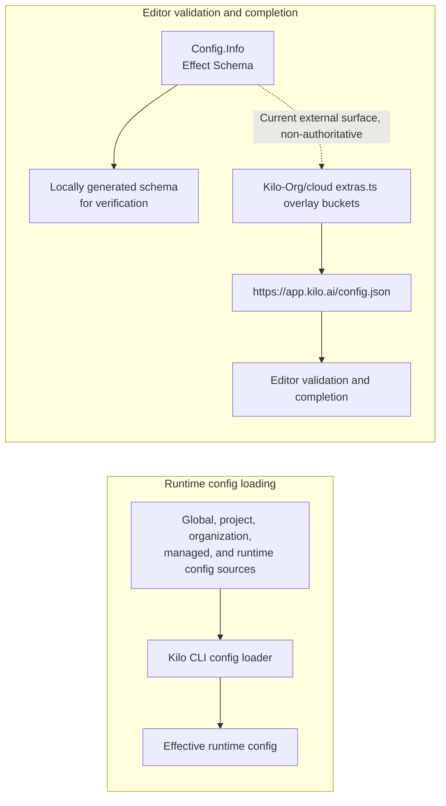

# CLI Config Schema

Kilo config has two separate paths:

- Kilo CLI runtime loads and merges config locally; this repository is authoritative for the fields the CLI accepts.
- A cloud-served JSON Schema currently gives editors validation and completion for `kilo.json` and `kilo.jsonc`. This is an external compatibility surface, not a synchronization obligation.

JSON Schema does not load, apply, or override runtime config.

```jsonc
{
  "$schema": "https://app.kilo.ai/config.json"
}
```

## Two separate paths



Changing runtime config precedence affects the first path. Adding or changing a config key is complete within this repository when the Effect Schema and hot/cold classification land; the external schema surface does not gate completion. See [CLI Runtime config precedence](/docs/contributing/architecture/cli-runtime#config-precedence) for runtime merge order. How a save applies at runtime — hot versus cold — is specified in [CLI Runtime config update lifecycle](/docs/contributing/architecture/cli-runtime#config-update-lifecycle).

## Source of truth

Canonical CLI config source is Effect Schema `Config.Info` in `packages/opencode/src/config/config.ts` in [`Kilo-Org/kilocode`](https://github.com/Kilo-Org/kilocode). CLI derives `.zod` compatibility surface from Effect Schema for plugin and SDK consumers. Do not maintain separate handwritten Zod definition for Kilo config fields.

## Cloud schema endpoint

Static source review of [`Kilo-Org/cloud`](https://github.com/Kilo-Org/cloud) shows this route behavior:

1. Editor fetches `https://app.kilo.ai/config.json` because config file references `$schema`.
2. Cloud route `apps/web/src/app/config.json/route.ts` fetches `https://opencode.ai/config.json`.
3. Route runs `merge()` and returns upstream schema with Kilo additions and overrides.
4. `merge()` overlays buckets from `apps/web/src/app/config.json/extras.ts`.

Cloud source defines 1-hour upstream revalidation and edge-cache headers. This describes checked-in route behavior, not live deployment or cache state. It is a current implementation in another repository, not an obligation on this one: the surface may be refactored or removed, and it never gates runtime acceptance.

## Overlay buckets

Reviewed cloud source overlays:

| Bucket | Purpose |
|---|---|
| `top` | Top-level Kilo keys and overrides |
| `agents` | Kilo primary agents under `agent` |
| `experimental` | Kilo experimental keys under `experimental` |

Nested CLI fields outside these buckets need dedicated overlay bucket and matching `merge()` logic. These buckets are a non-authoritative compatibility surface for editor completion.

## Failure mode

If a stale overlay misses a valid CLI field, CLI can accept config while editor reports `unknown property`. Opposite drift is also possible: overlay can advertise field that runtime no longer accepts. These are external-surface compatibility drifts, not runtime failures. This repository's schema generation is authoritative for fields the CLI accepts; keep branch-specific drift findings in tracked issues or test output, not this architecture page.

## Adding or changing Kilo-only config key

1. Add or update Effect Schema field in `packages/opencode/src/config/config.ts`. Classify the runtime save lane: add the key to the hot-key set in `packages/opencode/src/kilocode/config/hot-keys.ts`, or leave it absent for cold — see [CLI Runtime config update lifecycle](/docs/contributing/architecture/cli-runtime#config-update-lifecycle).
2. Generate JSON Schema shape:

```sh
bun --bun packages/opencode/script/schema.ts /tmp/kilo.json
jq '.properties.<new_key>' /tmp/kilo.json
```

These two steps complete the key within this repository. No cross-repository step is required.


For the current cloud-served editor schema to keep describing the new key, mirror it into `apps/web/src/app/config.json/extras.ts` in [cloud repo](https://github.com/Kilo-Org/cloud) and extend `merge()` in `apps/web/src/app/config.json/route.ts` when a new nested bucket is required. This is an optional compatibility update for external consumers, not part of this repository's completion criteria.


## Source map

Repository column identifies source root for each relative path.

| Repository | Source path | Role |
|---|---|---|
| `Kilo-Org/kilocode` | `packages/opencode/src/config/config.ts` | Canonical Effect Schema and derived `.zod` surface |
| `Kilo-Org/kilocode` | `packages/opencode/src/kilocode/config/hot-keys.ts` | Runtime hot/cold save classification |
| `Kilo-Org/kilocode` | `packages/opencode/script/schema.ts` | Locally generated JSON Schema for verification |
| `Kilo-Org/cloud` | `apps/web/src/app/config.json/route.ts` | Cloud overlay route (current, non-authoritative external surface) |
| `Kilo-Org/cloud` | `apps/web/src/app/config.json/extras.ts` | Kilo overlay buckets (current, non-authoritative external surface) |
| `Kilo-Org/cloud` | `apps/web/src/tests/cli-config-schema.test.ts` | Cloud schema assertions (current, non-authoritative external surface) |

## Related pages

- [CLI Runtime config update lifecycle](/docs/contributing/architecture/cli-runtime#config-update-lifecycle) - hot/cold save classification and convergence model
- [CLI Runtime](/docs/contributing/architecture/cli-runtime#config-precedence) - runtime config loading and precedence
- [Development Patterns](/docs/contributing/architecture/development-patterns) - shared-file seams, modular boundaries, and contributor workflow
