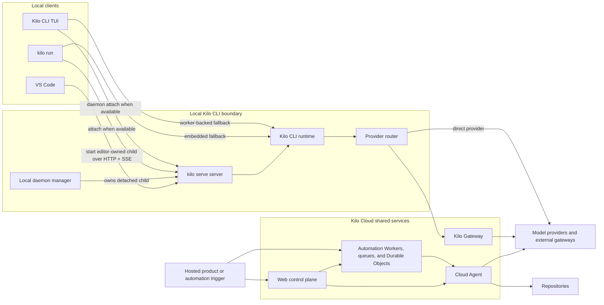
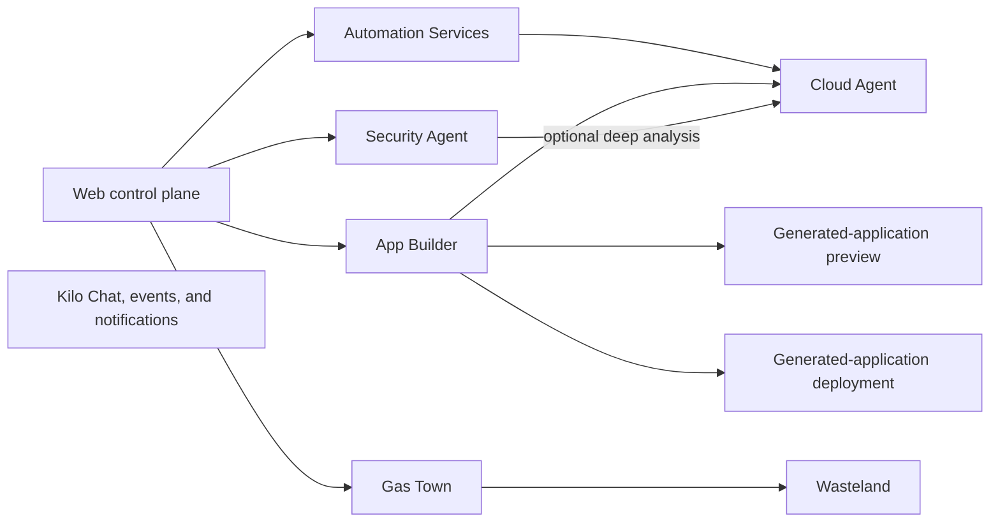

# Architecture Overview

This page maps Kilo Code's repository-defined architecture. It introduces the local runtime, editor clients, cloud service boundaries, and hosted execution products before the subsystem pages add implementation detail.


Use these pages for stable system boundaries and contributor-wide contracts. Source code remains the reference for feature-level implementation details. Static source shows code paths and deployable surfaces, not production enablement, traffic, retention, or vendor configuration.


## How to read these pages

Choose the path closest to the change you are making:

| Contributor path | Suggested order |
|---|---|
| Local CLI or editor client | Architecture Overview -> [CLI Runtime](/docs/contributing/architecture/cli-runtime) -> [VS Code Extension](/docs/contributing/architecture/vscode-extension) |
| Hosted platform or automation | Architecture Overview -> [Cloud Platform](/docs/contributing/architecture/cloud-platform) -> [Automation Services](/docs/contributing/architecture/automation-services) |
| Security review | Architecture Overview -> [Cloud Platform](/docs/contributing/architecture/cloud-platform) -> [Cloud Security](/docs/contributing/architecture/cloud-security) |
| Architecture-facing implementation | Relevant architecture page -> [Development Patterns](/docs/contributing/architecture/development-patterns) |
| CLI config ownership or key change | [CLI Runtime](/docs/contributing/architecture/cli-runtime#config-update-lifecycle) -> [CLI Config Schema](/docs/contributing/architecture/config-schema) -> [Development Patterns](/docs/contributing/architecture/development-patterns) |

## Repository boundaries

Architecture pages cross two repositories:

| Repository | Contents |
|---|---|
| [Kilo&#8209;Org/kilocode](https://github.com/Kilo-Org/kilocode) | Kilo CLI runtime, local daemon, VS Code extension, JavaScript SDK, Kilo Gateway client, telemetry, docs, and shared UI packages |
| [Kilo&#8209;Org/cloud](https://github.com/Kilo-Org/cloud) | Web control plane, Kilo Gateway routes, Cloud Agent session runtime, automation, generated-application preview and deployment services, Gas Town, billing, and supporting Workers |

### Repository autonomy

`Kilo-Org/kilocode` is independently governed and authoritative for its own behavior. Its ancestry from the OpenCode project and its current integrations with `Kilo-Org/cloud`, the generated JavaScript SDK, and external schema endpoints are historical or current implementation facts. They are not upstream authorities, and compatibility with them is not a future design invariant: these names, boundaries, and integrations may be refactored or removed as this repository evolves. Contents of other repositories are described for context only, and nothing on these pages obligates this repository to synchronize with them.

## Three architecture layers

| Layer | Responsibility | Typical boundaries |
|---|---|---|
| Local runtime and clients | Runs local coding sessions and connects editor surfaces to one local agent engine | Kilo CLI runtime, `kilo serve` server, local daemon, VS Code extension |
| Kilo Cloud shared services | Handles hosted identity, authorization, model routing, billing, orchestration, and shared product services | Web control plane, Kilo Gateway, Workers, queues, Durable Objects, persistence |
| Hosted product runtimes and automation | Runs scoped cloud work for coding, app generation, assistants, security analysis, and multi-agent orchestration | Cloud Agent, Automation Services, App Builder, Security Agent, Gas Town, Wasteland |

Local execution and hosted execution are separate boundaries. Editor clients use a local `kilo serve` server. Hosted automation can launch Cloud Agent execution sessions when cloud coding work is required.

## Terms used throughout

| Term | Meaning |
|---|---|
| Kilo Code | Umbrella product across local clients, Kilo CLI runtime, and Kilo Cloud services |
| Kilo CLI runtime | Local agent engine in `packages/opencode/`; owns tools, sessions, config, persistence, and provider routing |
| `kilo serve` server | Local HTTP and SSE process used by editor clients; selected browser-oriented paths also use WebSocket |
| Local daemon | Detached reusable `kilo serve` server managed by `kilo daemon` commands |
| Directory context | Normalized local filesystem directory used to select local runtime state |
| Local runtime instance | Directory-keyed runtime context inside one Kilo CLI process |
| Local routing workspace | Optional routing context that can resolve to a local directory or remote target |
| Worktree directory | Alternate git worktree path used as a directory context for isolated concurrent work |
| Web control plane | Hosted Kilo Cloud application layer for identity, organization authorization, billing, product configuration, and API orchestration |
| Kilo Gateway | First-party hosted model-routing boundary |
| Cloud Agent | Hosted coding-session capability. A Cloud Agent execution session is one hosted run; current session runtime implementation lives in `services/cloud-agent-next/`. |

## Core execution spine

The three layers appear in two primary execution shapes: local client requests and hosted cloud work.

### Two execution paths

| Path | Starts from | Runs in | What to remember |
|---|---|---|---|
| Local coding | Kilo CLI or VS Code | Kilo CLI runtime on developer machine | Editor clients talk to local `kilo serve` server. Local runtime owns coding session and sends model requests directly or through Kilo Gateway. |
| Hosted work | Webhook, source-control event, command, schedule, or hosted product | Kilo Cloud services; Cloud Agent when coding is required | Cloud services coordinate work. Only flows that need repository changes launch Cloud Agent execution session. |

This distinction is central: using editor does not move coding session into Cloud Agent. Cloud services also route model requests, deliver chat events, dispatch notifications, serve generated applications, and coordinate adjacent hosted boundaries without launching Cloud Agent.

## Adjacent hosted boundaries

The core execution spine is not the full cloud product catalog. These service families and hosted runtimes attach to it for specific product flows:

| Boundary | Role | Topology or workflow | Security review |
|---|---|---|---|
| Automation Services | Turns commands, source-control events, labels, webhooks, and schedules into scoped work | [Automation Services](/docs/contributing/architecture/automation-services) | [Trust boundaries](/docs/contributing/architecture/cloud-security#trust-boundaries) |
| App Builder | Coordinates generated-application coding, preview, build, and deployment boundaries | [Cloud Platform](/docs/contributing/architecture/cloud-platform#app-generation-boundaries) | [Preview and deployment](/docs/contributing/architecture/cloud-security#generated-application-preview-and-deployment) |
| Security Agent | Syncs findings and analyzes risk; selected deep analysis can launch Cloud Agent | [Cloud Platform](/docs/contributing/architecture/cloud-platform#security-agent) | [Sync and cleanup](/docs/contributing/architecture/cloud-security#security-agent-sync-and-cleanup) |
| Gas Town and Wasteland | Coordinate multi-agent repository work and collaborative commons paths | [Cloud Platform](/docs/contributing/architecture/cloud-platform#gas-town-and-wasteland) | [Trust boundaries](/docs/contributing/architecture/cloud-security#trust-boundaries) |

## Local entry points and clients

These local surfaces live in [`Kilo-Org/kilocode`](https://github.com/Kilo-Org/kilocode). Package paths below are relative to that repository root.

| Surface | Package in `Kilo-Org/kilocode` | Runtime model |
|---|---|---|
| Kilo CLI TUI | `packages/opencode/` | Interactive local client with daemon attach and worker-backed fallback paths |
| `kilo run` | `packages/opencode/` | Headless prompt execution through explicit attach, daemon attach, or embedded fallback |
| `kilo serve` | `packages/opencode/` | Local HTTP + SSE server for local clients |
| VS Code extension | `packages/kilo-vscode/` | Extension host starts one shared editor-owned `kilo serve` server and routes webviews through HTTP + global SSE; SDK directory selects local runtime instance |

## Cloud service families

Hosted service families live in [`Kilo-Org/cloud`](https://github.com/Kilo-Org/cloud). Paths below are relative to that repository root unless another repository is named.

| Boundary | Primary source paths | Role |
|---|---|---|
| Kilo Cloud | `apps/web/``services/` | Hosted platform repository for identity, billing, routing, product configuration, automation, and scoped execution services |
| Web control plane | `apps/web/` | Hosted application layer for authorization, configuration, and API orchestration |
| Kilo Gateway | `apps/web/src/app/api/gateway/``apps/web/src/lib/ai-gateway/`Local integration: `Kilo-Org/kilocode/packages/kilo-gateway/` | First-party model-routing boundary and local client integration |
| Cloud Agent | `services/cloud-agent-next/` | Hosted coding-session capability with policy-selected sandbox allocation |
| Automation Services | `services/code-review-infra/``services/auto-triage-infra/``services/auto-fix-infra/``services/security-auto-analysis/``services/security-sync/``services/webhook-agent-ingest/` | Trigger-driven review, triage, fix, security, and configured webhook flows |
| Adjacent hosted boundaries | `services/app-builder/``services/gastown/``services/wasteland/`Supporting services | App Builder, Gas Town, Wasteland, chat, notifications, and supporting services |

## Supporting packages

These supporting packages also live in [`Kilo-Org/kilocode`](https://github.com/Kilo-Org/kilocode). Package paths below are relative to that repository root.

| Package in `Kilo-Org/kilocode` | Role |
|---|---|
| `packages/sdk/js/` | Generated JavaScript client and handwritten wrapper for local server APIs |
| `packages/kilo-gateway/` | Local Kilo Gateway client integration used by Kilo CLI runtime |

## Architecture pages

| Page | What it covers |
|---|---|
| [CLI Runtime](/docs/contributing/architecture/cli-runtime) | Local execution modes, daemon, server authentication, routing, persistence, snapshots, SDK, config, and SSE |
| [VS Code Extension](/docs/contributing/architecture/vscode-extension) | Shared local `kilo serve` ownership, webview bridge, Agent Manager, PTYs, recovery, bundled resources, and build outputs |
| [Cloud Platform](/docs/contributing/architecture/cloud-platform) | Hosted service inventory, Cloud Agent topology, shared cloud boundaries, and adjacent hosted runtimes |
| [Automation Services](/docs/contributing/architecture/automation-services) | Trigger-driven Workers, queues, callbacks, ownership, and scoped execution paths |
| [Cloud Security](/docs/contributing/architecture/cloud-security) | Cloud trust boundaries, data flows, persistence, isolation, controls, and third-party categories |

## Development pages

After system-boundary pages, continue with Development Patterns for implementation rules. Use CLI Config Schema when changing config keys.

| Page | What it covers |
|---|---|
| [Development Patterns](/docs/contributing/architecture/development-patterns) | Code-ownership decisions, modular boundaries, SDK generation, validation guards, and historical fork provenance |
| [CLI Config Schema](/docs/contributing/architecture/config-schema) | Runtime-loading and editor-validation paths for CLI config keys |

## Documentation impact governance

Canonical architecture docs are the truth source for system boundaries and contributor-wide contracts. Source code remains the reference for feature-level implementation detail. When a change may touch the areas below, or when preparing a commit, assess the relevant diff against the canonical docs and update them or record a concrete rationale in that result. When a PR is opened, the `## Documentation Impact` section in the PR body records the contributor's decision; CI checks the evidence, and local assessment and reviewers judge the semantics. Pure investigation and ordinary no-impact tasks need no check and no report.

### When architecture docs must be synchronized

Changes to these areas must be assessed locally against the canonical docs, and require a `## Documentation Impact` declaration in the PR body when the impact is high and a PR is opened:

- System boundaries, state ownership, or lifecycle
- Persistence or concurrency contracts
- Public protocol (HTTP API, SSE, SDK, config schema)
- Config application semantics (hot/cold classification, convergence)
- Cross-client contracts shared by editor clients, TUI, and hosted services
- Guard or workflow models (CI guards, workflow inventory)

Local assessment is the primary standard: when a change may touch the areas below, or when preparing a commit, inspect the relevant diff, read the mapped canonical docs for high-impact changes, and update them or record a concrete rationale in that result. The PR is the durable declaration/CI boundary when used — the persistent surface, not the only boundary.

### Declaration, CI, and reviewer judgment

Exactly one status may be checked in the `## Documentation Impact` section:

| Status | Meaning |
|---|---|
| Architecture docs updated | Lists the canonical docs actually changed; `Canonical docs:` values must match changed docs |
| Not applicable | Requires a `Rationale:` explaining why no canonical doc changes |

CI validates the decision evidence — the declaration exists, is well-formed, and matches the changed canonical docs — and never judges semantic correctness. Local assessment and reviewers own semantic accuracy. The pre-commit hook is advisory only; it never substitutes for local assessment or the declaration.

Local outcomes follow two short forms: for high impact, `Docs updated: <paths>` or `No doc update: <rationale>`; for medium or no impact, a concise statement suffices, and pure investigation or ordinary no-impact work needs no report. These are guidance, not a required markdown format.

### Gate trust and recovery boundaries

The gate executes the checker revision the base commit already contains, never the PR branch's own copy — a PR cannot edit the checker to pass its own gate. The required workflow is still not an absolute root of trust for its own PR-branch definition: branch protection and reviewer governance are the backstop. Changes to the gate itself — the workflow file or `script/check-architecture-impact.ts` — are themselves high-impact and require the `## Documentation Impact` declaration plus focused review.

The gate fails closed when base or head commit objects cannot be obtained. A base SHA orphaned by a force-push is resolved by updating or rebasing the PR onto the current base, or by rerunning after the base stabilizes; the gate never silently falls back to a different diff. Checker bootstrap runs the PR's checker for one run only when the base does not yet contain the checker, and it emits a visible warning.

The checker implementation and signal taxonomy live in `script/check-architecture-impact.ts`; when a change may have architecture impact, or when preparing a commit, run `bun run script/check-architecture-impact.ts --worktree` locally to preview detected signals as local assessment guidance: inspect the relevant diff, read the mapped canonical docs for high signals, and update them or record a concrete rationale in that result.

## Related pages

- [CLI Runtime](/docs/contributing/architecture/cli-runtime) - local runtime, server, routing, persistence, and SDK contracts
- [Cloud Platform](/docs/contributing/architecture/cloud-platform) - hosted layers, Cloud Agent topology, and adjacent hosted boundaries
- [Cloud Security](/docs/contributing/architecture/cloud-security) - cross-cutting trust boundaries, controls, and shared responsibility
- [Development Patterns](/docs/contributing/architecture/development-patterns) - code-ownership decisions and contributor workflow
- [Development Environment](/docs/contributing/development-environment) - setup guide
- [Ecosystem](/docs/contributing/ecosystem) - related projects and integrations
