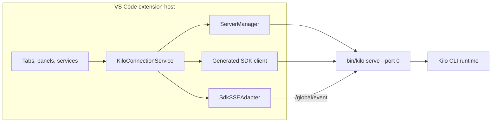
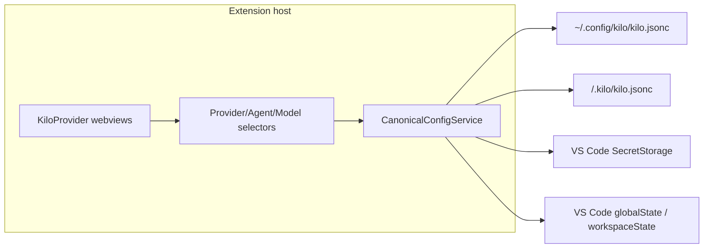

# VS Code Extension Architecture

The VS Code extension (`packages/kilo-vscode/`) is a client of [Kilo CLI runtime](/docs/contributing/architecture/cli-runtime). It bundles platform CLI binary, starts one shared editor-owned `kilo serve` server on demand, and drives that server through generated SDK HTTP calls plus global SSE.


This page covers extension-host ownership, webview routing, Agent Manager, local terminal paths, recovery, bundled resources, and build outputs. It is not full extension feature inventory.


## Shared server ownership

[CLI Runtime](/docs/contributing/architecture/cli-runtime) defines shared local-server authentication, directory routing, provider routing, persistence, and SSE contracts. This page starts at VS Code client boundary.

Activation creates one `KiloConnectionService`. It owns one `ServerManager`, one active SDK client, and one SSE adapter. `ServerManager` owns child process lifecycle. This editor-owned child is separate from detached local daemon managed by `kilo daemon`.



| Area | Behavior |
|---|---|
| Startup | Lazy on client demand; the speech-to-text capture prewarm is the only retention that can touch server-side capture during activation (historical baseline) |
| Binary | Uses extension `bin/kilo`, or `bin/kilo.exe` on Windows |
| Port | Starts `kilo serve --port 0`; CLI server prefers `4096`, then asks OS for free port |
| Authentication | Generates random 32-byte hex password per spawn and passes it as `KILO_SERVER_PASSWORD`; username defaults to `kilo` |
| Reuse | Editor tabs, panels, Agent Manager, and host services share active server |
| Exit | `ServerManager` clears dead child; connection service clears SDK/SSE state and enters error state |
| Replacement | Later retry or connection attempt starts replacement server |
| Private fd carrier (B1) | `ServerManager` spawns with 5 stdio entries; `stdio[3]`/`stdio[4]` are exposed as `privateWriter`/`privateReader` with `pid`/`epoch` when the OS supports extra fds, otherwise fail-closed and SDK remains authoritative. `KiloConnectionService` owns `ServePrivatePeer` negotiation (`kilo-private/1` + `session/cancelQueued` capability) and clears it on exit/dispose/reset. Unavailable peer never interrupts SDK; G3 remains Active and no second listener is created. |
| Private fd carrier (B2) | Same 5-stdio carrier now negotiates `kilo-private/1` + `session/update` capability as well (`FD_CAPABILITIES = ["session/cancelQueued","session/update"]`). `ServePrivatePeer.validateSessionUpdateRequest` mirrors `SessionUpdateDispatch.validateRequest` (absolute directory, `SessionID`, `parentSessionId` must be `null`, title trim/200/control, strict fields, `opId` `sessionUpdate:<id>(:<token>)?` binding). `KiloProvider.buildSessionUpdateIdentity` creates one `token` (`crypto.randomUUID()`) shared by `opId` (`sessionUpdate:<id>:<token>`) and `idempotencyKey` (`sessionUpdate:<id>:<token>`). `handleRenameSession` SDK-first with `response.status` terminal gate (`400/404/409/500`) and 3 s private timeout (`ambiguous transportUnknown`), `compareUpdateParity` logs only (title/failure class vs `response.status`), never replaces SDK `Session.Info`. `fd-carrier.ts` `session/update` routes to `dispatchPrivate` replay-only (no `INSERT` when no record). G3 remains Active; Linux/Windows not overstated. |

## Private `session/cancelQueued` carrier (G3-B1) — parity-only, same AppLayer

B1 adds one bounded private path for `session/cancelQueued` over the existing `kilo serve` fd3/fd4 into the same `AppRuntime` dispatch. Generated SDK HTTP/SSE remains authoritative; the private path is terminal-replay parity observation only. No Unix socket, no second TCP listener, and no SDK regeneration.

| Aspect | Behavior |
|---|---|
| Spawn & streams | `ServerManager` uses `stdio: ["ignore","pipe","pipe","pipe","pipe"]` and captures `process.stdio[3]` as `privateWriter` and `stdio[4]` as `privateReader` alongside `pid`/`epoch`. `releasePrivateStreams` destroys both on exit/dispose with exact-PID semantics (decoy pid untouched). Port discovery still reads `stdout` for `kilo server listening on http://127.0.0.1:<port>`. |
| Availability | Extension side requires both fds and a successful `ServePrivatePeer.initialize(5000)` that validates `protocol.name==="kilo-private"`, `major===1`, and `capabilities` includes `session/cancelQueued` (array or object form; empty object is unavailable). Missing fds, missing `KILO_PARENT_PID`/`KILO_CLIENT`, timeout, EOF, protocol mismatch, or capability absence all mark unavailable fail-closed; `isPrivateAvailable()` requires `peer.getState()==="open"`. `kilo serve` side requires `KILO_PARENT_PID` or `KILO_CLIENT=vscode` **and** both `fstatSync(3)`/`fstatSync(4)` — otherwise no carrier is started and the server still serves HTTP. |
| Transport | JSON-RPC 2.0 length-framed (`private-worker/peer.ts` + `frame.ts`) over fd3/fd4. `ServePrivatePeer` wraps `JsonRpcPeer`, validates `v:1` envelope (`requestId`/`opId`/`idempotencyKey`/`op`/`context.directory`/`sessionId`/`payload.messageId`, `opId===cancelQueued:session:message`), and validates returned envelope (`v`, ids match, `status`, `accepted`, `outcome`, optional `revision`, `succeeded` vs `failed` vs `ambiguous` shape). Bad envelope is `failed internal`; transport-closed/epoch-drift/disposed is `ambiguous transportUnknown true`; epoch drift between call and return is also `ambiguous transportUnknown`. |
| Ownership | `ServerManager` owns the stream objects and `epoch`/`pid`; `KiloConnectionService` owns the `ServePrivatePeer` instance and its `privateAvailable`/`privateEpoch`/`privatePid`, clearing on `dispose`/`resetConnection`/`handleServerExit`. `kilo serve` owns the `fd-carrier.ts` `Peer` that delegates directly to `AppRuntime` `CancelQueuedDispatch` — no second `AppLayer`, no new authority. |
| Lifecycle | `KiloConnectionService.initPrivatePeer` is void-fired after SDK `connectedPromise`, epoch-coherent (stale epoch disposes), with 5 s timeout. `dispose()`/`resetConnection()`/`handleServerExit()` all call `disposePrivatePeer()` idempotently. Restart increments `ServerManager.epochCounter`, kills exact `pid`, verifies with `process.kill(pid,0)`, and re-negotiates a new peer. Null streams remain fail-closed while SDK HTTP still succeeds. |
| SDK-first parity | `KiloProvider.handleCancelQueued` is always SDK-first with `legacy:session:message` durable key and `cancelQueued:session:message` opId. `response.status` from the SDK tuple is authoritative for terminal detection (`400/404/409/500` terminal, others like `429` non-terminal); fallback to `error.status/statusCode/code/httpStatus`, message regex, or `_tag`. Only when terminal and `isPrivateAvailable()` does it call `privateCancelQueued` with fresh `requestId` and 3 s timeout (timeout → `ambiguous transportUnknown`). `compareParity` (`serve-private-peer.ts`) checks `transport-unknown` passthrough, `ambiguous`+`409` convergence, `cancelled` equality, and `failure` class mapping against `response.status` (`400`/`404`/`409`/`500`). Divergence is `console.warn`/`console.log` only; SDK boolean is the only user-visible outcome and no second queue transition is created. |
| Cross-platform residual | Darwin has real `ServerManager`→real `kilo serve`→fd3/fd4→same `AppLayer` production proof (rebuilt `bin/kilo` mtime/size, exact cleanup). Linux and Windows are not overstated as proven; both are fail-closed and SDK-authoritative. Windows Node parent→compiled Bun extra-fd is residual unless actual Windows evidence exists. |
| Non-goals | No `fork`/`update`/`command`/`prompt`/`provider`/`config`/private-query families, no retry scheduler, crash recovery, durable retry accounting, five-boundary convergence closure, observation worker replacement, Unix socket, second TCP listener, or G2 cleanup. `queued=true` production branch remains covered by B0 deterministic tests, not by B1 private production. G3 remains Active and Gates B/C/D/E/F do not close overall. |

## Private `session/update` carrier (G3-B2) — parity-only, same AppLayer

B2 adds a second bounded private path for `session/update` (title-only durable lane) over the same `kilo serve` fd3/fd4 into the same `AppRuntime` `SessionUpdateDispatch`. Generated SDK `PATCH /session/:sessionID` remains authoritative; the private path is terminal-replay parity observation only via `dispatchPrivate` (replay/read-only, never `INSERT` when no record, never fallback after `500`). No Unix socket, no second TCP listener, no SDK hand-edit.

| Aspect | Behavior |
|---|---|
| Spawn & streams | Reuses the same `ServerManager` 5-stdio carrier as B1 (`stdio[3]` private writer, `stdio[4]` private reader, `pid`/`epoch`). `FD_CAPABILITIES` now `["session/cancelQueued","session/update"]`; `buildInitializeResult` advertises both. Port discovery still via `stdout`. |
| Availability | Extension `ServePrivatePeer.initialize` validates `protocol.name==="kilo-private"`, `major===1` and `capabilities` must include `session/update` (array or object form; empty object is unavailable) in addition to B1's `session/cancelQueued` check; `hasCapability("session/update")` gates `privateSessionUpdate`. `kilo serve` `fd-carrier.ts` `validateProtocolVersion` and `canUseFdCarrier` same as B1 (both fds, `KILO_PARENT_PID` or `KILO_CLIENT`). `isPrivateAvailable()` still requires `peer.getState()==="open"` and `hasCapability`. |
| Transport | JSON-RPC 2.0 length-framed (`private-worker/peer.ts`+`frame.ts`) over fd3/fd4. `ServePrivatePeer.validateSessionUpdateRequest` mirrors `SessionUpdateDispatch.validateRequest`: `isAbsolute` directory, `SessionID` brand, `parentSessionId` must be `null`, `configVersion`/`sessionRevision` safe ints, `payload.title` via `validateTitleStrict` (trim/200/control), strict `unexpected field` at root/context/payload, `opId` via `parseSessionUpdateOpId` with `parts[0]===sessionId` binding (allows `sessionUpdate:<id>` or `sessionUpdate:<id>:<token>`, token non-empty no `:`). `validateSessionUpdateResult` enforces `v`/`requestId`/`opId`/`op`/`idempotencyKey` identity, `status`/`accepted`/`outcome` coherence, `succeeded` data has `title` or `session.title`. Bad envelope → `failed internal`; transport-closed/epoch-drift/disposed → `ambiguous transportUnknown true`. |
| Ownership | `ServerManager` owns streams + `epoch`/`pid`; `KiloConnectionService` owns `ServePrivatePeer` and `privateSessionUpdate` (epoch coherence, `transportUnknown` on drift) in addition to `privateCancelQueued`. `kilo serve` `fd-carrier.ts` `session/update` after `isInitialized()` routes to `AppRuntime SessionUpdateDispatch.dispatchPrivate` **only** (missing `dispatchPrivate` fails closed `MethodNotFound` without mutation, no fallback to `dispatch`) — no new authority, no `Promise` facade. |
| SDK-first parity | `KiloProvider.buildSessionUpdateIdentity` generates one `token` (`crypto.randomUUID()`) shared by `opId` (`sessionUpdate:<id>:<token>`) and `idempotencyKey` (`sessionUpdate:<id>:<token>`) + fresh `requestId`. `handleRenameSession` SDK-first: calls `renameSessionWithResult` (SDK `PATCH`), posts `sessionUpdated` on success, shows error on failure, then if `isPrivateAvailable()` and SDK result is terminal (`response.status` 100-599 integer `400/404/409/500` first, else `error.status/statusCode/code/httpStatus` + message regex + `_tag`) calls `privateSessionUpdate` with same tuple and 3 s timeout (timeout → `ambiguous transportUnknown`). `compareUpdateParity` (`serve-private-peer.ts`) checks `transport-unknown` passthrough, `ambiguous`+`409` convergence, `title` equality, and `failure` class mapping against `response.status` (`400`→`validation.failed/scope_mismatch`, `404`→`session.not_found`, `409`→`stale/conflict`, `500`→`internal`), logs `[Kilo PrivateParity] divergence/match` only; SDK `Session.Info` is sole authority and no second `title` transition is created. After SDK `500`, private still called but `dispatchPrivate` is read-only, so no second mutation. |
| Cross-platform residual | Same as B1: Darwin has unit/integration for fd3/fd4; Linux/Windows not overstated as proven, both fail-closed and SDK-authoritative. Windows extra-fd residual unless actual Windows evidence exists. |
| Non-goals | No `fork`/`command`/`prompt`/`provider`/`config`/private-query families, no retry scheduler, crash recovery, durable retry accounting, five-boundary convergence closure, observation worker replacement, Unix socket, second TCP listener, or G2 cleanup. G3 remains Active and Gates C/D/E/F/P4.4 do not close overall. Title-only lane; legacy `metadata`/`permission`/`archive` remain non-durable. |

## Private `session/create` carrier (G3-B4) — parity-only, same AppLayer

B4 adds a third bounded private path for `session/create` (durable lane) over the same `kilo serve` fd3/fd4 into the same `AppRuntime` `SessionCreateDispatch`. Generated SDK `POST /session` remains authoritative; the private path is terminal-replay parity observation only via `dispatchPrivate` (replay/read-only, never `INSERT` when no record, never fallback after `500`). No Unix socket, no second TCP listener, no SDK hand-edit.

| Aspect | Behavior |
|---|---|
| Spawn & streams | Reuses the same `ServerManager` 5-stdio carrier as B1-B3 (`stdio[3]` private writer, `stdio[4]` private reader, `pid`/`epoch`). `FD_CAPABILITIES` now `["session/cancelQueued","session/update","session/fork","session/create"]`; `buildInitializeResult` advertises four. Port discovery still via `stdout`. |
| Availability | Extension `ServePrivatePeer.initialize` validates `protocol.name==="kilo-private"`, `major===1` and `capabilities` must include `session/create` (array or object form; empty object is unavailable) in addition to B1-B3 checks; `hasCapability("session/create")` gates `privateCreate`. `kilo serve` `fd-carrier.ts` `validateProtocolVersion` and `canUseFdCarrier` same as B1-B3 (both fds, `KILO_PARENT_PID` or `KILO_CLIENT`). `isPrivateAvailable()` still requires `peer.getState()==="open"` and `hasCapability`. |
| Transport | JSON-RPC 2.0 length-framed (`private-worker/peer.ts`+`frame.ts`) over fd3/fd4. `ServePrivatePeer.validateCreateRequest` mirrors `SessionCreateDispatch.validateRequest`: `isAbsolute` directory, `parentSessionId` must be `null`, `configVersion` safe-int, `title` trim/200/control, strict `unexpected field` at root/context/payload, `opId` via `SessionOperation.parseOpId` `create` single segment, `sandboxInheritanceToken` explicit reject. `validateCreateResult` enforces `v`/`requestId`/`opId`/`op`/`idempotencyKey` identity, `status`/`accepted`/`outcome` coherence, `succeeded` data has `session`. Bad envelope → `failed internal`; transport-closed/epoch-drift/disposed → `ambiguous transportUnknown true`. |
| Ownership | `ServerManager` owns streams + `epoch`/`pid`; `KiloConnectionService` owns `ServePrivatePeer` and `privateCreate` (epoch coherence, `transportUnknown` on drift) in addition to previous `privateCancelQueued`/`privateSessionUpdate`/`privateFork`. `kilo serve` `fd-carrier.ts` `session/create` after `isInitialized()` routes to `AppRuntime SessionCreateDispatch.dispatchPrivate` **only** (missing `dispatchPrivate` fails closed `MethodNotFound` without mutation, no fallback to `dispatch`) — no new authority, no `Promise` facade. |
| SDK-first parity | `KiloProvider` create dispatch is SDK-first with `SessionOperation.createId` (`create:<token>`) shared by `opId` and `idempotencyKey` + fresh `requestId`. Calls `client.session.create` (`POST /session` with `directory` + `title` + `idempotencyKey`/`requestId`/`opId`/`context`), then if `isPrivateAvailable()` and SDK result is terminal (`response.status` 100-599 integer `400`/`409`/`500` first, else fallback) calls `privateCreate` with same tuple and 3 s timeout (timeout → `ambiguous transportUnknown` + epoch invalidation until next full backend connection/server reset). `compareCreateParity` (`serve-private-peer.ts`) checks `transport-unknown` passthrough, `session` equality (`id`/`directory`/`title`), and `failure` class mapping against `response.status` (`400`→`validation.failed/scope_mismatch`, `409`→`conflict/stale/InstanceUnavailableDuringConfigRebuild`, `500`→`internal`), logs `[Kilo Create] parity divergence` or `[Kilo Create] transport-unknown parity` only (silent on match); SDK `Session.Info` is sole authority and no second creation is performed. After SDK `500`, private still called but `dispatchPrivate` is read-only, so no second mutation. Effective route/body directory binding verified — `directory` must match canonical route directory or `400 scope_mismatch` with zero insert (`directory mismatch` test). `sandboxInheritanceToken` is explicitly rejected `400` both dispatch+HTTP. |
| Cross-platform residual | Same as B1-B3: Darwin has `ServerManager`→`kilo serve`→fd3/fd4 unit/integration for `session/create`; Linux/Windows not overstated as proven, both fail-closed and SDK-authoritative. Windows extra-fd residual unless actual Windows evidence exists. |
| Non-goals | No `command`/`prompt`/`provider`/`config`/private-query families, no retry scheduler, crash recovery, durable retry accounting, five-boundary convergence closure, observation worker replacement, Unix socket, second TCP listener, or G2 cleanup. G3 remains Active and Gates C/D/E/F/P4.4 do not close overall. Create lane only; `sandboxInheritanceToken` remains explicitly unsupported for durable create. |

## Lifecycle and fork artifact ownership hardening (systemic, B4)

Systemic hardening shared across `cancelQueued`/`update`/`fork`/`create` carriers and fork artifact path. All remain fail-closed with no auto-recovery; timed-out pending cannot accumulate; fork normal failures compensate only attempt-owned artifacts; FS-to-DB crash orphan is explicit/unclaimed.

| Area | Hardened behavior |
|---|---|
| `JsonRpcPeer` exact request ownership | `requestWithId(method, params)` allocates exact `id` atomically (`nextId++`) and registers `pending.set(id)` before `write`; `getPendingIds()`/`peekNextJsonRpcId()` inspectable for tests. `tryCancelPending(id, message)` removes exactly one entry, rejects with `InternalError` `message`, returns `true` if present else `false` + `false` triggers peer invalidation in `ServePrivatePeer` path. Writer synchronous throw (`write` throws) → `transitionClosed("writer sync throw")` → `rejectAllPending` → `state="closed"` and subsequent `request` rejects immediately without leak; writer async `emit "error"` → same. EOF/stream `close`/`error` also transitions to `closed`. Malformed `Content-Length` → `ParseError` + closed. All ensure `pending.size===0` after close and second immediate `request` after close rejects without hanging. Parity: `packages/opencode/src/private-worker/peer.ts` ↔ `packages/kilo-vscode/src/private-worker/peer.ts` (3 s exact cancellation owner). Verified by `peer-writer-timeout.test.ts` 4 pass 21 expects + `session-create-private.test.ts` exact-id allocation. |
| `ServePrivatePeer` lifecycle | `initialize()` serialized — concurrent second shares in-flight promise and increments `initCount` only once; stale completion after `dispose()` rejected and does not resurrect `isAvailable()`. Late `initialize` after `dispose()` stays unavailable even if backend later responds. Failed `initialize` (timeout 100 ms in test, 5000 ms production) invalidates transport — same instance second stays false, new instance reusing same streams stays false; only fresh `PassThrough` succeeds. Stale same-epoch `onClosed` guard cannot disable current peer — `isAvailable()` stays true after disposing old peer. Verified by `lifecycle-hardening.test.ts` 10 pass 56 expects (6 peer lifecycle + 4 server/connection). |
| `ServerManager` process ownership | Spawns `bin/kilo serve --port 0` with 5 stdio, captures `privateReader`/`privateWriter`/`pid`/`epoch`/`port`; port via `stdout` `kilo server listening on`. Dead after port not cached (`instance===null` after 200 ms). Dispose during startup kills exact `startingProc.pid` via SIGTERM→SIGKILL fallback (30 s prod → 600 ms test via patched `setTimeout`) and clears `startupPromise`; watchdog cleared. Startup timeout with non-exiting child kills exact owned child with SIGTERM then SIGKILL fallback, decoy pid stays alive; all paths verify decoy untouched (exact PID kill). Verified by `lifecycle-hardening.test.ts` 3 server-manager tests. |
| `KiloConnectionService` connection ownership | Owns `privatePeer`/`privateAvailable`/`privateEpoch`/`privatePid` + `client`/`sseClient`/`info`. `initPrivatePeer` is epoch-coherent and void-fired after `connectedPromise` with 5 s timeout; `dispose()`/`resetConnection()`/`handleServerExit()` all call `disposePrivatePeer()` idempotently. Dispose during `connect()`'s delayed `getServer()` invalidates pending connect continuation — `connect` rejects with `Error`, `client`/`sseClient`/`privatePeer` stay `null` after, and late `connect` after dispose rejects without resurrecting stale `client`. Verified by `lifecycle-hardening.test.ts` connection test. |
| 3 s exact peer/epoch timeout (LOCK-002) | `KiloProvider` `withTimeout(promise, 3000).catch` on timeout calls `handle.cancel("private parity timeout opId=...")` with exact `id` via `privateCreateWithHandle`/`privateForkWithHandle`/`privateSessionUpdateWithHandle`/`privateCancelQueuedWithHandle`; `tryCancelPending` returns `true` → `pending.size` drops by 1 and promise settles as `ambiguous transportUnknown true` with no leak; unrelated pending remains. If `tryCancelPending` returns `false` (already absent — late response or stale epoch), the peer is disposed/invalidated (`invalidateOnObserverTimeout` → `peer.dispose()` + `isAvailable()===false`) until the next full `KiloConnectionService.connect`/`ServerManager` replacement creates new peer/epoch (no auto-reconnect). Epoch drift check (`privateEpoch !== epochAtCall` or `privatePeer !== peerAtCall`) synthesizes `ambiguous transportUnknown` even if late peer response arrives — replacement peer reusing numeric `id` is not affected by old-handle cleanup (owned handle isolation proven by `session-create-private.test.ts` replacement peer test). No retry scheduler. |
| Fork artifact ownership (LOCK-002) | Target `SessionID` occupation probed before any FS write (`SessionTable.id` + `EventSequenceTable`/`EventTable` aggregate + `SandboxStore.read` + `fs.stat(storageFile(baseKey))` + `fs.stat(storageFile(session_diff))`); any `EEXIST` or pre-occupied → `409 conflict` before effects, probe error other than `ENOENT` → `500 internal` fail-closed. `ownedBase`/`ownedDiff`/`ownedSandbox` flags set only after exclusive `wx` success (`fs.writeFile({flag:"wx"})` for diffs, `SandboxStore.writeExclusive` for sandbox); partial failure cleans only owned via direct `fs.rm` of owned path (`storageFile(baseKey)` only, not pre-existing) — flags cleared only after **all required cleanup for that owned artifact succeeds** (`okStorage && okFs` or `okRemove && okEvict`), retained on cleanup failure with `Effect.logWarning` `{target, cause}` without masking original fork failure — deterministic `failCleanupFs`/`failCleanupStorage` injection proves original error preserved, warning `{target, cause}`, flag retained as file remains (verified by `session-fork-ownership.test.ts` 10 pass 87 expects); existing `EventSequenceTable`/`EventTable` aggregate without `SessionTable` maps to same typed `fork target already exists` `conflict` with no FS/DB mutation and original event preserved (verified by `session-fork-event-preflight.test.ts` 2 pass 40 expects with full no-mutation assertions for both orphaned aggregate and sequence-only cases). `failFirstDiffWrite`/`failSecondDiffWrite`/`failSandboxWrite`/`failTxAfterFs` seams prove attempt-owned compensation only, with legacy `Session.fork` additionally removing the `EventSequence`/`EventTable` `session.created` aggregate scoped to the forked `SessionID` on late failure (preserving unrelated aggregates). DB `BEGIN IMMEDIATE` contains only `INSERT session` + `EventV2` + `INSERT session_operation`; filesystem side effects are outside. Crash between FS `wx` and DB commit may leave orphaned FS files with no DB row — orphan residual explicit/unclaimed; no automatic recovery subsystem claims cross-resource crash atomicity. `KiloSession.register` + `SandboxPolicy.inherit` after commit are best-effort (`catch(() => void)`) so DB-committed row + `result_snapshot` stay valid even if inherit fails. Verified by `session-fork-ownership.test.ts` 10 pass 87 expects + `session-fork-persistence.test.ts` 8 pass 56 expects + `session-fork-event-preflight.test.ts` 2 pass 40 expects. |
| Non-claims | No claim of Linux/Windows fd3/fd4 production support — Darwin only (Darwin production 1 pass 79 expects `server-manager-b4-integration.test.ts` 2026-09-02 Darwin, `skipIf` Darwin-only; Linux/Windows remain unproven, fail-closed only). No claim of cross-resource FS-to-DB crash atomicity — orphan explicit/unclaimed. No claim of live retention trimming, real mid-flight epoch ambiguous beyond 3 s unit, or auto-recovery — all remain fail-closed until full backend connection/server reset. |

## Private `session/status` carrier (G3-B5) — parity-only, same AppLayer

B5 adds a bounded private path for `session/status` (read-only status seed parity) over the same `kilo serve` fd3/fd4 into the same `AppRuntime` `SessionStatus` map. Generated SDK `client.session.status` HTTP remains authoritative; the private path is warn-only parity observation via `seedSessionStatuses` observer. No Unix socket, no second TCP listener, no SDK hand-edit, no `SessionOperation`/DB/EventV2/retention/cache authority, no permission (R18) change.

| Aspect | Behavior |
|---|---|
| Spawn & streams | Reuses the same `ServerManager` 5-stdio carrier as B1-B4 (`stdio[3]` private writer, `stdio[4]` private reader, `pid`/`epoch`). `FD_CAPABILITIES` now `["session/cancelQueued","session/update","session/fork","session/create","session/status"]`; `buildInitializeResult` advertises five. Port discovery still via `stdout`. |
| Availability | Extension `ServePrivatePeer.initialize` validates `protocol.name==="kilo-private"`, `major===1` and accepts any compatible negotiated capability (array or object form; empty object is unavailable); `session/status` is a method-specific negotiated capability and `hasCapability("session/status")` gates `privateStatus` fail-closed when absent. `kilo serve` `fd-carrier.ts` `validateProtocolVersion` and `canUseFdCarrier` same as B1-B4 (both fds, `KILO_PARENT_PID` or `KILO_CLIENT`). `isPrivateAvailable()` still requires `peer.getState()==="open"` and `hasCapability`. |
| Transport and validation | JSON-RPC 2.0 length-framed over fd3/fd4. `ServePrivatePeer.validateStatusRequest` mirrors backend: `isAbsolute` directory, `idempotencyKey===opId`, empty `payload`, strict `unexpected field` at root/context, `revision`/`configVersion`/`sessionRevision`/`sessionId` cargo rejected. `buildStatusOpId` binds `status:<token>` (non-empty, colon-free). `validateStatusResult` enforces `v`/`requestId`/`opId`/`op`/`idempotencyKey` identity, `status`/`accepted`/`outcome` coherence, complete `SessionStatus` semantic fields only, strict allowlists (no `revision`/`transportUnknown` on `succeeded`/`failed`, no unknown root/outcome/failure fields, `failure.detail` presence mirrored). Malformed wire normalizes to typed `{ kind: "invalid", detail }` via `normalizePrivateStatusWire` and bypasses the normal result union/`compareStatusParity` as `validation divergence`; transport-closed/epoch-drift/disposed → `ambiguous transportUnknown true`. |
| SDK-first parity observer | `seedSessionStatuses` applies the SDK result first (map seed + posts + `reconcile` semantics unchanged; SDK failure never calls private and never posts), then runs one read-only private observation only when SDK data exists. `compareStatusParity` reports a parity divergence carrying `transport-unknown` for transport-unknown results, plus `status-map-mismatch` (key/type/field drift with first differing field) and `failure-class-mismatch` against SDK HTTP `response.status`, logging `[Kilo Status] parity divergence` (including divergence `transport-unknown`) / `validation divergence` only; SDK map/posts/reconcile stay authoritative. First-seed vs negotiation race defers exactly one observation per epoch + canonical directory via `addDeferredStatusObserver` (or fallback keyed hook) with stale-epoch skip; definitive negotiation failure releases deferred observers without notifying. |
| Lifecycle and timeout | `ServerManager` owns streams + `epoch`/`pid`; `KiloConnectionService` owns `ServePrivatePeer` and `privateStatusOutcomeWithHandle` (epoch coherence, `transportUnknown` on drift) in addition to previous private methods. Seed never blocks: SDK applies first, observer runs detached with `catch` containment. Bounded timeout (default 3000 ms) cancels the exact pending by `id` (`handle.cancel`/`tryCancelPending`); current-epoch cancel miss/throw epoch-invalidates the peer until the next full `KiloConnectionService.connect`/`ServerManager` replacement creates a new peer/epoch, while a stale captured handle cleans only its captured peer (`"stale"`) and never invalidates the replacement peer. No automatic retry/reconnect, no polling, no detached work. |
| Cross-platform residual | No Linux/Windows/live Extension Host PASS is claimed; all remain fail-closed and SDK-authoritative unless actual platform evidence exists. |
| Non-goals | No `SessionOperation`/DB/EventV2/retention/cache authority, no cutover/G3 closure, no Gates B/C/D/P4.4 closure, no new protocol design, no permission semantics change. B5 is additive carrier evidence, not P4.4-G3/Gate closure. |

G3 remains **Active** and SDK authoritative. No cutover, no Gates B/C/D/P4.4 closure, no Linux/Windows/live Extension Host production proof. B5 is Gate C/D preparation, not closure, per Phase invariants.

## Private `session/get` carrier (G3-B6) — parity-only, same AppLayer

B6 adds a bounded private path for `session/get` (read-only snapshot parity) over the same `kilo serve` fd3/fd4 into the same `AppRuntime` `Session.Info` snapshot. Generated SDK `client.session.get()` remains the sole authority; the private path is detached diagnostics-only via `observeSessionGetParityDetached`. No Unix socket, no second TCP listener, no SDK hand-edit, no `SessionOperation`/DB/EventV2/retention/cache authority.

| Aspect | Behavior |
|---|---|
| Spawn & streams | Reuses the same `ServerManager` 5-stdio carrier as B1-B5 (`stdio[3]` private writer, `stdio[4]` private reader, `pid`/`epoch`). `FD_CAPABILITIES` now adds `"session/get"`; `buildInitializeResult` advertises six. Port discovery still via `stdout`. |
| Availability | Extension `ServePrivatePeer.initialize` validates `protocol.name==="kilo-private"`, `major===1` and `hasCapability("session/get")` gates `privateGet` fail-closed when absent. `kilo serve` `fd-carrier.ts` `validateProtocolVersion` and `canUseFdCarrier` same as B1-B5 (both fds, `KILO_PARENT_PID` or `KILO_CLIENT`). `isPrivateAvailable()` still requires `peer.getState()==="open"` and `hasCapability`. |
| Transport and validation | JSON-RPC 2.0 length-framed over fd3/fd4. `validateGetRequest` requires `get:<sessionId>:<token>` with `idempotencyKey===opId` and `parts[0]` bound to `context.sessionId`, absolute `context.directory`, empty `payload`, strict `unexpected field` at root/context; `validateGetResult` enforces `v`/`requestId`/`opId`/`op`/`idempotencyKey` identity, `status`/`accepted`/`outcome` coherence, `succeeded` data has `session` with `Session.Info` shape. Typed failures are `session.not_found`/`scope_mismatch`/`validation.failed`/`InstanceUnavailableDuringConfigRebuild` (fenced 409)/`internal`; `compareGetParity` maps `409` to `stale`/`conflict`/`InstanceUnavailableDuringConfigRebuild`. Malformed wire normalizes to typed `invalid` via `normalizePrivateGetWire` and bypasses the comparator; transport-closed/epoch-drift/disposed → `ambiguous transportUnknown true`. |
| SDK-first parity observer | `getSessionInfo` applies the SDK `client.session.get()` result first, then runs one detached read-only private observation only on terminal SDK results. `compareGetParity` reports safe-field drift (`id`/canonical `directory`/`title` only) plus `status-mismatch` and `failure-class-mismatch` against SDK HTTP `response.status`, logging `[Kilo Get] parity divergence` / `transport-unknown parity` / `validation divergence` only; SDK data stays authoritative. First-seed vs negotiation race defers exactly one observation per epoch + canonical directory via `addDeferredGetObserver` (or fallback keyed hook) with stale-epoch skip; definitive negotiation failure releases deferred observers without notifying. |
| Lifecycle and timeout | `ServerManager` owns streams + `epoch`/`pid`; `KiloConnectionService` owns `ServePrivatePeer` and `privateGetOutcomeWithHandle` (epoch coherence, `transportUnknown` on drift) in addition to previous private methods. Observer never blocks: SDK applies first, observer runs detached with `catch` containment. Bounded 3000 ms timeout cancels the exact pending by `id` (`handle.cancel`/`tryCancelPending`); current-epoch cancel miss/throw epoch-invalidates the peer until the next full `KiloConnectionService.connect`/`ServerManager` replacement creates a new peer/epoch, while a stale captured handle cleans only its captured peer (`"stale"`) and never invalidates the replacement peer. No automatic retry/reconnect, no polling, no additional detached work beyond bounded one-shot observer. |
| Cross-platform residual | B6 evidence is Darwin-local only; no Linux B6 CI/runtime PASS, no Windows/live Extension Host PASS is claimed; all remain fail-closed and SDK-authoritative unless actual platform evidence exists. |
| Non-goals | No `SessionOperation`/DB/EventV2/retention/cache authority, no mutation dispatch, no cutover/G3 closure, no Gates B/C/D/P4.4 closure, no `session/messages` in B6 scope (B7 documents `session/messages` separately), no new protocol design. B6 is additive carrier evidence, not P4.4-G3/Gate closure. |

G3 remains **Active** and SDK authoritative. No cutover, no Gates B/C/D/P4.4 closure, no `session/messages` claim in B6 scope (see B7). B6 evidence is Darwin-local only; no Linux B6 CI/runtime PASS, no Windows/live Extension Host production proof. B6 is Active, not Complete.

## Private `session/messages` carrier (G3-B7) — diagnostics-only, same AppLayer

B7 adds a bounded private path for `session/messages` (read-only page parity) over the same `kilo serve` fd3/fd4 into the same `AppRuntime` message page. Generated SDK `client.session.messages` HTTP remains the sole authority; the private path is detached warn-only observation via `observeSessionMessagesParityDetached`. No Unix socket, no second TCP listener, no SDK hand-edit, no `SessionOperation`/DB/EventV2/retention/cache authority, no mutation/reconcile/recovery/replay/events.

| Aspect | Behavior |
|---|---|
| Spawn & streams | Reuses the same `ServerManager` 5-stdio carrier as B1-B6 (`stdio[3]` private writer, `stdio[4]` private reader, `pid`/`epoch`). `FD_CAPABILITIES` now adds `"session/messages"`; `buildInitializeResult` advertises seven. Port discovery still via `stdout`. |
| Availability | Extension `ServePrivatePeer.initialize` validates `protocol.name==="kilo-private"`, `major===1` and `hasCapability("session/messages")` gates `privateMessages` fail-closed when absent. `kilo serve` `fd-carrier.ts` `validateProtocolVersion` and `canUseFdCarrier` same as B1-B6 (both fds, `KILO_PARENT_PID` or `KILO_CLIENT`). `isPrivateAvailable()` still requires `peer.getState()==="open"` and `hasCapability`. |
| Transport and validation | JSON-RPC 2.0 length-framed over fd3/fd4. `validateMessagesRequest` requires `messages:<sessionId>:<token>` with `idempotencyKey===opId` and `parts[0]` bound to `context.sessionId`, absolute `context.directory`, `payload` allowlist (`limit` non-negative safe integer, `before` non-empty string requiring `limit`), strict `unexpected field` at root/context/payload; `validateMessagesResult` enforces `v`/`requestId`/`opId`/`op`/`idempotencyKey` identity, `status`/`accepted`/`outcome` coherence, `succeeded` data has `messages` array with optional non-empty `nextCursor` only, strict allowlists (no `revision`/`configVersion`/`sessionRevision`/`transportUnknown` on `succeeded`/`failed`, no unknown root/outcome/failure/data fields, `failure.detail` presence mirrored). Typed failures are `session.not_found`/`scope_mismatch`/`validation.failed`/`InstanceUnavailableDuringConfigRebuild` (fenced 409)/`internal`; `compareMessagesParity` maps `409` to `stale`/`conflict`/`InstanceUnavailableDuringConfigRebuild`. Malformed wire normalizes to typed `invalid` via `normalizePrivateMessagesWire` and bypasses the comparator; transport-closed/epoch-drift/disposed → `ambiguous transportUnknown true`. |
| SDK-first parity observer | SDK `session.messages` applies first, then one detached read-only private observation runs only on terminal SDK results (`sdkMessagesHasTerminal`: terminal HTTP `400`/`404`/`409`/`500` gating via `response.status` first). `compareMessagesParity` reports `transport-unknown`, `status-mismatch`, and `failure-class-mismatch` against SDK HTTP status, plus warn-only `observation-divergence` (`count-mismatch`/`order-mismatch`/`cursor-mismatch`/`sdk-shape`) with safe counts/cursor-presence booleans only, logging `[Kilo Messages] parity divergence` / `transport-unknown parity` / `validation divergence` only; SDK data stays authoritative. Full payload is compared only in memory; concurrent streaming differences are observation divergence only with no shared revision/stale-cursor protocol. First-seed vs negotiation race defers exactly one observation per epoch + canonical directory + exact `sessionId`/`limit`/`before` query via `addDeferredMessagesObserver` (or fallback keyed hook) with stale-epoch skip; definitive negotiation failure releases deferred observers without notifying. |
| Lifecycle and timeout | `ServerManager` owns streams + `epoch`/`pid`; `KiloConnectionService` owns `ServePrivatePeer` and `privateMessagesOutcomeWithHandle` (epoch coherence, `transportUnknown` on drift) in addition to previous private methods. Observer never blocks: SDK applies first, observer runs detached with `catch` containment. Bounded 3000 ms timeout cancels the exact pending by `id` (`handle.cancel`/`tryCancelPending`); current-epoch cancel miss/throw epoch-invalidates the peer until the next full `KiloConnectionService.connect`/`ServerManager` replacement creates a new peer/epoch, while a stale captured handle cleans only its captured peer (`"stale"`) and never invalidates the replacement peer. No automatic retry/reconnect, no polling, no additional detached work beyond bounded one-shot observer. |
| Safe diagnostics | Logs carry warn-only parity signals with safe truncated metadata (counts, cursor-presence booleans, status/failure classes, `op:"session/messages"`). Logs contain no message/part content, IDs, cursor values, `opId`/`requestId`, or serialized payload. |
| Cross-platform residual | B7 evidence is Darwin-local production composition only; no Linux/Windows/live Extension Host PASS is claimed; all remain fail-closed and SDK-authoritative unless actual platform evidence exists. |
| Non-goals | No `SessionOperation`/DB/EventV2/retention/cache authority, no mutation/reconcile/recovery/replay/events, no shared revision/stale-cursor protocol, no cutover/G3 closure, no Gates B/C/D/P4.4 closure, no public transport/API change, no new protocol design. B7 is additive carrier evidence, not P4.4-G3/Gate closure. |

G3 remains **Active** and SDK authoritative. No cutover, no Gates B/C/D/P4.4 closure, no Linux/Windows/live Extension Host production proof. B7 is Gate C/D preparation, not closure, per Phase invariants. B7 is Active, not Complete.

## Private `session/children` carrier (G3-B8) — diagnostics-only, same AppLayer

B8 adds a bounded private path for `session/children` (read-only unordered child-list parity) over the same `kilo serve` fd3/fd4 into the same `AppRuntime` child list. Generated SDK `client.session.children` remains the sole authority; the private path is detached warn-only observation attached to the existing fixture `backendSnapshot` children read via `observeSessionChildrenParityDetached`. No Unix socket, no second TCP listener, no SDK hand-edit, no `SessionOperation`/DB/EventV2/retention/cache authority, no mutation/sync/recovery/replay/events.

| Aspect | Behavior |
|---|---|
| Spawn & streams | Reuses the same `ServerManager` 5-stdio carrier as B1-B7 (`stdio[3]` private writer, `stdio[4]` private reader, `pid`/`epoch`). `FD_CAPABILITIES` now adds `"session/children"`; `buildInitializeResult` advertises eight. Port discovery still via `stdout`. |
| Availability | Extension `ServePrivatePeer.initialize` validates `protocol.name==="kilo-private"`, `major===1` and `hasCapability("session/children")` gates `privateChildren` fail-closed when absent. `kilo serve` `fd-carrier.ts` `validateProtocolVersion` and `canUseFdCarrier` same as B1-B7 (both fds, `KILO_PARENT_PID` or `KILO_CLIENT`). `isPrivateAvailable()` still requires `peer.getState()==="open"` and `hasCapability`. |
| Transport and validation | JSON-RPC 2.0 length-framed over fd3/fd4. `validateChildrenRequest` requires `children:<parentSessionId>:<token>` with `idempotencyKey===opId` and prefix bound to `context.parentSessionId`, absolute `context.directory`, empty `payload`, strict `unexpected field` at root/context; `validateChildrenResult` enforces `v`/`requestId`/`opId`/`op`/`idempotencyKey` identity, `status`/`accepted`/`outcome` coherence, `succeeded` data has `children` as `Session.Info[]` with every child `parentID` equal to the requested parent. Typed failures are `session.not_found`/`scope_mismatch`/`validation.failed`/`InstanceUnavailableDuringConfigRebuild` (fenced 409)/`internal`; `compareChildrenParity` maps `409` to `stale`/`conflict`/`InstanceUnavailableDuringConfigRebuild`. Malformed wire normalizes to typed `invalid` via `normalizePrivateChildrenWire` and bypasses the comparator; transport-closed/epoch-drift/disposed → `ambiguous transportUnknown true`. |
| SDK-first parity observer | SDK `client.session.children` applies first (existing fixture `backendSnapshot` children read stays authoritative), then one detached read-only private observation runs only on terminal SDK results (`sdkChildrenHasTerminal`: terminal HTTP `400`/`404`/`409`/`500` gating via `response.status` first). `compareChildrenParity` treats results as an unordered keyed-by-id collection over stable `id`/`parentID`/canonical `directory`/`title` (full payload compared only in memory) and reports `transport-unknown`, `status-mismatch`, and `failure-class-mismatch` against SDK HTTP status, plus warn-only `observation-divergence` (`count-mismatch`/`membership-mismatch`/`field-mismatch`/`sdk-shape`) with safe counts/booleans only, logging `[Kilo Children] parity divergence` / `transport-unknown parity` / `validation divergence` only; SDK data stays authoritative. Parent directory is the strict scope; child directories can differ from the parent directory. Concurrent create/fork/list shifts are observation divergence only with no shared ordering/revision protocol. First-seed vs negotiation race defers exactly one observation per epoch + canonical directory + `parentSessionId` via `addDeferredChildrenObserver` (or fallback keyed hook) with stale-epoch skip; definitive negotiation failure releases deferred observers without notifying. |
| Lifecycle and timeout | `ServerManager` owns streams + `epoch`/`pid`; `KiloConnectionService` owns `ServePrivatePeer` and `privateChildrenOutcomeWithHandle` (epoch coherence, `transportUnknown` on drift) in addition to previous private methods. Observer never blocks: SDK applies first, observer runs detached with `catch` containment. Bounded 3000 ms timeout cancels the exact pending by `id` (`handle.cancel`/`tryCancelPending`); current-epoch cancel miss/throw epoch-invalidates the peer until the next full `KiloConnectionService.connect`/`ServerManager` replacement creates a new peer/epoch, while a stale captured handle cleans only its captured peer (`"stale"`) and never invalidates the replacement peer. No automatic retry/reconnect, no polling, no additional detached work beyond bounded one-shot observer. |
| Safe diagnostics | Logs carry warn-only parity signals with safe truncated metadata (counts, membership-presence booleans, status/failure classes, `op:"session/children"`). Logs contain no parent/child IDs, directories, titles, `opId`/`requestId`, backend codes, or serialized payload. |
| Cross-platform residual | B8 evidence is Darwin-local nonempty production composition only; no Linux/Windows/live Extension Host PASS is claimed; all remain fail-closed and SDK-authoritative unless actual platform evidence exists. |
| Non-goals | No `SessionOperation`/DB/EventV2/retention/cache authority, no mutation/sync/recovery/replay/events, no ordering/revision/cursor contract, no cutover/G3 closure, no Gates B/C/D/P4.4 closure, no public transport/API change, no new protocol design. B8 is additive carrier evidence, not P4.4-G3/Gate closure. |

G3 remains **Active** and SDK authoritative. No cutover, no Gates B/C/D/P4.4 closure, no Linux/Windows/live Extension Host production proof. B8 is Gate C/D preparation, not closure, per Phase invariants. B8 is Active, not Complete.

### Session-list pagination in the host and webview — opaque composite cursor

The extension host pages `GET /experimental/session` through `KiloProvider.listSessions` with the same canonical cursor grammar documented in [CLI Runtime](/docs/contributing/architecture/cli-runtime). SDK data is the sole authority; private observation is detached and warn-only.

| Area | Behavior |
|---|---|
| Host paging | `listSessions({limit, cursor})` calls `client.experimental.session.list({directory, limit, cursor})` and gates the `x-next-cursor` response header through `normalizeSessionListNextCursor` — malformed or legacy-numeric headers become `null` (exhausted) and never enter `sessionCursor` state. Full refresh re-fetches everything loaded so far; load-more appends one page. |
| Webview contract | `loadSessions` carries an opaque `cursor` (omitted for full refresh); `sessionsLoaded` returns opaque `nextCursor` plus `hasMore`. |
| Private parity | `observeSessionListParityDetached` compares only the shared-id `{id,directory,title}` projection plus cursor presence/value for the same request; `updated` is shape-only. |

## Private `remote/status` carrier (Gate C/D batch 1) — diagnostics-only, process-global

The first single-operation Gate C/D runtime batch adds a bounded private path for `remote/status` (read-only process-global snapshot parity) over the same `kilo serve` fd3/fd4 into the same `KiloSessions` closure the `GET /remote/status` handler reads. Generated SDK `client.remote.status` remains the sole authority; the private path is detached warn-only observation via `observeRemoteStatusParityDetached` attached to `RemoteStatusService.refresh()`. No Unix socket, no second TCP listener, no SDK hand-edit, no second remote state store, no enable/disable, no event-stream parity, no mutation/pagination/config ownership.

| Aspect | Behavior |
|---|---|
| Spawn & streams | Reuses the same `ServerManager` 5-stdio carrier as B1-B8 (`stdio[3]` private writer, `stdio[4]` private reader, `pid`/`epoch`). `FD_CAPABILITIES` now adds `"remote/status"`; `buildInitializeResult` advertises nine. Port discovery still via `stdout`. |
| Availability | Extension `ServePrivatePeer.initialize` validates `protocol.name==="kilo-private"`, `major===1` and `hasCapability("remote/status")` gates `privateRemoteStatus` fail-closed when absent. `kilo serve` `fd-carrier.ts` `validateProtocolVersion` and `canUseFdCarrier` same as B1-B8 (both fds, `KILO_PARENT_PID` or `KILO_CLIENT`). `isPrivateAvailable()` still requires `peer.getState()==="open"` and `hasCapability`. |
| Transport and validation | JSON-RPC 2.0 length-framed over fd3/fd4. `validateRemoteStatusRequest` requires `remote-status:<token>` with `idempotencyKey===opId`, absolute routing-only `context.directory`, optional non-empty `workspace`, empty `payload`, strict `unexpected field` at root/context; `validateRemoteStatusResult` enforces `v`/`requestId`/`opId`/`op`/`idempotencyKey` identity, `status`/`accepted`/`outcome` coherence, `succeeded` data has `status` with exactly boolean `enabled`/`connected` and asserts no directory binding. Typed failures are `validation.failed`/`internal` with redacted `{code, message, retryable}` only. Malformed wire normalizes to typed `invalid` via `normalizePrivateRemoteStatusWire` and bypasses the comparator; transport-closed/epoch-drift/disposed → `ambiguous transportUnknown true`. |
| Ownership and lifecycle | `KiloSessions` module-closure state is the single authority for `{enabled, connected}`; the fd-carrier branch reads it synchronously with no `InstanceRef`/drain-control lane and no second store. `RemoteStatusService.refresh()` applies the SDK result first (state, status bar, listeners unchanged) and fires the detached observer; divergence never touches enable/disable, events, or UI. `KiloConnectionService` owns `ServePrivatePeer` and `privateRemoteStatusOutcomeWithHandle` (epoch coherence, `transportUnknown` on drift) in addition to previous private methods. Observer never blocks: SDK applies first, observer runs detached with `catch` containment. Bounded 3000 ms timeout cancels the exact pending by `id` (`handle.cancel`/`tryCancelPending`); current-epoch cancel miss/throw epoch-invalidates the peer until the next full backend connection/server reset, while a stale captured handle cleans only its captured peer (`"stale"`) and never invalidates the replacement peer. One-shot deferred observation covers the refresh vs negotiation race (same epoch + canonical directory + workspace digest dedupe, stale epoch skipped); definitive negotiation failure releases deferred observers without notifying. No automatic retry/reconnect, no polling, no additional detached work beyond bounded one-shot observer. |
| Safe diagnostics | Logs carry warn-only parity signals (`[Kilo Remote] parity divergence`/`transport-unknown parity`/`validation divergence`) with safe fixed categories (`op:"remote/status"`, shape booleans, status classes). Logs contain no boolean values, directories, workspaces, `opId`/`requestId`, backend codes, or serialized payload. |
| Cross-platform residual | Batch evidence is Darwin-local production composition only; no Linux/Windows/live Extension Host PASS is claimed; all remain fail-closed and SDK-authoritative unless actual platform evidence exists. |
| Non-goals | No `remote.enable`/`remote.disable`, no `RemoteStatusChanged` event-stream parity, no mutation/pagination/config ownership, no user-visible authority/fallback, no cutover/G3 closure, no Gates B/C/D/P4.4 closure, no public transport/API change, no new protocol design. This batch is additive carrier evidence, not P4.4-G3/Gate closure. |

Gate B remains open; Gates C/D remain unchanged/open. No P4.4/G3/B9 closure or broad parity claim. This batch is Active, not Complete.

## Private `path/get` carrier (Gate C/D batch 2) — diagnostics-only, mixed ownership

The second single-operation Gate C/D runtime batch adds a bounded private path for `path/get` (read-only five-field snapshot parity) over the same `kilo serve` fd3/fd4 into the same production source the `GET /path` handler reads. Generated SDK `client.path.get` remains the sole authority; the private path is detached warn-only observation via `observePathParityDetached` attached to `model-state.ts` path resolve. No Unix socket, no second TCP listener, no SDK hand-edit, no second path store, no config/session authority, no mutation/pagination/ownership.

| Aspect | Behavior |
|---|---|
| Spawn & streams | Reuses the same `ServerManager` 5-stdio carrier as B1-B8 plus `remote/status` (`stdio[3]` private writer, `stdio[4]` private reader, `pid`/`epoch`). `FD_CAPABILITIES` now adds `"path/get"` (eleven advertised); `buildInitializeResult` advertises the existing list plus `path/get`. Port discovery still via `stdout`. |
| Availability | Extension `ServePrivatePeer.initialize` validates `protocol.name==="kilo-private"`, `major===1` and `hasCapability("path/get")` gates `privatePath` fail-closed when absent. `kilo serve` `fd-carrier.ts` `validateProtocolVersion` and `canUseFdCarrier` same as prior batches (both fds, `KILO_PARENT_PID` or `KILO_CLIENT`). `isPrivateAvailable()` still requires `peer.getState()==="open"` and `hasCapability`. |
| Transport and validation | JSON-RPC 2.0 length-framed over fd3/fd4. `validatePathRequest` requires `path:<token>` with `idempotencyKey===opId`, absolute routing-only `context.directory`, optional non-empty `workspace`, empty `payload`, strict `unexpected field` at root/context; `validatePathResult` enforces `v`/`requestId`/`opId`/`op`/`idempotencyKey` identity, `status`/`accepted`/`outcome` coherence, `succeeded` data has `path` with exactly the five safe fields `home`/`state`/`config`/`worktree`/`directory`. Typed failures are redacted `{code,message,retryable}` only. Malformed wire normalizes to typed `invalid` via `normalizePrivatePathWire` and bypasses the comparator; transport-closed/epoch-drift/disposed → `ambiguous transportUnknown true`. |
| Ownership and lifecycle | Production `getPath` handler is the single authority: process-global `Global.Path.home/state/config` plus directory-routed `InstanceState` context (`worktree`/`directory`) read through the existing drain-control + `InstanceRef` lane (same lane as `experimental/session/list`), with no new lane, fence, or worktree infrastructure. `model-state.ts` `resolve()` applies the SDK read first (cache/return unchanged) with the exact active backend spawn identity from the existing owner (`ServerManager.getActiveSpawnCwd` via `getPathRoutingDirectory`, no `process.cwd()` substitute, absent/dead/disposed stays fail-closed) then observes detached with terminal SDK error/response passed through; divergence never touches path state, cache, errors, or UI. `KiloConnectionService` owns `ServePrivatePeer` and `privatePathOutcomeWithHandle` (epoch coherence, `transportUnknown` on drift) in addition to previous private methods. Observer never blocks: SDK applies first, observer runs detached with `catch` containment. Bounded 3000 ms timeout cancels the exact pending by `id` (`handle.cancel`/`tryCancelPending`); current-epoch cancel miss/throw epoch-invalidates the peer until the next full backend connection/server reset, while a stale captured handle cleans only its captured peer (`"stale"`) and never invalidates the replacement peer. One-shot deferred observation covers the resolve vs negotiation race (same epoch + opaque directory/workspace digest dedupe, stale epoch skipped); definitive negotiation failure releases deferred observers without notifying. No automatic retry/reconnect, no polling, no additional detached work beyond bounded one-shot observer. |
| Safe diagnostics | Logs carry warn-only parity signals (`[Kilo Path] parity divergence`/`transport-unknown parity`/`validation divergence`) with safe fixed categories (`op:"path/get"`, shape booleans, status classes, `globalExcluded`, `worktreeDerivationUnknown`). Logs and deferred correlation keys contain no raw path material, directories, workspaces, `opId`/`requestId`, backend codes, or serialized payload. Parity compares only directory-derived `worktree`/`directory`; globals `home`/`state`/`config` are excluded, the request directory is never compared, and `worktree === directory` is never asserted. |
| Cross-platform residual | Batch evidence is Darwin-local production composition only; no Linux/Windows/live Extension Host PASS is claimed; all remain fail-closed and SDK-authoritative unless actual platform evidence exists. |
| Non-goals | No `command/list`, no `config/warnings`, no `session/abort`, no B9, no durable outcome, no mutation/pagination/config ownership, no user-visible authority/fallback, no cutover/G3 closure, no Gates B/C/D/P4.4 closure, no public transport/API change, no new transport design. This batch adds one operation to the existing private protocol inventory; it is additive carrier evidence, not P4.4-G3/Gate closure. |

Gate B remains open; Gates C/D remain unchanged/open. No P4.4/G3/B9 closure or broad parity claim. Worktree derivation, freshness, and transport remain explicit unknowns. This batch is Active, not Complete.

## Private `command/list` carrier (Gate C/D batch 3) — diagnostics-only, per-directory inventory

The third single-operation Gate C/D runtime batch adds a bounded private path for `command/list` (read-only command-inventory parity) over the same `kilo serve` fd3/fd4 into the same production source the `GET /command` handler reads. Generated SDK `client.command.list` remains the sole authority; the private path is detached warn-only observation via `observeCommandListParityDetached` attached to `kilo-provider/commands.ts` `loadCommands`. No Unix socket, no second TCP listener, no SDK hand-edit, no second command store, no template resolution, no mutation/ordering/freshness authority.

| Aspect | Behavior |
|---|---|
| Spawn & streams | Reuses the same `ServerManager` 5-stdio carrier as prior batches (`stdio[3]` private writer, `stdio[4]` private reader, `pid`/`epoch`). `FD_CAPABILITIES` now adds `"command/list"` (twelve advertised); `buildInitializeResult` advertises the existing list plus `command/list`. Port discovery still via `stdout`. |
| Availability | Extension `ServePrivatePeer.initialize` validates `protocol.name==="kilo-private"`, `major===1` and `hasCapability("command/list")` gates `privateCommandListOutcomeWithHandle` fail-closed when absent. `kilo serve` `fd-carrier.ts` `validateProtocolVersion` and `canUseFdCarrier` same as prior batches (both fds, `KILO_PARENT_PID` or `KILO_CLIENT`). `isPrivateAvailable()` still requires `peer.getState()==="open"` and `hasCapability`. |
| Transport and validation | JSON-RPC 2.0 length-framed over fd3/fd4. `validateCommandListRequest` requires `command-list:<token>` with `idempotencyKey===opId`, absolute routing-only `context.directory`, optional non-empty `workspace`, empty `payload`, strict `unexpected field` at root/context; `validateCommandListResult` enforces `v`/`requestId`/`opId`/`op`/`idempotencyKey` identity, `status`/`accepted`/`outcome` coherence, `succeeded` data has `commands` with exactly the safe projection `name`/`description?`/`source?`/`hints?` (`command`/`mcp`/`skill` only, duplicate names legal as one skill/non-skill same-name pair, `template`/`agent`/`model`/`subtask` rejected). Typed failures are redacted `{code,message,retryable}` only. Malformed wire normalizes to typed `invalid` via `normalizePrivateCommandListWire` and bypasses the comparator; transport-closed/epoch-drift/disposed → `ambiguous transportUnknown true`. |
| Ownership and lifecycle | Production `getCommand` handler is the single authority: `Command.Service.list()` with no filter arguments, read through the existing drain-control + `InstanceRef` lane (same lane as `experimental/session/list` and `path/get`), with no new lane or fence. Only stored fields are projected; the lazy `template` promise is never resolved and `agent`/`model`/`subtask` never cross the boundary. `loadCommands` applies the SDK read first (return mapping and per-directory dedupe/retry cache unchanged) then observes detached with terminal SDK error/response passed through; divergence never touches command state, cache, errors, or UI. `KiloConnectionService` owns `ServePrivatePeer` and `privateCommandListOutcomeWithHandle` (epoch coherence, `transportUnknown` on drift) in addition to previous private methods. Observer never blocks: SDK applies first, observer runs detached with `catch` containment. Bounded 3000 ms timeout cancels the exact pending by `id` (`handle.cancel`/`tryCancelPending`); current-epoch cancel miss/throw epoch-invalidates the peer until the next full backend connection/server reset, while a stale captured handle cleans only its captured peer (`"stale"`) and never invalidates the replacement peer. One-shot deferred observation covers the load vs negotiation race (same epoch + opaque directory/workspace digest dedupe, stale epoch skipped); definitive negotiation failure releases deferred observers without notifying. No automatic retry/reconnect, no polling, no additional detached work beyond bounded one-shot observer. |
| Safe diagnostics | Logs carry warn-only parity signals (`[Kilo CommandList] parity divergence`/`transport-unknown parity`/`validation divergence`) with safe fixed categories (`op:"command/list"`, shape booleans, counts). Logs and deferred correlation keys contain no names, descriptions, sources, hints, directories, workspaces, `opId`/`requestId`, backend codes, or serialized payload. Parity compares only shared `name::source` entries on name/description/source (hints shape-only, membership gaps are `command-list-membership-unknown`); order, directory, snapshot atomicity, freshness, and template resolution are never compared. |
| Cross-platform residual | Batch evidence is Darwin-local production composition only; no Linux/Windows/live Extension Host PASS is claimed; all remain fail-closed and SDK-authoritative unless actual platform evidence exists. |
| Non-goals | No `config/warnings`, no `session/abort`, no B9, no convergence/durable outcome, no ordering/directory/snapshot/freshness/template/transport-convergence semantics, no user-visible authority/fallback, no cutover/G3 closure, no Gates B/C/D/P4.4 closure, no public transport/API change, no new transport design. This batch adds one operation to the existing private protocol inventory; it is additive carrier evidence, not P4.4-G3/Gate closure. |

`396ba3cb56` hardened diagnostics only: failure/diagnostic identities use bounded redaction with no command name/value/path material, malformed-wire failures use safe identities with bounded, non-echoing validation messages, deferred observers are cleaned per epoch, and optional `description` compares presence plus value. This is diagnostics hardening; authority, cutover, and gate status are unchanged.

Gate B remains open; Gates C/D remain unchanged/open. No P4.4/G3/B9 closure or broad parity claim. Ordering, directory, snapshot atomicity, freshness, template resolution remain explicit unknowns, and transport convergence remains unknown. This batch is Active, not Complete.

## Private `config/warnings` carrier (Gate C/D batch 4) — diagnostics-only, safe-category warnings

The fourth single-operation Gate C/D runtime batch adds a bounded private path for `config/warnings` (read-only warnings parity) over the same `kilo serve` fd3/fd4 into the same production source the `GET /config/warnings` handler reads. Generated SDK `client.config.warnings` remains the sole authority and sole user-visible surface; the private path is detached warn-only observation of the current directory instance snapshot with no general freshness guarantee (only the three narrow cases below are proven: same-directory reload-after-added-warning, active-barrier fail-closed/post-release recovery, and same-directory existing-warning preservation across one real project cold save/rebuild) via `observeConfigWarningsParityDetached` attached to `KiloProvider.checkConfigWarnings`. No Unix socket, no second TCP listener, no SDK hand-edit, no second warnings store, no config-write lifecycle/convergence/cache/cross-client authority beyond the narrow active-barrier fail-closed/post-release mapping covered below (config-write lifecycle and convergence semantics otherwise remain unclaimed).

| Aspect | Behavior |
|---|---|
| Spawn & streams | Reuses the same `ServerManager` 5-stdio carrier as prior batches (`stdio[3]` private writer, `stdio[4]` private reader, `pid`/`epoch`). `FD_CAPABILITIES` now adds `"config/warnings"` (thirteen advertised); `buildInitializeResult` advertises the existing list plus `config/warnings`. Port discovery still via `stdout`. |
| Availability | Extension `ServePrivatePeer.initialize` validates `protocol.name==="kilo-private"`, `major===1` and `hasCapability("config/warnings")` gates `privateConfigWarningsOutcomeWithHandle` fail-closed when absent. `kilo serve` `fd-carrier.ts` `validateProtocolVersion` and `canUseFdCarrier` same as prior batches (both fds, `KILO_PARENT_PID` or `KILO_CLIENT`). `isPrivateAvailable()` still requires `peer.getState()==="open"` and `hasCapability`. |
| Transport and validation | JSON-RPC 2.0 length-framed over fd3/fd4. `validateConfigWarningsRequest` requires `config-warnings:<token>` with `idempotencyKey===opId`, absolute routing-only `context.directory`, optional non-empty `workspace`, empty `payload`, strict `unexpected field` at root/context (field names never echoed), and rejects path-bearing identities (`/`, `\`, NUL) in `requestId`/`opId`/`idempotencyKey` before they can reach the failure wire. `validateConfigWarningsResult` enforces `v`/`requestId`/`opId`/`op`/`idempotencyKey` identity, `status`/`accepted`/`outcome` coherence, `succeeded` data has `warnings` with exactly the locked safe projection `{pathCategory,messageCategory}` (finite categories only; raw `path`/`message`/`detail` fields rejected). Typed failures are redacted `{code,message,retryable}` only with fixed bounded messages. Malformed wire normalizes to typed `invalid` via `normalizePrivateConfigWarningsWire` and bypasses the comparator; transport-closed/epoch-drift/disposed → `ambiguous transportUnknown true`. |
| Ownership and lifecycle | Production `warnings` handler is the single authority: `Config.Service.warnings()` read through the existing drain-control + `InstanceRef` lane for the target directory (same lane as `experimental/session/list`, `path/get`, and `command/list`), with no global cache, no cross-directory aggregation, and no new config lane or fence. Each entry is projected to `{pathCategory,messageCategory}` (`config-file`/`agent-file`/`command-file`/`other` by path kind; `invalid-json`/`invalid-config`/`invalid-file`/`parse-agent`/`parse-command`/`substitute-agent`/`unknown` by producer template; verbatim text falls into `unknown`); raw paths, raw diagnostic text, and `detail` never cross the boundary. `checkConfigWarnings` applies the SDK read first (result, warning UI text, once-per-lifecycle flag, retries, and error handling unchanged) then observes detached with the terminal SDK data/error passed through; divergence never touches config state, warning UI, errors, or caches. `KiloConnectionService` owns `ServePrivatePeer` and `privateConfigWarningsOutcomeWithHandle` (epoch coherence, `transportUnknown` on drift) in addition to previous private methods. Observer never blocks: SDK applies first, observer runs detached with `catch` containment. Bounded 3000 ms timeout cancels the exact pending by `id` (`handle.cancel`/`tryCancelPending`); current-epoch cancel miss/throw epoch-invalidates the peer until the next full backend connection/server reset, while a stale captured handle cleans only its captured peer (`"stale"`) and never invalidates the replacement peer. One-shot deferred observation covers the check vs negotiation race (same epoch + opaque `config-warnings/epoch|dir|workspace` digest dedupe, stale epoch skipped, exact closure values retained separately for request construction); definitive negotiation failure releases deferred observers without notifying. No automatic retry/reconnect, no polling, no additional detached work beyond bounded one-shot observer. |
| Safe diagnostics | Logs carry warn-only parity signals (`[Kilo ConfigWarnings] parity divergence`/`transport-unknown parity`/`validation divergence`) with fixed categories (`op:"config/warnings"`, shape booleans, counts) only. Logs, failures, and deferred correlation keys contain no paths, messages, details, directories, workspaces, `opId`/`requestId`, backend codes, or serialized payload. Parity projects SDK raw entries with the same safe mapping and compares only the safe multiset with duplicate counts (membership/duplicate gaps are `config-warnings-membership-unknown`); order, directory, and freshness are never compared. |
| Cross-platform residual | Batch evidence is Darwin PASS (1 pass 70 expects) with Linux enabled/pending execution (no Linux PASS claimed); no Windows/live Extension Host PASS is claimed; all remain fail-closed and SDK-authoritative unless actual platform evidence exists. |
| Non-goals | No `config.get`, no `config.update`, no `config.providers`, no config-write lifecycle/convergence/caches/cross-client authority beyond the narrow active-barrier fail-closed/post-release mapping covered below (config-write lifecycle and convergence semantics otherwise remain unclaimed), no `session/abort`, no B9, no durable outcome, no ordering/freshness/transport-convergence semantics, no user-visible authority/fallback, no cutover/G3 closure, no Gates B/C/D/P4.4 closure, no public transport/API change, no new transport design. This batch adds one operation to the existing private protocol inventory; it is additive carrier evidence, not P4.4-G3/Gate closure. |

Gate B remains open; Gates C/D remain unchanged/open. No P4.4/G3/B9 closure or broad parity claim. Narrow same-directory reload-after-added-warning freshness is proven through the same carrier lane, plus narrow active-barrier fail-closed/post-release recovery (unseen directory + active GenerationGate fence → failed `InstanceUnavailableDuringConfigRebuild` retryable true with no data and bounded non-echo message, release → fresh-token success), plus narrow same-directory existing-warning preservation across one real project cold save/rebuild (project-scope cold PATCH `{username:"cold-user"}`, `server.instance.disposed` + `awaitRebuilds()`, existing safe multiset unchanged with redaction intact via fresh tokens; `fd-carrier-config-warnings.test.ts` 12 pass 212 expects); warning addition/removal, external file races, general freshness, ordering, transport convergence, global scope, concurrent bursts, full lifecycle semantics, removal/modification, all other cold-save timing, and cross-directory reload remain explicit unknowns. This batch is Active, not Complete.

## Private `project/current` carrier (Gate C/D batch 5) — additive vcs-only observation for deferred git-status consumer (no Gate B coverage)

The fifth single-operation Gate C/D runtime batch adds a bounded private path for `project/current` narrowed to the `vcs` field only (read-only vcs parity observation for the deferred `project/git-status` consumer per schema draft §4.4; row remains deferred, no Gate B coverage) over the same `kilo serve` fd3/fd4 into the same production source the `GET /project/current` handler reads. Generated SDK `client.project.current` remains the sole authority and sole user-visible surface; the private path is detached warn-only observation of the current directory instance snapshot with no freshness claim via `observeProjectCurrentParityDetached` attached to the narrowest existing SDK consumer (`kilo-provider/git-status.ts` `hasGit`). No Unix socket, no second TCP listener, no SDK hand-edit, no second project store, no `initGit`/`update`/`directories`/`list` coverage.

| Aspect | Behavior |
|---|---|
| Spawn & streams | Reuses the same `ServerManager` 5-stdio carrier as prior batches (`stdio[3]` private writer, `stdio[4]` private reader, `pid`/`epoch`). `FD_CAPABILITIES` now adds `"project/current"` (fourteen advertised); `buildInitializeResult` advertises the existing list plus `project/current`. Port discovery still via `stdout`. |
| Availability | Extension `ServePrivatePeer.initialize` validates `protocol.name==="kilo-private"`, `major===1` and `hasCapability("project/current")` gates `privateProjectCurrentOutcomeWithHandle` fail-closed when absent. `kilo serve` `fd-carrier.ts` `validateProtocolVersion` and `canUseFdCarrier` same as prior batches (both fds, `KILO_PARENT_PID` or `KILO_CLIENT`). `isPrivateAvailable()` still requires `peer.getState()==="open"` and `hasCapability`. |
| Transport and validation | JSON-RPC 2.0 length-framed over fd3/fd4. `validateProjectCurrentRequest` requires `project-current:<token>` with `idempotencyKey===opId`, absolute routing-only `context.directory`, optional non-empty `workspace`, empty `payload`, strict `unexpected field` at root/context (field names never echoed), and rejects path-bearing identities (`/`, `\`, NUL) in `requestId`/`opId`/`idempotencyKey` before they can reach the failure wire. `validateProjectCurrentResult` enforces `v`/`requestId`/`opId`/`op`/`idempotencyKey` identity, `status`/`accepted`/`outcome` coherence, `succeeded` data carries exactly the locked narrow projection `{vcs?: "git"}` (`git` or absent only; any other `vcs` value and all path-bearing/out-of-scope fields `worktree`/`sandboxes`/`id`/`name`/`icon`/`commands`/`time` rejected). Typed failures are redacted `{code,message,retryable}` only with fixed bounded messages. Malformed wire normalizes to typed `invalid` via `normalizePrivateProjectCurrentWire` and bypasses the comparator; transport-closed/epoch-drift/disposed → `ambiguous transportUnknown true`. |
| Ownership and lifecycle | Production `current` handler is the single authority: `(yield* InstanceState.context).project` read through the existing drain-control + `InstanceRef` lane for the target directory (same lane as `experimental/session/list`, `path/get`, `command/list`, and `config/warnings`), with no global cache, no cross-directory aggregation, and no new project lane or fence. Only `ctx.project.vcs` is read and only `git`/absent cross the boundary; any other `vcs` value maps to redacted `internal`. `hasGit` applies the SDK read first (`vcs === "git"` boolean, fail-closed `false` on any error, cache/UI/error semantics unchanged) then observes detached with the terminal SDK data/error passed through; divergence never touches git state, cache, UI, errors, or caches. `KiloConnectionService` owns `ServePrivatePeer` and `privateProjectCurrentOutcomeWithHandle` (epoch coherence, `transportUnknown` on drift) in addition to previous private methods. Observer never blocks: SDK applies first, observer runs detached with `catch` containment. Bounded 3000 ms timeout-cancel mechanics cancel the exact pending by `id` (`handle.cancel`/`tryCancelPending`) (elapsed-time expiry covered per 471-566 injected 60ms never-resolving observer with monotonic elapsed check plus 568-671 owner seam); current-epoch cancel miss/throw epoch-invalidates the peer until the next full backend connection/server reset, while a stale captured handle cleans only its captured peer (`"stale"`) and never invalidates the replacement peer. One-shot deferred observation covers the `hasGit` vs negotiation race (same epoch + opaque `project-current/epoch|dir|workspace` digest dedupe, stale epoch skipped, exact closure values retained separately for request construction); definitive negotiation failure releases deferred observers without notifying. No automatic retry/reconnect, no polling, no additional detached work beyond bounded one-shot observer. |
| Safe diagnostics | Logs carry warn-only parity signals (`[Kilo ProjectCurrent] parity divergence`/`transport-unknown parity`/`validation divergence`) with fixed categories (`op:"project/current"`, booleans) only. Logs, failures, and deferred correlation keys contain no vcs values, paths, directories, workspaces, `opId`/`requestId`, backend codes, or serialized payload. Parity compares only the derived `hasGit` boolean (`vcs === "git"`); malformed SDK `vcs` values report `project-current-shape-mismatch`, `hasGit` gaps report `project-current-hasgit-mismatch`; order, directory, and freshness are never compared. |
| Cross-platform residual | Batch evidence is Darwin-local production composition only; no Linux/Windows/live Extension Host PASS is claimed; all remain fail-closed and SDK-authoritative unless actual platform evidence exists. |
| Non-goals | No `initGit`, no `update`, no `directories`, no `list`, no full `Project.Info` shape, no `worktree`/`sandboxes` derivation claim, no `session/abort`, no B9, no durable outcome, no ordering/freshness/transport-convergence semantics, no user-visible authority/fallback, no cutover/G3 closure, no Gates B/C/D/P4.4 closure, no public transport/API change, no new transport design. This batch adds one operation to the existing private protocol inventory; it is additive carrier evidence, not P4.4-G3/Gate closure. |

Gate B remains open; Gates C/D remain unchanged/open. No P4.4/G3/B9 closure or broad parity claim. Narrow active-barrier fail-closed/post-release recovery is proven through the same carrier lane (unseen directory + active GenerationGate fence → failed `InstanceUnavailableDuringConfigRebuild` retryable true with no data and bounded non-echo message, release → fresh-token git success; `fd-carrier-project-current.test.ts` 10 pass 167 expects); elapsed-time timeout path covered for project/current only (peer 19 pass 135 expects: 471-566 real never-resolving observer with injected 60ms timeout, monotonic elapsed >= timeout and <2000ms sanity, exact observer-id cancel, peer remains available, SDK unchanged, owner-seam 568-671 cancel miss/throw invalidation with stale replacement isolation; related contract plus connection plus parity plus Darwin integration 39 pass 243 expects), general freshness, ordering, transport convergence, and cross-directory reload remain explicit unknowns. This batch is Active, not Complete.

## Private `find/files` carrier (batch 6) — diagnostics-only, same-AppLayer bounded search

The sixth single-operation batch adds a bounded private path for `find/files` (read-only bounded search parity) over the same `kilo serve` fd3/fd4 into the natural production source `FileSystem.Service.find` with explicit `type` and bounded `limit` through the existing drain-control + `InstanceRef` lane. Generated SDK `client.find.files` remains the sole authority and sole user-visible surface; the private path is detached warn-only dual-type observation (`file` + `directory`, limit 50) via `observeFindFilesParityFromSdkPromises` attached to `kilo-provider/file-search.ts` `handleFileSearch`. No Unix socket, no second TCP listener, no SDK hand-edit, no second file store, no new lifecycle lane, fence, transport, or timeout mechanism; the established bounded observer timeout is reused, no source abort. The schema draft §4.4 `find/files` row remains deferred with no Gate B coverage.

| Aspect | Behavior |
|---|---|
| Spawn & streams | Reuses the same `ServerManager` 5-stdio carrier as prior batches (`stdio[3]` private writer, `stdio[4]` private reader, `pid`/`epoch`). `FD_CAPABILITIES` now adds `"find/files"`; `buildInitializeResult` advertises the existing list plus `find/files`. Port discovery still via `stdout`. |
| Availability | Extension `ServePrivatePeer.initialize` validates `protocol.name==="kilo-private"`, `major===1` and `hasCapability("find/files")` gates `privateFindFilesOutcomeWithHandle` fail-closed when absent. `kilo serve` `fd-carrier.ts` `validateProtocolVersion` and `canUseFdCarrier` same as prior batches (both fds, `KILO_PARENT_PID` or `KILO_CLIENT`). `isPrivateAvailable()` still requires `peer.getState()==="open"` and `hasCapability`. |
| Transport and validation | JSON-RPC 2.0 length-framed over fd3/fd4. `validateFindFilesRequest` requires `find-files:<token>` with `idempotencyKey===opId`, absolute routing-only `context.directory`, optional non-empty `workspace`, `{query,type,limit?}` payload, strict `unexpected field` at root/context (field names never echoed), and rejects path-bearing identities (`/`, `\`, NUL) in `requestId`/`opId`/`idempotencyKey` before they can reach the failure wire. `validateFindFilesResult` enforces `v`/`requestId`/`opId`/`op`/`idempotencyKey` identity, `status`/`accepted`/`outcome` coherence, `succeeded` data has `files` with exactly the locked safe projection `{path,type}` (relative POSIX only; invalid/sensitive dropped silently; cap 50). Typed failures are redacted `{code,message,retryable}` only with fixed bounded messages and sanitized identities. Malformed wire normalizes to typed `invalid` via `normalizePrivateFindFilesWire` and bypasses the comparator; transport-closed/epoch-drift/disposed → `ambiguous transportUnknown true`. |
| Ownership and lifecycle | Production file search is the single authority: `FileSystem.Service.find` with explicit `type` and bounded `limit` read through the existing drain-control + `InstanceRef` lane for the target directory (same lane as prior batches), with no new lifecycle lane, fence, transport, or timeout mechanism; the established bounded observer timeout is reused. Only relative POSIX `{path,type}` entries cross the boundary; invalid or sensitive names are dropped silently without logging, rejection, refetch, or fill; output caps at 50. `handleFileSearch` applies the SDK reads first (merge output, post behavior, error handling unchanged) then observes detached dual-type with the terminal SDK data passed through; divergence never touches search state, UI, errors, or caches. `KiloConnectionService` owns `ServePrivatePeer` and `privateFindFilesOutcomeWithHandle` (epoch coherence, `transportUnknown` on drift) in addition to previous private methods. Observer never blocks: SDK applies first, observer runs detached with `catch` containment. Bounded 3000 ms timeout cancels the exact pending by `id` (`handle.cancel`/`tryCancelPending`); current-epoch cancel miss/throw epoch-invalidates the peer until the next full backend connection/server reset, while a stale captured handle cleans only its captured peer (`"stale"`) and never invalidates the replacement peer. One-shot deferred observation covers the search vs negotiation race (same epoch + opaque digest dedupe, stale epoch skipped, exact closure values retained separately for request construction); definitive negotiation failure releases deferred observers without notifying. No automatic retry/reconnect, no polling, no additional detached work beyond bounded one-shot observer. Transport cancel never aborts the underlying FileSystem/ripgrep scan or the server drain lease. |
| Safe diagnostics | Logs carry warn-only parity signals (`[Kilo FindFiles] parity divergence`/`transport-unknown parity`/`validation divergence`) with safe fixed categories (`op:"find/files"`, counts) only. Logs, failures, and deferred correlation keys contain no paths, queries, directories, workspaces, `opId`/`requestId`, backend codes, or serialized payload. Parity compares only per-type `{path,type}` membership; order, directory, and freshness are never compared. |
| Cross-platform residual | Batch evidence is unit/carrier/peer/connection/parity/wiring only; no Linux/Windows/live Extension Host PASS is claimed; all remain fail-closed and SDK-authoritative unless actual platform evidence exists. |
| Non-goals | No source abort, no freshness/ordering/ignore-convergence/`.kilocodeignore`/cross-directory semantics, no user-visible authority/fallback, no cutover/G3 closure, no Gates B/C/D/P4.4 closure, no public transport/API change, no new transport design. This batch adds one operation to the existing private protocol inventory; it is additive carrier evidence, not P4.4-G3/Gate closure. |

Gate B remains open; Gates C/D remain unchanged/open. No P4.4/G3/B9 closure or broad parity claim. Transport cancel does not abort the underlying FileSystem/ripgrep scan or the server drain lease; freshness, ordering, `.gitignore/.ignore` convergence, `.kilocodeignore` (unsupported, not claimed), cross-directory behavior beyond routing scope, and live platform/Host composition remain explicit unknowns. This batch is Active, not Complete.

## Chat surfaces (P3.1 sidebar removal + P3.5 TabPanel removal — Agent Manager is the only chat UI)

The ordinary single-chat **Activity Bar sidebar** (`kilo-code.SidebarProvider` webview view under the `kilo-code-ActivityBar` views container) is **permanently removed** at P3.1. It is not deferred, gated, or re-registered: no `viewsContainers`/`views` contribution, no `registerWebviewViewProvider`, no `kilo-code.new.sidebarVisible` context, and no `sidebarTitle.*` commands or view-title menus remain. The one-time deprecation step shipped as the P1/P2 migration surface plus the release note; there is no temporary feature flag and no retained old surface.

`kilo-code.new.TabPanel` / `kilo-code.new.openInTab` (editor-tab Open in Tab) is **permanently removed** in the current working tree (P3.5 Complete 2026-09-01, validated `/tmp/kilo-lc-20260901-181400-0d78f02e` `b2dc5002…` + `/tmp/kilo-rr-20260901-181450-8a3f7c9e` `cd26b5f0…`). No `kilo-code.new.TabPanel` view, no `kilo-code.new.openInTab` command or editor/title menu, no `TabPanel` serializer, and no `SessionTabStrip`/`local-tabs.tsx` remain. Agent Manager is the only chat UI — its hosting in Primary/Secondary Sidebar or editor group does not change judgment; internal session sidebar/tabs/terminals/navigation/persistence/hydration are retained (LOCK-002).

| Surface | How it opens | Status |
|---|---|---|
| Agent Manager | `Cmd/Ctrl+Shift+M` (`kilo-code.new.agentManagerOpen`) — multi-session orchestration panel (may be hosted in Primary/Secondary Sidebar or editor group without changing judgment) | Only chat UI; P3.5 Complete 2026-09-01 |

Commands that previously fell back to the sidebar chat now resolve solely to Agent Manager: the `services/code-actions/chat-target.ts` helper opens Agent Manager on demand and waits for readiness. Delivery is readiness-gated: toolbar/code/terminal/review-comment posts wait for Agent Manager to report ready and are skipped when it never does. Deep links for linked model selection (`/kilocode/model` and `/kilocode/switch`) open Agent Manager. The auto-approve directory source and shared commands target Agent Manager sessions only. No surrogate hidden sidebar provider, no TabPanel, and no duplicate state owner is created. Historical /1 `real-lifecycle` preparation used a dual-surface TabPanel + Agent Manager scope; that dual-surface part is historical and no longer constitutes acceptance — current /2 is pure Agent Manager.

**Rollback path.** This removal is a breaking product change, not a flag-gated migration. The only supported rollback is reverting the P3.1 removal commit(s) in git (the removed manifest contributions, `registerWebviewViewProvider`, `KiloProvider.viewType`/`resolveWebviewView`/`setSidebarVisible`, and the `sidebarTitle.*` wrapper commands are all preserved in git history); no runtime shim or compatibility surface is retained. After a revert, verify the `sidebar-removal` E2E scenario and the manifest-level absence contract (`tests/unit/sidebar-removal.test.ts`) fail, confirming the surface is actually restored.

## Product runtime absence (P3.3 removal)

Cloud sessions, KiloClaw, the local Console, and JetBrains no longer register or initialize in the extension. Each is structurally absent and has no active surface: no manifest contribution (view/container/command/keybinding/menu/setting), no runtime-registered command, no bundled product entry, and no startup registration. This is a permanent removal — not deferred, gated, or shimmed (LOCK-003/PERF-3). The shared editor-owned backend bridge is unchanged (LOCK-009): Agent Manager as the sole chat surface consumes the same `KiloConnectionService`/`ServerManager`/SDK path (no TabPanel retained since P3.5 working tree).

| Product | Removed surface |
|---|---|
| Cloud sessions | Cloud session preview/import/fork handler, `CloudSessionList`, cloud deep link, and the cloud session message protocol |
| KiloClaw | `KiloClawProvider`, the `kiloclaw` webview tree/bundle, the `kilo-code.new.kiloClawOpen` command, and KiloClaw message types |
| Local Console | Console web app (`packages/kilo-console`) and its CLI `console` command — not an extension webview; the extension's `ConsoleProvider` contribution and open command are removed |
| JetBrains | JetBrains IDE plugin, a separate package (`packages/kilo-jetbrains`) — not an extension webview; the extension's JetBrains bridge contribution and open command are removed |

Retained boundaries that the removal preserves: the shared manifest contributions, the model selector and custom-provider flow, and Agent Manager as the sole chat surface (LOCK-008) — all remain ready, with no H-parity re-claim required; Open-in-Tab is not a retained surface since P3.5 working tree. The removal never issues model requests or external calls.

**Runtime evidence.** The `cloud-claw-removal` E2E scenario (`bun run test:e2e:cloud-claw-removal`) runs in a real Extension Host and records `cloud-claw-removal-runtime-evidence`: it asserts identifier-based absence in the loaded manifest, the runtime command table, and the built `dist/` bundle list across all four categories (without false-positives on retained generic names such as the `jetbrainsMono` font option), and asserts Agent Manager as the sole retained chat surface reaches readiness. The static contract is `tests/unit/cloud-claw-removal.test.ts`.

**Rollback path.** This is a breaking product change with no flag or compatibility shim. The only supported rollback is reverting the P3.3 removal commit(s) in git (the removed handlers, providers, webview trees, message types, manifest contributions, and bundle entries are preserved in git history). After a revert, the `cloud-claw-removal` E2E scenario and `tests/unit/cloud-claw-removal.test.ts` fail, confirming the removed products are actually back.

## Product runtime absence (P3.4 removal)

Indexing and semantic search, project memory, user-visible context/compaction controls, autocomplete (FIM, next-edit, and chat), and commit-message generation no longer register or initialize in the extension or its webview. Each is structurally absent with no active, dormant, or configurable surface: no manifest contribution (command/keybinding/setting/dependency), no runtime-registered command or inline-completion provider, no server prewarm (the only retained activation prewarm is speech-to-text capture), no settings tab, no webview context or message-protocol path, and no build entry or i18n key. This is a permanent removal — not deferred, gated, or shimmed (LOCK-004); LOCK-014/015 leave no compatibility promise, import guide, or dormant removed-product instruction. The static absence contract is `tests/unit/p3-4-removal.test.ts`.

| Removed surface | Removal scope |
|---|---|
| Codebase indexing and semantic search | `packages/kilo-indexing/`, indexing settings/status/dialogs in extension and webview, `semantic_search` tool, `/indexing` API group, `indexing` config (retired with a warning) |
| Project memory | `packages/kilo-memory/`, memory status/prompt/recall-save surfaces, memory webview protocol, `kilo-code.new.showMemory`/`toggleMemory` commands |
| Manual/configurable compaction | `/compact`/`/summarize` slash commands, task-header/layout context controls, `ContextTab`/`ContextProgress`, manual `compact` webview message, SDK `session.compact` and `session.summarize` methods, `compaction` config block (retired; automatic overflow recovery is always on) |
| Autocomplete | FIM inline completion provider, next-edit, chat-textarea autocomplete, autocomplete status bar/settings/models, Gateway autocomplete/FIM/edit clients in `packages/kilo-gateway/` |
| Commit-message generation | SCM commit-message service, `CommitMessageTab`, `kilo-code.new.generateCommitMessage`, commit-message API handlers |

Retained boundaries are unaffected: invisible automatic internal context-overflow recovery remains and its `compaction` parts still render, with no manual or configurable control (LOCK-005); custom provider and model selector surfaces remain (LOCK-006); Agent Manager as the sole chat surface, notebook context, checkpoints, and the generic chat/code-action/diff surfaces remain (LOCK-007/008). Open-in-Tab is not a retained surface since P3.5 working tree. Server startup is lazy on client demand from the retained chat surface; the autocomplete prewarm path is gone.

**Runtime evidence.** The `p3-4-removal` E2E scenario (`bun run test:e2e:p3-4-removal`) runs in a real Extension Host and records `p3-4-removal-runtime-evidence`: it asserts identifier-based absence of removed-feature surfaces in the loaded manifest, the runtime command table, the built `dist/` bundle list, and run-owned workspace state, and asserts the retained surfaces (Agent Manager as the sole chat surface and automatic `CompactionPart` rendering) still resolve (no Open in Tab). No model requests or external calls.

**Rollback path.** This is a breaking product change with no flag or compatibility shim. The only supported rollback is reverting the P3.4 removal commit(s) in git (the removed services, providers, webview trees, message types, manifest contributions, engine packages, and API groups are preserved in git history). After a revert, the `p3-4-removal` E2E scenario and `tests/unit/p3-4-removal.test.ts` fail, confirming the removed surfaces are actually back.

## Shared consumers

Shared service has more consumers than the chat surface:

| Family | Consumers |
|---|---|
| Chat | Agent Manager's embedded chat (only chat UI; no editor-tab providers since P3.5 working tree) |
| Panels | Settings, profile and marketplace surfaces (ordinary webview bundle, not chat), sub-agent viewers, Agent Manager |
| Diffs | Inline permission diffs in chat, RevertBanner session revert, and local git-change summaries |

New mutable state must account for concurrent consumers and multiple directory contexts on one process.

## Webview bridge

Main chat webview (Agent Manager, only chat UI) uses host-mediated message bridge:

```text
webview vscode.postMessage()
  -> KiloProvider host handler
  -> generated SDK HTTP request
  -> CLI runtime
  -> /global/event SSE
  -> SdkSSEAdapter
  -> KiloConnectionService subscribers
  -> KiloProvider directory/session filtering and stream coalescing
  -> webview postMessage()
```

Global SSE carries wrapped events for multiple directories. Connection service broadcasts incoming payload plus directory to subscribers. Providers resolve session scope, maintain message-to-session lookup where events omit direct session ID, filter for relevant views, and coalesce high-frequency stream updates before posting UI messages.

## Agent Manager

Agent Manager is an extension feature, not a separate product. It is the only chat UI and runs multiple independent AI sessions in parallel at the workspace root; it may be hosted in Primary/Secondary Sidebar or editor group without changing judgment. With P3.1 sidebar and P3.5 TabPanel/Open in Tab removals, Agent Manager is the sole chat entry point. There is no per-session worktree isolation, no setup/run scripts, and no branch/PR import; all sessions share the workspace directory. Internal session sidebar/tabs/terminals/navigation/persistence/hydration are retained (LOCK-002).

| Aspect | Agent Manager |
|---|---|
| Primary use | Multi-session orchestration (only chat UI; no editor-tab chat since P3.5 working tree) |
| Working directory | Workspace root — all sessions share it, no isolation |
| Backend | Shared `kilo serve` process |
| Request routing | Workspace root passed as SDK `directory` |
| CLI instance key | Normalized workspace directory |

Agent Manager request path is:

```text
workspace root -> SDK directory -> CLI directory-routing middleware -> InstanceStore directory key
```

Agent Manager persists presentation state (open tabs, active tab, sidebar) through the VS Code webview state API, versioned in `webview-ui/agent-manager/local-ui-state.ts`. There is no `.kilo/agent-manager.json` state file and no `.kilo/worktrees/` directory; the removed worktree manager wrote both. Startup migration handles legacy webview state keys only.

### Durable session runtime timer

The right-bottom working indicator in Agent Manager shows a session's cumulative active-generation runtime. The extension host owns the timing state and the webview only renders extension snapshots.

| Aspect | Behavior |
|---|---|
| Owner | Extension host (`src/agent-manager/session-timing.ts`), a vscode-free module driven by `session.status` SSE events |
| Durable storage | VS Code `workspaceState` via the Host `Store` contract (`VscodeHost.workspaceStore`) — a versioned key |
| Counting | Only non-idle statuses count (busy, retry, offline). Idle settles the segment; duplicate events are idempotent |
| Persistence | Writes on status boundaries only, never per display tick |
| Shutdown | `AgentManagerProvider.disposeAsync()` settles active segments and awaits the durable write, so normal shutdown does not count later downtime |
| Pruning | Explicit forget in Agent Manager and backend `session.deleted` prune the session's timing entry; tab close is view lifecycle and retains it |
| Webview bridge | Snapshots ride `agentManager.state` pushes and land in the shared `SessionContext` (`timingFor`/`setTimingSnapshots`). The shared `WorkingIndicator` prefers a snapshot when present (cumulative + running segment) and falls back to the legacy `busySince` timestamp otherwise, keeping legacy editor-tab behavior unchanged (historical /1 only; no editor-tab chat in current product) |

An abnormal crash can leave a stale active-segment marker persisted; the backend supplies no segment start timestamp, so the marker is preserved conservatively and the segment keeps counting until the next status event settles it.

### Durable open-tab persistence (workspace-owned) — Gate C (pure Agent Manager /2, P3.5 Complete)

Agent Manager open local tabs, tab order, and last active session survive panel disposal and window reload via extension `workspaceState`. The backend session list remains authoritative for existence/titles/transcripts; persisted UI state only records IDs/order/active. Current product is Agent Manager-only: `TabPanel`/`Open in Tab` deleted in working tree (P3.5 Complete 2026-09-01, `/tmp/kilo-lc-20260901-181400-0d78f02e` `b2dc5002…` `validated:true`); Gates C/D/P4.4/G3 remain Active per LOCK-004.

> Historical /1 note (pre-P3.5, dual-surface): `real-lifecycle` preparation (`kilo-gc-lifecycle-proof/1`, `52babd…`) validated EventV2/title/persistence/hydration/reload with a TabPanel + Agent Manager scope; that evidence remains valid for EventV2/title/persistence/hydration/reload facts, but its TabPanel dual-surface part no longer constitutes current acceptance (current /2 is `kilo-gc-lifecycle-proof/2` pure Agent Manager, Complete 2026-09-01).

| Aspect | Behavior |
|---|---|
| Owner | Extension host `AgentManagerProvider` — durable owner of open local session IDs, `local` tab order, and last active `local` session across panel close/reopen |
| Durable storage | VS Code `workspaceState` via Host `Store` — versioned closed key `kilo.agentManager.persistence.v1` with shape `{v:1, sessions:string[], order:string[], active?:string}`, bounded counts/ID shapes (`MAX 100`, `ID_RE /^[a-zA-Z0-9._\-:]+$/`, `ID_MAX 128`), fail-closed on unknown key/duplicate/oversized/malformed |
| First hydration (authoritative) | `initializeState()` runs exactly once before the first `pushState()`/`requestState` response (flushing any pending dirty snapshot first, else `loadPersisted()`). `Store` is authoritative regardless of stale webview `vscode.getState()` cache — `vscode.getState/setState` remains an intra-webview optimization only. Missing/malformed/unknown-key/duplicate/oversized explicitly clears `managedSessions`/`tabOrder`/`activeSessionId` (no merge with retained memory). Explicit `sessions:[]`/`order:[]` is an explicit empty clear; missing/invalid `active` clears active only |
| Pending | Draft/pending IDs (e.g. `draftID` before `persistSession`) are never durable; ephemeral draft-active is tracked separately until `persistSession` registers the real session and `schedulePersist()` writes the durable snapshot |
| Persist | Coalesced microtask loop after product mutations that change tabs/order/active: add/open, close/archive/delete/forget, `agentManager.setTabOrder`, active selection/`loadMessages`, reconciliation pruning; no writes for panel visibility/observations |
| Reconciliation | On real `sessionsLoaded` catalog via `KiloProvider.onCatalog` hook (`{ids, append, hasMore}`), deterministically prunes missing/deleted/unavailable IDs from `managedSessions`/`tabOrder`/`activeSessionId` (effective catalog + `recentSessions` guard, `catalogTombstone` for deleted), then persists corrected state and pushes it; backend catalog is authoritative |
| Panel dispose | Clears ephemeral presence/streams/providers only; durable open-tab state remains for next attach. Fresh `agentManager.state` carries restored IDs/order/active before/alongside real `sessionsLoaded` so the fresh webview seeds `localSessionIDs`/`tabMgr` through product logic; `activeSessionId` intentionally not cleared |
| Webview | Fresh webview with empty `vscode.getState()` hydrates from durable `agentManager.state` exactly once, then intersects with `sessionsLoaded` catalog; same-webview `vscode.getState/setState` remains intra-webview optimization, hidden/non-disposed panels unchanged |

### Agent Manager targeted webview reload (AM-only, same-provider) — Gate C

Targeted reload is an Agent Manager-only operation, distinct from a real window/engine restart. It preserves the same outer `PanelContext`, inner `KiloProvider`, connection/streams, and listeners; only production HTML is reassigned and readiness awaits the next real `webviewReady`. No global `vscode reload`, no synthetic state injection, no panel/catalog/visibility replacement.

| Aspect | Behavior |
|---|---|
| Scope | Agent Manager webview only — `VscodeHost.reloadAgentManagerPanelForFixture()` → `KiloProvider.reloadWebviewForFixture(assign)` reassigns `panel.webview.html` via `assignAgentManagerHtml()` (production `buildWebviewHtml`, real CSP/port/script URIs) and awaits next `webviewReady`; `ServerManager` `pid`/`port`/`epoch` and `ServePrivatePeer` `pid`/`epoch`/`available`/`capabilities` remain unchanged |
| Real-restart contrast | A real restart kills the backend process, increments `epoch`, changes `pid`/`port`, and renegotiates the private peer (`kilo-private/1`). AM-only reload keeps all identities equal pre/post (`backend` + `private` `pid`/`epoch` unchanged, `state: "open"`, `capabilities: ["session/cancelQueued","session/update"]`, parity `null`) — current /2 boundaries (`panelCloseReopen`, `webviewReload`, `sessionSwitch`) validated 2026-09-01 (`b2dc5002…` `pid:84320` stable); `tabCloseReopen` is historical /1 only (`kilo-gc-lifecycle-proof/1`, 32 phases `ec378a…`) |
| Lifecycle convergence | Panel close/reopen, targeted webview reload (AM-only), and active session switch each converge deterministically: durable state (`sessions`/`order`/`active`) intersected with the real `sessionsLoaded` catalog, titles/order re-validated, same-key replay (`opId`/`idempotencyKey`/`requestId` + `revision {session:32, config:0}`) remains `succeeded` with parity `null`; validated 2026-09-01 `b2dc5002…`; `tabCloseReopen`/editor-tab boundary is historical /1 only (dual-surface `kilo-gc-lifecycle-proof/1`) |
| Inner tab targeting | Editor-tab targeting is an E2E identity/action constraint only — selecting the inner kilo-chat frame among the ordered webview frames to disambiguate Agent Manager vs inner-tab DOM actions in historical `lc-layout-timeline.json` (32 phases, `ec378a…` /1; current /2 `2c1b01b9…` 16 entries). It is not a product routing or architecture boundary in current /2 |
| Evidence (Complete 2026-09-01) | Current /2 validated `true` — `/tmp/kilo-lc-20260901-181400-0d78f02e` `lc-gc-proof.json` `kilo-gc-lifecycle-proof/2` `b2dc500277bb0128e…` `lc-layout-timeline.json` `2c1b01b95922cf…` `run.log` `8b456c1811823b…` `canonical-archive` `5083bf374238a…` `manifest` `validated:true` `29 files` + `/tmp/kilo-rr-20260901-181450-8a3f7c9e` restart `cd26b5f06e1e3a3cf…` `00609a194480f…`. Historical /1 `real-lifecycle` `52babd…`/`ec378a…` remains valid (TabPanel part historical). Gates C/D/P4.4/G3 remain Active per LOCK-004 |

## State boundaries

Directory-keyed CLI state is isolated by the workspace directory path. Process-owned state remains shared because all Agent Manager sessions use one CLI process and share the workspace directory. Snapshot implementation state is directory-keyed, but slow-snapshot prompt guard belongs to shared `Snapshot.Service` scope. Managed Agent Manager prompts pass `snapshotInitialization: "wait"` so slow baseline setup waits without interrupting concurrently started sessions.

## Shared model state (model.json)

Per-mode model selections and thinking-strength usage memory are shared between the CLI TUI and the VS Code extension through `~/.local/state/kilo/model.json` (the state directory reported by the CLI path endpoint). The extension is one writer among others (the CLI TUI writes the same file in-process); both run against the same state directory.

| Concern | Contract |
|---|---|
| Canonical ownership | `model.json` is the canonical shared boundary for per-mode model choices and for thinking-strength usage memory. VS Code `globalState` `variantSelections` entries are migration input or a synchronized compatibility cache only — never a higher-priority independent source. Ephemeral `session/` keys are local webview state: never canonical file entries and never rehydrated cache data |
| Migration | One-way, non-destructive: legacy cache entries fill only gaps in the canonical file; existing canonical entries always win; nothing is cleared from the cache by migration. Migration and cache sync run inside the extension's serialized model-state critical section and prune `session/` keys so they cannot accumulate in `globalState` |
| Serialization | All model.json read-modify-write operations in the extension process (`persistModelSelection`, `clearModelSelection`, `persistVariant`, `requestVariants`, `reset`) run as one module-level queued critical section, so in-process lost updates are impossible: concurrent messages cannot overwrite each other's keys from stale snapshots |
| Atomicity | Every file write is atomic (same-directory temp file + rename) so readers never observe partial JSON. Only ENOENT (missing file) means a fresh document; any other read error (EACCES/EMFILE/EISDIR...) or malformed/partial content is reported and never silently treated as an empty document that a read-modify-write would destructively replace. Non-ENOENT and malformed reads are logged visibly at the extension boundary |
| Reset | `reset` is self-contained and durable: when the canonical file reads successfully (a missing file is a fresh document) it clears the model/variant maps and the migration cache in one critical section; an unreadable or malformed canonical file is preserved untouched (the read is logged) while the live store and migration cache are still cleared. Its `variantsLoaded {}` post uses replace semantics in the webview so persistent memory is cleared from the live store without a reload (session-scoped picks stay) — a later `requestVariants` cannot resurrect reset values |
| Residual risk | Cross-process key-level last-writer-wins remains: the CLI TUI and the extension can edit the same keys concurrently and the last atomic rename wins for the whole document. This is a documented residual, not an in-process data loss |

The CLI-side reader (`KiloTask.savedModel` in `packages/opencode/src/kilocode/tool/task.ts`) resolves the delegated agent's final model first and then applies usage-memory variant for that exact agent+model (agent+model key, then model-only legacy key), so a legacy model-only variant still drives delegated thinking strength even when the agent has no saved model entry.

## Terminal surfaces

VS Code extension has two terminal paths:

| Surface | Owner | Use |
|---|---|---|
| VS Code integrated terminal | VS Code host | Generic shell terminals surfaced through the editor |
| CLI PTY WebSocket tab | Agent Manager and `kilo serve` server | Server-created PTY session streamed over loopback WebSocket |

Agent Manager PTY WebSocket URL uses `auth_token=<base64 kilo:password>` query mode because browser WebSocket API cannot attach Basic header. Webview CSP permits loopback HTTP and WebSocket origins for active server port. CLI also exposes scope-bound short-lived PTY ticket API as alternate browser WebSocket auth mode.

## Canonical config (P4.1)

The extension owns a **file-authoritative** GUI configuration layer (LOCK-010). User-authored effective configuration is authored and persisted through exactly two canonical JSONC files and six typed asset directories per scope — the UI is a bidirectional editor over these files, not a separate config store.

### Canonical authored scopes

| Scope | Config file | Asset directories |
|---|---|---|
| Global | `~/.config/kilo/kilo.jsonc` | `~/.config/kilo/{agent,command,skill,tool,plugin,rules}/` |
| Project | `<workspaceRoot>/.kilo/kilo.jsonc` | `<workspaceRoot>/.kilo/{agent,command,skill,tool,plugin,rules}/` |

The global root is resolved from the platform home directory via `packages/kilo-vscode/src/config/paths.ts` (`Roots` class); tests inject roots for isolation. Canonical project scope exists only when a first VS Code workspace folder is open. With no workspace, the service operates global-only: no project watchers start, and project-scope writes and asset operations are rejected.

### Closed field registry

An 11-field closed JSONC registry defines every configurable field class (`packages/kilo-vscode/src/config/registry.ts`). Unknown or deprecated fields are rejected. Each field carries a complete registry entry: owner, persistence, legal scope (global-only / project-only / both-with-typed-composition), composition operator, secret handling, snapshot inclusion, provenance, and removal disposition. Validation is enforced by the separate closed `fieldSchemas` mapping and contextual validators (`packages/kilo-vscode/src/config/validate.ts`), not as per-entry registry metadata.

| Field class | Composition | Scope |
|---|---|---|
| `model`, `model_variant`, `model_variant_overrides` | single / single / keyed | global + project |
| `subagent_model`, `subagent_variant`, `subagent_variant_overrides` | single / single / keyed | global + project |
| `default_agent` | single | global + project |
| `provider` | keyed | global + project |
| `mcp` | keyed | global + project |
| `permission` | restrictive | global + project |
| `instructions` | ordered | global + project |

Typed asset classes (agent, command, skill, tool, plugin, rules) exist as markdown files in their canonical directories — never as top-level JSONC records. The closed JSONC registry and the typed asset classes are separate canonical asset classes, not competing field definitions.

### Service and lifecycle

`CanonicalConfigService` (`packages/kilo-vscode/src/config/service.ts`) is a lifecycle-owned singleton created during extension activation. One instance owns file watchers, materialization state, content/version stamps, a `SecretStorage` adapter for opaque credential references, and derived selector indexes (provider, agent, model) persisted through VS Code state adapters.



| Aspect | Behavior |
|---|---|
| Initialization | Rehydrate persisted indexes → scan asset directories → materialize from disk → start file watchers |
| External edits | Watcher detects change → re-materialize → emit new snapshot |
| GUI writes | Atomic file edit with stale-detection → validate scoped candidate + cross-scope composition → commit → re-materialize |
| Invalid edits | Retain exact prior valid materialization; emit diagnostics; never silently fall back to legacy values |
| Own writes | Per-file timestamp coalescing — never suppress external edits |
| Readiness | `materializationReady` is true only after an error-free materialization; snapshot existence alone is not readiness |
| Secrets | Credentials stored as opaque `secret:kilo.credentials.<scope>.<kind>.<id>` refs in JSONC; plaintext never leaves the extension host |

### WYSIWYG and stale-draft handling

Every GUI write applies a partial set/unset patch to the current stamped document (not replacement). Both scoped candidates and cross-scope composition are validated before any byte is changed. Writes use temp-file + rename for atomicity. Final CAS (content-address stamp) checks immediately before rename detect concurrent external edits and return stale-write conflicts instead of silent overwrites.

### Retained transport bridge

The current `kilo serve` HTTP/SSE/SDK transport remains the active bridge (LOCK-009). The extension legacy-migration importer and Roo import wiring are removed: no legacy-data migration or Roo import path is retained, and no dual-read compatibility surface is retained. Generic current-settings import/export is separate and retained. Provider settings (`ProvidersTab`/`ProviderSelectDialog`/`provider-catalog`; `provider-visibility` module deleted and `provider-tab-helpers` guards reconstruction with dead Kilo `account` slot/profile navigation removed) render only provider records supplied by the existing provider state with no synthetic Kilo Gateway fallback — including suppression of `KILO_PROVIDER_ID` configured-row reconstruction from auth/config when backend omits it, while generic custom-provider reconstruction from auth/config remains — with gateway-tag, sign-in, recommended-tag, icon/note, login, and account/profile routing for Kilo removed and generic custom-provider sorting, icons, notes, and add/configure/auth/delete flows preserved (bounded settings-surface removal — not full preset catalog completion; T12 deletes dead synthetic factory `createKiloFallbackProvider` and its literals `Kilo Gateway`/`settings.providers.note.kilo`/`KILO_API_KEY`/`noteKey`/`icon`/`priority`/`custom` from `src/shared/provider-model.ts` and orphaned locale keys `settings.providers.tag.gateway`/`dialog.provider.tag.recommended` (20 webview locales) + `settings.providers.note.kilo` (20 kilo-i18n locales) — `KILO_PROVIDER_ID`/`KILO_AUTO`/`CUSTOM_PROVIDER_PACKAGES` plus `PROVIDER_ID_PATTERN`/`parseModelString`/`isCustomProviderPackage` helpers, session `KILO_AUTO` fallback, and speech-to-text Kilo guard remain; `PROVIDER_PRIORITY`/`providerOrderIndex` deleted in P4.4-T20). The CLI/backend transport remains separately scoped for later narrowing. VS Code settings (`kilo-code.new.*` extension UI, proxy, and integration settings) remain separate from the canonical config boundary.

## Bundled resources

| Resource | Behavior |
|---|---|
| CLI executable | Platform binary under extension `bin/`; Windows uses `kilo.exe` |
| CLI Tree-sitter WASM | Copied under `bin/tree-sitter`; backend spawn sets `KILO_TREE_SITTER_WASM_DIR` |
| FFmpeg helper | Bundled for supported targets for speech capture; capture code also checks system fallback paths |
| No-workspace behavior | With no VS Code workspace folder, the config service operates global-only; project watchers are not started and project-scope writes are rejected |

Speech-to-text captures audio locally, then sends completed recording through shared editor-owned `kilo serve` server to authenticated Kilo Gateway transcription path. It is batch transcription, not direct provider streaming.

## Recovery

| Failure signal | Response |
|---|---|
| Missing SSE events for 15 seconds | SSE adapter aborts attempt and reconnects |
| SSE reconnect | Starts at 250 ms delay and backs off to 5 seconds until stream opens |
| Server exit | Clears connection state, reports error, and lets later retry or connection attempt spawn replacement |
| Extension disposal | Stops periodic check-in, disposes SSE, and sends server process group termination with kill fallback |

## Builds

| Build | Source | Output |
|---|---|---|
| Extension host | `src/extension.ts` | `dist/extension.js` |
| Ordinary webview (non-chat, settings/profile etc) | `webview-ui/src/index.tsx` | `dist/webview.js` |
| Agent Manager webview (only chat UI) | `webview-ui/agent-manager/index.tsx` | `dist/agent-manager.js` |
| Shared Shiki worker | synthetic worker entry | `dist/shiki-worker.js` |

`webview-ui/src/index.tsx` → `dist/webview.js` is retained for non-chat surfaces (settings/profile etc) via the extension host; its TabPanel chat part (`kilo-code.new.TabPanel`) was deleted in P3.5 working tree (historical /1 only, not current chat). Additional esbuild outputs (`dist/marketplace.js`, `dist/private-worker/*`) exist outside this chat-surface table scope.

Extension host bundle targets Node/CommonJS. Browser webviews and shared worker use esbuild browser bundles. Run `bun run typecheck`, `bun run lint`, and targeted unit tests from `packages/kilo-vscode/` after changing this area. `typecheck` and `lint` also cover the E2E sources without launching VS Code.

## Extension Host E2E testing

`packages/kilo-vscode/` owns a real Extension Host E2E harness (`bun run test:e2e`, entry `script/e2e-probe.ts`). It is explicit/manual only: no automatic trigger or package hook invokes it, and normal dev/build/run paths have zero effect from it. The sole automation is the manual-dispatch-only `vscode-e2e` workflow (below).

| Concern | Behavior |
|---|---|
| Real host | `@vscode/test-electron` spawns a real VS Code workbench loading the current workspace extension; the runner (`tests/e2e/runner.ts`) activates the extension and drives a deterministic offline scenario through production message shapes and the production `SessionInfo` type |
| CDP control | The harness connects Playwright to the workbench over a uniquely owned loopback CDP port (`--remote-debugging-port`) and asserts real webview DOM: tab order, then clicks the production sub-agent open button |
| Fixture bridge | `kilo-code.new.e2eFixture.*` commands are registered in `src/extension.ts` only when `KILO_E2E_FIXTURE === "1"` (exact, package-local `isE2EFixtureEnabled()` in `src/util/e2e-fixture.ts`; CLI has an equivalent predicate in `packages/opencode/src/kilocode/config/e2e-provider.ts` — behaviorally identical, not a cross-package import); they expose panel readiness, typed webview posting, deterministic session-list settlement, a read-only served-backend snapshot (`backendSnapshot`), MCP disconnect, transport/process probes over the single shared connection service (`sseReconnect`, `killServer`, `reconnectServer`, `privatePeerStatus`/`sessionUpdate`/`privateReplay` for Gate C), and a fail-closed generation-request collector (`llmRequests` / `llmRequestsReset`) that records every backend `service=llm` line through the ServerManager stderr relay into a run-owned append-only store validated by `isValidE2EScratch` before construction or reset (arbitrary markerless paths untouched, fail-closed). CLI `e2e-local/e2e-model` seam is exact-run bound via `scratch/e2e-marker.json` (`v:1` + `KILO_E2E_FIXTURE_ID`) validated by both `ServerManager` (`isValidE2EProviderEnv`) and `getE2EProviderFragment()` (absolute normalized `kilo-e2e-*` basename never `/tmp` alone, no `..` segments, `lstatSync` rejects symlinks, `realpath` relative check stays inside scratch, bounded read <2 KiB; residual TOCTOU documented). Gate C `rr-gc-proof.json` (`kilo-gc-proof/2` Agent Manager-only, P3.5 Complete 2026-09-01 `cd26b5f0…`/`00609a…` `validated:true`; historical `kilo-gc-proof/1` shared-backend remains valid) is recursively whitelisted, redacted, and required for `real-restart` (exact top-level keys `kilo-gc-proof/2` `version 2` `scope real-restart Gate C: SDK-authoritative title + SSE same-epoch + worker-restart new-epoch` no `openTab`, 16-hex hashes, numeric PID/port/epoch/revision constraints, protocol/capability/equality facts, SDK/private statuses, parity null, replay/replayAfterRestart revision equality, killed identity equals pre-restart and post epoch greater, SSE identity unchanged; unknown/forbidden keys `title`/`payload`/`path`/`secret`/`password`/`apiKey`/raw IDs reject); transient `rr-*request` markers are excluded from durable manifest. Zero production effect when the env var is absent or not `"1"` — no commands registered and no webview code runs |
| Real scenarios | Four focused-only scenarios drive REAL backend sessions through the production webview path and assert served-backend truth through the snapshot bridge: `real-session` (create/prompt/reopen), `real-completed` (completed turns, MCP disconnect, H-12 rollback), `real-overflow` (H-13 internal context-overflow compaction), and `real-restart` (SSE reconnect, exact-owned worker restart, true window reload re-entry). Each seeds `small_model`/`subagent_model` to the run-owned provider and asserts at the request level that every generation (agent turns, titles, summaries, subagents) used `e2e-local/e2e-model` — any `kilo/kilo-auto/*` line fails the scenario |
| Gate C real-lifecycle (P3.5 Complete 2026-09-01, pure Agent Manager /2) | `real-lifecycle` focused-only proves workspace durable persistence, first authoritative hydration, AM-only same-provider targeted reload vs real restart, and UI-only lifecycle convergence with stable identity and same-key replay. AM-only reload preserves same outer `PanelContext`/inner `KiloProvider`/streams/listeners and `backend`/`private` `pid`/`port`/`epoch`/`capabilities` (production HTML reassignment + next real `webviewReady`, no global reload/synthetic). Panel close/reopen, targeted reload (AM-only), and active session switch all converge from durable `kilo.agentManager.persistence.v1` intersected with real `sessionsLoaded` catalog; private `session/update` same-key replay stays `succeeded` with parity `null` and `revision {session:32, config:0}`; no dual surface/target attach — validated 2026-09-01 `/tmp/kilo-lc-20260901-181400-0d78f02e` `b2dc500277bb0128e…` `2c1b01b95922cf…` `8b456c1811823b…` `5083bf374238a…` + `/tmp/kilo-rr-20260901-181450-8a3f7c9e` restart `cd26b5f0…`. Historical /1 used `kilo-gc-lifecycle-proof/1` (`52babd…`, 32 phases `ec378a…`) with dual-surface TabPanel; current /2 is `kilo-gc-lifecycle-proof/2` pure Agent Manager Complete; P3.5 Complete; Gates C/D/P4.4/G3 remain Active per LOCK-004 |
| P3.1 removal | `sidebar-removal` (focused-only) runs assertions in the Extension Host runner: the loaded manifest contributes no Activity Bar sidebar surface under the forbidden ids/prefixes (`kilo-code-ActivityBar`, `kilo-code.SidebarProvider`, `sidebarTitle.*`) — identifier-based, so unrelated future views are not banned — and Agent Manager as the sole chat UI reaches webview readiness (TabPanel/Open in Tab is not a retained surface since P3.5). No CDP DOM driving |
| P3.5 removal (Complete 2026-09-01) | `sidebar-removal` + TabPanel manifest absence: the loaded manifest contributes no `kilo-code.new.TabPanel`/`kilo-code.new.openInTab` surface, no serializer, and no `SessionTabStrip`/`local-tabs` — Agent Manager is the only chat UI (host agnostic); validated `/tmp/kilo-lc-20260901-181400-0d78f02e` `b2dc5002…` + `/tmp/kilo-rr-20260901-181450-8a3f7c9e` `cd26b5f0…` both `validated:true`; historical /1 dual-surface is not acceptance but remains valid |
| P3.3 removal | `cloud-claw-removal` (focused-only) runs assertions in the Extension Host runner: the loaded manifest, the runtime command table, and the built `dist/` bundle list expose no active cloud-session, KiloClaw, local Console, or JetBrains product contribution (identifier-based, so retained generic names like the `jetbrainsMono` font option are not banned), and Agent Manager as the sole chat surface reaches readiness (no Open in Tab). Records `cloud-claw-removal-runtime-evidence`; no synthetic fixtures, no CDP DOM driving, and no model requests or external calls |
| P3.4 removal | `p3-4-removal` (focused-only) runs assertions in the Extension Host runner: the loaded manifest, the runtime command table, the built `dist/` bundle list, and run-owned workspace state expose no active indexing, memory, compaction-control, autocomplete, or commit-message product contribution (identifier-based, so retained generic names are not banned); Agent Manager as the sole chat surface and automatic `CompactionPart` rendering still resolve (no Open in Tab). Records `p3-4-removal-runtime-evidence`; no synthetic fixtures, no CDP DOM driving, and no model requests or external calls |
| Session-load serialization | `KiloProvider` serializes session-list loads (full refreshes, load-more, deferred flushes) so the bridge's awaited refresh is the last applied, making fixture survival deterministic without timers |
| Process lifecycle | All owned processes are terminated by exact PID matched to the unique user-data dir, the CDP port is verified released, then the scratch dir is deleted — on success and failure paths |
| Binary resolution | `VSCODE_TEST_EXECUTABLE` (must exist) → cached `.vscode-test/` → `@vscode/test-electron` auto-download into `.vscode-test/`; clean checkouts need no preinstalled binary |
| Platforms | macOS and Linux. Windows fails fast because exact-owned termination relies on `ps` PID+args inspection |

This harness spans a real Extension Host, Electron/CDP, and fixture lifecycle boundary and is owned by the extension package.

### Linux E2E workflow (manual dispatch only)

`vscode-e2e` (`.github/workflows/vscode-e2e.yml`) runs the same `bun run test:e2e` entrypoint on Linux under Xvfb, dispatched explicitly from the Actions UI. It is the only automation that invokes the harness, and it is never automatic.

| Guard | Behavior |
|---|---|
| Trigger | `workflow_dispatch` only — no `push`, `pull_request`, `schedule`, `workflow_call`, hook, or package-script aggregation |
| Immutable-ref checkout | The requested same-repository branch is validated before checkout and resolved with `git ls-remote` to one 40-hex commit SHA; `actions/checkout@v6` checks out exactly that SHA with `persist-credentials: false` and `fetch-depth: 1` |
| Permissions | Job scope is `contents: read` only; no repository secrets are used; nothing in the target branch can write, push, or act with credentials |
| Display | `xvfb-run -a bun run test:e2e` — the unmodified package entrypoint; no harness logic is duplicated in YAML |
| Xvfb | Verified or installed explicitly (`apt-get install -y xvfb`) before the run |
| Cache scope | Only `packages/kilo-vscode/.vscode-test` (the VS Code download) is cached, keyed Linux/x64 by the resolved target SHA and the extension package manifest; scratch, user-data, workspace, and profile are never cached, and an executable cache from a different target commit is never restored |
| Clean checkout | Each run starts from a fresh checkout of the immutable SHA, runs `bun install`, and builds the bundled CLI (`bun script/local-bin.ts`) with `KILO_SKIP_BUNDLED_BWRAP=1` scoped to that one step: the Linux runner installs no Zig, the E2E fixture coverage never invokes sandbox tooling, and production `ServerManager` tolerates a missing local bwrap, so the CLI runs without a bundled bwrap; release/package validation (`bun run package:vsix`) remains the separate path that stages bundled sandbox resources. The probe then builds the extension/webview bundles and auto-downloads VS Code — proving the harness works from scratch |
| Failure diagnostics | Complete E2E stdout/stderr is captured via `set -o pipefail` + `tee` into a runner-owned diagnostics directory and uploaded on failure or cancellation (`if: failure() |  | cancelled()`) with 7-day bounded retention; GitHub hard job cancellation can still prevent later steps. Harness scratch and exact-PID cleanup are untouched |
| Resource lifecycle | Workflow timeout is bounded above the harness watchdog (`KILO_E2E_TIMEOUT`); no broad process killing or global cleanup — the harness's exact-owned termination and CDP-port verification are the only process controls |

E2E remains never-automatic: the workflow is a read-only, explicit, manual act, and macOS runs stay local-only.

## Source map

Paths below are relative to [`Kilo-Org/kilocode`](https://github.com/Kilo-Org/kilocode).

| Concern | Source path |
|---|---|
| Activation | `packages/kilo-vscode/src/extension.ts` |
| Canonical config foundation | `packages/kilo-vscode/src/config/` (service, registry, types, paths, materialize, compose, validate, write, parse, selectors, snapshot, secret-adapter, state-adapter) |
| Editor-owned server child process | `packages/kilo-vscode/src/services/cli-backend/server-manager.ts` |
| Shared SDK and SSE ownership | `packages/kilo-vscode/src/services/cli-backend/connection-service.ts` |
| SSE reconnect adapter | `packages/kilo-vscode/src/services/cli-backend/sdk-sse-adapter.ts` |
| Private `session/cancelQueued` carrier (G3-B1) | `packages/kilo-vscode/src/services/cli-backend/serve-private-peer.ts``packages/kilo-vscode/src/services/cli-backend/server-manager.ts` (5-stdio + epoch) `packages/kilo-vscode/src/services/cli-backend/connection-service.ts` (peer lifecycle) `packages/kilo-vscode/src/KiloProvider.ts` (`handleCancelQueued` parity) |
| Private `session/update` carrier (G3-B2) | `packages/kilo-vscode/src/services/cli-backend/serve-private-peer.ts` (`validateSessionUpdateRequest/Result`, `canonicalSessionUpdateOpId` tokenized, `compareUpdateParity`, `privateSessionUpdate`) `packages/kilo-vscode/src/services/cli-backend/server-manager.ts` (5-stdio + epoch, `FD_CAPABILITIES`) `packages/kilo-vscode/src/services/cli-backend/connection-service.ts` (`privateSessionUpdate` epoch coherence) `packages/kilo-vscode/src/kilo-provider/rename-session.ts` (`buildSessionUpdateIdentity` shared token) `packages/kilo-vscode/src/KiloProvider.ts` (`handleRenameSession` SDK-first + `compareUpdateParity`) |
| Private `session/status` carrier (G3-B5) | `packages/kilo-vscode/src/services/cli-backend/serve-private-peer.ts` (`validateStatusRequest`/`validateStatusResult`, `buildStatusOpId`, `compareStatusParity`, `privateStatusOutcomeWithHandle` production, `privateStatusWithHandle` legacy-compatible) `packages/kilo-vscode/src/services/cli-backend/connection-service.ts` (`privateStatusOutcomeWithHandle` production, deferred observers, epoch coherence) `packages/kilo-vscode/src/session-status.ts` (`seedSessionStatuses` SDK-first + nonblocking observer) `packages/kilo-vscode/src/KiloProvider.ts` (`seedSessionStatusMap` SDK-first) `packages/opencode/src/kilocode/server/fd-carrier.ts` (`session/status` read-only map) B5 evidence: `packages/kilo-vscode/tests/unit/session-status-private-parity.test.ts``packages/opencode/test/kilocode/server/fd-carrier-status.test.ts` |
| Private `session/get` carrier (G3-B6) | `packages/kilo-vscode/src/services/cli-backend/server-manager.ts` (5-stdio + epoch) `packages/kilo-vscode/src/services/cli-backend/serve-private-get.ts` (`canonicalGetOpId`, `validateGetRequest`/`validateGetResult`, `normalizePrivateGetWire`, `compareGetParity` safe `id`/canonical `directory`/`title`) `packages/kilo-vscode/src/services/cli-backend/serve-private-peer.ts` (`privateGet`/`privateGetWithHandle`/`privateGetOutcomeWithHandle`) `packages/kilo-vscode/src/services/cli-backend/connection-service.ts` (`privateGet` deferred observers, epoch coherence) `packages/kilo-vscode/src/kilo-provider/session-get-parity.ts` (`buildSessionGetIdentity`, `observeSessionGetParityDetached` SDK-first nonblocking, 3000 ms exact-cancel/epoch/deferred) `packages/kilo-vscode/src/KiloProvider.ts` (`getSessionInfo` SDK-first) `packages/opencode/src/kilocode/server/fd-carrier.ts` (`session/get` read-only snapshot) `packages/opencode/src/cli/cmd/serve.ts` (carrier start) B6 evidence: `packages/kilo-vscode/src/services/cli-backend/serve-private-peer-b6.test.ts``packages/kilo-vscode/src/services/cli-backend/server-manager-b6-integration.test.ts` (Darwin-local production composition) `packages/kilo-vscode/src/kilo-provider-session-get-wiring.test.ts``packages/opencode/test/kilocode/server/fd-carrier-get.test.ts` |
| Private `session/children` carrier (G3-B8) | `packages/kilo-vscode/src/services/cli-backend/server-manager.ts` (5-stdio + epoch) `packages/kilo-vscode/src/services/cli-backend/serve-private-children.ts` (`canonicalChildrenOpId`, `validateChildrenRequest`/`validateChildrenResult`, `normalizePrivateChildrenWire`, `compareChildrenParity` unordered stable `id`/`parentID`/canonical `directory`/`title`) `packages/kilo-vscode/src/services/cli-backend/serve-private-peer.ts` (`privateChildren`/`privateChildrenWithHandle`/`privateChildrenOutcomeWithHandle`) `packages/kilo-vscode/src/services/cli-backend/connection-service.ts` (`privateChildren` deferred observers, epoch coherence) `packages/kilo-vscode/src/kilo-provider/session-children-parity.ts` (`buildSessionChildrenIdentity`, `observeSessionChildrenParityDetached` SDK-first nonblocking, 3000 ms exact-cancel/epoch/deferred) `packages/kilo-vscode/src/agent-manager/AgentManagerProvider.ts` (fixture `backendSnapshot` children read authoritative, detached observation only) `packages/opencode/src/kilocode/server/fd-carrier.ts` (`session/children` read-only parent-bound list) `packages/opencode/src/cli/cmd/serve.ts` (carrier start) B8 evidence: `packages/kilo-vscode/src/services/cli-backend/serve-private-peer-b8.test.ts``packages/kilo-vscode/src/services/cli-backend/server-manager-b8-integration.test.ts` (Darwin-local nonempty production composition) `packages/opencode/test/kilocode/server/fd-carrier-children.test.ts` |
| Private `remote/status` carrier (Gate C/D batch 1) | `packages/kilo-vscode/src/services/cli-backend/server-manager.ts` (5-stdio + epoch) `packages/kilo-vscode/src/services/cli-backend/serve-private-remote-status.ts` (`canonicalRemoteStatusOpId`, `validateRemoteStatusRequest`/`validateRemoteStatusResult`, `normalizePrivateRemoteStatusWire`, `compareRemoteStatusParity` process-global booleans only) `packages/kilo-vscode/src/services/cli-backend/serve-private-peer.ts` (`privateRemoteStatus`/`privateRemoteStatusWithHandle`/`privateRemoteStatusOutcomeWithHandle`) `packages/kilo-vscode/src/services/cli-backend/connection-service.ts` (`privateRemoteStatus`, deferred observers, epoch coherence) `packages/kilo-vscode/src/kilo-provider/remote-status-parity.ts` (`buildRemoteStatusIdentity`, `observeRemoteStatusParityDetached` SDK-first nonblocking, 3000 ms exact-cancel/epoch/deferred) `packages/kilo-vscode/src/services/RemoteStatusService.ts` (`refresh()` stays authoritative, detached observation only) `packages/opencode/src/kilocode/server/fd-carrier.ts` (`remote/status` process-global snapshot, no `InstanceRef` lane) `packages/opencode/src/cli/cmd/serve.ts` (carrier start) Batch evidence: `packages/kilo-vscode/src/services/cli-backend/serve-private-peer-remote-status.test.ts``packages/kilo-vscode/src/services/cli-backend/server-manager-remote-status-integration.test.ts` (Darwin-local production composition) `packages/opencode/test/kilocode/server/fd-carrier-remote-status.test.ts``packages/kilo-vscode/tests/unit/remote-status-parity-wiring.test.ts` |
| Private `find/files` carrier (batch 6) | `packages/kilo-vscode/src/services/cli-backend/server-manager.ts` (5-stdio + epoch) `packages/kilo-vscode/src/services/cli-backend/serve-private-find-files.ts` (`canonicalFindFilesOpId`, `validateFindFilesRequest`/`validateFindFilesResult`, `normalizePrivateFindFilesWire`, `compareFindFilesTypeParity`, `DeferredFindFiles`) `packages/kilo-vscode/src/services/cli-backend/serve-private-peer.ts` (`privateFindFiles`/`privateFindFilesOutcomeWithHandle`) `packages/kilo-vscode/src/services/cli-backend/connection-service.ts` (`privateFindFilesOutcomeWithHandle`, deferred observers, epoch coherence) `packages/kilo-vscode/src/kilo-provider/find-files-parity.ts` (`buildFindFilesIdentity`, `observeFindFilesParityFromSdkPromises` SDK-first nonblocking dual-type, 3000 ms exact-cancel/epoch/deferred) `packages/kilo-vscode/src/kilo-provider/file-search.ts` (`handleFileSearch` SDK-first, detached observation only) `packages/opencode/src/kilocode/server/fd-carrier.ts` (`find/files` read-only bounded search) `packages/opencode/src/cli/cmd/serve.ts` (carrier start) Batch evidence: `packages/kilo-vscode/src/services/cli-backend/serve-private-find-files-contract.test.ts` (11 pass 162 expects)`packages/opencode/test/kilocode/server/fd-carrier-find-files.test.ts` (12 pass 316 expects)`packages/kilo-vscode/src/services/cli-backend/serve-private-peer-find-files.test.ts` (10 pass 64 expects)`packages/kilo-vscode/src/services/cli-backend/serve-private-connection-find-files.test.ts` (20 pass 105 expects)`packages/kilo-vscode/src/kilo-provider/find-files-parity.test.ts` (19 pass 85 expects)`packages/kilo-vscode/src/kilo-provider/file-search-parity-wiring.test.ts` (3 pass 16 expects) |
| Agent Manager | `packages/kilo-vscode/src/agent-manager/` |
| Env-gated E2E fixture bridge | `packages/kilo-vscode/src/extension.ts` (registration), `packages/kilo-vscode/src/agent-manager/AgentManagerProvider.ts` (settlement), `packages/kilo-vscode/src/agent-manager/fixture-backend.ts` (snapshot normalization), `packages/kilo-vscode/src/services/cli-backend/connection-service.ts` (transport/process probes), `packages/kilo-vscode/src/services/cli-backend/llm-request-collector.ts` (generation-request store) |
| E2E harness | `packages/kilo-vscode/script/e2e-probe.ts` (probe), `packages/kilo-vscode/script/e2e-probe-restart.ts` (restart phases), `packages/kilo-vscode/tests/e2e/runner.ts` (Extension Host runner) |
| Build entries | `packages/kilo-vscode/esbuild.js` |

## Related pages

- [Architecture Overview](/docs/contributing/architecture) - local and hosted execution map
- [CLI Runtime](/docs/contributing/architecture/cli-runtime) - shared local-server, routing, persistence, and SSE behavior
- [Development Patterns](/docs/contributing/architecture/development-patterns) - choose code-ownership seam and validation workflow before editing extension contracts
