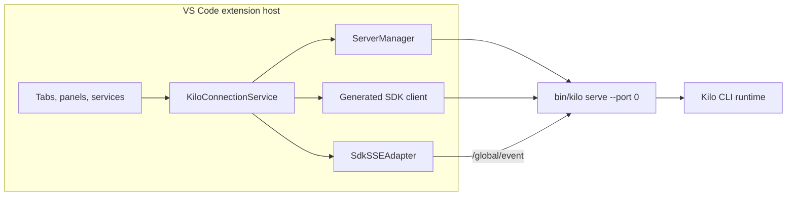
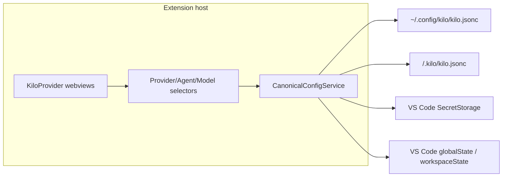

# VS Code Extension Architecture

The VS Code extension (`packages/kilo-vscode/`) is a client of [Kilo CLI runtime](/docs/contributing/architecture/cli-runtime). It bundles platform CLI binary, starts one shared editor-owned `kilo serve` server on demand, and drives that server through generated SDK HTTP calls plus global SSE.


This page covers extension-host ownership, webview routing, Agent Manager, local terminal paths, recovery, bundled resources, and build outputs. It is not full extension feature inventory.


## Shared server ownership

[CLI Runtime](/docs/contributing/architecture/cli-runtime) defines shared local-server authentication, directory routing, provider routing, persistence, and SSE contracts. This page starts at VS Code client boundary.

Activation creates one `KiloConnectionService`. It owns one `ServerManager`, one active SDK client, and one SSE adapter. `ServerManager` owns child process lifecycle. This editor-owned child is separate from detached local daemon managed by `kilo daemon`.



| Area | Behavior |
|---|---|
| Startup | Lazy on client demand; the speech-to-text capture prewarm is the only retention that can touch server-side capture during activation |
| Binary | Uses extension `bin/kilo`, or `bin/kilo.exe` on Windows |
| Port | Starts `kilo serve --port 0`; CLI server prefers `4096`, then asks OS for free port |
| Authentication | Generates random 32-byte hex password per spawn and passes it as `KILO_SERVER_PASSWORD`; username defaults to `kilo` |
| Reuse | Editor tabs, panels, Agent Manager, and host services share active server |
| Exit | `ServerManager` clears dead child; connection service clears SDK/SSE state and enters error state |
| Replacement | Later retry or connection attempt starts replacement server |
| Private fd carrier (B1) | `ServerManager` spawns with 5 stdio entries; `stdio[3]`/`stdio[4]` are exposed as `privateWriter`/`privateReader` with `pid`/`epoch` when the OS supports extra fds, otherwise fail-closed and SDK remains authoritative. `KiloConnectionService` owns `ServePrivatePeer` negotiation (`kilo-private/1` + `session/cancelQueued` capability) and clears it on exit/dispose/reset. Unavailable peer never interrupts SDK; G3 remains Active and no second listener is created. |
| Private fd carrier (B2) | Same 5-stdio carrier now negotiates `kilo-private/1` + `session/update` capability as well (`FD_CAPABILITIES = ["session/cancelQueued","session/update"]`). `ServePrivatePeer.validateSessionUpdateRequest` mirrors `SessionUpdateDispatch.validateRequest` (absolute directory, `SessionID`, `parentSessionId` must be `null`, title trim/200/control, strict fields, `opId` `sessionUpdate:<id>(:<token>)?` binding). `KiloProvider.buildSessionUpdateIdentity` creates one `token` (`crypto.randomUUID()`) shared by `opId` (`sessionUpdate:<id>:<token>`) and `idempotencyKey` (`sessionUpdate:<id>:<token>`). `handleRenameSession` SDK-first with `response.status` terminal gate (`400/404/409/500`) and 3 s private timeout (`ambiguous transportUnknown`), `compareUpdateParity` logs only (title/failure class vs `response.status`), never replaces SDK `Session.Info`. `fd-carrier.ts` `session/update` routes to `dispatchPrivate` replay-only (no `INSERT` when no record). G3 remains Active; Linux/Windows not overstated. |

## Private `session/cancelQueued` carrier (G3-B1) — parity-only, same AppLayer

B1 adds one bounded private path for `session/cancelQueued` over the existing `kilo serve` fd3/fd4 into the same `AppRuntime` dispatch. Generated SDK HTTP/SSE remains authoritative; the private path is terminal-replay parity observation only. No Unix socket, no second TCP listener, and no SDK regeneration.

| Aspect | Behavior |
|---|---|
| Spawn & streams | `ServerManager` uses `stdio: ["ignore","pipe","pipe","pipe","pipe"]` and captures `process.stdio[3]` as `privateWriter` and `stdio[4]` as `privateReader` alongside `pid`/`epoch`. `releasePrivateStreams` destroys both on exit/dispose with exact-PID semantics (decoy pid untouched). Port discovery still reads `stdout` for `kilo server listening on http://127.0.0.1:<port>`. |
| Availability | Extension side requires both fds and a successful `ServePrivatePeer.initialize(5000)` that validates `protocol.name==="kilo-private"`, `major===1`, and `capabilities` includes `session/cancelQueued` (array or object form; empty object is unavailable). Missing fds, missing `KILO_PARENT_PID`/`KILO_CLIENT`, timeout, EOF, protocol mismatch, or capability absence all mark unavailable fail-closed; `isPrivateAvailable()` requires `peer.getState()==="open"`. `kilo serve` side requires `KILO_PARENT_PID` or `KILO_CLIENT=vscode` **and** both `fstatSync(3)`/`fstatSync(4)` — otherwise no carrier is started and the server still serves HTTP. |
| Transport | JSON-RPC 2.0 length-framed (`private-worker/peer.ts` + `frame.ts`) over fd3/fd4. `ServePrivatePeer` wraps `JsonRpcPeer`, validates `v:1` envelope (`requestId`/`opId`/`idempotencyKey`/`op`/`context.directory`/`sessionId`/`payload.messageId`, `opId===cancelQueued:session:message`), and validates returned envelope (`v`, ids match, `status`, `accepted`, `outcome`, optional `revision`, `succeeded` vs `failed` vs `ambiguous` shape). Bad envelope is `failed internal`; transport-closed/epoch-drift/disposed is `ambiguous transportUnknown true`; epoch drift between call and return is also `ambiguous transportUnknown`. |
| Ownership | `ServerManager` owns the stream objects and `epoch`/`pid`; `KiloConnectionService` owns the `ServePrivatePeer` instance and its `privateAvailable`/`privateEpoch`/`privatePid`, clearing on `dispose`/`resetConnection`/`handleServerExit`. `kilo serve` owns the `fd-carrier.ts` `Peer` that delegates directly to `AppRuntime` `CancelQueuedDispatch` — no second `AppLayer`, no new authority. |
| Lifecycle | `KiloConnectionService.initPrivatePeer` is void-fired after SDK `connectedPromise`, epoch-coherent (stale epoch disposes), with 5 s timeout. `dispose()`/`resetConnection()`/`handleServerExit()` all call `disposePrivatePeer()` idempotently. Restart increments `ServerManager.epochCounter`, kills exact `pid`, verifies with `process.kill(pid,0)`, and re-negotiates a new peer. Null streams remain fail-closed while SDK HTTP still succeeds. |
| SDK-first parity | `KiloProvider.handleCancelQueued` is always SDK-first with `legacy:session:message` durable key and `cancelQueued:session:message` opId. `response.status` from the SDK tuple is authoritative for terminal detection (`400/404/409/500` terminal, others like `429` non-terminal); fallback to `error.status/statusCode/code/httpStatus`, message regex, or `_tag`. Only when terminal and `isPrivateAvailable()` does it call `privateCancelQueued` with fresh `requestId` and 3 s timeout (timeout → `ambiguous transportUnknown`). `compareParity` (`serve-private-peer.ts`) checks `transport-unknown` passthrough, `ambiguous`+`409` convergence, `cancelled` equality, and `failure` class mapping against `response.status` (`400`/`404`/`409`/`500`). Divergence is `console.warn`/`console.log` only; SDK boolean is the only user-visible outcome and no second queue transition is created. |
| Cross-platform residual | Darwin has real `ServerManager`→real `kilo serve`→fd3/fd4→same `AppLayer` production proof (rebuilt `bin/kilo` mtime/size, exact cleanup). Linux and Windows are not overstated as proven; both are fail-closed and SDK-authoritative. Windows Node parent→compiled Bun extra-fd is residual unless actual Windows evidence exists. |
| Non-goals | No `fork`/`update`/`command`/`prompt`/`provider`/`config`/private-query families, no retry scheduler, crash recovery, durable retry accounting, five-boundary convergence closure, observation worker replacement, Unix socket, second TCP listener, or G2 cleanup. `queued=true` production branch remains covered by B0 deterministic tests, not by B1 private production. G3 remains Active and Gates B/C/D/E/F do not close overall. |

## Private `session/update` carrier (G3-B2) — parity-only, same AppLayer

B2 adds a second bounded private path for `session/update` (title-only durable lane) over the same `kilo serve` fd3/fd4 into the same `AppRuntime` `SessionUpdateDispatch`. Generated SDK `PATCH /session/:sessionID` remains authoritative; the private path is terminal-replay parity observation only via `dispatchPrivate` (replay/read-only, never `INSERT` when no record, never fallback after `500`). No Unix socket, no second TCP listener, no SDK hand-edit.

| Aspect | Behavior |
|---|---|
| Spawn & streams | Reuses the same `ServerManager` 5-stdio carrier as B1 (`stdio[3]` private writer, `stdio[4]` private reader, `pid`/`epoch`). `FD_CAPABILITIES` now `["session/cancelQueued","session/update"]`; `buildInitializeResult` advertises both. Port discovery still via `stdout`. |
| Availability | Extension `ServePrivatePeer.initialize` validates `protocol.name==="kilo-private"`, `major===1` and `capabilities` must include `session/update` (array or object form; empty object is unavailable) in addition to B1's `session/cancelQueued` check; `hasCapability("session/update")` gates `privateSessionUpdate`. `kilo serve` `fd-carrier.ts` `validateProtocolVersion` and `canUseFdCarrier` same as B1 (both fds, `KILO_PARENT_PID` or `KILO_CLIENT`). `isPrivateAvailable()` still requires `peer.getState()==="open"` and `hasCapability`. |
| Transport | JSON-RPC 2.0 length-framed (`private-worker/peer.ts`+`frame.ts`) over fd3/fd4. `ServePrivatePeer.validateSessionUpdateRequest` mirrors `SessionUpdateDispatch.validateRequest`: `isAbsolute` directory, `SessionID` brand, `parentSessionId` must be `null`, `configVersion`/`sessionRevision` safe ints, `payload.title` via `validateTitleStrict` (trim/200/control), strict `unexpected field` at root/context/payload, `opId` via `parseSessionUpdateOpId` with `parts[0]===sessionId` binding (allows `sessionUpdate:<id>` or `sessionUpdate:<id>:<token>`, token non-empty no `:`). `validateSessionUpdateResult` enforces `v`/`requestId`/`opId`/`op`/`idempotencyKey` identity, `status`/`accepted`/`outcome` coherence, `succeeded` data has `title` or `session.title`. Bad envelope → `failed internal`; transport-closed/epoch-drift/disposed → `ambiguous transportUnknown true`. |
| Ownership | `ServerManager` owns streams + `epoch`/`pid`; `KiloConnectionService` owns `ServePrivatePeer` and `privateSessionUpdate` (epoch coherence, `transportUnknown` on drift) in addition to `privateCancelQueued`. `kilo serve` `fd-carrier.ts` `session/update` after `isInitialized()` routes to `AppRuntime SessionUpdateDispatch.dispatchPrivate` **only** (missing `dispatchPrivate` fails closed `MethodNotFound` without mutation, no fallback to `dispatch`) — no new authority, no `Promise` facade. |
| SDK-first parity | `KiloProvider.buildSessionUpdateIdentity` generates one `token` (`crypto.randomUUID()`) shared by `opId` (`sessionUpdate:<id>:<token>`) and `idempotencyKey` (`sessionUpdate:<id>:<token>`) + fresh `requestId`. `handleRenameSession` SDK-first: calls `renameSessionWithResult` (SDK `PATCH`), posts `sessionUpdated` on success, shows error on failure, then if `isPrivateAvailable()` and SDK result is terminal (`response.status` 100-599 integer `400/404/409/500` first, else `error.status/statusCode/code/httpStatus` + message regex + `_tag`) calls `privateSessionUpdate` with same tuple and 3 s timeout (timeout → `ambiguous transportUnknown`). `compareUpdateParity` (`serve-private-peer.ts`) checks `transport-unknown` passthrough, `ambiguous`+`409` convergence, `title` equality, and `failure` class mapping against `response.status` (`400`→`validation.failed/scope_mismatch`, `404`→`session.not_found`, `409`→`stale/conflict`, `500`→`internal`), logs `[Kilo PrivateParity] divergence/match` only; SDK `Session.Info` is sole authority and no second `title` transition is created. After SDK `500`, private still called but `dispatchPrivate` is read-only, so no second mutation. |
| Cross-platform residual | Same as B1: Darwin has unit/integration for fd3/fd4; Linux/Windows not overstated as proven, both fail-closed and SDK-authoritative. Windows extra-fd residual unless actual Windows evidence exists. |
| Non-goals | No `fork`/`command`/`prompt`/`provider`/`config`/private-query families, no retry scheduler, crash recovery, durable retry accounting, five-boundary convergence closure, observation worker replacement, Unix socket, second TCP listener, or G2 cleanup. G3 remains Active and Gates C/D/E/F/P4.4 do not close overall. Title-only lane; legacy `metadata`/`permission`/`archive` remain non-durable. |

## Chat surfaces (P3.1 sidebar removal)

The ordinary single-chat **Activity Bar sidebar** (`kilo-code.SidebarProvider` webview view under the `kilo-code-ActivityBar` views container) is **permanently removed**. It is not deferred, gated, or re-registered: no `viewsContainers`/`views` contribution, no `registerWebviewViewProvider`, no `kilo-code.new.sidebarVisible` context, and no `sidebarTitle.*` commands or view-title menus remain. The one-time deprecation step shipped as the P1/P2 migration surface plus the release note; there is no temporary feature flag and no retained old surface.

Chat now opens through the preserved editor surfaces:

| Surface | How it opens |
|---|---|
| Agent Manager | `Cmd/Ctrl+Shift+M` (`kilo-code.new.agentManagerOpen`) — multi-session orchestration panel |
| Open in Tab | `kilo-code.new.openInTab` / the editor-title "Open in Tab" button — a `kilo-code.new.TabPanel` webview with the shared chat UI |

Commands that previously fell back to the sidebar chat now resolve a chat target at runtime: the active editor-tab `KiloProvider` when one is focused, otherwise the Agent Manager panel (opened on demand). The decision rules live in the vscode-free `services/code-actions/chat-target.ts` helper. Delivery is readiness-gated: toolbar/code/terminal/review-comment posts wait for the chosen surface's webview to report ready and are skipped when it never does. Deep links for linked model selection (`/kilocode/model` and `/kilocode/switch`) open or reuse an editor tab. The auto-approve directory source and shared commands that target the focused session resolve from active tabs and the Agent Manager instead of a sidebar provider. No surrogate hidden sidebar provider or duplicate state owner is created.

**Rollback path.** This removal is a breaking product change, not a flag-gated migration. The only supported rollback is reverting the P3.1 removal commit(s) in git (the removed manifest contributions, `registerWebviewViewProvider`, `KiloProvider.viewType`/`resolveWebviewView`/`setSidebarVisible`, and the `sidebarTitle.*` wrapper commands are all preserved in git history); no runtime shim or compatibility surface is retained. After a revert, verify the `sidebar-removal` E2E scenario and the manifest-level absence contract (`tests/unit/sidebar-removal.test.ts`) fail, confirming the surface is actually restored.

## Product runtime absence (P3.3 removal)

Cloud sessions, KiloClaw, the local Console, and JetBrains no longer register or initialize in the extension. Each is structurally absent and has no active surface: no manifest contribution (view/container/command/keybinding/menu/setting), no runtime-registered command, no bundled product entry, and no startup registration. This is a permanent removal — not deferred, gated, or shimmed (LOCK-003/PERF-3). The shared editor-owned backend bridge is unchanged (LOCK-009): the retained Open-in-Tab and Agent Manager surfaces consume the same `KiloConnectionService`/`ServerManager`/SDK path.

| Product | Removed surface |
|---|---|
| Cloud sessions | Cloud session preview/import/fork handler, `CloudSessionList`, cloud deep link, and the cloud session message protocol |
| KiloClaw | `KiloClawProvider`, the `kiloclaw` webview tree/bundle, the `kilo-code.new.kiloClawOpen` command, and KiloClaw message types |
| Local Console | Console web app (`packages/kilo-console`) and its CLI `console` command — not an extension webview; the extension's `ConsoleProvider` contribution and open command are removed |
| JetBrains | JetBrains IDE plugin, a separate package (`packages/kilo-jetbrains`) — not an extension webview; the extension's JetBrains bridge contribution and open command are removed |

Retained boundaries that the removal preserves: the shared manifest contributions, the model selector and custom-provider flow, and the Agent Manager + Open-in-Tab editor surfaces (LOCK-008) — all remain ready, with no H-parity re-claim required. The removal never issues model requests or external calls.

**Runtime evidence.** The `cloud-claw-removal` E2E scenario (`bun run test:e2e:cloud-claw-removal`) runs in a real Extension Host and records `cloud-claw-removal-runtime-evidence`: it asserts identifier-based absence in the loaded manifest, the runtime command table, and the built `dist/` bundle list across all four categories (without false-positives on retained generic names such as the `jetbrainsMono` font option), and asserts the retained Open-in-Tab panel and Agent Manager both reach readiness. The static contract is `tests/unit/cloud-claw-removal.test.ts`.

**Rollback path.** This is a breaking product change with no flag or compatibility shim. The only supported rollback is reverting the P3.3 removal commit(s) in git (the removed handlers, providers, webview trees, message types, manifest contributions, and bundle entries are preserved in git history). After a revert, the `cloud-claw-removal` E2E scenario and `tests/unit/cloud-claw-removal.test.ts` fail, confirming the removed products are actually back.

## Product runtime absence (P3.4 removal)

Indexing and semantic search, project memory, user-visible context/compaction controls, autocomplete (FIM, next-edit, and chat), and commit-message generation no longer register or initialize in the extension or its webview. Each is structurally absent with no active, dormant, or configurable surface: no manifest contribution (command/keybinding/setting/dependency), no runtime-registered command or inline-completion provider, no server prewarm (the only retained activation prewarm is speech-to-text capture), no settings tab, no webview context or message-protocol path, and no build entry or i18n key. This is a permanent removal — not deferred, gated, or shimmed (LOCK-004); LOCK-014/015 leave no compatibility promise, import guide, or dormant removed-product instruction. The static absence contract is `tests/unit/p3-4-removal.test.ts`.

| Removed surface | Removal scope |
|---|---|
| Codebase indexing and semantic search | `packages/kilo-indexing/`, indexing settings/status/dialogs in extension and webview, `semantic_search` tool, `/indexing` API group, `indexing` config (retired with a warning) |
| Project memory | `packages/kilo-memory/`, memory status/prompt/recall-save surfaces, memory webview protocol, `kilo-code.new.showMemory`/`toggleMemory` commands |
| Manual/configurable compaction | `/compact`/`/summarize` slash commands, task-header/layout context controls, `ContextTab`/`ContextProgress`, manual `compact` webview message, SDK `session.compact` and `session.summarize` methods, `compaction` config block (retired; automatic overflow recovery is always on) |
| Autocomplete | FIM inline completion provider, next-edit, chat-textarea autocomplete, autocomplete status bar/settings/models, Gateway autocomplete/FIM/edit clients in `packages/kilo-gateway/` |
| Commit-message generation | SCM commit-message service, `CommitMessageTab`, `kilo-code.new.generateCommitMessage`, commit-message API handlers |

Retained boundaries are unaffected: invisible automatic internal context-overflow recovery remains and its `compaction` parts still render, with no manual or configurable control (LOCK-005); custom provider and model selector surfaces remain (LOCK-006); Agent Manager, Open-in-Tab, notebook context, checkpoints, and the generic chat/code-action/diff surfaces remain (LOCK-007/008). Server startup is lazy on client demand from the retained chat surfaces; the autocomplete prewarm path is gone.

**Runtime evidence.** The `p3-4-removal` E2E scenario (`bun run test:e2e:p3-4-removal`) runs in a real Extension Host and records `p3-4-removal-runtime-evidence`: it asserts identifier-based absence of removed-feature surfaces in the loaded manifest, the runtime command table, the built `dist/` bundle list, and run-owned workspace state, and asserts the retained surfaces (Agent Manager, Open-in-Tab, automatic compaction part rendering) still resolve. No model requests or external calls.

**Rollback path.** This is a breaking product change with no flag or compatibility shim. The only supported rollback is reverting the P3.4 removal commit(s) in git (the removed services, providers, webview trees, message types, manifest contributions, engine packages, and API groups are preserved in git history). After a revert, the `p3-4-removal` E2E scenario and `tests/unit/p3-4-removal.test.ts` fail, confirming the removed surfaces are actually back.

## Shared consumers

Shared service has more consumers than chat tabs:

| Family | Consumers |
|---|---|
| Chat | Editor-tab providers and the Agent Manager's embedded chat |
| Panels | Settings, profile and marketplace surfaces, sub-agent viewers, Agent Manager |
| Diffs | Inline permission diffs in chat, RevertBanner session revert, and local git-change summaries |

New mutable state must account for concurrent consumers and multiple directory contexts on one process.

## Webview bridge

Main chat webviews use host-mediated message bridge:

```text
webview vscode.postMessage()
  -> KiloProvider host handler
  -> generated SDK HTTP request
  -> CLI runtime
  -> /global/event SSE
  -> SdkSSEAdapter
  -> KiloConnectionService subscribers
  -> KiloProvider directory/session filtering and stream coalescing
  -> webview postMessage()
```

Global SSE carries wrapped events for multiple directories. Connection service broadcasts incoming payload plus directory to subscribers. Providers resolve session scope, maintain message-to-session lookup where events omit direct session ID, filter for relevant views, and coalesce high-frequency stream updates before posting UI messages.

## Agent Manager

Agent Manager is an extension feature, not a separate product. It opens as an editor tab and runs multiple independent AI sessions in parallel at the workspace root. With the P3.1 sidebar removal, Agent Manager is the primary chat entry point (alongside "Open in Tab" editor panels). There is no per-session worktree isolation, no setup/run scripts, and no branch/PR import; all sessions share the workspace directory.

| Aspect | Agent Manager |
|---|---|
| Primary use | Multi-session orchestration (single-chat surfaces live in editor tabs / the Agent Manager) |
| Working directory | Workspace root — all sessions share it, no isolation |
| Backend | Shared `kilo serve` process |
| Request routing | Workspace root passed as SDK `directory` |
| CLI instance key | Normalized workspace directory |

Agent Manager request path is:

```text
workspace root -> SDK directory -> CLI directory-routing middleware -> InstanceStore directory key
```

Agent Manager persists presentation state (open tabs, active tab, sidebar) through the VS Code webview state API, versioned in `webview-ui/agent-manager/local-ui-state.ts`. There is no `.kilo/agent-manager.json` state file and no `.kilo/worktrees/` directory; the removed worktree manager wrote both. Startup migration handles legacy webview state keys only.

### Durable session runtime timer

The right-bottom working indicator in Agent Manager shows a session's cumulative active-generation runtime. The extension host owns the timing state and the webview only renders extension snapshots.

| Aspect | Behavior |
|---|---|
| Owner | Extension host (`src/agent-manager/session-timing.ts`), a vscode-free module driven by `session.status` SSE events |
| Durable storage | VS Code `workspaceState` via the Host `Store` contract (`VscodeHost.workspaceStore`) — a versioned key |
| Counting | Only non-idle statuses count (busy, retry, offline). Idle settles the segment; duplicate events are idempotent |
| Persistence | Writes on status boundaries only, never per display tick |
| Shutdown | `AgentManagerProvider.disposeAsync()` settles active segments and awaits the durable write, so normal shutdown does not count later downtime |
| Pruning | Explicit forget in Agent Manager and backend `session.deleted` prune the session's timing entry; tab close is view lifecycle and retains it |
| Webview bridge | Snapshots ride `agentManager.state` pushes and land in the shared `SessionContext` (`timingFor`/`setTimingSnapshots`). The shared `WorkingIndicator` prefers a snapshot when present (cumulative + running segment) and falls back to the legacy `busySince` timestamp otherwise, keeping editor-tab behavior unchanged |

An abnormal crash can leave a stale active-segment marker persisted; the backend supplies no segment start timestamp, so the marker is preserved conservatively and the segment keeps counting until the next status event settles it.

### Durable open-tab persistence (workspace-owned) — Gate C

Agent Manager open local tabs, tab order, and last active session survive panel disposal and window reload via extension `workspaceState`. The backend session list remains authoritative for existence/titles/transcripts; persisted UI state only records IDs/order/active. Current commit retains `TabPanel`/`Open in Tab` per existing scope; no future removal is documented as done.

| Aspect | Behavior |
|---|---|
| Owner | Extension host `AgentManagerProvider` — durable owner of open local session IDs, `local` tab order, and last active `local` session across panel close/reopen |
| Durable storage | VS Code `workspaceState` via Host `Store` — versioned closed key `kilo.agentManager.persistence.v1` with shape `{v:1, sessions:string[], order:string[], active?:string}`, bounded counts/ID shapes (`MAX 100`, `ID_RE /^[a-zA-Z0-9._\-:]+$/`, `ID_MAX 128`), fail-closed on unknown key/duplicate/oversized/malformed |
| First hydration (authoritative) | `initializeState()` runs exactly once before the first `pushState()`/`requestState` response (flushing any pending dirty snapshot first, else `loadPersisted()`). `Store` is authoritative regardless of stale webview `vscode.getState()` cache — `vscode.getState/setState` remains an intra-webview optimization only. Missing/malformed/unknown-key/duplicate/oversized explicitly clears `managedSessions`/`tabOrder`/`activeSessionId` (no merge with retained memory). Explicit `sessions:[]`/`order:[]` is an explicit empty clear; missing/invalid `active` clears active only |
| Pending | Draft/pending IDs (e.g. `draftID` before `persistSession`) are never durable; ephemeral draft-active is tracked separately until `persistSession` registers the real session and `schedulePersist()` writes the durable snapshot |
| Persist | Coalesced microtask loop after product mutations that change tabs/order/active: add/open, close/archive/delete/forget, `agentManager.setTabOrder`, active selection/`loadMessages`, reconciliation pruning; no writes for panel visibility/observations |
| Reconciliation | On real `sessionsLoaded` catalog via `KiloProvider.onCatalog` hook (`{ids, append, hasMore}`), deterministically prunes missing/deleted/unavailable IDs from `managedSessions`/`tabOrder`/`activeSessionId` (effective catalog + `recentSessions` guard, `catalogTombstone` for deleted), then persists corrected state and pushes it; backend catalog is authoritative |
| Panel dispose | Clears ephemeral presence/streams/providers only; durable open-tab state remains for next attach. Fresh `agentManager.state` carries restored IDs/order/active before/alongside real `sessionsLoaded` so the fresh webview seeds `localSessionIDs`/`tabMgr` through product logic; `activeSessionId` intentionally not cleared |
| Webview | Fresh webview with empty `vscode.getState()` hydrates from durable `agentManager.state` exactly once, then intersects with `sessionsLoaded` catalog; same-webview `vscode.getState/setState` remains intra-webview optimization, hidden/non-disposed panels unchanged |

### Agent Manager targeted webview reload (AM-only, same-provider) — Gate C

Targeted reload is an Agent Manager-only operation, distinct from a real window/engine restart. It preserves the same outer `PanelContext`, inner `KiloProvider`, connection/streams, and listeners; only production HTML is reassigned and readiness awaits the next real `webviewReady`. No global `vscode reload`, no synthetic state injection, no panel/catalog/visibility replacement.

| Aspect | Behavior |
|---|---|
| Scope | Agent Manager webview only — `VscodeHost.reloadAgentManagerPanelForFixture()` → `KiloProvider.reloadWebviewForFixture(assign)` reassigns `panel.webview.html` via `assignAgentManagerHtml()` (production `buildWebviewHtml`, real CSP/port/script URIs) and awaits next `webviewReady`; `ServerManager` `pid`/`port`/`epoch` and `ServePrivatePeer` `pid`/`epoch`/`available`/`capabilities` remain unchanged |
| Real-restart contrast | A real restart kills the backend process, increments `epoch`, changes `pid`/`port`, and renegotiates the private peer (`kilo-private/1`). AM-only reload keeps all identities equal pre/post (`backend` + `private` `pid`/`epoch` unchanged, `state: "open"`, `capabilities: ["session/cancelQueued","session/update"]`, parity `null`) — verified in `lc-gc-proof.json` boundaries (`panelCloseReopen`, `webviewReload`, `tabCloseReopen`, `sessionSwitch`) |
| Lifecycle convergence | Panels, webview reload, editor tab close/reopen, and session switch each converge deterministically: durable state (`sessions`/`order`/`active`) intersected with the real `sessionsLoaded` catalog, titles/order re-validated, same-key replay (`opId`/`idempotencyKey`/`requestId` + `revision {session:32, config:0}`) remains `succeeded` with parity `null` |
| Inner tab targeting | Editor-tab targeting is an E2E identity/action constraint only — selecting the inner kilo-chat frame among the ordered webview frames to disambiguate Agent Manager vs inner-tab DOM actions in `lc-layout-timeline.json` (32 phases). It is not a product routing or architecture boundary |
| Evidence (Active) | Run-owned `real-lifecycle` handoff validated `true` — `lc-gc-proof.json` (`kilo-gc-lifecycle-proof/1`, `sha256 52babd…`), `lc-layout-timeline.json` (32 phases, `sha256 ec378a…`), `manifest.json` (`kilo-e2e-evidence/1`, `sha256 9946bd…` envelope). Per-run absolute paths/hashes are run-specific; cite the published evidence directory (handoff marker) rather than embedding a `/tmp/` path as normative. Gates C/D/P4.4 remain Active/preparation only |

## State boundaries

Directory-keyed CLI state is isolated by the workspace directory path. Process-owned state remains shared because all Agent Manager sessions use one CLI process and share the workspace directory. Snapshot implementation state is directory-keyed, but slow-snapshot prompt guard belongs to shared `Snapshot.Service` scope. Managed Agent Manager prompts pass `snapshotInitialization: "wait"` so slow baseline setup waits without interrupting concurrently started sessions.

## Shared model state (model.json)

Per-mode model selections and thinking-strength usage memory are shared between the CLI TUI and the VS Code extension through `~/.local/state/kilo/model.json` (the state directory reported by the CLI path endpoint). The extension is one writer among others (the CLI TUI writes the same file in-process); both run against the same state directory.

| Concern | Contract |
|---|---|
| Canonical ownership | `model.json` is the canonical shared boundary for per-mode model choices and for thinking-strength usage memory. VS Code `globalState` `variantSelections` entries are migration input or a synchronized compatibility cache only — never a higher-priority independent source. Ephemeral `session/` keys are local webview state: never canonical file entries and never rehydrated cache data |
| Migration | One-way, non-destructive: legacy cache entries fill only gaps in the canonical file; existing canonical entries always win; nothing is cleared from the cache by migration. Migration and cache sync run inside the extension's serialized model-state critical section and prune `session/` keys so they cannot accumulate in `globalState` |
| Serialization | All model.json read-modify-write operations in the extension process (`persistModelSelection`, `clearModelSelection`, `persistVariant`, `requestVariants`, `reset`) run as one module-level queued critical section, so in-process lost updates are impossible: concurrent messages cannot overwrite each other's keys from stale snapshots |
| Atomicity | Every file write is atomic (same-directory temp file + rename) so readers never observe partial JSON. Only ENOENT (missing file) means a fresh document; any other read error (EACCES/EMFILE/EISDIR...) or malformed/partial content is reported and never silently treated as an empty document that a read-modify-write would destructively replace. Non-ENOENT and malformed reads are logged visibly at the extension boundary |
| Reset | `reset` is self-contained and durable: when the canonical file reads successfully (a missing file is a fresh document) it clears the model/variant maps and the migration cache in one critical section; an unreadable or malformed canonical file is preserved untouched (the read is logged) while the live store and migration cache are still cleared. Its `variantsLoaded {}` post uses replace semantics in the webview so persistent memory is cleared from the live store without a reload (session-scoped picks stay) — a later `requestVariants` cannot resurrect reset values |
| Residual risk | Cross-process key-level last-writer-wins remains: the CLI TUI and the extension can edit the same keys concurrently and the last atomic rename wins for the whole document. This is a documented residual, not an in-process data loss |

The CLI-side reader (`KiloTask.savedModel` in `packages/opencode/src/kilocode/tool/task.ts`) resolves the delegated agent's final model first and then applies usage-memory variant for that exact agent+model (agent+model key, then model-only legacy key), so a legacy model-only variant still drives delegated thinking strength even when the agent has no saved model entry.

## Terminal surfaces

VS Code extension has two terminal paths:

| Surface | Owner | Use |
|---|---|---|
| VS Code integrated terminal | VS Code host | Generic shell terminals surfaced through the editor |
| CLI PTY WebSocket tab | Agent Manager and `kilo serve` server | Server-created PTY session streamed over loopback WebSocket |

Agent Manager PTY WebSocket URL uses `auth_token=<base64 kilo:password>` query mode because browser WebSocket API cannot attach Basic header. Webview CSP permits loopback HTTP and WebSocket origins for active server port. CLI also exposes scope-bound short-lived PTY ticket API as alternate browser WebSocket auth mode.

## Canonical config (P4.1)

The extension owns a **file-authoritative** GUI configuration layer (LOCK-010). User-authored effective configuration is authored and persisted through exactly two canonical JSONC files and six typed asset directories per scope — the UI is a bidirectional editor over these files, not a separate config store.

### Canonical authored scopes

| Scope | Config file | Asset directories |
|---|---|---|
| Global | `~/.config/kilo/kilo.jsonc` | `~/.config/kilo/{agent,command,skill,tool,plugin,rules}/` |
| Project | `<workspaceRoot>/.kilo/kilo.jsonc` | `<workspaceRoot>/.kilo/{agent,command,skill,tool,plugin,rules}/` |

The global root is resolved from the platform home directory via `packages/kilo-vscode/src/config/paths.ts` (`Roots` class); tests inject roots for isolation. Canonical project scope exists only when a first VS Code workspace folder is open. With no workspace, the service operates global-only: no project watchers start, and project-scope writes and asset operations are rejected.

### Closed field registry

An 11-field closed JSONC registry defines every configurable field class (`packages/kilo-vscode/src/config/registry.ts`). Unknown or deprecated fields are rejected. Each field carries a complete registry entry: owner, persistence, legal scope (global-only / project-only / both-with-typed-composition), composition operator, secret handling, snapshot inclusion, provenance, and removal disposition. Validation is enforced by the separate closed `fieldSchemas` mapping and contextual validators (`packages/kilo-vscode/src/config/validate.ts`), not as per-entry registry metadata.

| Field class | Composition | Scope |
|---|---|---|
| `model`, `model_variant`, `model_variant_overrides` | single / single / keyed | global + project |
| `subagent_model`, `subagent_variant`, `subagent_variant_overrides` | single / single / keyed | global + project |
| `default_agent` | single | global + project |
| `provider` | keyed | global + project |
| `mcp` | keyed | global + project |
| `permission` | restrictive | global + project |
| `instructions` | ordered | global + project |

Typed asset classes (agent, command, skill, tool, plugin, rules) exist as markdown files in their canonical directories — never as top-level JSONC records. The closed JSONC registry and the typed asset classes are separate canonical asset classes, not competing field definitions.

### Service and lifecycle

`CanonicalConfigService` (`packages/kilo-vscode/src/config/service.ts`) is a lifecycle-owned singleton created during extension activation. One instance owns file watchers, materialization state, content/version stamps, a `SecretStorage` adapter for opaque credential references, and derived selector indexes (provider, agent, model) persisted through VS Code state adapters.



| Aspect | Behavior |
|---|---|
| Initialization | Rehydrate persisted indexes → scan asset directories → materialize from disk → start file watchers |
| External edits | Watcher detects change → re-materialize → emit new snapshot |
| GUI writes | Atomic file edit with stale-detection → validate scoped candidate + cross-scope composition → commit → re-materialize |
| Invalid edits | Retain exact prior valid materialization; emit diagnostics; never silently fall back to legacy values |
| Own writes | Per-file timestamp coalescing — never suppress external edits |
| Readiness | `materializationReady` is true only after an error-free materialization; snapshot existence alone is not readiness |
| Secrets | Credentials stored as opaque `secret:kilo.credentials.<scope>.<kind>.<id>` refs in JSONC; plaintext never leaves the extension host |

### WYSIWYG and stale-draft handling

Every GUI write applies a partial set/unset patch to the current stamped document (not replacement). Both scoped candidates and cross-scope composition are validated before any byte is changed. Writes use temp-file + rename for atomicity. Final CAS (content-address stamp) checks immediately before rename detect concurrent external edits and return stale-write conflicts instead of silent overwrites.

### Retained transport bridge

The current `kilo serve` HTTP/SSE/SDK transport remains the active bridge (LOCK-009). The extension legacy-migration importer and Roo import wiring are removed: no legacy-data migration or Roo import path is retained, and no dual-read compatibility surface is retained. Generic current-settings import/export is separate and retained. Provider settings (`ProvidersTab`/`ProviderSelectDialog`/`provider-catalog`; `provider-visibility` module deleted and `provider-tab-helpers` guards reconstruction with dead Kilo `account` slot/profile navigation removed) render only provider records supplied by the existing provider state with no synthetic Kilo Gateway fallback — including suppression of `KILO_PROVIDER_ID` configured-row reconstruction from auth/config when backend omits it, while generic custom-provider reconstruction from auth/config remains — with gateway-tag, sign-in, recommended-tag, icon/note, login, and account/profile routing for Kilo removed and generic custom-provider sorting, icons, notes, and add/configure/auth/delete flows preserved (bounded settings-surface removal — not full preset catalog completion; T12 deletes dead synthetic factory `createKiloFallbackProvider` and its literals `Kilo Gateway`/`settings.providers.note.kilo`/`KILO_API_KEY`/`noteKey`/`icon`/`priority`/`custom` from `src/shared/provider-model.ts` and orphaned locale keys `settings.providers.tag.gateway`/`dialog.provider.tag.recommended` (20 webview locales) + `settings.providers.note.kilo` (20 kilo-i18n locales) — `KILO_PROVIDER_ID`/`KILO_AUTO`/`PROVIDER_PRIORITY`/`providerOrderIndex`/`CUSTOM_PROVIDER_PACKAGES`, session `KILO_AUTO` fallback, and speech-to-text Kilo guard remain). The CLI/backend transport remains separately scoped for later narrowing. VS Code settings (`kilo-code.new.*` extension UI, proxy, and integration settings) remain separate from the canonical config boundary.

## Bundled resources

| Resource | Behavior |
|---|---|
| CLI executable | Platform binary under extension `bin/`; Windows uses `kilo.exe` |
| CLI Tree-sitter WASM | Copied under `bin/tree-sitter`; backend spawn sets `KILO_TREE_SITTER_WASM_DIR` |
| FFmpeg helper | Bundled for supported targets for speech capture; capture code also checks system fallback paths |
| No-workspace behavior | With no VS Code workspace folder, the config service operates global-only; project watchers are not started and project-scope writes are rejected |

Speech-to-text captures audio locally, then sends completed recording through shared editor-owned `kilo serve` server to authenticated Kilo Gateway transcription path. It is batch transcription, not direct provider streaming.

## Recovery

| Failure signal | Response |
|---|---|
| Missing SSE events for 15 seconds | SSE adapter aborts attempt and reconnects |
| SSE reconnect | Starts at 250 ms delay and backs off to 5 seconds until stream opens |
| Server exit | Clears connection state, reports error, and lets later retry or connection attempt spawn replacement |
| Extension disposal | Stops periodic check-in, disposes SSE, and sends server process group termination with kill fallback |

## Builds

| Build | Source | Output |
|---|---|---|
| Extension host | `src/extension.ts` | `dist/extension.js` |
| Editor chat webview (Open in Tab) | `webview-ui/src/index.tsx` | `dist/webview.js` |
| Agent Manager webview | `webview-ui/agent-manager/index.tsx` | `dist/agent-manager.js` |
| Shared Shiki worker | synthetic worker entry | `dist/shiki-worker.js` |

Extension host bundle targets Node/CommonJS. Browser webviews and shared worker use esbuild browser bundles. Run `bun run typecheck`, `bun run lint`, and targeted unit tests from `packages/kilo-vscode/` after changing this area. `typecheck` and `lint` also cover the E2E sources without launching VS Code.

## Extension Host E2E testing

`packages/kilo-vscode/` owns a real Extension Host E2E harness (`bun run test:e2e`, entry `script/e2e-probe.ts`). It is explicit/manual only: no automatic trigger or package hook invokes it, and normal dev/build/run paths have zero effect from it. The sole automation is the manual-dispatch-only `vscode-e2e` workflow (below).

| Concern | Behavior |
|---|---|
| Real host | `@vscode/test-electron` spawns a real VS Code workbench loading the current workspace extension; the runner (`tests/e2e/runner.ts`) activates the extension and drives a deterministic offline scenario through production message shapes and the production `SessionInfo` type |
| CDP control | The harness connects Playwright to the workbench over a uniquely owned loopback CDP port (`--remote-debugging-port`) and asserts real webview DOM: tab order, then clicks the production sub-agent open button |
| Fixture bridge | `kilo-code.new.e2eFixture.*` commands are registered in `src/extension.ts` only when `KILO_E2E_FIXTURE === "1"` (exact, package-local `isE2EFixtureEnabled()` in `src/util/e2e-fixture.ts`; CLI has an equivalent predicate in `packages/opencode/src/kilocode/config/e2e-provider.ts` — behaviorally identical, not a cross-package import); they expose panel readiness, typed webview posting, deterministic session-list settlement, a read-only served-backend snapshot (`backendSnapshot`), MCP disconnect, transport/process probes over the single shared connection service (`sseReconnect`, `killServer`, `reconnectServer`, `privatePeerStatus`/`sessionUpdate`/`privateReplay` for Gate C), and a fail-closed generation-request collector (`llmRequests` / `llmRequestsReset`) that records every backend `service=llm` line through the ServerManager stderr relay into a run-owned append-only store validated by `isValidE2EScratch` before construction or reset (arbitrary markerless paths untouched, fail-closed). CLI `e2e-local/e2e-model` seam is exact-run bound via `scratch/e2e-marker.json` (`v:1` + `KILO_E2E_FIXTURE_ID`) validated by both `ServerManager` (`isValidE2EProviderEnv`) and `getE2EProviderFragment()` (absolute normalized `kilo-e2e-*` basename never `/tmp` alone, no `..` segments, `lstatSync` rejects symlinks, `realpath` relative check stays inside scratch, bounded read <2 KiB; residual TOCTOU documented). Gate C `rr-gc-proof.json` (`kilo-gc-proof/1`) is recursively whitelisted, redacted, and required for `real-restart` (exact top-level keys, fixed scope, 16-hex hashes, numeric PID/port/epoch/revision constraints, protocol/capability/equality facts, SDK/private statuses, parity null, replay/replayAfterRestart revision equality, killed identity equals pre-restart and post epoch greater, SSE identity unchanged; unknown/forbidden keys `title`/`payload`/`path`/`secret`/`password`/`apiKey`/raw IDs reject); transient `rr-*request` markers are excluded from durable manifest. Zero production effect when the env var is absent or not `"1"` — no commands registered and no webview code runs |
| Real scenarios | Four focused-only scenarios drive REAL backend sessions through the production webview path and assert served-backend truth through the snapshot bridge: `real-session` (create/prompt/reopen), `real-completed` (completed turns, MCP disconnect, H-12 rollback), `real-overflow` (H-13 internal context-overflow compaction), and `real-restart` (SSE reconnect, exact-owned worker restart, true window reload re-entry). Each seeds `small_model`/`subagent_model` to the run-owned provider and asserts at the request level that every generation (agent turns, titles, summaries, subagents) used `e2e-local/e2e-model` — any `kilo/kilo-auto/*` line fails the scenario |
| Gate C real-lifecycle (Active) | `real-lifecycle` focused-only proves workspace durable persistence, first authoritative hydration, AM-only same-provider targeted reload vs real restart, and UI-only lifecycle convergence with stable identity and same-key replay. AM-only reload preserves same outer `PanelContext`/inner `KiloProvider`/streams/listeners and `backend`/`private` `pid`/`port`/`epoch`/`capabilities` (production HTML reassignment + next real `webviewReady`, no global reload/synthetic). Panel close/reopen, webview reload, tab close/reopen, and session switch all converge from durable `kilo.agentManager.persistence.v1` intersected with real `sessionsLoaded` catalog; private `session/update` same-key replay stays `succeeded` with parity `null` and `revision {session:32, config:0}`. Inner-tab targeting is an E2E DOM frame-selection constraint only, not a product routing boundary. Evidence is the run-owned handoff (`lc-gc-proof.json` `kilo-gc-lifecycle-proof/1` `52babd…`, `lc-layout-timeline.json` 32 phases `ec378a…`, `manifest.json` `kilo-e2e-evidence/1` `9946bd…` envelope, `validated:true`); per-run absolute paths/hashes are run-specific — cite the published evidence dir, not a `/tmp/` path as normative. Gates C/D/P4.4 remain Active/preparation only |
| P3.1 removal | `sidebar-removal` (focused-only) runs assertions in the Extension Host runner: the loaded manifest contributes no Activity Bar sidebar surface under the forbidden ids/prefixes (`kilo-code-ActivityBar`, `kilo-code.SidebarProvider`, `sidebarTitle.*`) — identifier-based, so unrelated future views are not banned — and the production "Open in Tab" editor panel opens and reaches webview readiness through the env-gated `openInTabReady` fixture bridge, with the Agent Manager still ready afterwards. No CDP DOM driving |
| P3.3 removal | `cloud-claw-removal` (focused-only) runs assertions in the Extension Host runner: the loaded manifest, the runtime command table, and the built `dist/` bundle list expose no active cloud-session, KiloClaw, local Console, or JetBrains product contribution (identifier-based, so retained generic names like the `jetbrainsMono` font option are not banned), and the retained "Open in Tab" panel + Agent Manager still become ready. Records `cloud-claw-removal-runtime-evidence`; no synthetic fixtures, no CDP DOM driving, and no model requests or external calls |
| P3.4 removal | `p3-4-removal` (focused-only) runs assertions in the Extension Host runner: the loaded manifest, the runtime command table, the built `dist/` bundle list, and run-owned workspace state expose no active indexing, memory, compaction-control, autocomplete, or commit-message product contribution (identifier-based, so retained generic names are not banned); the retained "Open in Tab" panel, Agent Manager, and automatic `CompactionPart` rendering still resolve. Records `p3-4-removal-runtime-evidence`; no synthetic fixtures, no CDP DOM driving, and no model requests or external calls |
| Session-load serialization | `KiloProvider` serializes session-list loads (full refreshes, load-more, deferred flushes) so the bridge's awaited refresh is the last applied, making fixture survival deterministic without timers |
| Process lifecycle | All owned processes are terminated by exact PID matched to the unique user-data dir, the CDP port is verified released, then the scratch dir is deleted — on success and failure paths |
| Binary resolution | `VSCODE_TEST_EXECUTABLE` (must exist) → cached `.vscode-test/` → `@vscode/test-electron` auto-download into `.vscode-test/`; clean checkouts need no preinstalled binary |
| Platforms | macOS and Linux. Windows fails fast because exact-owned termination relies on `ps` PID+args inspection |

This harness spans a real Extension Host, Electron/CDP, and fixture lifecycle boundary and is owned by the extension package.

### Linux E2E workflow (manual dispatch only)

`vscode-e2e` (`.github/workflows/vscode-e2e.yml`) runs the same `bun run test:e2e` entrypoint on Linux under Xvfb, dispatched explicitly from the Actions UI. It is the only automation that invokes the harness, and it is never automatic.

| Guard | Behavior |
|---|---|
| Trigger | `workflow_dispatch` only — no `push`, `pull_request`, `schedule`, `workflow_call`, hook, or package-script aggregation |
| Immutable-ref checkout | The requested same-repository branch is validated before checkout and resolved with `git ls-remote` to one 40-hex commit SHA; `actions/checkout@v6` checks out exactly that SHA with `persist-credentials: false` and `fetch-depth: 1` |
| Permissions | Job scope is `contents: read` only; no repository secrets are used; nothing in the target branch can write, push, or act with credentials |
| Display | `xvfb-run -a bun run test:e2e` — the unmodified package entrypoint; no harness logic is duplicated in YAML |
| Xvfb | Verified or installed explicitly (`apt-get install -y xvfb`) before the run |
| Cache scope | Only `packages/kilo-vscode/.vscode-test` (the VS Code download) is cached, keyed Linux/x64 by the resolved target SHA and the extension package manifest; scratch, user-data, workspace, and profile are never cached, and an executable cache from a different target commit is never restored |
| Clean checkout | Each run starts from a fresh checkout of the immutable SHA, runs `bun install`, and builds the bundled CLI (`bun script/local-bin.ts`) with `KILO_SKIP_BUNDLED_BWRAP=1` scoped to that one step: the Linux runner installs no Zig, the E2E fixture coverage never invokes sandbox tooling, and production `ServerManager` tolerates a missing local bwrap, so the CLI runs without a bundled bwrap; release/package validation (`bun run package:vsix`) remains the separate path that stages bundled sandbox resources. The probe then builds the extension/webview bundles and auto-downloads VS Code — proving the harness works from scratch |
| Failure diagnostics | Complete E2E stdout/stderr is captured via `set -o pipefail` + `tee` into a runner-owned diagnostics directory and uploaded on failure or cancellation (`if: failure() |  | cancelled()`) with 7-day bounded retention; GitHub hard job cancellation can still prevent later steps. Harness scratch and exact-PID cleanup are untouched |
| Resource lifecycle | Workflow timeout is bounded above the harness watchdog (`KILO_E2E_TIMEOUT`); no broad process killing or global cleanup — the harness's exact-owned termination and CDP-port verification are the only process controls |

E2E remains never-automatic: the workflow is a read-only, explicit, manual act, and macOS runs stay local-only.

## Source map

Paths below are relative to [`Kilo-Org/kilocode`](https://github.com/Kilo-Org/kilocode).

| Concern | Source path |
|---|---|
| Activation | `packages/kilo-vscode/src/extension.ts` |
| Canonical config foundation | `packages/kilo-vscode/src/config/` (service, registry, types, paths, materialize, compose, validate, write, parse, selectors, snapshot, secret-adapter, state-adapter) |
| Editor-owned server child process | `packages/kilo-vscode/src/services/cli-backend/server-manager.ts` |
| Shared SDK and SSE ownership | `packages/kilo-vscode/src/services/cli-backend/connection-service.ts` |
| SSE reconnect adapter | `packages/kilo-vscode/src/services/cli-backend/sdk-sse-adapter.ts` |
| Private `session/cancelQueued` carrier (G3-B1) | `packages/kilo-vscode/src/services/cli-backend/serve-private-peer.ts``packages/kilo-vscode/src/services/cli-backend/server-manager.ts` (5-stdio + epoch) `packages/kilo-vscode/src/services/cli-backend/connection-service.ts` (peer lifecycle) `packages/kilo-vscode/src/KiloProvider.ts` (`handleCancelQueued` parity) |
| Private `session/update` carrier (G3-B2) | `packages/kilo-vscode/src/services/cli-backend/serve-private-peer.ts` (`validateSessionUpdateRequest/Result`, `canonicalSessionUpdateOpId` tokenized, `compareUpdateParity`, `privateSessionUpdate`) `packages/kilo-vscode/src/services/cli-backend/server-manager.ts` (5-stdio + epoch, `FD_CAPABILITIES`) `packages/kilo-vscode/src/services/cli-backend/connection-service.ts` (`privateSessionUpdate` epoch coherence) `packages/kilo-vscode/src/kilo-provider/rename-session.ts` (`buildSessionUpdateIdentity` shared token) `packages/kilo-vscode/src/KiloProvider.ts` (`handleRenameSession` SDK-first + `compareUpdateParity`) |
| Agent Manager | `packages/kilo-vscode/src/agent-manager/` |
| Env-gated E2E fixture bridge | `packages/kilo-vscode/src/extension.ts` (registration), `packages/kilo-vscode/src/agent-manager/AgentManagerProvider.ts` (settlement), `packages/kilo-vscode/src/agent-manager/fixture-backend.ts` (snapshot normalization), `packages/kilo-vscode/src/services/cli-backend/connection-service.ts` (transport/process probes), `packages/kilo-vscode/src/services/cli-backend/llm-request-collector.ts` (generation-request store) |
| E2E harness | `packages/kilo-vscode/script/e2e-probe.ts` (probe), `packages/kilo-vscode/script/e2e-probe-restart.ts` (restart phases), `packages/kilo-vscode/tests/e2e/runner.ts` (Extension Host runner) |
| Build entries | `packages/kilo-vscode/esbuild.js` |

## Related pages

- [Architecture Overview](/docs/contributing/architecture) - local and hosted execution map
- [CLI Runtime](/docs/contributing/architecture/cli-runtime) - shared local-server, routing, persistence, and SSE behavior
- [Development Patterns](/docs/contributing/architecture/development-patterns) - choose code-ownership seam and validation workflow before editing extension contracts
