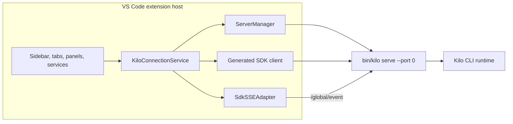

# VS Code Extension Architecture

The VS Code extension (`packages/kilo-vscode/`) is a client of [Kilo CLI runtime](/docs/contributing/architecture/cli-runtime). It bundles platform CLI binary, starts one shared editor-owned `kilo serve` server on demand, and drives that server through generated SDK HTTP calls plus global SSE.


This page covers extension-host ownership, webview routing, Agent Manager, local terminal paths, recovery, bundled resources, and build outputs. It is not full extension feature inventory.


## Shared server ownership

[CLI Runtime](/docs/contributing/architecture/cli-runtime) defines shared local-server authentication, directory routing, provider routing, persistence, and SSE contracts. This page starts at VS Code client boundary.

Activation creates one `KiloConnectionService`. It owns one `ServerManager`, one active SDK client, and one SSE adapter. `ServerManager` owns child process lifecycle. This editor-owned child is separate from detached local daemon managed by `kilo daemon`.



| Area | Behavior |
|---|---|
| Startup | Lazy on client demand; autocomplete prewarm can start server during activation |
| Binary | Uses extension `bin/kilo`, or `bin/kilo.exe` on Windows |
| Port | Starts `kilo serve --port 0`; CLI server prefers `4096`, then asks OS for free port |
| Authentication | Generates random 32-byte hex password per spawn and passes it as `KILO_SERVER_PASSWORD`; username defaults to `kilo` |
| Reuse | Sidebar, editor tabs, panels, Agent Manager, and host services share active server |
| Exit | `ServerManager` clears dead child; connection service clears SDK/SSE state and enters error state |
| Replacement | Later retry or connection attempt starts replacement server |

## Shared consumers

Shared service has more consumers than chat tabs:

| Family | Consumers |
|---|---|
| Chat | Sidebar provider and editor-tab providers |
| Panels | Settings, profile and marketplace surfaces, sub-agent viewers, Agent Manager, KiloClaw |
| Diff | Diff Viewer, Diff Virtual, and diff source catalog |
| Editor assistance | Autocomplete and commit-message generation |
| Integrations | Browser automation MCP registration and KiloClaw bootstrap |

New mutable state must account for concurrent consumers and multiple directory contexts on one process.

## Webview bridge

Main chat webviews use host-mediated message bridge:

```text
webview vscode.postMessage()
  -> KiloProvider host handler
  -> generated SDK HTTP request
  -> CLI runtime
  -> /global/event SSE
  -> SdkSSEAdapter
  -> KiloConnectionService subscribers
  -> KiloProvider directory/session filtering and stream coalescing
  -> webview postMessage()
```

Global SSE carries wrapped events for multiple directories. Connection service broadcasts incoming payload plus directory to subscribers. Providers resolve session scope, maintain message-to-session lookup where events omit direct session ID, filter for relevant views, and coalesce high-frequency stream updates before posting UI messages.

## Agent Manager

Agent Manager is extension feature, not separate product. It opens as editor tab and manages parallel sessions, optional worktrees, terminals, diffs, setup scripts, and extra editor windows.

| Aspect | Sidebar | Agent Manager |
|---|---|---|
| Primary use | One active chat view | Multi-session orchestration |
| Git isolation | Workspace root by default | Optional worktree per session |
| Backend | Shared `kilo serve` process | Same shared process |
| Request routing | Workspace directory | Session worktree path passed as SDK `directory` |
| CLI instance key | Normalized workspace root | Normalized worktree directory |

Agent Manager request path is:

```text
session worktree path -> SDK directory -> CLI directory-routing middleware -> InstanceStore directory key
```

Agent Manager persists state in `.kilo/agent-manager.json` and worktrees under `.kilo/worktrees/`. Startup migration moves Agent Manager-owned data from legacy `.kilocode/` paths when target items do not already exist and repairs git worktree refs.

### Durable session runtime timer

The right-bottom working indicator in Agent Manager shows a session's cumulative active-generation runtime. The extension host owns the timing state and the webview only renders extension snapshots.

| Aspect | Behavior |
|---|---|
| Owner | Extension host (`src/agent-manager/session-timing.ts`), a vscode-free module driven by `session.status` SSE events |
| Durable storage | VS Code `workspaceState` via the Host `Store` contract (`VscodeHost.workspaceStore`) — a versioned key, not `.kilo/agent-manager.json` |
| Counting | Only non-idle statuses count (busy, retry, offline). Idle settles the segment; duplicate events are idempotent |
| Persistence | Writes on status boundaries only, never per display tick |
| Shutdown | `AgentManagerProvider.disposeAsync()` settles active segments and awaits the durable write, so normal shutdown does not count later downtime |
| Pruning | Forget/close in Agent Manager and backend `session.deleted` prune the session's timing entry |
| Webview bridge | Snapshots ride `agentManager.state` pushes and land in the shared `SessionContext` (`timingFor`/`setTimingSnapshots`). The shared `WorkingIndicator` prefers a snapshot when present (cumulative + running segment) and falls back to the legacy `busySince` timestamp otherwise, keeping sidebar behavior unchanged |

An abnormal crash can leave a stale active-segment marker persisted; the backend supplies no segment start timestamp, so the marker is preserved conservatively and the segment keeps counting until the next status event settles it.

## State boundaries

Directory-keyed CLI state is isolated by worktree path. Process-owned state remains shared because all Agent Manager sessions use one CLI process. Snapshot implementation state is directory-keyed, but slow-snapshot prompt guard belongs to shared `Snapshot.Service` scope. Managed Agent Manager prompts pass `snapshotInitialization: "wait"` so slow baseline setup waits without interrupting concurrently started sessions.

## Terminal surfaces

VS Code extension has two terminal paths:

| Surface | Owner | Use |
|---|---|---|
| VS Code integrated terminal | VS Code host | Shell terminals and setup-script execution surfaced through editor |
| CLI PTY WebSocket tab | Agent Manager and `kilo serve` server | Server-created PTY session streamed over loopback WebSocket |

Agent Manager PTY WebSocket URL uses `auth_token=<base64 kilo:password>` query mode because browser WebSocket API cannot attach Basic header. Webview CSP permits loopback HTTP and WebSocket origins for active server port. CLI also exposes scope-bound short-lived PTY ticket API as alternate browser WebSocket auth mode.

## Config split

| Config owner | Examples |
|---|---|
| VS Code settings | `kilo-code.new.*` extension UI, proxy, autocomplete, and integration settings |
| CLI config | Global and project `kilo.jsonc`, `kilo.json`, compatible OpenCode files, provider auth, tools, permissions, modes |

Extension-specific behavior belongs in VS Code settings. Agent runtime behavior belongs in CLI config so TUI, Console, VS Code, and JetBrains can share it.

## Bundled resources

| Resource | Behavior |
|---|---|
| CLI executable | Platform binary under extension `bin/`; Windows uses `kilo.exe` |
| CLI Tree-sitter WASM | Copied under `bin/tree-sitter`; backend spawn sets `KILO_TREE_SITTER_WASM_DIR` |
| FFmpeg helper | Bundled for supported targets for speech capture; capture code also checks system fallback paths |
| Empty-window cwd | Uses extension global storage directory when no VS Code workspace folder exists |
| Empty-window indexing | Sets `KILO_DISABLE_CODEBASE_INDEXING=vscode-no-workspace` so CLI reports indexing disabled |

Speech-to-text captures audio locally, then sends completed recording through shared editor-owned `kilo serve` server to authenticated Kilo Gateway transcription path. It is batch transcription, not direct provider streaming.

## Recovery

| Failure signal | Response |
|---|---|
| Missing SSE events for 15 seconds | SSE adapter aborts attempt and reconnects |
| SSE reconnect | Starts at 250 ms delay and backs off to 5 seconds until stream opens |
| Health poll | Every 10 seconds, checks `/global/health` with 3 second timeout; failure forces SSE reconnect |
| Server exit | Clears connection state, reports error, and lets later retry or connection attempt spawn replacement |
| Extension disposal | Stops polls, disposes SSE, and sends server process group termination with kill fallback |

## Builds

| Build | Source | Output |
|---|---|---|
| Extension host | `src/extension.ts` | `dist/extension.js` |
| Sidebar and editor chat webview | `webview-ui/src/index.tsx` | `dist/webview.js` |
| Agent Manager webview | `webview-ui/agent-manager/index.tsx` | `dist/agent-manager.js` |
| KiloClaw webview | `webview-ui/kiloclaw/index.tsx` | `dist/kiloclaw.js` |
| Diff Viewer webview | `webview-ui/diff-viewer/index.tsx` | `dist/diff-viewer.js` |
| Diff Virtual webview | `webview-ui/diff-virtual/index.tsx` | `dist/diff-virtual.js` |
| Shared Shiki worker | synthetic worker entry | `dist/shiki-worker.js` |

Extension host bundle targets Node/CommonJS. Browser webviews and shared worker use esbuild browser bundles. Run `bun run typecheck`, `bun run lint`, and targeted unit tests from `packages/kilo-vscode/` after changing this area. `typecheck` and `lint` also cover the E2E sources without launching VS Code.

## Extension Host E2E testing

`packages/kilo-vscode/` owns a real Extension Host E2E harness (`bun run test:e2e`, entry `script/e2e-probe.ts`). It is explicit/manual only: no CI workflow or package hook invokes it, and normal dev/build/run paths have zero effect from it.

| Concern | Behavior |
|---|---|
| Real host | `@vscode/test-electron` spawns a real VS Code workbench loading the current workspace extension; the runner (`tests/e2e/runner.ts`) activates the extension and drives a deterministic offline scenario through production message shapes and the production `SessionInfo` type |
| CDP control | The harness connects Playwright to the workbench over a uniquely owned loopback CDP port (`--remote-debugging-port`) and asserts real webview DOM: tab order, then clicks the production sub-agent open button |
| Fixture bridge | `kilo-code.new.e2eFixture.*` commands are registered in `src/extension.ts` only when `KILO_E2E_FIXTURE` is set; they expose panel readiness, typed webview posting, and deterministic session-list settlement. Zero production effect when the env var is absent |
| Session-load serialization | `KiloProvider` serializes session-list loads (full refreshes, load-more, deferred flushes) so the bridge's awaited refresh is the last applied, making fixture survival deterministic without timers |
| Process lifecycle | All owned processes are terminated by exact PID matched to the unique user-data dir, the CDP port is verified released, then the scratch dir is deleted — on success and failure paths |
| Binary resolution | `VSCODE_TEST_EXECUTABLE` (must exist) → cached `.vscode-test/` → `@vscode/test-electron` auto-download into `.vscode-test/`; clean checkouts need no preinstalled binary |
| Platforms | macOS and Linux. Windows fails fast because exact-owned termination relies on `ps` PID+args inspection |

This harness spans a real Extension Host, Electron/CDP, and fixture lifecycle boundary and is owned by the extension package. Future Linux CI (Xvfb virtual display, cached `.vscode-test` download, clean-checkout proof, path-scoped trigger) is documented as a recommendation only — no workflow exists or is planned in this work.

## Source map

Paths below are relative to [`Kilo-Org/kilocode`](https://github.com/Kilo-Org/kilocode).

| Concern | Source path |
|---|---|
| Activation | `packages/kilo-vscode/src/extension.ts` |
| Editor-owned server child process | `packages/kilo-vscode/src/services/cli-backend/server-manager.ts` |
| Shared SDK and SSE ownership | `packages/kilo-vscode/src/services/cli-backend/connection-service.ts` |
| SSE reconnect adapter | `packages/kilo-vscode/src/services/cli-backend/sdk-sse-adapter.ts` |
| Agent Manager | `packages/kilo-vscode/src/agent-manager/` |
| Env-gated E2E fixture bridge | `packages/kilo-vscode/src/extension.ts` (registration), `packages/kilo-vscode/src/agent-manager/AgentManagerProvider.ts` (settlement) |
| E2E harness | `packages/kilo-vscode/script/e2e-probe.ts` (probe), `packages/kilo-vscode/tests/e2e/runner.ts` (Extension Host runner) |
| Build entries | `packages/kilo-vscode/esbuild.js` |

## Related pages

- [Architecture Overview](/docs/contributing/architecture) - local and hosted execution map
- [CLI Runtime](/docs/contributing/architecture/cli-runtime) - shared local-server, routing, persistence, and SSE behavior
- [JetBrains Plugin](/docs/contributing/architecture/jetbrains-plugin) - corresponding editor-client architecture for JetBrains
- [Development Patterns](/docs/contributing/architecture/development-patterns) - choose code-ownership seam and validation workflow before editing extension contracts
