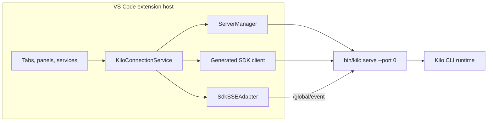
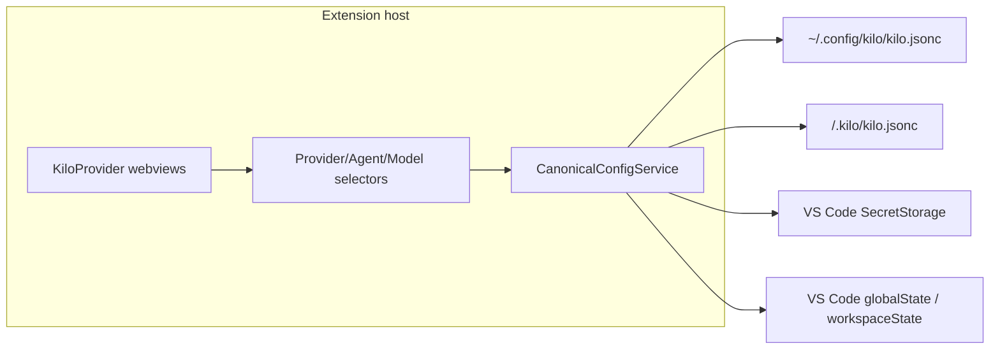

# VS Code Extension Architecture

The VS Code extension (`packages/kilo-vscode/`) is a client of [Kilo CLI runtime](/docs/contributing/architecture/cli-runtime). It bundles platform CLI binary, starts one shared editor-owned `kilo serve` server on demand, and drives that server through generated SDK HTTP calls plus global SSE.


This page covers extension-host ownership, webview routing, Agent Manager, local terminal paths, recovery, bundled resources, and build outputs. It is not full extension feature inventory.


## Shared server ownership

[CLI Runtime](/docs/contributing/architecture/cli-runtime) defines shared local-server authentication, directory routing, provider routing, persistence, and SSE contracts. This page starts at VS Code client boundary.

Activation creates one `KiloConnectionService`. It owns one `ServerManager`, one active SDK client, and one SSE adapter. `ServerManager` owns child process lifecycle. This editor-owned child is separate from detached local daemon managed by `kilo daemon`.



| Area | Behavior |
|---|---|
| Startup | Lazy on client demand; the speech-to-text capture prewarm is the only retention that can touch server-side capture during activation (historical baseline) |
| Binary | Uses extension `bin/kilo`, or `bin/kilo.exe` on Windows |
| Port | Starts `kilo serve --port 0`; CLI server prefers `4096`, then asks OS for free port |
| Authentication | Generates random 32-byte hex password per spawn and passes it as `KILO_SERVER_PASSWORD`; username defaults to `kilo` |
| Reuse | Editor tabs, panels, Agent Manager, and host services share active server |
| Exit | `ServerManager` clears dead child; connection service clears SDK/SSE state and enters error state |
| Replacement | Later retry or connection attempt starts replacement server |
| Private fd carrier (B1) | `ServerManager` spawns with 5 stdio entries; `stdio[3]`/`stdio[4]` are exposed as `privateWriter`/`privateReader` with `pid`/`epoch` when the OS supports extra fds, otherwise fail-closed with explicit failure and zero SDK mutation. `KiloConnectionService` owns `ServePrivatePeer` negotiation (`kilo-private/1` + `session/cancelQueued` capability) and clears it on exit/dispose/reset. Unavailable peer surfaces explicit failure with zero SDK and never runs a second heterogeneous cancel; |
| Private fd carrier (B2) | Same 5-stdio carrier now negotiates `kilo-private/1` + `session/update` capability as well (`FD_CAPABILITIES = ["session/cancelQueued","session/update"]`). `ServePrivatePeer.validateSessionUpdateRequest` mirrors `SessionUpdateDispatch.validateRequest` (absolute directory, `SessionID`, `parentSessionId` must be `null`, title trim/200/control, strict fields, `opId` `sessionUpdate:<id>(:<token>)?` binding). `KiloProvider.buildSessionUpdateIdentity` creates one `token` (`crypto.randomUUID()`) shared by `opId` (`sessionUpdate:<id>:<token>`) and `idempotencyKey` (`sessionUpdate:<id>:<token>`). `renameSessionPrivateFirst` attempts private `session/update` first with the same durable tuple (`opId`/`idempotencyKey` + `requestId` + `context`) and 3 s timeout/epoch cancellation; a valid private `succeeded` + `accepted` session/title returns with zero SDK mutation, otherwise exactly one SDK `session.update` with the identical tuple. `fd-carrier.ts` `session/update` routes to `dispatch` authoritatively. |

### Reverse capability offer — `provider/httpExecute` streaming

| Area | Behavior |
|---|---|
| Offer | `ServePrivatePeer` sends legacy `capabilities` unchanged plus additive optional `reverseCapabilities`; default without `CanonicalConfigService` is empty, with single-owner `CanonicalConfigService` and installed `canonical-http-executor` plus `RequestExecutor` deps it advertises only `provider/httpExecute` and fail-closes otherwise (unary `provider/execute` removed) |
| Validation | Same strict shape as CLI: bounded unique strings, reserved `initialize` and `$/` rejected; invalid offer fails `initialize` closed without resurrecting transport |
| Status | One reverse method is production on the host: streaming `provider/httpExecute` is strictly validated `{providerId, modelId, record, body, headers?}` with mandatory `record`+`body`, trusted CLI-supplied admission-pinned closed `record` (host does not reread disk, uses exact supplied `record`; trusted private carrier plus closed record plus owned credential ref plus fixed `POST` route constrain the boundary), single-owner `CanonicalConfigService` `resolveSecret` with owned `SecretStorage` injection, fixed `POST` route by protocol (`/chat/completions`/`/responses`/`/messages`), `redirect:manual` with no follow and no secret to redirect target, sensitive/forbidden `headers` rejected on CLI and filtered/redacted on host response, correlated `$/event` streaming `metadata {seq:0,status,headers}` then ordered base64 `{seq,bytes}` chunks `1..8192` (`64 KiB` chunk/`16 MiB` total) then terminal `{seq,chunks,bytes}` (`seq===chunks`, `bytes` sum) over exact `RequestContext {id, signal, emit}` with `$/cancelRequest` abort of `fetch` reader, bounded `Queue` back-pressure. A CLI-side typed streaming broker `ProviderHttpExecuteBroker` (`packages/opencode/src/kilocode/server/provider-http-execute-broker.ts` via `AppLayer` over same registry `requestWithEvents`, metadata-first `Scope`-bounded `Stream<Uint8Array>` with `Queue.bounded(32)`, terminal counts validated, fiber/`Scope` drop → `$/cancelRequest`, shared `ProviderHttpExecuteWire` at `@opencode-ai/core/kilocode/provider-http-execute`) calls the reverse peer; the shared streaming contract is consumed by both sides (full `CanonicalProviderPayload` AST stays host-side, body/tools/LLM parsing stays CLI-side so host is only secret-bearing HTTP executor). Canonical session generation runs over it via `CanonicalNative`/`CanonicalRequestExecutor`; the legacy unary broker `ProviderExecuteBroker` has been removed. `provider/httpExecute` (streaming) is the only reverse method; no `SessionProcessor`/private-runtime link beyond generation |

#### `provider/httpExecute` streaming — host HTTP execution over `provider/httpExecute`

| Aspect | Behavior |
|---|---|
| Snapshot semantics | Host uses the exact CLI-supplied pinned closed `record` and `body` (validated via shared `ProviderHttpExecuteWire`/`isPlainObject`/duplicate `model` check); it never rereads latest disk `kilo.jsonc`. The boundary is trusted private fd carrier plus closed `record` plus owned credential reference (`parseOwnedCredentialRef` must match `providerId`) plus fixed `POST` route by `protocol`. No plaintext secret leaves host; CLI never sees secret. |
| Security limits | CLI validates `providerId`/`modelId` non-empty, `record` closed, `body` non-empty `4 MiB` bounded valid JSON `model===modelId` with duplicate top-level `model` rejected (bounded `hasDuplicateTopLevelModelKey` scanner handling escapes/strings), and non-sensitive `headers` allowlist (lowercase `a-z0-9-`, `32`/`128`/`4096`/`8192` caps, forbidden exact/hop-by-hop/proxy/authorization-substring rejected). Host materializes closed record before secret fetch: `endpoint` no userinfo/query/hash, `http`/`https` only, `protocol` closed `openai/completions`/`openai/responses`/`anthropic/messages`, `models` contains `modelId`, credential ref parsed/owned; builds fixed URL by trimming trailing slashes and appending `PATH_BY_PROTOCOL`; `fetch` uses `redirect:manual` ( `300..399` fails `provider` without following or leaking secret, no second request to `Location`). Response `headers` filtered (forbidden dropped, size/crlf/nul checked, secret redacted `literal`+`percent-encoded` with stream-aware carry). Caller `headers` are exactly those validated non-sensitive set; host never accepts caller `authorization`/`x-api-key`/`cookie`. |
| Streaming sequence | One JSON-RPC `provider/httpExecute` call with correlated `$/event`s: `metadata` `seq 0` (`status` `100..599`, filtered `headers`) emitted first, then monotonically ordered `seq 1..` base64 `bytes` chunks (`HTTP_CHUNK_MAX_BYTES` `64 KiB` decoded), bounded `8192` chunks/`16 MiB` total, then terminal `{seq,chunks,bytes}` where `seq===chunks` and `bytes` equals sum of decoded redacted bytes. CLI validates `metadata` `seq===0`/`status`/`headers`, each `chunk` `seq===expected` and `bytes` valid base64 decode `<=64 KiB`, terminal counts against observed; host uses `Response.body.getReader()` with `TextDecoder` stream-aware redaction (longest-prefix carry for `secret`/`encodeURIComponent(secret)` split across chunks). |
| Cancellation/resource ownership | CLI `ProviderHttpExecuteBroker.stream` is `Effect< HttpStream, BrokerError, Scope>` where `Stream`/`Scope` owns the exact `PrivatePeer.Call`: `onEvent` registered atomically before `requestWithEvents` write, `Queue.bounded(32)` buffers chunks, `Scope`/fiber interruption/protocol error/terminal mismatch/peer close drops the `Call` once via `call.drop()` so `$/cancelRequest {id}` reaches host. Host `handleProviderHttpExecute`/`executeHttp` receives exact `{id, signal, emit}` (`RequestContext`), tracks duplicate active `id` fail-closed, aborts `AbortSignal` on `$/cancelRequest`/peer-close/dispose/writer failure, cancels `fetch` reader and `emit` ownership; `emit` scoped to `state==="open"` and exact `AbortController` still owned, returns `false` after handler completion/close. No detached fibers, no second peer owner, no Promise facade. |
| CLI ownership | CLI owns prompt/body construction, `modelId` binding, and future tool/LLM parsing; host owns only secret resolution (`CanonicalConfigService` single-owner `resolveSecret`) plus endpoint/protocol validation and the HTTP `POST` itself. No `RequestExecutor`/`LLM`/`SessionProcessor` wiring in this unit. |

## Private `session/cancelQueued` carrier — private-first, same AppLayer

B1 adds one bounded private path for `session/cancelQueued` over the existing `kilo serve` fd3/fd4 into the same `AppRuntime` dispatch. The private path uses its own operation identity/protocol and commits via `dispatch` authoritatively; the generated SDK HTTP remains only as the single SDK fallback with SDK native identity (`sessionID`/`messageID` + `directory`), at most once, for validated retryable failure. No Unix socket, no second TCP listener, and no SDK regeneration.

| Aspect | Behavior |
|---|---|
| Spawn & streams | `ServerManager` uses `stdio: ["ignore","pipe","pipe","pipe","pipe"]` and captures `process.stdio[3]` as `privateWriter` and `stdio[4]` as `privateReader` alongside `pid`/`epoch`. `releasePrivateStreams` destroys both on exit/dispose with exact-PID semantics (decoy pid untouched). Port discovery still reads `stdout` for `kilo server listening on http://127.0.0.1:<port>`. |
| Availability | Extension side requires both fds and a successful `ServePrivatePeer.initialize(5000)` that validates `protocol.name==="kilo-private"`, `major===1`, and `capabilities` includes `session/cancelQueued` (array or object form; empty object is unavailable). Missing fds, missing `KILO_PARENT_PID`/`KILO_CLIENT`, timeout, EOF, protocol mismatch, or capability absence all mark unavailable fail-closed; `isPrivateAvailable()` requires `peer.getState()==="open"`. `kilo serve` side requires `KILO_PARENT_PID` or `KILO_CLIENT=vscode` **and** both `fstatSync(3)`/`fstatSync(4)` — otherwise no carrier is started and the server still serves HTTP. |
| Transport | JSON-RPC 2.0 length-framed (`private-worker/peer.ts` + `frame.ts`) over fd3/fd4. `ServePrivatePeer` wraps `JsonRpcPeer`, validates `v:1` envelope (`requestId`/`opId`/`idempotencyKey`/`op`/`context.directory`/`sessionId`/`payload.messageId`, `opId===cancelQueued:session:message`), and validates returned envelope (`v`, ids match, `status`, `accepted`, `outcome`, optional `revision`, `succeeded` vs `failed` vs `ambiguous` shape). Bad envelope is `failed internal`; transport-closed/epoch-drift/disposed is `ambiguous transportUnknown true`; epoch drift between call and return is also `ambiguous transportUnknown`. |
| Ownership | `ServerManager` owns the stream objects and `epoch`/`pid`; `KiloConnectionService` owns the `ServePrivatePeer` instance and its `privateAvailable`/`privateEpoch`/`privatePid`, clearing on `dispose`/`resetConnection`/`handleServerExit`. `kilo serve` owns the `fd-carrier.ts` `Peer` that delegates directly to `AppRuntimeCancelQueuedDispatch` — no second `AppLayer`, no new authority. |
| Lifecycle | `KiloConnectionService.initPrivatePeer` is void-fired after SDK `connectedPromise`, epoch-coherent (stale epoch disposes), with 5 s timeout. `dispose()`/`resetConnection()`/`handleServerExit()` all call `disposePrivatePeer()` idempotently. Restart increments `ServerManager.epochCounter`, kills exact `pid`, verifies with `process.kill(pid,0)`, and re-negotiates a new peer. Null streams remain fail-closed while SDK HTTP still succeeds. |
| Private-first authoritative | `KiloProvider.handleCancelQueued` calls `privateCancelQueued` first with `legacy:session:message` durable key and `cancelQueued:session:message` opId, a fresh `requestId`, and 3 s timeout with exact cancellation/cleanup. A valid `succeeded`+`accepted` result and a validated terminal `failed` (`failure.retryable === false`) both close with zero SDK mutation; only a validated `failed` with `retryable === true` (`InstanceUnavailableDuringConfigRebuild`) takes exactly one SDK `client.session.cancelQueued` fallback with SDK native identity (`sessionID`/`messageID` + `directory`), at most once, with no private `opId`/`idempotencyKey` carried on the SDK call. Unavailable/invalid/ambiguous/transport/timeout/closed outcomes surface an explicit native notification and never run a second heterogeneous cancel. |
| Cross-platform residual | Darwin has real `ServerManager`→real `kilo serve`→fd3/fd4→same `AppLayer` production proof (rebuilt `bin/kilo` mtime/size, exact cleanup). Linux and Windows are not overstated as proven; both are fail-closed with explicit failure and no SDK fallback. Windows Node parent→compiled Bun extra-fd is residual unless actual Windows evidence exists. |
| Non-goals | No `fork`/`update`/`command`/`provider`/`config`/private-query families, no retry scheduler, crash recovery, durable retry accounting, five-boundary convergence closure, observation worker replacement, Unix socket, second TCP listener, or catalog-loader cleanup. `queued=true` production runs via the private-first path and remains covered by B0 deterministic tests. |

## Private `session/update` carrier — private-first, same AppLayer

B2 adds a second bounded private path for `session/update` (title-only durable lane) over the same `kilo serve` fd3/fd4 into the same `AppRuntime` `SessionUpdateDispatch`. Title-only rename is private-first: the private path commits via `dispatch` authoritatively, and a valid private `succeeded` + `accepted` session/title returns with zero SDK mutation; otherwise exactly one SDK `PATCH /session/:sessionID` runs with the identical durable tuple. No Unix socket, no second TCP listener, no SDK hand-edit.

| Aspect | Behavior |
|---|---|
| Spawn & streams | Reuses the same `ServerManager` 5-stdio carrier as B1 (`stdio[3]` private writer, `stdio[4]` private reader, `pid`/`epoch`). `FD_CAPABILITIES` now `["session/cancelQueued","session/update"]`; `buildInitializeResult` advertises both. Port discovery still via `stdout`. |
| Availability | Extension `ServePrivatePeer.initialize` validates `protocol.name==="kilo-private"`, `major===1` and `capabilities` must include `session/update` (array or object form; empty object is unavailable) in addition to B1's `session/cancelQueued` check; `hasCapability("session/update")` gates `privateSessionUpdate`. `kilo serve` `fd-carrier.ts` `validateProtocolVersion` and `canUseFdCarrier` same as B1 (both fds, `KILO_PARENT_PID` or `KILO_CLIENT`). `isPrivateAvailable()` still requires `peer.getState()==="open"` and `hasCapability`. |
| Transport | JSON-RPC 2.0 length-framed (`private-worker/peer.ts`+`frame.ts`) over fd3/fd4. `ServePrivatePeer.validateSessionUpdateRequest` mirrors `SessionUpdateDispatch.validateRequest`: `isAbsolute` directory, `SessionID` brand, `parentSessionId` must be `null`, `configVersion`/`sessionRevision` safe ints, `payload.title` via `validateTitleStrict` (trim/200/control), strict `unexpected field` at root/context/payload, `opId` via `parseSessionUpdateOpId` with `parts[0]===sessionId` binding (allows `sessionUpdate:<id>` or `sessionUpdate:<id>:<token>`, token non-empty no `:`). `validateSessionUpdateResult` enforces `v`/`requestId`/`opId`/`op`/`idempotencyKey` identity, `status`/`accepted`/`outcome` coherence, `succeeded` data has `title` or `session.title`. Bad envelope → `failed internal`; transport-closed/epoch-drift/disposed → `ambiguous transportUnknown true`. |
| Ownership | `ServerManager` owns streams + `epoch`/`pid`; `KiloConnectionService` owns `ServePrivatePeer` and `privateSessionUpdate` (epoch coherence, `transportUnknown` on drift) in addition to `privateCancelQueued`. `kilo serve` `fd-carrier.ts` `session/update` after `isInitialized()` routes to `AppRuntime SessionUpdateDispatch.dispatch` **authoritatively** (missing `dispatch` fails closed `MethodNotFound` without mutation, no fallback to `dispatchPrivate`) — same store/AppRuntime/service/lifecycle owner as `PATCH /session/:sessionID`, no `Promise` facade. |
| Private-first with single SDK fallback | `renameSessionPrivateFirst` generates one `token` (`crypto.randomUUID()`) shared by `opId` (`sessionUpdate:<id>:<token>`) and `idempotencyKey` (`sessionUpdate:<id>:<token>`) + fresh `requestId` + `context {directory, sessionId, parentSessionId:null}`; attempts `privateSessionUpdateWithHandle` with 3 s bounded timeout/epoch cancellation and `validateSessionUpdateResult` revalidation; valid `succeeded` + `accepted` session/title is authoritative without SDK, timeout/invalid/transport/unknown falls back to exactly one `client.session.update` with the identical tuple (never retry either path). Title validation stays first; private fallback is logged redacted (`opId` + reason class, never raw titles). |
| Cross-platform residual | Same as B1: Darwin has unit/integration for fd3/fd4; Linux/Windows not overstated as proven, both fail-closed with exactly-one SDK fallback. Windows extra-fd residual unless actual Windows evidence exists. |
| Non-goals | No `fork`/`command`/`provider`/`config`/private-query families, no retry scheduler, crash recovery, durable retry accounting, five-boundary convergence closure, observation worker replacement, Unix socket, second TCP listener, or catalog-loader cleanup. 4 do not close overall. Title-only lane; legacy `metadata`/`permission`/`archive` remain non-durable. |

## Private `session/create` carrier — private-first with single SDK fallback, same AppLayer

B4 adds a third bounded private path for `session/create` (durable lane) over the same `kilo serve` fd3/fd4 into the same `AppRuntime` `SessionCreateDispatch`. Agent Manager local creates are private-first; the private path commits `SessionTable`/`session_operation`/`changefeed`/`Event` atomically via `dispatch`, idempotent replay returns same session without duplicate; SDK is exactly one fallback with same durable tuple. No Unix socket, no second TCP listener, no SDK hand-edit.

| Aspect | Behavior |
|---|---|
| Spawn & streams | Reuses the same `ServerManager` 5-stdio carrier as B1-B3 (`stdio[3]` private writer, `stdio[4]` private reader, `pid`/`epoch`). `FD_CAPABILITIES` now `["session/cancelQueued","session/update","session/fork","session/create"]`; `buildInitializeResult` advertises four. Port discovery still via `stdout`. |
| Availability | Extension `ServePrivatePeer.initialize` validates `protocol.name==="kilo-private"`, `major===1` and `capabilities` must include `session/create` (array or object form; empty object is unavailable) in addition to B1-B3 checks; `hasCapability("session/create")` gates `privateCreate`. `kilo serve` `fd-carrier.ts` `validateProtocolVersion` and `canUseFdCarrier` same as B1-B3 (both fds, `KILO_PARENT_PID` or `KILO_CLIENT`). `isPrivateAvailable()` still requires `peer.getState()==="open"` and `hasCapability`. |
| Transport | JSON-RPC 2.0 length-framed (`private-worker/peer.ts`+`frame.ts`) over fd3/fd4. `ServePrivatePeer.validateCreateRequest` mirrors `SessionCreateDispatch.validateRequest`: `isAbsolute` directory, `parentSessionId` must be `null`, `configVersion` safe-int, `title` trim/200/control, strict `unexpected field` at root/context/payload, `opId` via `SessionOperation.parseOpId` `create` single segment, `sandboxInheritanceToken` explicit reject. `validateCreateResult` enforces `v`/`requestId`/`opId`/`op`/`idempotencyKey` identity, `status`/`accepted`/`outcome` coherence, `succeeded` data has `session`. Bad envelope → `failed internal`; transport-closed/epoch-drift/disposed → `ambiguous transportUnknown true`. |
| Ownership | `ServerManager` owns streams + `epoch`/`pid`; `KiloConnectionService` owns `ServePrivatePeer` and `privateCreate`/`privateCreateWithHandle` (epoch coherence, `transportUnknown` on drift) in addition to previous `privateCancelQueued`/`privateSessionUpdate`/`privateFork`. `kilo serve` `fd-carrier.ts` `session/create` after `isInitialized()` routes to `AppRuntime SessionCreateDispatch.dispatch` **authoritatively** (missing `dispatch` fails closed `MethodNotFound` without fallback to `dispatchPrivate`) — same store/AppRuntime/service/lifecycle owner/request validation/capability as `POST /session`, no new worker/store/owner/protocol method. |
| Private-first with single SDK fallback | Agent Manager local `createSessionPrivateFirst` generates one durable tuple `create:<token>` for `opId`/`idempotencyKey` + `requestId` + `context {directory, parentSessionId:null}`; attempts `privateCreateWithHandle` with 3 s bounded timeout/epoch semantics; valid `succeeded` is authoritative without SDK; failed/ambiguous/timeout/capability absence/closed/epoch drift/invalid result/throw all fallback to exactly one `client.session.create` with same tuple (never retry either path). `sandboxInheritanceToken` bypasses private with exactly one SDK `create` preserving sandbox behavior (durable fields only if compatible). Post-create behavior preserves `addSession`, `push`, `sessionAdded`, `registerSession`, optional `promptAsync`. Effective route/body directory binding verified — `directory` must match canonical route directory or `400 scope_mismatch` with zero insert. `sandboxInheritanceToken` is explicitly rejected `400` both dispatch+HTTP for durable path. |
| Cross-platform residual | Same as B1-B3: Darwin has `ServerManager`→`kilo serve`→fd3/fd4 unit/integration for `session/create`; Linux/Windows not overstated as proven, both fail-closed and authoritative via private where available. Windows extra-fd residual unless actual Windows evidence exists. |
| Non-goals | No `command`/`provider`/`config`/private-query families, no retry scheduler, crash recovery, durable retry accounting, five-boundary convergence closure, observation worker replacement, Unix socket, second TCP listener, or catalog-loader cleanup. Create lane private-first (plus title-only `session/update` + `session/fork` + `session/delete` private-first); remaining SDK-owned lifecycle is `abort`/`share`/`archive` with no transport removal. |

## Private `session/delete` carrier — private-first with single SDK fallback, same AppLayer

B5 adds a fourth bounded private path for `session/delete` (durable lane) over the same `kilo serve` fd3/fd4 into the same `AppRuntime` `SessionDeleteDispatch`. Agent Manager deletes are private-first; the private path deletes the full family atomically via `dispatch` with a `succeeded` tombstone, idempotent replay returns `succeeded` without duplicate; SDK is exactly one durable `DELETE` fallback for known-safe cases with the same tuple, unknown outcomes reconcile once then close terminally without destructive fallback. No Unix socket, no second TCP listener, no SDK hand-edit.

| Aspect | Behavior |
|---|---|
| Spawn & streams | Reuses the same `ServerManager` 5-stdio carrier as B1-B4 (`stdio[3]` private writer, `stdio[4]` private reader, `pid`/`epoch`). `FD_CAPABILITIES` now `["session/cancelQueued","session/update","session/fork","session/create","session/delete"]`; `buildInitializeResult` advertises five. Port discovery still via `stdout`. |
| Availability | Extension `ServePrivatePeer.initialize` validates `protocol.name==="kilo-private"`, `major===1` and `capabilities` must include `session/delete` (array or object form; empty object is unavailable) in addition to B1-B4 checks; `hasCapability("session/delete")` gates `privateDelete`/`privateDeleteWithHandle`. `kilo serve` `fd-carrier.ts` `validateProtocolVersion` and `canUseFdCarrier` same as B1-B4 (both fds, `KILO_PARENT_PID` or `KILO_CLIENT`). `isPrivateAvailable()` still requires `peer.getState()==="open"` and `hasCapability`. |
| Transport | JSON-RPC 2.0 length-framed (`private-worker/peer.ts`+`frame.ts`) over fd3/fd4. `ServePrivatePeer.validateDeleteRequest` mirrors `SessionDeleteDispatch.validateRequest`: `isAbsolute` directory, `SessionID` via `ses` prefix, `parentSessionId` must be present and `null`, `configVersion`/`sessionRevision` safe integers `>=0`, empty `payload`, strict `unexpected field` at root/context/payload, `opId` via `parseDeleteOpIdForSession` with `parts[0]===sessionId` binding (`delete:<sessionId>:<token>` token non-empty no `:`) and `idempotencyKey===opId`. `validateDeleteResult` enforces `v`/`requestId`/`opId`/`op`/`idempotencyKey` identity, `status`/`accepted`/`outcome` coherence, `succeeded` data is empty object with no `failure`/`transportUnknown`, `failed` requires `accepted:false` and has `failure.code/message/retryable` mirrored in `outcome.failure` (malformed `failed` with `accepted:true` or incoherent envelope is invalid and normalizes to `ambiguous`/`unknown` without destructive fallback), `ambiguous` has `accepted:false`. Invalid envelope → `ambiguous transportUnknown true` (failed envelope incoherence no longer normalizes to `failed internal`); transport-closed/epoch-drift/disposed → `ambiguous transportUnknown true`. |
| Ownership | `ServerManager` owns streams + `epoch`/`pid`; `KiloConnectionService` owns `ServePrivatePeer` and `privateDelete`/`privateDeleteWithHandle` (epoch coherence, `transportUnknown` on drift) in addition to previous `privateCancelQueued`/`privateSessionUpdate`/`privateFork`/`privateCreate`. `kilo serve` `fd-carrier.ts` `session/delete` after `isInitialized()` routes to `AppRuntime SessionDeleteDispatch.dispatch` **authoritatively** (missing `dispatch` fails closed `MethodNotFound` without mutation, no fallback to `dispatchPrivate`) — same store/AppRuntime/service/lifecycle owner/drain lane/request validation/capability as durable `DELETE /session/:sessionID`, no new worker/store/owner/protocol method. `dispatchPrivate` stays diagnostic-only replay lookup. |
| Private-first with single SDK fallback | `deleteSessionPrivateFirst` (`kilo-provider/session-delete.ts`) builds one durable tuple `delete:<sessionId>:<token>` for `opId`/`idempotencyKey` + `requestId` + `context {directory, sessionId, parentSessionId:null}`; attempts `privateDeleteWithHandle` with 3 s bounded timeout/epoch semantics via `withTimeout` + `tryCancelPending` exact `id` or epoch invalidation; valid `succeeded`+`accepted` is authoritative with zero SDK mutation; validated terminal `failed` with `accepted:false` and `retryable === false` closes terminally with zero SDK; known-safe `unavailable` or validated `failed` with `accepted:false` and `retryable === true` falls back to exactly one durable `DELETE /session/:sessionID` with the identical tuple (same `directory`/`opId`/`idempotencyKey`/`requestId`/`context`) via `durableRawDelete` (prefers `fetch DELETE` with `Authorization` + JSON body when `getServerConfig` available, else generated SDK `client.session.delete` with `body_directory`/`query_directory` compat) and only when the decoded/`data` result is exactly boolean `true` (empty, `false`, malformed, or other 2xx bodies are treated as failure without local prune); never retries either path. Legacy bodyless `DELETE` (empty body) remains compatible with no tombstone; durable tombstone/commit invariant applies only to requests carrying the durable body/private-first path. |
| Unknown reconcile and no destructive fallback | First private `unknown` (timeout, `transportUnknown`, `ambiguous`, `Peer closed`/`disposed`, `-32603`, validation mismatch, or failed without `retryable`) does not take SDK `DELETE` immediately; it reconciles by checking `isPrivateAvailable()` then re-attempting `privateDeleteWithHandle` once with the same tuple. Second `succeeded` returns, terminal `failed` closes, `retryable`/`unavailable` then takes the exactly-one durable `DELETE` fallback, second `unknown` closes terminally with `deleteTerminal("unknown", ...)` and zero destructive SDK `DELETE`. No second SDK retry, no `session.remove` fallback, no family delete without tombstone. |
| Handle and ordering | `KiloProvider.handleDeleteSession` ordering is strict: `stopSessionProcesses(client, sessionId, workspaceDir, connection)` (private-first shared `stopSessionProcessesPrivateFirst` cleanup) first, then `deleteSessionPrivateFirst({client, connection, sessionId, directory: workspaceDir})` (private-first with fallback as above), then `pruneDeletedSession(sessionId)` (clears `trackedSessionIds`/`sessionDirectories`/`streams`/`currentSession`/`contextSessionID`), then `postMessage({type:"sessionDeleted", sessionID})`. Pruning never runs before the backend confirms. A second production caller, the draft create/close race orphan cleanup in `KiloProvider.resolveSession()` (`closedDrafts.delete(draftID)` after create), calls `deleteSessionPrivateFirst({client, connection, sessionId: session.id, directory: dir})` with the same tuple and no direct SDK delete; the orphan is untracked so there is no stop/prune/`sessionDeleted`/error UI, and cleanup failure is logged with session id/directory then still returns undefined (never `sendMessageFailed`). |
| Cross-platform residual | Same as B1-B4: Darwin has `ServerManager`→`kilo serve`→fd3/fd4 unit/integration for `session/delete`; Linux/Windows not overstated as proven, both fail-closed and authoritative via private where available. Windows extra-fd residual unless actual Windows evidence exists. |
| Non-goals | No `command`/`provider`/`config`/private-query families, no retry scheduler, crash recovery, durable retry accounting, five-boundary convergence closure, observation worker replacement, Unix socket, second TCP listener, or catalog-loader cleanup. Delete lane private-first (plus `session/create` + title-only `session/update` + `session/fork` private-first); remaining SDK-owned lifecycle is `share`/`archive` (abort is now private-first, see below). |

## Private `session/abort` carrier — private-first terminal, same AppLayer

Abort is private-first over the same `kilo serve` fd3/fd4 into the same `AppRuntime` cancellation owner. Validated private `terminal` returns only after runtime terminal convergence with zero SDK and survives post-response drift; `terminal-failure` (`session.not_found`/`scope_mismatch`, retryable false) closes terminally with zero SDK including across drift; only unresolved drift plus invalid/ambiguous/transport/closed/timeout runs exactly one legacy SDK `POST /session/:sessionID/abort`. The HTTP/SDK boolean wire is unchanged and abort stays out of the durable `session_operation`/tombstone model.

| Aspect | Behavior |
|---|---|
| Spawn & streams | Reuses the same `ServerManager` 5-stdio carrier (`stdio[3]` writer, `stdio[4]` reader, `pid`/`epoch`). `FD_CAPABILITIES` adds `session/abort`. Port discovery still via `stdout`. |
| Identity | `abort:<sessionId>:<token>` for both `opId` and `idempotencyKey` plus fresh `requestId` and `context {directory, sessionId}` with empty `payload`. Generation IDs come only from the owner `CancelTreeResult`, never the request token. |
| Ownership | `kilo serve` `fd-carrier.ts` `session/abort` validates scope, checks `Session.Service.get` (`session.not_found`) and canonical directory (`scope_mismatch`), then awaits `KiloSessionPrompt.cancelTree` over `SessionRunState` before returning `terminal`. Extension `abortSessionPrivateFirst` uses the single canonical workspace directory (no multi-directory fan-out) with 3 s exact-cancel/epoch semantics. |
| Projection | Extension never fabricates `idle` or `sessionTurnClosed` after the request; runtime SSE `session.turn.close(reason interrupted, generationID)` and `session.status idle` remain the projection facts. `handleAbort` keeps only local request/error cleanup. |

## Private `question/reply` + `question/reject` carrier — private-first terminal, same AppLayer

Question reply/reject is private-first over the same `kilo serve` fd3/fd4 into the same `AppRuntime` `Question.Service` pending map. Validated private `terminal` returns only after `pending.delete` + event publish + Deferred settle with zero SDK and survives post-response drift; `terminal-failure` (`question.not_found`/`scope_mismatch`, retryable false, sideEffect false) closes terminally with zero SDK including across drift and existing stale/recover UI; only unresolved drift plus invalid/ambiguous/transport/closed/timeout runs exactly one SDK `question.reply`/`question.reject` with SDK native identity (`requestID` + `directory`), at most once, with no private `opId`/`idempotencyKey` carried on the SDK call. The HTTP/SDK wire is unchanged and question stays out of the durable operation/revision/tombstone model. QuestionDock UI is unchanged; helper success keeps optimistic `clearQuestionDirectory` with SSE double-clear idempotent. Question `list` is private-first re-observation over the same carrier (`question/list` invoking exact `Question.Service.list()` under canonical directory + snapshot-first lane, `question-list:<token>` private-only identity, empty payload, redacted terminal failures plus retryable fence, no drain-control classification, no durable operation); accepted success (including empty) uses zero SDK, terminal non-retryable yields unknown-dir with zero SDK, fallback-eligible takes exactly one SDK `question.list` with SDK native identity (`directory`), at most once, with no private `opId`/`idempotencyKey` carried on the SDK call, and recovery reads per directory preserving order, first-wins dedupe, scanned/failed/complete, revision retry, and prune with no UI change.

| Aspect | Behavior |
|---|---|
| Spawn & streams | Reuses the same `ServerManager` 5-stdio carrier. `FD_CAPABILITIES` adds `question/reply`, `question/reject`, `question/list`. |
| Identity | `question:<requestID>:<token>` for both `opId` and `idempotencyKey` plus fresh `requestId`, `op` `question/reply` or `question/reject`, `context {directory,requestID}`, reply payload reuses `Question.Reply` (`answers: string[][]`, empty allowed), reject payload `{}`. No `sessionID`; carrier backfills terminal `sessionID` from `PendingEntry`. Strict unknown-field reject; `op`/`context`/`opId` binding mismatch returns `scope_mismatch` with no side effect. List uses `question-list:<token>` for both `opId` and `idempotencyKey` plus fresh `requestId`, `op` `question/list`, `context {directory}`, empty payload, same strict reject. |
| Ownership | `fd-carrier.ts` validates, resolves canonical directory, acquires the existing `questionReply`/`questionReject` drain-control snapshot-first lane with lease held through `replyQuestionPrivate`/`rejectQuestionPrivate`. Extension uses single `privateQuestionWithHandle` via `wrapEpochHandle` with 3 s exact-cancel/epoch semantics. List uses the same lane for read-only `Question.Service.list()` with no drain-control classification; extension uses `privateQuestionListWithHandle` via `wrapEpochHandle` with 3 s exact-cancel/epoch semantics. |
| Projection | `handleQuestionReply`/`handleQuestionReject` keep existing interfaces and stale/recover semantics; private `terminal` clears optimistically, private `not_found` follows origin-stale versus recover, `scope_mismatch`/non-404 posts `questionError` without clear, fallback 404 follows the same stale/recover path. `fetchAndSendPendingQuestions` reads `question/list` per directory with private-first success (including empty) marking scanned, terminal/SDK error leaving the dir failed, first-wins dedupe, and revision retry/prune preserved. |

## Private `suggestion/accept` + `suggestion/dismiss` carrier — private-first terminal, same AppLayer

Suggestion accept/dismiss is private-first over the same `kilo serve` fd3/fd4 into the same `Suggestion` global pending map. Validated private `terminal` returns only after `pending.delete` + event publish + waiter settle with zero SDK and survives post-response drift; `terminal-failure` (`suggestion.not_found`/`scope_mismatch`, retryable false, sideEffect false) closes terminally with zero SDK including across drift, with `not_found` posting `suggestionResolved` stale; only unresolved drift plus invalid/ambiguous/transport/closed/timeout runs exactly one same-tuple SDK `suggestion.accept`/`suggestion.dismiss`. The HTTP/SDK wire is unchanged and suggestion stays out of the durable operation/revision/tombstone model. SuggestBar UI is unchanged; `dismissAll` stays server-internal. Suggestion `list` is private-first re-observation over the same carrier (`suggestion/list` invoking exact process-global `Suggestion.list()` under canonical directory + snapshot-first lane, `suggestion-list:<token>` identity, empty payload, insertion-order global results with no ownership filtering exactly as HTTP `GET /suggestion`, redacted terminal failures plus retryable fence, no drain-control classification, no durable operation); accepted success (including empty) uses zero SDK, every validated failed (retryable or non-retryable) takes exactly one SDK `suggestion.list`, unknown only when the single SDK fallback fails/malformed/unavailable, and recovery reads per directory preserving order, first-wins dedupe, tracked-session filter, and `suggestionRequest` posts with no directory maps/revisions/pruning and no UI change.

| Aspect | Behavior |
|---|---|
| Spawn & streams | Reuses the same `ServerManager` 5-stdio carrier. `FD_CAPABILITIES` adds `suggestion/accept`, `suggestion/dismiss`, `suggestion/list`. |
| Identity | `suggestion:<requestID>:<token>` for both `opId` and `idempotencyKey` plus fresh `requestId`, `op` `suggestion/accept` or `suggestion/dismiss`, `context {directory,requestID}`, accept payload `{index}` non-negative safe integer with terminal index/action echo, dismiss payload `{}`. No `sessionID`; carrier backfills terminal `sessionID`/`requestID` (plus `index`/`action` for accept) from the pending entry. Strict unknown-field reject; `op`/`context`/`opId` binding mismatch returns `scope_mismatch` with no side effect. Invalid accept index runs the current delete+reject side effect then returns `suggestion.not_found`. List uses `suggestion-list:<token>` for both `opId` and `idempotencyKey` plus fresh `requestId`, `op` `suggestion/list`, `context {directory}`, empty payload, same strict reject. |
| Ownership | `fd-carrier.ts` validates, resolves canonical directory, acquires the `suggestionAccept`/`suggestionDismiss` drain-control snapshot-first lane with lease held through `acceptSuggestionPrivate`/`dismissSuggestionPrivate`. Extension uses single `privateSuggestionWithHandle` via `wrapEpochHandle` with 3 s exact-cancel/epoch semantics. List uses the same lane for read-only process-global `Suggestion.list()` with no drain-control classification; extension uses `privateSuggestionListWithHandle` via `wrapEpochHandle` with 3 s exact-cancel/epoch semantics. |
| Projection | `handleSuggestionAccept`/`handleSuggestionDismiss` keep existing directory derivation and `suggestionResolved`/`suggestionError` messages; private `terminal` returns silently, private `not_found` posts `suggestionResolved` stale, `scope_mismatch`/non-404 posts `suggestionError`, fallback 404 posts `suggestionResolved`. `fetchAndSendPendingSuggestions` reads `suggestion/list` per directory with private-first success (including empty) posting `suggestionRequest`, every validated failed taking one SDK `suggestion.list` with SDK error skipping the dir, first-wins dedupe, tracked-session filter, no directory maps/revisions/pruning. |

## Private `permission/save-always-rules` + `permission/reply` carrier — private-first ordered, same AppLayer

Permission save/reply is private-first over the same `kilo serve` fd3/fd4 into the same `AppRuntime` `Permission.Service` pending map. Save completes before reply starts; a validated save `terminal` proceeds with zero SDK, a validated save `terminal-failure` (`permission.not_found`/`scope_mismatch`/`validation.failed`/`internal`, retryable false, sideEffect false) short-circuits with zero SDK and zero reply; only save fallback (retryable/unavailable/invalid/ambiguous/transport/closed/timeout) runs exactly one SDK `saveAlwaysRules` with SDK native identity (`requestID` + `directory`), at most once, with no private `opId`/`idempotencyKey` carried on the SDK call, and proceeds to reply only on success. Validated reply `terminal` settles the pending request (wake + existing events exactly once) with zero SDK; reply `terminal-failure` `permission.not_found` follows the existing stale recovery with zero SDK; only reply fallback runs exactly one SDK `reply` with SDK native identity (`requestID` + `directory`), at most once, with no private `opId`/`idempotencyKey` carried on the SDK call. The HTTP/SDK wire is unchanged and permission stays out of the durable operation/revision/tombstone model. PermissionDock UI, stale-404 classification, `recoveryDirs` fan-out, and approval/pattern semantics are unchanged; `allowEverything` is private-first capable (ordered private attempt with exactly-one SDK fallback with SDK native identity preserved, at most once, no UI call-site invoking it yet). Permission `list` is private-first re-observation over the same carrier (`permission/list` invoking exact `Permission.Service.list()` under canonical directory + snapshot-first lane, `permission-list:<token>` private-only identity, empty payload, redacted terminal failures plus retryable fence, no drain-control classification, no durable operation); accepted success uses zero SDK, terminal non-retryable yields unknown-dir with zero SDK, fallback-eligible takes exactly one SDK `permission.list` with SDK native identity (`directory`), at most once, with no private `opId`/`idempotencyKey` carried on the SDK call, and recovery + toggle drain read per directory preserving order, first-wins dedupe, valid/prune, and generation guards with no UI change.

| Aspect | Behavior |
|---|---|
| Spawn & streams | Reuses the same `ServerManager` 5-stdio carrier. `FD_CAPABILITIES` adds `permission/save-always-rules`, `permission/reply`, `permission/list`. |
| Identity | `permission:<requestId>:<token>` for both `opId` and `idempotencyKey` plus fresh `requestId`, `op` `permission/save-always-rules` or `permission/reply`, `context {directory,requestID}` bound to the permission request ID, save payload `{approvedAlways?,deniedAlways?}` string arrays, reply payload `{reply: once/always/reject, message?}`. Strict unknown-field reject; `op`/`context`/`opId` binding mismatch returns `scope_mismatch` with no side effect. List uses `permission-list:<token>` for both `opId` and `idempotencyKey` plus fresh `requestId`, `op` `permission/list`, `context {directory}`, empty payload, same strict reject. |
| Ownership | `fd-carrier.ts` validates, resolves canonical directory, acquires the existing drain-control snapshot-first lane with lease held through `savePermissionPrivate`/`replyPermissionPrivate`. Extension uses `privatePermissionSaveWithHandle`/`privatePermissionReplyWithHandle` via `wrapEpochHandle` with 3 s exact-cancel/epoch semantics. List uses the same lane for read-only `Permission.Service.list()` with no drain-control classification; extension uses `privatePermissionListWithHandle` via `wrapEpochHandle` with 3 s exact-cancel/epoch semantics. |
| Projection | `handlePermissionResponse` keeps existing interfaces/messages/stale/recover semantics across both ordered steps; toggle-auto-approve drain + `approve` use private-first `once` reply preserving drain/once behavior. `fetchAndSendPendingPermissions` + toggle drain read `permission/list` per directory with private-first success (including empty) marking valid, terminal/SDK error leaving the dir out, first-wins dedupe, and generation guards preserved. |

## Private `skill/remove` carrier — private-only mutation, same AppLayer

Skill removal is private-only over the same `kilo serve` fd3/fd4 into the CLI-owned skill-removal mutation (`packages/opencode/src/kilocode/skill-remove-execute.ts`: exact registry match, manifest-only unlink, cold convergence). There is no HTTP skill-remove route and no SDK fallback on any outcome: settings (`KiloProvider.removeSkillViaCli`) removal fails closed and re-observes authoritative skills/commands, and the extension never inspects or deletes skill paths. There is no downloadable catalog product; skills load locally from canonical directories, `.claude`/`.agents`, `skills.paths`, and user-configured `skills.urls`.

| Aspect | Behavior |
|---|---|
| Spawn & streams | Reuses the same `ServerManager` 5-stdio carrier. `FD_CAPABILITIES` adds `skill/remove`. |
| Identity | `skill-remove:<token>` for both `opId` and `idempotencyKey` plus fresh `requestId`, `op` `skill/remove`, `context {directory, workspace?}`, payload `{location}` carrying the observed registry descriptor only. Strict unknown-field reject; identities must not carry path material; failures are redacted `{code,message,retryable}` with actionable `skill.builtin`/`skill.url`/`skill.not_found` plus retryable fence. |
| Ownership | `fd-carrier.ts` validates, resolves canonical directory, acquires the drain-control lane with `InstanceRef` held through the shared cold-convergence mutation. Extension uses `privateSkillRemoveOutcomeWithHandle` via `wrapEpochHandle` with 3 s exact-cancel/epoch semantics; settled terminals survive post-response drift. |
| Projection | Every outcome refreshes authoritative skills/commands (settings); success additionally clears requirements. No ad-hoc `global.config.update` or `instance.dispose` on this path; backend convergence owns lifecycle. |

## Private `skill/list` carrier — private-first read, same AppLayer

One bounded private path covers `skill/list` (read-only skill inventory) over the same `kilo serve` fd3/fd4 into the same production source the `GET /skill` handler reads. `kilo-provider/skills.ts` `loadSkills` is private-first: a validated private `succeeded`+`accepted` (including empty) returns the safe projection with zero SDK; every other private outcome takes one retry-wrapped same-directory SDK `client.app.skills` fallback. No Unix socket, no second TCP listener, no SDK hand-edit, no second skill store. `skill/remove` paired skills/commands refresh is unchanged.

| Aspect | Behavior |
|---|---|
| Spawn & streams | Reuses the same `ServerManager` 5-stdio carrier. `FD_CAPABILITIES` adds `skill/list`. |
| Identity | `skill-list:<token>` for both `opId` and `idempotencyKey` plus fresh `requestId`, `op` `skill/list`, `context {directory, workspace?}`, empty payload. Strict unknown-field reject; identities must not carry path material. |
| Ownership | `fd-carrier.ts` validates, resolves canonical directory, reads same-directory `Skill.Service.all()` through the existing drain-control + `InstanceRef` lane (same lane as `command/list`), with no new lane. Extension uses `privateSkillListOutcomeWithHandle` via `wrapEpochHandle` with 3 s exact-cancel/epoch semantics. |
| Private-first with retry-wrapped SDK fallback | Valid `succeeded`+`accepted` (including empty) is authoritative with zero SDK, preserving carrier order. Every other outcome — `failed` (no domain terminal), ambiguous, invalid, unavailable, transport, closed, timeout — takes one same-directory SDK `client.app.skills({directory})` through the existing retry wrapper (the wrapper may retry transient SDK failures, so this is not exactly-one HTTP attempt). SDK results are projected to the safe shape before cache/post. |
| Projection | Safe `{name, description?, location}` only; SKILL.md `content` and file bytes never cross the boundary. Order follows `Skill.Service.all()` insertion order with no sorting; empty is authoritative. `skillsLoaded` cache/post semantics unchanged. |

## Private `session/prompt` and `session/command` carriers — private-first accept-only, same AppLayer

`session/prompt` and `session/command` are private-first accept-only over the same `kilo serve` fd3/fd4 into the same `AppRuntime` (`SessionPromptDispatch`, `SessionCommandDispatch`). Each private path validates then forks generation and returns `succeeded accepted:true` immediately; generation still runs in the CLI runtime under existing owners. The generated SDK `session.promptAsync` / `session.commandAsync` remain only as the single same-identity fallback for validated retryable failure; the FD carrier and `command_async` HTTP are dual transports over the same `SessionCommandDispatch` owner, `prompt_async` HTTP with `messageID` is the same-owner transport over `SessionPromptDispatch` while `prompt_async` without `messageID` keeps the legacy fork for compatibility, and the legacy synchronous `session.command` stays compatible. No new TCP listener, no Unix socket, no second runtime.

| Aspect | Behavior |
|---|---|
| Spawn & streams | Reuses the same `ServerManager` 5-stdio carrier. `FD_CAPABILITIES` adds `session/prompt` and `session/command`. |
| Identity | `prompt:<messageId>` for both `opId` and `idempotencyKey` plus fresh `requestId` and `context {directory, sessionId, parentSessionId:null}` for both ops; command reuses the prompt tuple with `payload {messageId, command, arguments, model?, agent?, variant?, parts?, snapshotInitialization?}` where `model` stays the public `"provider/model"` string. Missing `messageID` is generated once per logical send (`msg_<uuid>`) and shared by private plus SDK fallback. |
| Ownership | `fd-carrier.ts` `session/prompt` validates then routes to `AppRuntime SessionPromptDispatch.dispatch` accept-only (missing `dispatch` fails closed `MethodNotFound` without mutation). `fd-carrier.ts` `session/command` validates then routes to `AppRuntime SessionCommandDispatch.dispatch` the same way, with a sync command-exists precheck (`command.not_found` terminal) before the fence. Each dispatch forks its `SessionPrompt` op into the layer-owned `Scope` via `forkIn` with immediate return; scope close interrupts without detached fiber. |
| Private-first with single SDK fallback | Valid `succeeded`+`accepted` returns with zero SDK; validated terminal `failed` with `retryable === false` (`session.not_found`/`scope_mismatch`/`validation.failed`, plus `command.not_found` for command) closes with zero SDK; validated `failed` with `retryable === true` plus unavailable/invalid/ambiguous/transport/closed/timeout takes exactly one same-tuple SDK `promptAsync` / `commandAsync` fallback, never retried on either path. |
| Timeout and epoch | Private attempt timeout is exactly 3000 ms with exact pending cancel by `id` (`handle.cancel`/`tryCancelPending`); cancel miss/throw epoch-invalidates the peer until the next full backend connection/server reset, while stale handles clean only their captured peer. No retry scheduler and no cross-process shared singleflight — private plus SDK retry with the same durable messageID converge to the same in-process first-writer/singleflight/replay. |
| Call sites | Both VS Code prompt call sites (`KiloProvider.handleSendMessage` single-attempt via `sendPromptOnce` with stable `messageID` and one idle post on SDK error, Agent Manager local session start) converge on `promptSessionPrivateFirst` with no UI change; `KiloProvider.handleSendCommand` single-attempt via `sendCommandOnce` converges on `commandSessionPrivateFirst` with no UI change; `command/list` stays SDK-only. |

## Lifecycle and fork artifact ownership hardening (systemic, B4)

Systemic hardening shared across `cancelQueued`/`update`/`fork`/`create` carriers and fork artifact path. All remain fail-closed with no auto-recovery; timed-out pending cannot accumulate; fork normal failures compensate only attempt-owned artifacts; FS-to-DB crash orphan is explicit/unclaimed.

| Area | Hardened behavior |
|---|---|
| `JsonRpcPeer` exact request ownership | `requestWithId(method, params, onEvent?)` allocates exact `id` atomically (`nextId++`) and registers `pending.set(id, {onEvent})` before `write` (generic per-request correlated `$/event` support via `requestWithEvents` alias); `getPendingIds()`/`peekNextJsonRpcId()` inspectable. `tryCancelPending(id, message)` stays local-only (no wire): removes exactly one entry, rejects with `InternalError` `message`, returns `true` if present else `false` + `false` triggers peer invalidation in `ServePrivatePeer` path. Incoming side tracks active ids with `AbortController`: `onRequest(method, params, {id, signal, emit})` receives the exact `id` plus `signal` plus `emit(event)=>boolean` scoped to active incoming ownership (`state==="open"` and exact controller still owned; `emit` returns `false` after handler completion or peer close), duplicate active `id` replies `InvalidRequest` without invoking the handler, wire `$/cancelRequest` (`{id}`-only params) aborts the matching signal best-effort, wire `$/event` (`{id, event}`) routes to the exact pending `onEvent` (malformed `$/event` ignored, unknown `id`/missing handler ignored without surfacing as domain notification), and close/dispose/EOF/writer/child failure aborts all incoming signals and cleans pending `onEvent` registrations. `cancel(id)` sends `$/cancelRequest` best-effort plus local pending ownership — signal only, handler must consume it, no forced termination; cancellation ownership remains `$/cancelRequest`. Writer synchronous throw (`write` throws) → `transitionClosed("writer sync throw")` → `rejectAllPending` → `state="closed"` and subsequent `request` rejects immediately without leak; writer async `emit "error"` → same. EOF/stream `close`/`error` also transitions to `closed`. Malformed `Content-Length` → `ParseError` + closed. `$/event` is cleaned on terminal `result`/`error`, `tryCancelPending`/`cancel`, peer close/dispose, and send failure; late `$/event` after those is ignored and cannot recreate pending, with FIFO ordering before terminal. Ordinary `notify`/domain notifications still delivered unchanged. No provider HTTP wire or backpressure protocol exists. Parity: `packages/opencode/src/private-worker/peer.ts` ↔ `packages/kilo-vscode/src/private-worker/peer.ts` (3 s exact cancellation owner, now with generic `$/event`). Verified by `peer-writer-timeout.test.ts` 4 pass 21 expects + `session-create-private.test.ts` exact-id allocation + `private-worker-event.test.ts` / `peer-event.test.ts` 12 pass each for `$/event` correlation/cleanup. |
| `ServePrivatePeer` lifecycle | `initialize()` serialized — concurrent second shares in-flight promise and increments `initCount` only once; stale completion after `dispose()` rejected and does not resurrect `isAvailable()`. Late `initialize` after `dispose()` stays unavailable even if backend later responds. Failed `initialize` (timeout 100 ms in test, 5000 ms production) invalidates transport — same instance second stays false, new instance reusing same streams stays false; only fresh `PassThrough` succeeds. Stale same-epoch `onClosed` guard cannot disable current peer — `isAvailable()` stays true after disposing old peer. Verified by `lifecycle-hardening.test.ts` 10 pass 56 expects (6 peer lifecycle + 4 server/connection). |
| `ServerManager` process ownership | Spawns `bin/kilo serve --port 0` with 5 stdio, captures `privateReader`/`privateWriter`/`pid`/`epoch`/`port`; port via `stdout` `kilo server listening on`. Dead after port not cached (`instance===null` after 200 ms). Dispose during startup kills exact `startingProc.pid` via SIGTERM→SIGKILL fallback (30 s prod → 600 ms test via patched `setTimeout`) and clears `startupPromise`; watchdog cleared. Startup timeout with non-exiting child kills exact owned child with SIGTERM then SIGKILL fallback, decoy pid stays alive; all paths verify decoy untouched (exact PID kill). Verified by `lifecycle-hardening.test.ts` 3 server-manager tests. |
| `KiloConnectionService` connection ownership | Owns `privatePeer`/`privateAvailable`/`privateEpoch`/`privatePid` + `client`/`sseClient`/`info`. `initPrivatePeer` is epoch-coherent and void-fired after `connectedPromise` with 5 s timeout; `dispose()`/`resetConnection()`/`handleServerExit()` all call `disposePrivatePeer()` idempotently. Dispose during `connect()`'s delayed `getServer()` invalidates pending connect continuation — `connect` rejects with `Error`, `client`/`sseClient`/`privatePeer` stay `null` after, and late `connect` after dispose rejects without resurrecting stale `client`. Verified by `lifecycle-hardening.test.ts` connection test. |
| 3 s exact peer/epoch timeout | `KiloProvider` `withTimeout(promise, 3000).catch` on timeout calls `handle.cancel("private parity timeout opId=...")` with exact `id` via `privateCreateWithHandle`/`privateForkWithHandle`/`privateSessionUpdateWithHandle`/`privateCancelQueuedWithHandle`; `tryCancelPending` returns `true` → `pending.size` drops by 1 and promise settles as `ambiguous transportUnknown true` with no leak; unrelated pending remains. If `tryCancelPending` returns `false` (already absent — late response or stale epoch), the peer is disposed/invalidated (`invalidateOnObserverTimeout` → `peer.dispose()` + `isAvailable()===false`) until the next full `KiloConnectionService.connect`/`ServerManager` replacement creates new peer/epoch (no auto-reconnect). Epoch drift check (`privateEpoch !== epochAtCall` or `privatePeer !== peerAtCall`) synthesizes `ambiguous transportUnknown` even if late peer response arrives — replacement peer reusing numeric `id` is not affected by old-handle cleanup (owned handle isolation proven by `session-create-private.test.ts` replacement peer test). No retry scheduler. |
| Fork artifact ownership | Target `SessionID` occupation probed before any FS write (`SessionTable.id` + `EventSequenceTable`/`EventTable` aggregate + `SandboxStore.read` + `fs.stat(storageFile(baseKey))` + `fs.stat(storageFile(session_diff))`); any `EEXIST` or pre-occupied → `409 conflict` before effects, probe error other than `ENOENT` → `500 internal` fail-closed. `ownedBase`/`ownedDiff`/`ownedSandbox` flags set only after exclusive `wx` success (`fs.writeFile({flag:"wx"})` for diffs, `SandboxStore.writeExclusive` for sandbox); partial failure cleans only owned via direct `fs.rm` of owned path (`storageFile(baseKey)` only, not pre-existing) — flags cleared only after **all required cleanup for that owned artifact succeeds** (`okStorage && okFs` or `okRemove && okEvict`), retained on cleanup failure with `Effect.logWarning` `{target, cause}` without masking original fork failure — deterministic `failCleanupFs`/`failCleanupStorage` injection proves original error preserved, warning `{target, cause}`, flag retained as file remains (verified by `session-fork-ownership.test.ts` 10 pass 87 expects); existing `EventSequenceTable`/`EventTable` aggregate without `SessionTable` maps to same typed `fork target already exists` `conflict` with no FS/DB mutation and original event preserved (verified by `session-fork-event-preflight.test.ts` 2 pass 40 expects with full no-mutation assertions for both orphaned aggregate and sequence-only cases). `failFirstDiffWrite`/`failSecondDiffWrite`/`failSandboxWrite`/`failTxAfterFs` seams prove attempt-owned compensation only, with legacy `Session.fork` additionally removing the `EventSequence`/`EventTable` `session.created` aggregate scoped to the forked `SessionID` on late failure (preserving unrelated aggregates). DB `BEGIN IMMEDIATE` contains only `INSERT session` + `EventV2` + `INSERT session_operation`; filesystem side effects are outside. Crash between FS `wx` and DB commit may leave orphaned FS files with no DB row — orphan residual explicit/unclaimed; no automatic recovery subsystem claims cross-resource crash atomicity. `KiloSession.register` + `SandboxPolicy.inherit` after commit are best-effort (`catch(() => void)`) so DB-committed row + `result_snapshot` stay valid even if inherit fails. Verified by `session-fork-ownership.test.ts` 10 pass 87 expects + `session-fork-persistence.test.ts` 8 pass 56 expects + `session-fork-event-preflight.test.ts` 2 pass 40 expects. |
| Non-claims | No claim of Linux/Windows fd3/fd4 production support — Darwin only (Darwin production 1 pass 79 expects `server-manager-b4-integration.test.ts` 2026-09-02 Darwin, `skipIf` Darwin-only; Linux/Windows remain unproven, fail-closed only). No claim of cross-resource FS-to-DB crash atomicity — orphan explicit/unclaimed. No claim of live retention trimming, real mid-flight epoch ambiguous beyond 3 s unit, or auto-recovery — all remain fail-closed until full backend connection/server reset. |

## Private `session/status` carrier — private-first, same AppLayer

B5 adds a bounded private path for `session/status` (read-only status read) over the same `kilo serve` fd3/fd4 into the same `AppRuntime` `SessionStatus` map. The private fd carrier and generated SDK `client.session.status` HTTP read the same `SessionStatus.Service.list()` source; the shared `fetchSessionStatusesPrivateFirst` helper runs private first with exactly one same-directory SDK fallback and no retry. No Unix socket, no second TCP listener, no SDK hand-edit, no `SessionOperation`/DB/EventV2/retention/cache authority, no permission (R18) change.

| Aspect | Behavior |
|---|---|
| Spawn & streams | Reuses the same `ServerManager` 5-stdio carrier as B1-B4 (`stdio[3]` private writer, `stdio[4]` private reader, `pid`/`epoch`). `FD_CAPABILITIES` now `["session/cancelQueued","session/update","session/fork","session/create","session/status"]`; `buildInitializeResult` advertises five. Port discovery still via `stdout`. |
| Availability | Extension `ServePrivatePeer.initialize` validates `protocol.name==="kilo-private"`, `major===1` and accepts any compatible negotiated capability (array or object form; empty object is unavailable); `session/status` is a method-specific negotiated capability and `hasCapability("session/status")` gates `privateStatus` fail-closed when absent. `kilo serve` `fd-carrier.ts` `validateProtocolVersion` and `canUseFdCarrier` same as B1-B4 (both fds, `KILO_PARENT_PID` or `KILO_CLIENT`). `isPrivateAvailable()` still requires `peer.getState()==="open"` and `hasCapability`. |
| Transport and validation | JSON-RPC 2.0 length-framed over fd3/fd4. `ServePrivatePeer.validateStatusRequest` mirrors backend: `isAbsolute` directory, `idempotencyKey===opId`, empty `payload`, strict `unexpected field` at root/context, `revision`/`configVersion`/`sessionRevision`/`sessionId` cargo rejected. `buildStatusOpId` binds `status:<token>` (non-empty, colon-free). `validateStatusResult` enforces `v`/`requestId`/`opId`/`op`/`idempotencyKey` identity, `status`/`accepted`/`outcome` coherence, complete `SessionStatus` semantic fields only, strict allowlists (no `revision`/`transportUnknown` on `succeeded`/`failed`, no unknown root/outcome/failure fields, `failure.detail` presence mirrored). Malformed wire normalizes to typed `{ kind: "invalid", detail }` via `normalizePrivateStatusWire` and falls back to exactly one SDK read; transport-closed/epoch-drift/disposed → `ambiguous transportUnknown true` and the same single SDK fallback. |
| Private-first read | Shared `kilo-provider/session-status-privatefirst.ts` runs one private `session/status` attempt first (`status:<token>` tuple for `opId`/`idempotencyKey` + `requestId` + `context.directory`, 3 s exact-cancel/epoch). Valid `succeeded`+`accepted` returns the full map with zero SDK; validated terminal `failed` (`retryable === false`) closes with zero SDK; retryable fence plus unavailable/invalid/ambiguous/transport/closed/timeout takes exactly one same-directory SDK `client.session.status` fallback with no retry. SDK error/malformed returns `unavailable` for the caller to handle. At most one private attempt plus at most one SDK read per call, never retried, no cache. `compareStatusParity` stays as pure diagnostic/test evidence only and issues no third request. |
| Seed caller | `seedSessionStatuses` goes through the shared helper and only a successful map executes the existing set+post; `reconcile=true` (default: first seed) still only resets locally non-idle but server-absent entries to idle and posts. Failure/terminal/empty-invalid writes nothing, posts nothing, and never reconciles. SSE `session.status` remains the transition authority; seed never changes its order/filter. |
| Fork guard caller | Sidebar `handleForkSession` reads `ctx.status(sessionId)` first and keeps the current determination on hit; only on miss it calls the shared helper and takes that session type (absent defaults idle). Helper failure/terminal is conservative `busy`. The guard never writes the map, posts, reconciles, or caches; the fork mutation flow after the guard is unchanged and Agent Manager fork adds no guard. |
| Lifecycle and timeout | `ServerManager` owns streams + `epoch`/`pid`; `KiloConnectionService` owns `ServePrivatePeer` and `privateStatusOutcomeWithHandle` (epoch coherence, `transportUnknown` on drift) in addition to previous private methods. Bounded timeout (default 3000 ms) cancels the exact pending by `id` (`handle.cancel`/`tryCancelPending`); current-epoch cancel miss/throw epoch-invalidates the peer until the next full `KiloConnectionService.connect`/`ServerManager` replacement creates a new peer/epoch, while a stale captured handle cleans only its captured peer (`"stale"`) and never invalidates the replacement peer. No automatic retry/reconnect, no polling, no detached work, no deferred observation. |
| Cross-platform residual | No Linux/Windows/live Extension Host PASS is claimed; all remain fail-closed unless actual platform evidence exists. |
| Non-goals | No `SessionOperation`/DB/EventV2/retention/cache authority, no new protocol design, no permission semantics change. |

## Private `session/get` carrier — parity-only, same AppLayer

B6 adds a bounded private path for `session/get` (private-first read-only snapshot) over the same `kilo serve` fd3/fd4 into the same `AppRuntime` `Session.Info` snapshot. `getSessionDetail` reads private first with exactly one SDK `client.session.get()` fallback and no detached observer; `compareGetParity` stays as pure diagnostic/test evidence only and issues no third request. No Unix socket, no second TCP listener, no SDK hand-edit, no `SessionOperation`/DB/EventV2/retention/cache authority.

| Aspect | Behavior |
|---|---|
| Spawn & streams | Reuses the same `ServerManager` 5-stdio carrier as B1-B5 (`stdio[3]` private writer, `stdio[4]` private reader, `pid`/`epoch`). `FD_CAPABILITIES` now adds `"session/get"`; `buildInitializeResult` advertises six. Port discovery still via `stdout`. |
| Availability | Extension `ServePrivatePeer.initialize` validates `protocol.name==="kilo-private"`, `major===1` and `hasCapability("session/get")` gates `privateGet` fail-closed when absent. `kilo serve` `fd-carrier.ts` `validateProtocolVersion` and `canUseFdCarrier` same as B1-B5 (both fds, `KILO_PARENT_PID` or `KILO_CLIENT`). `isPrivateAvailable()` still requires `peer.getState()==="open"` and `hasCapability`. |
| Transport and validation | JSON-RPC 2.0 length-framed over fd3/fd4. `validateGetRequest` requires `get:<sessionId>:<token>` with `idempotencyKey===opId` and `parts[0]` bound to `context.sessionId`, absolute `context.directory`, empty `payload`, strict `unexpected field` at root/context; `validateGetResult` enforces `v`/`requestId`/`opId`/`op`/`idempotencyKey` identity, `status`/`accepted`/`outcome` coherence, `succeeded` data has `session` with `Session.Info` shape. Typed failures are `session.not_found`/`scope_mismatch`/`validation.failed`/`InstanceUnavailableDuringConfigRebuild` (fenced 409)/`internal`; `compareGetParity` maps `409` to `stale`/`conflict`/`InstanceUnavailableDuringConfigRebuild`. Malformed wire normalizes to typed `invalid` via `normalizePrivateGetWire` and bypasses the comparator; transport-closed/epoch-drift/disposed → `ambiguous transportUnknown true`. |
| No fallback parity observer | `getSessionDetail` reads private first (`found` authoritative with no SDK; `not_found`/`scope_mismatch` authoritative terminals with no SDK); gate-off/not-started/malformed/transport falls back to exactly one SDK `client.session.get()` with no second private request. `compareGetParity` stays as pure diagnostic/test evidence only (safe `id`/canonical `directory`/`title` plus `status-mismatch`/`failure-class-mismatch` classes) and issues no third request; SDK fallback data stays authoritative. |
| Lifecycle and timeout | `ServerManager` owns streams + `epoch`/`pid`; `KiloConnectionService` owns `ServePrivatePeer` and `privateGetOutcomeWithHandle` (epoch coherence, `transportUnknown` on drift) in addition to previous private methods. Observer never blocks: SDK applies first, observer runs detached with `catch` containment. Bounded 3000 ms timeout cancels the exact pending by `id` (`handle.cancel`/`tryCancelPending`); current-epoch cancel miss/throw epoch-invalidates the peer until the next full `KiloConnectionService.connect`/`ServerManager` replacement creates a new peer/epoch, while a stale captured handle cleans only its captured peer (`"stale"`) and never invalidates the replacement peer. No automatic retry/reconnect, no polling, no additional detached work beyond bounded one-shot observer. |
| Cross-platform residual | B6 evidence is Darwin-local only; no Linux B6 CI/runtime PASS, no Windows/live Extension Host PASS is claimed; all remain fail-closed and SDK-authoritative unless actual platform evidence exists. |
| Non-goals | No `SessionOperation`/DB/EventV2/retention/cache authority, no mutation dispatch, no `session/messages` in B6 scope (B7 documents `session/messages` separately), no new protocol design. |

## Private `session/messages` carrier — diagnostics-only, same AppLayer

B7 adds a bounded private path for `session/messages` (private-first read-only page) over the same `kilo serve` fd3/fd4 into the same `AppRuntime` message page. `fetchMessagePage` reads private first with exactly one logical SDK `client.session.messages` fallback per bounded page (exactly one SDK `limit:0` full-read) and no detached observer; `compareMessagesParity` stays as pure diagnostic/test evidence only and issues no third request. Host message reads via the standalone `observation/messages` projection are separately private-first (see `Private messages reads` below). No Unix socket, no second TCP listener, no SDK hand-edit, no `SessionOperation`/DB/EventV2/retention/cache authority, no mutation/reconcile/recovery/replay/events.

| Aspect | Behavior |
|---|---|
| Spawn & streams | Reuses the same `ServerManager` 5-stdio carrier as B1-B6 (`stdio[3]` private writer, `stdio[4]` private reader, `pid`/`epoch`). `FD_CAPABILITIES` now adds `"session/messages"`; `buildInitializeResult` advertises seven. Port discovery still via `stdout`. |
| Availability | Extension `ServePrivatePeer.initialize` validates `protocol.name==="kilo-private"`, `major===1` and `hasCapability("session/messages")` gates `privateMessages` fail-closed when absent. `kilo serve` `fd-carrier.ts` `validateProtocolVersion` and `canUseFdCarrier` same as B1-B6 (both fds, `KILO_PARENT_PID` or `KILO_CLIENT`). `isPrivateAvailable()` still requires `peer.getState()==="open"` and `hasCapability`. |
| Transport and validation | JSON-RPC 2.0 length-framed over fd3/fd4. `validateMessagesRequest` requires `messages:<sessionId>:<token>` with `idempotencyKey===opId` and `parts[0]` bound to `context.sessionId`, absolute `context.directory`, `payload` allowlist (`limit` non-negative safe integer, `before` non-empty string requiring `limit`), strict `unexpected field` at root/context/payload; `validateMessagesResult` enforces `v`/`requestId`/`opId`/`op`/`idempotencyKey` identity, `status`/`accepted`/`outcome` coherence, `succeeded` data has `messages` array with optional non-empty `nextCursor` only, strict allowlists (no `revision`/`configVersion`/`sessionRevision`/`transportUnknown` on `succeeded`/`failed`, no unknown root/outcome/failure/data fields, `failure.detail` presence mirrored). Typed failures are `session.not_found`/`scope_mismatch`/`validation.failed`/`InstanceUnavailableDuringConfigRebuild` (fenced 409)/`internal`; `compareMessagesParity` maps `409` to `stale`/`conflict`/`InstanceUnavailableDuringConfigRebuild`. Malformed wire normalizes to typed `invalid` via `normalizePrivateMessagesWire` and bypasses the comparator; transport-closed/epoch-drift/disposed → `ambiguous transportUnknown true`. |
| No fallback parity observer | `fetchMessagePage` reads private first (`found`/`not_found`/`scope_mismatch` authoritative with no SDK); per bounded page at most one private attempt plus one logical SDK fallback, full `limit:0` exactly one SDK full-read, with no second private request. `compareMessagesParity` stays as pure diagnostic/test evidence only (`transport-unknown`/`status-mismatch`/`failure-class-mismatch` plus warn-only `count-mismatch`/`order-mismatch`/`cursor-mismatch`/`sdk-shape` classes) and issues no third request; SDK fallback data stays authoritative. |
| Lifecycle and timeout | `ServerManager` owns streams + `epoch`/`pid`; `KiloConnectionService` owns `ServePrivatePeer` and `privateMessagesOutcomeWithHandle` (epoch coherence, `transportUnknown` on drift) in addition to previous private methods. Observer never blocks: SDK applies first, observer runs detached with `catch` containment. Bounded 3000 ms timeout cancels the exact pending by `id` (`handle.cancel`/`tryCancelPending`); current-epoch cancel miss/throw epoch-invalidates the peer until the next full `KiloConnectionService.connect`/`ServerManager` replacement creates a new peer/epoch, while a stale captured handle cleans only its captured peer (`"stale"`) and never invalidates the replacement peer. No automatic retry/reconnect, no polling, no additional detached work beyond bounded one-shot observer. |
| Safe diagnostics | Logs carry warn-only parity signals with safe truncated metadata (counts, cursor-presence booleans, status/failure classes, `op:"session/messages"`). Logs contain no message/part content, IDs, cursor values, `opId`/`requestId`, or serialized payload. |
| Cross-platform residual | B7 evidence is Darwin-local production composition only; no Linux/Windows/live Extension Host PASS is claimed; all remain fail-closed and SDK-authoritative unless actual platform evidence exists. |
| Non-goals | No `SessionOperation`/DB/EventV2/retention/cache authority, no mutation/reconcile/recovery/replay/events, no shared revision/stale-cursor protocol, no public transport/API change, no new protocol design. |

## Private `session/children` carrier — diagnostics-only, same AppLayer

B8 adds a bounded private path for `session/children` (read-only unordered child-list parity) over the same `kilo serve` fd3/fd4 into the same `AppRuntime` child list. Generated SDK `client.session.children` remains the sole authority; the private path is detached warn-only observation attached to the existing fixture `backendSnapshot` children read via `observeSessionChildrenParityDetached`. No Unix socket, no second TCP listener, no SDK hand-edit, no `SessionOperation`/DB/EventV2/retention/cache authority, no mutation/sync/recovery/replay/events.

| Aspect | Behavior |
|---|---|
| Spawn & streams | Reuses the same `ServerManager` 5-stdio carrier as B1-B7 (`stdio[3]` private writer, `stdio[4]` private reader, `pid`/`epoch`). `FD_CAPABILITIES` now adds `"session/children"`; `buildInitializeResult` advertises eight. Port discovery still via `stdout`. |
| Availability | Extension `ServePrivatePeer.initialize` validates `protocol.name==="kilo-private"`, `major===1` and `hasCapability("session/children")` gates `privateChildren` fail-closed when absent. `kilo serve` `fd-carrier.ts` `validateProtocolVersion` and `canUseFdCarrier` same as B1-B7 (both fds, `KILO_PARENT_PID` or `KILO_CLIENT`). `isPrivateAvailable()` still requires `peer.getState()==="open"` and `hasCapability`. |
| Transport and validation | JSON-RPC 2.0 length-framed over fd3/fd4. `validateChildrenRequest` requires `children:<parentSessionId>:<token>` with `idempotencyKey===opId` and prefix bound to `context.parentSessionId`, absolute `context.directory`, empty `payload`, strict `unexpected field` at root/context; `validateChildrenResult` enforces `v`/`requestId`/`opId`/`op`/`idempotencyKey` identity, `status`/`accepted`/`outcome` coherence, `succeeded` data has `children` as `Session.Info[]` with every child `parentID` equal to the requested parent. Typed failures are `session.not_found`/`scope_mismatch`/`validation.failed`/`InstanceUnavailableDuringConfigRebuild` (fenced 409)/`internal`; `compareChildrenParity` maps `409` to `stale`/`conflict`/`InstanceUnavailableDuringConfigRebuild`. Malformed wire normalizes to typed `invalid` via `normalizePrivateChildrenWire` and bypasses the comparator; transport-closed/epoch-drift/disposed → `ambiguous transportUnknown true`. |
| SDK-first parity observer | SDK `client.session.children` applies first (existing fixture `backendSnapshot` children read stays authoritative), then one detached read-only private observation runs only on terminal SDK results (`sdkChildrenHasTerminal`: terminal HTTP `400`/`404`/`409`/`500` gating via `response.status` first). `compareChildrenParity` treats results as an unordered keyed-by-id collection over stable `id`/`parentID`/canonical `directory`/`title` (full payload compared only in memory) and reports `transport-unknown`, `status-mismatch`, and `failure-class-mismatch` against SDK HTTP status, plus warn-only `observation-divergence` (`count-mismatch`/`membership-mismatch`/`field-mismatch`/`sdk-shape`) with safe counts/booleans only, logging `[Kilo Children] parity divergence` / `transport-unknown parity` / `validation divergence` only; SDK data stays authoritative. Parent directory is the strict scope; child directories can differ from the parent directory. Concurrent create/fork/list shifts are observation divergence only with no shared ordering/revision protocol. First-seed vs negotiation race defers exactly one observation per epoch + canonical directory + `parentSessionId` via `addDeferredChildrenObserver` (or fallback keyed hook) with stale-epoch skip; definitive negotiation failure releases deferred observers without notifying. |
| Lifecycle and timeout | `ServerManager` owns streams + `epoch`/`pid`; `KiloConnectionService` owns `ServePrivatePeer` and `privateChildrenOutcomeWithHandle` (epoch coherence, `transportUnknown` on drift) in addition to previous private methods. Observer never blocks: SDK applies first, observer runs detached with `catch` containment. Bounded 3000 ms timeout cancels the exact pending by `id` (`handle.cancel`/`tryCancelPending`); current-epoch cancel miss/throw epoch-invalidates the peer until the next full `KiloConnectionService.connect`/`ServerManager` replacement creates a new peer/epoch, while a stale captured handle cleans only its captured peer (`"stale"`) and never invalidates the replacement peer. No automatic retry/reconnect, no polling, no additional detached work beyond bounded one-shot observer. |
| Safe diagnostics | Logs carry warn-only parity signals with safe truncated metadata (counts, membership-presence booleans, status/failure classes, `op:"session/children"`). Logs contain no parent/child IDs, directories, titles, `opId`/`requestId`, backend codes, or serialized payload. |
| Cross-platform residual | B8 evidence is Darwin-local nonempty production composition only; no Linux/Windows/live Extension Host PASS is claimed; all remain fail-closed and SDK-authoritative unless actual platform evidence exists. |
| Non-goals | No `SessionOperation`/DB/EventV2/retention/cache authority, no mutation/sync/recovery/replay/events, no ordering/revision/cursor contract, no public transport/API change, no new protocol design. |

### Session-list pagination in the host and webview — opaque composite cursor (private-first with bounded SDK fallback)

Agent Manager session-list paging is private-first via the standalone no-lease canonical-DB projection (`observation/list` over `PrivateObservationService` → `createSessionListDeps` → `SessionTable` with `directory` + `archived` + `time_updated DESC, id DESC`, `limit` 1..500, `nextCursor` iff truncated, fields `id/title/parentID/directory/projectID/createdAt/updatedAt`). The generated SDK `GET /experimental/session` remains the bounded fallback. Paged list, bounded detail, and paged plus full (`limit=0`) messages are private-first; lifecycle and transport stay extension/SDK-owned.

| Area | Behavior |
|---|---|
| Host paging | `listSessions` first calls `privateObservation.list({directory, archived:false, limit, cursor})` when enabled and started; entries are mapped to `{id,parentID,title,directory,projectID,time:{created,updated}}` and `nextCursor` is gated through `normalizeSessionListNextCursor`. On gate-off/not-started, thrown/worker error, or protocol invalidity the existing SDK `client.experimental.session.list({directory, limit, cursor})` is invoked exactly once for that page with no second private request (`compareSessionListParity` stays as pure diagnostic/test evidence only). Private empty success never calls SDK; private success never posts a private error or retries/starts/reconnects the worker; malformed `nextCursor` becomes `null` via the same gate. Full refresh re-fetches everything loaded so far; load-more appends one page. |
| Webview contract | Unchanged: `loadSessions` carries an opaque `cursor` (omitted for full refresh); `sessionsLoaded` returns opaque `nextCursor` plus `hasMore`; refresh vs load-more, `sessionCount`/`sessionCursor`, `pendingSessionRefresh`, `catalog`/`recentSessions`/`tombstones`, and `projectID` pin via `ctx.root` remain. |
| Fallback parity | No fallback parity observer: the SDK fallback issues no second private request; `compareSessionListParity` stays as pure diagnostic/test evidence only. Private success skips SDK and the fd-carrier. |
| Lifecycle | `PrivateObservationService` remains extension-owned (`initialize`/`dispose`/`reconnect` owned by `extension.ts` / `PrivateObservationLifecycleTriggers`); `KiloProvider` holds a non-owning `PrivateSessionReader` (`isEnabled`/`isStarted`/`list`/`get`) via `VscodeHost`, never calls lifecycle methods, no `KiloConnectionService` ownership change, no cycle. |
| Residual contract | Stable pages paginate without omission or duplication; inter-page mutations are live-query drift (absent inserts, moved future rows, retained deleted rows, changed archive membership) with no snapshot or revision token. Paged list, bounded detail, and paged plus full messages are private-first; lifecycle, transport, and full runtime beyond remain SDK/extension-owned. |

### Onboarding session-existence probe — private-first boolean, same fd carrier

Work-style init (`kilo-provider/work-style.ts`) checks onboarding history with one bounded boolean probe over the existing fd-carrier `experimental/session/list` v2 capability (`kilo-provider/session-existence-privatefirst.ts` `hasAnySession`, `context {directory}` + `filter {limit:1, archived:true}`, 3 s exact-cancel/epoch via `privateSessionListOutcomeWithHandle`). A valid private `succeeded`+`accepted` result is authoritative boolean `sessions.length > 0` with zero SDK and zero `getClientAsync`; every other private outcome (failed retryable or not, unavailable, ambiguous, invalid, transport, closed, timeout) takes exactly one same-directory SDK `client.experimental.session.list({directory, limit:1, archived:true}, {throwOnError:true})` fallback with current error propagation (transient SDK failure posts transient `skipped` without persistence). The directory tuple intentionally corrects the prior omitted-directory global probe so private availability cannot change onboarding. General paginated session list stays private-first with exactly-one SDK fallback and no parity observer (`compareSessionListParity` stays as pure diagnostic/test evidence only); only this onboarding probe uses the private-first boolean.

| Area | Behavior |
|---|---|
| Identity | `experimental-session-list:<token>` for both `opId` and `idempotencyKey` plus fresh `requestId`, `op` `experimental/session/list`, `context {directory}`, `payload {filter:{limit:1, archived:true}}`. No workspace, no cursor/search, no FD protocol/carrier/peer/connection change. |
| Fallback | Private success never acquires the SDK client; fallback acquires via `getClientAsync(directory)` then exactly one SDK list with the same directory/limit/archived tuple and no retry. No second private attempt, no deferred observer on this path. |

### Private single-session detail — private-first with bounded SDK fallback

Single-session metadata (narrow `SessionDetail`: `id`/`title`/`parentID`/`directory`/`projectID`/`createdAt`/`updatedAt` plus optional `agent`/`summary`/`revert`) is private-first via the standalone no-lease canonical-DB projection (`observation/get` over `PrivateObservationService` → `createSessionGetDeps` → `SessionTable` by `sessionId` with canonical directory scoping). The generated SDK `client.session.get` remains the bounded fallback. Messages are private-first via the companion `observation/messages` projection below; paged list, bounded detail, and messages are private-first.

| Area | Behavior |
|---|---|
| Host detail | `getSessionDetail` first calls `privateSessionReader.get({directory, sessionId})` when enabled and started; `validatePrivateGetResult` defensively revalidates `found` at the provider boundary (without duplicating the broad observation controller) and maps `ObservationGetSession` → `SessionDetail` via pure `sdkSessionToDetail` / `observationSessionToDetail` and `detailToWebview` (ISO timestamps, `parentID`/`revert`/`summary` null semantics). `found` is authoritative with no SDK call and no fd-carrier parity; `not_found`/`scope_mismatch` are authoritative terminals with no SDK and no raw directory/id log; malformed result, `InternalError`/`MethodNotFound`/transport/host-closed are bounded warnings then exactly one SDK `client.session.get` with `AbortSignal` preserved for strict `replace` and no second private request (`compareGetParity` stays as pure diagnostic/test evidence only). Private empty `agent`/`summary`/`revert` are preserved. Private is never retried, initialized, reconnected, or cached, and never posts a private error. |
| Webview contract | `SessionDetail` → `sessionToWebview` shape unchanged (`id`/`parentID`/`title`/`agent`/`createdAt`/`updatedAt`/`revert`/`summary`). `currentSession`/`setCurrentSession` are narrowed to `SessionDetail`; all SDK-originating updates (create/rename/revert/unrevert/SSE `session.created`/`session.updated`) map via `sdkSessionToDetail` before `setCurrentSession`. |
| Call sites | Central `getSessionDetail` is used by `refreshSessionDetails` (found sets `currentSession` + `sessionUpdated`; optional failure stays fail-closed), strict `focus`/`replace` `doLoadMessages` preludes (found posts; `not_found`/`scope_mismatch` throw bounded domain error so message load aborts; fallback keeps signal with no second private request), `handleSyncSession` (metadata helper plus child-sync full-history `fetchMessagePage` `limit:0` via `Promise.all`; failure preserves dedupe cleanup), and `exportTranscript` (formatter narrowed to `TranscriptSession` / `SessionDetail`; messages remain SDK; cancel/write preserved). |
| Fallback | Gate off / not started → SDK exactly once with no second private request; private malformed / `InternalError` / `MethodNotFound` / transport / host-closed → bounded warning then SDK exactly once if client available, otherwise preserves optional/strict semantics without retry/start/reconnect. Aborted `replace` still forwards `AbortSignal` to SDK fallback; private lacks signal but generation/tracked checks prevent stale UI writes. |
| Lifecycle | `PrivateObservationService` remains extension-owned (`initialize`/`dispose`/`reconnect` owned by `extension.ts` / `PrivateObservationLifecycleTriggers`); `KiloProvider`/`VscodeHost` hold a non-owning `PrivateSessionReader` (`isEnabled`/`isStarted`/`list`/`get`) via `VscodeHost` → `KiloProvider` `privateSessionReader`, never lifecycle-manage it. `Host` no longer exposes a public `getSessionInfo` full-`Session` promise; that dead optional surface was removed. |
| Residual contract | Paged list, bounded detail, and paged plus full messages are private-first; lifecycle, transport, and full runtime remain SDK/extension-owned. No claim of sole runtime authority beyond these surfaces. |

### Private messages reads — private-first with bounded SDK fallback

Paged (`limit` 1..100) and full-history (`limit=0`) message reads are private-first via the standalone no-lease canonical-DB projection (`observation/messages` over `PrivateObservationService` → `createSessionMessagesDeps` → `MessageTable`/`PartTable` with continuation `(time_created < t) OR (= and id < id)`, `time_created DESC, id DESC`, `nextCursor` iff truncated, chronological ASC, storage-stripped via shared `message-read`). The generated SDK `client.session.messages` remains the bounded fallback. `exportTranscript` and child-sync `handleSyncSession` follow the same full-read boundary.

| Area | Behavior |
|---|---|
| Host reads | `fetchMessagePage` first calls `privateSessionReader.messages({directory, sessionId, limit, cursor})` with `validatePrivateMessagesResult` revalidation (order/cursor/session binding plus per-part `sessionID`/`messageID` ownership) at the provider boundary. Paged reads attempt at most one private read per bounded page and on failure/unavailability take one logical SDK fallback for that page with the existing transient retry preserved; the assistant-boundary fill may read up to `FILL_LIMIT` further pages. Full `limit=0` reads iterate private pages at wire limit 100 (bounded 100 pages) oldest-first preserving ASC/projected shape; `input.signal.throwIfAborted()` runs before and after each awaited private page and before the SDK fallback, so no further private pages or SDK read run after abort. |
| Terminal authority | Private `found`/`not_found`/`scope_mismatch` are authoritative with no SDK call and no detached parity; `not_found`/`scope_mismatch` surface as bounded domain errors with no raw directory/id log. |
| Fallback parity | Gate-off/not-started/legacy reader falls back silently; malformed/`InternalError`/`MethodNotFound`/transport/host-closed logs one bounded warning (no raw directory/session/message data) then falls back. SDK fallbacks preserve the original `AbortSignal`; full fallback is exactly one SDK `limit:0` read with no retry. No detached observer runs on SDK paths; the fallback issues no second private request (`compareMessagesParity` stays as pure diagnostic/test evidence only). |
| Live-stream ordering | `messagesLoaded` then `drainSince` reconciliation plus stale-generation checks are unchanged. Concurrent streaming shifts in content/order/page/cursor are live-query drift only with no shared revision/stale-cursor protocol. |
| Lifecycle | `PrivateObservationService` remains extension-owned; `KiloProvider`/`VscodeHost` hold a non-owning `PrivateSessionReader`, never init/reconnect/dispose it. No transport change (same `kilo serve` HTTP/SSE and fd carrier) and no session-lifecycle cutover: lifecycle stays extension/SDK-owned. |

### Agent Manager session-list private observation ownership (`requestState`, `visible`, session switch)

`agentManager.requestState` no longer performs an unconditional SDK `refreshSessions()`, and the two retained-webview lifecycle boundaries — panel `visible` becoming `true` and an actual active session switch — now use the same private decision ownership. The extension-owned standalone `PrivateObservationService` (observation/snapshot + read/ack with persisted cursor) is the sole normal decision source for whether an already-hydrated panel needs a re-observation at any of these boundaries; the generated SDK remains the sole data authority. Changefeed entries are decision/provenance only and are never applied to UI/session state. No polling, no file watching, no second store, no protocol change, no authority cutover. Worker-restart/peer-closed now drives the provider from the one bounded `PrivateObservationLifecycleTriggers.onPeerClosed()` reconnect+`read(persistedCursor)` — that exact `requestedCursor`/`readResult` is validated (reuse of `AgentManagerObservationCoordinator` strict `v1`/`rehydrate`/`contiguous` checks). Distinguished handoff: read failure (result absent, `readError` present, `requestedCursor` absent, or `readResult` absent/invalid) -> precomputed singleflight fallback with `{shouldRefresh:true}`, exactly one SDK `refreshSessions()`, no second private read, no ack (sharing same singleflight key with concurrent `requestState`/`visible`); temporal staleness (result has usable `requestedCursor`/`readResult` but current persisted cursor is `undefined` or not exactly equal to `requestedCursor`, whether current < or > requested) -> normal fresh `handleObservationRefresh()` decision which may read again (the only reason for a second read); valid fresh result stays no-second-read. Ack is re-checked before ack (stale ack skipped to avoid regression with no recursive deadlock). Window focus/blur and config lifecycle reads remain observation-only via the same triggers and do not drive UI refresh. Extension activation constructs `PrivateObservationService` and triggers before the provider but defers `initialize()` (fire-and-forget fail-closed) until after `AgentManagerProvider` construction and `setOnPeerClosed` hook installation via `wirePeerCloseObservation` (extracted tiny helper, hook installed before initialize, immediate close reaches provider), closing the peer-close activation race with no TDZ. Shared SDK/SSE transport reconnect (`KiloConnectionService` `onStateChange` `connected`) is distinct from private worker `peer:closed`; it re-enters the same private decision only after the provider has observed a prior `connected` baseline (`seenConnected`), first `connected` remains owned by `requestState` hydration, and visibility is rechecked after `stateReady` with generation/sessions identity.

| Area | Behavior |
|---|---|
| Initial hydration (per panel/provider) | `attachPanel` increments a generation token and resets `hydrated=false`; each newly attached panel always performs one authoritative `panel.sessions.refreshSessions()`. Before that refresh, when private is enabled/available, `coordinator.captureSnapshotCursor()` (`observation/snapshot`) captures the current cursor; after the SDK refresh succeeds, exactly that captured cursor is acked/persisted (`observation/ack`) via a per-service serialized promise chain (invocation order, continues after rejection, bounded to active calls, no timer) and `hydrated` becomes `true` only when either no safe cursor was captured (SDK-only fallback) or the captured cursor ack plus persistence both succeed. Ack failure (remote or store) leaves `hydrated=false` for retry. Mutations committed during the refresh have higher `seq` and remain unacked. If snapshot fails/unavailable or fails strict validation (`v==="1.0"`, safe cursor), the SDK refresh still runs and no ack is attempted. |
| After hydration | `requestState` obtains a private read based on the persisted cursor (`observation/read`). If `rehydrate:true` (strictly validated: `v==="1.0"`, `cursor>=persisted`, safe cursor, boolean rehydrate, `entries.length===0`, nonempty bounded string `reason` ≤256) or `entries` non-empty delta (strictly validated: `v==="1.0"`, safe cursor, boolean rehydrate, array entries each with safe positive `seq`, nonempty `session_id`, safe nonnegative `revision`, `kind` changed/deleted, finite `time`, and exact contiguous coverage of `(persisted,cursor]` — empty `entries` requires `cursor===persisted`, non-empty requires `firstSeq===persisted+1` and every next `seq===prev+1` and `lastSeq===cursor`; `rehydrate:false` does not require `reason`), exactly one authoritative full session-list refresh runs, then exactly the read-result cursor is acked after success via the same serialized `observation/ack` chain; ack failure leaves persisted cursor unchanged and `hydrated` stays `true` so the next request may refresh again safely. If `entries` empty and `rehydrate:false` (validated), the SDK refresh is skipped. No entries are applied to UI. Invalid/malformed wire (including malformed `reason` or `entries` for `rehydrate:true`, or gaps/advanced empty cursor/non-contiguous `seq`/last `seq`≠`cursor`) falls back to one SDK refresh with no ack. The same decision/singleflight path is reused for panel `visible` becoming `true` (hidden does not refresh; synchronous initial `attachPanel(ctx.visible)` is not a separate refresh and singleflight coalesces a racing `visible` + `requestState`) and for an actual active-session change (after `activeSessionId` update, listener callbacks, persistence and message-loading order, without recursion; `loadMessages` with unchanged id does not trigger). Direct service read failure due to peer closed/reconnecting falls back to exactly one SDK refresh with no ack and no reconnect. |
| Fallback | When private is disabled, read fails, persisted cursor is unexpectedly absent, or the result is ambiguous/invalid, exactly one SDK refresh runs and no cursor is acked unless a safe cursor was captured before it (initial-hydration snapshot). Fetch or reconnect failure leaves the cursor unacked so the change remains visible; new `seq` during fetch survives. Reconnect-induced snapshot/read/ack failures degrade to one SDK refresh with no false hydration or ack. |
| Hydration reset & generation | `attachPanel`/`deserialize` increments generation and marks hydration false so a fresh/restored provider cannot skip its first list load even when the global persisted cursor is current. A refresh captures generation and panel sessions identity; it may call the captured old sessions but never acks or sets current hydration after generation changes. New panel's first request always runs its own initial hydration and never shares an old in-flight promise. Hidden-panel ordering is preserved and `requestState` itself remains the guaranteed trigger. |
| Singleflight | Concurrent/repeated `requestState` while a decision/SDK refresh is in flight share one operation for the same generation/panel identity (no duplicated refresh or ack). After completion the next independent `requestState` runs again; SDK failure leaves cursor unacked for retry. |
| Implementation | `AgentManagerProvider` owns `hydrated`, generation, and singleflight around a narrow `AgentManagerObservationCoordinator` around `PrivateObservationService` (coordinator exposes `decideFromReadResult(raw, requestedCursor)` for strict reuse — `decide()` gets persisted cursor/read once then delegates — with exact contiguous coverage of `(persisted,cursor]` for `rehydrate:false` — empty requires `cursor===persisted`, non-empty requires `firstSeq===persisted+1` and `seq===prev+1` and `lastSeq===cursor` — and `rehydrate` `reason` bounded, plus `getPersistedCursor()` for freshness) and reuses one internal `triggerObservationRefresh()` that waits for `stateReady` as needed then enters `handleObservationRefresh()` singleflight; `onRequestState` still pushes state then invokes it, panel `onDidChangeVisibility` invokes a visible-only helper that waits `stateReady` and rechecks generation/sessions identity plus `visible` before entering `handleObservationRefresh()` (initial hydration does not depend on `visible`), and `loadMessages` invokes `triggerObservationRefresh()` after an actual `activeSessionId` change. Shared SSE reconnect (`KiloConnectionService` `onStateChange`) initializes `seenConnected` from `getConnectionState()==="connected"` at construction; on `connected`, if `seenConnected` is false it becomes the baseline with no trigger, if already true and previous state was non-connected it is a reconnect that when `hydrated` and `visible` at event time re-enters the same visible helper (stateReady wait + generation/sessions + visibility recheck) and thus the same private decision/singleflight—first `connected` remains owned by `requestState`; repeated `connected` is no-op; provider constructed while `connected` has `seenConnected` true so next non-connected→`connected` is a reconnect. This shared-transport reconnect is distinct from private `peer:closed` convergence. `PrivateObservationService.ack` serializes remote ack + store persistence end-to-end in invocation order via a per-service promise chain (no timer/background loop, bounded, preserves per-caller errors, continues after rejection). `PrivateObservationLifecycleTriggers` carries the exact `requestedCursor` for the lifecycle `read(persistedCursor)` (race-free, no post-read `getPersistedCursor()`) and remains debounced lifecycle-only (150ms) for window/config (observation-only, no UI refresh); `peer:closed` now converges via the one bounded reconnect+read — extension wiring after `AgentManagerProvider` creation awaits `triggers.onPeerClosed()` and passes its `TriggerResult` to `AgentManagerProvider.handlePeerCloseObservation(result: TriggerResult | undefined)` (single typed entry, no `handlePeerCloseResult`/`consumePeerCloseResult` aliases, direct typed call without `unknown` cast) which captures/validates generation+panel sessions identity+`visible`, waits for `stateReady`, then: if not yet hydrated -> normal initial hydration singleflight (snapshot before SDK, unchanged); else if failure (result absent, `readError` present, `requestedCursor` absent, or `readResult` absent/invalid) -> precomputed singleflight lane with fallback `{shouldRefresh:true}`, exactly one SDK `refreshSessions()`, no second private read, no ack (sharing same singleflight key with concurrent `requestState`/`visible`, validator inside lane handles wire validity and freshness check only requires usable `requestedCursor` and current equality); else if staleness (current persisted cursor is `undefined` or not exactly equal to `requestedCursor`, whether current < or > requested) -> normal fresh `handleObservationRefresh()` decision which may read again (the only reason for a second read, sharing same singleflight key); else (fresh valid) -> precomputed lane validating `readResult` against `requestedCursor` via `decideFromReadResult` (no second `decide/read`), and before ack re-reads current persisted cursor to never ack if current is greater than precomputed `requestedCursor`/`ackCursor` or otherwise no longer equals baseline — in that stale case skip ack (newer cursor dominates) rather than recursively starting a lane to avoid deadlock — and on visible hydrated panel does: failure fallback -> exactly one SDK `refreshSessions()` with no ack, valid empty -> skip refresh, valid nonempty/`rehydrate` -> one `refreshSessions()` then ack exactly result cursor after success with generation/identity/freshness checks; hidden or no panel discards (next visible/`requestState` re-reads via normal `decide`), and if not yet hydrated the precomputed result is not used to bypass snapshot-before-first-refresh — it joins/falls back through normal initial hydration singleflight. Extension `activate` constructs `PrivateObservationService` and `PrivateObservationLifecycleTriggers` before the provider but defers `privateObservation.initialize()` (fire-and-forget fail-closed `console.warn`) until after `AgentManagerProvider` construction and `setOnPeerClosed` hook installation with hook-internal `try/catch` logging via existing `console.warn` style and no empty catch or TDZ. No stash/cache/timer/queue/new store, no second private read, no window/config observation-only change, strict validation and `TriggerResult.requestedCursor` preserved. FD carriers still terminate in the same backend `AppLayer` and remain diagnostics-only; standalone observation is the ownership path. `loadSessions`/load-more, pending-connection fallback, SSE, pagination, FD parity, and webview contracts are unchanged. |

## Private `remote/status` + `remote/enable|disable` carrier — private-first, process-global

One bounded private path covers `remote/status` (read-only process-global `{enabled, connected}`) plus `remote/enable` and `remote/disable` (mutations over the same process-global owner) over the same `kilo serve` fd3/fd4 into the same `KiloSessions` closure the `GET|POST /remote/*` handlers use. `RemoteStatusService.refresh()` and the toggle pre-read go through the shared `fetchRemoteStatusPrivateFirst` helper: a validated private `succeeded`+`accepted` returns with zero SDK, a validated terminal `failed` (`retryable === false`) closes with zero SDK, and only retryable/unavailable/invalid/ambiguous/transport/closed/timeout takes exactly one same-routing SDK `client.remote.status` fallback. `RemoteStatusService.setEnabled()` goes through the shared `fetchRemoteTogglePrivateFirst` helper with the same once-only semantics per action: private `succeeded`+`accepted` adopts the returned owner status with zero SDK, validated terminal closes with zero SDK and throws, and only fallback-eligible outcomes take exactly one same-action SDK `client.remote.enable|disable` (the owner is idempotent, so an ambiguous private outcome may safely repeat via the fallback). No Unix socket, no second TCP listener, no SDK hand-edit, no second remote state store, no event-stream parity, no pagination/config ownership.

| Aspect | Behavior |
|---|---|
| Spawn & streams | Reuses the same `ServerManager` 5-stdio carrier as B1-B8 (`stdio[3]` private writer, `stdio[4]` private reader, `pid`/`epoch`). `FD_CAPABILITIES` now adds `"remote/status"` plus `"remote/enable"`/`"remote/disable"`; `buildInitializeResult` advertises nine. Port discovery still via `stdout`. |
| Availability | Extension `ServePrivatePeer.initialize` validates `protocol.name==="kilo-private"`, `major===1` and `hasCapability("remote/status")` gates `privateRemoteStatus` (plus `hasCapability("remote/enable" | "remote/disable")` gating the per-action toggle handles) fail-closed when absent. `kilo serve` `fd-carrier.ts` `validateProtocolVersion` and `canUseFdCarrier` same as B1-B8 (both fds, `KILO_PARENT_PID` or `KILO_CLIENT`). `isPrivateAvailable()` still requires `peer.getState()==="open"` and `hasCapability`. |
| Transport and validation | JSON-RPC 2.0 length-framed over fd3/fd4. `validateRemoteStatusRequest` requires `remote-status:<token>` (toggle: `remote-enable:<token>` / `remote-disable:<token>`) with `idempotencyKey===opId`, absolute routing-only `context.directory`, optional non-empty `workspace`, empty `payload`, strict `unexpected field` at root/context; `validateRemoteStatusResult` (toggle: `validateRemoteToggleResult` per action, never mixed with the read type) enforces `v`/`requestId`/`opId`/`op`/`idempotencyKey` identity, `status`/`accepted`/`outcome` coherence, `succeeded` data has `status` with exactly boolean `enabled`/`connected` and asserts no directory binding. Typed failures are `validation.failed`/`internal` (enable additionally `auth.missing`/`auth.invalid` terminal plus retryable `auth.unverified`) with redacted `{code, message, retryable}` only. Malformed wire normalizes to typed `invalid` via `normalizePrivateRemoteStatusWire` and bypasses the comparator; transport-closed/epoch-drift/disposed → `ambiguous transportUnknown true`. |
| Ownership and lifecycle | `KiloSessions` module-closure state is the single authority for `{enabled, connected}`; the fd-carrier read branch reads it synchronously and the enable/disable branches call the same `enableRemote`/`disableRemote` owner as the HTTP handlers, all with no `InstanceRef`/drain-control lane and no second store. `directory`/`workspace` are routing-only; payload booleans stay process-global. One user action issues at most one private attempt plus at most one SDK fallback with the same routing identity, never retried, with no replay and no new owner. Refresh applies the result to state, status bar, and listeners (warn-only on terminal/unavailable); toggle pre-reads the same way then applies `setEnabled` through the toggle helper (terminal/unavailable throws). `setEnabled` adopts the private returned status on success (never a hardcoded `connected:false`); SDK success adopts the returned SDK status and SDK failure keeps the old state. `KiloConnectionService` owns `ServePrivatePeer` and `privateRemoteStatusOutcomeWithHandle` plus `privateRemoteToggleOutcomeWithHandle` (epoch coherence, `transportUnknown` on drift). Bounded 3000 ms timeout exact-cancels the pending by `id`. No polling, no automatic retry/reconnect, no deferred observation. The old SDK-first detached parity observer is removed from production; `compareRemoteStatusParity` stays as pure diagnostic/test evidence only and issues no third request. SSE `remote-status-changed` remains the subsequent transition authority. |
| Safe diagnostics | Logs carry bounded failure signals (`refresh failed` warn-only, toggle/setEnabled throw) with fixed categories (`op:"remote/status"` / `op:"remote/enable"` / `op:"remote/disable"`, terminal code/cause) only. Logs contain no boolean values, directories, workspaces, `opId`/`requestId`, or serialized payload. |
| Cross-platform residual | No Linux/Windows/live Extension Host PASS is claimed; all remain fail-closed to the exactly-one SDK fallback unless actual platform evidence exists. |
| Non-goals | No `RemoteStatusChanged` event-stream parity, no mutation/pagination/config ownership beyond enable/disable, no public transport/API change, no new protocol design. |


## Private `path/get` carrier — private-first, mixed ownership

One bounded private path covers `path/get` (read-only five-field snapshot) over the same `kilo serve` fd3/fd4 into the same production source the `GET /path` handler reads. `model-state.ts` `resolve()` is private-first through the shared `fetchPathPrivateFirst` helper: a validated private `succeeded`+`accepted` returns `Path.state` with zero SDK, a validated `failed` with `retryable === false` closes with zero SDK, and only retryable fence/unavailable/invalid/ambiguous/transport/closed/timeout takes exactly one same-spawn-cwd SDK `client.path.get({directory})` fallback. No Unix socket, no second TCP listener, no SDK hand-edit, no second path store, no config/session authority, no mutation/pagination/ownership.

| Aspect | Behavior |
|---|---|
| Spawn & streams | Reuses the same `ServerManager` 5-stdio carrier as B1-B8 plus `remote/status` (`stdio[3]` private writer, `stdio[4]` private reader, `pid`/`epoch`). `FD_CAPABILITIES` now adds `"path/get"` (eleven advertised); `buildInitializeResult` advertises the existing list plus `path/get`. Port discovery still via `stdout`. |
| Availability | Extension `ServePrivatePeer.initialize` validates `protocol.name==="kilo-private"`, `major===1` and `hasCapability("path/get")` gates `privatePath` fail-closed when absent. `kilo serve` `fd-carrier.ts` `validateProtocolVersion` and `canUseFdCarrier` same as prior batches (both fds, `KILO_PARENT_PID` or `KILO_CLIENT`). `isPrivateAvailable()` still requires `peer.getState()==="open"` and `hasCapability`. |
| Transport and validation | JSON-RPC 2.0 length-framed over fd3/fd4. `validatePathRequest` requires `path:<token>` with `idempotencyKey===opId`, absolute routing-only `context.directory`, optional non-empty `workspace`, empty `payload`, strict `unexpected field` at root/context; `validatePathResult` enforces `v`/`requestId`/`opId`/`op`/`idempotencyKey` identity, `status`/`accepted`/`outcome` coherence, `succeeded` data has `path` with exactly the five safe fields `home`/`state`/`config`/`worktree`/`directory`. Typed failures are redacted `{code,message,retryable}` only. Malformed wire normalizes to typed `invalid` via `normalizePrivatePathWire` and bypasses the comparator; transport-closed/epoch-drift/disposed → `ambiguous transportUnknown true`. |
| Ownership and lifecycle | Production `getPath` handler and the fd carrier read the same source: process-global `Global.Path.home/state/config` plus directory-routed `InstanceState` context (`worktree`/`directory`) read through the existing drain-control + `InstanceRef` lane (same lane as `experimental/session/list`), with no new lane, fence, or worktree infrastructure. `model-state` consumes only `Path.state`; `home`/`config`/`worktree`/`directory` never become a new isolation or consistency contract. `resolve()` uses the exact active backend spawn identity from the existing owner (`ServerManager.getActiveSpawnCwd` via `getPathRoutingDirectory`, no `process.cwd()` substitute); no private connection or no active spawn cwd stays exactly one SDK `client.path.get()` with no args and no private request. Per-backend-identity cache (active spawn cwd + private epoch/availability via existing connection API) returns the cached `model.json` path on the same identity and re-reads after worker/peer epoch or routing change, so a backend restart never reuses a stale path; failures never populate the cache and `model.json` read/write/ENOENT/webview semantics are unchanged. `KiloConnectionService` owns `ServePrivatePeer` and `privatePathOutcomeWithHandle` (epoch coherence, `transportUnknown` on drift) in addition to previous private methods. Bounded 3000 ms timeout cancels the exact pending by `id` (`handle.cancel`/`tryCancelPending`); current-epoch cancel miss/throw epoch-invalidates the peer until the next full backend connection/server reset, while a stale captured handle cleans only its captured peer (`"stale"`) and never invalidates the replacement peer. No automatic retry/reconnect, no polling, no deferred observation, no second private attempt. |
| Safe diagnostics | Logs carry fallback signals with safe fixed categories (`op:"path/get"`, shape booleans, status classes) only. Logs contain no raw path material, directories, workspaces, `opId`/`requestId`, backend codes, or serialized payload. The pure `comparePathParity` helper stays as test-only evidence comparing only directory-derived `worktree`/`directory` (globals `home`/`state`/`config` excluded, request directory never compared, `worktree === directory` never asserted) and issues no third request in production. |
| Cross-platform residual | Batch evidence is Darwin-local production composition only; no Linux/Windows/live Extension Host PASS is claimed; all remain fail-closed and SDK-authoritative unless actual platform evidence exists. |
| Non-goals | No `command/list`, no `config/warnings`, no `session/abort`, no B9, no durable outcome, no mutation/pagination/config ownership, no worktree freshness or global-field isolation, no public transport/API change, no new transport design. This batch cuts the existing `path/get` carrier over to private-first with the single SDK fallback. |

 Worktree derivation, freshness, and transport remain explicit unknowns.

## Private `command/list` carrier — private-first, per-directory inventory

One bounded private path covers `command/list` (read-only command inventory) over the same `kilo serve` fd3/fd4 into the same production source the `GET /command` handler reads. `kilo-provider/commands.ts` `loadCommands` is private-first: a validated private `succeeded`+`accepted` returns the safe carrier projection with zero SDK, a validated `failed` with `retryable === false` rejects terminally with zero SDK, and only retryable fence/unavailable/invalid/ambiguous/transport/closed/timeout takes exactly one SDK `client.command.list` fallback. No Unix socket, no second TCP listener, no SDK hand-edit, no second command store, no template resolution, no mutation/ordering/freshness authority.

| Aspect | Behavior |
|---|---|
| Spawn & streams | Reuses the same `ServerManager` 5-stdio carrier as prior batches (`stdio[3]` private writer, `stdio[4]` private reader, `pid`/`epoch`). `FD_CAPABILITIES` now adds `"command/list"` (twelve advertised); `buildInitializeResult` advertises the existing list plus `command/list`. Port discovery still via `stdout`. |
| Availability | Extension `ServePrivatePeer.initialize` validates `protocol.name==="kilo-private"`, `major===1` and `hasCapability("command/list")` gates `privateCommandListOutcomeWithHandle` fail-closed when absent. `kilo serve` `fd-carrier.ts` `validateProtocolVersion` and `canUseFdCarrier` same as prior batches (both fds, `KILO_PARENT_PID` or `KILO_CLIENT`). `isPrivateAvailable()` still requires `peer.getState()==="open"` and `hasCapability`. |
| Transport and validation | JSON-RPC 2.0 length-framed over fd3/fd4. `validateCommandListRequest` requires `command-list:<token>` with `idempotencyKey===opId`, absolute routing-only `context.directory`, optional non-empty `workspace`, empty `payload`, strict `unexpected field` at root/context; `validateCommandListResult` enforces `v`/`requestId`/`opId`/`op`/`idempotencyKey` identity, `status`/`accepted`/`outcome` coherence, `succeeded` data has `commands` with exactly the safe projection `name`/`description?`/`source?`/`hints?` (`command`/`mcp`/`skill` only, duplicate names legal as one skill/non-skill same-name pair, `template`/`agent`/`model`/`subtask` rejected). Typed failures are redacted `{code,message,retryable}` only. Malformed wire normalizes to typed `invalid` via `normalizePrivateCommandListWire` and reports explicit invalid before any settler; transport-closed/epoch-drift/disposed → `ambiguous transportUnknown true`. |
| Ownership and lifecycle | Production `getCommand` handler and the FD carrier read the same source: `Command.Service.list()` with no filter arguments, read through the existing drain-control + `InstanceRef` lane (same lane as `experimental/session/list` and `path/get`), with no new lane. Only stored fields are projected; the lazy `template` promise is never resolved and `agent`/`model`/`subtask` never cross the boundary. `loadCommands` attempts the private read first (`command-list:<token>` tuple for `opId`/`idempotencyKey` + `requestId` + `context.directory`, 3 s exact-cancel/epoch) with per-directory `promises` dedupe and identity-safe settle-clear shared by concurrent callers; a validated `succeeded`+`accepted` returns the carrier order with zero SDK, a validated `failed` with `retryable === false` rejects terminally with zero SDK, and only the retryable fence plus unavailable/invalid/ambiguous/transport/closed/timeout takes exactly one SDK `client.command.list({directory})` through the existing retry wrapper. `KiloConnectionService` owns `ServePrivatePeer` and `privateCommandListOutcomeWithHandle` (epoch coherence, `transportUnknown` on drift) in addition to previous private methods. Bounded 3000 ms timeout cancels the exact pending by `id` (`handle.cancel`/`tryCancelPending`); current-epoch cancel miss/throw epoch-invalidates the peer until the next full backend connection/server reset, while a stale captured handle cleans only its captured peer (`"stale"`) and never invalidates the replacement peer. No automatic retry/reconnect, no polling, no second private attempt, no deferred observation. |
| Safe diagnostics | Logs carry fallback signals (`private command list fallback`) with fixed categories only. Failures use bounded redaction with no command name/value/path material, and malformed-wire failures use safe identities with bounded, non-echoing validation messages. |
| Cross-platform residual | Batch evidence is Darwin-local production composition only; no Linux/Windows/live Extension Host PASS is claimed; all remain fail-closed with the exactly-one SDK fallback unless actual platform evidence exists. |
| Non-goals | No `config/warnings`, no `session/abort`, no B9, no convergence/durable outcome, no ordering/directory/snapshot/freshness/template/transport-convergence semantics, no public transport/API change, no new transport design. This batch cuts the existing `command/list` carrier over to private-first with the single SDK fallback. |

  Ordering follows the carrier's current `Command.Service.list()` order; directory, snapshot atomicity, freshness, template resolution remain explicit unknowns, and transport convergence remains unknown.

## Private `config/warnings` carrier — private-first safe-category warnings

One bounded private path covers `config/warnings` narrowed to the safe projection only (private-first `checkConfigWarnings` for the `KiloProvider` consumer) over the same `kilo serve` fd3/fd4 into the same production source the `GET /config/warnings` handler reads. Valid private safe list is authoritative with zero SDK; validated terminal fail-closed with zero SDK; all other private outcomes take exactly one same-directory SDK `client.config.warnings` fallback. No detached/deferred parity observer; `compareConfigWarningsParity` stays as pure diagnostic/test evidence only. No Unix socket, no second TCP listener, no SDK hand-edit, no second warnings store, no config-write lifecycle/convergence/cache/cross-client authority beyond the narrow active-barrier fail-closed/post-release mapping covered below (config-write lifecycle and convergence semantics otherwise remain unclaimed).

| Aspect | Behavior |
|---|---|
| Spawn & streams | Reuses the same `ServerManager` 5-stdio carrier as prior batches (`stdio[3]` private writer, `stdio[4]` private reader, `pid`/`epoch`). `FD_CAPABILITIES` now adds `"config/warnings"` (thirteen advertised); `buildInitializeResult` advertises the existing list plus `config/warnings`. Port discovery still via `stdout`. |
| Availability | Extension `ServePrivatePeer.initialize` validates `protocol.name==="kilo-private"`, `major===1` and `hasCapability("config/warnings")` gates `privateConfigWarningsOutcomeWithHandle` fail-closed when absent. `kilo serve` `fd-carrier.ts` `validateProtocolVersion` and `canUseFdCarrier` same as prior batches (both fds, `KILO_PARENT_PID` or `KILO_CLIENT`). `isPrivateAvailable()` still requires `peer.getState()==="open"` and `hasCapability`. |
| Transport and validation | JSON-RPC 2.0 length-framed over fd3/fd4. `validateConfigWarningsRequest` requires `config-warnings:<token>` with `idempotencyKey===opId`, absolute routing-only `context.directory`, optional non-empty `workspace`, empty `payload`, strict `unexpected field` at root/context (field names never echoed), and rejects path-bearing identities (`/`, `\`, NUL) in `requestId`/`opId`/`idempotencyKey` before they can reach the failure wire. `validateConfigWarningsResult` enforces `v`/`requestId`/`opId`/`op`/`idempotencyKey` identity, `status`/`accepted`/`outcome` coherence, `succeeded` data has `warnings` with exactly the locked safe projection `{pathCategory,messageCategory}` (finite categories only; raw `path`/`message`/`detail` fields rejected). Typed failures are redacted `{code,message,retryable}` only with fixed bounded messages. Malformed wire normalizes to typed `invalid` via `normalizePrivateConfigWarningsWire` and falls back; transport-closed/epoch-drift/disposed → `ambiguous transportUnknown true` and falls back. |
| Ownership and lifecycle | Production `warnings` handler is the single authority: `Config.Service.warnings()` read through the existing drain-control + `InstanceRef` lane for the target directory (same lane as `experimental/session/list`, `path/get`, and `command/list`), with no global cache, no cross-directory aggregation, and no new config lane or fence. Each entry is projected to `{pathCategory,messageCategory}` (`config-file`/`agent-file`/`command-file`/`other` by path kind; `invalid-json`/`invalid-config`/`invalid-file`/`parse-agent`/`parse-command`/`substitute-agent`/`unknown` by producer template; verbatim text falls into `unknown`); raw paths, raw diagnostic text, and `detail` never cross the boundary. `checkConfigWarnings` tries the private read first via `kilo-provider/config-warnings-privatefirst.ts`: valid private `succeeded`+`accepted` returns the safe list with zero SDK, validated terminal `failed` (`retryable === false` except `transport`, such as `validation.failed`/`internal`) closes with zero SDK, retryable fence plus unavailable/invalid/ambiguous/transport/closed/timeout takes exactly one same-directory SDK `client.config.warnings` fallback with no retry and SDK failure/malformed returns `unavailable` (warning UI text, once-per-lifecycle flag, and error handling unchanged). `KiloConnectionService` owns `ServePrivatePeer` and `privateConfigWarningsOutcomeWithHandle` (epoch coherence, `transportUnknown` on drift) in addition to previous private methods. One check issues at most one private attempt plus at most one SDK read, never two SDK reads. Bounded 3000 ms timeout cancels the exact pending by `id` (`handle.cancel`/`tryCancelPending`); current-epoch cancel miss/throw epoch-invalidates the peer until the next full backend connection/server reset, while a stale captured handle cleans only its captured peer (`"stale"`) and never invalidates the replacement peer. No automatic retry/reconnect, no polling, no deferred observers, no additional detached work. |
| Safe diagnostics | `compareConfigWarningsParity` stays as pure diagnostic/test evidence only and is never wired to production: with private-first there is at most one private result plus at most one SDK result per read, so a comparator would need a third request to add signal. Logs carry fixed categories (`op:"config/warnings"`, booleans, counts) only. Logs and failures contain no paths, messages, details, directories, workspaces, `opId`/`requestId`, backend codes, or serialized payload. The comparator projects SDK raw entries with the same safe mapping and compares only the safe multiset with duplicate counts (membership/duplicate gaps are `config-warnings-membership-unknown`); order, directory, and freshness are never compared. |
| Cross-platform residual | Batch evidence is Darwin PASS (1 pass 70 expects) with Linux enabled/pending execution (no Linux PASS claimed); no Windows/live Extension Host PASS is claimed; all remain fail-closed with the exactly-one SDK fallback unless actual platform evidence exists. |
| Non-goals | No `config.get`, no `config.update`, no `config.providers`, no config-write lifecycle/convergence/caches/cross-client authority beyond the narrow active-barrier fail-closed/post-release mapping covered below (config-write lifecycle and convergence semantics otherwise remain unclaimed), no `session/abort`, no B9, no durable outcome, no ordering/freshness/transport-convergence semantics, no public transport/API change, no new transport design. This batch migrates one consumer to the existing private protocol inventory with the single SDK fallback. |

 Narrow same-directory reload-after-added-warning freshness is proven through the same carrier lane, plus narrow active-barrier fail-closed/post-release recovery (unseen directory + active GenerationGate fence → failed `InstanceUnavailableDuringConfigRebuild` retryable true with no data and bounded non-echo message, release → fresh-token success), plus narrow same-directory existing-warning preservation across one real project cold save/rebuild (project-scope cold PATCH `{username:"cold-user"}`, `server.instance.disposed` + `awaitRebuilds()`, existing safe multiset unchanged with redaction intact via fresh tokens; `fd-carrier-config-warnings.test.ts` 12 pass 212 expects); warning addition/removal, external file races, general freshness, ordering, transport convergence, global scope, concurrent bursts, full lifecycle semantics, removal/modification, all other cold-save timing, and cross-directory reload remain explicit unknowns.

## Private `project/current` carrier — private-first narrow `hasGit` projection for git-status consumer

One bounded private path covers `project/current` narrowed to the `vcs` field only (private-first `hasGit` boolean for the `project/git-status` consumer) over the same `kilo serve` fd3/fd4 into the same production source the `GET /project/current` handler reads. Only the derived `vcs === "git"` boolean is consumed private-first via `kilo-provider/project-current-privatefirst.ts`; full `Project.Info` stays SDK-only and is never a private contract. `KiloProvider.initializeConnection` still issues one `hasGit` call caching to `cachedGitRepo` with the `gitStatus` message unchanged. No Unix socket, no second TCP listener, no SDK hand-edit, no second project store, no `initGit`/`update`/`directories`/`list` coverage, no new owner or cache.

| Aspect | Behavior |
|---|---|
| Spawn & streams | Reuses the same `ServerManager` 5-stdio carrier as prior batches (`stdio[3]` private writer, `stdio[4]` private reader, `pid`/`epoch`). `FD_CAPABILITIES` now adds `"project/current"` (fourteen advertised); `buildInitializeResult` advertises the existing list plus `project/current`. Port discovery still via `stdout`. |
| Availability | Extension `ServePrivatePeer.initialize` validates `protocol.name==="kilo-private"`, `major===1` and `hasCapability("project/current")` gates `privateProjectCurrentOutcomeWithHandle` fail-closed when absent. `kilo serve` `fd-carrier.ts` `validateProtocolVersion` and `canUseFdCarrier` same as prior batches (both fds, `KILO_PARENT_PID` or `KILO_CLIENT`). `isPrivateAvailable()` still requires `peer.getState()==="open"` and `hasCapability`. |
| Transport and validation | JSON-RPC 2.0 length-framed over fd3/fd4. `validateProjectCurrentRequest` requires `project-current:<token>` with `idempotencyKey===opId`, absolute routing-only `context.directory`, optional non-empty `workspace`, empty `payload`, strict `unexpected field` at root/context (field names never echoed), and rejects path-bearing identities (`/`, `\`, NUL) in `requestId`/`opId`/`idempotencyKey` before they can reach the failure wire. `validateProjectCurrentResult` enforces `v`/`requestId`/`opId`/`op`/`idempotencyKey` identity, `status`/`accepted`/`outcome` coherence, `succeeded` data carries exactly the locked narrow projection `{vcs?: "git"}` (`git` or absent only; any other `vcs` value and all path-bearing/out-of-scope fields `worktree`/`sandboxes`/`id`/`name`/`icon`/`commands`/`time` rejected). Typed failures are redacted `{code,message,retryable}` only with fixed bounded messages. Malformed wire normalizes to typed `invalid` via `normalizePrivateProjectCurrentWire` and falls back; transport-closed/epoch-drift/disposed → `ambiguous transportUnknown true` and falls back. |
| Ownership and lifecycle | Production `current` handler is the single source: `(yield* InstanceState.context).project` read through the existing drain-control + `InstanceRef` lane for the target directory (same lane as `experimental/session/list`, `path/get`, `command/list`, and `config/warnings`), with no global cache, no cross-directory aggregation, and no new project lane or fence. Only `ctx.project.vcs` is read and only `git`/absent cross the boundary; any other `vcs` value maps to redacted `internal`. `hasGit` tries the private read first: valid private `succeeded`+`accepted` returns the derived boolean with zero SDK, validated terminal `failed` (`retryable === false` except `transport`, such as `validation.failed`/`internal`) closes fail-closed `false` with zero SDK, retryable fence plus unavailable/invalid/ambiguous/transport/closed/timeout takes exactly one same-directory SDK `client.project.current` fallback with no retry and SDK failure/malformed returns `false` (cache/UI/error semantics unchanged). `KiloConnectionService` owns `ServePrivatePeer` and `privateProjectCurrentOutcomeWithHandle` (epoch coherence, `transportUnknown` on drift) in addition to previous private methods. One `hasGit` call issues at most one private attempt plus at most one SDK read, never two SDK reads. Bounded 3000 ms timeout cancels the exact pending by `id` (`handle.cancel`); current-epoch cancel miss/throw epoch-invalidates the peer until the next full backend connection/server reset, while a stale captured handle cleans only its captured peer (`"stale"`) and never invalidates the replacement peer. No automatic retry/reconnect, no polling, no deferred observers, no additional detached work. |
| Safe diagnostics | `compareProjectCurrentParity` stays as pure diagnostic/test evidence only and is never wired to production: with private-first there is at most one private result plus at most one SDK result per read, so a comparator would need a third request to add signal. Logs carry fixed categories (`op:"project/current"`, booleans) only. Logs and failures contain no vcs values, paths, directories, workspaces, `opId`/`requestId`, backend codes, or serialized payload. The comparator compares only the derived `hasGit` boolean (`vcs === "git"`); malformed SDK `vcs` values report `project-current-shape-mismatch`, `hasGit` gaps report `project-current-hasgit-mismatch`; order, directory, and freshness are never compared. |
| Cross-platform residual | Batch evidence is Darwin-local production composition only; no Linux/Windows/live Extension Host PASS is claimed; all remain fail-closed unless actual platform evidence exists. |
| Non-goals | No `initGit`, no `update`, no `directories`, no `list`, no full `Project.Info` shape, no `worktree`/`sandboxes` derivation claim, no `session/abort`, no B9, no durable outcome, no ordering/freshness/transport-convergence semantics, no public transport/API change, no new transport design, no new owner or cache. This batch migrates one boolean consumer to the existing private protocol inventory; it is narrow projection evidence. |

  Narrow active-barrier fail-closed/post-release recovery is proven through the same carrier lane (unseen directory + active GenerationGate fence → failed `InstanceUnavailableDuringConfigRebuild` retryable true with no data and bounded non-echo message, release → fresh-token git success; `fd-carrier-project-current.test.ts` 10 pass 167 expects); private-first fallback matrix plus timeout exact-cancel covered at helper level (`project-current-privatefirst.test.ts`: private git/non-git zero-SDK, terminal zero-SDK false, each fallback exactly once same-directory, timeout exact-cancel, SDK error/malformed false, hasGit wiring with no double read); related contract plus peer plus connection plus Darwin integration remain neighboring regression, general freshness, ordering, transport convergence, and cross-directory reload remain explicit unknowns.

## Private `find/files` carrier — private-first bounded search for file-search consumer

One bounded private path covers `find/files` (private-first `handleFileSearch` for the `kilo-provider/file-search.ts` consumer) over the same `kilo serve` fd3/fd4 into the same production source the `GET /find/file` handler reads (`FileSystem.Service.find` with explicit `type` and bounded `limit` through the existing drain-control + `InstanceRef` lane). Each logical query (`type:file` and `type:directory`, limit 50) runs one private attempt first via `kilo-provider/find-files-privatefirst.ts`: valid private `succeeded`+`accepted` (including empty) is authoritative with zero SDK, validated terminal `failed` (`retryable === false` except `transport`, such as `validation.failed`/`scope_mismatch`/`internal`) closes fail-soft with zero SDK, retryable fence plus unavailable/invalid/ambiguous/transport/closed/timeout takes exactly one same-tuple SDK `client.find.files` fallback with no retry. No detached/deferred parity observer; `compareFindFilesTypeParity` stays as pure diagnostic/test evidence only. No Unix socket, no second TCP listener, no SDK hand-edit, no second file store, no new lifecycle lane, fence, transport, or timeout mechanism; the established bounded timeout is reused, no source abort.

| Aspect | Behavior |
|---|---|
| Spawn & streams | Reuses the same `ServerManager` 5-stdio carrier as prior batches (`stdio[3]` private writer, `stdio[4]` private reader, `pid`/`epoch`). `FD_CAPABILITIES` now adds `"find/files"`; `buildInitializeResult` advertises the existing list plus `find/files`. Port discovery still via `stdout`. |
| Availability | Extension `ServePrivatePeer.initialize` validates `protocol.name==="kilo-private"`, `major===1` and `hasCapability("find/files")` gates `privateFindFilesOutcomeWithHandle` fail-closed when absent. `kilo serve` `fd-carrier.ts` `validateProtocolVersion` and `canUseFdCarrier` same as prior batches (both fds, `KILO_PARENT_PID` or `KILO_CLIENT`). `isPrivateAvailable()` still requires `peer.getState()==="open"` and `hasCapability`. |
| Transport and validation | JSON-RPC 2.0 length-framed over fd3/fd4. `validateFindFilesRequest` requires `find-files:<token>` with `idempotencyKey===opId`, absolute routing-only `context.directory`, optional non-empty `workspace`, `{query,type,limit?}` payload, strict `unexpected field` at root/context (field names never echoed), and rejects path-bearing identities (`/`, `\`, NUL) in `requestId`/`opId`/`idempotencyKey` before they can reach the failure wire. `validateFindFilesResult` enforces `v`/`requestId`/`opId`/`op`/`idempotencyKey` identity, `status`/`accepted`/`outcome` coherence, `succeeded` data has `files` with exactly the locked safe projection `{path,type}` (relative POSIX only; invalid/sensitive dropped silently; cap 50). Typed failures are redacted `{code,message,retryable}` only with fixed bounded messages and sanitized identities. Malformed wire normalizes to typed `invalid` via `normalizePrivateFindFilesWire` and falls back; transport-closed/epoch-drift/disposed → `ambiguous transportUnknown true` and falls back. |
| Ownership and lifecycle | Production file search reads the same source: `FileSystem.Service.find` with explicit `type` and bounded `limit` read through the existing drain-control + `InstanceRef` lane for the target directory (same lane as prior batches), with no new lifecycle lane, fence, transport, or timeout mechanism; the established bounded timeout is reused. Only relative POSIX `{path,type}` entries cross the boundary; invalid or sensitive names are dropped silently without logging, rejection, refetch, or fill; output caps at 50. `handleFileSearch` tries the private read first per type (merge/dedup/order and fail-soft post behavior unchanged: terminal/unavailable map to `[]` for that type, SDK failure/malformed maps to `[]`). `KiloConnectionService` owns `ServePrivatePeer` and `privateFindFilesOutcomeWithHandle` (epoch coherence, `transportUnknown` on drift) in addition to previous private methods. One search issues at most two private attempts (one per type) plus at most two SDK fallbacks (one per type), never two SDK reads per type. Bounded 3000 ms timeout cancels the exact pending by `id` (`handle.cancel`/`tryCancelPending`); current-epoch cancel miss/throw epoch-invalidates the peer until the next full backend connection/server reset, while a stale captured handle cleans only its captured peer (`"stale"`) and never invalidates the replacement peer. No automatic retry/reconnect, no polling, no deferred observers, no additional detached work. Transport cancel never aborts the underlying FileSystem/ripgrep scan or the server drain lease. |
| Safe diagnostics | `compareFindFilesTypeParity` stays as pure diagnostic/test evidence only and is never wired to production: with private-first there is at most one private result plus at most one SDK result per type per search, so a comparator would need a third request to add signal. Logs carry fixed categories (`op:"find/files"`, counts, booleans) only. Logs and failures contain no paths, queries, directories, workspaces, `opId`/`requestId`, backend codes, or serialized payload. The comparator compares only per-type `{path,type}` membership; order, directory, and freshness are never compared. |
| Cross-platform residual | Batch evidence is Darwin-local production composition only; no Linux/Windows/live Extension Host PASS is claimed; all remain fail-closed with the exactly-one SDK fallback per type unless actual platform evidence exists. |
| Non-goals | No source abort, no freshness/ordering/ignore-convergence/`.kilocodeignore`/cross-directory semantics, no suggestion/question/list/children/search-UI redesign, no public transport/API change, no new transport design. This batch migrates one consumer (two logical queries) to the existing private protocol inventory with the single SDK fallback per type. |

Transport cancel does not abort the underlying FileSystem/ripgrep scan or the server drain lease; freshness, ordering, `.gitignore/.ignore` convergence, `.kilocodeignore` (unsupported, not claimed), cross-directory behavior beyond routing scope, and live platform/Host composition remain explicit unknowns.

## Private `kilo/profile` carrier — private-first read-only observation

One private path covers `kilo/profile` (private-first profile observation for the six `KiloProvider`/`handlers/auth.ts` consumers) over the same `kilo serve` fd3/fd4 into the same production source the `GET /kilo/profile` handler reads (shared `fetchKiloProfileData`: `Auth.Service` plus existing `fetchProfile`/`fetchBalance`/`fetchKiloPassState`, no `InstanceRef`, no drain/read lease, no config fence, no cache, no timeout, no `AbortSignal`). Request is strictly `{v:1,requestId,op:"kilo/profile",context:{directory required absolute,workspace?},payload:{}}` with no `opId`/`idempotencyKey` (observation identity is `requestId` only). Success data preserves the exact `ProfileWithBalance` shape (required `profile,balance,kiloPass,currentOrgId` with precise nullability; `profile.email` required present as string with empty allowed, other profile fields optional; `organizations` entries strict with empty id/name/role allowed; `kiloPass.nextBillingAt` optional nullable; unknown outer fields rejected). Failures are redacted `{code,message,retryable}` only: `validation.failed` terminal, `unauthorized` terminal for explicit local missing/non-oauth only (never guessed from upstream text), `upstream` retryable (including the gateway's own invalid-token 401/403), `internal` terminal, each with its fixed message. Invalid wire falls back, never silently succeeds. Read-only and safely repeatable: no durable op, no journal, no reconcile. The helper never posts, retries, toasts, or disposes; callers keep their UX (`syncWebviewState` transient retry, sse-connected catch-then-error-post, login post-callback warn-only, org-switch best-effort, manual refresh catch-to-null).

| Aspect | Behavior |
|---|---|
| Spawn & streams | Reuses the same `ServerManager` 5-stdio carrier as prior batches (`stdio[3]` private writer, `stdio[4]` private reader, `pid`/`epoch`). `FD_CAPABILITIES` now adds `"kilo/profile"`; `buildInitializeResult` advertises the existing list plus `kilo/profile`. Port discovery still via `stdout`. |
| Availability | Extension `ServePrivatePeer.initialize` validates `protocol.name==="kilo-private"`, `major===1` and `hasCapability("kilo/profile")` gates `privateKiloProfileOutcomeWithHandle` fail-closed when absent. `kilo serve` `fd-carrier.ts` `validateProtocolVersion` and `canUseFdCarrier` same as prior batches (both fds, `KILO_PARENT_PID` or `KILO_CLIENT`). `isPrivateAvailable()` still requires `peer.getState()==="open"` and `hasCapability`. |
| Transport and validation | JSON-RPC 2.0 length-framed over fd3/fd4. Backend `validateKiloProfileRequest` requires `v:1`, non-empty pathless `requestId`, `op:"kilo/profile"`, absolute routing-only `context.directory`, optional non-empty `workspace`, empty `payload`, strict root rejection (including `opId`/`idempotencyKey`). `validateKiloProfileData`/`validateKiloProfileResult` enforce the strict success shape (canonical `Schema.String` fields accept empty; presence + string required) and the fixed failure taxonomy. Malformed wire normalizes to typed `invalid` and falls back; transport-closed/disposed map to `ambiguous transportUnknown true` and fall back. The kilo/profile peer branch normalizes/validates first: validated success and `retryable === false` terminal are preserved across post-response stale/epoch drift (other ops keep generic stale-first); only unresolved wire (invalid/ambiguous/retryable) maps drift to ambiguous. |
| Ownership and lifecycle | HTTP and fd share `fetchKiloProfileData` so the two transports cannot drift; HTTP error mapping is unchanged (only explicit local missing/non-oauth is `Unauthorized`; auth-store failure, gateway shape failure, and every gateway fetch failure including invalid-token stay `BadRequest`). The fd branch adds no `InstanceRef` lane, drain lease, fence, cache, timeout, or signal; directory/workspace stay routing identity. `kilo-profile-privatefirst.ts` runs one private attempt first with the 3 s exact-cancel/epoch owner pattern (no gateway timeout, no SDK timeout wrapper): valid `succeeded`+`accepted` returns SDK-equivalent data with zero SDK, validated terminal closes with zero SDK, all other outcomes take exactly one same-directory SDK `client.kilo.profile` fallback with no retry. At most one private plus at most one SDK per read. No automatic retry/reconnect, no polling, no deferred observers. |
| Safe diagnostics | Logs carry fixed categories (`op:"kilo/profile"`, booleans, counts) only. Logs and failures contain no emails, balances, directories, workspaces, `requestId`, backend codes, or serialized payload. |
| Non-goals | No OAuth, `auth.set`, `instance.reload`, UI rendering, or cache/dedup change. No TUI/CLI profile caller change. This batch converges the six existing SDK reads onto the one observation helper with the single SDK fallback. |

## Private `agent/list` carrier — private-first read-only observation

One private path covers `agent/list` (private-first agent inventory for the legacy `KiloProvider.fetchAndSendAgents` reader) over the same `kilo serve` fd3/fd4 into the same production source the `GET /agent` handler reads (shared `fetchAgentListData`: `Agent.Service.list()`, no `InstanceRef` manual construction, no new drain/read lease, no external network, no secret, no cache). Request is strictly `{v:1,requestId,op:"agent/list",context:{directory required absolute,workspace?},payload:{}}` with no `opId`/`idempotencyKey` (observation identity is `requestId` only). Success data preserves the exact `Agent.Info` wire (full SDK shape, not the UI subset; `options` required record, `permission` strict ruleset, `model`/`requirements`/`steps` precise optionality; unknown entry fields rejected so provider credentials or hidden runtime state can never cross). Failures are redacted `{code,message,retryable}` only: `validation.failed` terminal, `scope_mismatch` terminal, `InstanceUnavailableDuringConfigRebuild` retryable, `internal` terminal, each with its fixed message. Invalid wire falls back, never silently succeeds. Read-only and safely repeatable: no durable op, no journal, no reconcile. The helper never retries, posts, caches, filters, or sorts; the caller keeps `retry()`, `filterVisibleAgents`, order preservation, `cachedAgentsMessage`/`postMessage`, and the canonical `sendCanonicalAgents` short-circuit untouched.

| Aspect | Behavior |
|---|---|
| Spawn & streams | Reuses the same `ServerManager` 5-stdio carrier as prior batches (`stdio[3]` private writer, `stdio[4]` private reader, `pid`/`epoch`). `FD_CAPABILITIES` now adds `"agent/list"`; `buildInitializeResult` advertises the existing list plus `agent/list`. Port discovery still via `stdout`. |
| Availability | Extension `ServePrivatePeer.initialize` validates `protocol.name==="kilo-private"`, `major===1` and `hasCapability("agent/list")` gates `privateAgentListOutcomeWithHandle` fail-closed when absent. `kilo serve` `fd-carrier.ts` `validateProtocolVersion` and `canUseFdCarrier` same as prior batches (both fds, `KILO_PARENT_PID` or `KILO_CLIENT`). `isPrivateAvailable()` still requires `peer.getState()==="open"` and `hasCapability`. |
| Transport and validation | JSON-RPC 2.0 length-framed over fd3/fd4. Backend `validateAgentListRequest` requires `v:1`, non-empty pathless `requestId`, `op:"agent/list"`, absolute routing-only `context.directory`, optional non-empty `workspace`, empty `payload`, strict root rejection (including `opId`/`idempotencyKey`). `validateAgentListEntries`/`validateAgentListResult` enforce the exact `Agent.Info` wire and the fixed failure taxonomy. Malformed wire normalizes to typed `invalid` and falls back; transport-closed/disposed map to `ambiguous transportUnknown true` and fall back. The agent-list peer branch normalizes/validates first: validated success and `retryable === false` terminal are preserved across post-response stale/epoch drift (other ops keep generic stale-first); only unresolved wire (invalid/ambiguous/retryable) maps drift to ambiguous. |
| Ownership and lifecycle | HTTP and fd share `fetchAgentListData` so the two transports cannot drift; HTTP error mapping is unchanged. The fd branch uses the existing drain-control + `InstanceRef` lane inside `agentListPrivate` (same lane as `skill/list`/`command/list` — no new lifecycle lane). `agent-list-privatefirst.ts` runs one private attempt first with the 3 s exact-cancel/epoch owner pattern (`agentListHandle` reusing the extracted `kilo/profile` owner shape, no new `connection-service` wrapper): valid `succeeded`+`accepted` (including empty) returns the full wire with zero SDK, validated terminal closes with zero SDK, all other outcomes take exactly one same-directory SDK `client.app.agents` fallback with no retry. At most one private plus at most one SDK per helper read; the caller `retry()` preserves the existing transient retry. No automatic retry/reconnect, no polling, no deferred observers. |
| Safe diagnostics | Logs carry fixed categories (`op:"agent/list"`, booleans, counts) only. Logs and failures contain no agent prompts, directories, workspaces, `requestId`, backend codes, or serialized payload. |
| Non-goals | No provider catalog, models discover, `config.get`, notebook, OAuth, `instance.reload`, or agent UI/sort-rule change. Canonical `sendCanonicalAgents` untouched. This batch converges the legacy agent reader onto the one observation helper with the single SDK fallback. |

## Private `provider/catalog` carrier — private-first read-only observation

One private path covers `provider/catalog` (private-first redacted catalog for the legacy `fetchProviderData` reader) over the same `kilo serve` fd3/fd4 into the same production source the `GET /provider/catalog` handler reads (shared `fetchProviderCatalogData`: `Config.Service.get()` + `Provider.Service.list()` + `filterPromptTrainingModels` + `toCatalogResult`, no legacy `provider.list` raw secrets). Request is strictly `{v:1,requestId,op:"provider/catalog",context:{directory required absolute,workspace?},payload:{}}` with no `opId`/`idempotencyKey` (observation identity is `requestId` only). Success data preserves the exact closed `ProviderCatalog.CatalogResult` (`all/default/connected/failed` with redacted providers/models, `key`/`options`/`headers` or any other unlisted field rejected fail-closed at provider/model/variant layers; variants keep only canonical safe keys). Failures are redacted `{code,message,retryable}` only: `validation.failed` terminal, `scope_mismatch` terminal, `InstanceUnavailableDuringConfigRebuild` retryable, `internal` terminal, each with its fixed message. Invalid wire falls back, never silently succeeds. Read-only and safely repeatable: no durable op, no journal, no reconcile. The helper never retries, posts, caches, journals, or reconciles; the caller keeps private-first `provider.auth` soft `catch`-to-`{}` degradation and `kilo.authStatus` `catch`-to-`null` isolation, and a catalog failure still rejects the whole `fetchProviderData` so the outer `KiloProvider` keeps its old cache.

| Aspect | Behavior |
|---|---|
| Spawn & streams | Reuses the same `ServerManager` 5-stdio carrier as prior batches (`stdio[3]` private writer, `stdio[4]` private reader, `pid`/`epoch`). `FD_CAPABILITIES` now adds `"provider/catalog"`; `buildInitializeResult` advertises the existing list plus `provider/catalog`. Port discovery still via `stdout`. |
| Availability | Extension `ServePrivatePeer.initialize` validates `protocol.name==="kilo-private"`, `major===1` and `hasCapability("provider/catalog")` gates `privateProviderCatalogOutcomeWithHandle` fail-closed when absent. `kilo serve` `fd-carrier.ts` `validateProtocolVersion` and `canUseFdCarrier` same as prior batches (both fds, `KILO_PARENT_PID` or `KILO_CLIENT`). `isPrivateAvailable()` still requires `peer.getState()==="open"` and `hasCapability`. |
| Transport and validation | JSON-RPC 2.0 length-framed over fd3/fd4. Backend `validateProviderCatalogRequest` requires `v:1`, non-empty pathless `requestId`, `op:"provider/catalog"`, absolute routing-only `context.directory`, optional non-empty `workspace`, empty `payload`, strict root rejection (including `opId`/`idempotencyKey`). `validateProviderCatalogData`/`validateProviderCatalogResult` enforce the exact closed catalog wire and the fixed failure taxonomy. Malformed wire normalizes to typed `invalid` and falls back; transport-closed/disposed map to `ambiguous transportUnknown true` and fall back. The provider-catalog peer branch normalizes/validates first: validated success and `retryable === false` terminal are preserved across post-response stale/epoch drift (other ops keep generic stale-first); only unresolved wire (invalid/ambiguous/retryable) maps drift to ambiguous. |
| Ownership and lifecycle | HTTP and fd share `fetchProviderCatalogData` so the two transports cannot drift; HTTP error mapping is unchanged. The fd branch uses the existing drain-control + `InstanceRef` lane inside `providerCatalogPrivate` (same lane as `agent/list` — no new lifecycle lane). `provider-catalog-privatefirst.ts` runs one private attempt first with the 3 s exact-cancel/epoch owner pattern (`providerCatalogHandle` reusing the extracted `kilo/profile` owner shape, no new `connection-service` wrapper): valid `succeeded`+`accepted` (including empty) returns the full wire with zero SDK, validated terminal closes with zero SDK, all other outcomes take exactly one same-directory SDK `client.provider.catalog` fallback with no retry. At most one private plus at most one SDK per helper read. No automatic retry/reconnect, no polling, no deferred observers. |
| Safe diagnostics | Logs carry fixed categories (`op:"provider/catalog"`, booleans, counts) only. Logs and failures contain no keys, options, headers, directories, workspaces, `requestId`, backend codes, or serialized payload. |
| Non-goals | No `kilo.authStatus`, `models.discover`, canonical provider pipeline, OAuth, snapshot endpoint, or HTTP/SDK schema change. Fixture callers (`extension.ts` variant fixture, AgentManager fixture/backend snapshot) stay on the direct SDK read and are explicitly excluded from the call-site guard. |

## Private `provider/auth` carrier — private-first read-only observation

One private path covers `provider/auth` (private-first auth methods for the legacy `fetchProviderData` reader) over the same `kilo serve` fd3/fd4 into the same production source the `GET /provider/auth` handler reads (shared `fetchProviderAuthData`: `ProviderAuth.Service.methods()` + strict closed validation, display text untrusted with string/NUL safety only and no secret-field guess). Request is strictly `{v:1,requestId,op:"provider/auth",context:{directory required absolute,workspace?},payload:{}}` with no `opId`/`idempotencyKey` (observation identity is `requestId` only). Success data preserves the exact open providerID-to-Method[] map with closed methods (`type:"oauth"|"api"`, display `label`, optional `prompts`; text prompts carry required `type`/`key`/`message` with optional `placeholder`/`when`, select prompts additionally require closed `options` with `label`/`value`/`hint?`; all optionals absent-valid/null-invalid, unknown nested fields rejected fail-closed). Failures are redacted `{code,message,retryable}` only: `validation.failed` terminal, `scope_mismatch` terminal, `InstanceUnavailableDuringConfigRebuild` retryable, `internal` terminal, each with its fixed message. Invalid wire falls back, never silently succeeds. Read-only and safely repeatable: no durable op, no journal, no reconcile. The helper never retries, posts, caches, journals, or reconciles; the caller degrades every non-`ok` outcome to `{}` so auth never rejects the whole `fetchProviderData`, keeping catalog authority and `kilo.authStatus` parallel isolation untouched.

| Aspect | Behavior |
|---|---|
| Spawn & streams | Reuses the same `ServerManager` 5-stdio carrier as prior batches (`stdio[3]` private writer, `stdio[4]` private reader, `pid`/`epoch`). `FD_CAPABILITIES` now adds `"provider/auth"`; `buildInitializeResult` advertises the existing list plus `provider/auth`. Port discovery still via `stdout`. |
| Availability | Extension `ServePrivatePeer.initialize` validates `protocol.name==="kilo-private"`, `major===1` and `hasCapability("provider/auth")` gates `privateProviderAuthOutcomeWithHandle` fail-closed when absent. `kilo serve` `fd-carrier.ts` `validateProtocolVersion` and `canUseFdCarrier` same as prior batches (both fds, `KILO_PARENT_PID` or `KILO_CLIENT`). `isPrivateAvailable()` still requires `peer.getState()==="open"` and `hasCapability`. |
| Transport and validation | JSON-RPC 2.0 length-framed over fd3/fd4. Backend `validateProviderAuthRequest` requires `v:1`, non-empty pathless `requestId`, `op:"provider/auth"`, absolute routing-only `context.directory`, optional non-empty `workspace`, empty `payload`, strict root rejection (including `opId`/`idempotencyKey`). `validateProviderAuthData`/`validateProviderAuthResult` enforce the exact methods map and the fixed failure taxonomy. Malformed wire normalizes to typed `invalid` and falls back; transport-closed/disposed map to `ambiguous transportUnknown true` and fall back. The provider-auth peer branch normalizes/validates first: validated success and `retryable === false` terminal are preserved across post-response stale/epoch drift (other ops keep generic stale-first); only unresolved wire (invalid/ambiguous/retryable) maps drift to ambiguous. |
| Ownership and lifecycle | HTTP and fd share `fetchProviderAuthData` so the two transports cannot drift; HTTP error mapping is unchanged. The fd branch uses the existing drain-control + `InstanceRef` lane inside `providerAuthPrivate` (same lane as `provider/catalog` — no new lifecycle lane). `provider-auth-privatefirst.ts` runs one private attempt first with the 3 s exact-cancel/epoch owner pattern (`providerAuthHandle` reusing the extracted `kilo/profile` owner shape, no new `connection-service` wrapper): valid `succeeded`+`accepted` (including empty) returns the full map with zero SDK, validated terminal closes with zero SDK (caller degrades to `{}`), all other outcomes take exactly one same-directory SDK `client.provider.auth` fallback with no retry (old SDK without the method degrades to `unavailable` without a call). At most one private plus at most one SDK per helper read. No automatic retry/reconnect, no polling, no deferred observers. |
| Safe diagnostics | Logs carry fixed categories (`op:"provider/auth"`, booleans, counts) only. Logs and failures contain no directories, workspaces, `requestId`, backend codes, or serialized payload. |
| Non-goals | No OAuth authorize/callback, `kilo.authStatus`, provider catalog rework, `models.discover`, canonical provider pipeline, snapshot endpoint, or HTTP/SDK schema change. Fixture callers stay on the direct SDK read and are explicitly excluded from the call-site guard. |

## Private `provider/models-discover` carrier — private-first read-only observation

One private path covers `provider/models-discover` (private-first stored-credential model discovery for the legacy `handleFetchCustomProviderModels` stored-credential branch) over the same `kilo serve` fd3/fd4 into the same production source the `POST /provider/:providerID/models` handler reads (shared `fetchProviderModelsDiscoverData`: exact provider plus exact stored `baseURL` with the backend-held Bearer key, strict URL shape plus exact-match gate, redacted domain errors; HTTP error mapping unchanged). Request is strictly `{v:1,requestId,op:"provider/models-discover",context:{directory required absolute,workspace?},payload:{providerID non-empty,baseURL strict http(s)}}` with no `opId`/`idempotencyKey` (observation identity is `requestId` only). Success data preserves the exact `{models:[{id,name}]}` wire (bounded count/id length, unknown entry fields rejected fail-closed so stored keys or other secrets can never cross). Failures are redacted `{code,message,retryable}` only: `validation.failed` terminal, `scope_mismatch` terminal, `unauthorized` terminal (stored-key auth failure, drives the existing `auth` UX), `invalid_response` terminal, `upstream_error` terminal, `InstanceUnavailableDuringConfigRebuild` retryable, `internal` terminal, each with its fixed message. Invalid wire falls back, never silently succeeds. Read-only and safely repeatable: no durable op, no journal, no reconcile. The helper never retries, posts, caches, journals, or reconciles; freshly typed keys, custom headers, missing providerID, and canonical `SecretStorage` discovery keep their existing extension-host direct paths untouched, and the `customProviderModelsFetched` shape is unchanged.

| Aspect | Behavior |
|---|---|
| Spawn & streams | Reuses the same `ServerManager` 5-stdio carrier as prior batches (`stdio[3]` private writer, `stdio[4]` private reader, `pid`/`epoch`). `FD_CAPABILITIES` now adds `"provider/models-discover"`; `buildInitializeResult` advertises the existing list plus `provider/models-discover`. Port discovery still via `stdout`. |
| Availability | Extension `ServePrivatePeer.initialize` validates `protocol.name==="kilo-private"`, `major===1` and `hasCapability("provider/models-discover")` gates `privateProviderModelsDiscoverOutcomeWithHandle` fail-closed when absent. `kilo serve` `fd-carrier.ts` `validateProtocolVersion` and `canUseFdCarrier` same as prior batches (both fds, `KILO_PARENT_PID` or `KILO_CLIENT`). `isPrivateAvailable()` still requires `peer.getState()==="open"` and `hasCapability`. |
| Transport and validation | JSON-RPC 2.0 length-framed over fd3/fd4. Backend `validateProviderModelsDiscoverRequest` requires `v:1`, non-empty pathless `requestId`, `op:"provider/models-discover"`, absolute routing-only `context.directory`, optional non-empty `workspace`, strict `{providerID,baseURL}` payload (non-empty providerID, strict http(s) baseURL, no unknown fields), strict root rejection (including `opId`/`idempotencyKey`). `validateProviderModelsDiscoverData`/`validateProviderModelsDiscoverResult` enforce the exact models wire and the fixed failure taxonomy. Malformed wire normalizes to typed `invalid` and falls back; transport-closed/disposed map to `ambiguous transportUnknown true` and fall back. The provider-models-discover peer branch normalizes/validates first: validated success and `retryable === false` terminal are preserved across post-response stale/epoch drift (other ops keep generic stale-first); only unresolved wire (invalid/ambiguous/retryable) maps drift to ambiguous. |
| Ownership and lifecycle | HTTP and fd share `fetchProviderModelsDiscoverData` so the two transports cannot drift; HTTP error mapping is unchanged. The fd branch uses the existing drain-control + `InstanceRef` lane inside `providerModelsDiscoverPrivate` (same lane as `provider/auth` — no new lifecycle lane); the outbound upstream fetch stays bounded by `MODEL_DISCOVERY_TIMEOUT_MS` and a slow upstream surfaces as the observer timeout onto the SDK fallback. `models-discover-privatefirst.ts` runs one private attempt first with the 3 s exact-cancel/epoch owner pattern (`providerModelsDiscoverHandle` reusing the extracted `kilo/profile` owner shape, no new `connection-service` wrapper): valid `succeeded`+`accepted` (including empty) returns the exact wire with zero SDK, validated terminal closes with zero SDK (caller posts the redacted message with the `unauthorized` auth UX), all other outcomes take exactly one same-directory SDK `client.provider.models.discover` fallback with no retry. At most one private plus at most one SDK per helper read. No automatic retry/reconnect, no polling, no deferred observers. |
| Safe diagnostics | Logs carry fixed categories (`op:"provider/models-discover"`, booleans, counts) only. Logs and failures contain no keys, directories, workspaces, `requestId`, backend codes, or serialized payload. |
| Non-goals | No OAuth authorize/callback, provider catalog/auth rework, canonical provider pipeline, snapshot endpoint, UI, or HTTP/SDK schema change. Fixture callers stay on the direct SDK read and are explicitly excluded from the call-site guard. |

## Private `config/ui-defaults` carrier — private-first read-only observation

One private path covers `config/ui-defaults` (private-first minimal config projection for the work-style apply reader and the sandbox default reader) over the same `kilo serve` fd3/fd4 into the same effective `Config.Service.get()` (global/project merge) the `GET /config` handler reads (shared `fetchUiDefaultsData` with immediate closed projection, no HTTP route for this op). Request is strictly `{v:1,requestId,op:"config/ui-defaults",context:{directory required absolute,workspace?},payload:{}}` with no `opId`/`idempotencyKey` (observation identity is `requestId` only). Success data is the closed minimal projection (`workStyle:{hasPermission,terminalCommandDisplay?,autoCollapseReasoning?}`, `sandbox:{enabled}`): `hasPermission` carries only `permission !== undefined` (empty objects and full rulesets are both `true`), scalars pass only exact schema values, `sandbox.enabled` is strictly `=== true`; permission rule content, provider records, MCP config, and any other unlisted field are rejected fail-closed so secrets can never cross. Failures are redacted `{code,message,retryable}` only: `validation.failed` terminal, `scope_mismatch` terminal, `InstanceUnavailableDuringConfigRebuild` retryable, `internal` terminal, each with its fixed message. Invalid wire falls back, never silently succeeds. Read-only and safely repeatable: no durable op, no journal, no reconcile. The helper never retries, posts, caches, journals, or reconciles; both callers keep throw-on-failure propagation (no silent degrade), the work-style reader maps the projection onto the untouched `buildWorkStyleApplyPlan` (presence marker only, never rule content; preset/write order/rollback/`global.config.update` owner unchanged), and the sandbox reader takes `sandbox.enabled` with `config.sandbox?.enabled === true` semantics preserved.

| Aspect | Behavior |
|---|---|
| Spawn & streams | Reuses the same `ServerManager` 5-stdio carrier as prior batches (`stdio[3]` private writer, `stdio[4]` private reader, `pid`/`epoch`). `FD_CAPABILITIES` now adds `"config/ui-defaults"`; `buildInitializeResult` advertises the existing list plus `config/ui-defaults`. Port discovery still via `stdout`. |
| Availability | Extension `ServePrivatePeer.initialize` validates `protocol.name==="kilo-private"`, `major===1` and `hasCapability("config/ui-defaults")` gates `privateConfigUiDefaultsOutcomeWithHandle` fail-closed when absent. `kilo serve` `fd-carrier.ts` `validateProtocolVersion` and `canUseFdCarrier` same as prior batches (both fds, `KILO_PARENT_PID` or `KILO_CLIENT`). `isPrivateAvailable()` still requires `peer.getState()==="open"` and `hasCapability`. |
| Transport and validation | JSON-RPC 2.0 length-framed over fd3/fd4. Backend `validateConfigUiDefaultsRequest` requires `v:1`, non-empty pathless `requestId`, `op:"config/ui-defaults"`, absolute routing-only `context.directory`, optional non-empty `workspace`, empty `payload`, strict root rejection (including `opId`/`idempotencyKey`). `validateUiDefaultsData`/`validateConfigUiDefaultsResult` enforce the closed projection and the fixed failure taxonomy. Malformed wire normalizes to typed `invalid` and falls back; transport-closed/disposed map to `ambiguous transportUnknown true` and fall back. The config-ui-defaults peer branch normalizes/validates first: validated success and `retryable === false` terminal are preserved across post-response stale/epoch drift (other ops keep generic stale-first); only unresolved wire (invalid/ambiguous/retryable) maps drift to ambiguous. |
| Ownership and lifecycle | No HTTP route exists for this op, so fd cannot drift from HTTP; the source is the same effective `Config.Service.get()` the `GET /config` handler reads. The fd branch uses the existing drain-control + `InstanceRef` lane inside `configUiDefaultsPrivate` (same lane as `provider/catalog` — no new lifecycle lane). `config-ui-defaults-privatefirst.ts` (in `shared/` so both readers converge without a cross-layer import) runs one private attempt first with the 3 s exact-cancel/epoch owner pattern (`configUiDefaultsHandle` reusing the extracted `kilo/profile` owner shape, no new `connection-service` wrapper): valid `succeeded`+`accepted` returns the closed projection with zero SDK, validated terminal closes with zero SDK (callers throw), all other outcomes take exactly one same-directory SDK `client.config.get` fallback projected locally to the same closed shape with no retry. At most one private plus at most one SDK per helper read. No automatic retry/reconnect, no polling, no deferred observers. |
| Safe diagnostics | Logs carry fixed categories (`op:"config/ui-defaults"`, booleans) only. Logs and failures contain no permission content, provider records, MCP config, directories, workspaces, `requestId`, backend codes, or serialized payload. |
| Non-goals | No config writes, full `config.get` reads, permission presets, `global.config.update`, provider/MCP secret handling, OAuth/reload, or HTTP/SDK schema change. Fixture callers stay on the direct SDK read and are explicitly excluded from the call-site guard. |

## Private `kilo/auth-status` carrier — private-first read-only observation

One private path covers `kilo/auth-status` (private-first auth status for the legacy `fetchProviderData` reader) over the same `kilo serve` fd3/fd4 into the same production source the `GET /kilo/auth-status` handler reads (shared `fetchKiloAuthStatusData`: sole `Auth.Service.get("kilo")` + `getToken` projection into `{authenticated,type?}`, no token/`Auth.Info` return, no `InstanceRef`, no drain/read lease, no config fence, no cache, no timeout, no `AbortSignal`, no network). Request is strictly `{v:1,requestId,op:"kilo/auth-status",context:{directory required absolute,workspace?},payload:{}}` with no `opId`/`idempotencyKey` (observation identity is `requestId` only). Success data preserves the exact `AuthStatus` shape (required `authenticated` boolean, optional non-null `type:"api"|"oauth"`, no cross-field constraint; unknown/secret fields rejected fail-closed). Failures are redacted `{code,message,retryable}` only: `validation.failed` terminal, `internal` terminal (including `Auth` store failure, matching the HTTP `BadRequest` mapping), each with its fixed message. Invalid wire falls back, never silently succeeds. Read-only and safely repeatable: no durable op, no journal, no reconcile. The helper never retries, posts, caches, journals, or reconciles; the caller maps `ok` to the existing `type ?? null` derivation and every terminal/unavailable outcome to `null` so status never rejects the whole `fetchProviderData`, keeping catalog authority and `provider.auth` parallel isolation untouched.

| Aspect | Behavior |
|---|---|
| Spawn & streams | Reuses the same `ServerManager` 5-stdio carrier as prior batches (`stdio[3]` private writer, `stdio[4]` private reader, `pid`/`epoch`). `FD_CAPABILITIES` now adds `"kilo/auth-status"`; `buildInitializeResult` advertises the existing list plus `kilo/auth-status`. Port discovery still via `stdout`. |
| Availability | Extension `ServePrivatePeer.initialize` validates `protocol.name==="kilo-private"`, `major===1` and `hasCapability("kilo/auth-status")` gates `privateKiloAuthStatusOutcomeWithHandle` fail-closed when absent. `kilo serve` `fd-carrier.ts` `validateProtocolVersion` and `canUseFdCarrier` same as prior batches (both fds, `KILO_PARENT_PID` or `KILO_CLIENT`). `isPrivateAvailable()` still requires `peer.getState()==="open"` and `hasCapability`. |
| Transport and validation | JSON-RPC 2.0 length-framed over fd3/fd4. Backend `validateKiloAuthStatusRequest` requires `v:1`, non-empty pathless `requestId`, `op:"kilo/auth-status"`, absolute routing-only `context.directory`, optional non-empty `workspace`, empty `payload`, strict root rejection (including `opId`/`idempotencyKey`). `validateKiloAuthStatusData`/`validateKiloAuthStatusResult` enforce the exact `AuthStatus` wire and the fixed failure taxonomy. Malformed wire normalizes to typed `invalid` and falls back; transport-closed/disposed map to `ambiguous transportUnknown true` and fall back. The kilo-auth-status peer branch normalizes/validates first: validated success and `retryable === false` terminal are preserved across post-response stale/epoch drift (other ops keep generic stale-first); only unresolved wire (invalid/ambiguous/retryable) maps drift to ambiguous. |
| Ownership and lifecycle | HTTP and fd share `fetchKiloAuthStatusData` so the two transports cannot drift; HTTP error mapping is unchanged (auth-store failure stays `BadRequest`, signed-out stays `{authenticated:false}` with no `type`). The fd branch adds no `InstanceRef` lane, drain lease, fence, cache, timeout, or signal (process-global `Auth` read-only, like `kilo/profile`); directory/workspace stay routing identity. `kilo-auth-status-privatefirst.ts` runs one private attempt first with the 3 s exact-cancel/epoch owner pattern (`kiloAuthStatusHandle` reusing the extracted `kilo/profile` owner shape, no new `connection-service` wrapper): valid `succeeded`+`accepted` returns the closed shape with zero SDK, validated terminal closes with zero SDK (caller degrades to `null`), all other outcomes take exactly one same-directory SDK `client.kilo.authStatus` fallback with no retry. At most one private plus at most one SDK per helper read. No automatic retry/reconnect, no polling, no deferred observers. |
| Safe diagnostics | Logs carry fixed categories (`op:"kilo/auth-status"`, booleans, counts) only. Logs and failures contain no tokens, credentials, directories, workspaces, `requestId`, backend codes, or serialized payload. |
| Non-goals | No `kilo/profile`, provider catalog/auth rework, OAuth authorize/callback, organization mutation, `models.discover`, canonical provider pipeline, snapshot endpoint, UI, or HTTP/SDK schema change. Test/fixture callers stay on direct SDK-shape mocks and are explicitly excluded from the call-site guard. |

## Private `pty/create` + `pty/update` + `pty/remove` carrier — private-first Agent Manager PTY create/resize/close, same AppLayer owner

Active Agent Manager PTYs create/resize/close/dispose private-first over the same `kilo serve` fd3/fd4 into the same per-directory `Pty.Service` owner the `POST /pty` + `PUT/DELETE /pty/:ptyID` handlers use (create runs the same `PtyPreparation.prepareCreate`) (canonical `PtyServiceMap` directory-keyed LayerMap dedicated map in `packages/opencode/src/kilocode/pty/map.ts`, AppLayer-owned and provided once in canonical AppLayer; `LocationServiceMap` no longer owns Pty; existing drain-control + `InstanceRef` lane, no new lane/fence/journal, no duplicate owners). Requests are strictly `{v:1,requestId,opId,op:"pty/create"|"pty/update"|"pty/remove",idempotencyKey===opId,context:{directory canonical absolute[,ptyID opaque]},payload}` with `opId` bound as `pty-create:<token>` (routing-only context, no ptyID exists yet) / `pty-update:<ptyID>:<token>` / `pty-remove:<ptyID>:<token>` (single opaque pathless token) and closed payloads (create: `{command?,args?,cwd?,title?,env?}` only; update: `{size:{rows,cols}}` only; remove: empty). Failures are redacted `{code,message,retryable}` only: `validation.failed`/`scope_mismatch` terminal, `pty.not_found` terminal success-equivalent (already gone), `InstanceUnavailableDuringConfigRebuild` retryable, `internal` terminal, each with its fixed message. `Pty.NotFoundError` maps via typed `Effect.catchTag`, never cause-text sniffing. Invalid wire fails closed to the SDK fallback, never silently succeeds. `TerminalManager` keeps missing-entry no-op, resize fire-and-forget logging, close deleting bookkeeping before cleanup and always resolving, dispose snapshotting/clearing with `kilo serve` process-group-kill fallback when no control path exists. `pty.not_found` (private or SDK 404) never logs a linger warning; other terminal remove failures keep the truthful may-linger log. `TerminalManager.create` is private-first (terminal failure throws `Failed to create PTY: code=`, SDK error keeps the legacy message); create never retries on either path (one accepted call spawns one PTY, so an ambiguous private create falling back may orphan the privately spawned PTY until `kilo serve` exits). WebSocket connect URL/auth/bytes and list/get/shells/connect-token stay unchanged with no private carrier for connect.

| Aspect | Behavior |
|---|---|
| Spawn & streams | Reuses the same `ServerManager` 5-stdio carrier as prior batches (`stdio[3]` private writer, `stdio[4]` private reader, `pid`/`epoch`). `FD_CAPABILITIES` now adds `"pty/create"`, `"pty/update"`, and `"pty/remove"`; `buildInitializeResult` advertises the existing list plus all three. Port discovery still via `stdout`. |
| Availability | Extension `ServePrivatePeer.initialize` validates `protocol.name==="kilo-private"`, `major===1` and `hasCapability("pty/create")` / `hasCapability("pty/update")` / `hasCapability("pty/remove")` gate `privatePtyCreateOutcomeWithHandle` / `privatePtyUpdateOutcomeWithHandle` / `privatePtyRemoveOutcomeWithHandle` fail-closed when absent. `kilo serve` `fd-carrier.ts` `validateProtocolVersion` and `canUseFdCarrier` same as prior batches (both fds, `KILO_PARENT_PID` or `KILO_CLIENT`). `isPrivateAvailable()` still requires `peer.getState()==="open"` and `hasCapability`. |
| Transport and validation | JSON-RPC 2.0 length-framed over fd3/fd4. Backend `validatePtyCreateRequest` / `validatePtyUpdateRequest` / `validatePtyRemoveRequest` require `v:1`, non-empty pathless `requestId`, `op:"pty/create"` / `op:"pty/update"` / `op:"pty/remove"`, `idempotencyKey===opId` with `opId` bound as `pty-create:<token>` (no `context.ptyID`) / bound to `context.ptyID` (`pty-update:<ptyID>:<token>` / `pty-remove:<ptyID>:<token>`, token non-empty no `:`/path material), canonical absolute `context.directory`, opaque `pty`-prefixed pathless `context.ptyID` (update/remove), closed payload (create: `{command?,args?,cwd?,title?,env?}` with `__proto__`/`constructor`/`prototype` env keys rejected; update: `{size:{rows,cols}}` positive integers only; remove: empty object), strict root rejection. `validatePtyCreateResult` / `validatePtyUpdateResult` / `validatePtyRemoveResult` enforce `v`/`requestId`/`opId`/`op`/`idempotencyKey` echo, `status`/`accepted`/`outcome` coherence, `succeeded` data `{id,title}` (opaque `pty`-prefixed `id`) / `{updated:true}` / `{removed:true}`, `failed` mirrored redacted `failure` in body and outcome. The peer branch normalizes/validates first via `normalizePrivatePtyCreateWire` / `normalizePrivatePtyUpdateWire` / `normalizePrivatePtyRemoveWire`: malformed wire normalizes to typed `invalid` and falls back; transport-closed/epoch-drift/disposed map to `ambiguous transportUnknown true` and fall back (update/remove are idempotent, so ambiguous safely falls back once; create never retries); thrown non-closed fd errors map to a fixed redacted `transport` failed result (never raw host codes/strings) and take exactly one same-tuple SDK fallback. |
| Ownership and lifecycle | HTTP and fd resolve to the same per-directory `Pty.Service` owner: canonical `PtyServiceMap` (`packages/core/src/pty-service-map.ts`, `Pty.locationLayer` + `Location.layer(ref)`, `Project/EventV2` deps, 60m TTL, finalizer kills/closes) as an AppLayer-owned dedicated map (`packages/opencode/src/kilocode/pty/map.ts`, provided once in canonical AppLayer; no process-global singleton; `LocationServiceMap` no longer constructs Pty; no duplicate owners). One `runDisposers(directory)` invalidation (registered in the layer's own scope with finalizer unregister, no stale callback) reaps on InstanceStore dispose/reload/cold convergence; AppLayer scope close finalizes all entries. The fd branch uses the existing drain-control + `InstanceRef` lane inside `createPtyPrivate` / `updatePtyPrivate` / `removePtyPrivate` (same lane as `find/files` — no new lifecycle lane). `pty-privatefirst.ts` runs one private attempt first with the 3 s exact-cancel/epoch owner pattern (`ptyCreateOutcomeForOwner` / `ptyUpdateOutcomeForOwner` / `ptyRemoveOutcomeForOwner` reusing the thin owner-delegation shape, `KiloConnectionService` owns `privatePtyCreateOutcomeWithHandle` / `privatePtyUpdateOutcomeWithHandle` / `privatePtyRemoveOutcomeWithHandle` in addition to previous private methods): valid `succeeded`+`accepted` returns with zero SDK (create returns `{id,title}`), validated `pty.not_found` (`retryable === false`, update/remove only) returns success-equivalent already-gone with zero SDK, other validated terminal `failed` (`retryable === false`) closes with zero SDK, retryable fence plus unavailable/invalid/ambiguous/transport/closed/timeout takes exactly one same-tuple SDK `client.pty.create` / `client.pty.update` / `client.pty.remove` fallback with no retry (SDK 404/`PtyNotFoundError` is success-equivalent for update/remove). At most one private plus at most one SDK per create/resize/close/dispose entry. No automatic retry/reconnect, no polling, no deferred observers, no durable replay/journal. Bounded 3000 ms timeout cancels the exact pending by `id` (`handle.cancel`/`tryCancelPending`); current-epoch cancel miss/throw epoch-invalidates the peer until the next full backend connection/server reset, while a stale captured handle cleans only its captured peer (`"stale"`) and never invalidates the replacement peer. |
| Safe diagnostics | Logs carry fixed categories (`op:"pty/update"` / `op:"pty/remove"`, codes, booleans) only. Logs and failures contain no directories, ptyIDs, tokens, `requestId`, backend codes, or serialized payload. Resize failure logs `code=` only; close terminal failure logs `code=` plus the may-linger notice; close success (including already-gone) logs the closed notice with no linger warning. |
| Non-goals | No WebSocket connect change (URL/auth/bytes, list/get/shells/connect-token unchanged, no private carrier for connect); no shell/env/cwd/title semantics change; no public transport/API change (no SDK regen). This batch converges Agent Manager create/resize/close/dispose onto the one private helper family with the single SDK fallback. |

## Session abort — still SDK-only, no private carrier

`session/abort` has no private `kilo serve` fd3/fd4 carrier; abort uses the generated SDK `client.session.abort` HTTP. A runtime-owned optional `generationID` now travels on `session.turn.open`/`session.turn.close` (see CLI Runtime) and the backend `CancelTreeResult` is internal honest signal/registry facts only — not a private transport and not process-termination proof — so private abort transport and local terminal invention remain pending and `abort` stays SDK-owned.

## Chat surfaces

The ordinary single-chat **Activity Bar sidebar** (`kilo-code.SidebarProvider` webview view under the `kilo-code-ActivityBar` views container) is **permanently removed**. It is not deferred, gated, or re-registered: no `viewsContainers`/`views` contribution, no `registerWebviewViewProvider`, no `kilo-code.new.sidebarVisible` context, and no `sidebarTitle.*` commands or view-title menus remain. The one-time deprecation step shipped with the release note; there is no temporary feature flag and no retained old surface.

`kilo-code.new.TabPanel` / `kilo-code.new.openInTab` (editor-tab Open in Tab) is **permanently removed** in the tree. No `kilo-code.new.TabPanel` view, no `kilo-code.new.openInTab` command or editor/title menu, no `TabPanel` serializer, and no `SessionTabStrip`/`local-tabs.tsx` remain. Agent Manager is the only chat UI; internal session sidebar/tabs/terminals/navigation/persistence/hydration are retained.

| Surface | How it opens | Status |
|---|---|---|
| Agent Manager | `Cmd/Ctrl+Shift+M` (`kilo-code.new.agentManagerOpen`) — multi-session orchestration panel (may be hosted in Primary/Secondary Sidebar or editor group) | Only chat UI |

Commands that previously fell back to the sidebar chat now resolve solely to Agent Manager: the `services/code-actions/chat-target.ts` helper opens Agent Manager on demand and waits for readiness. Delivery is readiness-gated: toolbar/code/terminal/review-comment posts wait for Agent Manager to report ready and are skipped when it never does. Deep links for linked model selection (`/kilocode/model` and `/kilocode/switch`) open Agent Manager. The auto-approve directory source and shared commands target Agent Manager sessions only. No surrogate hidden sidebar provider, no TabPanel, and no duplicate state owner is created.

**Rollback path.** This removal is a breaking product change, not a flag-gated migration. The only supported rollback is reverting the removal commit(s) in git (the removed manifest contributions, `registerWebviewViewProvider`, `KiloProvider.viewType`/`resolveWebviewView`/`setSidebarVisible`, and the `sidebarTitle.*` wrapper commands are all preserved in git history); no runtime shim or compatibility surface is retained. After a revert, verify the `sidebar-removal` E2E scenario and the manifest-level absence contract (`tests/unit/sidebar-removal.test.ts`) fail, confirming the surface is actually restored.

## Product runtime absence

Cloud sessions, KiloClaw, the local Console, and JetBrains no longer register or initialize in the extension. Each is structurally absent and has no active surface: no manifest contribution (view/container/command/keybinding/menu/setting), no runtime-registered command, no bundled product entry, and no startup registration. This is a permanent removal — not deferred, gated, or shimmed. The shared editor-owned backend bridge is unchanged: Agent Manager as the sole chat surface consumes the same `KiloConnectionService`/`ServerManager`/SDK path.

| Product | Removed surface |
|---|---|
| Cloud sessions | Cloud session preview/import/fork handler, `CloudSessionList`, cloud deep link, and the cloud session message protocol |
| KiloClaw | `KiloClawProvider`, the `kiloclaw` webview tree/bundle, the `kilo-code.new.kiloClawOpen` command, and KiloClaw message types |
| Local Console | Console web app (`packages/kilo-console`) and its CLI `console` command — not an extension webview; the extension's `ConsoleProvider` contribution and open command are removed |
| JetBrains | JetBrains IDE plugin, a separate package (`packages/kilo-jetbrains`) — not an extension webview; the extension's JetBrains bridge contribution and open command are removed |

Retained boundaries that the removal preserves: the shared manifest contributions, the model selector and custom-provider flow, and Agent Manager as the sole chat surface — all remain ready; Open-in-Tab is not a retained surface. The removal never issues model requests or external calls.

**Runtime evidence.** The `cloud-claw-removal` E2E scenario (`bun run test:e2e:cloud-claw-removal`) runs in a real Extension Host and records `cloud-claw-removal-runtime-evidence`: it asserts identifier-based absence in the loaded manifest, the runtime command table, and the built `dist/` bundle list across all four categories (without false-positives on retained generic names such as the `jetbrainsMono` font option), and asserts Agent Manager as the sole retained chat surface reaches readiness. The static contract is `tests/unit/cloud-claw-removal.test.ts`.

**Rollback path.** This is a breaking product change with no flag or compatibility shim. The only supported rollback is reverting the removal commit(s) in git (the removed handlers, providers, webview trees, message types, manifest contributions, and bundle entries are preserved in git history). After a revert, the `cloud-claw-removal` E2E scenario and `tests/unit/cloud-claw-removal.test.ts` fail, confirming the removed products are actually back.

## Product runtime absence

Indexing and semantic search, project memory, user-visible context/compaction controls, autocomplete (FIM, next-edit, and chat), and commit-message generation no longer register or initialize in the extension or its webview. Each is structurally absent with no active, dormant, or configurable surface: no manifest contribution (command/keybinding/setting/dependency), no runtime-registered command or inline-completion provider, no server prewarm (the only retained activation prewarm is speech-to-text capture), no settings tab, no webview context or message-protocol path, and no build entry or i18n key. This is a permanent removal — not deferred, gated, or shimmed; no compatibility promise, import guide, or dormant removed-product instruction is retained. The static absence contract is `tests/unit/p3-4-removal.test.ts`.

| Removed surface | Removal scope |
|---|---|
| Codebase indexing and semantic search | `packages/kilo-indexing/`, indexing settings/status/dialogs in extension and webview, `semantic_search` tool, `/indexing` API group, `indexing` config (retired with a warning) |
| Project memory | `packages/kilo-memory/`, memory status/prompt/recall-save surfaces, memory webview protocol, `kilo-code.new.showMemory`/`toggleMemory` commands |
| Manual/configurable compaction | `/compact`/`/summarize` slash commands, task-header/layout context controls, `ContextTab`/`ContextProgress`, manual `compact` webview message, SDK `session.compact` and `session.summarize` methods, `compaction` config block (retired; automatic overflow recovery is always on) |
| Autocomplete | FIM inline completion provider, next-edit, chat-textarea autocomplete, autocomplete status bar/settings/models, Gateway autocomplete/FIM/edit clients in `packages/kilo-gateway/` |
| Commit-message generation | SCM commit-message service, `CommitMessageTab`, `kilo-code.new.generateCommitMessage`, commit-message API handlers |

Retained boundaries are unaffected: invisible automatic internal context-overflow recovery remains and its `compaction` parts still render, with no manual or configurable control; custom provider and model selector surfaces remain; Agent Manager as the sole chat surface, notebook context, checkpoints, and the generic chat/code-action/diff surfaces remain. Open-in-Tab is not a retained surface. Server startup is lazy on client demand from the retained chat surface; the autocomplete prewarm path is gone.

**Runtime evidence.** The `p3-4-removal` E2E scenario (`bun run test:e2e:p3-4-removal`) runs in a real Extension Host and records `p3-4-removal-runtime-evidence`: it asserts identifier-based absence of removed-feature surfaces in the loaded manifest, the runtime command table, the built `dist/` bundle list, and run-owned workspace state, and asserts the retained surfaces (Agent Manager as the sole chat surface and automatic `CompactionPart` rendering) still resolve (no Open in Tab). No model requests or external calls.

**Rollback path.** This is a breaking product change with no flag or compatibility shim. The only supported rollback is reverting the removal commit(s) in git (the removed services, providers, webview trees, message types, manifest contributions, engine packages, and API groups are preserved in git history). After a revert, the `p3-4-removal` E2E scenario and `tests/unit/p3-4-removal.test.ts` fail, confirming the removed surfaces are actually back.

## Shared consumers

Shared service has more consumers than the chat surface:

| Family | Consumers |
|---|---|
| Chat | Agent Manager's embedded chat (only chat UI; no editor-tab providers ) |
| Panels | Settings and profile surfaces (ordinary webview bundle, not chat), sub-agent viewers, Agent Manager |
| Diffs | Inline permission diffs in chat, RevertBanner session revert, and local git-change summaries |

New mutable state must account for concurrent consumers and multiple directory contexts on one process.

## Webview bridge

Main chat webview (Agent Manager, only chat UI) uses host-mediated message bridge:

```text
webview vscode.postMessage()
  -> KiloProvider host handler
  -> generated SDK HTTP request
  -> CLI runtime
  -> /global/event SSE
  -> SdkSSEAdapter
  -> KiloConnectionService subscribers
  -> KiloProvider directory/session filtering and stream coalescing
  -> webview postMessage()
```

Global SSE carries wrapped events for multiple directories. Connection service broadcasts incoming payload plus directory to subscribers. Providers resolve session scope, maintain message-to-session lookup where events omit direct session ID, filter for relevant views, and coalesce high-frequency stream updates before posting UI messages.

Replace and reconcile snapshots share a deterministic token precedence contract. The scheduler owns a monotonic numeric occurrence token: every keyed push advances it and `capture` synchronously flushes pre-token queued state before acquiring a token for the message fetch without suspending live delivery. Same-session captures are latest-wins (a newer capture supersedes any prior active one; different sessions stay independent), and the provider uses scheduler `commit(sessionID, token, snapshot, before)` as the authoritative validation, so a stale same-session fetch invokes no callback and posts and replays nothing. The provider posts `messagesLoaded` first (its opaque `since` carries the token, never wall-clock time) then `commit` consumes the post-token live queue without emitting it (preventing duplicate delta emission), invokes the synchronous `before` callback which posts `sessionUpdated`/`messagesLoaded` in required order, then replays the filtered capture once (callback call-order, not delivery acknowledgement) with the fetched `(messageID, partID)` snapshot keys. Commit takes the same session's current live queue plus its derived map before deleting them, preserving keyed pending entries that have not yet lane-flushed (pending entries emit at most once and no lane timer emits them afterward). Per-capture cumulative state/lineage is retained for real authoritative fulls and bounds (each capture merges same-key updates against its own prior cumulative entry with lineage/byte accounting from that predecessor, independent of live-queue merging). Replay uses delivered/pending semantics: real no-delta source fulls replay the latest cumulative capture full after the snapshot regardless of early flush (corrective replace); delta-derived updates for present keys drop as ambiguous without inspecting text (strict snapshot wins, no duplicated delta text); delta-derived updates for absent keys replay only the currently pending live-queue entry, if any, while already flushed deltas stay in the projection (a pending synthetic full is filtered by its live derived metadata but keeps its update shape). A full→delta merged synthetic result retains delta lineage until a later real full supersedes it; lineage stays internal and never touches the `PartUpdate`/`PartBatch` wire. Captures are bounded (max 200 keys, 512KiB retained complete update payload estimate, 30s scheduler-owned expiry); overflow or expiry invalidates the capture immediately and the provider fails closed without a snapshot lacking complete replay (strict loads surface the load error, background reconcile/child sync return for retry). The per-session latest attempt identity is retained across expiry/overflow (`isLatestAttempt` answers without touching newer state); `capture` advances it and `drop`/`dispose` clear it. Stale, abort, error, dispose, drop, and session-deletion paths discard only their own capture token (never a newer token) and clear its timer. Non-keyable updates keep the immediate emit path and stay outside the capture/replay guarantee (production parts always carry IDs). Latest authoritative child-sync terminals (`not_found`/`scope_mismatch`) clear only that child via the natural `pruneDeletedSession` boundary (provider caches, scheduler queue/captures, tracked/synced markers) with the parent untouched and later stale SSE dropped without re-adoption; stale terminals discard only their own token and leave newer state intact; transient errors keep ordinary retry. The rule applies to replace/reconcile including `preserveStream` loads and child session sync; modes without a token retain ordinary flush. The webview applies strict snapshot semantics for token-ordered loads via `mergeParts`/`applySnapshot` (same-ID parts resolve to the snapshot with no prefix/newer heuristic for text and reasoning; local-only parts drop pending replay, so replay is idempotent or corrective without duplication) and applies delivered deltas verbatim otherwise. Non-part events and non-keyable updates keep the immediate emit path and are outside this guarantee. Mapped `messageRemoved`/`partRemoved` void every active capture for that session via `retire` before the existing flush-then-post, preserving live queue/derived/latest and lane timers without advancing the token or using `drop`; queued pre-delete updates flush first, then the remove posts, and post-delete updates queue normally with no tombstone or merge-protocol change. A voided replace commit that is still latest refetches once with a fresh capture; a second latest failure surfaces the existing snapshot-expired error so the webview clears loading, while superseded attempts stay silent without competing; reconcile stays fail-soft without retry and leaves `lastReconciledAt` unwritten so the next focus refetches.

## Agent Manager

Agent Manager is an extension feature, not a separate product. It is the only chat UI and runs multiple independent AI sessions in parallel at the workspace root. With the older sidebar and editor-tab chat removed, Agent Manager is the sole chat entry point. There is no per-session worktree isolation, no setup/run scripts, and no branch/PR import; all sessions share the workspace directory. Internal session sidebar/tabs/terminals/navigation/persistence/hydration are retained.

| Aspect | Agent Manager |
|---|---|
| Primary use | Multi-session orchestration (only chat UI) |
| Working directory | Workspace root — all sessions share it, no isolation |
| Backend | Shared `kilo serve` process |
| Request routing | Workspace root passed as SDK `directory` |
| CLI instance key | Normalized workspace directory |

Agent Manager request path is:

```text
workspace root -> SDK directory -> CLI directory-routing middleware -> InstanceStore directory key
```

Agent Manager persists open tabs, tab order, and last active session in extension `workspaceState`. The backend session list remains authoritative for existence/titles/transcripts; persisted UI state only records IDs/order/active. Webview `vscode.getState/setState` is a short-term intra-webview optimization only, never the durable owner.

### Durable session runtime timer

The right-bottom working indicator in Agent Manager shows a session's cumulative active-generation runtime. The extension host owns the timing state and the webview only renders extension snapshots.

| Aspect | Behavior |
|---|---|
| Owner | Extension host (`src/agent-manager/session-timing.ts`), a vscode-free module driven by `session.status` SSE events |
| Durable storage | VS Code `workspaceState` via the Host `Store` contract (`VscodeHost.workspaceStore`) — a versioned key |
| Counting | Only non-idle statuses count (busy, retry, offline). Idle settles the segment; duplicate events are idempotent |
| Persistence | Writes on status boundaries only, never per display tick |
| Shutdown | `AgentManagerProvider.disposeAsync()` settles active segments and awaits the durable write, so normal shutdown does not count later downtime |
| Pruning | Explicit forget in Agent Manager and backend `session.deleted` prune the session's timing entry; tab close is view lifecycle and retains it |
| Webview bridge | Snapshots ride `agentManager.state` pushes and land in the shared `SessionContext` (`timingFor`/`setTimingSnapshots`). The shared `WorkingIndicator` prefers a snapshot when present (cumulative + running segment) and falls back to the legacy `busySince` timestamp otherwise, keeping legacy editor-tab behavior unchanged (historical /1 only; no editor-tab chat in current product) |

An abnormal crash can leave a stale active-segment marker persisted; the backend supplies no segment start timestamp, so the marker is preserved conservatively and the segment keeps counting until the next status event settles it.

### Durable open-tab persistence (workspace-owned)

Agent Manager open local tabs, tab order, and last active session survive panel disposal and window reload via extension `workspaceState`. The backend session list remains authoritative for existence/titles/transcripts; persisted UI state only records IDs/order/active.

| Aspect | Behavior |
|---|---|
| Owner | Extension host `AgentManagerProvider` — durable owner of open local session IDs, `local` tab order, and last active `local` session across panel close/reopen |
| Durable storage | VS Code `workspaceState` via Host `Store` — versioned closed key `kilo.agentManager.persistence.v1` with shape `{v:1, sessions:string[], order:string[], active?:string}`, bounded counts/ID shapes (`MAX 100`, `ID_RE /^[a-zA-Z0-9._\-:]+$/`, `ID_MAX 128`), fail-closed on unknown key/duplicate/oversized/malformed |
| First hydration (authoritative) | `initializeState()` runs exactly once before the first `pushState()`/`requestState` response (flushing any pending dirty snapshot first, else `loadPersisted()`). `Store` is authoritative regardless of stale webview `vscode.getState()` cache — `vscode.getState/setState` remains an intra-webview optimization only. Missing/malformed/unknown-key/duplicate/oversized explicitly clears `managedSessions`/`tabOrder`/`activeSessionId` (no merge with retained memory). Explicit `sessions:[]`/`order:[]` is an explicit empty clear; missing/invalid `active` clears active only |
| Pending | Draft/pending IDs (e.g. `draftID` before `persistSession`) are never durable; ephemeral draft-active is tracked separately until `persistSession` registers the real session and `schedulePersist()` writes the durable snapshot |
| Persist | Coalesced microtask loop after product mutations that change tabs/order/active: add/open, close/archive/delete/forget, `agentManager.setTabOrder`, active selection/`loadMessages`, reconciliation pruning; no writes for panel visibility/observations |
| Reconciliation | On real `sessionsLoaded` catalog via `KiloProvider.onCatalog` hook (`{ids, append, hasMore}`), deterministically prunes missing/deleted/unavailable IDs from `managedSessions`/`tabOrder`/`activeSessionId` (effective catalog + `recentSessions` guard, `catalogTombstone` for deleted), then persists corrected state and pushes it; backend catalog is authoritative |
| Panel dispose | Clears ephemeral presence/streams/providers only; durable open-tab state remains for next attach. Fresh `agentManager.state` carries restored IDs/order/active before/alongside real `sessionsLoaded` so the fresh webview seeds `localSessionIDs`/`tabMgr` through product logic; `activeSessionId` intentionally not cleared |
| Webview | Fresh webview with empty `vscode.getState()` hydrates from durable `agentManager.state` exactly once, then intersects with `sessionsLoaded` catalog; same-webview `vscode.getState/setState` remains intra-webview optimization, hidden/non-disposed panels unchanged |

### Agent Manager targeted webview reload

Targeted reload is an Agent Manager-only operation, distinct from a real window/engine restart. It preserves the same outer `PanelContext`, inner `KiloProvider`, connection/streams, and listeners; only production HTML is reassigned and readiness awaits the next real `webviewReady`. No global `vscode reload`, no synthetic state injection, no panel/catalog/visibility replacement.

| Aspect | Behavior |
|---|---|
| Scope | Agent Manager webview only — `VscodeHost.reloadAgentManagerPanelForFixture()` → `KiloProvider.reloadWebviewForFixture(assign)` reassigns `panel.webview.html` via `assignAgentManagerHtml()` (production `buildWebviewHtml`, real CSP/port/script URIs) and awaits next `webviewReady`; `ServerManager` `pid`/`port`/`epoch` and `ServePrivatePeer` `pid`/`epoch`/`available`/`capabilities` remain unchanged |
| Real-restart contrast | A real restart kills the backend process, increments `epoch`, changes `pid`/`port`, and renegotiates the private peer (`kilo-private/1`). Targeted reload keeps all identities equal pre/post (`backend` + `private` `pid`/`epoch` unchanged, `state: "open"`); editor-tab lifecycle is not part of this boundary |
| Lifecycle convergence | Panel close/reopen, targeted webview reload, and active session switch each converge deterministically: durable state (`sessions`/`order`/`active`) intersected with the real `sessionsLoaded` catalog, titles/order re-validated, same-key replay (`opId`/`idempotencyKey`/`requestId`) remains `succeeded` with parity `null` |
| Inner tab targeting | Editor-tab targeting is an E2E identity/action constraint only — selecting the inner chat frame among the ordered webview frames to disambiguate Agent Manager DOM actions. It is not a product routing or architecture boundary |
| Evidence | Panel close/reopen, targeted reload, and session switch converge from durable state intersected with the live session catalog, with same-key replay staying `succeeded` |

## State boundaries

Directory-keyed CLI state is isolated by the workspace directory path. Process-owned state remains shared because all Agent Manager sessions use one CLI process and share the workspace directory. Snapshot implementation state is directory-keyed, but slow-snapshot prompt guard belongs to shared `Snapshot.Service` scope. Managed Agent Manager prompts pass `snapshotInitialization: "wait"` so slow baseline setup waits without interrupting concurrently started sessions.

## Shared model state (model.json)

Per-mode model selections and thinking-strength usage memory are shared between the CLI TUI and the VS Code extension through `~/.local/state/kilo/model.json` (the state directory reported by the CLI path endpoint). The extension is one writer among others (the CLI TUI writes the same file in-process); both run against the same state directory.

| Concern | Contract |
|---|---|
| Canonical ownership | `model.json` is the canonical shared boundary for per-mode model choices and for thinking-strength usage memory. VS Code `globalState` `variantSelections` entries are migration input or a synchronized compatibility cache only — never a higher-priority independent source. Ephemeral `session/` keys are local webview state: never canonical file entries and never rehydrated cache data |
| Migration | One-way, non-destructive: legacy cache entries fill only gaps in the canonical file; existing canonical entries always win; nothing is cleared from the cache by migration. Migration and cache sync run inside the extension's serialized model-state critical section and prune `session/` keys so they cannot accumulate in `globalState` |
| Serialization | All model.json read-modify-write operations in the extension process (`persistModelSelection`, `clearModelSelection`, `persistVariant`, `requestVariants`, `reset`) run as one module-level queued critical section, so in-process lost updates are impossible: concurrent messages cannot overwrite each other's keys from stale snapshots |
| Atomicity | Every file write is atomic (same-directory temp file + rename) so readers never observe partial JSON. Only ENOENT (missing file) means a fresh document; any other read error (EACCES/EMFILE/EISDIR...) or malformed/partial content is reported and never silently treated as an empty document that a read-modify-write would destructively replace. Non-ENOENT and malformed reads are logged visibly at the extension boundary |
| Reset | `reset` is self-contained and durable: when the canonical file reads successfully (a missing file is a fresh document) it clears the model/variant maps and the migration cache in one critical section; an unreadable or malformed canonical file is preserved untouched (the read is logged) while the live store and migration cache are still cleared. Its `variantsLoaded {}` post uses replace semantics in the webview so persistent memory is cleared from the live store without a reload (session-scoped picks stay) — a later `requestVariants` cannot resurrect reset values |
| Residual risk | Cross-process key-level last-writer-wins remains: the CLI TUI and the extension can edit the same keys concurrently and the last atomic rename wins for the whole document. This is a documented residual, not an in-process data loss |

The CLI-side reader (`KiloTask.savedModel` in `packages/opencode/src/kilocode/tool/task.ts`) resolves the delegated agent's final model first and then applies usage-memory variant for that exact agent+model (agent+model key, then model-only legacy key), so a legacy model-only variant still drives delegated thinking strength even when the agent has no saved model entry.

## Terminal surfaces

VS Code extension has two terminal paths:

| Surface | Owner | Use |
|---|---|---|
| VS Code integrated terminal | VS Code host | Generic shell terminals surfaced through the editor |
| CLI PTY WebSocket tab | Agent Manager and `kilo serve` server | Server-created PTY session streamed over loopback WebSocket |

Agent Manager PTY WebSocket URL uses `auth_token=<base64 kilo:password>` query mode because browser WebSocket API cannot attach Basic header. Webview CSP permits loopback HTTP and WebSocket origins for active server port. CLI also exposes scope-bound short-lived PTY ticket API as alternate browser WebSocket auth mode.

## Canonical config

The extension owns a **file-authoritative** GUI configuration layer. User-authored effective configuration is authored and persisted through exactly two canonical JSONC files and six typed asset directories per scope — the UI is a bidirectional editor over these files, not a separate config store.

### Canonical authored scopes

| Scope | Config file | Asset directories |
|---|---|---|
| Global | `~/.config/kilo/kilo.jsonc` | `~/.config/kilo/{agent,command,skill,tool,plugin,rules}/` |
| Project | `<workspaceRoot>/.kilo/kilo.jsonc` | `<workspaceRoot>/.kilo/{agent,command,skill,tool,plugin,rules}/` |

The global root is resolved from the platform home directory via `packages/kilo-vscode/src/config/paths.ts` (`Roots` class); tests inject roots for isolation. Canonical project scope exists only when a first VS Code workspace folder is open. With no workspace, the service operates global-only: no project watchers start, and project-scope writes and asset operations are rejected.

### Closed field registry

An 11-field closed JSONC registry defines every configurable field class (`packages/kilo-vscode/src/config/registry.ts`). Unknown or deprecated fields are rejected. Each field carries a complete registry entry: owner, persistence, legal scope (global-only / project-only / both-with-typed-composition), composition operator, secret handling, snapshot inclusion, provenance, and removal disposition. Validation is enforced by the separate closed `fieldSchemas` mapping and contextual validators (`packages/kilo-vscode/src/config/validate.ts`), not as per-entry registry metadata.

| Field class | Composition | Scope |
|---|---|---|
| `model`, `model_variant`, `model_variant_overrides` | single / single / keyed | global + project |
| `subagent_model`, `subagent_variant`, `subagent_variant_overrides` | single / single / keyed | global + project |
| `default_agent` | single | global + project |
| `provider` | keyed | global + project |
| `mcp` | keyed | global + project |
| `permission` | restrictive | global + project |
| `instructions` | ordered | global + project |

Typed asset classes (agent, command, skill, tool, plugin, rules) exist as markdown files in their canonical directories — never as top-level JSONC records. The closed JSONC registry and the typed asset classes are separate canonical asset classes, not competing field definitions.

### Service and lifecycle

`CanonicalConfigService` (`packages/kilo-vscode/src/config/service.ts`) is a lifecycle-owned singleton created during extension activation. One instance owns file watchers, materialization state, content/version stamps, a `SecretStorage` adapter for opaque credential references, and derived selector indexes (provider, agent, model) persisted through VS Code state adapters.



| Aspect | Behavior |
|---|---|
| Initialization | Rehydrate persisted indexes → scan asset directories → materialize from disk → start file watchers |
| External edits | Watcher detects change → re-materialize → emit new snapshot → one trailing-edge descriptor-only `config/convergence/observe` hint requesting fail-safe cold convergence for canonical config/asset files (bounded per-scope descriptor accumulator: one inflight plus trailing pending per scope with per-descriptor dedup; own-write hash hits send none; hint failure leaves local state intact with pending diagnostic, no rewrite, no SDK) |
| GUI writes | Fenced controlled write: CanonicalConfigService GUI writes use the convergence fence (local stamp precheck → `config/convergence/acquire` → atomic file edit → exactly-once best-effort `config/convergence/resolve`); persisted-but-unresolved acks with `runtime convergence pending` and never claims runtime ready; external canonical edits request fail-safe cold convergence via `config/convergence/observe` (descriptor-only, always cold, no hot/noop or baseline; not fenced pre-write) and intentionally non-canonical asset/legacy cleanup paths remain outside both |
| Invalid edits | Retain exact prior valid materialization; emit diagnostics; never silently fall back to legacy values |
| Own writes | Per-file timestamp coalescing — never suppress external edits |
| Readiness | `materializationReady` is true only after an error-free materialization; snapshot existence alone is not readiness |
| Secrets | Credentials stored as opaque `secret:kilo.credentials.<scope>.<kind>.<id>` refs in JSONC; plaintext never leaves the extension host |

### WYSIWYG and stale-draft handling

Every GUI write applies a partial set/unset patch to the current stamped document (not replacement). Both scoped candidates and cross-scope composition are validated before any byte is changed. Writes use temp-file + rename for atomicity. Final CAS (content-address stamp) checks immediately before rename detect concurrent external edits and return stale-write conflicts instead of silent overwrites. CanonicalConfigService-controlled GUI writes (`writeConfig`, `writeConfigScopes`, `writeAsset`, `deleteAsset`, plus `processCredentialIntent` holding one fence for its secret + disk work) run through the injected convergence adapter (`src/config/convergence.ts`): the fence wraps run in try/finally with exactly-once best-effort resolve (original failure rethrows, resolve never masks it); acquire failure persists zero bytes and zero secret effects; write/rollback failure still resolves so the runtime decides noop/cold from disk; a resolved-lease acquire replay fails closed with no write; resolve loss never falls back to SDK and never rewrites — the backend auto-resolves. Own-write watcher hashes never re-acquire. External canonical config watcher edits (`source="external"`) request fail-safe cold convergence via a trailing-edge descriptor-only `config/convergence/observe` hint after successful local materialization (FD-only, no SDK fallback; one inflight + one dirty follow-up per scope; asset watcher events send asset descriptors after successful local scan/materialization (non-skill direct `<asset>/<id>.md`; skill exact `<name>/SKILL.md` under canonical `skill/` or `skills/` roots with one logical `skill` wire asset; rename/delete keep old and new ids; nested-subdir/non-.md/invalid/flat-skill keep fail-soft with diagnostics and no error descriptor). Repeated same-state hints are cold by design (may rebuild; never a false noop). Intentionally non-canonical direct agent/skill `.md` asset writes remain outside that pre-write fence.

### Settings writes

VS Code Settings writes are canonical-only. `KiloProvider` accepts only `updateConfig` messages with `canonical: true` plus a current `CanonicalStamp`; non-canonical, missing-canonical, and missing/stale-stamp messages fail fast with a structured `configUpdateFailed` and never touch the backend. Every accepted write composes its nested set/unset delta recursively onto the current authored scope document (objects merge, arrays/scalars replace, unset prunes its leaf, `__proto__`/`constructor`/`prototype` rejected) and then goes through `CanonicalConfigService.writeConfigScopes` (stamped file-authoritative JSONC mutation); the legacy `client.config.transaction` call and its pending/reconcile/retry coordination (`queueReconcile`, `reconcileConfig`, backoff timers, revision dedupe) are removed from the extension. The CLI `config transaction` endpoint itself is unchanged — only the VS Code caller is gone. Config reads in production follow the same projection: `fetchAndSendConfig`/`fetchAndSendGlobalConfig` publish the canonical snapshot, and a provider without canonical authority returns an explicit empty/unsupported payload instead of racing the SDK.

Provider API-key/custom writes are canonical-only. `connectProvider`, `disconnectProvider`, `saveCustomProvider`, and `deleteCustomProvider` go through `CanonicalConfigService` plus `SecretStorage`; non-canonical payloads fail fast with a structured `providerActionError` and never fall back to the SDK bridge. The legacy SDK `auth.set`/`auth.remove`/`customProvider.save`/`customProvider.delete` callers are removed from the extension. OAuth `authorize`/`complete` keeps its legacy SDK path and returns canonical `unsupported`; the explicit credential-reveal compatibility seam is removed — `getProviderCredential` / `providerCredentialLoaded` / `providerCredentialError` message types, `handleGetProviderCredential`, and `authorizeCredentialRead` are deleted, and no production VS Code code calls `client.provider.list`. Regular provider reads are redacted: `fetchProviderData` uses `client.provider.catalog` (`GET /provider/catalog`) and derives `authStates` directly from `hasCredential` with no raw `key` read/delete (no `storedProviderKeys`/`resolveStoredKey`); `KiloProvider` refresh, extension fixture, and AgentManager fixture/backend snapshot all consume the catalog (`all,default,connected,failed` with redacted providers/models, no `key`/`options`/`headers`), keeping canonical local projection, auth methods/kilo auth status, and UI message shape/selection/variants unchanged. Provider credentials never cross into the webview: every regular provider read consumes the redacted catalog (`hasCredential` existence only), and credential set/resolve happens only in the extension host `SecretStorage` owner — the webview collects replacements through the host prompt (`credentialRequested`) and never receives a stored key. `fetchCustomProviderModels` for an existing legacy provider without a retyped key or custom headers calls the runtime narrow endpoint `POST /provider/:providerID/models` (exact provider plus exact stored `baseURL`, Bearer auth server-side); freshly typed keys, custom headers, and canonical `SecretStorage` discovery keep their existing extension-host paths with unchanged `customProviderModelsFetched` shape.

Authored canonical custom providers persist only `{name, endpoint, protocol, models}` plus the extension-host credential reference (`packages/kilo-vscode/src/config/types.ts` via shared `PROVIDER_EXECUTE_PROTOCOLS` at `@opencode-ai/core/kilocode/provider-execute.ts` and shared `ProviderCredentialRef` at `@opencode-ai/core/kilocode/credential-ref.ts`). The protocol contract is exactly `openai/completions`, `openai/responses`, and `anthropic/messages`; legacy tokens are rejected. Custom headers are not part of the authored contract. `endpoint`/`protocol`/`credential` are preserved through CLI/core `ConfigProviderV1.Info` decoding, `ConfigV1` parse/load and global/project merge, and `GET`/`PATCH /config` and `GET`/`PATCH /global/config` (handwritten `KiloClient.config.get/update` type refinement over the frozen legacy runtime client in `@kilocode/sdk` and generated current `ProviderConfig` and global config methods in `@kilocode/sdk/v2`; root SDK supports project config only, v2 exposes global config). They remain inert: canonical-only records are excluded from legacy opencode Provider DB via V1-only `isCanonicalOnlyProviderV1` (`@opencode-ai/core/kilocode/canonical-provider.ts`); internal `ConfigV2` migration/catalog are intentionally not part of this seam. The legacy standalone unary extension-host execution seam (`packages/kilo-vscode/src/canonical-provider/canonical-executor.ts` calling the shared native LLM routes directly by protocol) has been removed along with unary `provider/execute`. Host-side `SecretStorage` exact-ref storage/resolution remains for streaming `provider/httpExecute` (`canonical-http-executor.ts` via shared `isProviderExecuteProtocol` and `PROVIDER_EXECUTE_PATH_BY_PROTOCOL`); CLI generation runs over that streaming seam — saving the authored record does not establish a live runtime provider. Plaintext secrets never leave the extension host.

Agent asset writes are canonical-only. `mutateAgent` create/edit/import targets file-backed custom agents only: the host validates action/scope/id/frontmatter/body/expectedHash/stamp, then `CanonicalConfigService.writeAsset` enforces the CAS (project-absent on create/import, scope-plus-hash on edit). `removeAgent` targets the same file-backed agents through `CanonicalConfigService.deleteAsset` with the same scope-plus-hash stamp check. Non-canonical agent messages fail fast with a structured `agentMutationError` and never reach the SDK; the legacy `client.kilocode.removeAgent` write is removed from the extension. Failures and exceptions post exactly one structured `agentMutationError` carrying a freshly re-read stamp (null-asset only when id/scope are undeterminable); success posts `agentMutationApplied`. The host never retries and never invents a native registry — native/system agents are read-only. The webview serializes per-agent edits through a single coordinator (debounced coalescing, full-snapshot reconciliation, inflight errors settling the whole queued batch with no replay). Agent markdown must satisfy the CLI loader: unknown top-level keys are preserved for rest/options merging, and credential-bearing keys are rejected in validation, import, export, and host writes alike. There is no global-scope picker and no tool-disable/permission-preset implementation. Agent list reads keep their non-canonical fallback (`fetchAndSendAgents` via the SDK). MCP removal is canonical-only through `CanonicalConfigService` with no legacy bridge.

### Custom-only provider boundary

The VS Code product surface exposes only user-created custom providers over non-login compatible channels: custom ID plus `baseURL` plus one of `openai/completions`, `openai/responses`, `anthropic/messages`. Custom canonical save/edit/delete/disconnect and model discovery keep the stamp/credential guards described above, with API key, env, none, and local optional credential capabilities retained. VS Code provider OAuth, Kilo login/profile/org, and built-in provider/Anaconda setup are removed from the VS Code surface with no migration and no future restore commitment. Remote MCP OAuth is retained and is separate from provider OAuth.

| Area | Boundary |
|---|---|
| Exposed | Custom configured providers plus the custom add entry |
| Unavailable | Built-in provider configuration/connection/API-key management, OAuth/device flow, Kilo login/logout, organization switch, profile/account management, Anaconda entry |
| Fail-closed | Host and webview reject the unavailable routes without triggering backend/plugin/HTTP/SDK code paths outside this VS Code boundary, which stay in CLI scope unchanged |
| ID namespace | Ordinary provider IDs are not reserved as built-ins; configured non-custom entries are protected from custom save/delete; unconfigured ordinary IDs may be created as custom; `kilo`, `_custom`, and `anaconda-desktop` stay rejected as current internal routing reservations |
| CLI/TUI scope | Unchanged: CLI/TUI/backend provider auth and login capabilities are out of this VS Code boundary with CLI scope unchanged; nothing outside the VS Code product surface is disabled |

UI evidence is Storybook plus Playwright DOM/role observation only (`settings--providers-custom-only`, `profile--profile-custom-only`): Linux baselines were not generated or compared, and real Extension Host lifecycle/messaging remains unverified. Target semantics live in `specs/vscode-orchestrator/direction.md`; current enforcement detail lives in `specs/vscode-orchestrator/current-state.md`.

### Retained transport bridge

The current `kilo serve` HTTP/SSE/SDK transport remains the active bridge. The extension legacy-migration importer and Roo import wiring are removed: no legacy-data migration or Roo import path is retained, and no dual-read compatibility surface is retained. Generic current-settings import/export is separate and retained. Provider settings render only custom provider records supplied by the existing provider state with no synthetic Kilo Gateway fallback, while generic custom-provider sorting, icons, notes, and custom add/configure/auth/delete flows are preserved under the custom-only boundary below. The CLI/backend transport remains separately scoped. VS Code settings (`kilo-code.new.*` extension UI, proxy, and integration settings) remain separate from the canonical config boundary.

### Disposed lifecycle refresh

Each `KiloProvider` owns one `LifecycleRefreshCoordinator` (`src/kilo-provider/lifecycle-refresh-coordinator.ts`) for disposed-lifecycle full refreshes. `global.disposed` refreshes unconditionally, `server.instance.disposed` refreshes only for the provider directory, and manual cross-directory reload calls the same entry point; no event is removed. Instance reload requests share one vscode-free private-first helper (`src/kilo-provider/instance-reload.ts` over `src/kilo-provider/instance-reload-privatefirst.ts`: one private `instance/reload` attempt with `instance-reload:<token>` for `opId`/`idempotencyKey` plus `requestId` plus canonical `directory`/`workspace?` plus empty payload and 3 s exact-cancel/settled-first epoch, valid `succeeded` plus validated terminal `failed` with `retryable === false` including `conflict` close with zero SDK, retryable fence plus unavailable/invalid/ambiguous/transport/closed/timeout takes exactly one same-directory SDK `client.instance.reload({directory},{throwOnError:true})` fallback with no retry and 409 detected inside for the fallback, typed `succeeded`/`conflict`/`failed` with shared warning/error copy); both entries keep their own directory selection and the private result or HTTP response is only an ack while the disposed events own final convergence. An ambiguous fallback can produce at most two underlying reloads and two disposed events merged by the coordinator; this unit promises no exactly-once boots and no new dedup/singleflight owner. The CLI runs the same `hasActiveSession -> 409` guard plus the unique `InstanceStore.reload` path over the `instance/reload` FD capability with lease sealing plus fence handshake plus exactly-one disposed event per success and no durable operation row. Concurrent/reentrant calls share one in-flight gate with trailing-dirty coverage (at least one trailing round, strictly serial rounds, no debounce timer), so a global auth/config cold pass converges N `server.instance.disposed` plus one `global.disposed` into one in-flight plus one trailing round per provider. Each round clears requirements, publishes config first, then refreshes providers/agents/skills/commands in parallel with existing fail-soft semantics; the providers-internal coalescer is unchanged. Immediate login/logout/org/provider-OAuth ack refresh paths stay direct and are never routed through this gate, and there is no cross-provider shared coordination. Disposal closes the coordinator with no timers or background tasks.

## Bundled resources

| Resource | Behavior |
|---|---|
| CLI executable | Platform binary under extension `bin/`; Windows uses `kilo.exe` |
| CLI Tree-sitter WASM | Copied under `bin/tree-sitter`; backend spawn sets `KILO_TREE_SITTER_WASM_DIR` |
| FFmpeg helper | Bundled for supported targets for speech capture; capture code also checks system fallback paths |
| No-workspace behavior | With no VS Code workspace folder, the config service operates global-only; project watchers are not started and project-scope writes are rejected |

Speech-to-text captures audio locally, then sends completed recording through shared editor-owned `kilo serve` server to authenticated Kilo Gateway transcription path. It is batch transcription, not direct provider streaming.

## Recovery

| Failure signal | Response |
|---|---|
| Missing SSE events for 15 seconds | SSE adapter aborts attempt and reconnects |
| SSE reconnect | Starts at 250 ms delay and backs off to 5 seconds until stream opens |
| Server exit | Clears connection state, reports error, and lets later retry or connection attempt spawn replacement |
| Extension disposal | Stops periodic check-in, disposes SSE, and sends server process group termination with kill fallback |

## Builds

| Build | Source | Output |
|---|---|---|
| Extension host | `src/extension.ts` | `dist/extension.js` |
| Ordinary webview (non-chat, settings/profile etc) | `webview-ui/src/index.tsx` | `dist/webview.js` |
| Agent Manager webview (only chat UI) | `webview-ui/agent-manager/index.tsx` | `dist/agent-manager.js` |
| Shared Shiki worker | synthetic worker entry | `dist/shiki-worker.js` |

`webview-ui/src/index.tsx` → `dist/webview.js` is retained for non-chat surfaces (settings/profile etc) via the extension host; its TabPanel chat part (`kilo-code.new.TabPanel`) was deleted. Additional esbuild outputs (`dist/private-worker/*`) exist outside this chat-surface table scope.

Extension host bundle targets Node/CommonJS. Browser webviews and shared worker use esbuild browser bundles. Run `bun run typecheck`, `bun run lint`, and targeted unit tests from `packages/kilo-vscode/` after changing this area. `typecheck` and `lint` also cover the E2E sources without launching VS Code.

## Extension Host E2E testing

`packages/kilo-vscode/` owns a real Extension Host E2E harness (`bun run test:e2e`, entry `script/e2e-probe.ts`). It is explicit/manual only: no automatic trigger or package hook invokes it, and normal dev/build/run paths have zero effect from it. The sole automation is the manual-dispatch-only `vscode-e2e` workflow (below).

| Concern | Behavior |
|---|---|
| Real host | `@vscode/test-electron` spawns a real VS Code workbench loading the current workspace extension; the runner (`tests/e2e/runner.ts`) activates the extension and drives a deterministic offline scenario through production message shapes and the production `SessionInfo` type |
| CDP control | The harness connects Playwright to the workbench over a uniquely owned loopback CDP port (`--remote-debugging-port`) and asserts real webview DOM: tab order, then clicks the production sub-agent open button |
| Fixture bridge | `kilo-code.new.e2eFixture.*` commands are registered in `src/extension.ts` only when `KILO_E2E_FIXTURE === "1"` (exact, package-local `isE2EFixtureEnabled()` in `src/util/e2e-fixture.ts`; CLI has an equivalent predicate in `packages/opencode/src/kilocode/config/e2e-provider.ts` — behaviorally identical, not a cross-package import); they expose panel readiness, typed webview posting, deterministic session-list settlement, a read-only served-backend snapshot (`backendSnapshot`), MCP disconnect, transport/process probes over the single shared connection service (`sseReconnect`, `killServer`, `reconnectServer`, `privatePeerStatus`/`sessionUpdate`/`privateReplay`), and a fail-closed generation-request collector (`llmRequests` / `llmRequestsReset`) that records every backend `service=llm` line through the ServerManager stderr relay into a run-owned append-only store validated by `isValidE2EScratch` before construction or reset (arbitrary markerless paths untouched, fail-closed). CLI `e2e-local/e2e-model` seam is exact-run bound via `scratch/e2e-marker.json` (`v:1` + `KILO_E2E_FIXTURE_ID`) validated by both `ServerManager` (`isValidE2EProviderEnv`) and `getE2EProviderFragment()` (absolute normalized `kilo-e2e-*` basename never `/tmp` alone, no `..` segments, `lstatSync` rejects symlinks, `realpath` relative check stays inside scratch, bounded read <2 KiB; residual TOCTOU documented). For `real-restart`, a recursively whitelisted and redacted proof file carries the restart identity facts (SDK-authoritative title, same-epoch SSE, worker-restart new-epoch); transient `rr-*request` markers are excluded from the durable manifest. Zero production effect when the env var is absent or not `"1"` — no commands registered and no webview code runs |
| Real scenarios | Four focused-only scenarios drive REAL backend sessions through the production webview path and assert served-backend truth through the snapshot bridge: `real-session` (create/prompt/reopen), `real-completed` (completed turns, MCP disconnect, checkpoint rollback), `real-overflow` (internal context-overflow compaction), and `real-restart` (SSE reconnect, exact-owned worker restart, true window reload re-entry). Each seeds `small_model`/`subagent_model` to the run-owned provider and asserts at the request level that every generation (agent turns, titles, summaries, subagents) used `e2e-local/e2e-model` — any `kilo/kilo-auto/*` line fails the scenario |
| Session lifecycle | `real-lifecycle` focused-only proves workspace durable persistence, first authoritative hydration, Agent Manager-only targeted reload vs real restart, and UI lifecycle convergence with stable identity and same-key replay. Targeted reload preserves the same outer `PanelContext`/inner `KiloProvider`/streams/listeners and backend/private identities (production HTML reassignment + next real `webviewReady`, no global reload). Panel close/reopen, targeted reload, and active session switch converge from durable `kilo.agentManager.persistence.v1` intersected with the real `sessionsLoaded` catalog; private `session/update` same-key replay stays `succeeded` with parity `null` |
| Sidebar removal | `sidebar-removal` (focused-only) runs assertions in the Extension Host runner: the loaded manifest contributes no Activity Bar sidebar surface under the forbidden ids/prefixes (`kilo-code-ActivityBar`, `kilo-code.SidebarProvider`, `sidebarTitle.*`) — identifier-based, so unrelated future views are not banned — and Agent Manager as the sole chat UI reaches webview readiness (TabPanel/Open in Tab is not a retained surface). No CDP DOM driving |
| Editor-tab chat removal | `sidebar-removal` + TabPanel manifest absence: the loaded manifest contributes no `kilo-code.new.TabPanel`/`kilo-code.new.openInTab` surface, no serializer, and no `SessionTabStrip`/`local-tabs` — Agent Manager is the only chat UI. No CDP DOM driving |
| Cloud product removal | `cloud-claw-removal` (focused-only) runs assertions in the Extension Host runner: the loaded manifest, the runtime command table, and the built `dist/` bundle list expose no active cloud-session, KiloClaw, local Console, or JetBrains product contribution (identifier-based, so retained generic names like the `jetbrainsMono` font option are not banned), and Agent Manager as the sole chat surface reaches readiness (no Open in Tab). Records `cloud-claw-removal-runtime-evidence`; no synthetic fixtures, no CDP DOM driving, and no model requests or external calls |
| Indexing/memory/autocomplete removal | `p3-4-removal` (focused-only) runs assertions in the Extension Host runner: the loaded manifest, the runtime command table, the built `dist/` bundle list, and run-owned workspace state expose no active indexing, memory, compaction-control, autocomplete, or commit-message product contribution (identifier-based, so retained generic names are not banned); Agent Manager as the sole chat surface and automatic `CompactionPart` rendering still resolve (no Open in Tab). Records `p3-4-removal-runtime-evidence`; no synthetic fixtures, no CDP DOM driving, and no model requests or external calls |
| Session-load serialization | `KiloProvider` serializes session-list loads (full refreshes, load-more, deferred flushes) so the bridge's awaited refresh is the last applied, making fixture survival deterministic without timers |
| Process lifecycle | All owned processes are terminated by exact PID matched to the unique user-data dir, the CDP port is verified released, then the scratch dir is deleted — on success and failure paths |
| Binary resolution | `VSCODE_TEST_EXECUTABLE` (must exist) → cached `.vscode-test/` → `@vscode/test-electron` auto-download into `.vscode-test/`; clean checkouts need no preinstalled binary |
| Platforms | macOS and Linux. Windows fails fast because exact-owned termination relies on `ps` PID+args inspection |

This harness spans a real Extension Host, Electron/CDP, and fixture lifecycle boundary and is owned by the extension package.

### Linux E2E workflow (manual dispatch only)

`vscode-e2e` (`.github/workflows/vscode-e2e.yml`) runs the same `bun run test:e2e` entrypoint on Linux under Xvfb, dispatched explicitly from the Actions UI. It is the only automation that invokes the harness, and it is never automatic.

| Guard | Behavior |
|---|---|
| Trigger | `workflow_dispatch` only — no `push`, `pull_request`, `schedule`, `workflow_call`, hook, or package-script aggregation |
| Immutable-ref checkout | The requested same-repository branch is validated before checkout and resolved with `git ls-remote` to one 40-hex commit SHA; `actions/checkout@v6` checks out exactly that SHA with `persist-credentials: false` and `fetch-depth: 1` |
| Permissions | Job scope is `contents: read` only; no repository secrets are used; nothing in the target branch can write, push, or act with credentials |
| Display | `xvfb-run -a bun run test:e2e` — the unmodified package entrypoint; no harness logic is duplicated in YAML |
| Xvfb | Verified or installed explicitly (`apt-get install -y xvfb`) before the run |
| Cache scope | Only `packages/kilo-vscode/.vscode-test` (the VS Code download) is cached, keyed Linux/x64 by the resolved target SHA and the extension package manifest; scratch, user-data, workspace, and profile are never cached, and an executable cache from a different target commit is never restored |
| Clean checkout | Each run starts from a fresh checkout of the immutable SHA, runs `bun install`, and builds the bundled CLI (`bun script/local-bin.ts`) with `KILO_SKIP_BUNDLED_BWRAP=1` scoped to that one step: the Linux runner installs no Zig, the E2E fixture coverage never invokes sandbox tooling, and production `ServerManager` tolerates a missing local bwrap, so the CLI runs without a bundled bwrap; release/package validation (`bun run package:vsix`) remains the separate path that stages bundled sandbox resources. The probe then builds the extension/webview bundles and auto-downloads VS Code — proving the harness works from scratch |
| Failure diagnostics | Complete E2E stdout/stderr is captured via `set -o pipefail` + `tee` into a runner-owned diagnostics directory and uploaded on failure or cancellation (`if: failure() |  | cancelled()`) with 7-day bounded retention; GitHub hard job cancellation can still prevent later steps. Harness scratch and exact-PID cleanup are untouched |
| Resource lifecycle | Workflow timeout is bounded above the harness watchdog (`KILO_E2E_TIMEOUT`); no broad process killing or global cleanup — the harness's exact-owned termination and CDP-port verification are the only process controls |

E2E remains never-automatic: the workflow is a read-only, explicit, manual act, and macOS runs stay local-only.

## Source map

Paths below are relative to [`Kilo-Org/kilocode`](https://github.com/Kilo-Org/kilocode).

| Concern | Source path |
|---|---|
| Activation | `packages/kilo-vscode/src/extension.ts` |
| Canonical config foundation | `packages/kilo-vscode/src/config/` (service, registry, types, paths, materialize, compose, validate, write, parse, selectors, snapshot, secret-adapter, state-adapter) |
| Editor-owned server child process | `packages/kilo-vscode/src/services/cli-backend/server-manager.ts` |
| Shared SDK and SSE ownership | `packages/kilo-vscode/src/services/cli-backend/connection-service.ts` |
| SSE reconnect adapter | `packages/kilo-vscode/src/services/cli-backend/sdk-sse-adapter.ts` |
| Private `session/cancelQueued` carrier | `packages/kilo-vscode/src/services/cli-backend/serve-private-peer.ts``packages/kilo-vscode/src/services/cli-backend/server-manager.ts` (5-stdio + epoch) `packages/kilo-vscode/src/services/cli-backend/connection-service.ts` (peer lifecycle) `packages/kilo-vscode/src/KiloProvider.ts` (`handleCancelQueued` private-first) |
| Private `session/update` carrier | `packages/kilo-vscode/src/services/cli-backend/serve-private-peer.ts` (`validateSessionUpdateRequest/Result`, `canonicalSessionUpdateOpId` tokenized, `compareUpdateParity`, `privateSessionUpdate`) `packages/kilo-vscode/src/services/cli-backend/server-manager.ts` (5-stdio + epoch, `FD_CAPABILITIES`) `packages/kilo-vscode/src/services/cli-backend/connection-service.ts` (`privateSessionUpdate` epoch coherence) `packages/kilo-vscode/src/kilo-provider/session-update.ts` (`renameSessionPrivateFirst` same-tuple private-first) `packages/kilo-vscode/src/KiloProvider.ts` (`handleRenameSession` via `renameSessionPrivateFirst`) |
| Private `session/status` carrier | `packages/kilo-vscode/src/services/cli-backend/serve-private-peer.ts` (`validateStatusRequest`/`validateStatusResult`, `buildStatusOpId`, `compareStatusParity` diagnostic/test only, `privateStatusOutcomeWithHandle` production, `privateStatusWithHandle` legacy-compatible) `packages/kilo-vscode/src/services/cli-backend/connection-service.ts` (`privateStatusOutcomeWithHandle` production, epoch coherence, no deferred status wiring) `packages/kilo-vscode/src/kilo-provider/session-status-privatefirst.ts` (shared private-first read, no cache/post/reconcile) `packages/kilo-vscode/src/session-status.ts` (`seedSessionStatuses` private-first seed) `packages/kilo-vscode/src/kilo-provider/fork-session.ts` (sidebar fork guard private-first) `packages/kilo-vscode/src/KiloProvider.ts` (`seedSessionStatusMap` private-first) `packages/opencode/src/kilocode/server/fd-carrier.ts` (`session/status` read-only map) B5 evidence: `packages/kilo-vscode/src/kilo-provider/session-status-privatefirst.test.ts``packages/kilo-vscode/tests/unit/session-status.test.ts``packages/kilo-vscode/tests/unit/fork-session-status-guard.test.ts``packages/kilo-vscode/tests/unit/session-status-private-parity.test.ts` (contract/peer/comparator only)`packages/opencode/test/kilocode/server/fd-carrier-status.test.ts` |
| Private `session/get` carrier | `packages/kilo-vscode/src/services/cli-backend/server-manager.ts` (5-stdio + epoch) `packages/kilo-vscode/src/services/cli-backend/serve-private-get.ts` (`canonicalGetOpId`, `validateGetRequest`/`validateGetResult`, `normalizePrivateGetWire`, `compareGetParity` pure diagnostic/test only, no third request) `packages/kilo-vscode/src/services/cli-backend/serve-private-peer.ts` (`privateGet`/`privateGetWithHandle`/`privateGetOutcomeWithHandle`) `packages/kilo-vscode/src/services/cli-backend/connection-service.ts` (`privateGet` epoch coherence) `packages/kilo-vscode/src/KiloProvider.ts` (`getSessionDetail` private-first, SDK exactly once, no parity observer) `packages/opencode/src/kilocode/server/fd-carrier.ts` (`session/get` read-only snapshot) `packages/opencode/src/cli/cmd/serve.ts` (carrier start) B6 evidence: `packages/kilo-vscode/src/services/cli-backend/serve-private-peer-b6.test.ts``packages/kilo-vscode/src/services/cli-backend/server-manager-b6-integration.test.ts` (Darwin-local production composition) `packages/kilo-vscode/src/kilo-provider-session-get-wiring.test.ts``packages/opencode/test/kilocode/server/fd-carrier-get.test.ts` |
| Private `session/children` carrier | `packages/kilo-vscode/src/services/cli-backend/server-manager.ts` (5-stdio + epoch) `packages/kilo-vscode/src/services/cli-backend/serve-private-children.ts` (`canonicalChildrenOpId`, `validateChildrenRequest`/`validateChildrenResult`, `normalizePrivateChildrenWire`, `compareChildrenParity` unordered stable `id`/`parentID`/canonical `directory`/`title`) `packages/kilo-vscode/src/services/cli-backend/serve-private-peer.ts` (`privateChildren`/`privateChildrenWithHandle`/`privateChildrenOutcomeWithHandle`) `packages/kilo-vscode/src/services/cli-backend/connection-service.ts` (`privateChildren` deferred observers, epoch coherence) `packages/kilo-vscode/src/kilo-provider/session-children-parity.ts` (`buildSessionChildrenIdentity`, `observeSessionChildrenParityDetached` SDK-first nonblocking, 3000 ms exact-cancel/epoch/deferred) `packages/kilo-vscode/src/agent-manager/AgentManagerProvider.ts` (fixture `backendSnapshot` children read authoritative, detached observation only) `packages/opencode/src/kilocode/server/fd-carrier.ts` (`session/children` read-only parent-bound list) `packages/opencode/src/cli/cmd/serve.ts` (carrier start) B8 evidence: `packages/kilo-vscode/src/services/cli-backend/serve-private-peer-b8.test.ts``packages/kilo-vscode/src/services/cli-backend/server-manager-b8-integration.test.ts` (Darwin-local nonempty production composition) `packages/opencode/test/kilocode/server/fd-carrier-children.test.ts` |
| Private `remote/status` + `remote/enable | disable` carrier | `packages/opencode/src/kilocode/server/fd-carrier.ts` (`remote/status` read plus `remote/enable | disable` mutations over the same process-global `KiloSessions` owner as the HTTP routes; routing-only directory/workspace, no `InstanceRef` lane) `packages/kilo-vscode/src/services/cli-backend/serve-private-remote-status.ts` (`canonicalRemoteStatusOpId`, `validateRemoteStatusRequest`/`validateRemoteStatusResult`, `compareRemoteStatusParity` diagnostic/test only) `packages/kilo-vscode/src/services/cli-backend/serve-private-remote-toggle-contract.ts` + `serve-private-remote-toggle.ts` (per-action `remote-enable | disable:<token>` binding, distinct write types, epoch/cancel ownership) `packages/kilo-vscode/src/kilo-provider/remote-status-privatefirst.ts` (`fetchRemoteStatusPrivateFirst`: validated `succeeded`+`accepted` and terminal zero SDK, otherwise exactly one same-routing SDK fallback, no retry) `packages/kilo-vscode/src/kilo-provider/remote-toggle-privatefirst.ts` (`fetchRemoteTogglePrivateFirst`: same once-only semantics per enable/disable action, ambiguous safely repeats via the idempotent owner) `packages/kilo-vscode/src/services/RemoteStatusService.ts` (`refresh()` and toggle pre-read plus `setEnabled()` private-first; SSE `remote-status-changed` stays the transition authority) |
| Private `auth/remove` carrier | `packages/opencode/src/kilocode/auth-remove-private.ts` (strict `auth-remove:<token>` tuple for `opId`/`idempotencyKey` + `requestId` + routing-only `context {directory, workspace?}` + `payload {providerID}`, the same global cold mutation as the HTTP `auth.remove` route via `invalidateAfterProviderAuthChange` over `Auth.remove` with no `cleanupDisabled`, no drain-control/`InstanceRef` lane, no scope mismatch; `Auth.remove` is idempotent so ambiguous safely repeats) `packages/opencode/src/kilocode/server/fd-carrier-protocol.ts` (`FD_CAPABILITIES` adds `auth/remove`) `packages/kilo-vscode/src/services/cli-backend/serve-private-auth-remove-contract.ts` + `serve-private-auth-remove.ts` (strict binding, echo validation, `validation.failed`/`internal` failure allowlist, epoch/cancel ownership) `packages/kilo-vscode/src/services/cli-backend/serve-private-peer.ts` + `connection-service.ts` (`privateAuthRemoveOutcomeWithHandle`, epoch coherence) `packages/kilo-vscode/src/kilo-provider/auth-remove-privatefirst.ts` (`removeAuthPrivateFirst`: validated success and terminal zero SDK, otherwise exactly one same-identity SDK `client.auth.remove` fallback, no retry) `packages/kilo-vscode/src/kilo-provider/handlers/auth.ts` (`handleLogout` stays the sole profile-logout entry; the SDK call lives only in the helper fallback; failures surface, success clears profile and refreshes providers, never `global.dispose`) |
| Private `kilo/organization/set` carrier | `packages/opencode/src/kilocode/organization-set-private.ts` (strict `organization-set:<token>` tuple for `opId`/`idempotencyKey` + `requestId` + routing-only `context {directory, workspace?}` + `payload {organizationId: string | null}`, the same global cold mutation as the HTTP `kilo.organization.set` route via shared `organizationSetMutate` over `invalidateAfterProviderAuthChange` with fence-internal `Auth.get`, credential preservation, `clearModesCache` in mutate, no `cleanupDisabled`, no drain-control/`InstanceRef` lane, no scope mismatch; repeating the same `organizationId` is a safe overwrite so ambiguous safely repeats) `packages/opencode/src/kilocode/server/fd-carrier-protocol.ts` (`FD_CAPABILITIES` adds `kilo/organization/set`) `packages/kilo-vscode/src/services/cli-backend/serve-private-organization-set-contract.ts` + `serve-private-organization-set.ts` (strict binding, echo validation, `validation.failed`/`unauthorized`/`internal` failure allowlist, epoch/cancel ownership) `packages/kilo-vscode/src/services/cli-backend/serve-private-peer.ts` + `connection-service.ts` (`privateOrganizationSetOutcomeWithHandle`, epoch coherence) `packages/kilo-vscode/src/kilo-provider/organization-set-privatefirst.ts` (`setOrganizationPrivateFirst`: validated success and terminal zero SDK, otherwise exactly one same-identity SDK `client.kilo.organization.set` fallback, no retry) `packages/kilo-vscode/src/kilo-provider/handlers/auth.ts` (`handleSetOrganization` stays the sole organization-switch entry; the SDK call lives only in the helper fallback; success refreshes profile/providers/agents, failure best-effort profile reset, never `global.dispose`) |
| Private `find/files` carrier | `packages/kilo-vscode/src/services/cli-backend/server-manager.ts` (5-stdio + epoch) `packages/kilo-vscode/src/services/cli-backend/serve-private-find-files.ts` (outcome handle, exact-cancel, no deferred store) `packages/kilo-vscode/src/services/cli-backend/serve-private-find-files-contract.ts` (`canonicalFindFilesOpId`, `validateFindFilesRequest`/`validateFindFilesResult`, `normalizePrivateFindFilesWire`) `packages/kilo-vscode/src/services/cli-backend/serve-private-peer.ts` (`privateFindFiles`/`privateFindFilesOutcomeWithHandle`) `packages/kilo-vscode/src/services/cli-backend/connection-service.ts` (`privateFindFilesOutcomeWithHandle`, epoch coherence, no deferred find/files wiring) `packages/kilo-vscode/src/kilo-provider/find-files-privatefirst.ts` (per-type private-first read, `compareFindFilesTypeParity` diagnostic/test only) `packages/kilo-vscode/src/kilo-provider/file-search.ts` (`handleFileSearch` private-first dual-type) `packages/opencode/src/kilocode/server/fd-carrier.ts` (`find/files` read-only bounded search) `packages/opencode/src/cli/cmd/serve.ts` (carrier start) Evidence: `packages/kilo-vscode/src/services/cli-backend/serve-private-find-files-contract.test.ts``packages/opencode/test/kilocode/server/fd-carrier-find-files.test.ts` (12 pass 316 expects)`packages/kilo-vscode/src/services/cli-backend/serve-private-peer-find-files.test.ts``packages/kilo-vscode/src/services/cli-backend/serve-private-connection-find-files.test.ts``packages/kilo-vscode/src/kilo-provider/find-files-privatefirst.test.ts``packages/kilo-vscode/src/kilo-provider/file-search-privatefirst.test.ts` |
| Private `kilo/profile` carrier | `packages/opencode/src/kilocode/kilo-profile.ts` (shared `fetchKiloProfileData` for HTTP + fd: `Auth.Service` plus existing gateway fetches, no `InstanceRef`/drain/fence/cache/timeout/signal; strict `kilo/profile` request/result validation, `validation.failed`/`unauthorized`/`upstream`/`internal` taxonomy) `packages/opencode/src/kilocode/server/fd-carrier-protocol.ts` (`FD_CAPABILITIES` adds `kilo/profile`) `packages/opencode/src/kilocode/server/fd-carrier.ts` (`kilo/profile` read-only branch, routing-only directory) `packages/kilo-vscode/src/services/cli-backend/serve-private-kilo-profile-contract.ts` + `serve-private-kilo-profile-connection.ts` (strict `requestId`-only observation contract, epoch/cancel ownership, no `opId`/`idempotencyKey`) `packages/kilo-vscode/src/services/cli-backend/serve-private-peer.ts` (`privateKiloProfileOutcomeWithHandle`, epoch coherence) `packages/kilo-vscode/src/kilo-provider/kilo-profile-privatefirst.ts` (`fetchKiloProfilePrivateFirst`: validated success/terminal zero SDK, otherwise exactly one same-directory SDK fallback, no retry) `packages/kilo-vscode/src/KiloProvider.ts` (`syncWebviewState` transient retry kept, sse-connected catch-then-error-post kept) `packages/kilo-vscode/src/kilo-provider/handlers/auth.ts` (login warn-only, org-switch best-effort, manual refresh catch-to-null; SDK call only in helper fallback) Evidence: `packages/kilo-vscode/src/services/cli-backend/serve-private-kilo-profile-contract.test.ts``packages/kilo-vscode/src/services/cli-backend/serve-private-kilo-profile-connection.test.ts``packages/kilo-vscode/src/services/cli-backend/serve-private-peer-kilo-profile.test.ts``packages/kilo-vscode/src/kilo-provider/kilo-profile-privatefirst.test.ts``packages/kilo-vscode/src/kilo-provider/kilo-profile-call-sites.test.ts``packages/opencode/test/kilocode/server/fd-carrier-kilo-profile.test.ts` |
| Private `agent/list` carrier | `packages/opencode/src/kilocode/agent-list.ts` (shared `fetchAgentListData` for HTTP + fd: `Agent.Service.list()`, exact `Agent.Info` wire, `validation.failed`/`scope_mismatch`/`InstanceUnavailableDuringConfigRebuild`/`internal` taxonomy) `packages/opencode/src/kilocode/server/fd-carrier-protocol.ts` (`FD_CAPABILITIES` adds `agent/list`) `packages/opencode/src/kilocode/server/fd-carrier.ts` (`agent/list` read-only branch via `agentListPrivate`, existing drain-control + `InstanceRef` lane) `packages/kilo-vscode/src/services/cli-backend/serve-private-agent-list-contract.ts` + `serve-private-agent-list-connection.ts` (strict `requestId`-only observation contract, settled-first epoch/cancel ownership, no `opId`/`idempotencyKey`, no new `connection-service` wrapper) `packages/kilo-vscode/src/services/cli-backend/serve-private-peer.ts` (`privateAgentList`/`privateAgentListOutcomeWithHandle`, epoch coherence) `packages/kilo-vscode/src/kilo-provider/agent-list-privatefirst.ts` (`fetchAgentsPrivateFirst`: validated success/terminal zero SDK, otherwise exactly one same-directory SDK `client.app.agents` fallback, no retry) `packages/kilo-vscode/src/KiloProvider.ts` (`fetchAndSendAgents` canonical short-circuit untouched, legacy `retry()`/`filterVisibleAgents`/cache/post kept; SDK call only in helper fallback) Evidence: `packages/kilo-vscode/src/services/cli-backend/serve-private-agent-list-contract.test.ts``packages/kilo-vscode/src/services/cli-backend/serve-private-agent-list-connection.test.ts``packages/kilo-vscode/src/services/cli-backend/serve-private-peer-agent-list.test.ts``packages/kilo-vscode/src/kilo-provider/agent-list-privatefirst.test.ts``packages/kilo-vscode/src/kilo-provider/agent-list-call-sites.test.ts``packages/opencode/test/kilocode/server/fd-carrier-agent-list.test.ts` |
| Private `provider/catalog` carrier | `packages/opencode/src/kilocode/provider-catalog.ts` (shared `fetchProviderCatalogData` for HTTP + fd: `Config.Service.get()` + `Provider.Service.list()` + `filterPromptTrainingModels` + `toCatalogResult`, exact closed `CatalogResult` wire, `validation.failed`/`scope_mismatch`/`InstanceUnavailableDuringConfigRebuild`/`internal` taxonomy) `packages/opencode/src/kilocode/server/fd-carrier-protocol.ts` (`FD_CAPABILITIES` adds `provider/catalog`) `packages/opencode/src/kilocode/server/fd-carrier.ts` (`provider/catalog` read-only branch via `providerCatalogPrivate`, existing drain-control + `InstanceRef` lane) `packages/kilo-vscode/src/services/cli-backend/serve-private-provider-catalog-contract.ts` + `serve-private-provider-catalog-connection.ts` (strict `requestId`-only observation contract, settled-first epoch/cancel ownership, no `opId`/`idempotencyKey`, no new `connection-service` wrapper) `packages/kilo-vscode/src/services/cli-backend/serve-private-peer.ts` (`privateProviderCatalog`/`privateProviderCatalogOutcomeWithHandle`, epoch coherence) `packages/kilo-vscode/src/kilo-provider/provider-catalog-privatefirst.ts` (`fetchProviderCatalogPrivateFirst`: validated success/terminal zero SDK, otherwise exactly one same-directory SDK `client.provider.catalog` fallback, no retry) `packages/kilo-vscode/src/provider-actions.ts` + `packages/kilo-vscode/src/KiloProvider.ts` (`fetchProviderData` catalog branch private-first, private-first auth soft degradation and `kilo.authStatus` isolation kept, catalog failure rejects whole fetch with outer old-cache kept; SDK call only in helper fallback) Evidence: `packages/kilo-vscode/src/services/cli-backend/serve-private-provider-catalog-contract.test.ts``packages/kilo-vscode/src/services/cli-backend/serve-private-provider-catalog-connection.test.ts``packages/kilo-vscode/src/services/cli-backend/serve-private-peer-provider-catalog.test.ts``packages/kilo-vscode/src/kilo-provider/provider-catalog-privatefirst.test.ts``packages/kilo-vscode/tests/unit/provider-catalog-privatefirst-fetch.test.ts``packages/kilo-vscode/tests/unit/provider-catalog-callsite.test.ts``packages/opencode/test/kilocode/server/fd-carrier-provider-catalog.test.ts``packages/opencode/test/kilocode/provider-catalog-shared-owner.test.ts` |
| Private `provider/auth` carrier | `packages/opencode/src/kilocode/provider-auth.ts` (shared `fetchProviderAuthData` for HTTP + fd: `ProviderAuth.Service.methods()`, exact open providerID-to-Method[] map with closed methods, `validation.failed`/`scope_mismatch`/`InstanceUnavailableDuringConfigRebuild`/`internal` taxonomy) `packages/opencode/src/kilocode/server/fd-carrier-protocol.ts` (`FD_CAPABILITIES` adds `provider/auth`) `packages/opencode/src/kilocode/server/fd-carrier.ts` (`provider/auth` read-only branch via `providerAuthPrivate`, existing drain-control + `InstanceRef` lane) `packages/kilo-vscode/src/services/cli-backend/serve-private-provider-auth-contract.ts` + `serve-private-provider-auth-connection.ts` (strict `requestId`-only observation contract, settled-first epoch/cancel ownership, no `opId`/`idempotencyKey`, no new `connection-service` wrapper) `packages/kilo-vscode/src/services/cli-backend/serve-private-peer.ts` (`privateProviderAuth`/`privateProviderAuthOutcomeWithHandle`, epoch coherence) `packages/kilo-vscode/src/kilo-provider/provider-auth-privatefirst.ts` (`fetchProviderAuthPrivateFirst`: validated success/terminal zero SDK, otherwise exactly one same-directory SDK `client.provider.auth` fallback with old-SDK missing-method degrade, no retry) `packages/kilo-vscode/src/provider-actions.ts` + `packages/kilo-vscode/src/KiloProvider.ts` (`fetchProviderData` auth branch private-first with `catch`-to-`{}` degrade, three branches stay parallel, catalog failure still rejects, UI `authMethods` derivation unchanged; production direct `.provider.auth(` only in helper fallback, fixtures excluded) Evidence: `packages/kilo-vscode/src/services/cli-backend/serve-private-provider-auth-contract.test.ts``packages/kilo-vscode/src/services/cli-backend/serve-private-provider-auth-connection.test.ts``packages/kilo-vscode/src/services/cli-backend/serve-private-peer-provider-auth.test.ts``packages/kilo-vscode/src/kilo-provider/provider-auth-privatefirst.test.ts``packages/kilo-vscode/tests/unit/provider-auth-privatefirst-fetch.test.ts``packages/kilo-vscode/tests/unit/provider-auth-callsite.test.ts``packages/opencode/test/kilocode/server/fd-carrier-provider-auth.test.ts``packages/opencode/test/kilocode/provider-auth-shared-owner.test.ts` |
| Private `provider/models-discover` carrier | `packages/opencode/src/kilocode/provider-models-discover.ts` (shared `fetchProviderModelsDiscoverData` for HTTP + fd: exact provider plus exact stored `baseURL` with backend-held Bearer key, strict URL plus exact-match gate, exact `{models:[{id,name}]}` wire, `validation.failed`/`scope_mismatch`/`unauthorized`/`invalid_response`/`upstream_error`/`InstanceUnavailableDuringConfigRebuild`/`internal` taxonomy, no manual `InstanceRef`/new lease/cache/journal) `packages/opencode/src/kilocode/server/fd-carrier-protocol.ts` (`FD_CAPABILITIES` adds `provider/models-discover`) `packages/opencode/src/kilocode/server/fd-carrier.ts` (`provider/models-discover` read-only branch via `providerModelsDiscoverPrivate`, existing drain-control + `InstanceRef` lane) `packages/kilo-vscode/src/services/cli-backend/serve-private-provider-models-discover-contract.ts` + `serve-private-provider-models-discover-connection.ts` (strict `requestId`-only observation contract with `{providerID,baseURL}` payload, settled-first epoch/cancel ownership, no `opId`/`idempotencyKey`, no new `connection-service` wrapper) `packages/kilo-vscode/src/services/cli-backend/serve-private-peer.ts` (`privateProviderModelsDiscover`/`privateProviderModelsDiscoverOutcomeWithHandle`, epoch coherence) `packages/kilo-vscode/src/kilo-provider/models-discover-privatefirst.ts` (`discoverModelsPrivateFirst`: validated success/terminal zero SDK with `unauthorized` auth UX, otherwise exactly one same-directory SDK `client.provider.models.discover` fallback, no retry) `packages/kilo-vscode/src/KiloProvider.ts` (`handleFetchCustomProviderModels` stored-credential branch private-first, fresh-key/header/missing-ID/canonical direct paths untouched, `customProviderModelsFetched` shape unchanged; production direct `.models.discover(` only in helper fallback, fixtures excluded) Evidence: `packages/kilo-vscode/src/services/cli-backend/serve-private-provider-models-discover-contract.test.ts``packages/kilo-vscode/src/services/cli-backend/serve-private-provider-models-discover-connection.test.ts``packages/kilo-vscode/src/services/cli-backend/serve-private-peer-provider-models-discover.test.ts``packages/kilo-vscode/src/kilo-provider/models-discover-privatefirst.test.ts``packages/kilo-vscode/src/kilo-provider/models-discover-call-sites.test.ts``packages/opencode/test/kilocode/server/fd-carrier-provider-models-discover.test.ts``packages/opencode/test/kilocode/provider-models-discover.test.ts` |
| Private `config/ui-defaults` carrier | `packages/opencode/src/kilocode/config-ui-defaults.ts` (shared `fetchUiDefaultsData` for fd: same effective `Config.Service.get()` as `GET /config` with immediate closed projection `{workStyle:{hasPermission,terminalCommandDisplay?,autoCollapseReasoning?},sandbox:{enabled}}`, `hasPermission` presence-only, permission/provider/MCP content never crosses, `validation.failed`/`scope_mismatch`/`InstanceUnavailableDuringConfigRebuild`/`internal` taxonomy, no HTTP route for this op) `packages/opencode/src/kilocode/server/fd-carrier-protocol.ts` (`FD_CAPABILITIES` adds `config/ui-defaults`) `packages/opencode/src/kilocode/server/fd-carrier.ts` (`config/ui-defaults` read-only branch via `configUiDefaultsPrivate`, existing drain-control + `InstanceRef` lane) `packages/kilo-vscode/src/services/cli-backend/serve-private-config-ui-defaults-contract.ts` + `serve-private-config-ui-defaults-connection.ts` (strict `requestId`-only observation contract, settled-first epoch/cancel ownership, no `opId`/`idempotencyKey`, no new `connection-service` wrapper) `packages/kilo-vscode/src/services/cli-backend/serve-private-peer.ts` (`privateConfigUiDefaults`/`privateConfigUiDefaultsOutcomeWithHandle`, epoch coherence) `packages/kilo-vscode/src/shared/config-ui-defaults-privatefirst.ts` (`fetchConfigUiDefaultsPrivateFirst`: validated success/terminal zero SDK, otherwise exactly one same-directory SDK `client.config.get` fallback projected locally, no retry) `packages/kilo-vscode/src/kilo-provider/work-style-apply-handler.ts` + `packages/kilo-vscode/src/shared/sandbox-session.ts` (work-style read maps onto untouched `buildWorkStyleApplyPlan`, sandbox keeps `=== true` semantics, both throw on terminal/unavailable; production direct `.config.get(` only in helper fallback, fixtures excluded) Evidence: `packages/kilo-vscode/src/services/cli-backend/serve-private-config-ui-defaults-contract.test.ts``packages/kilo-vscode/src/services/cli-backend/serve-private-config-ui-defaults-connection.test.ts``packages/kilo-vscode/src/services/cli-backend/serve-private-peer-config-ui-defaults.test.ts``packages/kilo-vscode/src/shared/config-ui-defaults-privatefirst.test.ts``packages/kilo-vscode/src/kilo-provider/config-ui-defaults-call-sites.test.ts``packages/kilo-vscode/tests/unit/sandbox-session-metadata.test.ts``packages/opencode/test/kilocode/config-ui-defaults.test.ts``packages/opencode/test/kilocode/server/fd-carrier-config-ui-defaults.test.ts` |
| Private `kilo/auth-status` carrier | `packages/opencode/src/kilocode/kilo-auth-status.ts` (shared `fetchKiloAuthStatusData` for HTTP + fd: sole `Auth.Service.get("kilo")` + `getToken` projection into closed `{authenticated,type?}`, no token/`Auth.Info` return, exact `AuthStatus` wire with no cross-field constraint, `validation.failed`/`internal` taxonomy, no `InstanceRef`/drain/fence/cache/timeout/signal/network) `packages/opencode/src/kilocode/server/fd-carrier-protocol.ts` (`FD_CAPABILITIES` adds `kilo/auth-status`) `packages/opencode/src/kilocode/server/fd-carrier.ts` (`kilo/auth-status` read-only branch via `kiloAuthStatusPrivate`, no drain-control/`InstanceRef` lane, routing-only directory) `packages/kilo-vscode/src/services/cli-backend/serve-private-kilo-auth-status-contract.ts` + `serve-private-kilo-auth-status-connection.ts` (strict `requestId`-only observation contract, settled-first epoch/cancel ownership, no `opId`/`idempotencyKey`, no new `connection-service` wrapper) `packages/kilo-vscode/src/services/cli-backend/serve-private-peer.ts` (`privateKiloAuthStatusOutcomeWithHandle`, epoch coherence) `packages/kilo-vscode/src/kilo-provider/kilo-auth-status-privatefirst.ts` (`fetchKiloAuthStatusPrivateFirst`: validated success/terminal zero SDK, otherwise exactly one same-directory SDK `client.kilo.authStatus` fallback, no retry) `packages/kilo-vscode/src/provider-actions.ts` + `packages/kilo-vscode/src/KiloProvider.ts` (`fetchProviderData` kilo branch private-first with `catch`-to-`null` degrade, three branches stay parallel, catalog failure still rejects, `authStates` kilo coverage unchanged; production direct `.kilo.authStatus(` only in helper fallback, fixtures excluded) Evidence: `packages/kilo-vscode/src/services/cli-backend/serve-private-kilo-auth-status-contract.test.ts``packages/kilo-vscode/src/services/cli-backend/serve-private-kilo-auth-status-connection.test.ts``packages/kilo-vscode/src/services/cli-backend/serve-private-peer-kilo-auth-status.test.ts``packages/kilo-vscode/src/kilo-provider/kilo-auth-status-privatefirst.test.ts``packages/kilo-vscode/src/kilo-provider/kilo-auth-status-call-sites.test.ts``packages/kilo-vscode/tests/unit/provider-kilo-auth-status-privatefirst-fetch.test.ts``packages/opencode/test/kilocode/server/fd-carrier-kilo-auth-status.test.ts` |
| Private `background-process/stop-session` carrier | `packages/opencode/src/kilocode/background-process-stop-session-private.ts` (same `BackgroundProcess.stopSession` owner as the HTTP route under the existing drain-control + `InstanceRef` lane, idempotent, no durable row) `packages/opencode/src/kilocode/server/fd-carrier-protocol.ts` (`FD_CAPABILITIES` adds `background-process/stop-session`) `packages/opencode/src/kilocode/server/fd-carrier.ts` (`background-process/stop-session` branch via `stopSessionProcessesPrivate`) `packages/kilo-vscode/src/services/cli-backend/serve-private-background-process-stop-session-contract.ts` + `serve-private-background-process-stop-session.ts` + `serve-private-background-process-stop-session-owner.ts` (strict `background-process-stop-session:<token>` binding, settled terminals survive drift) `packages/kilo-vscode/src/services/cli-backend/serve-private-peer.ts` + `connection-service.ts` (`privateBackgroundStopSessionOutcomeWithHandle`, epoch coherence) `packages/kilo-vscode/src/kilo-provider/background-process-stop-session-privatefirst.ts` (`stopSessionProcessesPrivateFirst`: valid success/terminal zero SDK, otherwise exactly one same-identity SDK `backgroundProcess.stopSession` fallback with SDK rejection thrown for the outer warn-only cleanup, no retry) `packages/kilo-vscode/src/kilo-provider/background-process.ts` (`stopSessionProcesses` best-effort warn-only, opaque opId-only logs) |
| Private `notebook/reply` + `notebook/reject` + `notebook/list` carrier | `packages/opencode/src/kilocode/notebook/notebook-private.ts` (same `Notebook.Service` pending map as HTTP `POST /kilocode/notebook/:requestID/reply|reject`, minimal `sessionID` + `requestID` terminal, `notebook.not_found`/`notebook.invalid_reply`/`scope_mismatch`, no durable row) `packages/opencode/src/kilocode/server/fd-carrier.ts` (`notebook/reply` + `notebook/reject` via `replyNotebookPrivate`/`rejectNotebookPrivate` plus read-only `notebook/list` via same-directory `Notebook.Service.list()` under `acquireDrainControl` + `InstanceRef` lane) `packages/opencode/src/kilocode/server/fd-carrier-protocol.ts` (`FD_CAPABILITIES` adds `notebook/reply`, `notebook/reject`, `notebook/list`) `packages/opencode/src/kilocode/server/drain-control.ts` (`notebookReply`/`notebookReject` for exact `POST /kilocode/notebook/:requestID/reply|reject`; list stays unclassified) `packages/kilo-vscode/src/services/cli-backend/serve-private-notebook-contract.ts` + `serve-private-notebook-list-contract.ts` + `serve-private-notebook-connection.ts` (strict binding, no cell echo, epoch/cancel ownership) `packages/kilo-vscode/src/services/cli-backend/serve-private-peer.ts` + `connection-service.ts` (`privateNotebookReplyWithHandle`/`privateNotebookRejectWithHandle`/`privateNotebookListWithHandle` via `wrapEpochHandle`) `packages/kilo-vscode/src/kilo-provider/notebook-privatefirst.ts` (3 s exact-cancel, terminal zero SDK, `not_found` stale accepted, otherwise exactly one same-directory/request SDK fallback) `packages/kilo-vscode/src/services/notebook/bridge.ts` (active list/reply/reject via helpers, settled/accepted boolean preserved) Evidence: `packages/opencode/test/kilocode/server/fd-carrier-notebook.test.ts``packages/kilo-vscode/src/services/cli-backend/serve-private-notebook-list-contract.test.ts``packages/kilo-vscode/src/services/cli-backend/serve-private-notebook-contract.test.ts``packages/kilo-vscode/src/kilo-provider/notebook-privatefirst.test.ts` |
| Agent Manager | `packages/kilo-vscode/src/agent-manager/` |
| Env-gated E2E fixture bridge | `packages/kilo-vscode/src/extension.ts` (registration), `packages/kilo-vscode/src/agent-manager/AgentManagerProvider.ts` (settlement), `packages/kilo-vscode/src/agent-manager/fixture-backend.ts` (snapshot normalization), `packages/kilo-vscode/src/services/cli-backend/connection-service.ts` (transport/process probes), `packages/kilo-vscode/src/services/cli-backend/llm-request-collector.ts` (generation-request store) |
| E2E harness | `packages/kilo-vscode/script/e2e-probe.ts` (probe), `packages/kilo-vscode/script/e2e-probe-restart.ts` (restart phases), `packages/kilo-vscode/tests/e2e/runner.ts` (Extension Host runner) |
| Build entries | `packages/kilo-vscode/esbuild.js` |

## Related pages

- [Architecture Overview](/docs/contributing/architecture) - local and hosted execution map
- [CLI Runtime](/docs/contributing/architecture/cli-runtime) - shared local-server, routing, persistence, and SSE behavior
- [Development Patterns](/docs/contributing/architecture/development-patterns) - choose code-ownership seam and validation workflow before editing extension contracts
